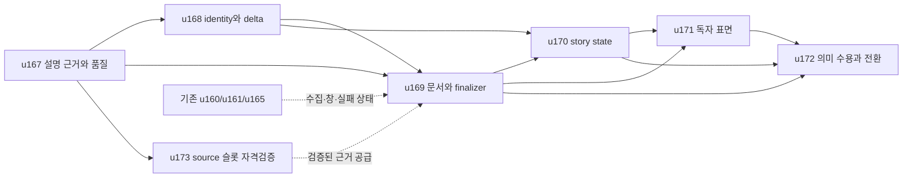

# 이벤트·뉴스 중심 시황 v3

**Date**: 2026-10-10. **Status**: 설계 작성, 구현 미착수. 설계 승인·운영 수용은 별도 기록한다.

## 목표

독자가 지난 발행 이후 무엇이 달라졌는지, 어떤 사실이 확인됐는지, 왜 시장에 관련되는지, 어떤 반응이 관측됐는지, 다음에 무엇을 확인할지 이해하도록 문서 전체를 사건 단위로 구성한다. 가격·거시·실적 수치는 사건을 설명하는 데 쓰고, 변하지 않은 배경은 참고 자료로 제공한다.

사용자는 “문서로 작성 진행해줘. 그 과정에서 기존것에서 불필요한건 과감하게 버려도 되고, 구조를 바꿔도 됨”이라고 지시했다. 이에 따라 고정 7섹션, 가격표 우선, 정확히 3개 요약, 중복 상단 콜아웃을 v3의 필수 구조에서 제거한다. 이 문서는 구현과 운영 전환을 위한 설계이며 현재 공개물의 형식을 변경하지 않는다.

## 독자가 읽는 순서

1. **첫 30초:** 뉴스 관측기간과 새 변화 0~3개를 읽고 당일 핵심을 이해한다.
2. **다음 3분:** 중요 사건 0~5개에서 새 사실, 시장 관련성, 확인된 반응과 출처를 읽는다.
3. **후속 확인:** 진행 중인 이슈의 이전 상태, 이번 변화, 열린 질문과 다음 확인을 읽는다.
4. **참고:** 사건별 자산 영향과 접힌 가격·거시·주간 잔액·원문·품질 자료를 확인한다.

수치 없는 법안·협상·서비스·발언도 근거와 시장 관련성이 있으면 선정한다. 수치 자체가 뉴스인 금리 결정·실적 결과는 필수 수치와 기간을 충분히 설명한다. 큰 가격 변화의 원인이 미확인이라면 관측 사실과 그 한계를 표시한다. 사건이 적은 날은 짧게 발행하며 정상적인 조용한 날과 수집 장애를 구별한다.

## 기존 개편에서 확장하는 부분

u157~u162는 사건 선정, 근거 보호, ② 본문과 요약, 최종 검증, 뉴스창, 원문 보강, 정성 관전의 기반을 제공한다. v3는 이를 재사용하며 문서 전체 모델, 설명 역할별 근거, 정규화한 사실 변화, 장기 이슈 상태, 모든 독자 표면과 실제 의미 수용을 확장한다.

2026-10-10 분석 당시 runtime pin `7bc6d287`에서 국내·미국 event v2는 active, 코인은 shadow/v1이었다. 뉴스창은 shadow, 신규 원문 HTTP는 off, 사람 의미 수용은 pending이었다. 구현자는 현재 원격 코드와 runtime을 다시 확인해야 한다. 검토한 9편·preview·golden의 범위는 [근거 문서](evidence.md)에 보관했다. 기반 분석은 `19c89b92`, 최종 문서 작업 기준은 새 main `48762793`다. 작업 중 추가된 u154/u165/u166 완료 기록도 보존했다.

## 설계 문서 지도

| 문서 | 책임 |
|---|---|
| [독자 경험·기능 설계](functional-design.md) | 문서 순서, 사건별 내용, 조용한 날과 실패, 자산 영향 |
| [공통 계약](contracts.md) | C1~C8, 타입 소유권, 고정 상한과 기본값 |
| [처리·실패 규칙](business-rules.md) | 선정·생성·최종화·상태 기록의 단계별 소유권 |
| [비기능 설계](nfr-design.md) | 성능·신뢰·권리·비공개 자료·원자성·확장 한계 |
| [폐기·전환 계획](migration-and-retirement.md) | 제거·대체·유지할 기능과 전환 순서 |
| [수용·운영 전환](acceptance-and-rollout.md) | 실제 사건 검수, 시장별 preview, 운영 수용 |
| [검토 반영](review-resolution.md) | 독립 리뷰에서 확인한 계약 보완과 검증 한계 |
| [근거와 상태](evidence.md) | 코드·생성물·운영 snapshot과 분석의 한계 |

## 실행 단위

| 유닛 | 목적 | 구현 선행조건 |
|---|---|---|
| [u167](../plans/u167-event-context-evidence-and-quality-code-generation-plan.md) | 설명용 chunk·ref·시간·품질 축 | 기존 u157/u158/u161 |
| [u168](../plans/u168-canonical-event-identity-and-fact-delta-code-generation-plan.md) | entity/fact 정규화·실제 변화·30일 이력 | u167 |
| [u169](../plans/u169-event-first-document-and-finalization-code-generation-plan.md) | 전체 문서 모델·2단계 schema·단일 finalizer | u167/u168 |
| [u170](../plans/u170-story-state-and-follow-up-ledger-code-generation-plan.md) | 장기 상태·열린 질문·해결 근거·확정 ledger | u168/u169 |
| [u171](../plans/u171-event-reader-surfaces-and-asset-impact-code-generation-plan.md) | 웹·알림·홈·회고·시각·관심자산의 같은 원본 | u169/u170 |
| [u172](../plans/u172-real-event-semantic-acceptance-and-cutover-code-generation-plan.md) | 균형 평가·사람 검수·실제 preview·전환·구형 제거 | u169/u170/u171; corpus 준비는 독립 가능 |
| [u173](../plans/u173-official-event-source-slot-qualification-code-generation-plan.md) | 정책·실적·국내 공시의 정보 슬롯 자격검증 | typed 출력은 u167; 발견·접근 조사는 독립 가능 |

점선은 입력 품질과 운영 수용 관계다. 모든 신규 source가 성공할 때까지 기존 근거로 하는 v3 개발을 막지는 않는다. 실제 source 범위와 미검증 경로는 제한으로 명시한다. u160 cursor, u161 body HTTP, u173 슬롯 자격검증은 문서 schema 선택과 별도로 수용한다.

## 제거와 유지

필수 7섹션, 부족한 요약 채우기, 가격표 우선, 중복 상단 블록, 새 발표 없는 월간값·잔액의 매일 headline 승격, 본문 첫 문장 80자 제한, 빈 legacy bridge는 v3에서 제거한다. 과거 archive 읽기, source 권한, numeric/entity/freshness/compliance 검증, 면책, 단일 seal, 원격 확인과 부분 발행, 실행 예산, 공개·운영자 채널 분리는 유지한다.

최종 main `48762793`의 기록에서 u154는 뉴스 우선·접힌 시장 자료 배치와 운영 전달을 완료했다. v3는 이 구현을 재사용하면서 정확히 3개 요약과 7섹션 계약을 대체한다. u165/u166의 소스 상태·가격 수리 완료 기록도 별도 owner로 유지한다. u156의 예약 Telegram 소유권도 유지하고 u171이 기존 owner에 통합한다.

## 완료의 의미

설계 작성, 코드 구현, 원격 CI, 실제 사람 수용, 시장별 운영 전환, 최초 3회 예약 발행, 최종 구형 제거는 각각 다른 완료조건이다. 7개 유닛의 구현 단계는 모두 0이며 문서 작성으로 운영 합격을 만들지 않는다.
