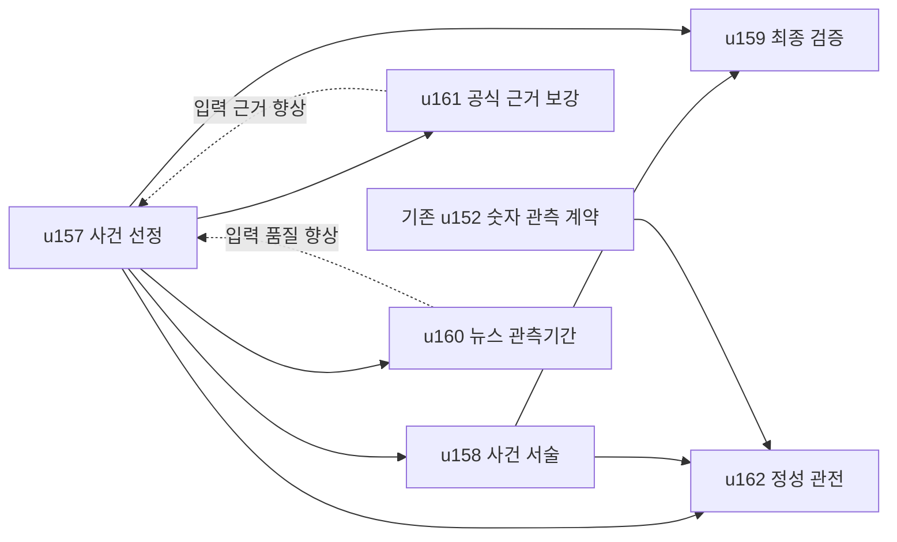

# 뉴스·이벤트 중심 시황 개발 설계

**Date**: 2026-09-26
**Status**: 2026-09-27 사용자 순차 개발 승인; u157(d5aa8f28)·u158(c3f2e5ef) 원격 전달 완료, u159 코드·검증 완료(전체5652 통과). 유닛 완료마다 커밋·푸시하며 사람 의미 검수와 운영 활성화는 별도다.
**Baseline**: `04978d81ec9ece8f4083e4be190c6539bdf3b5ff` (origin/main).
**Source**: 사용자 “그럼, 해당 기획을 유닛으로 정리하고, 어떻게 개발할지 설계해줘”.

## 목표와 독자 경험

독자가 페이지 첫 부분에서 어제 새로 일어난 중요한 사건, 무엇이 달라졌는지, 왜 시장에 중요한지 파악하게 한다. 숫자는 사건과 반응을 입증하는 근거로 유지한다. 금리 결정폭·실적 실제치처럼 사건 자체인 숫자는 축소하지 않는다.

기본 읽기 흐름은 기존 anchor 표 → 한눈에 보기 3개 → ① 종합 설명 → ② 중요 사건 0~5개 → ③~⑤ 관련 반응·배경 → ⑥ 다음 확인 사항이다. 사건 3~5개는 목표이며 최소 할당량이 아니다. 사건 종류를 매일 하나씩 채우지 않는다. 근거가 부족하면 부족하다고 표시한다.

예시 형식(합성, 실제 뉴스 아님):
> **기업 A, 신규 서비스 출시** — 9월 25일 기업 A가 서비스 B를 출시했다고 발표했다.
> **달라진 점**: 기존 기업 고객 전용 서비스가 개인 고객에게도 제공된다.
> **시장에 중요한 이유**: 고객군 확대가 사업 구조에 영향을 줄 수 있다. 매출 효과는 아직 확인되지 않았다.
> **시장 반응**: 시장 반응은 확인하지 못했습니다. 원문 발표 링크.

## 근거

[2026-09-22 검토](evidence/review-20260922.md), [18편 표본](evidence/sample-inventory.json). 국내/미국 12편의 첫 이슈가 가격 등락, 전체13/18 상단 요약 fallback, 반복 월간 지표·옛 재무수치, 사건 설명 깊이 부족을 확인했다. 이 통계는9/22 스냅샷이며9/26 재집계값이 아니다. c286f500→04978d81의 src/config/workflows/관련 계획 diff는 없어 원인 분석을 재사용한다.

## 유닛과 순서

| 유닛 | 책임 | Hard dependency | 설계 상태 |
|---|---|---|---|
| u157 event-evidence-selection-contract | 사건 모델·선정·입력 보존 | 기존 u58/u59/u93/u97 완료 | 코드 완료, 운영 off |
| u158 event-first-narrative-and-summary | 사건 설명·요약·terminal projection | u157 | 코드 완료, preview ready, 운영 active off |
| u159 event-coverage-replay-and-gate | 최종 반영 검증·평가셋 | u157/u158 | 코드 완료, 사람 의미 수용 pending, 운영 off |
| u160 publication-news-observation-window | 거래일과 별도 뉴스기간·cursor 원자성 | u157 공통 발행 확인 기반; 기존 u113/u144 완료 | 창 설계 병렬 가능, cursor 통합은 선행 구현 후 |
| u161 bounded-official-event-evidence | 기존 피드 복구 판정·공식 근거 보강 | 보강 런타임은 u157; 자격검증은 독립 | qualification 단계 준비, 신규 fetch는 gate |
| u162 qualitative-event-watchpoints | 사건 상태 기반 관전 포인트 | u157/u158/u152 | 설계 승인, 선행 유닛 이후 순차 개발 |

u156은 별도 로컬 `codex/u156-telegram-narrative-first-digest` 브랜치 이름을 예약된 작업으로 존중하여 사용하지 않는다. 해당 ref에는 계획/구현이 없어 완료 상태를 추정하지 않는다.

점선은 데이터 품질 향상 경로이며 구현 선행조건이 아니다. u157은 현 입력으로 개발한다. 1차 제품 활성화는 u157+u158+u159를 함께 검증한 후 한다. u160 window/adapter 작업과 u161 자격검증은 병렬 진행할 수 있다. u160 cursor 통합은 u157의 공통 발행 확인 기반 이후다. u162는 숫자 resolver 우회를 막기 위해 u152 뒤에 통합한다.

## 문서 지도

- [공통 데이터 계약](event-contract.md): E1~E11, identity, Stage1/2 버전, 상태와 budget.
- [처리·실패 규칙](business-rules.md): B1~B12, 후보→선정→생성→봉인→알림.
- [문서 검증 결과](validation.json): 등록·AC·의존성·링크·변경 범위 검사.
- [독립 검토 반영 기록](review-resolution.md): 3명 검토, 22건 수정 의견과 처리.
- [NFR·평가·출시](nfr-and-validation.md): NF1~NF10, fixtures, activation.

| 유닛 | 상세 설계 | 개발 계획 |
|---|---|---|
| u157 | [설계](../u157-event-evidence-selection-contract/design-brief.md) | [구현 단계와 AC](../plans/u157-event-evidence-selection-contract-code-generation-plan.md) |
| u158 | [설계](../u158-event-first-narrative-and-summary/design-brief.md) | [구현 단계와 AC](../plans/u158-event-first-narrative-and-summary-code-generation-plan.md) |
| u159 | [설계](../u159-event-coverage-replay-and-gate/design-brief.md) | [구현 단계와 AC](../plans/u159-event-coverage-replay-and-gate-code-generation-plan.md) |
| u160 | [설계](../u160-publication-news-observation-window/design-brief.md) | [구현 단계와 AC](../plans/u160-publication-news-observation-window-code-generation-plan.md) |
| u161 | [설계](../u161-bounded-official-event-evidence/design-brief.md) | [구현 단계와 AC](../plans/u161-bounded-official-event-evidence-code-generation-plan.md) |
| u162 | [설계](../u162-qualitative-event-watchpoints/design-brief.md) | [구현 단계와 AC](../plans/u162-qualitative-event-watchpoints-code-generation-plan.md) |

## 기존 소유권 보존

u97는 ranking 확장, u93는 같은 입력 예산, u59는 required macro/lineage를 유지한다. u103의 Fed/SEC RSS를 재등록하지 않는다. u123 source citation 수와 이번 사건 설명 완결성 지표는 별개다. u144가 유일한 finalizer/seal owner다. u154는 H1·TL;DR·hero의 순서, u158은 내용만 소유한다. u156의 Telegram layout을 만들지 않고 기존 sealed conclusion 및 호환 optional DTO만 제공한다. u152는 숫자 current, u162는 별도 event current family다.

## 범위와 현재 완료 의미

2026-09-26에는 설계·등록만 수행했고, 2026-09-27 사용자 요청으로 FD/NFR 및 유닛별 개발·검증·커밋·푸시를 승인받았다. 구현 완료와 운영 활성화를 구분한다. 운영 shadow의 5개 scheduled run, active 전환과 외부 게시·알림·Pages 검증은 별도 실행 범위다. 외부 피드의 HTTP200을 자격검증 완료로 간주하지 않는다. 가격 캘린더 재설계, 유료 API, 새 LLM 단계, 전 세계 뉴스 전수 포착, 과거 archive 일괄수정은 범위 밖이다.
