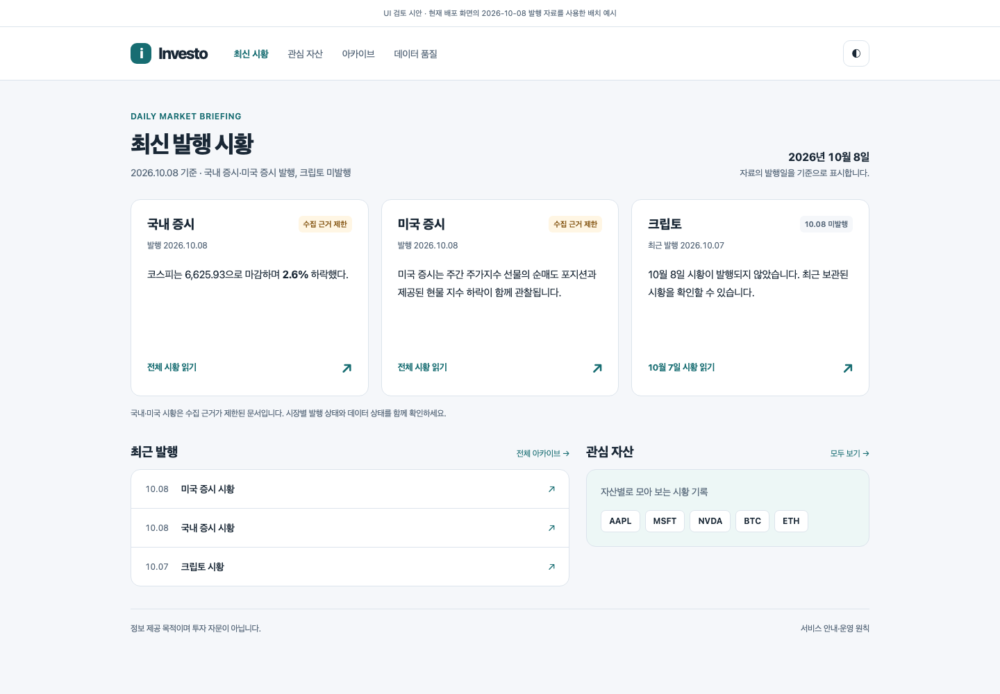

# Investo 웹 UI 개선 유닛 — 2026-10-10

- 요청: 현재 웹 UI를 확인하고 세련됨·직관성·가독성을 분석한 뒤, 사용자 “굿 일단 유닛 문서화부터 진행해줘”.
- 상태: **유닛 등록 및 계획 문서화**. 구현·디자인 승인·운영 배포 완료를 뜻하지 않는다.
- 최초 기획/코드 기준: `origin/main` **48762793**. 최종 문서 통합 기준은 **838bed60**이며, 작성 중 등록된 사건·뉴스 v3 u167–u173과 u145 완료 기록을 보존했다. 번호 충돌을 해소해 UI 유닛은 **u174–u179**로 등록한다. 두 기준 사이 애플리케이션 코드는 같고 설계/운영 기록만 추가됐다.
- 분석 기준: 로컬 코드 **4ea211b4**와 2026-10-10 **01:12–01:17 KST** 공개 사이트 관측. 화면의 최신 묶음은 2026-10-08이며 크립토 최근 발행은 2026-10-07이었다. 이는 날짜가 고정된 관측이며 이후 발행 상태를 단정하지 않는다.
- 격리 작업: `codex/ui-units-20261010` 작업 트리. 기존 루트의 미커밋 작업은 보존한다.

## 관측과 제안의 구분

1440×1000 라이트, 390×844 라이트, 1440×1000 다크에서 공개 페이지 6개를 렌더링했다. 일반 Browser 플러그인은 누락된 런타임 모듈 때문에 초기화되지 않아, 사용자 승인 후 독립된 headless Chromium으로 공개 화면을 관측했다. 이는 u145의 Browser 전용 인수 조건을 수행하거나 변경한 증거가 아니다. 이번 문서화에서는 별도의 브라우저 인수를 실행하지 않는다.

| 관측 | 증거 | 소유 유닛 |
|---|---|---|
| 발행 캘린더의 칸이 보이지 않는다. | SVG 자식·rect 0개, figure의 rect 160개는 XHTML namespace에 있다. 실제 빌드 HTML은 SVG 시작 태그를 문단으로 닫는다. | u174 |
| 미국 시황의 차트 펼치기가 실패한다. | `/2026-10-08/2026-10-08.assets/charts/us-equity-gspc.json` 요청 404. sibling `/2026-10-08.assets/charts/us-equity-gspc.json` 응답 200. | u175 |
| chart client가 Material 테마 위치와 다른 DOM을 읽는다. | 실제 `body`의 scheme은 `slate`, `html`은 null. client는 html을 읽고 관찰한다. 펼친 차트의 최종 테마 영향은 URL 복구 후 검증할 대상이다. | u175 |
| 홈 제목·설명·동일 최신 링크가 반복되고, 카드 안내와 실제 링크 범위가 다르다. | 홈은 제목+인용문이고, 미발행 시장은 hero에서 생략된다. | u176/u177 |
| 최신 묶음과 개별 시장의 최근 발행일을 더 쉽게 구분할 필요가 있다. | 모바일 첫 화면에는 크립토 미발행 안내가 없고 “오늘의 시황”은 10월 8일로 표시된다. | u177 |
| 관심 자산은 주요 메뉴에 없다. | 모바일 메뉴 DOM에 watchlist 경로가 없다. | u176 |
| 오래된 미국 시황은 요약 진입이 늦고 목차가 비어 있다. | 390×844에서 “한눈에 보기” 상단 약 1,945px, 전체 높이 9,101px, 목차 링크 0개. | u154 기존 개선 재사용 + u178 탐색 검증 |
| 정보 SVG가 모바일에서 축소되고, 누적 관심 자산 그래프 글자가 다크 모드에서 어둡다. | 1200px 이미지가 약 358px로 표시된다. 누적 그래프 글자 fill은 `#1f2937`/`#111827`로 고정된다. | u178 |
| 미국 아카이브는 날짜만 있는 긴 목록이다. | 날짜 링크 98개, 데스크톱 높이 3,664px. | u179 |

[측정값](evidence/metrics.json), [집중 확인 결과](evidence/focused-findings.json), [증거 매니페스트](evidence/manifest.json). 캘린더와 차트의 namespace/404는 직접 관측이다. 다른 디자인 방향은 그 관측에서 도출한 제안이며 효과를 인수했다고 주장하지 않는다.

## 등록 유닛과 순서

| 유닛 | 우선순위 / 규모 | 목적 | 단계 결정 | 의존성 |
|---|---|---|---|---|
| [u174 calendar-svg-render-integrity](../plans/u174-calendar-svg-render-integrity-code-generation-plan.md) | P0 / 작음 | 기존 발행 캘린더의 SVG DOM 복구 | 기존 기능 복원; 별도 FD/NFR 생략 사유를 계획에 명시 | 독립, u154의 md_in_html 유지 |
| [u175 chart-sidecar-url-and-theme-repair](../plans/u175-chart-sidecar-url-and-theme-repair-code-generation-plan.md) | P0 / 작음 | 배포 경로에서 차트 펼치기와 테마 동작 복구 | 기존 기능 복원; 별도 FD/NFR 생략 사유를 계획에 명시 | 독립, u50/u70/u75/u143 유지 |
| [u176 site-shell-and-navigation-redesign](../plans/u176-site-shell-and-navigation-redesign-code-generation-plan.md) | P1 / 중간 | 공통 디자인 토큰·메뉴·검색·레이아웃 | FD 및 집중 NFR 필요; 아직 미승인 | u174/u175과 병행 설계 가능 |
| [u177 latest-bundle-home-cards](../plans/u177-latest-bundle-home-cards-code-generation-plan.md) | P1 / 중간 | 3시장 홈 카드와 발행·품질 상태 통합 | FD 및 집중 NFR 필요; 아직 미승인 | u176 공통 토큰/탐색 계약 |
| [u178 responsive-briefing-data-and-accessibility](../plans/u178-responsive-briefing-data-and-accessibility-code-generation-plan.md) | P1 / 중간~큼 | 본문 데이터 가독성·표·목차·테마 접근성 | FD 및 집중 NFR 필요; 아직 미승인 | u176; 차트 동작 검증은 u175 복구 후 |
| [u179 month-grouped-archive-discovery](../plans/u179-month-grouped-archive-discovery-code-generation-plan.md) | P2 / 중간 | 월별 아카이브·날짜 탐색·검증된 요약 | FD 및 집중 NFR 필요; 아직 미승인 | u176; 캘린더 포함 검증은 u174 복구 후 |

권장 구현 순서: **u174 → u175 → u176 → u177 → u178 → u179**. 이는 실행 제안이며 현재 요청은 문서화까지다. u174/u175는 등록된 복구 계획 상태, u176–u179는 설계가 필요한 계획 상태로 둔다. 실제 코드 작업의 승인·검증·커밋·배포 기록은 향후 작업에서 따로 남긴다.

## 기존 유닛과 중복 방지

| 기존 소유자 | 재사용할 계약 | 이번 계획에서 분리한 부분 |
|---|---|---|
| u16/u29/u63/u82 | 사이트·시장별 최신 링크, marker 갱신, generated/missing/fallback 상태, site_index 하위 모듈 | 완성된 데이터/출판 경로는 재구현하지 않고 표현·탐색을 확장한다. |
| u50/u70/u75 | chart sidecar, 동일 앵커, 표시 라벨, expand 때만 history fetch | URL/theme 복구만 u175. DEBT-077 과거 inline history 복구와 DEBT-078 sparkline 도입은 제외한다. |
| u69/u96/u165 | canonical 품질 상태, 동일 날짜 cohort, ok/zero/failed/skipped 구분 | badge가 상태를 재판정하거나 과거 quality.md로 현재 상태를 추정하지 않는다. |
| u98/u152/u162 | 관전 포인트의 내용·현재값·사건 모델 | u178은 시각/탐색 계층이며 내용 선정·관찰 조건을 변경하지 않는다. |
| u108/u120/u143/u144 | provenance·보조 블록·테마 쌍·seal·artifact membership | 수치/원문/출처를 보존하고 새 표현은 설계된 seal 이전 경계 또는 읽기 전용 사이트 표시 경계에만 둔다. |
| u153/u154 | 완결된 요약, H1 하나, TLDR 3개, 뉴스 우선, 숫자 preamble의 닫힌 panel | 해당 완료 작업은 신규 유닛으로 반복하지 않는다. 기존 아카이브를 새 시황으로 재발행하지 않는다. |
| u145 | 미국 섹터 공개 모델·derived pair·freshness/last-good·메뉴·운영 경계 | 계획 기준 main의 `미국 섹터` 메뉴/사이트 무결성을 보존한다. 스케줄·소스·허가 예외·활성화 상태·Browser waiver를 변경하지 않는다. |

u145는 분석 이후 기획 기준 main에 추가된 기능이다. 이번 분석 증거에 섹터 페이지가 포함됐다고 소급 주장하지 않는다. 공통 shell 변경의 미래 검증 범위에는 포함한다.

## 동시 등록된 사건·뉴스 v3와의 역할 분리

최종 동기화에서 [event-news-v3](../event-news-v3/README.md)의 u167–u173을 확인했다. 해당 목표 설계는 아직 구현 0이며 현재 v1/v2 코드와 구분한다. UI 개선이 새 사건 문서의 의미·구조를 다시 정의하거나 구형 생성기를 고정하는 장애물이 되어서는 안 된다.

| v3 소유자 | UI에서 재사용할 경계 |
|---|---|
| u169 event-first-document-and-finalization | schema3 문서 순서·PublicEditionView·EventVisualInput·단일 finalizer·sidecar/typed region은 기존 v3 유닛의 소유다. u176/u178은 CSS/HTML 가독성과 탐색 표현만 제공한다. |
| u171 event-reader-surfaces-and-asset-impact | 홈·시장 index의 digest→동일 terminal headline→사건 0일 때 availability, event archive reader/hash 검증, E1 visual/source-backed 영향은 v3 유닛의 소유다. u177은 세 시장 카드·날짜·상태·링크 배치, u178은 반응형 presentation, u179는 월별 grouping/filter만 소유한다. |
| u172 real-event-semantic-acceptance-and-cutover | 세 시장 semantic acceptance·활성화·legacy generator 폐기는 별도 경계다. 이번 UI 인수로 이를 승인하거나 대체하지 않는다. |

u154의 H1/TLDR3/숫자 panel과 legacy 카드 4종은 현재 v1/v2/역사 자료의 호환 범위다. **v3에 강제3요약·7H2·기본 hero·legacy callout fallback·legacy 카드 모델 bridge를 추가하지 않는다.** u177/u178/u179 FD는 현재 입력과 v3 typed 입력을 분리하고 v3의 의미/provenance 선택은 기존 소유자를 소비한다. v3 consumer seam이 구현되기 전에는 실제로 존재한다고 가정하지 않는다. 같은 `site_index`/`visuals/assets.py`를 변경하는 구현은 u171과 조정해 순서·함수 소유권·패치 단위를 정하며 무조정 병렬 작업을 금지한다.

## 디자인 후보

[상호작용 가능한 홈 시안](evidence/home-concept.html)은 색·간격·카드 배치의 후보다. 발행 자료는 고정된 2026-10-08 예시이며 운영 UI가 아니다. 검색과 미국 섹터 링크 등 최신 사이트 전체의 기능을 완성한 시안이 아니므로 그대로 운영 템플릿으로 복사하면 안 된다.

[모바일 후보](evidence/home-concept-mobile.png) · [다크 후보](evidence/home-concept-desktop-dark.png) · [후보 측정](evidence/concept-metrics.json).

예시의 390×844 화면에서는 세 카드가 761px 안에 들어온다. 실제 요약 길이·폰트 확대·언어 설정에 따라 높이는 달라지므로 세 카드 전체가 언제나 첫 화면에 들어가야 한다는 강제 계약을 만들지 않는다. 세 시장의 이름/발행 상태/빠른 진입을 쉽게 찾고, 본문을 잘라내지 않으며, 200% 확대에서도 내용이 접근 가능해야 한다.

## 고정된 공통 경계

1. MkDocs Material/GitHub Pages 구조를 사용한다. 새 SPA·백엔드·회원·구독·유료 서비스·추가 데이터 수집은 범위 밖이다.
2. 원본 archive 영구 경로와 sealed Markdown/hash/notification DTO는 보존한다. DOM 표현이 숫자·as-of·면책·source provenance를 바꿔서는 안 된다.
3. 미발행, 이전 발행, 품질 제한, source skipped는 별개 상태다. 미확인 상태를 정상으로 보정하지 않는다.
4. 단순 색상 차이로 상태를 전달하지 않는다. 키보드 탐색·focus·라이트/다크·모바일 가독성과 JavaScript 없는 기본 접근을 설계/검증한다.
5. 실측 문제의 복구를 제외한 새 제품 계약은 FD/NFR 산출물에서 확정한다. 미결 질문을 구현자가 임의로 승인한 것으로 취급하지 않는다.
6. 실제 배포/운영 인수는 사이트 코드·Pages와 private production runtime의 적용 대상을 구분한다. 브리핑 producer 변경은 public main push만으로 private runtime에 적용됐다고 주장하지 않는다.

## 문서 리뷰 및 검증

초안 작성과 독립 리뷰를 다른 에이전트가 담당한다. 상세 결과는 [review-record.md](review-record.md)에 기록한다. 현재 구현 단계 체크리스트는 모두 미실행이며 코드 테스트·브라우저 인수·운영 활성화를 통과했다고 기록하지 않는다.

문서 완료 조건: 여섯 계획과 state의 번호/slug/상태가 일치하고, 참조 경로와 기존 owner/test가 확인되며, 요구 단계와 의존성에 모순이 없고, `git diff --check`가 통과해야 한다.
