# Execution Plan: Investo

**Date**: 2026-04-26
**Project Type**: Greenfield (1인 개발/운영, Python + GitHub Actions 파이프라인)

---

## Detailed Analysis Summary

### Change Impact Assessment
- **User-facing changes**: Yes — 신규 GitHub Pages 사이트 + 공개 텔레그램 채널 (Public Reader 노출)
- **Structural changes**: Yes — 시스템 자체가 신규 (greenfield)
- **Data model changes**: 없음 (외부 DB 없음). 내부 데이터 모델은 신규 정의 필요
- **API changes**: 외부 API 없음 (도구 자체가 입력=cron 출력=정적 사이트/텔레그램). 내부적으로 데이터 소스 plugin 인터페이스 신규 필요
- **NFR impact**: 다수 — 비용 0원(NFR-002), 컴플라이언스 면책(NFR-004), 신뢰성/graceful degradation(NFR-003), 확장성/plugin(NFR-005), 성능 ≤10분(NFR-001)

### Risk Assessment
- **Risk Level**: **Low** — 1인 운영, 외부 의존성은 모두 무료·교체 가능, 실패해도 비즈니스 영향 없음(개인 도구)
- **Rollback Complexity**: Easy — git revert + 정적 사이트 재배포로 즉시 복구
- **Testing Complexity**: Moderate — 외부 API 다수 + LLM 호출이라 mock/replay fixture 필요

### Component Sketch (preliminary — Application Design에서 확정)
- **Source Adapters** (plugin): 데이터 소스별 fetcher (뉴스, 시세, 거시, 캘린더 등) — US-001, US-008
- **Briefing Generator**: 수집 데이터 → Claude Code CLI → 7섹션 markdown — US-002, US-009
- **Publisher**: markdown 저장 + MkDocs 빌드 + git commit + Pages 배포 — US-003, US-006
- **Notifier**: 텔레그램 채널/Operator chat 디스패치 — US-004, US-007
- **Orchestrator / Workflow**: GitHub Actions YAML + Python entrypoint — US-005

대략 5개 컴포넌트. Plugin 확장은 Source Adapters 한 곳에 집중.

---

## Workflow Visualization

```mermaid
flowchart TD
    Start(["User Request"])

    subgraph INCEPTION["🔵 INCEPTION PHASE"]
        WD["Workspace Detection<br/><b>COMPLETED</b>"]
        RA["Requirements Analysis<br/><b>COMPLETED</b>"]
        US["User Stories<br/><b>COMPLETED</b>"]
        WP["Workflow Planning<br/><b>COMPLETED</b>"]
        AD["Application Design<br/><b>EXECUTE</b>"]
        UG["Units Generation<br/><b>EXECUTE</b>"]
    end

    subgraph CONSTRUCTION["🟢 CONSTRUCTION PHASE"]
        FD["Functional Design<br/>(per-unit, selective)<br/><b>EXECUTE</b>"]
        NFRA["NFR Requirements<br/><b>EXECUTE</b>"]
        NFRD["NFR Design<br/><b>SKIP</b>"]
        ID["Infrastructure Design<br/><b>SKIP</b>"]
        CG["Code Generation<br/><b>EXECUTE</b>"]
        BT["Build and Test<br/><b>EXECUTE</b>"]
    end

    subgraph OPERATIONS["🟡 OPERATIONS PHASE"]
        OPS["Operations<br/><b>PLACEHOLDER</b>"]
    end

    Start --> WD
    WD --> RA
    RA --> US
    US --> WP
    WP --> AD
    AD --> UG
    UG --> FD
    FD --> NFRA
    NFRA --> NFRD
    NFRD --> ID
    ID --> CG
    CG --> BT
    BT --> OPS
    OPS --> End(["Complete"])

    style WD fill:#4CAF50,stroke:#1B5E20,stroke-width:3px,color:#fff
    style RA fill:#4CAF50,stroke:#1B5E20,stroke-width:3px,color:#fff
    style US fill:#4CAF50,stroke:#1B5E20,stroke-width:3px,color:#fff
    style WP fill:#4CAF50,stroke:#1B5E20,stroke-width:3px,color:#fff
    style AD fill:#FFA726,stroke:#E65100,stroke-width:3px,stroke-dasharray: 5 5,color:#000
    style UG fill:#FFA726,stroke:#E65100,stroke-width:3px,stroke-dasharray: 5 5,color:#000
    style FD fill:#FFA726,stroke:#E65100,stroke-width:3px,stroke-dasharray: 5 5,color:#000
    style NFRA fill:#FFA726,stroke:#E65100,stroke-width:3px,stroke-dasharray: 5 5,color:#000
    style NFRD fill:#BDBDBD,stroke:#424242,stroke-width:2px,stroke-dasharray: 5 5,color:#000
    style ID fill:#BDBDBD,stroke:#424242,stroke-width:2px,stroke-dasharray: 5 5,color:#000
    style CG fill:#4CAF50,stroke:#1B5E20,stroke-width:3px,color:#fff
    style BT fill:#4CAF50,stroke:#1B5E20,stroke-width:3px,color:#fff
    style OPS fill:#FFF59D,stroke:#F57F17,stroke-width:2px,color:#000
    style Start fill:#CE93D8,stroke:#6A1B9A,stroke-width:3px,color:#000
    style End fill:#CE93D8,stroke:#6A1B9A,stroke-width:3px,color:#000

    linkStyle default stroke:#333,stroke-width:2px
```

---

## Phases to Execute

### 🔵 INCEPTION PHASE

- [x] Workspace Detection — COMPLETED
- [x] Reverse Engineering — SKIPPED (Greenfield)
- [x] Requirements Analysis — COMPLETED
- [x] User Stories — COMPLETED (9 stories, 2 personas)
- [x] Workflow Planning — IN PROGRESS (this document)
- [ ] **Application Design — EXECUTE**
  - **Rationale**: 5개 컴포넌트(Source Adapters / Briefing Generator / Publisher / Notifier / Orchestrator)와 plugin 인터페이스(US-008) 정의가 필요. 컴포넌트 의존성 그래프가 명확해야 /dev 단계에서 작업 단위 충돌이 없음.
- [ ] **Units Generation — EXECUTE**
  - **Rationale**: 솔로 개발이지만 incremental delivery에 도움. 컴포넌트별 unit으로 쪼개면 (1) 단위별 테스트 가능, (2) PR 단위 명확, (3) 데이터 수집 unit만 먼저 검증 가능 등 장점. 4~5개 단위 예상이라 과부담 없음.

### 🟢 CONSTRUCTION PHASE

- [ ] **Functional Design — EXECUTE (selective per-unit)**
  - **Rationale**: Briefing Generator unit은 LLM 프롬프트 계약, 면책조항 강제 삽입, retry 정책 등 비자명한 비즈니스 로직 보유. Source Adapters는 plugin 인터페이스 정의 필요. Publisher/Notifier 같이 단순한 unit은 design을 건너뛰고 바로 코드로.
- [ ] **NFR Requirements — EXECUTE**
  - **Rationale**: NFR-001(≤10분), NFR-002(비용 0), NFR-003(graceful degradation), NFR-004(면책), NFR-005(plugin) 모두 구체적 수용 기준 정의 필요. 향후 회귀 방지에 필수.
- [ ] **NFR Design — SKIP**
  - **Rationale**: 프로젝트 규모상 NFR Requirements가 이미 design 수준의 구체성 보유. 별도 design 산출물은 중복.
- [ ] **Infrastructure Design — SKIP**
  - **Rationale**: 인프라가 GitHub Actions YAML + GitHub Pages 설정 + GitHub Secrets로 매우 단순. 코드(YAML) 자체가 design. 별도 design 문서는 over-engineering.
- [ ] **Code Generation — EXECUTE (ALWAYS)**
  - **Rationale**: 실제 구현 산출물 필요.
- [ ] **Build and Test — EXECUTE (ALWAYS)**
  - **Rationale**: lint/type/unit/PBT 부분 적용 검증 필요.

### 🟡 OPERATIONS PHASE
- [ ] **Operations — PLACEHOLDER**
  - **Rationale**: 향후 모니터링/배포 워크플로우. 현재는 GitHub Actions 자체가 운영이라 별도 단계 불필요.

---

## Per-Unit Construction Strategy (Preview)

Application Design + Units Generation 후 확정되겠지만 현재 가정:

| Unit (가칭) | Functional Design | NFR Requirements | Notes |
|------------|-------------------|------------------|-------|
| u1: Source Adapters | EXECUTE (plugin interface) | EXECUTE (rate-limit, timeout) | US-001, US-008 |
| u2: Briefing Generator | EXECUTE (LLM contract, prompt) | EXECUTE (NFR-002 cost, NFR-004 disclaimer) | US-002, US-009 |
| u3: Publisher | SKIP (단순 markdown write + mkdocs) | EXECUTE (NFR-001 perf) | US-003, US-006 |
| u4: Notifier | SKIP (HTTP call wrapping) | EXECUTE (NFR-003 발송 실패 격리) | US-004, US-007 |
| u5: Orchestrator | SKIP (entrypoint + workflow YAML) | EXECUTE (NFR-001 ≤10분 전체) | US-005 |

(이 표는 Application Design / Units Generation 후 정식화)

---

## Estimated Timeline

- **Total Phases (Inception 잔여 + Construction)**: 7개 (AD, UG, FD, NFRA, CG, BT, + ops placeholder)
- **Estimated Duration**: 솔로 개발 기준 1~2주 (Inception 잔여 1~2일, Construction 1~2주)

## Success Criteria

- **Primary Goal**: 매일 KST 평일 07:00 / 토요일 09:00에 한국어 시황이 GitHub Pages + Telegram 채널로 자동 게시
- **Key Deliverables**:
  - Python 패키지 (Source Adapters + Briefing Generator + Publisher + Notifier + Orchestrator)
  - GitHub Actions cron workflow
  - MkDocs 사이트 + GitHub Pages 배포
  - 면책조항 자동 삽입된 시황 markdown (archive/YYYY/MM/YYYY-MM-DD.md)
- **Quality Gates**:
  - lint(ruff) + type(mypy strict) + test(pytest, hypothesis partial) 통과
  - 첫 cron 실행에서 에러 없이 시황 게시
  - 면책조항 누락 시 게시 차단 (자동 검증)
  - 단일 소스 실패가 전체를 죽이지 않음 (의도적 실패 주입 테스트)

---

## Extension Compliance Summary

| Extension | Status | Applicable Stages | Compliance Action |
|-----------|--------|-------------------|-------------------|
| Security Baseline | DECLINED | (n/a) | 별도 강제 없음. Secrets는 GitHub Secrets로 관리(NFR-007 baseline) |
| Property-Based Testing | PARTIAL | Code Generation, Build and Test | 순수 함수(데이터 정규화, 섹터 분류, 포맷 변환) + 직렬화 round-trip 한정 hypothesis 적용 |
