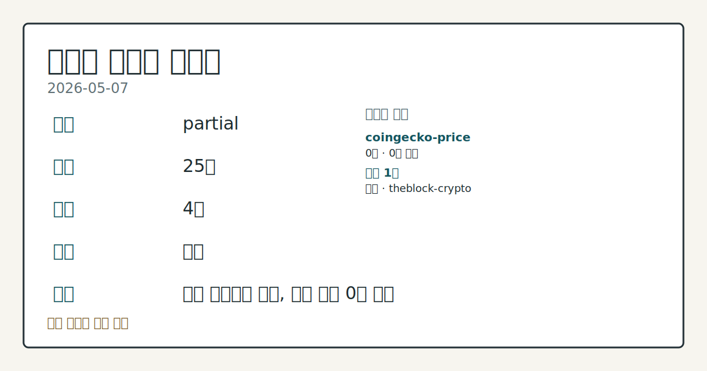
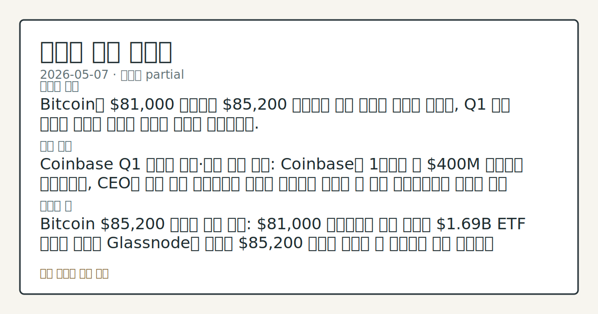
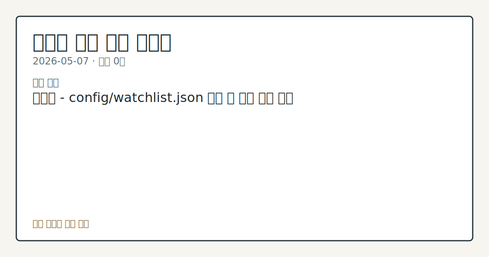

# 2026-05-07 크립토 시황

**기준 시각**: 2026-05-07 UTC · [2026-05-07T00:00Z, 2026-05-08T00:00Z)

**세그먼트**: [국내 증시](../../../domestic-equity/2026/05/2026-05-07.md) | [미국 증시](../../../us-equity/2026/05/2026-05-07.md) | [크립토](2026-05-07.md)

*이미지: 데이터 신뢰도 · 출처: investo 자체 생성 · 생성: investo 0.1.0 · 2026-05-08 UTC*

> **데이터 상태**: 부분 — 수집 25건 / 소스 4개 / 누락: 가격
> **상세 사유**: 가격 카테고리 누락, 일부 소스 0건 반환
> **소스별 상태**: coingecko-price 0건, 정상 1개
> **내 관심 자산 영향**: 관심 목록 미설정 — `config/watchlist.json`을 추가하면 보유 종목 영향이 표시됩니다.
> **오늘의 결론**: Bitcoin이 $81,000 근방에서 $85,200 저항선을 향해 압력을 높이는 가운데, Q1 실적 시즌이 크립토 업계의 구조적 전환을 가시화했다.
> **핵심 동인**: Coinbase Q1 대규모 손실·전략 전환 선언: Coinbase는 1분기에 약 $400M 순손실을 기록했으며, CEO는 스팟 중심 플랫폼에서 다양한 자산군을 거래할 수 있는 플랫폼으로의 전환을 공식 선언했다.
> **주의할 점**: Bitcoin $85,200 저항선 돌파 여부: $81,000 근방에서의 가격 흐름과 $1.69B ETF 순유입 행진이 Glassnode가 제시한 $85,200 돌파로 이어질 수 있는지가 단기 방향성의 핵심이다.

## ① 요약

*이미지: 시장 스냅샷 · 출처: investo 자체 생성 · 생성: investo 0.1.0 · 2026-05-08 UTC*

Bitcoin이 $81,000 근방에서 $85,200 저항선을 향해 압력을 높이는 가운데, Q1 실적 시즌이 크립토 업계의 구조적 전환을 가시화했다. Coinbase는 약 $400M 순손실을 기록하며 스팟 의존도 탈피를 공언했고, Block은 연간 가이던스를 상향했으나 Cash App Bitcoin 매출이 전년 대비 31% 감소했음을 확인했다. 반면 JPMorgan이 이란 분쟁 이후 Bitcoin이 금(gold)을 대체하는 평가절하 헤지 수단으로 자리 잡고 있다고 분석하면서 기관 내러티브는 더욱 강화됐다. 어제(2026-05-06) 입법 기대감과 기관 유입이 맞물려 형성된 강세 분위기에서 크게 이탈하지 않았으나, Q1 실적 결과는 거래소 수익 모델의 구조적 취약성을 재확인했다.

---

## ② 전일 핵심 이슈

**Coinbase Q1 대규모 손실·전략 전환 선언:** Coinbase는 1분기에 약 $400M 순손실을 [기록했으며](https://www.theblock.co/post/400489/coinbase-loses-nearly-400-million-ceo-seeks-to-reduce-dependence-spot-crypto-trading), CEO는 스팟 중심 플랫폼에서 다양한 자산군을 거래할 수 있는 플랫폼으로의 전환을 공식 선언했다. 수익 다각화 전략이 얼마나 빠르게 현실화될 수 있는지가 핵심 관건이다.

**Block, 가이던스 상향 vs. Bitcoin 수익 역성장:** Jack Dorsey의 Block은 "강한" Q1을 바탕으로 연간 가이던스를 [상향](https://www.theblock.co/post/400500/dorseys-block-raises-full-year-guidance-after-strong-q1-records-173-million-bitcoin-remeasurement-loss)했으나, Bitcoin 재평가 손실 $173M을 기록했고 Cash App Bitcoin 매출은 전년 대비 31% 하락했다. Square의 크립토 부문 기여는 사실상 미미한 수준이었다.

**JPMorgan: Bitcoin, 이란 분쟁 이후 금 대비 우위:** JPMorgan 애널리스트들은 이란 분쟁 이후 투자자들이 금 대신 Bitcoin을 평가절하 헤지 수단으로 선택하는 [추세를 확인](https://www.theblock.co/post/400486/jpmorgan-bitcoin-over-gold-debasement-trade-iran-conflict)했다고 밝혔다.

**Bitcoin ETF 유입 행진과 $85,200 저항선:** Bitcoin이 $81,000 근방에서 거래되는 가운데 $1.69B ETF 순유입 행진이 지속됐으며, [Glassnode는 $85,200을 다음 주요 저항선](https://www.theblock.co/post/400462/bitcoin-bulls-approaching-the-ceiling-near-85k-resistance-with-1-69b-etf-inflow-streak-and-macro-tailwinds-aligned-analysts)으로 제시했다.

**Binance 모니터링 준수 명령:** 미 재무부는 약 $1B 이상이 이란 연계 단체로 흘렀다는 보도와 함께 Binance에 2023년 제재·자금세탁 유죄 인정의 일환으로 체결된 [모니터링 프로그램 준수를 재차 요구](https://www.theblock.co/post/400454/treasury-demands-binance-comply-monitoring-guidelines-1-billion-iran-report)했다.

**AWS-USDC 결제 인프라 구축:** AWS가 AI 에이전트 결제를 위해 Coinbase와 Stripe를 활용한 [USDC 결제 인프라를 도입](https://www.theblock.co/post/400421/aws-taps-coinbase-and-stripe-to-power-usdc-payments-for-ai-agents)했다. 스테이블코인이 에이전트 경제의 핵심 결제 레일로 부상하고 있다는 구조적 신호다.

**Kraken 모회사, 홍콩 스테이블코인 기업 $600M 인수:** Kraken 모회사 Payward가 홍콩 스테이블코인 결제 기업 Reap Technologies를 [$600M에 인수](https://www.theblock.co/post/400407/kraken-parent-payward-to-acquire-hong-kong-stablecoin-firm-reap-for-600-million)하기로 합의하며 스테이블코인 결제 영역 확장에 나섰다.

**ZachXBT, LAB 프로젝트 조작 의혹 제기:** 블록체인 분석가 ZachXBT가 AI 트레이딩 터미널 프로젝트 LAB을 포함한 여러 소형 프로젝트의 [의심스러운 가격 행태를 공개](https://www.theblock.co/post/400465/zachxbt-accuses-projects-like-lab-of-highly-questionable-price-action-posts-10000-bounty-for-info-on-alleged-market-manipulation)하고 정보 제공에 $10,000 현상금을 내걸었다.

**Bitwise CEO, '4년 사이클 종언' 선언:** Bitwise의 Horsley는 기관 시대 도래를 이유로 4년 주기 사이클이 [끝났다고 선언](https://www.theblock.co/post/400381/bitwise-ceo-says-four-year-crypto-cycle-is-dead-as-institutional-era-takes-hold)했으며, Strategy의 STRC를 Bitcoin을 고정수익 시장으로 편입시킬 "거대한 동력"으로 표현했다.

---

## ③ 섹터/수급 동향

**ETF 라인업 확대:** 21Shares의 Canton Network ETF가 Nasdaq에 [상장되며](https://www.theblock.co/post/400436/crypto-etf-boom-continues-with-debut-of-first-fund-to-track-canton) 크립토 ETF 상품 다양화 흐름이 지속됐다.

**Kalshi $22B 밸류에이션 달성:** 예측 시장 플랫폼 Kalshi가 Coatue 주도 $1B Series F 라운드를 마감하며 기업가치 [$22B](https://www.theblock.co/post/400413/kalshi-hits-22-billion-valuation-after-1-billion-raise-led-by-coatue)을 달성했다. 2025년 11월 이후 기관 거래량이 800% 급증했다는 수치가 이번 밸류에이션의 근거로 제시됐다.

**Bitwise, Superstate 토큰화 펀드 인수:** Bitwise가 Superstate의 토큰화 Crypto Carry Fund($267M 규모)를 [인수](https://www.theblock.co/post/400415/bitwise-to-takeover-superstates-267-million-tokenized-crypto-carry-fund)하기로 합의했다. 스마트 컨트랙트와 토큰 주소는 유지되며, 기관 자산운용사의 온체인 제품 흡수가 가속화되는 모습이다.

**Sui, 스테이블코인 처리량 $1조 돌파:** Mysten Labs는 Sui가 지난 8월 이후 스테이블코인 거래량 [$1조 이상을 처리](https://www.theblock.co/post/400396/mysten-labs-abiodun-says-sui-processed-over-1-trillion-in-stablecoin-volume-since-august-as-it-eyes-free-private-payments)했다고 밝히며 무수수료·프라이빗 결제 로드맵을 제시했다.

**토큰화 주식 수요 현황:** Kraken 공동 CEO는 토큰화 주식이 기관의 물꼬를 단기에 트지는 않을 것이라며, 현재 수요는 핀테크와 신흥시장 사용자에게서 [주로 나오고 있다](https://www.theblock.co/post/400390/kraken-co-ceo-says-tokenized-equities-wont-open-the-floodgates-for-institutions-overnight)고 선을 그었다.

---

## ④ 지표·이벤트

크립토 세그먼트에 해당하는 구체적 온체인 지표 및 매크로 이벤트 데이터가 이번 입력에 제공되지 않았다.

---

## ⑤ 주요 종목

**실적 발표**

| 종목 | 내용 |
|------|------|
| COIN | Q1 약 $400M 순손실; 스팟 의존 탈피·다자산 플랫폼 전환 공식화 |
| SQ (Block) | 연간 가이던스 상향; Bitcoin 재평가 손실 $173M, Cash App Bitcoin 매출 전년비 31% 하락 |

**애널리스트 분석 대상**

| 종목 | 내용 |
|------|------|
| MSTR (Strategy) | JPMorgan: 올해 Bitcoin 매입 145,834 BTC(약 $11B) 기록, 현 속도 기준 연간 $30B 도달 가능 시사; TD Cowen, STRC 발행 확대·BTC Yield 전망 개선을 이유로 목표주가 [$395로 상향](https://www.theblock.co/post/400393/td-cowen-raises-strategy-price-target-to-395-on-shift-toward-strc-issuance-and-improved-btc-yield-outlook) |
| IREN | Nvidia가 최대 $2.1B 규모 지분 전환 가능 워런트를 취득하며 AI 인프라 확장 지원; [주가 급등](https://www.theblock.co/post/400498/iren-stock-surges-as-nvidia-backs-ai-expansion-with-warrants-tied-to-30-million-shares) |
| BTDR (Bitdeer) | AI 클라우드 ARR $43M(전월 대비 105% 성장); Benchmark, ["비교적 저평가" 평가와 함께 목표주가 $27 유지](https://www.theblock.co/post/400476/benchmark-calls-bitdeer-comparatively-inexpensive-as-it-reiterates-27-price-target-for-btdr-shares) |

---

## ⑥ 오늘의 관전 포인트

*이미지: 관심 자산 관련성 · 출처: investo 자체 생성 · 생성: investo 0.1.0 · 2026-05-08 UTC*

1. **Bitcoin $85,200 저항선 돌파 여부:** $81,000 근방에서의 가격 흐름과 $1.69B ETF 순유입 행진이 Glassnode가 제시한 $85,200 돌파로 이어질 수 있는지가 단기 방향성의 핵심이다.

2. **Coinbase 전략 전환의 시장 수용 여부:** Q1 손실 규모에도 불구하고 CEO의 다자산 플랫폼 전환 선언이 투자자 기대를 유지할 수 있는지, 혹은 수익 구조 불확실성으로 이어질지 확인이 필요하다.

3. **Binance 규제 리스크 확대 여부:** 재무부의 모니터링 준수 요구와 이란 연계 자금 흐름 보도가 추가적인 규제 조치로 이어질 경우 시장 심리에 미칠 영향을 주시해야 한다.

4. **스테이블코인 결제 인프라의 온체인 수요 전이:** AWS-USDC 연계와 Kraken의 Reap 인수로 가시화된 스테이블코인 결제 인프라 확장이 관련 프로젝트의 실질 온체인 거래량 증가로 이어지는지 확인할 필요가 있다.

5. **LAB 등 소형 알트코인 조작 의혹 후속 전개:** ZachXBT의 공개 고발과 $10,000 현상금 이후 추가 제보 및 프로젝트 측 대응이 나올 경우, 유사 소형 프로젝트들의 변동성 확대로 번질 가능성을 살펴야 한다.

## ⑦ 면책조항
본 시황은 일반 정보 제공을 목적으로 자동 생성된 자료이며,
특정 종목·자산에 대한 매매 권유나 투자 자문이 아닙니다.
투자 결정과 그 결과에 대한 책임은 전적으로 본인에게 있으며,
본 시황의 내용에 따라 발생한 손실에 대해 작성자는 일체의 책임을 지지 않습니다.