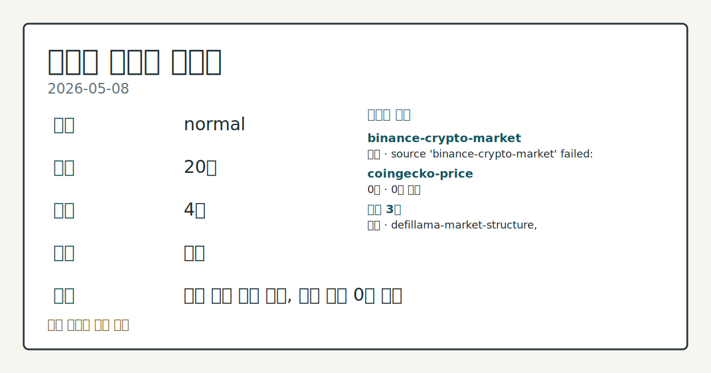
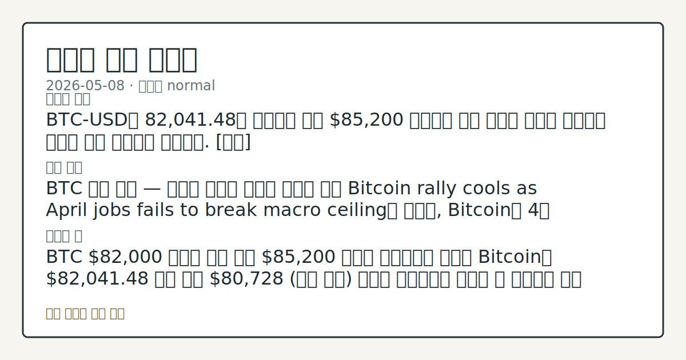
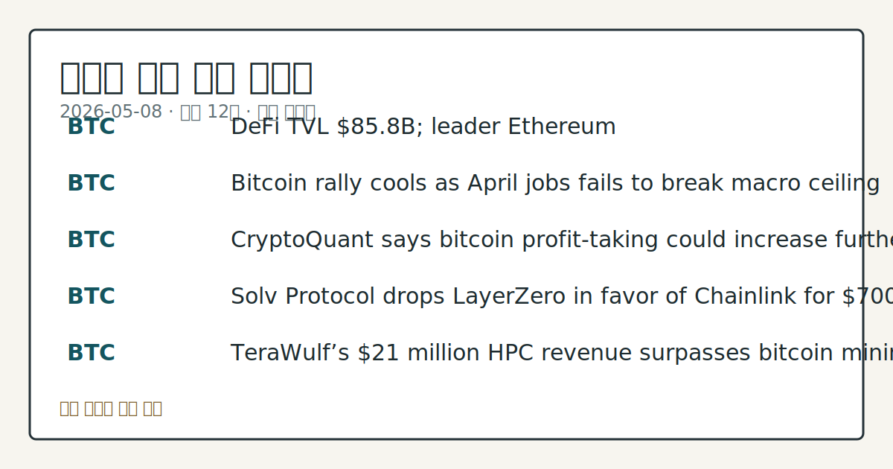

# 2026-05-08 크립토 시황

**기준 시각**: 2026-05-08 UTC · [2026-05-08T00:00Z, 2026-05-09T00:00Z)

**세그먼트**: [국내 증시](../../../domestic-equity/2026/05/2026-05-08.md) | [미국 증시](../../../us-equity/2026/05/2026-05-08.md) | [크립토](2026-05-08.md)

*이미지: 데이터 신뢰도 · 출처: investo 자체 생성 · 생성: investo 0.1.0 · 2026-05-09 UTC*

> **데이터 상태**: 부분 — 수집 34건 / 소스 5개 / 누락: 가격
> **소스 등급 분포**: S=1 / B=2
> **상세 사유**: 가격 카테고리 누락, 일부 소스 수집 실패, 일부 소스 0건 반환
> **소스별 상태**: binance-crypto-market 실패 (source 'binance-crypto-market' failed: status 451 (terminal)), coingecko-price 0건, 정상 3개
> **내 관심 자산 영향**: 12건 확인 (기본 바스켓) — BTC: DeFi TVL $85.8B; leader Ethereum; BTC: Bitcoin rally cools as April jobs fails to break macro ceiling with Iran tensions and ETF outflows in play; BTC: CryptoQuant says bitcoin profit-taking could increase further amid ‘bear market rally’; BTC: Solv Protocol drops LayerZero in favor of Chainlink for $700 million tokenized bitcoin; BTC: TeraWulf’s $21 million HPC revenue surpasses bitcoin mining for first time in Q1 외
> **오늘의 결론**: Bitcoin이 $80,200 부근에서 랠리를 멈추며 어제 $81,000 저항권 압박 흐름에서 소폭 후퇴했다. [데이터부족]
> **핵심 동인**: BTC 랠리 둔화 — 매크로·지정학 이중 부담 Bitcoin rally cools as April jobs fails to break macro ceiling with Iran tensions and ETF outflows in play 보도에 따르면, 4월 NFP 호조에도 Iran 긴장과 ETF 자금 유출이 겹치며 BTC는 $80,200 수준에 머물렀다.
> **주의할 점**: BTC $80,200 지지 여부 — ETF 자금 유출과 CryptoQuant의 "베어마켓 랠리" 경고가 지속되는 가운데, $80,000 이하 이탈 시 추가 차익실현 압력이 높아질 수 있다.

## ① 요약

*이미지: 시장 스냅샷 · 출처: investo 자체 생성 · 생성: investo 0.1.0 · 2026-05-09 UTC*

Bitcoin이 $80,200 부근에서 랠리를 멈추며 어제 $81,000 저항권 압박 흐름에서 소폭 후퇴했다. 4월 NFP(비농업고용지수)가 예상치를 상회했음에도 Iran 지정학적 긴장과 ETF(상장지수펀드) 자금 유출이 상승을 막는 이중 압력으로 작용했으며, CryptoQuant은 현재 흐름을 [베어마켓 랠리(하락장 내 단기 반등)]로 규정하며 추가 차익실현 가능성을 경고했다. 반면 미 상원 Banking Committee의 광범위한 암호화폐 입법 투표 일정이 확정되고 스테이블코인 법안 타협안이 도출되면서 규제 모멘텀은 꺼지지 않았다. 가격 동력과 제도화 기대가 엇갈린 하루였다. [혼조]

---

## ② 전일 핵심 이슈

**BTC 랠리 둔화 — 매크로·지정학 이중 부담**
[Bitcoin rally cools as April jobs fails to break macro ceiling with Iran tensions and ETF outflows in play](https://www.theblock.co/post/400567/bitcoin-rally-cools-as-april-jobs-fails-to-break-macro-ceiling-with-iran-tensions-and-etf-outflows-in-play) 보도에 따르면, 4월 NFP 호조에도 Iran 긴장과 ETF 자금 유출이 겹치며 BTC는 $80,200 수준에 머물렀다. CryptoQuant 또한 현 구간을 "베어마켓 랠리"로 분류하고 [차익실현(보유 포지션 매도)](https://www.theblock.co/post/400613/cryptoquant-bitcoin-profit-taking-bear-market-rally)이 심화될 수 있다고 경고했다. 지난 이틀간의 상승 모멘텀에서 이탈한 흐름이다.

**미 상원 — 암호화폐 입법 '두 번째 시도'**
[상원 Banking Committee가 포괄적 암호화폐 법안 수정·표결 일정을 확정](https://www.theblock.co/post/400492/take-two-senate-banking-committee-sets-a-date-to-amend-and-vote-on-sweeping-crypto-legislation)했다. 스테이블코인 법안을 둘러싼 입법자 간 타협이 이루어지며 ["분위기가 바뀌었다"는 평가](https://www.theblock.co/post/400608/shifted-vibes-stablecoin-deal-revives-crypto-bill-despite-lingering-ethics-disputes)도 나왔다. 다만 Duke Law 강사 Lee Reiners는 [Trump 연계 World Liberty Financial의 거버넌스 토큰이 증권 요건을 충족한다](https://www.theblock.co/post/400616/duke-law-lecturer-trump-connected-world-liberty-financial-issued-security)고 주장해 논란이 이어지고 있다.

**SEC(미증권거래위원회) — 온체인 시장 구조 신규 규정 예고**
SEC 의장 Paul Atkins는 [소프트웨어 애플리케이션과 온체인 시장 구조에 규제 프레임워크를 어떻게 적용할지 명확히 해야 한다](https://www.theblock.co/post/400587/sec-weighs-new-rulemaking-for-onchain-market-structures-and-software-applications)고 밝혔다. 단기 입법보다 긴 시간이 소요될 수 있으나, 탈중앙화금융(DeFi) 프로토콜 전반에 영향을 줄 수 있는 선제적 발언이다.

**Coinbase — AWS 연계 장애 후 거래 재개**
Coinbase는 [AWS(아마존웹서비스) 연계 장애로 수 시간 동안 거래가 정지](https://www.theblock.co/post/400536/coinbase-resumes-trading-after-aws-linked-disruption)됐다가 복구됐다. 'Cancel Only' 및 경매 모드가 일시 적용된 사건으로, 인프라 의존도 리스크가 다시 부각됐다.

**ECB(유럽중앙은행) Lagarde — 유로 스테이블코인 경계 발언**
ECB 총재 Lagarde는 [유로화 표시 스테이블코인이 금융 안정과 통화정책에 위험을 초래한다](https://www.theblock.co/post/400548/ecbs-lagarde-flags-euro-denominated-stablecoins-as-financial-stability-risk-diverging-from-bundesbank-stance)고 주장하며 디지털 유로를 대안으로 내세웠다. 독일 분데스방크와 다른 입장이어서 유럽 내 규제 방향 불확실성이 남아 있다.

**한국 — 해외 암호화폐 이전 감독 강화 및 세금 일정 확인**
[한국 당국이 암호화폐 해외 이전 기업에 대한 감독을 강화](https://www.theblock.co/post/400544/south-korea-tightens-oversight-of-firms-moving-crypto-overseas-report)하고 있으며, 2027년 1월부터 22% 자본이득세 부과 계획도 재확인됐다.

**크립토 물리적 강탈 공격 41% 급증**
CertiK 보고서에 따르면 [2026년 현재까지 34건의 'wrench attack(물리적 강탈)'이 확인](https://www.theblock.co/post/400601/crypto-wrench-attacks-rise-victims-family-members-risk-certik)됐고, 전년 동기 대비 41% 증가했다. 피해자 가족까지 표적이 되는 사례가 늘고 있다고 CertiK은 경고했다.

---

## ③ 섹터/수급 동향

**DeFi(탈중앙화금융) TVL — Ethereum 독주 구도 유지**
[DefiLlama](https://defillama.com/)에 따르면 DeFi 전체 TVL(총예치자산)은 $85.8B로 집계됐다. 체인별 TVL은 Ethereum $45.6B, Solana $5.8B, BSC(바이낸스 스마트체인) $5.6B, Bitcoin $5.3B, Tron $5.1B 순이다. Ethereum이 전체의 절반 이상을 점유하며 유동성 허브 지위를 유지하고 있다.

**스테이블코인 공급 — $320.0B, USDT 압도적 우위**
스테이블코인 총 공급은 $320.0B이며 USDT $189.6B, USDC $78.0B, USDS $7.9B, DAI $4.7B, USD1 $4.4B 순이다. 상위 두 자산이 전체의 83% 이상을 차지하는 과점 구조다.

**토크나이즈드(실물연계) Bitcoin — 브릿지 이전**
Solv Protocol이 [$700M 규모의 토크나이즈드(토큰화) Bitcoin 브릿지를 LayerZero에서 Chainlink로 전환](https://www.theblock.co/post/400520/solv-protocol-layerzero-chainlink)했다. 보안 이슈를 주된 이유로 밝혔으며, 최근 LayerZero 기반 Kelp DAO 익스플로잇(취약점 공격) 사건에 대한 직접적 반응으로 해석된다. 이는 크로스체인 인프라에 대한 시장의 신뢰 재편 흐름을 보여준다.

**크립토의 전통 금융화 — Consensus에서 확인**
Consensus 컨퍼런스에서 [암호화폐가 전통 금융(TradFi) 방향으로 이동하는 7가지 아이디어](https://finance.yahoo.com/markets/crypto/articles/7-ideas-consensus-show-crypto-072000213.html)가 제시됐다. OCC(미통화감독청) 트러스트 차터 신청 움직임 등과 맞물려 기관화 흐름이 두드러지는 국면이다.

---

## ④ 지표·이벤트

**UST(미국채) 금리 곡선 — 2026-05-08 기준**
[미 재무부](https://home.treasury.gov/resource-center/data-chart-center/interest-rates) 발표 기준, 3M 3.69%, 2Y 3.90%, 10Y 4.38%, 30Y 4.95%다. 2Y10Y 스프레드는 +0.48%p, 3M10Y 스프레드는 +0.69%p로 정상 경사를 유지하고 있다. 10Y 4.38% 수준은 위험자산 전반의 할인율을 높이는 구조적 압력으로, BTC를 포함한 크립토 자산의 밸류에이션에 지속적인 상방 저항으로 작용한다.

**4월 NFP — 예상치 상회, 매크로 천장 미돌파**
4월 비농업고용지수가 예상치를 웃돌았으나 BTC 랠리를 추가로 견인하지는 못했다. 강한 고용 데이터가 FOMC(연방공개시장위원회) 금리 인하 기대를 제한하는 방식으로 역설적으로 작용한 것으로 풀이된다.

**예정된 주요 이벤트 없음**
입력된 주요 일정 데이터가 없어 이번 주 forward-looking watch list는 생략한다.

---

## ⑤ 주요 종목

**관전 분류 — BTC 및 광범위 시장**

| 자산 | 내용 |
|------|------|
| **BTC** | $80,200 부근 횡보. [CryptoQuant](https://www.theblock.co/post/400613/cryptoquant-bitcoin-profit-taking-bear-market-rally): "베어마켓 랠리" 경고, 차익실현 증가 추세 |
| **HYPE** | Hyperliquid Strategies, 2025년 12월 설립 이후 $216M 투입·약 730만 HYPE 매입. 2026년 3월까지 9개월 순손실 $165M 기록 |

**실적 및 거래 항목**

| 종목 | 내용 |
|------|------|
| **IREN** | [Bernstein, NVIDIA와 $3.4B 클라우드 계약 체결 후 목표주가 $100 제시](https://www.theblock.co/post/400571/bernstein-100-iren-target-3-4-billion-nvidia-ai-deal). 76% 상승 여력 추정 |
| **COIN (Coinbase)** | [Bernstein, '에브리싱 익스체인지(종합거래소)' 전략 유효 판단, 목표주가 $330·71% 상승 여력 유지](https://www.theblock.co/post/400552/bernstein-says-coinbases-everything-exchange-strategy-is-gaining-traction-despite-weak-first-quarter-results-sees-71-upside). 당일 AWS 장애 발생·복구 |
| **WULF (TeraWulf)** | [Q1 HPC(고성능컴퓨팅) 매출 $21M으로 Bitcoin 채굴 매출을 첫 추월](https://www.theblock.co/post/400578/terawulfs-21-million-hpc-revenue-surpasses-bitcoin-mining-first-time-q1). 순수 채굴 모델에서 AI·HPC 전환 사례 |
| **Galaxy Digital** | [SEC EDGAR 8-K 제출(2026-05-08)](https://www.sec.gov/Archives/edgar/data/1859392/000162828026032991/0001628280-26-032991-index.htm): Item 1.01 중대한 확정계약 체결 공시. 세부 내용 미공개 상태 |

**확인 항목 — 거버넌스·프로토콜**

| 프로토콜 | 내용 |
|----------|------|
| **ARB (Arbitrum)** | [DAO(탈중앙화자율조직), Kelp DAO 복구를 위한 $70M ETH 방출 승인](https://www.theblock.co/post/400527/arbitrum-dao-approves-eth-release). 단, 2026-05-01 법원 명령으로 자금 이전이 제한됨. Aave가 긴급 법적 대응 |
| **APT (Aptos)** | [생태계 프로젝트에 $50M 투입 결정, 에이전틱(자율형) AI 포함](https://www.theblock.co/post/400523/aptos-commits-50-million-across-stack) |
| **LINK (Chainlink)** | Solv Protocol의 $700M 토크나이즈드 Bitcoin 브릿지를 LayerZero에서 수임 |
| **Kraken (비상장)** | 모기업 Payward, [OCC 전국 트러스트 차터 신청](https://www.theblock.co/post/400592/kraken-parent-payward-applies-national-occ-trust-charter-ripple-coinbase). PNTC(Payward National Trust Company) 설립 목표. Ripple·Coinbase에 이은 세 번째 사례 |

---

## ⑥ 오늘의 관전 포인트

*이미지: 관심 자산 관련성 · 출처: investo 자체 생성 · 생성: investo 0.1.0 · 2026-05-09 UTC*

1. **BTC $80,200 지지 여부** — ETF 자금 유출과 CryptoQuant의 "베어마켓 랠리" 경고가 지속되는 가운데, $80,000 이하 이탈 시 추가 차익실현 압력이 높아질 수 있다. 어제 $81,000 부근 공방에서 후퇴한 흐름이 이어지는지 확인이 필요하다.

2. **ETF 자금 흐름** — ETF 유출이 1회성인지 추세적인지가 매크로 천장 돌파 가능성의 핵심 변수다. 유입 전환 여부를 일별로 점검해야 한다.

3. **미 상원 Banking Committee 입법 표결** — 스테이블코인 법안 타협 이후 광범위한 크립토 입법의 수정·표결 일정이 확정된 만큼, 법안 내용과 부대 조건(특히 World Liberty Financial 관련 이해충돌 조항)이 시장 심리에 영향을 줄 수 있다. 2026-05-06 규제 기대 강세 흐름의 연장선에서 입법 진척이 단기 지지력을 제공할 가능성이 있다.

4. **SEC 온체인 시장 구조 규정 예고** — Chair Atkins의 발언이 구체적인 입법 예고로 이어질 경우 DeFi TVL 구성 자산과 탈중앙화 거래소 관련 토큰에 직접적인 규제 리스크로 작용할 수 있다.

5. **Galaxy Digital 8-K 세부 공개** — Item 1.01 중대한 확정계약의 상대방과 조건이 공개되는 시점에 시장이 반응할 수 있다. 현재 세부 내용 미공개 상태이므로 추가 공시 확인이 필요하다.

6. **Arbitrum DAO 법적 분쟁** — $70M ETH 방출에 대한 법원 명령과 Aave의 긴급 대응이 DAO 거버넌스 결정의 법적 구속력 논쟁으로 번질 경우 ARB 및 관련 프로토콜 전반에 전례를 남길 수 있다.

📑 트레이스 + 서명 (Stage 1/2)

- `input_hash`: `8c0c9de1cc32`
- `stage1_hash`: `e5af5812b923`
- `stage2_hash`: `272dc4d3aa12`

| 항목 ID | 소스 | 카테고리 | 섹션 | 제목 |
|---------|------|----------|------|------|
| 0 | defillama-market-structure | macro | — | DeFi TVL $85.8B; leader Ethereum |
| 1 | defillama-market-structure | macro | 3 | Stablecoin supply $320.0B; leader USDT |
| 2 | sec-edgar-8k | news | 3 | 8-K: AMERICAN REBEL HOLDINGS INC (CIK 0001648087) |
| 3 | sec-edgar-8k | news | — | 8-K: Calidi Biotherapeutics, Inc. (CIK 0001855485) |
| 4 | sec-edgar-8k | news | — | 8-K: LANTRONIX INC (CIK 0001114925) |
| 5 | sec-edgar-8k | news | — | 8-K: NEKTAR THERAPEUTICS (CIK 0000906709) |
| 6 | sec-edgar-8k | news | — | 8-K: Live Nation Entertainment, Inc. (CIK 0001335258) |
| 7 | sec-edgar-8k | news | — | 8-K: Galaxy Digital Inc. (CIK 0001859392) |
| 8 | sec-edgar-8k | news | 5 | 8-K: Lifeloc Technologies, Inc (CIK 0001493137) |
| 9 | sec-edgar-8k | news | — | 8-K: IMMUCELL CORP /DE/ (CIK 0000811641) |
| 10 | sec-edgar-8k | news | — | 8-K: Stardust Power Inc. (CIK 0001831979) |
| 11 | theblock-crypto | news | — | Take two: Senate Banking Committee sets a date to amend a… |
| 12 | theblock-crypto | news | 2 | Duke law lecturer argues Trump-connected World Liberty Fi… |
| 13 | theblock-crypto | news | 2 | CryptoQuant says bitcoin profit-taking could increase fur… |
| 14 | theblock-crypto | news | 5 | ‘Shifted the vibes:’ Stablecoin deal revives crypto bill… |
| 15 | theblock-crypto | news | 2 | Crypto ‘wrench attacks’ on the rise, with victims’ family… |
| 16 | theblock-crypto | news | 2 | Kraken parent Payward applies for national OCC trust char… |
| 17 | theblock-crypto | news | 5 | SEC weighs new rulemaking for onchain market structures a… |
| 18 | theblock-crypto | news | 2 | TeraWulf’s $21 million HPC revenue surpasses bitcoin mini… |
| 19 | theblock-crypto | news | 5 | Bernstein sets $100 IREN target after $3.4 billion NVIDIA… |
| 20 | theblock-crypto | news | 5 | Bitcoin rally cools as April jobs fails to break macro ce… |
| 21 | theblock-crypto | news | 2 | Bernstein says Coinbase’s ‘everything exchange’ strategy… |
| 22 | theblock-crypto | news | 5 | Senator Warren presses Meta over stablecoin trial ahead o… |
| 23 | theblock-crypto | news | 2 | ECB’s Lagarde flags euro-denominated stablecoins as finan… |
| 24 | theblock-crypto | news | 2 | South Korea tightens oversight of firms moving crypto ove… |
| 25 | theblock-crypto | news | 2 | Coinbase resumes trading after hours of AWS-linked disrup… |
| 26 | theblock-crypto | news | 2 | Taiwan news anchor indicted for allegedly taking crypto p… |
| 27 | theblock-crypto | news | — | Arbitrum DAO approves $70 million ETH release for Kelp DA… |
| 28 | theblock-crypto | news | 5 | Aptos commits $50 million across ecosystem projects, incl… |
| 29 | theblock-crypto | news | 5 | Solv Protocol drops LayerZero in favor of Chainlink for $… |
| 30 | theblock-crypto | news | 5 | Hyperliquid Strategies posts $165 million net loss for ni… |
| 31 | treasury-rates | macro | 5 | UST curve 2026-05-08: 10Y 4.38%, 2Y10Y +0.48pp |
| 32 | yahoo-finance-news | news | 4 | Bitcoin and ethereum prices today, Friday, May 8, 2026: P… |
| 33 | yahoo-finance-news | news | 2 | 7 ideas from Consensus that show crypto’s shift toward tr… |

## ⑦ 면책조항
본 시황은 일반 정보 제공을 목적으로 자동 생성된 자료이며,
특정 종목·자산에 대한 매매 권유나 투자 자문이 아닙니다.
투자 결정과 그 결과에 대한 책임은 전적으로 본인에게 있으며,
본 시황의 내용에 따라 발생한 손실에 대해 작성자는 일체의 책임을 지지 않습니다.