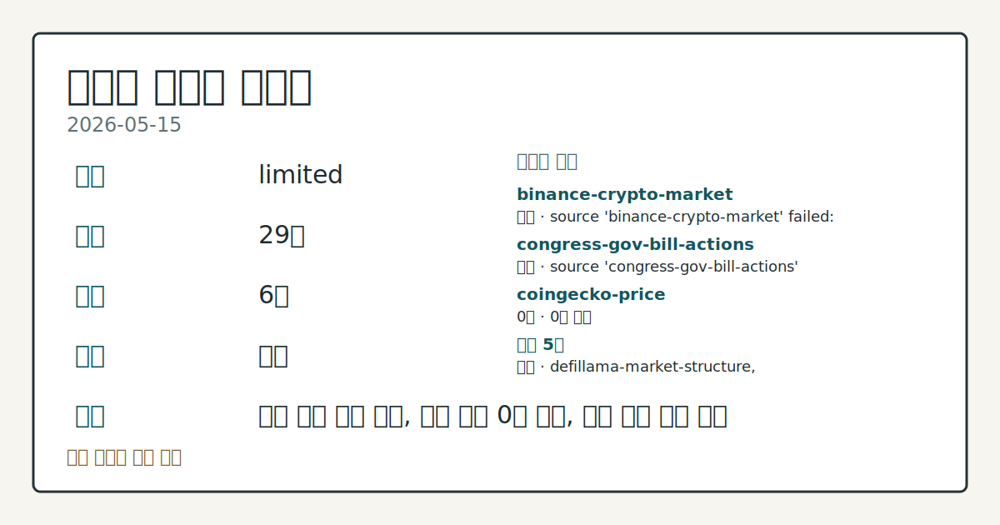
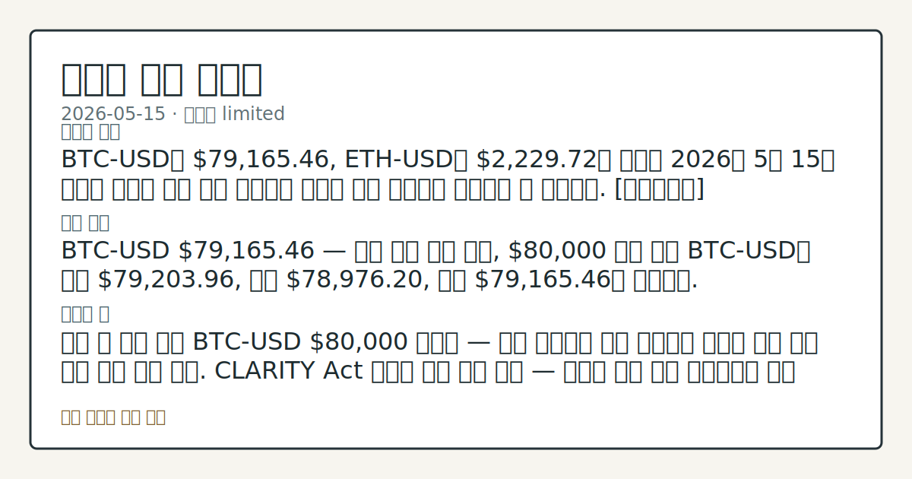
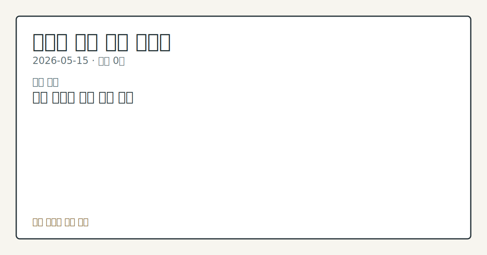

# 2026-05-15 크립토 시황

**기준 시각**: 2026-05-15 UTC · [2026-05-15T00:00Z, 2026-05-16T00:00Z)

| 종목 | 종가 | 변동 | 비고 |
|------|------|------|------|
| BTC-USD | 77,910.42 | -0.28% | +24.25% from 52w low · -12.20% YTD |
| ETH-USD | 2,177.29 | -0.11% | +19.52% from 52w low · -27.43% YTD |

**세그먼트**: [국내 증시](../../../domestic-equity/2026/05/2026-05-15.md) | [미국 증시](../../../us-equity/2026/05/2026-05-15.md) | [크립토](2026-05-15.md)

*이미지: 데이터 신뢰도 · 출처: investo 자체 생성 · 생성: investo 0.1.0 · 2026-05-17 UTC*

> **데이터 상태**: 제한 — 수집 26건 / 소스 6개 / 누락: 없음 · 제한 — 핵심 가격 소스 0건/실패/stale, 본문 결론 신뢰도 낮음
> **소스 카운트**: 수집 대상 8 / 성공 5 / 0건 1 / 실패 2 / 본문 사용 0
> **소스 등급 분포**: S=3 / B=2
> **상세 사유**: 일부 소스 수집 실패, 일부 소스 0건 반환, 핵심 가격 소스 실패
> **소스별 상태**: binance-crypto-market 실패 (source 'binance-crypto-market' failed: status 451 (terminal)), congress-gov-bill-actions 실패 (source 'congress-gov-bill-actions' failed: CONGRESS_API_KEY not set; congress-gov-bill-actions adapter will not run), coingecko-price 0건, 정상 5개
> **내 관심 자산 영향**: 데이터 수집 부족으로 매칭 판단 보류 — 추가 수집 후 재평가됩니다.
> **용어 가이드**: 이번 시황에서 처음 등장한 용어 — 스테이킹(예치보상)
> **오늘의 결론**: 2026년 5월 15일 크립토 시장에서 BTC-USD는 **$77,944.75**에 마감하며 전일(2026-05-14) 반등 흐름이 재차 꺾인 것으로 확인됐다. [데이터부족]
> **핵심 동인**: ### BTC-USD, 전일 반등 이탈 — Strategy 매도 가능성 부각 2026년 5월 14일 시황에서 확인된 반등 흐름이 이번 영업일에 재차 역전돼, BTC-USD 종가 **$77,944.75**는 2026-05-13 기준선이었던 **$79,607.01** 아래로 내려섰다.
> **주의할 점**: BTC-USD 종가 **$77,944.75**가 장중 저점 **$77,787.42** 근방에서 지지력을 이어가는지 추세 확인 THORChain 거래 중단의 최종 피해 규모 집계 및 재개 공식 발표 내용 점검 Strategy의 Bitcoin 매도 실행 여부와 시장 수급에 미치는 영향 관찰 CLARITY Act 민주당 지지 확보 경과 — TD Cowen 통과 확률 40% 기준선의 변화 흐름 비교 OKX-Coinone 지분 20% 인수 건의 한국 금융당국 심사 일정 체크 DeFi TVL **$84.7**B 수준 유지 여부와

> 정보 제공용 자동 시황이며 가상자산 매매 권유가 아닙니다. 가상자산은 가격 변동성이 매우 큽니다.

## 한눈에 보기

- BTC-USD **$77,944.75** 종가로 하락 흐름 지속; ETH-USD도 **$2,178.29**로 **$2,200**선 하단 마감
- THORChain(크로스체인 프로토콜)이 최대 **$10M** 규모 멀티체인 익스플로잇 의혹으로 거래 전면 중단
- CLARITY Act(디지털자산 시장구조 법안) 상원 소위 통과 후 TD Cowen 통과 확률 **40%** — 법안 추가 진행 여부 본문 §② 확인

## ⓪ 오늘의 매크로

- **미 국채 수익률** — Forward Industries posts over 300% revenue growth but wider quarterly net loss amid SOL markdowns

## ① 요약

*이미지: 시장 스냅샷 · 출처: investo 자체 생성 · 생성: investo 0.1.0 · 2026-05-17 UTC*

2026년 5월 15일 크립토 시장에서 BTC-USD는 **$77,944.75**에 마감하며 전일 반등 흐름이 재차 꺾인 것으로 확인됐다. ETH-USD도 **$2,178.29**로 마감해 **$2,200**선 하단을 이어갔다. 미국 의회에서는 CLARITY Act가 상원 금융위원회 위원회 심의를 통과했으나 분석가들은 민주당 지지 확보라는 관문이 남아 있다고 지적했고, THORChain은 Bitcoin, Ethereum 등 복수 체인에 걸친 익스플로잇 의혹으로 거래를 중단했다. Strategy(비트코인 대형 보유 기업)의 전환사채 상환을 위한 Bitcoin 매도 가능성까지 부각되며, 수급·보안·규제 전선이 동시에 불안 신호를 발신한 하루였다. [하락 관찰]

## ② 전일 핵심 이슈

### BTC-USD, 전일 반등 이탈 — Strategy 매도 가능성 부각

2026년 5월 14일 시황에서 확인된 반등 흐름이 이번 영업일에 재차 역전돼, BTC-USD 종가 **$77,944.75**는 2026-05-13 기준선이었던 **$79,607.01** 아래로 내려섰다. 자금 흐름 측면에서 [Strategy의 공시](https://www.theblock.co/post/401482/strategy-to-retire-1-5-billion-in-convertible-notes-at-a-discount-may-sell-bitcoin-to-fund-buyback)가 주목된다 — Strategy는 2029년 만기 전환사채 **$1.5B**을 **$1.38B**에 환매하는 계획을 밝히며, 이 자금 조달을 위해 보유 Bitcoin을 매도할 수 있다고 언급해 추가 수급 압박 요인으로 부상했다.

### CLARITY Act, 상원 소위 통과 — 입법 완주 불강한성 지속

2026-05-14 [상원 은행위원회 집행 세션](https://www.banking.senate.gov/hearings/05/08/2026/executive-session)에서 CLARITY Act 위원회 통과가 확인됐다. [하원 금융서비스위원회 성명](http://financialservices.house.gov/news/documentsingle.aspx?DocumentID=411120)은 이를 지지했으나, [The Block 분석](https://www.theblock.co/post/401528/crypto-market-structure-bill-significant-hurdles-despite-senate-committee-win-analysts)에 따르면 TD Cowen은 통과 확률을 **33%**에서 **40%**로 소폭 상향하는 데 그쳤고, Benchmark는 추가적인 민주당 공조가 필수 조건이라고 평가했다. [하원 금융서비스위원회도 같은 날 6개 법안을 본회의로 송부](http://financialservices.house.gov/news/documentsingle.aspx?DocumentID=411121)했으나, 입법 완주까지는 복수의 관문이 남아 있는 상태다.

### THORChain, 최대 **$10**M 멀티체인 익스플로잇 의혹 — 거래 전면 중단

[보안 연구자 경고 보도](https://www.theblock.co/post/401462/thorchain-pauses-trading-as-security-researchers-flag-suspected-10m-multi-chain-exploit)에 따르면, Bitcoin, Ethereum, BNB Smart Chain, Base를 아우르는 멀티체인 익스플로잇이 의심되면서 THORChain이 거래를 전면 중단했다. 피해 규모는 최대 **$10M**으로 추정된다. DeFi(탈중앙화금융) 크로스체인 인프라의 보안 취약성이 재차 부각된 사례로, 스마트컨트랙트(자동실행 블록체인 계약) 리스크가 시장 심리에 미치는 영향을 관찰할 필요가 있다.

## ③ 섹터/수급 동향

### DeFi TVL 및 스테이블코인 공급 현황

[DefiLlama](https://defillama.com/) 기준 DeFi TVL(총예치자산)은 **$84.7B**로, 체인별로는 Ethereum **$44.2B**, Solana **$6.0B**, BSC(바이낸스 스마트 체인) **$5.6B**, Bitcoin **$5.2B**, Tron **$5.2B** 순이다. 스테이블코인(법정화폐 가치 연동 가상자산) 총 공급량은 **$321.6B**이며, USDT **$189.7B**, USDC **$77.0B**, USDS **$8.8B**, DAI **$4.6B**, USD1 **$4.5B** 순으로 집계됐다.

### Hyperliquid-CFTC 규제 압박 및 온체인 선물 시장 동향

[Bloomberg 보도](https://www.theblock.co/post/401512/hyperliquid-onchain-perps-offer-efficiency-transparency-ice-cme-cftc-oversight)에 따르면, ICE(인터콘티넨탈익스체인지)와 CME(시카고상업거래소)가 Hyperliquid에 CFTC(상품선물거래위원회) 등록을 요구하고 있다. Hyperliquid 측은 온체인 무기한선물(perps·레버리지 파생상품)이 효율성과 투명성 면에서 기존 거래소보다 우위에 있다고 반박했다. 한편 Jito CEO Lucas Bruder는 ["무엇이든 거래하는" 신규 온체인 사용자층의 증가](https://www.theblock.co/post/401530/new-era-for-crypto-users-who-trade-anything-everything-jito-goes-consumer-ceo-says)를 언급하며 소비자 방향 확장을 예고했다.

### NFT 토큰화 실물자산 전망

[OpenSea CMO Adam Hollander](https://www.theblock.co/post/401504/opensea-cmo-tokenized-pokemon-cards-rolexes-tickets-driving-next-nft-wave)는 AI 기술 발전이 포켓몬 카드, Rolex 시계, 공연 티켓 등 실물자산의 NFT(대체불가능토큰) 토큰화를 촉진할 것이라고 전망했다. 현 시점에서 직접적인 가격 변동 데이터는 확인되지 않으며, 구조적 방향성 제시에 해당한다.

## ④ 지표·이벤트

### UST 수익률 현황

2026-05-15 기준 [UST(미국국채)](https://home.treasury.gov/resource-center/data-chart-center/interest-rates) 수익률 곡선은 10Y **4.59%**, 30Y **5.12%**, 2Y **4.09%**, 3M **3.69%**이며, 2Y10Y(2년-10년 금리차) 스프레드는 **+0.50pp**다. 장기 금리 고공 유지 상황이 크립토 자산의 위험 선호 환경에 미치는 영향은 공유 매크로 블록(⓪)에서 추가로 확인할 수 있다.

### 국제 규제 이벤트

[폴란드 MiCA 입법](https://www.theblock.co/post/401493/poland-passes-mica-crypto-bill-zondacrypto-probe-deepens-report): 폴란드 의회가 MiCA(유럽연합 가상자산시장법)를 입법했으며, 붕괴한 거래소 Zondacrypto 관련 **$96M** 손실에 대한 검찰 수사가 병행 진행 중이다.

[미얀마 입법 동향](https://www.theblock.co/post/401468/myanmar-bill-proposes-death-penalty-for-scam-coercion-life-imprisonment-for-crypto-fraud-report): 사기 강요에 사형, 크립토 관련 범죄에 종신형을 부과하는 법안이 발의됐다.

[Tether 동결 자산 법적 분쟁](https://www.theblock.co/post/401443/victims-of-iran-attacks-seek-court-order-for-turnover-of-344-million-in-usdt-frozen-by-tether): 미국 내 이란 공격 피해자들이 Tether가 동결한 IRGC(이란혁명수비대) 연계 USDT **$344M**의 법원 이전 명령을 신청했다.

## ⑤ 주요 종목

<!-- u50 lightweight-charts-embed: placeholders consumed by site_docs/assets/investo-chart-init.js -->
<div class="investo-chart" id="chart-BTC-USD" data-ticker="BTC-USD" data-52w-high="126198.0703125" data-52w-low="60074.203125" data-history='[{"t":"2025-05-17","o":"103489.2890625","h":"103716.9453125","l":"102659.1796875","c":"103191.0859375","v":"37898552742"},{"t":"2025-05-18","o":"103186.953125","h":"106597.171875","l":"103142.6015625","c":"106446.0078125","v":"49887082058"},{"t":"2025-05-19","o":"106430.53125","h":"107068.71875","l":"102112.6875","c":"105606.1796875","v":"61761126647"},{"t":"2025-05-20","o":"105605.40625","h":"107307.1171875","l":"104206.515625","c":"106791.0859375","v":"36515726122"},{"t":"2025-05-21","o":"106791.3125","h":"110724.4609375","l":"106127.234375","c":"109678.078125","v":"78086364051"},{"t":"2025-05-22","o":"109673.4921875","h":"111970.171875","l":"109285.0703125","c":"111673.28125","v":"70157575642"},{"t":"2025-05-23","o":"111679.359375","h":"111798.90625","l":"106841.3046875","c":"107287.796875","v":"67548133399"},{"t":"2025-05-24","o":"107278.5078125","h":"109454.5234375","l":"106895.2890625","c":"107791.15625","v":"45903627163"},{"t":"2025-05-25","o":"107802.2734375","h":"109313.3046875","l":"106683.375","c":"109035.390625","v":"47518041841"},{"t":"2025-05-26","o":"109023.78125","h":"110376.8828125","l":"108735.640625","c":"109440.3671875","v":"45950461571"},{"t":"2025-05-27","o":"109440.40625","h":"110744.2109375","l":"107609.5546875","c":"108994.640625","v":"57450176272"},{"t":"2025-05-28","o":"108992.171875","h":"109298.2890625","l":"106812.9296875","c":"107802.328125","v":"49155377493"},{"t":"2025-05-29","o":"107795.5703125","h":"108910.046875","l":"105374.3984375","c":"105641.7578125","v":"56022752042"},{"t":"2025-05-30","o":"105646.2109375","h":"106308.9453125","l":"103685.7890625","c":"103998.5703125","v":"57655287183"},{"t":"2025-05-31","o":"103994.71875","h":"104927.1015625","l":"103136.1171875","c":"104638.09375","v":"38997843858"},{"t":"2025-06-01","o":"104637.296875","h":"105884.546875","l":"103826.953125","c":"105652.1015625","v":"37397056873"},{"t":"2025-06-02","o":"105649.8125","h":"105958.3125","l":"103727.546875","c":"105881.53125","v":"45819706290"},{"t":"2025-06-03","o":"105888.4765625","h":"106813.578125","l":"104920.84375","c":"105432.46875","v":"46196508367"},{"t":"2025-06-04","o":"105434.3671875","h":"105997.6953125","l":"104232.703125","c":"104731.984375","v":"44544857105"},{"t":"2025-06-05","o":"104750.78125","h":"105936.6875","l":"100436.8828125","c":"101575.953125","v":"57479298400"},{"t":"2025-06-06","o":"101574.3671875","h":"105376.7734375","l":"101169.5703125","c":"104390.34375","v":"48856653697"},{"t":"2025-06-07","o":"104390.6484375","h":"105972.7578125","l":"103987.3125","c":"105615.625","v":"38365033776"},{"t":"2025-06-08","o":"105617.5078125","h":"106497.0625","l":"105075.328125","c":"105793.6484375","v":"36626232328"},{"t":"2025-06-09","o":"105793.0234375","h":"110561.421875","l":"105400.234375","c":"110294.1015625","v":"55903193732"},{"t":"2025-06-10","o":"110295.6875","h":"110380.125","l":"108367.7109375","c":"110257.234375","v":"54700101509"},{"t":"2025-06-11","o":"110261.796875","h":"110384.21875","l":"108086.328125","c":"108686.625","v":"50842662052"},{"t":"2025-06-12","o":"108685.9140625","h":"108780.6953125","l":"105785.6875","c":"105929.0546875","v":"54843867968"},{"t":"2025-06-13","o":"105924.59375","h":"106182.546875","l":"102822.0234375","c":"106090.96875","v":"69550440846"},{"t":"2025-06-14","o":"106108.0859375","h":"106203.7578125","l":"104379.3671875","c":"105472.40625","v":"38007870453"},{"t":"2025-06-15","o":"105464.84375","h":"106157.1015625","l":"104519.8828125","c":"105552.0234375","v":"36744307742"},{"t":"2025-06-16","o":"105555.59375","h":"108915.375","l":"104997.625","c":"106796.7578125","v":"50366626945"},{"t":"2025-06-17","o":"106794.1171875","h":"107750.1953125","l":"103396.53125","c":"104601.1171875","v":"55964092176"},{"t":"2025-06-18","o":"104602.0703125","h":"105581.8515625","l":"103602.265625","c":"104883.328125","v":"47318089133"},{"t":"2025-06-19","o":"104886.7734375","h":"105250.890625","l":"103940.7734375","c":"104684.2890625","v":"37333806920"},{"t":"2025-06-20","o":"104681.03125","h":"106539.3828125","l":"102372.2109375","c":"103309.6015625","v":"50951862476"},{"t":"2025-06-21","o":"103315.078125","h":"104015.78125","l":"100973.0625","c":"102257.40625","v":"38360555118"},{"t":"2025-06-22","o":"102212.03125","h":"103351.6328125","l":"98286.203125","c":"100987.140625","v":"65536997201"},{"t":"2025-06-23","o":"100987.4765625","h":"106116.859375","l":"99705.75","c":"105577.7734375","v":"65237759656"},{"t":"2025-06-24","o":"105571.515625","h":"106316.828125","l":"104740.2421875","c":"106045.6328125","v":"48822986421"},{"t":"2025-06-25","o":"106047.40625","h":"108168.3984375","l":"105881.390625","c":"107361.2578125","v":"51624120283"},{"t":"2025-06-26","o":"107375.0703125","h":"108305.546875","l":"106666.3515625","c":"106960.0","v":"43891990613"},{"t":"2025-06-27","o":"106954.921875","h":"107772.46875","l":"106449.9921875","c":"107088.4296875","v":"45353692675"},{"t":"2025-06-28","o":"107090.546875","h":"107567.8828125","l":"106883.9765625","c":"107327.703125","v":"30037708335"},{"t":"2025-06-29","o":"107327.8203125","h":"108526.3046875","l":"107230.109375","c":"108385.5703125","v":"35534874438"},{"t":"2025-06-30","o":"108383.4375","h":"108798.7890625","l":"106759.6484375","c":"107135.3359375","v":"42064804590"},{"t":"2025-07-01","o":"107144.3828125","h":"107550.6796875","l":"105270.2265625","c":"105698.28125","v":"44110692247"},{"t":"2025-07-02","o":"105703.1015625","h":"109763.65625","l":"105157.3984375","c":"108859.3203125","v":"56248657737"},{"t":"2025-07-03","o":"108845.015625","h":"110541.4609375","l":"108605.796875","c":"109647.9765625","v":"50494742270"},{"t":"2025-07-04","o":"109635.65625","h":"109751.984375","l":"107296.3828125","c":"108034.3359375","v":"42616442656"},{"t":"2025-07-05","o":"108015.8359375","h":"108381.34375","l":"107842.2734375","c":"108231.1796875","v":"30615537520"},{"t":"2025-07-06","o":"108231.1875","h":"109731.625","l":"107847.015625","c":"109232.0703125","v":"36746020463"},{"t":"2025-07-07","o":"109235.328125","h":"109710.25","l":"107527.0546875","c":"108299.8515625","v":"45415696597"},{"t":"2025-07-08","o":"108298.2265625","h":"109198.96875","l":"107499.5546875","c":"108950.2734375","v":"44282204127"},{"t":"2025-07-09","o":"108950.2734375","h":"111925.375","l":"108357.6796875","c":"111326.5546875","v":"57927418065"},{"t":"2025-07-10","o":"111329.1953125","h":"116608.78125","l":"110660.75","c":"115987.203125","v":"95911605728"},{"t":"2025-07-11","o":"115986.234375","h":"118856.4765625","l":"115245.6875","c":"117516.9921875","v":"86928361085"},{"t":"2025-07-12","o":"117530.7109375","h":"118219.8984375","l":"116977.0234375","c":"117435.2265625","v":"45524560304"},{"t":"2025-07-13","o":"117432.203125","h":"119449.5703125","l":"117265.4375","c":"119116.1171875","v":"49021091807"},{"t":"2025-07-14","o":"119115.7890625","h":"123091.609375","l":"118959.1953125","c":"119849.703125","v":"181746419401"},{"t":"2025-07-15","o":"119853.8515625","h":"119935.5625","l":"115765.6875","c":"117777.1875","v":"98321661181"},{"t":"2025-07-16","o":"117777.1875","h":"120065.515625","l":"117064.8203125","c":"118738.5078125","v":"72162029070"},{"t":"2025-07-17","o":"118738.5078125","h":"120999.609375","l":"117508.21875","c":"119289.84375","v":"72363841798"},{"t":"2025-07-18","o":"119284.109375","h":"120851.9140625","l":"116925.984375","c":"118003.2265625","v":"77945799785"},{"t":"2025-07-19","o":"117998.125","h":"118541.3984375","l":"117388.4140625","c":"117939.9765625","v":"47564562765"},{"t":"2025-07-20","o":"117944.109375","h":"118865.03125","l":"116550.1328125","c":"117300.7890625","v":"57515447231"},{"t":"2025-07-21","o":"117306.46875","h":"119671.5625","l":"116584.3984375","c":"117439.5390625","v":"69820091744"},{"t":"2025-07-22","o":"117426.5","h":"120269.96875","l":"116233.2265625","c":"119995.4140625","v":"79217583118"},{"t":"2025-07-23","o":"119997.4453125","h":"120113.3515625","l":"117391.390625","c":"118754.9609375","v":"66608604537"},{"t":"2025-07-24","o":"118770.984375","h":"119535.453125","l":"117247.96875","c":"118368.0","v":"72627318560"},{"t":"2025-07-25","o":"118368.0","h":"118486.9765625","l":"114759.8203125","c":"117635.8828125","v":"104857024569"},{"t":"2025-07-26","o":"117644.84375","h":"118335.6875","l":"117181.2265625","c":"117947.3671875","v":"48508954046"},{"t":"2025-07-27","o":"117944.7265625","h":"119815.59375","l":"117859.6875","c":"119448.4921875","v":"54683390892"},{"t":"2025-07-28","o":"119457.5234375","h":"119819.7890625","l":"117441.4375","c":"117924.4765625","v":"64822943193"},{"t":"2025-07-29","o":"117938.5859375","h":"119273.8671875","l":"116987.3671875","c":"117922.1484375","v":"68463107433"},{"t":"2025-07-30","o":"117921.9921875","h":"118780.7265625","l":"115800.828125","c":"117831.1875","v":"68896148592"},{"t":"2025-07-31","o":"117833.6328125","h":"118919.984375","l":"115505.21875","c":"115758.203125","v":"69370346018"},{"t":"2025-08-01","o":"115738.953125","h":"116060.7734375","l":"112724.4453125","c":"113320.0859375","v":"91294530181"},{"t":"2025-08-02","o":"113320.390625","h":"114021.6015625","l":"112005.765625","c":"112526.9140625","v":"56870866000"},{"t":"2025-08-03","o":"112525.8046875","h":"114747.421875","l":"111943.8046875","c":"114217.671875","v":"48099615826"},{"t":"2025-08-04","o":"114223.921875","h":"115729.46875","l":"114130.40625","c":"115071.8828125","v":"35783028986"},{"t":"2025-08-05","o":"115072.1875","h":"115117.4375","l":"112701.109375","c":"114141.4453125","v":"61039182286"},{"t":"2025-08-06","o":"114140.9140625","h":"115737.8359375","l":"113372.25","c":"115028.0","v":"56379133510"},{"t":"2025-08-07","o":"115030.0546875","h":"117676.90625","l":"114279.7109375","c":"117496.8984375","v":"64051649681"},{"t":"2025-08-08","o":"117505.5","h":"117689.203125","l":"115917.4609375","c":"116688.7265625","v":"59713005166"},{"t":"2025-08-09","o":"116678.2734375","h":"117906.609375","l":"116363.8359375","c":"116500.359375","v":"54004312429"},{"t":"2025-08-10","o":"116497.71875","h":"119320.7109375","l":"116485.1640625","c":"119306.7578125","v":"64755458694"},{"t":"2025-08-11","o":"119306.8125","h":"122321.09375","l":"118159.03125","c":"118731.4453125","v":"90528784177"},{"t":"2025-08-12","o":"118717.6640625","h":"120302.46875","l":"118228.71875","c":"120172.90625","v":"72803657984"},{"t":"2025-08-13","o":"120168.9765625","h":"123682.453125","l":"118939.6328125","c":"123344.0625","v":"90904808795"},{"t":"2025-08-14","o":"123339.3984375","h":"124457.1171875","l":"117254.8828125","c":"118359.578125","v":"104055627395"},{"t":"2025-08-15","o":"118365.78125","h":"119332.3125","l":"116864.5703125","c":"117398.3515625","v":"68665353159"},{"t":"2025-08-16","o":"117398.421875","h":"117996.0625","l":"117271.953125","c":"117491.3515625","v":"48036922378"},{"t":"2025-08-17","o":"117492.7890625","h":"118595.7734375","l":"117279.5234375","c":"117453.0625","v":"45852169525"},{"t":"2025-08-18","o":"117453.90625","h":"117614.171875","l":"114723.6796875","c":"116252.3125","v":"72787808090"},{"t":"2025-08-19","o":"116241.859375","h":"116764.5","l":"112730.3984375","c":"112831.1796875","v":"71657600353"},{"t":"2025-08-20","o":"112828.0234375","h":"114625.796875","l":"112387.9609375","c":"114274.7421875","v":"67993811526"},{"t":"2025-08-21","o":"114275.6875","h":"114802.6484375","l":"111986.234375","c":"112419.03125","v":"57817883700"},{"t":"2025-08-22","o":"112433.734375","h":"117377.3984375","l":"111678.9453125","c":"116874.0859375","v":"82528088240"},{"t":"2025-08-23","o":"116866.3671875","h":"116996.25","l":"114536.109375","c":"115374.328125","v":"55377142586"},{"t":"2025-08-24","o":"115387.390625","h":"115615.0859375","l":"111060.546875","c":"113458.4296875","v":"73961489632"},{"t":"2025-08-25","o":"113456.8984375","h":"113637.84375","l":"109324.28125","c":"110124.3515625","v":"85706860190"},{"t":"2025-08-26","o":"110124.1015625","h":"112397.015625","l":"108762.0390625","c":"111802.65625","v":"69396320317"},{"t":"2025-08-27","o":"111795.7109375","h":"112619.4140625","l":"110398.265625","c":"111222.0625","v":"62137056409"},{"t":"2025-08-28","o":"111219.0546875","h":"113450.078125","l":"110900.921875","c":"112544.8046875","v":"58860155962"},{"t":"2025-08-29","o":"112550.5234375","h":"112619.0546875","l":"107559.625","c":"108410.8359375","v":"77843379644"},{"t":"2025-08-30","o":"108409.40625","h":"108929.3515625","l":"107444.4453125","c":"108808.0703125","v":"51486264208"},{"t":"2025-08-31","o":"108818.4609375","h":"109491.0","l":"108104.65625","c":"108236.7109375","v":"47986191770"},{"t":"2025-09-01","o":"108228.75","h":"109890.5859375","l":"107271.1796875","c":"109250.59375","v":"66870372995"},{"t":"2025-09-02","o":"109243.0703125","h":"111748.015625","l":"108454.03125","c":"111200.5859375","v":"74776999491"},{"t":"2025-09-03","o":"111190.6953125","h":"112600.2265625","l":"110582.9609375","c":"111723.2109375","v":"61119643565"},{"t":"2025-09-04","o":"111718.1484375","h":"112208.328125","l":"109347.2265625","c":"110723.6015625","v":"60131132901"},{"t":"2025-09-05","o":"110723.015625","h":"113357.4921875","l":"110233.3984375","c":"110650.984375","v":"60241647677"},{"t":"2025-09-06","o":"110650.5703125","h":"111275.015625","l":"110024.0859375","c":"110224.6953125","v":"21500719036"},{"t":"2025-09-07","o":"110221.328125","h":"111591.078125","l":"110211.625","c":"111167.6171875","v":"24618007520"},{"t":"2025-09-08","o":"111163.015625","h":"112869.234375","l":"110630.609375","c":"112071.4296875","v":"40212813407"},{"t":"2025-09-09","o":"112077.578125","h":"113225.4375","l":"110776.703125","c":"111530.546875","v":"45984480722"},{"t":"2025-09-10","o":"111531.25","h":"114275.25","l":"110940.078125","c":"113955.359375","v":"56377473784"},{"t":"2025-09-11","o":"113961.4296875","h":"115522.546875","l":"113453.8359375","c":"115507.5390625","v":"45685065332"},{"t":"2025-09-12","o":"115507.7890625","h":"116769.3828125","l":"114794.484375","c":"116101.578125","v":"54785725894"},{"t":"2025-09-13","o":"116093.5625","h":"116334.6328125","l":"115248.2734375","c":"115950.5078125","v":"34549454947"},{"t":"2025-09-14","o":"115950.2890625","h":"116181.5","l":"115222.3984375","c":"115407.65625","v":"32798036057"},{"t":"2025-09-15","o":"115399.6328125","h":"116747.8828125","l":"114461.0625","c":"115444.875","v":"52937859416"},{"t":"2025-09-16","o":"115423.7578125","h":"117005.2734375","l":"114813.09375","c":"116843.1875","v":"45781744593"},{"t":"2025-09-17","o":"116840.5078125","h":"117328.609375","l":"114794.9765625","c":"116468.5078125","v":"60528025996"},{"t":"2025-09-18","o":"116461.265625","h":"117911.7890625","l":"116188.796875","c":"117137.203125","v":"49457272032"},{"t":"2025-09-19","o":"117137.671875","h":"117479.7578125","l":"115141.8203125","c":"115688.859375","v":"38828473971"},{"t":"2025-09-20","o":"115691.125","h":"116191.1484375","l":"115473.5234375","c":"115721.9609375","v":"22864449614"},{"t":"2025-09-21","o":"115730.2265625","h":"115901.0859375","l":"115252.578125","c":"115306.09375","v":"22495852193"},{"t":"2025-09-22","o":"115309.21875","h":"115431.3125","l":"112037.6484375","c":"112748.5078125","v":"70684158591"},{"t":"2025-09-23","o":"112757.4765625","h":"113351.9140625","l":"111535.5703125","c":"112014.5","v":"47211853279"},{"t":"2025-09-24","o":"112007.6640625","h":"113986.2734375","l":"111229.640625","c":"113328.6328125","v":"48044595085"},{"t":"2025-09-25","o":"113330.1640625","h":"113541.0859375","l":"108713.3984375","c":"109049.2890625","v":"75528654284"},{"t":"2025-09-26","o":"109041.296875","h":"110359.1953125","l":"108728.9765625","c":"109712.828125","v":"57738288949"},{"t":"2025-09-27","o":"109707.140625","h":"109778.5","l":"109144.296875","c":"109681.9453125","v":"26308042910"},{"t":"2025-09-28","o":"109681.9453125","h":"112375.484375","l":"109236.9453125","c":"112122.640625","v":"33371048505"},{"t":"2025-09-29","o":"112117.875","h":"114473.5703125","l":"111589.953125","c":"114400.3828125","v":"60000147466"},{"t":"2025-09-30","o":"114396.5234375","h":"114836.6171875","l":"112740.5625","c":"114056.0859375","v":"58986330258"},{"t":"2025-10-01","o":"114057.59375","h":"118648.9296875","l":"113981.3984375","c":"118648.9296875","v":"71328680132"},{"t":"2025-10-02","o":"118652.3828125","h":"121086.40625","l":"118383.15625","c":"120681.2578125","v":"71415163912"},{"t":"2025-10-03","o":"120656.984375","h":"123944.703125","l":"119344.3125","c":"122266.53125","v":"83941392228"},{"t":"2025-10-04","o":"122267.46875","h":"122857.640625","l":"121577.5703125","c":"122425.4296875","v":"36769171735"},{"t":"2025-10-05","o":"122419.671875","h":"125559.2109375","l":"122191.9609375","c":"123513.4765625","v":"73689317763"},{"t":"2025-10-06","o":"123510.453125","h":"126198.0703125","l":"123196.046875","c":"124752.53125","v":"72568881188"},{"t":"2025-10-07","o":"124752.140625","h":"125184.0234375","l":"120681.96875","c":"121451.3828125","v":"76149412513"},{"t":"2025-10-08","o":"121448.3515625","h":"124167.09375","l":"121119.1796875","c":"123354.8671875","v":"65354305286"},{"t":"2025-10-09","o":"123337.0703125","h":"123739.34375","l":"119812.03125","c":"121705.5859375","v":"74653009425"},{"t":"2025-10-10","o":"121704.7421875","h":"122509.6640625","l":"104582.4140625","c":"113214.3671875","v":"153125018868"},{"t":"2025-10-11","o":"113236.4296875","h":"113429.7265625","l":"109760.5625","c":"110807.8828125","v":"110236934340"},{"t":"2025-10-12","o":"110811.515625","h":"115805.0625","l":"109715.5390625","c":"115169.765625","v":"93710414091"},{"t":"2025-10-13","o":"115161.6796875","h":"116020.484375","l":"113821.1875","c":"115271.078125","v":"71582026739"},{"t":"2025-10-14","o":"115264.8828125","h":"115502.8828125","l":"110029.484375","c":"113118.6640625","v":"92212917403"},{"t":"2025-10-15","o":"113113.96875","h":"113622.3828125","l":"110235.8359375","c":"110783.1640625","v":"72574132855"},{"t":"2025-10-16","o":"110782.171875","h":"111990.8125","l":"107537.03125","c":"108186.0390625","v":"87306423067"},{"t":"2025-10-17","o":"108179.1328125","h":"109235.8046875","l":"103598.4296875","c":"106467.7890625","v":"99703051669"},{"t":"2025-10-18","o":"106483.734375","h":"107490.984375","l":"106387.453125","c":"107198.265625","v":"37779905278"},{"t":"2025-10-19","o":"107204.3125","h":"109488.9921875","l":"106157.7890625","c":"108666.7109375","v":"47657008953"},{"t":"2025-10-20","o":"108667.4453125","h":"111711.03125","l":"107485.015625","c":"110588.9296875","v":"63507793085"},{"t":"2025-10-21","o":"110587.6328125","h":"113996.34375","l":"107534.75","c":"108476.890625","v":"101194375480"},{"t":"2025-10-22","o":"108491.53125","h":"109115.1328125","l":"106778.0","c":"107688.5859375","v":"80807013218"},{"t":"2025-10-23","o":"107679.4375","h":"111288.59375","l":"107548.4296875","c":"110069.7265625","v":"54944076060"},{"t":"2025-10-24","o":"110069.3515625","h":"111842.53125","l":"109770.1484375","c":"111033.921875","v":"48160816980"},{"t":"2025-10-25","o":"111032.6171875","h":"111947.703125","l":"110704.40625","c":"111641.7265625","v":"24707667305"},{"t":"2025-10-26","o":"111639.0546875","h":"115260.90625","l":"111268.484375","c":"114472.4453125","v":"41708524143"},{"t":"2025-10-27","o":"114479.8515625","h":"116273.3125","l":"113882.2890625","c":"114119.328125","v":"61761358733"},{"t":"2025-10-28","o":"114129.0859375","h":"116078.984375","l":"112291.6796875","c":"112956.1640625","v":"64528066504"},{"t":"2025-10-29","o":"112921.328125","h":"113642.7265625","l":"109368.71875","c":"110055.3046875","v":"62192043469"},{"t":"2025-10-30","o":"110059.1953125","h":"111612.3515625","l":"106376.6875","c":"108305.546875","v":"69673964814"},{"t":"2025-10-31","o":"108304.4140625","h":"111031.8203125","l":"108288.2734375","c":"109556.1640625","v":"60090359560"},{"t":"2025-11-01","o":"109558.625","h":"110574.8984375","l":"109372.953125","c":"110064.015625","v":"25871668762"},{"t":"2025-11-02","o":"110064.4296875","h":"111167.3125","l":"109523.453125","c":"110639.625","v":"34284209459"},{"t":"2025-11-03","o":"110646.90625","h":"110764.9140625","l":"105336.359375","c":"106547.5234375","v":"72852006359"},{"t":"2025-11-04","o":"106541.421875","h":"107264.8828125","l":"98962.0625","c":"101590.5234375","v":"110967184773"},{"t":"2025-11-05","o":"101579.234375","h":"104534.703125","l":"98989.9140625","c":"103891.8359375","v":"77584934804"},{"t":"2025-11-06","o":"103893.6640625","h":"104147.3046875","l":"100336.8671875","c":"101301.2890625","v":"63932752861"},{"t":"2025-11-07","o":"101286.2421875","h":"104052.9140625","l":"99257.0546875","c":"103372.40625","v":"92168030081"},{"t":"2025-11-08","o":"103371.703125","h":"103373.5625","l":"101458.0390625","c":"102282.1171875","v":"51446691095"},{"t":"2025-11-09","o":"102278.984375","h":"105418.3671875","l":"101468.875","c":"104719.640625","v":"59679243013"},{"t":"2025-11-10","o":"104723.7734375","h":"106564.6953125","l":"104350.6484375","c":"105996.59375","v":"69585887229"},{"t":"2025-11-11","o":"105996.859375","h":"107428.2578125","l":"102457.328125","c":"102997.46875","v":"71130078574"},{"t":"2025-11-12","o":"103011.4375","h":"105297.234375","l":"100836.6171875","c":"101663.1875","v":"64347179408"},{"t":"2025-11-13","o":"101674.1484375","h":"104005.4921875","l":"97988.71875","c":"99697.4921875","v":"101546815416"},{"t":"2025-11-14","o":"99694.703125","h":"99804.4296875","l":"94000.734375","c":"94397.7890625","v":"114346441890"},{"t":"2025-11-15","o":"94420.46875","h":"96728.46875","l":"94420.46875","c":"95549.1484375","v":"38500716654"},{"t":"2025-11-16","o":"95556.8671875","h":"96564.1875","l":"92971.1640625","c":"94177.078125","v":"71086235862"},{"t":"2025-11-17","o":"94180.875","h":"95928.3671875","l":"91214.7578125","c":"92093.875","v":"94186165724"},{"t":"2025-11-18","o":"92094.53125","h":"93745.078125","l":"89300.4609375","c":"92948.875","v":"101333569062"},{"t":"2025-11-19","o":"92946.1640625","h":"92946.1640625","l":"88526.828125","c":"91465.9921875","v":"80350354656"},{"t":"2025-11-20","o":"91459.3515625","h":"93025.0703125","l":"86040.796875","c":"86631.8984375","v":"97970645638"},{"t":"2025-11-21","o":"86528.7734375","h":"87380.8046875","l":"80659.8125","c":"85090.6875","v":"129157506112"},{"t":"2025-11-22","o":"85098.5625","h":"85503.0078125","l":"83490.8984375","c":"84648.359375","v":"40793099246"},{"t":"2025-11-23","o":"84648.609375","h":"88038.46875","l":"84641.7734375","c":"86805.0078125","v":"58083435576"},{"t":"2025-11-24","o":"86798.7734375","h":"89206.3359375","l":"85272.1953125","c":"88270.5625","v":"74433896110"},{"t":"2025-11-25","o":"88269.9609375","h":"88457.3359375","l":"86131.4296875","c":"87341.890625","v":"64837343545"},{"t":"2025-11-26","o":"87345.5859375","h":"90581.15625","l":"86316.8984375","c":"90518.3671875","v":"66496301869"},{"t":"2025-11-27","o":"90517.765625","h":"91897.578125","l":"90089.515625","c":"91285.375","v":"57040622845"},{"t":"2025-11-28","o":"91285.3828125","h":"92969.0859375","l":"90257.1171875","c":"90919.265625","v":"60895830289"},{"t":"2025-11-29","o":"90918.7421875","h":"91187.6171875","l":"90260.1875","c":"90851.7578125","v":"37921773455"},{"t":"2025-11-30","o":"90838.2109375","h":"91965.046875","l":"90394.3125","c":"90394.3125","v":"38497902869"},{"t":"2025-12-01","o":"90389.109375","h":"90398.15625","l":"83862.25","c":"86321.5703125","v":"87962894424"},{"t":"2025-12-02","o":"86322.5390625","h":"92316.6328125","l":"86202.1953125","c":"91350.203125","v":"78546798211"},{"t":"2025-12-03","o":"91345.09375","h":"94060.7734375","l":"91056.390625","c":"93527.8046875","v":"77650204986"},{"t":"2025-12-04","o":"93454.2578125","h":"94038.2421875","l":"90976.1015625","c":"92141.625","v":"64538402681"},{"t":"2025-12-05","o":"92133.6484375","h":"92702.640625","l":"88152.140625","c":"89387.7578125","v":"63256398633"},{"t":"2025-12-06","o":"89389.359375","h":"90267.4609375","l":"88951.6640625","c":"89272.375","v":"37994042405"},{"t":"2025-12-07","o":"89277.8125","h":"91740.84375","l":"87799.5625","c":"90405.640625","v":"47394898960"},{"t":"2025-12-08","o":"90424.5859375","h":"92267.1171875","l":"89644.890625","c":"90640.203125","v":"57394099056"},{"t":"2025-12-09","o":"90639.703125","h":"94601.5703125","l":"89586.9765625","c":"92691.7109375","v":"66861721440"},{"t":"2025-12-10","o":"92695.234375","h":"94477.15625","l":"91640.1328125","c":"92020.9453125","v":"65420694513"},{"t":"2025-12-11","o":"92011.3046875","h":"93554.265625","l":"89335.296875","c":"92511.3359375","v":"64532834621"},{"t":"2025-12-12","o":"92513.6640625","h":"92747.9296875","l":"89532.6015625","c":"90270.4140625","v":"80275884583"},{"t":"2025-12-13","o":"90257.796875","h":"90647.5703125","l":"89800.9921875","c":"90298.7109375","v":"64237748110"},{"t":"2025-12-14","o":"90296.4375","h":"90498.109375","l":"87634.9375","c":"88175.1796875","v":"50465972205"},{"t":"2025-12-15","o":"88171.078125","h":"89983.921875","l":"85304.078125","c":"86419.78125","v":"45559514323"},{"t":"2025-12-16","o":"86424.40625","h":"88170.09375","l":"85381.6875","c":"87843.984375","v":"41262178223"},{"t":"2025-12-17","o":"87847.6171875","h":"90264.5703125","l":"85316.265625","c":"86143.7578125","v":"44243392914"},{"t":"2025-12-18","o":"86144.3671875","h":"89412.6640625","l":"84436.3125","c":"85462.5078125","v":"52667115348"},{"t":"2025-12-19","o":"85476.1328125","h":"89339.1171875","l":"85107.6640625","c":"88103.3828125","v":"46733310561"},{"t":"2025-12-20","o":"88101.671875","h":"88497.203125","l":"87924.875","c":"88344.0","v":"14688196659"},{"t":"2025-12-21","o":"88344.703125","h":"89027.953125","l":"87613.203125","c":"88621.75","v":"19845522660"},{"t":"2025-12-22","o":"88621.3984375","h":"90501.9296875","l":"87908.0703125","c":"88490.015625","v":"38047472118"},{"t":"2025-12-23","o":"88490.03125","h":"88898.3828125","l":"86606.9765625","c":"87414.0","v":"43683011533"},{"t":"2025-12-24","o":"87404.3203125","h":"87956.8828125","l":"86411.796875","c":"87611.9609375","v":"25550297986"},{"t":"2025-12-25","o":"87608.3203125","h":"88501.7890625","l":"86949.2578125","c":"87234.7421875","v":"19953216347"},{"t":"2025-12-26","o":"87235.5078125","h":"89459.4296875","l":"86628.140625","c":"87301.4296875","v":"42455674908"},{"t":"2025-12-27","o":"87301.4296875","h":"87874.78125","l":"87182.9765625","c":"87802.15625","v":"13741199310"},{"t":"2025-12-28","o":"87799.34375","h":"87986.890625","l":"87394.953125","c":"87835.8359375","v":"15156557929"},{"t":"2025-12-29","o":"87835.7890625","h":"90299.15625","l":"86717.9140625","c":"87138.140625","v":"48411625849"},{"t":"2025-12-30","o":"87134.3515625","h":"89297.9375","l":"86735.546875","c":"88430.1328125","v":"35586356225"},{"t":"2025-12-31","o":"88429.5859375","h":"89080.2890625","l":"87130.5625","c":"87508.828125","v":"33830210616"},{"t":"2026-01-01","o":"87508.046875","h":"88803.2265625","l":"87399.40625","c":"88731.984375","v":"18849043990"},{"t":"2026-01-02","o":"88733.0625","h":"90884.4609375","l":"88298.6171875","c":"89944.6953125","v":"46398906171"},{"t":"2026-01-03","o":"89945.0546875","h":"90679.5703125","l":"89328.0703125","c":"90603.1875","v":"20774828592"},{"t":"2026-01-04","o":"90603.0","h":"91712.5859375","l":"90595.1015625","c":"91413.4921875","v":"26770491368"},{"t":"2026-01-05","o":"91414.625","h":"94762.0703125","l":"91414.625","c":"93882.5546875","v":"53376407252"},{"t":"2026-01-06","o":"93876.9453125","h":"94395.296875","l":"91286.546875","c":"93729.03125","v":"52430605257"},{"t":"2026-01-07","o":"93727.46875","h":"93738.7890625","l":"90601.8046875","c":"91308.0546875","v":"43461295053"},{"t":"2026-01-08","o":"91309.640625","h":"91485.8515625","l":"89233.875","c":"91027.125","v":"42386697030"},{"t":"2026-01-09","o":"91026.2734375","h":"91910.671875","l":"89625.3828125","c":"90513.1015625","v":"38305906684"},{"t":"2026-01-10","o":"90510.1015625","h":"90713.03125","l":"90283.3984375","c":"90386.6484375","v":"12385895282"},{"t":"2026-01-11","o":"90385.359375","h":"91155.2265625","l":"90212.0234375","c":"90827.4609375","v":"17165568977"},{"t":"2026-01-12","o":"90825.859375","h":"92395.5234375","l":"90055.0234375","c":"91192.9921875","v":"41346275358"},{"t":"2026-01-13","o":"91185.3359375","h":"96011.625","l":"90941.9296875","c":"95321.78125","v":"54980674354"},{"t":"2026-01-14","o":"95322.90625","h":"97860.6015625","l":"94583.046875","c":"96929.328125","v":"60592490863"},{"t":"2026-01-15","o":"96931.2890625","h":"97150.171875","l":"95103.2421875","c":"95551.1875","v":"53086363027"},{"t":"2026-01-16","o":"95554.1015625","h":"95801.890625","l":"94259.2734375","c":"95525.1171875","v":"33248170537"},{"t":"2026-01-17","o":"95525.15625","h":"95598.4765625","l":"95005.6171875","c":"95099.921875","v":"16021715122"},{"t":"2026-01-18","o":"95101.1796875","h":"95491.5078125","l":"93588.8671875","c":"93634.4296875","v":"20809781232"},{"t":"2026-01-19","o":"93655.671875","h":"93660.828125","l":"92089.25","c":"92553.59375","v":"39195241508"},{"t":"2026-01-20","o":"92553.6015625","h":"92798.4296875","l":"87814.9296875","c":"88310.90625","v":"53072968031"},{"t":"2026-01-21","o":"88326.5078125","h":"90430.40625","l":"87231.5703125","c":"89376.9609375","v":"56330422434"},{"t":"2026-01-22","o":"89378.5234375","h":"90258.9609375","l":"88438.4453125","c":"89462.453125","v":"35549685694"},{"t":"2026-01-23","o":"89462.046875","h":"91100.25","l":"88486.359375","c":"89503.875","v":"38997586037"},{"t":"2026-01-24","o":"89506.1484375","h":"89811.609375","l":"89044.2890625","c":"89110.734375","v":"14558687712"},{"t":"2026-01-25","o":"89104.765625","h":"89193.1484375","l":"86003.7109375","c":"86572.21875","v":"36124986722"},{"t":"2026-01-26","o":"86566.5234375","h":"88743.0703125","l":"86429.2890625","c":"88267.140625","v":"45329286974"},{"t":"2026-01-27","o":"88257.4765625","h":"89427.125","l":"87228.921875","c":"89102.5703125","v":"38744942267"},{"t":"2026-01-28","o":"89104.046875","h":"90439.2890625","l":"88721.4609375","c":"89184.5703125","v":"39807419296"},{"t":"2026-01-29","o":"89169.8515625","h":"89200.78125","l":"83250.6015625","c":"84561.5859375","v":"64653083162"},{"t":"2026-01-30","o":"84562.7265625","h":"84602.1640625","l":"81071.4765625","c":"84128.65625","v":"72083816087"},{"t":"2026-01-31","o":"84126.5","h":"84136.921875","l":"75815.8828125","c":"78621.1171875","v":"70479259159"},{"t":"2026-02-01","o":"78626.125","h":"79322.609375","l":"75698.8984375","c":"76974.4453125","v":"53372509744"},{"t":"2026-02-02","o":"76968.875","h":"79258.609375","l":"74551.3359375","c":"78688.765625","v":"75140589684"},{"t":"2026-02-03","o":"78693.5078125","h":"79118.8515625","l":"72897.140625","c":"75633.546875","v":"68249110822"},{"t":"2026-02-04","o":"75640.09375","h":"76864.65625","l":"71779.9296875","c":"73019.703125","v":"67215363944"},{"t":"2026-02-05","o":"73016.375","h":"73161.5546875","l":"62353.53515625","c":"62702.09765625","v":"125509410908"},{"t":"2026-02-06","o":"62704.453125","h":"71681.3046875","l":"60074.203125","c":"70555.390625","v":"114674259489"},{"t":"2026-02-07","o":"70553.796875","h":"71611.1484375","l":"67364.4453125","c":"69281.96875","v":"62347107663"},{"t":"2026-02-08","o":"69283.7265625","h":"72206.90625","l":"68852.8984375","c":"70264.7265625","v":"39721722619"},{"t":"2026-02-09","o":"70243.328125","h":"71369.96875","l":"68291.03125","c":"70120.78125","v":"52081598792"},{"t":"2026-02-10","o":"70137.390625","h":"70464.265625","l":"67913.09375","c":"68793.9609375","v":"40593063077"},{"t":"2026-02-11","o":"68791.859375","h":"69242.6796875","l":"65757.3046875","c":"66991.96875","v":"49671946030"},{"t":"2026-02-12","o":"66992.1953125","h":"68339.4921875","l":"65092.109375","c":"66221.84375","v":"44651071271"},{"t":"2026-02-13","o":"66213.375","h":"69382.8359375","l":"65835.78125","c":"68857.84375","v":"40820775886"},{"t":"2026-02-14","o":"68856.984375","h":"70481.1640625","l":"68706.6171875","c":"69767.625","v":"36012397645"},{"t":"2026-02-15","o":"69764.953125","h":"70939.2890625","l":"68052.546875","c":"68788.1875","v":"40191152750"},{"t":"2026-02-16","o":"68782.3984375","h":"70067.234375","l":"67301.5859375","c":"68843.15625","v":"33618145426"},{"t":"2026-02-17","o":"68843.09375","h":"69201.8671875","l":"66615.28125","c":"67494.21875","v":"34866936040"},{"t":"2026-02-18","o":"67488.0234375","h":"68434.4296875","l":"65845.8984375","c":"66425.3203125","v":"33094301643"},{"t":"2026-02-19","o":"66425.625","h":"67277.125","l":"65637.4296875","c":"66957.5234375","v":"31492987019"},{"t":"2026-02-20","o":"66958.578125","h":"68269.03125","l":"66452.484375","c":"68005.421875","v":"47507867304"},{"t":"2026-02-21","o":"68000.25","h":"68657.703125","l":"67533.0703125","c":"68003.765625","v":"18357635642"},{"t":"2026-02-22","o":"67998.828125","h":"68235.2265625","l":"67185.6015625","c":"67659.390625","v":"17893536012"},{"t":"2026-02-23","o":"67668.4296875","h":"67668.4296875","l":"63924.4375","c":"64616.73828125","v":"50953457309"},{"t":"2026-02-24","o":"64616.015625","h":"64992.15625","l":"62553.1875","c":"64080.04296875","v":"40849331086"},{"t":"2026-02-25","o":"64077.76953125","h":"69953.53125","l":"63942.484375","c":"67960.125","v":"53629234355"},{"t":"2026-02-26","o":"67954.8671875","h":"68843.3515625","l":"66523.734375","c":"67453.7734375","v":"42988597523"},{"t":"2026-02-27","o":"67456.515625","h":"68220.40625","l":"64946.03515625","c":"65881.796875","v":"40283655942"},{"t":"2026-02-28","o":"65878.9296875","h":"67714.5234375","l":"63062.21875","c":"66995.859375","v":"42041497112"},{"t":"2026-03-01","o":"67005.8828125","h":"68162.8203125","l":"65076.73046875","c":"65738.1015625","v":"40733141929"},{"t":"2026-03-02","o":"65734.078125","h":"70044.0","l":"65303.13671875","c":"68775.8515625","v":"56698092052"},{"t":"2026-03-03","o":"68785.078125","h":"69232.890625","l":"66237.6171875","c":"68293.6484375","v":"47947999049"},{"t":"2026-03-04","o":"68290.5625","h":"74051.8046875","l":"67437.40625","c":"72710.578125","v":"75073101274"},{"t":"2026-03-05","o":"72712.65625","h":"73555.7890625","l":"70654.8828125","c":"70841.125","v":"51172841727"},{"t":"2026-03-06","o":"70842.15625","h":"71378.5703125","l":"67757.8203125","c":"68136.4921875","v":"43776962871"},{"t":"2026-03-07","o":"68136.6875","h":"68515.1640625","l":"66969.2578125","c":"67272.59375","v":"23258701211"},{"t":"2026-03-08","o":"67272.5","h":"68177.7890625","l":"65639.1953125","c":"65969.78125","v":"33195080116"},{"t":"2026-03-09","o":"65969.5859375","h":"69474.9453125","l":"65858.0078125","c":"68402.3828125","v":"49499875378"},{"t":"2026-03-10","o":"68402.71875","h":"71770.8984375","l":"68402.71875","c":"69926.921875","v":"54003996096"},{"t":"2026-03-11","o":"69931.25","h":"71337.6640625","l":"68998.8671875","c":"70204.8828125","v":"45236859848"},{"t":"2026-03-12","o":"70209.765625","h":"70775.828125","l":"69230.15625","c":"70493.4609375","v":"40871848129"},{"t":"2026-03-13","o":"70497.046875","h":"73927.328125","l":"70410.7265625","c":"70968.265625","v":"61167226505"},{"t":"2026-03-14","o":"70965.3828125","h":"71291.203125","l":"70339.5859375","c":"71214.625","v":"22283546496"},{"t":"2026-03-15","o":"71213.6796875","h":"73173.0078125","l":"70882.421875","c":"72789.9140625","v":"27991268669"},{"t":"2026-03-16","o":"72798.171875","h":"74901.859375","l":"72300.6328125","c":"74861.0859375","v":"55572438409"},{"t":"2026-03-17","o":"74855.296875","h":"75988.3984375","l":"73444.2265625","c":"73922.4765625","v":"49500721728"},{"t":"2026-03-18","o":"73936.8515625","h":"74658.9765625","l":"70503.859375","c":"71245.578125","v":"46229011155"},{"t":"2026-03-19","o":"71250.3515625","h":"71598.84375","l":"68805.5234375","c":"69912.7890625","v":"44631433398"},{"t":"2026-03-20","o":"69911.53125","h":"71346.796875","l":"69398.8828125","c":"70522.5859375","v":"38299078407"},{"t":"2026-03-21","o":"70522.46875","h":"71051.2734375","l":"68602.9140625","c":"68711.5234375","v":"21109354718"},{"t":"2026-03-22","o":"68737.4453125","h":"69561.7734375","l":"67372.875","c":"67845.2109375","v":"30108051508"},{"t":"2026-03-23","o":"67843.0","h":"71782.2578125","l":"67458.84375","c":"70914.859375","v":"51508669357"},{"t":"2026-03-24","o":"70912.671875","h":"71371.3046875","l":"68920.6953125","c":"70517.859375","v":"40181522399"},{"t":"2026-03-25","o":"70520.046875","h":"71985.7421875","l":"70383.59375","c":"71309.8828125","v":"35409791747"},{"t":"2026-03-26","o":"71310.1171875","h":"71410.390625","l":"68118.3515625","c":"68791.625","v":"38962070215"},{"t":"2026-03-27","o":"68790.8359375","h":"69117.53125","l":"65532.5703125","c":"66338.375","v":"46483453594"},{"t":"2026-03-28","o":"66338.5","h":"67232.859375","l":"65906.7421875","c":"66319.6953125","v":"20924883455"},{"t":"2026-03-29","o":"66319.6953125","h":"67052.953125","l":"64971.70703125","c":"65954.921875","v":"21645889785"},{"t":"2026-03-30","o":"65958.3515625","h":"68087.2890625","l":"65759.8046875","c":"66691.4453125","v":"37694994180"},{"t":"2026-03-31","o":"66694.5859375","h":"68495.2734375","l":"65950.4375","c":"68233.3125","v":"42997691338"},{"t":"2026-04-01","o":"68232.890625","h":"69230.359375","l":"67555.359375","c":"68078.5546875","v":"36465393617"},{"t":"2026-04-02","o":"68077.8984375","h":"68633.1484375","l":"65725.2578125","c":"66888.5703125","v":"39323384518"},{"t":"2026-04-03","o":"66889.015625","h":"67296.234375","l":"66281.5390625","c":"66931.1015625","v":"22815543346"},{"t":"2026-04-04","o":"66938.6484375","h":"67515.015625","l":"66769.640625","c":"67290.515625","v":"15878814963"},{"t":"2026-04-05","o":"67291.1953125","h":"69087.65625","l":"66610.6328125","c":"68981.8984375","v":"22972648674"},{"t":"2026-04-06","o":"68982.9140625","h":"70305.421875","l":"68347.078125","c":"68859.828125","v":"39542143229"},{"t":"2026-04-07","o":"68859.375","h":"72732.4296875","l":"67740.5078125","c":"71940.703125","v":"44650511480"},{"t":"2026-04-08","o":"71950.1484375","h":"72825.1875","l":"70707.46875","c":"71123.359375","v":"42444631703"},{"t":"2026-04-09","o":"71120.5703125","h":"73107.265625","l":"70486.359375","c":"71767.828125","v":"38799581473"},{"t":"2026-04-10","o":"71774.3671875","h":"73440.1171875","l":"71434.828125","c":"72979.046875","v":"37722595732"},{"t":"2026-04-11","o":"72976.125","h":"73784.234375","l":"72556.3359375","c":"73054.2734375","v":"23287073965"},{"t":"2026-04-12","o":"73056.046875","h":"73154.03125","l":"70540.5703125","c":"70753.40625","v":"29882740487"},{"t":"2026-04-13","o":"70757.6171875","h":"74896.3125","l":"70588.5234375","c":"74484.640625","v":"52278211554"},{"t":"2026-04-14","o":"74478.3984375","h":"76061.7578125","l":"73877.203125","c":"74181.609375","v":"53540826530"},{"t":"2026-04-15","o":"74182.0234375","h":"75409.2734375","l":"73549.203125","c":"74805.078125","v":"38090174312"},{"t":"2026-04-16","o":"74810.875","h":"75506.5703125","l":"73346.265625","c":"75152.1328125","v":"41312783855"},{"t":"2026-04-17","o":"75164.0390625","h":"78320.6796875","l":"74558.6015625","c":"77126.875","v":"54137194839"},{"t":"2026-04-18","o":"77136.046875","h":"77416.703125","l":"75504.9453125","c":"75726.2109375","v":"26014416776"},{"t":"2026-04-19","o":"75723.6953125","h":"76243.09375","l":"73802.3828125","c":"73856.3515625","v":"30931515195"},{"t":"2026-04-20","o":"73854.25","h":"76575.359375","l":"73775.5703125","c":"75872.5234375","v":"39674447916"},{"t":"2026-04-21","o":"75872.828125","h":"76881.4765625","l":"74852.671875","c":"76352.7734375","v":"36453522626"},{"t":"2026-04-22","o":"76354.21875","h":"79468.0","l":"76159.578125","c":"78203.1015625","v":"48336654537"},{"t":"2026-04-23","o":"78203.875","h":"78676.9375","l":"77014.453125","c":"78268.953125","v":"40354900916"},{"t":"2026-04-24","o":"78263.8203125","h":"78554.09375","l":"77318.4453125","c":"77455.3125","v":"32784213526"},{"t":"2026-04-25","o":"77457.2109375","h":"77882.640625","l":"77184.6640625","c":"77612.015625","v":"16702933134"},{"t":"2026-04-26","o":"77613.1171875","h":"78923.5625","l":"77334.890625","c":"78657.5390625","v":"21482934750"},{"t":"2026-04-27","o":"78661.015625","h":"79488.171875","l":"76481.34375","c":"77366.625","v":"38135631927"},{"t":"2026-04-28","o":"77368.1171875","h":"77483.8671875","l":"75673.6015625","c":"76350.671875","v":"32056900880"},{"t":"2026-04-29","o":"76350.6875","h":"77884.96875","l":"74958.5703125","c":"75776.1328125","v":"41460907886"},{"t":"2026-04-30","o":"75778.6328125","h":"76611.484375","l":"75318.984375","c":"76304.3203125","v":"29497862305"},{"t":"2026-05-01","o":"76305.0546875","h":"78894.9765625","l":"76294.6953125","c":"78179.0","v":"39164328894"},{"t":"2026-05-02","o":"78177.75","h":"79119.7890625","l":"78031.9609375","c":"78657.25","v":"16761531851"},{"t":"2026-05-03","o":"78656.7265625","h":"79402.359375","l":"78073.078125","c":"78538.2265625","v":"20544392639"},{"t":"2026-05-04","o":"78540.2890625","h":"80742.359375","l":"78217.9609375","c":"79827.90625","v":"54325085296"},{"t":"2026-05-05","o":"79823.53125","h":"81751.453125","l":"79787.578125","c":"80927.0546875","v":"39700107376"},{"t":"2026-05-06","o":"80930.734375","h":"82792.2109375","l":"80751.0234375","c":"81427.53125","v":"41751540000"},{"t":"2026-05-07","o":"81428.8515625","h":"81684.953125","l":"79522.65625","c":"80009.9921875","v":"36931193154"},{"t":"2026-05-08","o":"80009.625","h":"80447.265625","l":"79205.515625","c":"80186.765625","v":"33789351540"},{"t":"2026-05-09","o":"80187.7421875","h":"81030.0625","l":"80119.9296875","c":"80664.3671875","v":"18102086996"},{"t":"2026-05-10","o":"80665.609375","h":"82430.171875","l":"80274.1328125","c":"82138.9296875","v":"26965971077"},{"t":"2026-05-11","o":"82139.046875","h":"82326.234375","l":"80451.421875","c":"81728.296875","v":"32409774919"},{"t":"2026-05-12","o":"81725.3515625","h":"81753.03125","l":"79832.1015625","c":"80477.4921875","v":"32186688600"},{"t":"2026-05-13","o":"80476.7890625","h":"81276.671875","l":"78725.5078125","c":"79277.1171875","v":"34075428359"},{"t":"2026-05-14","o":"79276.9453125","h":"82005.9609375","l":"78909.6796875","c":"81051.25","v":"43731663431"},{"t":"2026-05-15","o":"81046.8671875","h":"81634.84375","l":"78635.3671875","c":"79065.6796875","v":"38183347368"},{"t":"2026-05-16","o":"79066.0","h":"79173.5","l":"77630.734375","c":"78131.4375","v":"25895799905"},{"t":"2026-05-17","o":"78116.03125","h":"78507.9453125","l":"77712.0625","c":"77910.421875","v":"18105090048"}]'>

<div class="investo-chart" id="chart-ETH-USD" data-ticker="ETH-USD" data-52w-high="4953.73291015625" data-52w-low="1748.627685546875" data-history='[{"t":"2025-05-17","o":"2536.297607421875","h":"2537.78173828125","l":"2449.0693359375","c":"2475.75439453125","v":"18830706230"},{"t":"2025-05-18","o":"2475.76953125","h":"2585.697021484375","l":"2344.668212890625","c":"2498.233642578125","v":"25005164865"},{"t":"2025-05-19","o":"2498.800048828125","h":"2545.461181640625","l":"2353.427001953125","c":"2529.166748046875","v":"27351331811"},{"t":"2025-05-20","o":"2529.135009765625","h":"2585.619873046875","l":"2446.44677734375","c":"2524.173095703125","v":"23453322578"},{"t":"2025-05-21","o":"2524.1591796875","h":"2614.060791015625","l":"2454.537841796875","c":"2552.34716796875","v":"31952904125"},{"t":"2025-05-22","o":"2552.766845703125","h":"2691.102294921875","l":"2546.434814453125","c":"2664.156982421875","v":"26596978352"},{"t":"2025-05-23","o":"2664.08203125","h":"2731.220703125","l":"2504.87353515625","c":"2526.44189453125","v":"30536501878"},{"t":"2025-05-24","o":"2526.387939453125","h":"2575.13134765625","l":"2516.01806640625","c":"2530.646240234375","v":"11380899856"},{"t":"2025-05-25","o":"2530.89013671875","h":"2553.869140625","l":"2467.880126953125","c":"2551.763916015625","v":"14556431364"},{"t":"2025-05-26","o":"2551.380859375","h":"2598.566650390625","l":"2530.321533203125","c":"2564.138427734375","v":"14936610009"},{"t":"2025-05-27","o":"2564.140869140625","h":"2712.28515625","l":"2512.588623046875","c":"2663.06982421875","v":"26264200536"},{"t":"2025-05-28","o":"2663.01025390625","h":"2688.7421875","l":"2611.160888671875","c":"2682.212890625","v":"19087366068"},{"t":"2025-05-29","o":"2681.84326171875","h":"2784.75244140625","l":"2620.982666015625","c":"2632.65478515625","v":"27567479811"},{"t":"2025-05-30","o":"2632.8359375","h":"2648.2607421875","l":"2510.163818359375","c":"2529.943603515625","v":"24599403943"},{"t":"2025-05-31","o":"2529.833984375","h":"2550.483642578125","l":"2484.215576171875","c":"2529.08740234375","v":"13992843765"},{"t":"2025-06-01","o":"2529.0966796875","h":"2547.77294921875","l":"2472.540771484375","c":"2536.266357421875","v":"13287852482"},{"t":"2025-06-02","o":"2536.184814453125","h":"2615.515625","l":"2477.292724609375","c":"2607.097412109375","v":"16744168824"},{"t":"2025-06-03","o":"2607.197509765625","h":"2652.418701171875","l":"2582.25048828125","c":"2593.2802734375","v":"18291179016"},{"t":"2025-06-04","o":"2593.482666015625","h":"2677.970458984375","l":"2585.73779296875","c":"2608.64306640625","v":"18621211035"},{"t":"2025-06-05","o":"2608.607177734375","h":"2640.60400390625","l":"2395.753662109375","c":"2416.28564453125","v":"26194462737"},{"t":"2025-06-06","o":"2416.455078125","h":"2530.391845703125","l":"2387.608642578125","c":"2477.19482421875","v":"19407449565"},{"t":"2025-06-07","o":"2477.183349609375","h":"2543.048828125","l":"2459.13720703125","c":"2526.50537109375","v":"11664303387"},{"t":"2025-06-08","o":"2526.193359375","h":"2547.467041015625","l":"2493.920166015625","c":"2510.787109375","v":"12097170203"},{"t":"2025-06-09","o":"2510.838134765625","h":"2693.806640625","l":"2479.867919921875","c":"2681.51708984375","v":"20605172560"},{"t":"2025-06-10","o":"2681.285400390625","h":"2824.80810546875","l":"2658.67724609375","c":"2813.517578125","v":"35555755055"},{"t":"2025-06-11","o":"2813.73974609375","h":"2877.62939453125","l":"2746.4599609375","c":"2773.529296875","v":"30705408054"},{"t":"2025-06-12","o":"2773.597900390625","h":"2784.2626953125","l":"2619.966552734375","c":"2651.795166015625","v":"25924959613"},{"t":"2025-06-13","o":"2651.91552734375","h":"2651.91552734375","l":"2443.962646484375","c":"2579.486083984375","v":"37986747138"},{"t":"2025-06-14","o":"2579.721435546875","h":"2580.158203125","l":"2491.49072265625","c":"2533.444091796875","v":"14285000473"},{"t":"2025-06-15","o":"2533.183349609375","h":"2558.677734375","l":"2493.20458984375","c":"2546.837158203125","v":"13961893828"},{"t":"2025-06-16","o":"2547.226806640625","h":"2680.087646484375","l":"2517.145263671875","c":"2540.60498046875","v":"22792449577"},{"t":"2025-06-17","o":"2540.314453125","h":"2617.9013671875","l":"2456.64892578125","c":"2510.761474609375","v":"25653232897"},{"t":"2025-06-18","o":"2510.81689453125","h":"2546.62744140625","l":"2469.05029296875","c":"2524.301513671875","v":"19873957905"},{"t":"2025-06-19","o":"2524.404052734375","h":"2546.76953125","l":"2486.101806640625","c":"2521.653564453125","v":"12782730709"},{"t":"2025-06-20","o":"2521.5263671875","h":"2569.0146484375","l":"2371.474365234375","c":"2407.30419921875","v":"22592586688"},{"t":"2025-06-21","o":"2407.34765625","h":"2448.41162109375","l":"2222.8125","c":"2300.49560546875","v":"16108791762"},{"t":"2025-06-22","o":"2298.8427734375","h":"2313.85302734375","l":"2116.681396484375","c":"2228.213134765625","v":"28458151601"},{"t":"2025-06-23","o":"2228.484619140625","h":"2434.23974609375","l":"2191.418212890625","c":"2421.824951171875","v":"26247439429"},{"t":"2025-06-24","o":"2421.83056640625","h":"2481.222900390625","l":"2379.5693359375","c":"2448.0087890625","v":"19539047009"},{"t":"2025-06-25","o":"2448.7373046875","h":"2468.677978515625","l":"2394.607421875","c":"2419.310302734375","v":"17158118625"},{"t":"2025-06-26","o":"2419.15478515625","h":"2519.619873046875","l":"2399.533935546875","c":"2416.146728515625","v":"18300413888"},{"t":"2025-06-27","o":"2416.023193359375","h":"2463.15478515625","l":"2386.324951171875","c":"2423.866943359375","v":"15309834970"},{"t":"2025-06-28","o":"2423.92529296875","h":"2448.191650390625","l":"2407.76171875","c":"2437.109375","v":"8273074809"},{"t":"2025-06-29","o":"2437.11474609375","h":"2523.320556640625","l":"2417.625244140625","c":"2500.9599609375","v":"12500580479"},{"t":"2025-06-30","o":"2500.60546875","h":"2521.720458984375","l":"2438.054931640625","c":"2486.46435546875","v":"16859727663"},{"t":"2025-07-01","o":"2486.428466796875","h":"2500.591796875","l":"2389.81591796875","c":"2405.792724609375","v":"15025451796"},{"t":"2025-07-02","o":"2405.857421875","h":"2616.78369140625","l":"2378.3935546875","c":"2571.33544921875","v":"22792512025"},{"t":"2025-07-03","o":"2570.796630859375","h":"2635.192138671875","l":"2558.58251953125","c":"2591.00732421875","v":"20873559425"},{"t":"2025-07-04","o":"2590.845703125","h":"2601.11962890625","l":"2475.7548828125","c":"2508.518310546875","v":"17222740209"},{"t":"2025-07-05","o":"2508.095947265625","h":"2529.84228515625","l":"2489.00244140625","c":"2517.280029296875","v":"9289382302"},{"t":"2025-07-06","o":"2517.280029296875","h":"2603.064697265625","l":"2505.370849609375","c":"2571.236572265625","v":"13190436110"},{"t":"2025-07-07","o":"2571.395263671875","h":"2589.324951171875","l":"2517.903564453125","c":"2543.01318359375","v":"18440266947"},{"t":"2025-07-08","o":"2542.97265625","h":"2626.66455078125","l":"2525.437744140625","c":"2615.505859375","v":"17537487206"},{"t":"2025-07-09","o":"2615.505859375","h":"2794.5185546875","l":"2591.947021484375","c":"2770.777587890625","v":"27229452849"},{"t":"2025-07-10","o":"2770.7373046875","h":"2995.152099609375","l":"2757.2666015625","c":"2954.84521484375","v":"33929201261"},{"t":"2025-07-11","o":"2954.832763671875","h":"3038.14111328125","l":"2916.95654296875","c":"2957.88623046875","v":"36226558863"},{"t":"2025-07-12","o":"2958.333740234375","h":"2979.780029296875","l":"2907.193603515625","c":"2942.91162109375","v":"16317198254"},{"t":"2025-07-13","o":"2942.853515625","h":"3016.3935546875","l":"2938.736572265625","c":"2973.35888671875","v":"17361753131"},{"t":"2025-07-14","o":"2973.22509765625","h":"3079.985595703125","l":"2965.32373046875","c":"3013.350830078125","v":"36349290556"},{"t":"2025-07-15","o":"3013.29345703125","h":"3142.42724609375","l":"2934.371337890625","c":"3139.8896484375","v":"39013656112"},{"t":"2025-07-16","o":"3139.8896484375","h":"3422.60302734375","l":"3102.477783203125","c":"3371.5068359375","v":"46771354461"},{"t":"2025-07-17","o":"3371.5068359375","h":"3521.685302734375","l":"3315.9990234375","c":"3476.784423828125","v":"47532846793"},{"t":"2025-07-18","o":"3476.1240234375","h":"3674.855224609375","l":"3463.38623046875","c":"3549.016357421875","v":"59198465810"},{"t":"2025-07-19","o":"3548.926025390625","h":"3608.275634765625","l":"3512.97314453125","c":"3595.273681640625","v":"26031719746"},{"t":"2025-07-20","o":"3595.240478515625","h":"3819.398681640625","l":"3582.349609375","c":"3759.471435546875","v":"44600451066"},{"t":"2025-07-21","o":"3758.920654296875","h":"3856.76708984375","l":"3705.353759765625","c":"3763.371337890625","v":"42611467663"},{"t":"2025-07-22","o":"3762.882080078125","h":"3798.100341796875","l":"3624.140380859375","c":"3749.1455078125","v":"45248868820"},{"t":"2025-07-23","o":"3749.238525390625","h":"3765.0263671875","l":"3532.8564453125","c":"3629.70361328125","v":"41283228953"},{"t":"2025-07-24","o":"3629.731689453125","h":"3771.381591796875","l":"3514.999267578125","c":"3708.005615234375","v":"40377960354"},{"t":"2025-07-25","o":"3708.005615234375","h":"3744.820068359375","l":"3579.962890625","c":"3727.266845703125","v":"42264509577"},{"t":"2025-07-26","o":"3727.2373046875","h":"3789.789794921875","l":"3702.774169921875","c":"3741.39599609375","v":"24635287361"},{"t":"2025-07-27","o":"3741.25732421875","h":"3876.93359375","l":"3733.681640625","c":"3875.24658203125","v":"28897450394"},{"t":"2025-07-28","o":"3875.255859375","h":"3940.652099609375","l":"3756.515869140625","c":"3787.42578125","v":"35831336149"},{"t":"2025-07-29","o":"3788.319580078125","h":"3883.997802734375","l":"3716.88330078125","c":"3793.454833984375","v":"35540435995"},{"t":"2025-07-30","o":"3793.58251953125","h":"3832.884033203125","l":"3683.14453125","c":"3808.20166015625","v":"34392494235"},{"t":"2025-07-31","o":"3808.24609375","h":"3877.47021484375","l":"3685.004150390625","c":"3696.707763671875","v":"32839839444"},{"t":"2025-08-01","o":"3696.144287109375","h":"3722.585693359375","l":"3432.3798828125","c":"3488.365966796875","v":"46261558200"},{"t":"2025-08-02","o":"3487.956787109375","h":"3535.558837890625","l":"3370.943115234375","c":"3392.7412109375","v":"30165065282"},{"t":"2025-08-03","o":"3392.744384765625","h":"3520.831298828125","l":"3357.93896484375","c":"3497.379150390625","v":"19363593865"},{"t":"2025-08-04","o":"3497.613037109375","h":"3734.9775390625","l":"3491.554931640625","c":"3718.986083984375","v":"30905749658"},{"t":"2025-08-05","o":"3719.81787109375","h":"3720.656494140625","l":"3547.62109375","c":"3611.8994140625","v":"32778742296"},{"t":"2025-08-06","o":"3612.038818359375","h":"3698.124755859375","l":"3567.095947265625","c":"3683.920654296875","v":"26924415763"},{"t":"2025-08-07","o":"3684.06201171875","h":"3926.204345703125","l":"3650.365966796875","c":"3914.325927734375","v":"38627826066"},{"t":"2025-08-08","o":"3914.110595703125","h":"4068.84765625","l":"3882.443115234375","c":"4009.848876953125","v":"45460293892"},{"t":"2025-08-09","o":"4009.150634765625","h":"4323.76123046875","l":"4007.709228515625","c":"4263.59912109375","v":"45279715746"},{"t":"2025-08-10","o":"4263.552734375","h":"4332.21044921875","l":"4163.9404296875","c":"4254.2177734375","v":"36173931367"},{"t":"2025-08-11","o":"4254.2314453125","h":"4362.0927734375","l":"4168.875","c":"4226.966796875","v":"49989853803"},{"t":"2025-08-12","o":"4227.20703125","h":"4634.05517578125","l":"4222.3623046875","c":"4590.9248046875","v":"57237189036"},{"t":"2025-08-13","o":"4590.65771484375","h":"4784.6689453125","l":"4566.23876953125","c":"4756.27587890625","v":"62550014642"},{"t":"2025-08-14","o":"4756.04345703125","h":"4788.5517578125","l":"4461.28173828125","c":"4548.16650390625","v":"75681632806"},{"t":"2025-08-15","o":"4549.07568359375","h":"4667.72998046875","l":"4375.54541015625","c":"4439.98876953125","v":"55445715824"},{"t":"2025-08-16","o":"4439.998046875","h":"4493.1494140625","l":"4379.16455078125","c":"4426.18017578125","v":"26816931514"},{"t":"2025-08-17","o":"4426.259765625","h":"4575.87646484375","l":"4400.71337890625","c":"4473.271484375","v":"31348101438"},{"t":"2025-08-18","o":"4473.33056640625","h":"4484.009765625","l":"4229.3798828125","c":"4312.5048828125","v":"53518423360"},{"t":"2025-08-19","o":"4312.5302734375","h":"4355.0751953125","l":"4070.535400390625","c":"4073.464111328125","v":"50440367102"},{"t":"2025-08-20","o":"4073.168212890625","h":"4376.78955078125","l":"4064.965087890625","c":"4334.50048828125","v":"49577862965"},{"t":"2025-08-21","o":"4334.5673828125","h":"4338.826171875","l":"4205.77685546875","c":"4223.2099609375","v":"33618359942"},{"t":"2025-08-22","o":"4223.73095703125","h":"4884.22802734375","l":"4209.47216796875","c":"4831.3486328125","v":"75965521535"},{"t":"2025-08-23","o":"4831.08837890625","h":"4831.61083984375","l":"4669.72509765625","c":"4776.09033203125","v":"36503623278"},{"t":"2025-08-24","o":"4776.70458984375","h":"4953.73291015625","l":"4714.47265625","c":"4779.6474609375","v":"52405003873"},{"t":"2025-08-25","o":"4779.76953125","h":"4796.35009765625","l":"4343.947265625","c":"4372.98779296875","v":"63936163545"},{"t":"2025-08-26","o":"4372.88037109375","h":"4632.0732421875","l":"4316.30078125","c":"4600.4267578125","v":"53829747706"},{"t":"2025-08-27","o":"4600.51025390625","h":"4659.9873046875","l":"4489.2978515625","c":"4503.39306640625","v":"43509902322"},{"t":"2025-08-28","o":"4503.63134765625","h":"4629.03125","l":"4435.109375","c":"4507.177734375","v":"36045274078"},{"t":"2025-08-29","o":"4507.63134765625","h":"4513.859375","l":"4272.45947265625","c":"4360.15283203125","v":"46899991962"},{"t":"2025-08-30","o":"4360.0888671875","h":"4413.27490234375","l":"4264.1953125","c":"4374.1533203125","v":"25883112278"},{"t":"2025-08-31","o":"4374.8935546875","h":"4497.1767578125","l":"4373.5966796875","c":"4390.01904296875","v":"26683044984"},{"t":"2025-09-01","o":"4389.6259765625","h":"4490.3466796875","l":"4221.24755859375","c":"4314.47021484375","v":"37530746508"},{"t":"2025-09-02","o":"4314.39111328125","h":"4414.93408203125","l":"4260.45947265625","c":"4325.36572265625","v":"39884692334"},{"t":"2025-09-03","o":"4324.6962890625","h":"4489.19873046875","l":"4286.2060546875","c":"4450.38916015625","v":"35260873497"},{"t":"2025-09-04","o":"4450.2158203125","h":"4483.451171875","l":"4268.5888671875","c":"4298.744140625","v":"34919798552"},{"t":"2025-09-05","o":"4298.8369140625","h":"4484.361328125","l":"4258.0498046875","c":"4306.98876953125","v":"44163736676"},{"t":"2025-09-06","o":"4306.97314453125","h":"4327.43994140625","l":"4244.7548828125","c":"4274.2421875","v":"18108246446"},{"t":"2025-09-07","o":"4274.1669921875","h":"4334.2744140625","l":"4271.5341796875","c":"4305.34765625","v":"17426783536"},{"t":"2025-09-08","o":"4305.38134765625","h":"4381.27490234375","l":"4279.97216796875","c":"4308.072265625","v":"32277142378"},{"t":"2025-09-09","o":"4308.283203125","h":"4381.2265625","l":"4277.85302734375","c":"4309.04150390625","v":"30703320925"},{"t":"2025-09-10","o":"4309.091796875","h":"4450.41796875","l":"4286.0625","c":"4349.14599609375","v":"39521365146"},{"t":"2025-09-11","o":"4349.2001953125","h":"4471.69873046875","l":"4339.716796875","c":"4461.2333984375","v":"35959212991"},{"t":"2025-09-12","o":"4461.4794921875","h":"4734.27392578125","l":"4453.28466796875","c":"4715.24609375","v":"43839753626"},{"t":"2025-09-13","o":"4714.70361328125","h":"4763.361328125","l":"4609.12548828125","c":"4668.1796875","v":"34843845977"},{"t":"2025-09-14","o":"4668.17138671875","h":"4690.64208984375","l":"4581.84716796875","c":"4609.59765625","v":"28394160275"},{"t":"2025-09-15","o":"4609.72314453125","h":"4670.5302734375","l":"4469.861328125","c":"4526.8203125","v":"40224062009"},{"t":"2025-09-16","o":"4526.078125","h":"4537.599609375","l":"4428.330078125","c":"4503.564453125","v":"32761501436"},{"t":"2025-09-17","o":"4503.6357421875","h":"4617.23486328125","l":"4429.64453125","c":"4592.7333984375","v":"44120899417"},{"t":"2025-09-18","o":"4592.44287109375","h":"4643.97265625","l":"4556.27001953125","c":"4589.9189453125","v":"33497259158"},{"t":"2025-09-19","o":"4589.505859375","h":"4620.79296875","l":"4443.2646484375","c":"4470.9169921875","v":"30352619653"},{"t":"2025-09-20","o":"4470.978515625","h":"4509.81201171875","l":"4459.1591796875","c":"4482.265625","v":"18056494322"},{"t":"2025-09-21","o":"4482.583984375","h":"4499.38916015625","l":"4447.119140625","c":"4451.3291015625","v":"19330306133"},{"t":"2025-09-22","o":"4451.58056640625","h":"4457.08251953125","l":"4092.396728515625","c":"4202.87744140625","v":"58221334533"},{"t":"2025-09-23","o":"4203.021484375","h":"4227.7314453125","l":"4120.8154296875","c":"4165.50390625","v":"32460075911"},{"t":"2025-09-24","o":"4165.41259765625","h":"4206.90185546875","l":"4081.34765625","c":"4153.46923828125","v":"33538388785"},{"t":"2025-09-25","o":"4153.52099609375","h":"4162.0625","l":"3829.0107421875","c":"3868.333984375","v":"68963092031"},{"t":"2025-09-26","o":"3868.69091796875","h":"4069.168701171875","l":"3868.43359375","c":"4035.887939453125","v":"47873508328"},{"t":"2025-09-27","o":"4035.91455078125","h":"4038.45166015625","l":"3975.758056640625","c":"4018.658203125","v":"20382555776"},{"t":"2025-09-28","o":"4018.65966796875","h":"4143.00390625","l":"3969.79296875","c":"4141.4765625","v":"24631307054"},{"t":"2025-09-29","o":"4141.3564453125","h":"4234.78271484375","l":"4087.92724609375","c":"4217.341796875","v":"38560429932"},{"t":"2025-09-30","o":"4217.05517578125","h":"4238.67138671875","l":"4095.443603515625","c":"4145.95751953125","v":"37679153330"},{"t":"2025-10-01","o":"4146.03369140625","h":"4351.1123046875","l":"4125.5419921875","c":"4351.1123046875","v":"46161664723"},{"t":"2025-10-02","o":"4352.24072265625","h":"4517.6650390625","l":"4336.5263671875","c":"4487.923828125","v":"48074066058"},{"t":"2025-10-03","o":"4486.9345703125","h":"4591.44384765625","l":"4431.47900390625","c":"4514.87060546875","v":"49603450230"},{"t":"2025-10-04","o":"4514.9091796875","h":"4519.52685546875","l":"4444.0126953125","c":"4489.197265625","v":"21832270764"},{"t":"2025-10-05","o":"4489.05322265625","h":"4616.533203125","l":"4472.138671875","c":"4515.4228515625","v":"44880806324"},{"t":"2025-10-06","o":"4515.30078125","h":"4736.208984375","l":"4492.8701171875","c":"4687.771484375","v":"44992456374"},{"t":"2025-10-07","o":"4687.7099609375","h":"4755.22021484375","l":"4443.5712890625","c":"4451.15185546875","v":"54879425294"},{"t":"2025-10-08","o":"4451.10791015625","h":"4556.2216796875","l":"4417.76806640625","c":"4527.64794921875","v":"40456628235"},{"t":"2025-10-09","o":"4526.9609375","h":"4531.716796875","l":"4273.5595703125","c":"4369.1435546875","v":"47903074596"},{"t":"2025-10-10","o":"4369.0654296875","h":"4395.57080078125","l":"3460.222412109375","c":"3843.0087890625","v":"97736621123"},{"t":"2025-10-11","o":"3840.96044921875","h":"3882.241455078125","l":"3652.7900390625","c":"3750.611572265625","v":"62475475938"},{"t":"2025-10-12","o":"3750.946044921875","h":"4195.3974609375","l":"3701.478271484375","c":"4164.427734375","v":"61216174681"},{"t":"2025-10-13","o":"4164.04931640625","h":"4292.845703125","l":"4061.224609375","c":"4245.4677734375","v":"50253782420"},{"t":"2025-10-14","o":"4245.37255859375","h":"4265.10546875","l":"3895.9736328125","c":"4125.412109375","v":"67094148347"},{"t":"2025-10-15","o":"4125.361328125","h":"4213.85595703125","l":"3935.161376953125","c":"3987.45947265625","v":"50462889453"},{"t":"2025-10-16","o":"3987.14892578125","h":"4079.648193359375","l":"3829.654052734375","c":"3894.75439453125","v":"49147390731"},{"t":"2025-10-17","o":"3894.377685546875","h":"3950.56689453125","l":"3678.620361328125","c":"3832.558837890625","v":"57404271888"},{"t":"2025-10-18","o":"3833.009521484375","h":"3927.24560546875","l":"3822.266357421875","c":"3890.34619140625","v":"23815676385"},{"t":"2025-10-19","o":"3890.58349609375","h":"4029.35546875","l":"3843.77294921875","c":"3984.649658203125","v":"32870655221"},{"t":"2025-10-20","o":"3984.6962890625","h":"4084.15966796875","l":"3911.726318359375","c":"3980.76025390625","v":"40224612563"},{"t":"2025-10-21","o":"3980.740478515625","h":"4109.533203125","l":"3843.227783203125","c":"3876.76416015625","v":"49960290350"},{"t":"2025-10-22","o":"3877.363037109375","h":"3890.63232421875","l":"3718.0771484375","c":"3808.122314453125","v":"46173305673"},{"t":"2025-10-23","o":"3808.0849609375","h":"3930.974853515625","l":"3801.241455078125","c":"3856.0263671875","v":"36361652714"},{"t":"2025-10-24","o":"3856.033203125","h":"4002.561767578125","l":"3849.724853515625","c":"3934.5673828125","v":"34090708715"},{"t":"2025-10-25","o":"3934.489990234375","h":"3967.6455078125","l":"3914.640625","c":"3953.470947265625","v":"15245229017"},{"t":"2025-10-26","o":"3953.437255859375","h":"4177.310546875","l":"3923.192626953125","c":"4157.9892578125","v":"29120786315"},{"t":"2025-10-27","o":"4158.0107421875","h":"4250.669921875","l":"4099.56982421875","c":"4120.1220703125","v":"40271333201"},{"t":"2025-10-28","o":"4120.27490234375","h":"4173.50537109375","l":"3940.834228515625","c":"3982.262451171875","v":"39684155177"},{"t":"2025-10-29","o":"3980.759033203125","h":"4036.35302734375","l":"3849.538818359375","c":"3903.35302734375","v":"35255876156"},{"t":"2025-10-30","o":"3903.322509765625","h":"3948.22265625","l":"3681.909423828125","c":"3804.375244140625","v":"39981939289"},{"t":"2025-10-31","o":"3805.082763671875","h":"3900.580322265625","l":"3797.669189453125","c":"3847.080322265625","v":"37800100395"},{"t":"2025-11-01","o":"3847.17138671875","h":"3906.7802734375","l":"3832.634765625","c":"3874.18798828125","v":"17490279524"},{"t":"2025-11-02","o":"3873.894287109375","h":"3914.87548828125","l":"3839.997314453125","c":"3911.063232421875","v":"20479611654"},{"t":"2025-11-03","o":"3911.747802734375","h":"3912.63330078125","l":"3560.263671875","c":"3602.30810546875","v":"53091469560"},{"t":"2025-11-04","o":"3602.040771484375","h":"3652.687255859375","l":"3063.0869140625","c":"3292.574462890625","v":"76827517773"},{"t":"2025-11-05","o":"3292.148193359375","h":"3479.8095703125","l":"3170.513916015625","c":"3425.171142578125","v":"46955882330"},{"t":"2025-11-06","o":"3425.361083984375","h":"3454.3359375","l":"3245.28173828125","c":"3312.2578125","v":"36731850433"},{"t":"2025-11-07","o":"3312.029296875","h":"3471.804931640625","l":"3195.896728515625","c":"3435.301025390625","v":"42609994022"},{"t":"2025-11-08","o":"3435.1474609375","h":"3482.268310546875","l":"3357.713134765625","c":"3400.3759765625","v":"23613870398"},{"t":"2025-11-09","o":"3400.0986328125","h":"3616.43701171875","l":"3359.717529296875","c":"3582.621337890625","v":"28821543888"},{"t":"2025-11-10","o":"3583.44482421875","h":"3656.14892578125","l":"3508.98583984375","c":"3568.4599609375","v":"35638045619"},{"t":"2025-11-11","o":"3568.47265625","h":"3644.5283203125","l":"3404.86181640625","c":"3415.2822265625","v":"39734688531"},{"t":"2025-11-12","o":"3415.7958984375","h":"3586.013916015625","l":"3373.711669921875","c":"3413.09423828125","v":"34898956623"},{"t":"2025-11-13","o":"3412.994873046875","h":"3561.86083984375","l":"3156.03076171875","c":"3232.757080078125","v":"50283416669"},{"t":"2025-11-14","o":"3232.295166015625","h":"3252.660888671875","l":"3071.970703125","c":"3103.78564453125","v":"47003809463"},{"t":"2025-11-15","o":"3104.230224609375","h":"3227.690185546875","l":"3104.230224609375","c":"3166.63134765625","v":"19932940649"},{"t":"2025-11-16","o":"3166.79345703125","h":"3244.837646484375","l":"3007.07275390625","c":"3092.847412109375","v":"30987886524"},{"t":"2025-11-17","o":"3092.941650390625","h":"3218.13037109375","l":"2957.3095703125","c":"3024.538818359375","v":"41026793235"},{"t":"2025-11-18","o":"3024.4140625","h":"3167.9326171875","l":"2948.329345703125","c":"3122.97900390625","v":"41581494270"},{"t":"2025-11-19","o":"3122.64599609375","h":"3122.64599609375","l":"2871.22802734375","c":"3023.07080078125","v":"40229739844"},{"t":"2025-11-20","o":"3022.885498046875","h":"3057.78857421875","l":"2790.597900390625","c":"2831.777587890625","v":"43917885207"},{"t":"2025-11-21","o":"2829.2646484375","h":"2880.60302734375","l":"2626.87158203125","c":"2765.69921875","v":"51476486049"},{"t":"2025-11-22","o":"2766.090576171875","h":"2795.4267578125","l":"2704.502197265625","c":"2767.607421875","v":"15408928941"},{"t":"2025-11-23","o":"2767.594970703125","h":"2856.446533203125","l":"2767.472900390625","c":"2801.676025390625","v":"20358404499"},{"t":"2025-11-24","o":"2801.204345703125","h":"2982.822021484375","l":"2763.3779296875","c":"2952.71337890625","v":"32491657389"},{"t":"2025-11-25","o":"2952.58447265625","h":"2978.704345703125","l":"2857.8359375","c":"2957.936279296875","v":"23336017779"},{"t":"2025-11-26","o":"2958.32958984375","h":"3043.927001953125","l":"2889.890625","c":"3027.81201171875","v":"21433162961"},{"t":"2025-11-27","o":"3027.799072265625","h":"3070.73193359375","l":"2987.19775390625","c":"3014.542236328125","v":"16972780500"},{"t":"2025-11-28","o":"3014.543701171875","h":"3095.033203125","l":"2995.76513671875","c":"3032.304443359375","v":"20659958964"},{"t":"2025-11-29","o":"3032.29541015625","h":"3051.962890625","l":"2966.850830078125","c":"2991.685302734375","v":"12775481230"},{"t":"2025-11-30","o":"2991.375244140625","h":"3051.597900390625","l":"2978.826171875","c":"2992.112548828125","v":"11530446514"},{"t":"2025-12-01","o":"2991.923095703125","h":"2996.8818359375","l":"2720.4365234375","c":"2800.18896484375","v":"36679598313"},{"t":"2025-12-02","o":"2800.22314453125","h":"3032.76123046875","l":"2784.390625","c":"2997.939697265625","v":"26593645111"},{"t":"2025-12-03","o":"2997.801513671875","h":"3212.559814453125","l":"2988.14208984375","c":"3191.57177734375","v":"29949301036"},{"t":"2025-12-04","o":"3188.343505859375","h":"3238.555419921875","l":"3071.31005859375","c":"3134.31640625","v":"27434991113"},{"t":"2025-12-05","o":"3134.357421875","h":"3192.45703125","l":"2989.83154296875","c":"3024.432861328125","v":"28000268228"},{"t":"2025-12-06","o":"3024.487548828125","h":"3067.661376953125","l":"3013.98193359375","c":"3040.207763671875","v":"10962819760"},{"t":"2025-12-07","o":"3040.17919921875","h":"3148.7734375","l":"2930.645263671875","c":"3061.3017578125","v":"20383496376"},{"t":"2025-12-08","o":"3061.013671875","h":"3177.86767578125","l":"3043.703857421875","c":"3125.197998046875","v":"25262165670"},{"t":"2025-12-09","o":"3124.942626953125","h":"3395.838623046875","l":"3092.87646484375","c":"3321.114990234375","v":"32012553374"},{"t":"2025-12-10","o":"3321.2041015625","h":"3446.622802734375","l":"3290.14697265625","c":"3325.39013671875","v":"30694387989"},{"t":"2025-12-11","o":"3324.38671875","h":"3327.344482421875","l":"3149.034423828125","c":"3237.056884765625","v":"29066243707"},{"t":"2025-12-12","o":"3237.025634765625","h":"3265.37255859375","l":"3050.267333984375","c":"3084.172607421875","v":"24391003174"},{"t":"2025-12-13","o":"3084.129638671875","h":"3134.849365234375","l":"3080.07861328125","c":"3116.6953125","v":"9916869400"},{"t":"2025-12-14","o":"3116.743896484375","h":"3128.622802734375","l":"3034.692626953125","c":"3060.5947265625","v":"15619543350"},{"t":"2025-12-15","o":"3060.4814453125","h":"3175.1181640625","l":"2899.685791015625","c":"2964.18310546875","v":"28765976892"},{"t":"2025-12-16","o":"2964.379638671875","h":"2978.92138671875","l":"2890.01171875","c":"2964.180908203125","v":"22709189818"},{"t":"2025-12-17","o":"2964.01953125","h":"3025.8154296875","l":"2791.333984375","c":"2831.403564453125","v":"26159825528"},{"t":"2025-12-18","o":"2831.48828125","h":"2994.552734375","l":"2777.11962890625","c":"2827.069091796875","v":"29194181349"},{"t":"2025-12-19","o":"2827.410400390625","h":"3014.6123046875","l":"2811.3916015625","c":"2977.970703125","v":"27870687989"},{"t":"2025-12-20","o":"2977.869140625","h":"2992.31005859375","l":"2967.838623046875","c":"2977.58251953125","v":"7612418215"},{"t":"2025-12-21","o":"2977.508544921875","h":"3009.80712890625","l":"2945.394775390625","c":"3001.61376953125","v":"11178096676"},{"t":"2025-12-22","o":"3001.61279296875","h":"3073.353759765625","l":"2965.175048828125","c":"3006.07373046875","v":"20342034264"},{"t":"2025-12-23","o":"3006.073974609375","h":"3033.1962890625","l":"2902.3330078125","c":"2963.3740234375","v":"21453213168"},{"t":"2025-12-24","o":"2962.922607421875","h":"2975.171142578125","l":"2888.988037109375","c":"2945.590576171875","v":"13984770325"},{"t":"2025-12-25","o":"2945.423095703125","h":"2968.705078125","l":"2891.10888671875","c":"2903.57958984375","v":"11828871179"},{"t":"2025-12-26","o":"2903.625","h":"2991.219970703125","l":"2894.15380859375","c":"2925.74560546875","v":"18562196049"},{"t":"2025-12-27","o":"2925.7451171875","h":"2957.300537109375","l":"2917.271240234375","c":"2947.998291015625","v":"7378783299"},{"t":"2025-12-28","o":"2947.898193359375","h":"2957.138671875","l":"2925.745361328125","c":"2948.568115234375","v":"9227601389"},{"t":"2025-12-29","o":"2948.55908203125","h":"3051.94189453125","l":"2908.748046875","c":"2934.538330078125","v":"25957694515"},{"t":"2025-12-30","o":"2934.416259765625","h":"3002.8046875","l":"2916.330078125","c":"2971.416748046875","v":"18816704381"},{"t":"2025-12-31","o":"2971.407470703125","h":"3021.849609375","l":"2959.143798828125","c":"2967.03759765625","v":"16451891101"},{"t":"2026-01-01","o":"2966.997314453125","h":"3006.01025390625","l":"2966.84521484375","c":"3000.394287109375","v":"10268796662"},{"t":"2026-01-02","o":"3000.453125","h":"3146.984375","l":"2989.9013671875","c":"3124.422607421875","v":"25242778003"},{"t":"2026-01-03","o":"3124.310302734375","h":"3135.025634765625","l":"3077.4658203125","c":"3125.91748046875","v":"11460707919"},{"t":"2026-01-04","o":"3125.960205078125","h":"3160.551025390625","l":"3119.427490234375","c":"3140.71044921875","v":"13890479323"},{"t":"2026-01-05","o":"3141.486328125","h":"3261.245849609375","l":"3134.0927734375","c":"3226.13037109375","v":"27211995956"},{"t":"2026-01-06","o":"3226.116455078125","h":"3303.5634765625","l":"3184.0146484375","c":"3295.94677734375","v":"27853981622"},{"t":"2026-01-07","o":"3295.91259765625","h":"3296.394287109375","l":"3126.552001953125","c":"3166.843994140625","v":"22665982583"},{"t":"2026-01-08","o":"3166.924072265625","h":"3179.866455078125","l":"3052.509765625","c":"3104.382568359375","v":"22760237888"},{"t":"2026-01-09","o":"3104.334716796875","h":"3140.709228515625","l":"3058.096923828125","c":"3083.047119140625","v":"18879517395"},{"t":"2026-01-10","o":"3083.16650390625","h":"3099.16748046875","l":"3075.135498046875","c":"3082.39599609375","v":"6960662969"},{"t":"2026-01-11","o":"3082.407470703125","h":"3141.9580078125","l":"3080.747802734375","c":"3118.88525390625","v":"10497219711"},{"t":"2026-01-12","o":"3118.828857421875","h":"3166.219970703125","l":"3068.07275390625","c":"3092.3251953125","v":"21152711365"},{"t":"2026-01-13","o":"3092.008544921875","h":"3352.580078125","l":"3088.512939453125","c":"3322.095458984375","v":"27237310134"},{"t":"2026-01-14","o":"3322.192138671875","h":"3397.897705078125","l":"3280.378662109375","c":"3354.72265625","v":"33926411912"},{"t":"2026-01-15","o":"3354.765869140625","h":"3382.44873046875","l":"3276.820068359375","c":"3317.101318359375","v":"27598686935"},{"t":"2026-01-16","o":"3317.341796875","h":"3325.25048828125","l":"3251.814453125","c":"3295.482177734375","v":"22732887284"},{"t":"2026-01-17","o":"3295.482666015625","h":"3328.283447265625","l":"3282.661865234375","c":"3308.8642578125","v":"11206492253"},{"t":"2026-01-18","o":"3308.90576171875","h":"3367.167724609375","l":"3278.4267578125","c":"3281.15771484375","v":"13557863288"},{"t":"2026-01-19","o":"3282.19921875","h":"3282.65478515625","l":"3166.0166015625","c":"3186.62109375","v":"27956112545"},{"t":"2026-01-20","o":"3186.62109375","h":"3197.391845703125","l":"2925.54345703125","c":"2935.605712890625","v":"32985301273"},{"t":"2026-01-21","o":"2935.882080078125","h":"3064.390625","l":"2867.264404296875","c":"2978.901123046875","v":"35797876195"},{"t":"2026-01-22","o":"2979.307861328125","h":"3034.338134765625","l":"2905.562744140625","c":"2949.63330078125","v":"21993593333"},{"t":"2026-01-23","o":"2949.44580078125","h":"3013.9541015625","l":"2892.52099609375","c":"2953.25634765625","v":"22417700837"},{"t":"2026-01-24","o":"2953.23828125","h":"2965.46875","l":"2942.444580078125","c":"2948.74072265625","v":"8198666763"},{"t":"2026-01-25","o":"2948.534423828125","h":"2955.016845703125","l":"2785.896728515625","c":"2815.90234375","v":"22414089670"},{"t":"2026-01-26","o":"2815.768798828125","h":"2945.99755859375","l":"2811.074951171875","c":"2926.45703125","v":"29668620102"},{"t":"2026-01-27","o":"2926.201171875","h":"3031.03857421875","l":"2898.3115234375","c":"3022.2109375","v":"27976005223"},{"t":"2026-01-28","o":"3022.237548828125","h":"3040.718505859375","l":"2981.589599609375","c":"3006.607421875","v":"21751566455"},{"t":"2026-01-29","o":"3006.26171875","h":"3008.03759765625","l":"2751.64501953125","c":"2818.232666015625","v":"37487198041"},{"t":"2026-01-30","o":"2818.135498046875","h":"2823.91455078125","l":"2633.8388671875","c":"2702.375244140625","v":"41877689970"},{"t":"2026-01-31","o":"2702.301513671875","h":"2709.53369140625","l":"2248.69873046875","c":"2445.091796875","v":"47569532203"},{"t":"2026-02-01","o":"2445.0693359375","h":"2472.646240234375","l":"2224.117919921875","c":"2267.96484375","v":"40358630560"},{"t":"2026-02-02","o":"2267.5625","h":"2393.0634765625","l":"2158.937255859375","c":"2344.356689453125","v":"48844346396"},{"t":"2026-02-03","o":"2344.44580078125","h":"2357.2060546875","l":"2109.05517578125","c":"2227.558837890625","v":"47906083919"},{"t":"2026-02-04","o":"2227.967041015625","h":"2291.13134765625","l":"2074.102783203125","c":"2143.504150390625","v":"45219604814"},{"t":"2026-02-05","o":"2143.618896484375","h":"2167.139892578125","l":"1818.664306640625","c":"1821.68310546875","v":"60381662655"},{"t":"2026-02-06","o":"1821.12939453125","h":"2090.328125","l":"1748.627685546875","c":"2063.386962890625","v":"64998454203"},{"t":"2026-02-07","o":"2063.333740234375","h":"2115.824951171875","l":"1995.9185791015625","c":"2090.54931640625","v":"41145430304"},{"t":"2026-02-08","o":"2090.633544921875","h":"2148.12060546875","l":"2066.3837890625","c":"2088.762939453125","v":"19541713443"},{"t":"2026-02-09","o":"2087.92138671875","h":"2144.97607421875","l":"2008.3623046875","c":"2103.567626953125","v":"26750982266"},{"t":"2026-02-10","o":"2104.181884765625","h":"2122.021484375","l":"1990.1405029296875","c":"2019.4974365234375","v":"23267337087"},{"t":"2026-02-11","o":"2019.580078125","h":"2030.409423828125","l":"1903.6851806640625","c":"1940.621337890625","v":"23922680362"},{"t":"2026-02-12","o":"1940.8411865234375","h":"1999.5028076171875","l":"1897.3348388671875","c":"1946.940673828125","v":"20106364835"},{"t":"2026-02-13","o":"1946.6107177734375","h":"2069.456787109375","l":"1924.136962890625","c":"2048.52734375","v":"20412430639"},{"t":"2026-02-14","o":"2048.330322265625","h":"2105.067626953125","l":"2042.6414794921875","c":"2086.009765625","v":"16925555543"},{"t":"2026-02-15","o":"2085.95361328125","h":"2100.47900390625","l":"1929.3944091796875","c":"1966.04296875","v":"31030538835"},{"t":"2026-02-16","o":"1965.9232177734375","h":"2021.0836181640625","l":"1938.5450439453125","c":"1997.917724609375","v":"19219250473"},{"t":"2026-02-17","o":"1997.9217529296875","h":"2013.8560791015625","l":"1941.7789306640625","c":"1992.1943359375","v":"20929890501"},{"t":"2026-02-18","o":"1992.195068359375","h":"2037.1585693359375","l":"1923.8134765625","c":"1953.97412109375","v":"20187307041"},{"t":"2026-02-19","o":"1953.994140625","h":"1985.8076171875","l":"1906.822021484375","c":"1948.2010498046875","v":"17380103826"},{"t":"2026-02-20","o":"1948.268798828125","h":"1980.2437744140625","l":"1923.622802734375","c":"1969.0223388671875","v":"21682976627"},{"t":"2026-02-21","o":"1968.86181640625","h":"1994.8277587890625","l":"1955.794189453125","c":"1973.7371826171875","v":"11561261802"},{"t":"2026-02-22","o":"1973.57080078125","h":"1982.2142333984375","l":"1934.8607177734375","c":"1957.805908203125","v":"9488829492"},{"t":"2026-02-23","o":"1958.1396484375","h":"1958.1396484375","l":"1838.0416259765625","c":"1855.5028076171875","v":"23731172668"},{"t":"2026-02-24","o":"1855.4727783203125","h":"1868.3206787109375","l":"1804.1136474609375","c":"1852.969482421875","v":"18475122228"},{"t":"2026-02-25","o":"1852.87548828125","h":"2145.506103515625","l":"1847.05419921875","c":"2054.6279296875","v":"27717195805"},{"t":"2026-02-26","o":"2053.78271484375","h":"2082.78662109375","l":"1976.3575439453125","c":"2026.7926025390625","v":"23327720766"},{"t":"2026-02-27","o":"2026.735107421875","h":"2062.627197265625","l":"1888.6287841796875","c":"1930.7618408203125","v":"21136821039"},{"t":"2026-02-28","o":"1930.7469482421875","h":"1983.9927978515625","l":"1837.303466796875","c":"1965.050537109375","v":"21675923669"},{"t":"2026-03-01","o":"1965.3902587890625","h":"2053.28564453125","l":"1909.098388671875","c":"1939.066650390625","v":"23649071468"},{"t":"2026-03-02","o":"1939.0587158203125","h":"2085.427978515625","l":"1922.4390869140625","c":"2027.2689208984375","v":"26235436166"},{"t":"2026-03-03","o":"2027.407958984375","h":"2040.7916259765625","l":"1930.4029541015625","c":"1982.7689208984375","v":"24100196312"},{"t":"2026-03-04","o":"1982.711181640625","h":"2198.65673828125","l":"1946.0396728515625","c":"2126.50537109375","v":"33610946768"},{"t":"2026-03-05","o":"2126.560546875","h":"2163.0361328125","l":"2056.01904296875","c":"2071.60546875","v":"22383576284"},{"t":"2026-03-06","o":"2072.025634765625","h":"2092.51513671875","l":"1957.0150146484375","c":"1978.751220703125","v":"19733648079"},{"t":"2026-03-07","o":"1978.6905517578125","h":"1994.9705810546875","l":"1950.0224609375","c":"1969.4554443359375","v":"10236899078"},{"t":"2026-03-08","o":"1969.4522705078125","h":"1978.7071533203125","l":"1915.301025390625","c":"1936.604736328125","v":"16314032554"},{"t":"2026-03-09","o":"1936.637451171875","h":"2052.327392578125","l":"1930.59912109375","c":"1992.938232421875","v":"24015826480"},{"t":"2026-03-10","o":"1992.986083984375","h":"2087.9853515625","l":"1992.01416015625","c":"2037.1204833984375","v":"23552353781"},{"t":"2026-03-11","o":"2037.1212158203125","h":"2085.286376953125","l":"2008.0386962890625","c":"2051.5732421875","v":"19031715359"},{"t":"2026-03-12","o":"2051.7666015625","h":"2094.32568359375","l":"2019.27783203125","c":"2073.13623046875","v":"20624954899"},{"t":"2026-03-13","o":"2073.289306640625","h":"2206.813232421875","l":"2071.582275390625","c":"2092.5634765625","v":"29345212033"},{"t":"2026-03-14","o":"2092.558349609375","h":"2105.5712890625","l":"2062.659423828125","c":"2097.086669921875","v":"10073411269"},{"t":"2026-03-15","o":"2096.880859375","h":"2201.95556640625","l":"2084.20947265625","c":"2177.476318359375","v":"15333885132"},{"t":"2026-03-16","o":"2177.782958984375","h":"2384.466552734375","l":"2166.00244140625","c":"2351.176025390625","v":"38938369545"},{"t":"2026-03-17","o":"2351.134765625","h":"2375.455078125","l":"2297.668701171875","c":"2318.053466796875","v":"26737564550"},{"t":"2026-03-18","o":"2318.556884765625","h":"2348.904296875","l":"2154.584228515625","c":"2203.671630859375","v":"25617966362"},{"t":"2026-03-19","o":"2203.478759765625","h":"2232.203857421875","l":"2099.88916015625","c":"2137.423828125","v":"24090913749"},{"t":"2026-03-20","o":"2137.394287109375","h":"2175.699462890625","l":"2117.276123046875","c":"2146.4970703125","v":"17970488517"},{"t":"2026-03-21","o":"2146.7099609375","h":"2166.7158203125","l":"2072.38330078125","c":"2076.68994140625","v":"8654913047"},{"t":"2026-03-22","o":"2077.201171875","h":"2125.9765625","l":"2027.0478515625","c":"2053.04833984375","v":"16438149794"},{"t":"2026-03-23","o":"2052.953125","h":"2195.99169921875","l":"2023.2718505859375","c":"2152.14599609375","v":"28509077302"},{"t":"2026-03-24","o":"2152.114501953125","h":"2174.325927734375","l":"2103.3828125","c":"2155.704345703125","v":"18389631713"},{"t":"2026-03-25","o":"2155.719482421875","h":"2198.369873046875","l":"2146.6162109375","c":"2168.021484375","v":"17086301657"},{"t":"2026-03-26","o":"2168.02880859375","h":"2171.156982421875","l":"2033.7310791015625","c":"2059.578369140625","v":"18628112246"},{"t":"2026-03-27","o":"2059.44873046875","h":"2075.17041015625","l":"1971.5067138671875","c":"1991.27197265625","v":"19453998121"},{"t":"2026-03-28","o":"1991.283447265625","h":"2038.7030029296875","l":"1982.1300048828125","c":"1992.694580078125","v":"8641221084"},{"t":"2026-03-29","o":"1992.69384765625","h":"2016.545166015625","l":"1939.5286865234375","c":"1982.5596923828125","v":"9451184647"},{"t":"2026-03-30","o":"1982.5506591796875","h":"2082.064697265625","l":"1979.076904296875","c":"2023.514892578125","v":"17840662425"},{"t":"2026-03-31","o":"2023.5206298828125","h":"2118.796875","l":"2011.7952880859375","c":"2104.708251953125","v":"21278561395"},{"t":"2026-04-01","o":"2104.717529296875","h":"2165.666259765625","l":"2082.291748046875","c":"2138.737060546875","v":"19542997434"},{"t":"2026-04-02","o":"2138.7236328125","h":"2158.15771484375","l":"2016.989990234375","c":"2056.8525390625","v":"18847170816"},{"t":"2026-04-03","o":"2056.704833984375","h":"2075.764404296875","l":"2042.176025390625","c":"2053.38525390625","v":"9609678843"},{"t":"2026-04-04","o":"2053.58447265625","h":"2082.00244140625","l":"2044.87158203125","c":"2065.3515625","v":"6926913517"},{"t":"2026-04-05","o":"2065.37060546875","h":"2120.49951171875","l":"2022.6453857421875","c":"2108.99560546875","v":"9928800793"},{"t":"2026-04-06","o":"2108.935791015625","h":"2172.985107421875","l":"2089.10009765625","c":"2107.761474609375","v":"19097527675"},{"t":"2026-04-07","o":"2107.784912109375","h":"2270.594970703125","l":"2061.467529296875","c":"2241.806640625","v":"22588914083"},{"t":"2026-04-08","o":"2242.276611328125","h":"2269.8798828125","l":"2181.231201171875","c":"2190.33544921875","v":"21469476310"},{"t":"2026-04-09","o":"2190.33251953125","h":"2243.972900390625","l":"2158.017578125","c":"2189.14404296875","v":"17218638798"},{"t":"2026-04-10","o":"2189.380859375","h":"2257.18408203125","l":"2176.851318359375","c":"2245.148681640625","v":"17131968712"},{"t":"2026-04-11","o":"2245.1044921875","h":"2327.457763671875","l":"2230.751953125","c":"2285.39013671875","v":"12620960384"},{"t":"2026-04-12","o":"2285.43017578125","h":"2288.448486328125","l":"2177.485595703125","c":"2192.201171875","v":"15307071617"},{"t":"2026-04-13","o":"2192.33154296875","h":"2393.759033203125","l":"2176.32470703125","c":"2370.71484375","v":"23709131572"},{"t":"2026-04-14","o":"2370.314453125","h":"2415.52734375","l":"2304.412353515625","c":"2323.30859375","v":"25185167270"},{"t":"2026-04-15","o":"2323.34326171875","h":"2384.999267578125","l":"2310.70703125","c":"2359.43701171875","v":"17004367348"},{"t":"2026-04-16","o":"2359.70458984375","h":"2369.17236328125","l":"2285.7099609375","c":"2348.64501953125","v":"20602833116"},{"t":"2026-04-17","o":"2348.85498046875","h":"2464.783447265625","l":"2318.141845703125","c":"2421.07177734375","v":"26467618336"},{"t":"2026-04-18","o":"2421.102294921875","h":"2427.278076171875","l":"2341.125732421875","c":"2351.1005859375","v":"14400085617"},{"t":"2026-04-19","o":"2350.86181640625","h":"2355.783203125","l":"2254.697509765625","c":"2264.9169921875","v":"17083701612"},{"t":"2026-04-20","o":"2264.87353515625","h":"2346.2734375","l":"2262.052978515625","c":"2315.21240234375","v":"19084768822"},{"t":"2026-04-21","o":"2315.178466796875","h":"2338.012451171875","l":"2287.3798828125","c":"2327.970458984375","v":"16107716719"},{"t":"2026-04-22","o":"2327.96484375","h":"2422.8603515625","l":"2314.590087890625","c":"2376.088134765625","v":"22465555335"},{"t":"2026-04-23","o":"2376.087890625","h":"2380.135986328125","l":"2287.55322265625","c":"2331.513916015625","v":"19909161913"},{"t":"2026-04-24","o":"2331.56884765625","h":"2337.2666015625","l":"2301.52734375","c":"2315.690185546875","v":"13371168064"},{"t":"2026-04-25","o":"2315.741455078125","h":"2323.410400390625","l":"2302.201171875","c":"2318.8291015625","v":"6545621782"},{"t":"2026-04-26","o":"2318.906494140625","h":"2379.32421875","l":"2307.565185546875","c":"2369.72900390625","v":"10622966933"},{"t":"2026-04-27","o":"2369.841796875","h":"2403.7265625","l":"2267.409423828125","c":"2303.06396484375","v":"17879618684"},{"t":"2026-04-28","o":"2303.079833984375","h":"2310.442138671875","l":"2259.057373046875","c":"2289.419677734375","v":"12761522276"},{"t":"2026-04-29","o":"2289.412109375","h":"2345.939697265625","l":"2221.223876953125","c":"2253.415771484375","v":"21884731493"},{"t":"2026-04-30","o":"2253.484375","h":"2277.71826171875","l":"2232.130859375","c":"2256.251220703125","v":"12309496389"},{"t":"2026-05-01","o":"2256.344970703125","h":"2324.7880859375","l":"2256.078125","c":"2295.09375","v":"13243880777"},{"t":"2026-05-02","o":"2295.04443359375","h":"2339.74365234375","l":"2292.72265625","c":"2316.23193359375","v":"6905015549"},{"t":"2026-05-03","o":"2316.2109375","h":"2354.710205078125","l":"2297.55322265625","c":"2321.6357421875","v":"9861070993"},{"t":"2026-05-04","o":"2321.81640625","h":"2397.6083984375","l":"2309.260986328125","c":"2346.39697265625","v":"25497505008"},{"t":"2026-05-05","o":"2346.4150390625","h":"2398.83349609375","l":"2344.934326171875","c":"2361.1826171875","v":"17739612383"},{"t":"2026-05-06","o":"2361.290771484375","h":"2423.040283203125","l":"2338.483154296875","c":"2350.802001953125","v":"22745786496"},{"t":"2026-05-07","o":"2350.8525390625","h":"2351.738037109375","l":"2280.814697265625","c":"2291.107666015625","v":"23409823896"},{"t":"2026-05-08","o":"2291.07568359375","h":"2320.692138671875","l":"2265.833251953125","c":"2306.97216796875","v":"20013463010"},{"t":"2026-05-09","o":"2307.069580078125","h":"2336.927001953125","l":"2300.544921875","c":"2326.727294921875","v":"12217205123"},{"t":"2026-05-10","o":"2326.744384765625","h":"2381.263916015625","l":"2313.127197265625","c":"2369.0439453125","v":"19587186882"},{"t":"2026-05-11","o":"2369.193359375","h":"2374.303466796875","l":"2305.080810546875","c":"2339.36083984375","v":"15525623296"},{"t":"2026-05-12","o":"2339.287109375","h":"2339.6904296875","l":"2256.41943359375","c":"2274.6435546875","v":"16145394773"},{"t":"2026-05-13","o":"2274.591796875","h":"2322.233154296875","l":"2233.55322265625","c":"2257.576416015625","v":"15193768365"},{"t":"2026-05-14","o":"2257.57177734375","h":"2317.948486328125","l":"2238.471923828125","c":"2280.934814453125","v":"17563432027"},{"t":"2026-05-15","o":"2280.933349609375","h":"2298.686279296875","l":"2204.765380859375","c":"2223.328857421875","v":"18146855938"},{"t":"2026-05-16","o":"2223.33837890625","h":"2229.845947265625","l":"2162.048828125","c":"2179.751953125","v":"11451672017"},{"t":"2026-05-17","o":"2179.820068359375","h":"2195.86767578125","l":"2168.983642578125","c":"2177.2900390625","v":"7568471040"}]'>

<noscript><em>인터랙티브 차트는 JavaScript가 활성화된 환경에서 표시됩니다. 위 정적 카드가 동일한 정보를 담고 있습니다.</em></noscript>

### 가격 동향 확인

| 자산 | 종가 | 고가 | 저가 |
|------|------|------|------|
| BTC-USD | $77,944.75 | $78,388.48 | $77,787.42 |
| ETH-USD | $2,178.29 | $2,191.36 | $2,172.83 |

### 실적 발표 확인

[Bit Digital](https://www.theblock.co/post/401420/bit-digital-reports-lower-q1-revenue) — Q1 총 수익 **$27.9M**, Q4 2025 대비 **-13.6%** 하락. ETH 스테이킹 보상 감소가 주요 원인으로 보도됐다.

[Forward Industries](https://www.theblock.co/post/401440/forward-industries-posts-revenue-growth) — 2026년 3월 31일 종료 분기 수익 **$13M**, 전년 동기 대비 **+319%** 성장. SOL(솔라나) 자산 평가손으로 분기 순손실은 확대됐다.

### 자금 조달·구조 변화 체크리스트

[IREN](https://www.theblock.co/post/401447/iren-closes-3-billion-convertible-notes-offering-as-bitcoin-miners-ai-infrastructure-push-accelerates) — 쿠폰 **1%**, 2033년 만기 전환사채 **$3B** 발행 완료. Nvidia 및 Microsoft 협력 이후 AI 클라우드 인프라 확장 방향을 가속화하고 있다.

[Strategy](https://www.theblock.co/post/401482/strategy-to-retire-1-5-billion-in-convertible-notes-at-a-discount-may-sell-bitcoin-to-fund-buyback) — 2029년 만기 전환사채 **$1.5B**을 **$1.38B**에 환매 예정. Bitcoin 매도 가능성을 공시해 수급 관찰 대상으로 분류된다.

### 관전 동향 확인

[21Shares Hyperliquid ETF(상장지수펀드)](https://www.theblock.co/post/401479/21shares-hyperliquid-etf-best-day-inflows-5-million-coinbase-treasury-deployer) — 출시 이후 최고 단일일 순유입 약 **$4.9M**, 거래량 **$8.1M** 기록. Coinbase가 트레저리(기업 자금 운용) 배치 기관으로 참여했다.

[OKX-Coinone](https://www.theblock.co/post/401431/okx-coinone-acquisition) — OKX가 한국 거래소 Coinone 지분 **20%** 인수를 추진 중. 승인 시 Binance에 이어 한국 크립토 거래소에 지분을 보유하는 두 번째 글로벌 거래소 진출 사례가 될 전망이다.

[DogeOS](https://www.theblock.co/post/401373/dogecoin-has-crazy-things-on-the-horizon-as-ecosystem-grows-beyond-elon-musk-says-dogeos-founder) — DogeOS 창립자 Jordan Jefferson은 Dogecoin 생태계가 특정 인물 의존도를 줄이며 독자 성장 중이라고 언급했다. 구체적인 온체인 지표는 이번 입력 데이터에서 확인되지 않는다.

## ⑥ 오늘의 관전 포인트

*이미지: 관심 자산 관련성 · 출처: investo 자체 생성 · 생성: investo 0.1.0 · 2026-05-17 UTC*

- BTC-USD 종가 **$77,944.75**가 장중 저점 **$77,787.42** 근방에서 지지력을 이어가는지 추세 확인
- THORChain 거래 중단의 최종 피해 규모 집계 및 재개 공식 발표 내용 점검
- Strategy의 Bitcoin 매도 실행 여부와 시장 수급에 미치는 영향 관찰
- CLARITY Act 민주당 지지 확보 경과 — TD Cowen 통과 확률 **40%** 기준선의 변화 흐름 비교
- OKX-Coinone 지분 **20%** 인수 건의 한국 금융당국 심사 일정 체크
- DeFi TVL **$84.7B** 수준 유지 여부와 Ethereum 체인 점유율 변동 관찰

📑 트레이스 + 서명 (Stage 1/2)

- `input_hash`: `d6ef912a6b43`
- `stage1_hash`: `4ccb6736f5cf`
- `stage2_hash`: `7abc50a29b77`

| 항목 ID | 소스 | 카테고리 | 섹션 | 제목 |
|---------|------|----------|------|------|
| 0 | senate-banking-policy | calendar | — | Executive Session |
| 1 | senate-banking-policy | news | 4 | Chairman Scott, Senators Lummis, Tillis Release Market St… |
| 2 | house-financial-services-policy | news | 4 | Chairmen Hill, Thompson Statement on Senate Banking Commi… |
| 3 | house-financial-services-policy | news | 4 | Financial Services Advances 6 Bills |
| 4 | house-financial-services-policy | news | 4 | Markup of Various Measures |
| 5 | house-financial-services-policy | news | 4 | Chairman Hill: We Cannot Fight a 21st-Century Threat with… |
| 6 | defillama-market-structure | macro | 4 | DeFi TVL $84.7B; leader Ethereum |
| 7 | defillama-market-structure | macro | 3 | Stablecoin supply $321.6B; leader USDT |
| 8 | stooq-price | price | 3 | BTC-USD 77,944.75 |
| 9 | stooq-price | price | 5 | ETH-USD 2,178.29 |
| 10 | theblock-crypto | news | 5 | Crypto market structure bill still faces significant hurd… |
| 11 | theblock-crypto | news | 2 | It’s a ‘new era’ for crypto users who ‘trade anything and… |
| 12 | theblock-crypto | news | 3 | Hyperliquid Policy Center argues onchain perps offer effi… |
| 13 | theblock-crypto | news | 2 | OpenSea CMO sees tokenized Pokémon cards, Rolexes and tic… |
| 14 | theblock-crypto | news | 3 | Poland passes MiCA crypto bill as $96 million Zondacrypto… |
| 15 | theblock-crypto | news | 2 | 21Shares’ Hyperliquid ETF posts ‘best day’ inflows of $5… |
| 16 | theblock-crypto | news | 5 | Strategy to retire $1.5 billion in convertible notes at a… |
| 17 | theblock-crypto | news | 5 | Dogecoin has ‘crazy things on the horizon’ as ecosystem g… |
| 18 | theblock-crypto | news | 5 | Myanmar bill proposes death penalty for scam coercion, li… |
| 19 | theblock-crypto | news | 2 | IREN closes $3 billion convertible notes offering as Bitc… |
| 20 | theblock-crypto | news | 5 | THORChain pauses trading as security researchers flag sus… |
| 21 | theblock-crypto | news | 2 | Victims of Iran attacks seek court order for turnover of… |
| 22 | theblock-crypto | news | 2 | Forward Industries posts over 300% revenue growth but wid… |
| 23 | theblock-crypto | news | 5 | OKX set to acquire 20% stake in South Korean crypto excha… |
| 24 | theblock-crypto | news | 2 | Bit Digital reports 14% revenue drop in Q1, driven by low… |
| 25 | treasury-rates | macro | 5 | UST curve 2026-05-15: 10Y 4.59%, 2Y10Y +0.50pp |

## ⑦ 면책조항
본 시황은 일반 정보 제공을 목적으로 자동 생성된 자료이며,
특정 가상자산에 대한 매매 권유나 투자 자문이 아닙니다.
가상자산은 가상자산이용자보호법(2024-07-19 시행) §10·§19의 적용 대상으로,
24시간 거래되는 비제도권 자산이며 가격 변동성이 매우 크고 원금 전액 손실이 가능합니다.
투자 결정과 그 결과에 대한 책임은 전적으로 본인에게 있으며,
본 시황의 내용에 따라 발생한 손실에 대해 작성자는 일체의 책임을 지지 않습니다.