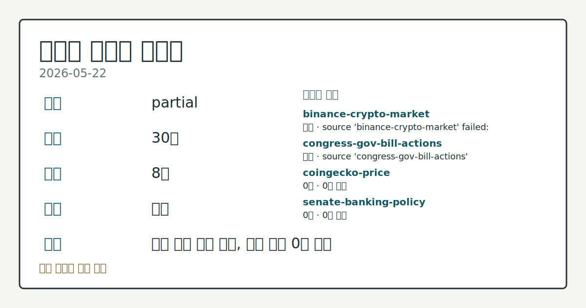
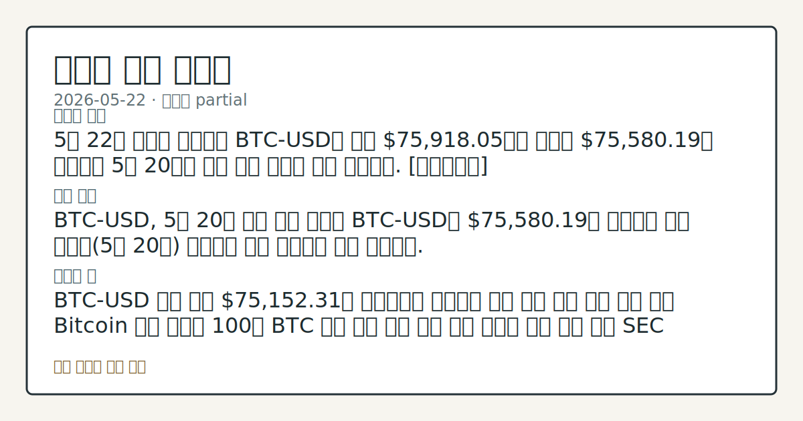

> 정보 제공용 자동 시황이며 가상자산 매매 권유가 아닙니다. 가상자산은 가격 변동성이 매우 큽니다.

# 2026-05-22 크립토 시황

**기준 시각**: 2026-05-22 UTC · [2026-05-22T00:00Z, 2026-05-23T00:00Z)

| 종목 | 스냅샷(UTC 24h) | 구간 변동 | 비고 |
|------|------|------|------|
| BTC-USD | 76,843.08 | +0.17% | +22.49% from 52w low · -13.44% YTD |
| ETH-USD | 2,092.72 | -1.14% | +14.83% from 52w low · -30.28% YTD |

**세그먼트**: [국내 증시](../../../domestic-equity/2026/05/2026-05-22.md) | [미국 증시](../../../us-equity/2026/05/2026-05-22.md) | [크립토](2026-05-22.md)

*이미지: 데이터 신뢰도 · 출처: investo 자체 생성 · 생성: investo 0.1.0 · 2026-05-25 UTC*

> **내 관심 자산 영향**: 10건 확인 (기본 바스켓) — BTC: [boundary-term] Global crypto market cap **$2,639,110,589,908**; BTC dominance **58.23%**; BTC: [alias:Bitcoin] DeFi TVL **$82.0**B; leader Ethereum; BTC: [boundary-term] BTC 미결제약정 **$449,211,180** (OKX, UTC 24h); BTC: [boundary-term] BTC 펀딩비 0.0000426715278565 (OKX, UTC 24h); BTC: [structured-symbol] BTC-USD 76,843.08 외
> **오늘의 결론**: UTC 24h 스냅샷 기준 크립토 시장은 총 시가총액 **$2.64**T, 24h 변동 **-0.22%**로 소폭 하락 구간을 이어갔다. [데이터부족]
> **핵심 동인**: BTC 전략 비축법안 — 매입 목표 삭제 및 20년 락업 조항 신설 미국 의회에 전략 비트코인 비축법안 수정안이 제출됐다.
> **주의할 점**: BTC-USD **$76,843.08** 기준, **$76,082.58**(UTC 24h 구간 저점) 이탈 여부를 확인하면 하방 추가 압력 관찰 가능...

> **데이터 상태**: 부분 · 본문 사용 미집계 · 실패 2 · 0건 2

수집/품질 진단

> **데이터 상태**: 부분 — 수집 30건 / 소스 8개 / 누락: 없음 · 부분 — 일부 카테고리 미수집, 본문 일부 결론 보강 필요
> **소스 카운트**: 수집 대상 13 / 성공 9 / 0건 2 / 실패 2 / 본문 사용 미집계
> **소스 등급 분포**: S=2 / A=1 / B=6
> **상세 사유**: 일부 소스 수집 실패, 일부 소스 0건 반환
> **소스별 상태**: binance-crypto-market 실패 (접근 제한), congress-gov-bill-actions 실패 (설정 미완료(미수집)), coingecko-price 0건, senate-banking-policy 0건, 정상 9개

## 한눈에 보기

- 전체 크립토 시총 **$2.64T** (-**0.22%** 24h), BTC-USD는 UTC 24h 스냅샷 **$76,843.08**로 5월 20일 반등 수준 아래로 후퇴
- 미 전략 비트코인 비축법안(Strategic Bitcoin Reserve Bill)이 100만 BTC 매입 목표를 삭제하고 20년 락업(보유 의무기간) 조항을 추가해 제도적 지원 기대가 희석됐다
- 공포·탐욕 지수(Fear & Greed Index) **25** (Extreme Fear) — 심리 지표 및 BTC 파생 포지션 동향을 본문 §④에서 점검

## ⓪ 오늘의 매크로

- **미 국채 수익률** — UST curve 2026-05-22: 10Y 4.56%, 2Y10Y +0.43pp

## ⓪-A 크립토 지표 (UTC 24h 스냅샷)

| 지표 | 값 |
|------|------|
| 공포·탐욕 | 25 (Extreme Fear) |
| BTC 도미넌스 | 58.23% |
| 전체 시총 | $2.64T (-0.22% 24h) |
| BTC 펀딩비 | 0.0000426715278565 (okx) |
| BTC 미결제약정 | $449.2M (okx) |
| DeFi TVL | $82.0B |
| 스테이블코인 공급 | $321.0B |
| 24h 청산 / 거래소 순유출입 | 무료 검증 소스 미확정 |

## ⓪-B 채널 기준선

| 기준선 | 값 |
|------|------|
| 비트코인 | 76,843.08 (+0.17%) |
| 이더리움 | 2,092.72 (-1.14%) |
| BTC 도미넌스 | 58.23% |
| 공포·탐욕 | 25 |
| 펀딩/OI/청산 | 펀딩 0.0000426715278565 · OI 수집됨 |

> **크로스마켓 연결 고리**: 금리 이벤트가 할인율/달러 경로의 공통 변수로 남아 있습니다.

## ① 요약

*이미지: 시장 스냅샷 · 출처: investo 자체 생성 · 생성: investo 0.1.0 · 2026-05-25 UTC*

UTC 24h 스냅샷 기준 크립토 시장은 총 시가총액 **$2.64T**, 24h 변동 **-0.22%**로 소폭 하락 구간을 이어갔다. BTC-USD는 **$76,843.08**에 위치하며 5월 20일 반등 이후 확인된 약 **$77,362** 수준에서 추가로 후퇴한 흐름이다. 공포·탐욕 지수는 **25** (Extreme Fear)로 심리 위축이 지속됐다. 정책 측면에서는 미 의회의 전략 비축법안 수정안이 기존 100만 BTC 매입 목표를 삭제하는 방향으로 재작성됐으며, SEC(미국 증권거래위원회)의 토큰화 자산 면제 발표도 지연됐다. 알트코인 중 NEAR는 AI(인공지능) 내러티브와 저명 투자자 언급에 힘입어 UTC 구간 내 **+30%** 상승하며 이례적 움직임을 보였다. [하락 관찰]

## ② 전일 핵심 이슈

### BTC 전략 비축법안 — 매입 목표 삭제 및 20년 락업 조항 신설

미국 의회에 [전략 비트코인 비축법안 수정안](https://www.theblock.co/post/402264/new-strategic-bitcoin-reserve-bill-drops-btc-purchase-target-adds-lockup)이 제출됐다. 핵심 변경 사항은 기존 100만 BTC 매입 목표의 삭제와 20년 락업 조항의 신설이다. 수정안에는 분기별 공개 준비금 증명(Proof-of-Reserve) 공시와 제3자 감사 의무도 포함됐다. 5월 20일 반등 국면에서 일부 시장 참여자들이 기대했던 정부 주도 BTC 직접 수요 경로가 약화된 셈이다.

> **그래서 의미는?** 매입 목표 삭제는 정부 차원의 직접적 BTC 수요 기대를 낮추는 입법 변수로, 가격 지지선 재평가 여지가 생겼습니다.

### SEC 토큰화 자산 면제 지연

SEC가 [토큰화 자산 관련 면제 조항 발표를 연기](https://www.theblock.co/post/402409/sec-delays-tokenized-asset-exemption-third-party-tokens-bloomberg-law)했다고 Bloomberg Law가 보도했다. 제3자 토큰 관련 우려가 주요 배경으로 지목됐다. 토큰화 증권의 규제 명확성을 기다리던 DeFi(탈중앙화 금융) 섹터에 불강한성이 연장됐다.

### Binance — WSJ 이란 연계 의혹 보도 반박

WSJ(월스트리트저널)이 이란 금융인 Babak Zanjani가 Binance를 통해 **$850M**을 이동시켰다고 [보도](https://www.theblock.co/post/402353/binance-disputes-latest-wsj-report-on-alleged-iran-linked-transactions)했다. Binance CEO Richard Teng은 보도 내용이 '사실 오해'라며 반박했다. 주요 거래소의 제재 관련 규제 리스크가 재부각됐다.

### Polymarket — Polygon 내부 지갑 개인 키(Private Key) 침해 조사

탈중앙화 예측 시장 플랫폼 Polymarket이 Polygon 체인상 내부 충전 지갑의 [개인 키 침해 가능성을 조사](https://www.theblock.co/post/402327/zachxbt-flags-suspected-exploit-involving-polymarkets-uma-adapter-contract-on-polygon) 중이라고 밝혔다.

### Verus 브리지 해커 — **4,052.4 ETH** 반환, **$2.8M** 바운티 보유

Verus 브리지 공격자가 팀 측 바운티(보상금) 제안을 수락해 [**4,052.4 ETH**(**$8.5M** 상당)를 반환](https://www.theblock.co/post/402319/verus-bridge-exploiter-returns-4052-eth)했다. 공격자는 **$2.8M**을 바운티로 보유했다. 화이트햇(white-hat) 협상을 통한 부분 자산 회수 사례로 DeFi 보안 협상 메커니즘이 확인됐다.

## ③ 섹터/수급 동향

### 전체 시장 구조 — BTC 도미넌스(시총 점유율) 우위 지속

[전체 크립토 시총](https://www.coingecko.com/en/global-charts)은 UTC 24h 스냅샷 기준 **$2.64T**(-**0.22%** 24h)다. BTC 도미넌스는 **58.23%**로, 알트코인보다 BTC 중심의 방어적 자금 배분이 지속되고 있음을 관찰할 수 있다.

> **그래서 의미는?** 도미넌스 유지는 알트코인 광범위 순환보다 BTC 집중 수급이 이어지고 있다는 관찰 포인트입니다.

### DeFi TVL(총예치금액) 및 스테이블코인 공급

[DeFi TVL](https://defillama.com/)은 **$82.0B**이며, Ethereum이 **$42.8B**으로 선두를 유지 중이다. 이어 BSC **$5.6B**, Solana **$5.5B**, Tron **$5.1B**, Bitcoin **$5.1B** 순이다. [스테이블코인 공급](https://defillama.com/)은 **$321.0B**으로 USDT가 **$189.6B**, USDC가 **$76.5B**을 차지한다.

### OKX·ICE(인터컨티넨탈익스체인지) 원유 퍼프스(영구선물) 파트너십

OKX가 ICE와 [원유 퍼프스 계약 출시를 위한 파트너십](https://www.theblock.co/post/402382/okx-ice-partner-oil-commodity-perps)을 발표했다. 계약은 ICE의 Brent Crude 및 WTI Crude 에너지 벤치마크를 추종한다. 같은 시점에 NYSE(뉴욕증권거래소) 모기업이 미 규제당국에 Hyperliquid(탈중앙화 파생상품 거래소) 규제 강화를 촉구한 것으로 전해졌다.

## ④ 지표·이벤트

### 공포·탐욕 지수 및 BTC 파생 지표

[공포·탐욕 지수](https://alternative.me/crypto/fear-and-greed-index/)는 **25** (Extreme Fear, UTC 24h 기준)으로 심리 위축이 지속됐다. OKX 기준 BTC 펀딩비(Funding Rate)는 **0.0000426715278565**(소폭 양수, 롱 포지션 우위)이며, BTC 미결제약정(Open Interest)은 **$449.2M**이다. 24h 정리 및 거래소 순유출입은 데이터 미수집 상태다.

> **그래서 의미는?** 펀딩비가 소폭 양수를 유지하는 가운데 심리 지표는 극단적 공포 구간에 머물러, 파생 포지션 방향성을 관찰할 필요가 있습니다.

### UST(미국채) 금리와 크립토 위험자산 환경

[UST 금리](https://home.treasury.gov/resource-center/data-chart-center/interest-rates)(2026-05-22 기준): 10Y **4.56%**, 30Y **5.07%**, 2Y10Y 스프레드 **+0.43pp**. 크립토 자산은 위험자산(Risk Asset)으로 분류되며, 장기 금리 상승 구간에서 유동성 압박 추세를 점검할 수 있다.

### 한국 가상자산 과세(가상자산 양도소득세) 정책 재검토 청원

[국민청원이 5만 명 서명을 돌파](https://www.theblock.co/post/402311/south-korea-petition-crypto-tax-plan)하면서 한국 정부가 가상자산 과세 계획 재검토를 시사했다. 전통 투자 양도차익세 폐지와의 형평성 문제가 청원의 핵심 논거였다.

## ⑤ 주요 종목

<!-- u50 lightweight-charts-embed: placeholders consumed by site_docs/assets/investo-chart-init.js -->

<noscript><em>인터랙티브 차트는 JavaScript가 활성화된 환경에서 표시됩니다. 위 정적 카드가 동일한 정보를 담고 있습니다.</em></noscript>

BTC-USD와 ETH-USD는 UTC 24h 스냅샷 기준 좁은 구간 내 등락을 보인 반면, NEAR는 AI 내러티브와 저명 투자자 언급을 계기로 구간 내 대폭 상승이 관찰됐다.

> **그래서 의미는?** BTC(비트코인)와 ETH(이더리움)의 제한적 변동폭과 달리 NEAR의 이례적 반응은 AI 테마 알트코인 수급 쏠림 여부를 점검할 필요를...

### 가격 추세 확인 항목

| 티커 | UTC 스냅샷 | 구간 내 고/저 | 비고 |
|------|-----------|-------------|------|
| [BTC-USD](https://stooq.com/q/?s=btc.v) | **$76,843.08** | H: $76,930.81 / L: $76,082.58 | 5월 20일 반등 수준 하회 |
| [ETH-USD](https://stooq.com/q/?s=eth.v) | **$2,092.72** | H: $2,097.60 / L: $2,068.73 | 구간 내 소폭 상승 |

### AI 내러티브 관련 관찰 항목

[NEAR](https://www.theblock.co/post/402373/near-jumps-30-ai-hype-arthur-hayes-endorsement-scaling-plans) 토큰은 UTC 24h 구간 내 **+30%** 상승했다. Arthur Hayes가 NEAR, HYPE, ZEC을 "홀리 트리니티(holy trinity, 세 핵심 알트코인 포트폴리오)"로 지목한 발언과 스케일링 계획 발표가 복합적으로 작용한 것으로 전해졌다. 거래량 및 수급 지속성 확인이 필요한 항목이다.

### 보안 이벤트 확인 항목

- **Polymarket**: UMA 어댑터(Polygon) 내부 충전 지갑 개인 키 침해 가능성 조사 진행 중
- **Verus 브리지**: **4,052.4 ETH**(**$8.5M** 상당) 반환 완료, 공격자 **$2.8M** 바운티 보유 확인

## ⑥ 오늘의 관전 포인트

| 관찰 신호 | 현재 | 상방 확인 조건 | 하방 확인 조건 | 신뢰도 | 섹션 내 관심 영향 |
| --- | --- | --- | --- | --- | --- |
| BTC-USD **$76,843.08** 기준, **$… | — | 데이터부족 | 데이터부족 | 데이터부족 | — |
| BTC 도미넌스 **58.23%** 유지 구간에서 NE… | — | 데이터부족 | 데이터부족 | 데이터부족 | — |
| 미 전략 비트코인 비축법안 수정안의 의회 내 추가 | — | 데이터부족 | 데이터부족 | 데이터부족 | — |
| SEC 토큰화 자산 면제 재개 시점 — 지연 발표 이후… | — | 데이터부족 | 데이터부족 | 데이터부족 | — |
| Polymarket 개인 키 침해 조사 결과 발표 시 … | — | 데이터부족 | 데이터부족 | 데이터부족 | — |
| `input_hash`: `3e5bab1c0347` | — | 데이터부족 | 데이터부족 | 데이터부족 | — |

_관전 신호 2건 추가 — 본문 참조._
## ⑦ 면책조항
본 시황은 일반 정보 제공을 목적으로 자동 생성된 자료이며,
특정 가상자산에 대한 매매 권유나 투자 자문이 아닙니다.
가상자산은 가상자산이용자보호법(2024-07-19 시행) §10·§19의 적용 대상으로,
24시간 거래되는 비제도권 자산이며 가격 변동성이 매우 크고 원금 전액 손실이 가능합니다.
투자 결정과 그 결과에 대한 책임은 전적으로 본인에게 있으며,
본 시황의 내용에 따라 발생한 손실에 대해 작성자는 일체의 책임을 지지 않습니다.