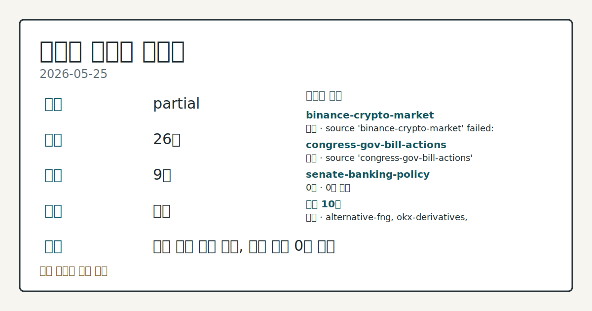
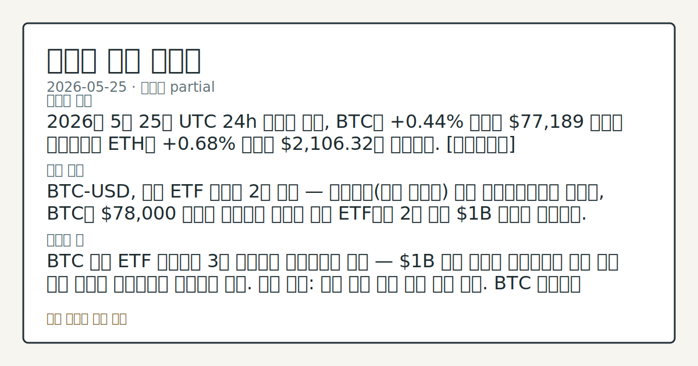
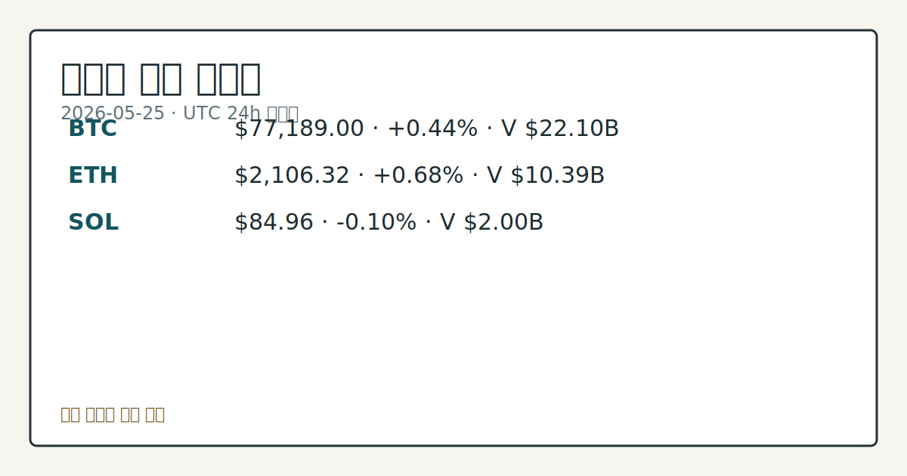

> 정보 제공용 자동 시황이며 가상자산 매매 권유가 아닙니다. 가상자산은 가격 변동성이 매우 큽니다.

# 2026-05-25 크립토 시황

**기준 시각**: 2026-05-25 UTC · [2026-05-25T00:00Z, 2026-05-26T00:00Z)

| 종목 | 스냅샷(UTC 24h) | 구간 변동 | 비고 |
|------|------|------|------|
| BTC-USD | 77,221.03 | +0.26% | +23.09% from 52w low · -13.02% YTD |
| ETH-USD | 2,106.97 | +0.38% | +15.61% from 52w low · -29.81% YTD |

**세그먼트**: [국내 증시](../../../domestic-equity/2026/05/2026-05-25.md) | [미국 증시](../../../us-equity/2026/05/2026-05-25.md) | [크립토](2026-05-25.md)

*이미지: 데이터 신뢰도 · 출처: investo 자체 생성 · 생성: investo 0.1.0 · 2026-05-25 UTC*

> **내 관심 자산 영향**: 15건 확인 (기본 바스켓) — BTC: [boundary-term] Global crypto market cap **$2,651,102,922,769**; BTC dominance **58.25%**; BTC: [structured-symbol] BTC **$77,189.00** (**+0.44%**); BTC: [alias:Bitcoin] DeFi TVL **$82.5**B; leader Ethereum; BTC: [boundary-term] BTC 미결제약정 **$449,878,900** (OKX, UTC 24h); BTC: [boundary-term] BTC 펀딩비 0.0000806742224219 (OKX, UTC 24h) 외
> **오늘의 결론**: 2026년 5월 25일 UTC 24h 스냅샷 기준, BTC는 **+0.44%** 반등해 **$77,189** 수준을 유지했으며 ETH도 **+0.68%** 상승한 **$2,106.32**를 기록했다. [데이터부족]
> **핵심 동인**: BTC-USD, 현물 ETF 순유출 2주 연속 — 로테이션(자산 재배분) 논쟁 애널리스트들에 따르면, BTC가 **$78,000** 아래를 유지하는 가운데 현물 ETF에서 2주 연속 **$1**B 이상이 유출됐다.
> **주의할 점**: BTC 현물 ETF 순유출이 3주 연속으로 이어지는지 추적 — **$1**B 이상 유출이 지속된다면 기관 수요 위축 흐름이 심화되는지 데이터로 비교. 관심 영향...

> **데이터 상태**: 부분 · 본문 사용 미집계 · 실패 2 · 0건 1

수집/품질 진단

> **데이터 상태**: 부분 — 수집 26건 / 소스 9개 / 누락: 없음 · 부분 — 일부 카테고리 미수집, 본문 일부 결론 보강 필요
> **소스 카운트**: 수집 대상 13 / 성공 10 / 0건 1 / 실패 2 / 본문 사용 미집계
> **소스 등급 분포**: S=2 / A=1 / B=7
> **상세 사유**: 일부 소스 수집 실패, 일부 소스 0건 반환
> **소스별 상태**: binance-crypto-market 실패 (접근 제한), congress-gov-bill-actions 실패 (설정 미완료(미수집)), senate-banking-policy 0건, 정상 10개

## 한눈에 보기

- BTC **+0.44%**, ETH **+0.68%** 소폭 반등, 전체 시가총액 **$2.65T** (**+0.12%** 24h)로 직전 스냅샷 대비 소폭 확대
- 현물 ETF(상장지수펀드)에서 2주 연속 **$1B** 이상 순유출 기록 — 애널리스트들은 기관 이탈이 아닌 로테이션으로 해석
- 공포·탐욕 지수 **30** (Fear 구간) 지속 — 심리 위축과 가격 소폭 반등의 혼재 흐름을 §② 에서 확인

## ⓪ 오늘의 매크로

- **미 국채 수익률** — UST curve 2026-05-22: 10Y 4.56%, 2Y10Y +0.43pp

## ⓪-A 크립토 지표 (UTC 24h 스냅샷)

| 지표 | 값 |
|------|------|
| 공포·탐욕 | 30 (Fear) |
| BTC 도미넌스 | 58.25% |
| 전체 시총 | $2.65T (+0.12% 24h) |
| BTC 펀딩비 | 0.0000806742224219 (okx) |
| BTC 미결제약정 | $449.9M (okx) |
| DeFi TVL | $82.5B |
| 스테이블코인 공급 | $320.6B |
| 24h 청산 / 거래소 순유출입 | 무료 검증 소스 미확정 |

## ⓪-B 채널 기준선

| 기준선 | 값 |
|------|------|
| 비트코인 | 77,221.03 (+0.26%) |
| 이더리움 | 2,106.97 (+0.38%) |
| BTC 도미넌스 | 58.25% |
| 공포·탐욕 | 30 |
| 펀딩/OI/청산 | 펀딩 0.0000806742224219 · OI 수집됨 |

> **크로스마켓 연결 고리**: 금리 이벤트가 할인율/달러 경로의 공통 변수로 남아 있습니다.

## ① 요약

*이미지: 시장 스냅샷 · 출처: investo 자체 생성 · 생성: investo 0.1.0 · 2026-05-25 UTC*

2026년 5월 25일 UTC 24h 스냅샷 기준, BTC는 **+0.44%** 반등해 **$77,189** 수준을 유지했으며 ETH도 **+0.68%** 상승한 **$2,106.32**를 기록했다. 전체 암호화폐 시가총액은 **$2.65T** (**+0.12%** 24h)로 2026-05-22 대비 소폭 확대됐다. 그러나 공포·탐욕 지수 **30** (Fear 구간)이 이어지고 BTC 현물 ETF에서 2주 연속 **$1B** 이상 순유출이 발생하는 등 심리·수급 측면의 압박이 상방 폭을 제한하고 있다. Satoshi 시대 고래의 **2,650 BTC** 이전과 Squid 프로토콜 서드파티 익스플로잇(**$3.2M**) 등 개별 이벤트도 관찰 대상으로 부각됐다. [혼재]

## ② 전일 핵심 이슈

### BTC-USD, 현물 ETF 순유출 2주 연속 — 로테이션 논쟁

[애널리스트들에 따르면](https://www.theblock.co/post/402473/institutional-bid-hasnt-disappeared-analysts-say-bitcoin-cooldown-spot-etf-outflows-signal-rotation-not-exit), BTC가 **$78,000** 아래를 유지하는 가운데 현물 ETF에서 2주 연속 **$1B** 이상이 유출됐다. 그럼에도 분석가들은 기관 수요 자체가 사라진 것이 아니라 포트폴리오 로테이션의 결과일 수 있다는 시각을 제시했으며, 미·이란 협상 관련 지정학 보도가 위험자산 심리를 추가 압박하는 변수로 작용했다.

> **그래서 의미는?** ETF 순유출 2주 연속이지만 기관 이탈 단정은 이르다 — 로테이션인지 구조적 이탈인지 수급 흐름을 추가 확인 필요.

### Satoshi 시대 고래, 2,650 BTC FalconX·Cumberland로 이전

[Onchain Lens에 따르면](https://www.theblock.co/post/402447/bitcoin-og-moves-2650-btc) 초기 채굴자(OG, 원조 보유자) 지갑으로 추정되는 주소가 일요일 복수 트랜잭션을 통해 **2,650 BTC**를 크립토 트레이딩 기업 FalconX와 Cumberland로 이체했다. 대규모 OG 물량의 거래소 방향 이동은 온체인(블록체인 데이터) 매도 압력 관찰 항목으로 분류된다.

### Squid 프로토콜, 서드파티(제3자 외부) 모듈 익스플로잇 — **$3.2**M 피해

[Squid는](https://www.theblock.co/post/402487/we-dont-know-who-deployed-this-squid-distances-itself-from-3-2-million-third-party-module-exploit) SquidRouterModule이라는 서드파티 모듈에서 약 **$3.2M** 규모의 익스플로잇(취약점 공격)이 발생했다고 밝혔다. 코어 프로토콜은 영향을 받지 않았으나 배포 주체는 아직 확인되지 않았다.

### TrapDoor 악성코드, 크립토 개발 환경 표적 — Aptos·Sui·Solana 포함

[연구진은](https://www.theblock.co/post/402458/researchers-flag-trapdoor-malware-campaign-targeting-crypto-developer-environments-including-aptos-sui-and-solana) TrapDoor 악성코드 캠페인이 npm(노드 패키지 관리자)·PyPI(파이썬 패키지 저장소)·Crates.io(러스트 패키지 저장소)의 악성 패키지를 경로로 Aptos, Sui, Solana 생태계 개발 환경을 표적으로 삼았다고 경고했다. 오픈소스 공급망을 통한 크립토 개발자 환경 공격 사례가 확인됐다.

### 인도네시아, Polymarket 차단 — 예측 시장 글로벌 규제 강화

[인도네시아 규제 당국은](https://www.theblock.co/post/402481/indonesia-blocks-polymarket) 온라인 도박 관련 규정을 근거로 예측 시장 플랫폼 Polymarket에 대한 접속을 차단했다. 주요 국가에서 예측 시장 플랫폼에 대한 규제 강도가 높아지는 추세가 관찰된다.

## ③ 섹터/수급 동향

### DeFi TVL(탈중앙화금융 총 예치금액) 체인별 분포

[DeFiLlama 기준](https://defillama.com/) DeFi TVL은 **$82.5B**이며, Ethereum이 **$43.1B**으로 전체의 절반 이상을 점유한다. BSC(바이낸스스마트체인) **$5.6B**, Solana **$5.5B**, Tron **$5.2B**, Bitcoin **$5.1B** 순이다. BTC 도미넌스(시가총액 점유율)는 **58.25%**로 알트코인 대비 BTC의 상대적 우위가 유지되고 있다.

> **그래서 의미는?** Ethereum이 DeFi 생태계를 주도하는 가운데 BTC 도미넌스 상승 구간에서 알트코인 자금 위축 추세를 관찰할 수 있다.

### 스테이블코인(가치고정자산) 공급 및 신규 발행 동향

[DeFiLlama 기준](https://defillama.com/) 전체 스테이블코인 공급은 **$320.6B**이며, USDT(테더) **$189.4B**, USDC **$76.4B**가 양강을 이루고 있다. 이어 USDS **$8.8B**, USD1 **$4.8B**, DAI **$4.6B** 순이다. 한편 [Tether는 조지아 정부 지원 하에](https://www.theblock.co/post/402453/tether-gelt-stablecoin-georgian-lari) 조지아 라리(조지아 법정통화) 연동 스테이블코인 GELT 출시를 추진 중으로, 신흥 미국 스테이블코인 규제 프레임워크와의 정합성을 강조했다.

## ④ 지표·이벤트

### BTC 파생상품 지표 (OKX, UTC 24h)

[OKX 기준](https://www.okx.com/trade-swap/btc-usd-swap) BTC 펀딩비(선물 포지션 유지 비용)는 **0.0000806742224219**로 소폭 양(+) 값이며, 미결제약정(오픈 인터레스트, OI)은 **$449.9M**을 기록했다. 24h 정리 및 거래소 순유출입 데이터는 현재 무료 검증 소스 미확정으로 데이터 미수집 상태다.

> **그래서 의미는?** 펀딩비 소폭 양수·낮은 미결제약정 조합은 레버리지 과열 없는 소폭 롱 우위 상태 — 파생 지표 변화를 현물 가격 흐름과 교차 점검할 수 있다.

### 공포·탐욕 지수 — Fear 구간 지속

[공포·탐욕 지수](https://alternative.me/crypto/fear-and-greed-index/)는 **30** (Fear 구간)으로 투자 심리가 중립 이하를 유지 중이다. 거시 배경으로 UST(미국국채) 10년물 금리는 **4.56%** (2026-05-22 기준)로, 크립토를 포함한 위험자산 전반에 대한 할인율 상승 맥락을 형성한다.

### Ethereum Hegota 업그레이드 — EIP-8182 프라이빗 전송 제안

[Facet 공동창업자 Tom Lehman은](https://www.theblock.co/post/402464/facet-co-founder-pitches-eip-8182-private-transfers-for-inclusion-in-ethereums-hegota-upgrade) Ethereum의 차기 업그레이드 Hegota에 EIP-8182(프라이빗 전송 표준안)를 포함시킬 것을 제안했다. 채택 시 Ethereum 네트워크에서 네이티브(자체 내장) 프라이빗 전송 기능이 구현된다.

### 미국 하원 금융서비스위원회 디지털자산 소위 동향

하원 금융서비스위원회(House Financial Services) 산하 디지털자산·핀테크·AI 소위원회에서 은행-핀테크 파트너십이 금융 현대화에 미치는 역할을 심의했다([원문](http://financialservices.house.gov/news/documentsingle.aspx?DocumentID=411139)). 가상자산 생태계와 제도권 금융의 접점을 둘러싼 입법 논의 흐름이 이어지고 있다.

## ⑤ 주요 종목

<!-- u50 lightweight-charts-embed: placeholders consumed by site_docs/assets/investo-chart-init.js -->

<noscript><em>인터랙티브 차트는 JavaScript가 활성화된 환경에서 표시됩니다. 위 정적 카드가 동일한 정보를 담고 있습니다.</em></noscript>

*이미지: 가격 스냅샷 · 출처: investo 자체 생성 · 생성: investo 0.1.0 · 2026-05-25 UTC*

가격 관찰 항목 (UTC 24h 스냅샷):

| 티커 | 스냅샷 가격 | 24h 변동 | 24h 고가 | 24h 저가 |
|------|------------|----------|----------|----------|
| BTC-USD | $77,189 | +0.44% | $77,703 | $76,778 |
| ETH-USD | $2,106.32 | +0.68% | $2,135.69 | $2,090.55 |
| SOL-USD | $84.96 | -0.10% | $86.28 | $84.73 |

> **그래서 의미는?** BTC(비트코인)과 ETH(이더리움)는 소폭 반등, SOL(솔라나)은 소폭 하락 — 주요 자산 간 방향성 분기가 확인된다.

### 수급 관찰 항목

Satoshi 시대 추정 지갑에서 **2,650 BTC**가 FalconX·Cumberland로 이체된 점, BTC 현물 ETF에서 2주 연속 **$1B** 이상 순유출이 기록된 점이 동시에 확인됐다. 두 수급 지표의 동시 출현은 방향성 판단 시 추가 데이터 확인이 필요한 항목이다.

### 보안 관찰 항목

Squid의 SquidRouterModule 익스플로잇(**$3.2M**)과 TrapDoor 악성코드(npm·PyPI·Crates.io 경로)가 크립토 개발 생태계를 겨냥한 보안 이벤트로 확인됐다.

## ⑥ 오늘의 관전 포인트

| 관찰 신호 | 현재 | 상방 확인 조건 | 하방 확인 조건 | 신뢰도 | 섹션 내 관심 영향 |
| --- | --- | --- | --- | --- | --- |
| BTC 현물 ETF 순유출이 | — | 데이터부족 | 데이터부족 | 데이터부족 | — |
| BTC 도미넌스 **58.25%** 수준에서의 이탈 방… | — | 데이터부족 | 데이터부족 | 데이터부족 | — |
| Satoshi 시대 **2,650 BTC** 이전 이후… | — | 데이터부족 | 데이터부족 | 데이터부족 | — |
| 공포·탐욕 지수 **30** (Fear 구간)이 | — | 데이터부족 | 데이터부족 | 데이터부족 | — |
| TrapDoor 악성코드 피해 범위가 | — | 데이터부족 | 데이터부족 | 데이터부족 | — |
| `input_hash`: `dda006981571` | — | 데이터부족 | 데이터부족 | 데이터부족 | — |

_관전 신호 2건 추가 — 본문 참조._
## ⑦ 면책조항
본 시황은 일반 정보 제공을 목적으로 자동 생성된 자료이며,
특정 가상자산에 대한 매매 권유나 투자 자문이 아닙니다.
가상자산은 가상자산이용자보호법(2024-07-19 시행) §10·§19의 적용 대상으로,
24시간 거래되는 비제도권 자산이며 가격 변동성이 매우 크고 원금 전액 손실이 가능합니다.
투자 결정과 그 결과에 대한 책임은 전적으로 본인에게 있으며,
본 시황의 내용에 따라 발생한 손실에 대해 작성자는 일체의 책임을 지지 않습니다.