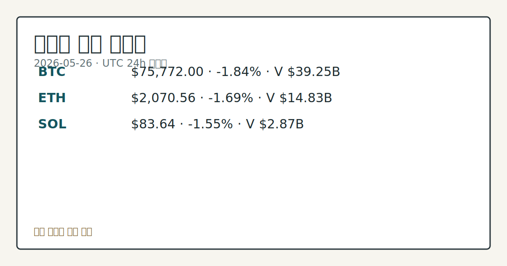

> 정보 제공용 자동 시황이며 가상자산 매매 권유가 아닙니다. 가상자산은 가격 변동성이 매우 큽니다.

# 2026-05-26 크립토 시황

**기준 시각**: 2026-05-26 UTC · [2026-05-26T00:00Z, 2026-05-27T00:00Z)

| 종목 | 스냅샷(UTC 24h) | 구간 변동 | 비고 |
|------|------|------|------|
| BTC-USD | 75,826.73 | -1.93% | +20.87% from 52w low · -14.59% YTD |
| ETH-USD | 2,071.41 | -1.92% | +13.68% from 52w low · -30.98% YTD |

**세그먼트**: 국내 증시(미발행) | [미국 증시](../../../us-equity/2026/05/2026-05-26.md) | [크립토](2026-05-26.md)

*이미지: 데이터 신뢰도 · 출처: investo 자체 생성 · 생성: investo 0.1.0 · 2026-05-26 UTC*

> **내 관심 자산 영향**: 18건 확인 (기본 바스켓) — BTC: [boundary-term] Global crypto market cap **$2,617,954,104,632**; BTC dominance **57.99%**; BTC: [structured-symbol] BTC **$75,772.00** (**-1.84%**); BTC: [alias:Bitcoin] DeFi TVL **$81.5**B; leader Ethereum; BTC: [boundary-term] BTC 미결제약정 **$453,438,730** (OKX, UTC 24h); BTC: [boundary-term] BTC 펀딩비 0.0000580779137873 (OKX, UTC 24h) 외
> **오늘의 결론**: UTC 24h 기준(2026-05-26 스냅샷) BTC는 **-1.84%** 하락한 **$75,772.00**, ETH(이더리움)는 **-1.69%** 하락한 **$2,070.56**, SOL(솔라나)은 **-1.55%** 하락한 **$83.64**를 기록했다. [데이터부족]
> **핵심 동인**: BTC-USD, 이란 지정학 긴장 재점화로 전일 반등 이탈 전일(2026-05-25) **+0.44%** 소폭 반등에서 이탈해 이번 UTC 24h 구간 BTC-USD는 **-1.84%** 하락했다.
> **주의할 점**: BTC-USD 24h 저점 **$75,607** 지지 여부를 가격 추이로 확인 — 이탈 시 추가 하방 심도를 관찰. 공포·탐욕지수 34(Fear) 지속 여부와...

> **데이터 상태**: 부분 · 본문 사용 미집계 · 실패 2 · 0건 1

수집/품질 진단

> **데이터 상태**: 부분 — 수집 38건 / 소스 9개 / 누락: 없음 · 부분 — 일부 카테고리 미수집, 본문 일부 결론 보강 필요
> **소스 카운트**: 수집 대상 13 / 성공 10 / 0건 1 / 실패 2 / 본문 사용 미집계
> **소스 등급 분포**: S=2 / A=1 / B=7
> **상세 사유**: 일부 소스 수집 실패, 일부 소스 0건 반환
> **소스별 상태**: binance-crypto-market 실패 (접근 제한), congress-gov-bill-actions 실패 (설정 미완료(미수집)), senate-banking-policy 0건, 정상 10개

> **시장 anchor**: BTC **$75,772.00** (**-1.84%** UTC 24h), 전체 시총 **$2.62T** (**-1.61%** 24h), 공포·탐욕 34 (Fear)

## ⓪-A 크립토 지표 (UTC 24h 스냅샷)

| 지표 | 값 |
|------|------|
| 공포·탐욕 | 34 (Fear) |
| BTC 도미넌스 | 57.99% |
| 전체 시총 | $2.62T (-1.61% 24h) |
| BTC 펀딩비 | 0.0000580779137873 (okx) |
| BTC 미결제약정 | $453.4M (okx) |
| DeFi TVL | $81.5B |
| 스테이블코인 공급 | $321.4B |
| 24h 청산 / 거래소 순유출입 | 무료 검증 소스 미확정 |

## 한눈에 보기

- BTC **-1.84%**(**$75,772**), 전체 시총 **$2.62T**(**-1.61%** 24h) — 전일(2026-05-25) 소폭 반등(**+0.44%**)에서 이란 지정학 리스크 재점화와 함께 하락 전환.
- 공포·탐욕지수 **34**(Fear) 유지 속 KelpDAO(디파이 재스테이킹 프로토콜) 익스플로잇 이후 DeFi TVL(탈중앙화 금융 총예치금액)이 **-14%** 누적 위축 중.
- **4.50%** 10Y UST(미국 국채 10년물) 금리와 TD Cowen의 Clarity Act(가상자산 시장구조 법안) 연내 통과 회의론이 규제 불강한성 변수로 지속 — 본문 §④ 참조.

## ⓪ 오늘의 매크로

- **미 국채 수익률** — UST curve 2026-05-26: 10Y 4.50%, 2Y10Y +0.49pp

## ⓪-B 채널 기준선

| 기준선 | 값 |
|------|------|
| 비트코인 | 75,826.73 (-1.93%) |
| 이더리움 | 2,071.41 (-1.92%) |
| BTC 도미넌스 | 57.99% |
| 공포·탐욕 | 34 |
| 펀딩/OI/청산 | 펀딩 0.0000580779137873 · OI 수집됨 |

> **크로스마켓 연결 고리**: 금리 이벤트가 할인율/달러 경로의 공통 변수로 남아 있습니다.

## ① 요약

*이미지: 시장 스냅샷 · 출처: investo 자체 생성 · 생성: investo 0.1.0 · 2026-05-26 UTC*

UTC 24h 기준 BTC는 **-1.84%** 하락한 **$75,772.00**, ETH는 **-1.69%** 하락한 **$2,070.56**, SOL은 **-1.55%** 하락한 **$83.64**를 기록했다. 전체 시가총액은 **$2.62T**로 **-1.61%** 후퇴했으며, 공포·탐욕지수(Fear & Greed Index)는 34(Fear, 공포) 구간에 위치한다. BTC 도미넌스(비트코인 시가총액 비중)는 **57.99%**를 유지 중이다. 전일 **+0.44%** 소폭 반등이 이란 군사 공격 재개 보도와 함께 되돌려졌으며, **$79,000** 수준의 매물 저항, DeFi TVL 지속 위축, 미 의회 Clarity Act 통과 불투명 등이 복합적으로 작용한 구간으로 관찰된다. [하락 관찰]

## ② 전일 핵심 이슈

### BTC-USD, 이란 지정학 긴장 재점화로 전일 반등 이탈

전일 **+0.44%** 소폭 반등에서 이탈해 이번 UTC 24h 구간 BTC-USD는 **-1.84%** 하락했다. [The Block](https://www.theblock.co/post/402552/optimism-looks-fragile-bitcoin-wavers-as-iran-strikes-revive-geopolitical-tensions-and-analysts-warn-of-range-trap)에 따르면 이란 군사 공격(Iran strikes) 재개 소식이 지정학적 긴장을 되살렸고, **$79,000** 수준에 집중된 매수자들의 매물 저항이 작용해 애널리스트들은 "레인지 트랩(range trap, 박스권 갇힘)" 위험을 경고하고 있다. 이란 지정학 리스크는 위험자산 전반의 수요 후퇴와 스테이블코인(가치고정 가상자산)으로의 자금 대기 전환 흐름을 동반하는 것으로 관찰된다. BTC-USD의 24h 고가는 **$77,881**, 저가는 **$75,607**이었다.

> **그래서 의미는?** 어제 소폭 반등이 추세 전환을 확인하지 못한 채 지정학 충격에 되돌려졌으며, 현재 BTC가 외부 리스크에 민감한 박스권 구간에 놓여 있음을...

### DeFi TVL, KelpDAO 익스플로잇 이후 5주째 위축

[The Block](https://www.theblock.co/post/402641/defi-tvl-slides-14-since-kelpdao-exploit-as-risk-appetite-retreats) 보도에 따르면 KelpDAO 익스플로잇(해킹 사고) 이후 DeFi TVL이 **-14%** 누적 하락했다. DefiLlama(디파이라마) 기준 현재 TVL는 **$81.5B**이며, 리스크 회피(risk appetite retreat, 위험 선호 후퇴) 심리 강화가 5주째 지속 중이다.

### UK, HTX 제재 — 대러시아 지원 혐의

[영국은 HTX(구 후오비) 가상자산 거래소를 러시아 정부 지원 혐의로 제재했다](https://www.theblock.co/post/402591/uk-sanctions-htx-over-support-of-russia-in-broad-sweep-over-crypto-exchanges). 주요국의 가상자산 거래소에 대한 제재 범위가 확대되는 추세를 보여주는 사례다.

### OCC 내셔널 트러스트 차터 공방 — Ripple·Coinbase 등

Sen. Warren(미국 워런 상원의원)이 OCC(미통화감독청) 내셔널 트러스트 차터 부여를 불법이라 주장하자, Digital Chamber(가상자산 업계 단체)가 [이를 공개 반박](https://www.theblock.co/post/402639/crypto-industry-defends-occ-charters-for-ripple-coinbase-after-warren-calls-unlawful)했다. Ripple·Coinbase 등의 제도권 지위를 둘러싼 갈등이 지속되는 것으로 관찰된다.

## ③ 섹터/수급 동향

### DeFi 체인별 TVL 및 스테이블코인 공급

[DefiLlama](https://defillama.com/) 기준 체인별 TVL: Ethereum(이더리움) **$42.6B**, BSC(바이낸스 스마트체인) **$5.6B**, Solana **$5.4B**, Tron **$5.2B**, Bitcoin **$5.0B** 순이다. 스테이블코인 총 공급은 **$321.4B**이며, USDT(테더) **$189.3B**, USDC(USD코인) **$76.6B**, USDS **$8.8B**, USD1 **$4.8B**, DAI **$4.6B** 순위를 유지하고 있다.

> **그래서 의미는?** 스테이블코인 공급 **$321.4B** 유지는 시장 내 대기 자금이 축소되지 않았음을 보여주나, 현재 이 자금이 DeFi로 재유입되는 흐름은...

### ETH·SOL 재무 기업, Russell 지수 신규 합류

[The Block](https://www.theblock.co/post/402627/ethereum-solana-treasury-firms-sharplink-forward-join-russell-indexes)에 따르면 ETH·SOL 트레저리(기업 재무 가상자산 보유) 전략을 채택한 Sharplink(샤프링크)와 Forward(포워드)가 Russell(러셀) 미국 주식 지수에 새로 합류했다. Russell 지수에는 약 **$12.2조**의 투자자 자산이 벤치마크로 연동되어 있는 것으로 알려졌다.

### Robinhood, WonderFi 인수 최종 승인 — 6월 1일 클로징 예정

캐나다 CIRO(캐나다 투자업계 규제기구)가 Robinhood(로빈후드)의 WonderFi(원더파이) **$180M** 인수를 [최종 승인](https://www.theblock.co/post/402542/robinhood-clears-final-regulatory-approval-wonderfi-deal)했으며, 6월 1일 딜 클로징이 예정돼 있다. 북미 소매 크립토 유통망 재편 흐름의 일환으로 관찰된다.

## ④ 지표·이벤트

### BTC 파생상품 지표 (OKX, UTC 24h)

OKX(오케엑스) 기준 BTC 펀딩비(funding rate, 무기한선물 주기적 롤오버 비용)는 **0.0000580779137873**으로 소폭 양수 구간이다. BTC 미결제약정(open interest, 미정리 파생계약 총량)은 **$453.4M**이다. 24h 정리(liquidation) 및 거래소 순유출입 데이터는 무료 검증 소스 미확정으로 데이터 미수집 상태다.

> **그래서 의미는?** 펀딩비가 소폭 양수를 유지하나 절대 수준이 낮아 파생 수요 편향을 단정하기 어렵고, 정리·순유출입 데이터 미수집으로 유동성 방향 확인이 제한된...

### UST 금리 곡선 (2026-05-26)

[Treasury.gov](https://home.treasury.gov/resource-center/data-chart-center/interest-rates) 기준 10Y(10년물) **4.50%**, 2Y(2년물) **4.01%**, 30Y(30년물) **5.03%**, 3M(3개월물) **3.68%**, 2Y10Y 스프레드(단기-장기 금리 차이) **+0.49pp**다. 크립토 위험자산 전반의 할인율 환경에 영향을 주는 변수로 지속 관찰된다.

### Clarity Act 연내 통과 불투명 — TD Cowen 분석

TD Cowen(TD 코웬)은 Clarity Act 통과를 둘러싼 정치 환경이 [악화됐으며 연내 통과 가능성이 낮다고 평가](https://www.theblock.co/post/402649/td-cowen-crypto-bill-worsening-political-environment-trump)했다. 입법 지연은 가상자산 시장구조 명확화 시점을 불투명하게 하는 요인으로 관찰된다.

### CFTC 예측시장 관할권 확대 추진 vs. 글로벌 규제 차단

Trump(트럼프) 대통령이 CFTC(미상품선물거래위원회) 의장 Selig(셀리그)의 예측시장(prediction market) 관할권 확대를 [공개 지지](https://www.theblock.co/post/402672/critically-important-president-trump-backs-cftc-chair-seligs-push-to-expand-prediction-market-authority)한 반면, 스페인은 Polymarket(폴리마켓)·Kalshi(칼시)를 무허가 운영 이유로 [차단](https://www.theblock.co/post/402620/spain-blocks-polymarket-kalshi-for-operating-without-licenses-amid-widening-global-crackdown-on-prediction-markets)하며 국가별 예측시장 규제 방향이 엇갈리는 모습이다.

## ⑤ 주요 종목

<!-- u50 lightweight-charts-embed: placeholders consumed by site_docs/assets/investo-chart-init.js -->

<noscript><em>인터랙티브 차트는 JavaScript가 활성화된 환경에서 표시됩니다. 위 정적 카드가 동일한 정보를 담고 있습니다.</em></noscript>

*이미지: 가격 스냅샷 · 출처: investo 자체 생성 · 생성: investo 0.1.0 · 2026-05-26 UTC*

### 가격 스냅샷 (UTC 24h)

| 자산 | 현재가 | 24h 변동 | 24h 고 / 저 |
|------|--------|----------|------------|
| BTC | $75,772.00 | **-1.84%** | $77,881 / $75,607 |
| ETH | $2,070.56 | **-1.69%** | $2,135.38 / $2,057.52 |
| SOL | $83.64 | **-1.55%** | $85.92 / $83.26 |

> **그래서 의미는?** BTC(비트코인)·ETH·SOL이 **-**1.55%**~-1.84%** 범위로 동반 하락하며 특정 체인 이슈가 아닌 시장 전반의 리스크...

### 기업 매입 동향 확인

- **Strive**: Vivek Ramaswamy가 창업한 투자사 Strive가 [**$85.4M** 규모 BTC를 추가 매입](https://www.theblock.co/post/402567/strive-leapfrogs-coinbase-riot-85-4-million-bitcoin-buy)해 공개 기업 중 7위 보유자로 부상했다.
- **Bitmine**: [**100,000 ETH** 이상을 추가 매입](https://www.theblock.co/post/402566/bitmine-capitalizes-on-ethereum-price-drop-buys-over-100000-eth-as-5-supply-goal-nears)해 자사 공급 목표 **5%** 달성에 근접했다고 밝혔다. Bitmine 회장 Tom Lee는 ETH의 **$2,200** 이하 하락을 계기로 평가했다.

### 기술·인프라 동향 확인

- **Base**: Coinbase(코인베이스) 인큐베이팅 레이어2(Layer-2, 이더리움 확장 레이어) 블록체인 Base가 MCP(모델 컨텍스트 프로토콜) 게이트웨이를 [출시](https://www.theblock.co/post/402631/coinbase-base-mcp-gateway-ai-interfaces-claude-chatgpt)해 Claude·ChatGPT 등 AI 인터페이스와 토큰 스왑·자금 이체 기능 연동이 가능해졌다.

## ⑥ 오늘의 관전 포인트

| 관찰 신호 | 현재 | 상방 확인 조건 | 하방 확인 조건 | 신뢰도 | 섹션 내 관심 영향 |
| --- | --- | --- | --- | --- | --- |
| BTC-USD 24h 저점 **$75,607** 지지 … | — | 데이터부족 | 데이터부족 | 데이터부족 | — |
| 공포·탐욕지수 **34**(Fear) 지속 여부와 스테… | — | 데이터부족 | 데이터부족 | 데이터부족 | — |
| KelpDAO 익스플로잇 이후 누적 **-14%** 하… | — | 데이터부족 | 데이터부족 | 데이터부족 | — |
| OKX 기준 BTC 펀딩비 **0.00005807791… | — | 데이터부족 | 데이터부족 | 데이터부족 | — |
| UK HTX 제재 이후 유사 거래소 연쇄 조치 가능성과… | — | 데이터부족 | 데이터부족 | 데이터부족 | — |
| `input_hash`: `19bd615c5ca6` | — | 데이터부족 | 데이터부족 | 데이터부족 | — |

_관전 신호 2건 추가 — 본문 참조._
## ⑦ 면책조항
본 시황은 일반 정보 제공을 목적으로 자동 생성된 자료이며,
특정 가상자산에 대한 매매 권유나 투자 자문이 아닙니다.
가상자산은 가상자산이용자보호법(2024-07-19 시행) §10·§19의 적용 대상으로,
24시간 거래되는 비제도권 자산이며 가격 변동성이 매우 크고 원금 전액 손실이 가능합니다.
투자 결정과 그 결과에 대한 책임은 전적으로 본인에게 있으며,
본 시황의 내용에 따라 발생한 손실에 대해 작성자는 일체의 책임을 지지 않습니다.