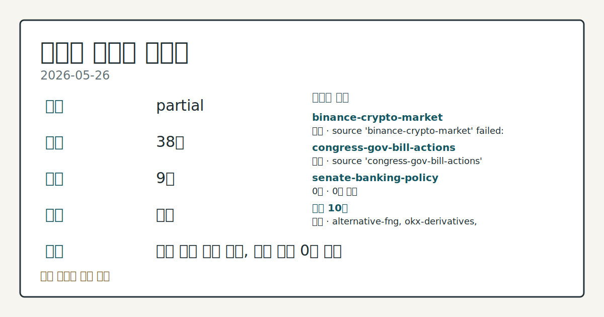
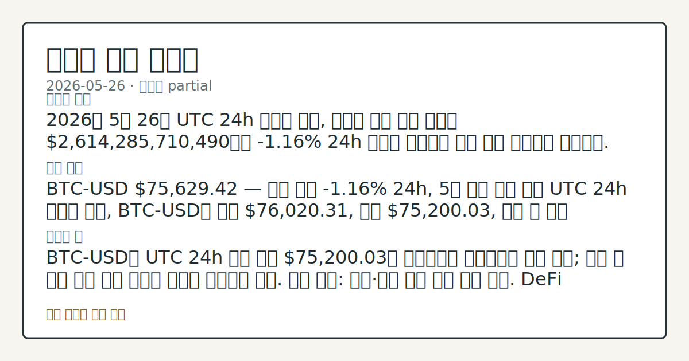

> 정보 제공용 자동 시황이며 가상자산 매매 권유가 아닙니다. 가상자산은 가격 변동성이 매우 큽니다.

# 2026-05-26 크립토 시황

**기준 시각**: 2026-05-26 UTC · [2026-05-26T00:00Z, 2026-05-27T00:00Z)

| 종목 | 스냅샷(UTC 24h) | 구간 변동 | 비고 |
|------|------|------|------|
| BTC-USD | 75,629.42 | -0.29% | +20.59% from 52w low · -14.79% YTD |
| ETH-USD | 2,075.00 | +0.21% | +13.91% from 52w low · -30.84% YTD |

**세그먼트**: [국내 증시](../../../domestic-equity/2026/05/2026-05-26.md) | [미국 증시](../../../us-equity/2026/05/2026-05-26.md) | [크립토](2026-05-26.md)

*이미지: 데이터 신뢰도 · 출처: investo 자체 생성 · 생성: investo 0.1.0 · 2026-05-27 UTC*

> **내 관심 자산 영향**: 15건 확인 (기본 바스켓) — BTC: [boundary-term] Global crypto market cap **$2,614,285,710,490**; BTC dominance **57.94%**; BTC: [alias:Bitcoin] DeFi TVL **$81.3**B; leader Ethereum; BTC: [boundary-term] BTC 미결제약정 **$461,628,600** (OKX, UTC 24h); BTC: [boundary-term] BTC 펀딩비 0.0000831706735890 (OKX, UTC 24h); BTC: [structured-symbol] BTC-USD 75,629.42 외
> **오늘의 결론**: 2026년 5월 26일 UTC 24h 스냅샷 기준, 크립토 시장 전체 시총은 **$2,614,285,710,490**으로 **-1.16%** 24h 하락을 기록하며 전주 대비 감소세를 이어갔다. [데이터부족]
> **핵심 동인**: BTC-USD **$75,629.42** — 전체 시총 **-1.16%** 24h, 5월 하락 흐름 연장 UTC 24h 스냅샷 기준, BTC-USD는 고가 **$76,020.31**, 저가 **$75,200.03**, 구간 내 종가 **$75,629.42**를 기록했다(stooq). 전체 시총은 **$2,614,285,710,490**으로 **-1.16%** 하락했으며(CoinGecko), BTC 도미넌스(BTC 점유율)는 **57.94%**다.
> **주의할 점**: BTC-USD가 UTC 24h 구간 저가 **$75,200.03**을 지지선으로 유지하는지 추세 확인; 이탈 시 하방 압력 심화 여부를 방어적 시각으로 해석...

> **데이터 상태**: 부분 · 본문 사용 미집계 · 실패 2 · 0건 2

수집/품질 진단

> **데이터 상태**: 부분 — 수집 33건 / 소스 8개 / 누락: 없음 · 부분 — 일부 카테고리 미수집, 본문 일부 결론 보강 필요
> **소스 카운트**: 수집 대상 13 / 성공 9 / 0건 2 / 실패 2 / 본문 사용 미집계
> **소스 등급 분포**: S=2 / A=1 / B=6
> **상세 사유**: 일부 소스 수집 실패, 일부 소스 0건 반환
> **소스별 상태**: binance-crypto-market 실패 (접근 제한), congress-gov-bill-actions 실패 (설정 미완료(미수집)), coingecko-price 0건, senate-banking-policy 0건, 정상 9개

## 한눈에 보기

- 크립토 전체 시총 **-1.16%** 24h 하락, BTC-USD **$75,629.42**로 5월 중순 이후 약세 흐름 연장
- 공포·탐욕 지수(Fear & Greed Index) **25** (Extreme Fear) — KelpDAO 익스플로잇 이후 DeFi TVL이 **14%** 감소하며 리스크 회피 흐름 지속
- Clarity Act(디지털자산 규제 법안) 통과 불강한성 + BTC 저가 **$75,200.03** 지지 여부 — 본문 §②·§⑥ 참조

## ⓪ 오늘의 매크로

- **미 국채 수익률** — UST curve 2026-05-26: 10Y 4.50%, 2Y10Y +0.49pp

## ⓪-A 크립토 지표 (UTC 24h 스냅샷)

| 지표 | 값 |
|------|------|
| 공포·탐욕 | 25 (Extreme Fear) |
| BTC 도미넌스 | 57.94% |
| 전체 시총 | $2.61T (-1.16% 24h) |
| BTC 펀딩비 | 0.0000831706735890 (okx) |
| BTC 미결제약정 | $461.6M (okx) |
| DeFi TVL | $81.3B |
| 스테이블코인 공급 | $321.3B |
| 24h 청산 / 거래소 순유출입 | 무료 검증 소스 미확정 |

## ⓪-B 채널 기준선

| 기준선 | 값 |
|------|------|
| 비트코인 | 75,629.42 (-0.29%) |
| 이더리움 | 2,075.00 (+0.21%) |
| BTC 도미넌스 | 57.94% |
| 공포·탐욕 | 25 |
| 펀딩/OI/청산 | 펀딩 0.0000831706735890 · OI 수집됨 |

> **크로스마켓 연결 고리**: 금리 이벤트가 할인율/달러 경로의 공통 변수로 남아 있습니다.

## ① 요약

*이미지: 시장 스냅샷 · 출처: investo 자체 생성 · 생성: investo 0.1.0 · 2026-05-27 UTC*

2026년 5월 26일 UTC 24h 스냅샷 기준, 크립토 시장 전체 시총은 **$2,614,285,710,490**으로 **-1.16%** 24h 하락을 기록하며 전주 대비 감소세를 이어갔다. BTC-USD는 **$75,629.42**에 스냅샷되며 5월 중순 이후 이어진 하락 흐름이 유지됐다. DeFi TVL(탈중앙화 금융 총예치금) 감소, CFTC(상품선물거래위원회)·OCC(통화감독청) 인가 논쟁, Clarity Act 입법 불강한성이 복합적으로 작용하며 투자 심리가 위축된 상태다. [하락 관찰]

## ② 전일 핵심 이슈

### BTC-USD **$75,629.42** — 전체 시총 **-1.16%** 24h, 5월 하락 흐름 연장

UTC 24h 스냅샷 기준, BTC-USD는 고가 **$76,020.31**, 저가 **$75,200.03**, 구간 내 종가 **$75,629.42**를 기록했다([stooq](https://stooq.com/q/?s=btc.v)). 전체 시총은 **$2,614,285,710,490**으로 **-1.16%** 하락했으며([CoinGecko](https://www.coingecko.com/en/global-charts)), BTC 도미넌스는 **57.94%**다. 어제(2026-05-25) **+0.44%** 소폭 반등이 하루 만에 재차 약세로 전환된 형태로, 5월 중순 이후 이어진 하락 추세가 유지되고 있다.

> **그래서 의미는?** BTC가 구간 저가 **$75,200.03**을 간신히 지킨 채 마감했으며, 전일 반등이 지속되지 못하고 있어 지지 수준 재확인이 필요한...

### Clarity Act 통과 불강한 — TD Cowen "올해 어렵다"

TD Cowen은 Clarity Act(디지털자산 시장구조 감독 법안)를 둘러싼 정치적 환경이 악화되고 있어 올해 통과가 어렵다고 평가했다([The Block](https://www.theblock.co/post/402649/td-cowen-crypto-bill-worsening-political-environment-trump)). 법안의 핵심은 SEC(증권거래위원회)와 CFTC 간 디지털자산 관할권 분배로, 처리 지연은 규제 불강한성 구간을 연장시킨다.

### Trump, CFTC 예측시장 권한 확장 지지 — 스페인은 Polymarket·Kalshi 차단

트럼프 대통령이 CFTC Chair Michael Selig의 예측시장 관할 확대 추진을 공개 지지했다([The Block](https://www.theblock.co/post/402672/critically-important-president-trump-backs-cftc-chair-seligs-push-to-expand-prediction-market-authority)). 같은 날 스페인은 Polymarket·Kalshi를 무허가 운영을 이유로 차단했으며([The Block](https://www.theblock.co/post/402620/spain-blocks-polymarket-kalshi-for-operating-without-licenses-amid-widening-global-crackdown-on-prediction-markets)), 예측시장에 대한 국제 규제 파편화가 심화되는 흐름이다.

### UK, HTX 러시아 지원 이유로 제재 — OCC 크립토 인가 논쟁 병행

영국이 HTX 거래소를 러시아 정부 지원 혐의로 제재했다([The Block](https://www.theblock.co/post/402591/uk-sanctions-htx-over-support-of-russia-in-broad-sweep-over-crypto-exchanges)). 미국에서는 Digital Chamber가 상원의원 Warren의 Ripple·Coinbase OCC 국가신탁인가 '부적절' 주장을 반박하며 인가 적법성을 옹호했다([The Block](https://www.theblock.co/post/402639/crypto-industry-defends-occ-charters-for-ripple-coinbase-after-warren-calls-unlawful)).

## ③ 섹터/수급 동향

### DeFi TVL **$81.3**B — KelpDAO 익스플로잇 이후 14% 감소 지속

DeFi 섹터의 TVL은 **$81.3B**로, KelpDAO 익스플로잇 발생 5주 후에도 **14%** 감소 추세가 이어지고 있다([The Block](https://www.theblock.co/post/402641/defi-tvl-slides-14-since-kelpdao-exploit-as-risk-appetite-retreats)). 체인별로는 Ethereum이 **$42.6B**로 선두이며, BSC **$5.5B**, Solana **$5.4B**, Tron **$5.1B**, Bitcoin **$5.0B** 순이다([DefiLlama](https://defillama.com/)). 스테이블코인 공급은 **$321.3B**으로, USDT(테더) **$189.3B**, USDC **$76.6B**가 지배적이다.

> **그래서 의미는?** Ethereum이 전체 DeFi 예치금의 절반 이상을 차지하지만, TVL 감소가 5주째 지속되고 있어 생태계 전반의 리스크 회피 흐름을 확인...

### Base MCP 게이트웨이 출시 — AI 인터페이스 온체인 접근성 확대

Coinbase 인큐베이팅 블록체인 Base가 MCP(모델컨텍스트프로토콜) 게이트웨이를 출시해 Claude·ChatGPT 같은 AI 인터페이스와 연동을 시작했다([The Block](https://www.theblock.co/post/402631/coinbase-base-mcp-gateway-ai-interfaces-claude-chatgpt)). 자연어로 토큰 교환·자산 이전이 가능해지며 온체인 접근성 확대가 관찰된다. 한편 Tether 전용 레이어 1 체인 Stable은 USDT 보유자를 대상으로 미국채·금 연동 기관 수익 상품을 출시했다([The Block](https://www.theblock.co/post/402582/tether-focused-chain-stable-launches-usdt-institutional-yield-product)).

## ④ 지표·이벤트

### 공포·탐욕 25 (Extreme Fear) — BTC 파생상품 지표

공포·탐욕 지수는 **25** (Extreme Fear)로 집계됐다([alternative.me](https://alternative.me/crypto/fear-and-greed-index/)). OKX 기준 BTC 펀딩비(포지션 유지 비용)는 **0.0000831706735890**으로 소폭 양수 구간이며, BTC 미결제약정(OI·Open Interest)은 **$461,628,600**이다([OKX](https://www.okx.com/trade-swap/btc-usd-swap)).

> **그래서 의미는?** 펀딩비가 소폭 양수로 롱 포지션이 소량 우세하지만, Extreme Fear 심리와의 괴리가 커 교차 지표 확인이 필요한 구간입니다.

### UST 금리 구간 — 크립토 리스크 자산 시각에서 재해석

UST(미국채) 10Y 금리는 **4.50%**, 30Y는 **5.03%**, 2Y는 **4.01%**로 집계됐다([U.S. Treasury](https://home.treasury.gov/resource-center/data-chart-center/interest-rates)). 고금리 지속은 크립토 같은 위험자산의 기회비용을 높이는 배경 요인으로, 현재 Extreme Fear 심리와 궤를 같이하는 관찰 지표다.

24h 정리 및 거래소 순유출입 데이터는 무료 검증 소스 미확정으로 인해 데이터 미수집 상태다.

## ⑤ 주요 종목

<!-- u50 lightweight-charts-embed: placeholders consumed by site_docs/assets/investo-chart-init.js -->

<noscript><em>인터랙티브 차트는 JavaScript가 활성화된 환경에서 표시됩니다. 위 정적 카드가 동일한 정보를 담고 있습니다.</em></noscript>

### 가격 스냅샷

| 종목 | 시가 | 고가 | 저가 | 구간 내 종가 |
|------|------|------|------|------|
| BTC-USD | 75,808.53 | 76,020.31 | 75,200.03 | 75,629.42 |
| ETH-USD | 2,070.61 | 2,082.14 | 2,053.59 | 2,074.99 |

> **그래서 의미는?** BTC(비트코인)와 ETH(이더리움) 모두 좁은 구간 내 등락을 보이며, 방향 전환 없이 최근 하락 흐름을 연장하고 있어 추가 지지 수준...

### 기업 매입 확인 항목

- Strive(비벡 라마스와미 설립 운용사)가 BTC **$85.4M** 규모를 추가 매입해 상장사 BTC 보유량 7위로 올라섰다([The Block](https://www.theblock.co/post/402567/strive-leapfrogs-coinbase-riot-85-4-million-bitcoin-buy)).
- Bitmine은 ETH 가격 하락 구간에 **100,000** ETH 이상을 매입했으며, 전체 공급량의 **5%** 보유 목표에 근접했다([The Block](https://www.theblock.co/post/402566/bitmine-capitalizes-on-ethereum-price-drop-buys-over-100000-eth-as-5-supply-goal-nears)).

### 지수 포함 관찰 항목

- ETH 및 SOL(솔라나) 재무 전략을 보유한 Sharplink·Forward가 Russell 지수에 포함됐다([The Block](https://www.theblock.co/post/402627/ethereum-solana-treasury-firms-sharplink-forward-join-russell-indexes)). Russell 미국 지수에는 약 **$12.2T** 투자자 자산이 벤치마크되어 있다.

### 프로토콜 출시 확인 항목

- Umbra(Solana 프라이버시 레이어)가 Streamflow와 함께 기밀 토큰 베스팅(vesting·배분 잠금) 서비스를 출시했다. 대상 시장은 **$97B** 규모의 토큰 언락(잠금 해제) 시장이다([The Block](https://www.theblock.co/post/402549/solana-privacy-layer-umbra-launches-confidential-vesting-with-streamflow-targeting-97b-token-unlock-market)).

## ⑥ 오늘의 관전 포인트

| 관찰 신호 | 현재 | 상방 확인 조건 | 하방 확인 조건 | 신뢰도 | 섹션 내 관심 영향 |
| --- | --- | --- | --- | --- | --- |
| BTC-USD가 | — | 데이터부족 | 데이터부족 | 데이터부족 | — |
| DeFi TVL이 | — | 데이터부족 | 데이터부족 | 데이터부족 | — |
| Clarity Act 의회 처리 일정 변화 여부 흐름 … | — | 데이터부족 | 데이터부족 | 데이터부족 | — |
| BTC 펀딩비 **0.0000831706735890**… | — | 데이터부족 | 데이터부족 | 데이터부족 | — |
| HTX 제재·Polymarket 차단 이후 국제 거래소… | — | 데이터부족 | 데이터부족 | 데이터부족 | — |
| `input_hash`: `1ee42e89b281` | — | 데이터부족 | 데이터부족 | 데이터부족 | — |

_관전 신호 2건 추가 — 본문 참조._
## ⑦ 면책조항
본 시황은 일반 정보 제공을 목적으로 자동 생성된 자료이며,
특정 가상자산에 대한 매매 권유나 투자 자문이 아닙니다.
가상자산은 가상자산이용자보호법(2024-07-19 시행) §10·§19의 적용 대상으로,
24시간 거래되는 비제도권 자산이며 가격 변동성이 매우 크고 원금 전액 손실이 가능합니다.
투자 결정과 그 결과에 대한 책임은 전적으로 본인에게 있으며,
본 시황의 내용에 따라 발생한 손실에 대해 작성자는 일체의 책임을 지지 않습니다.