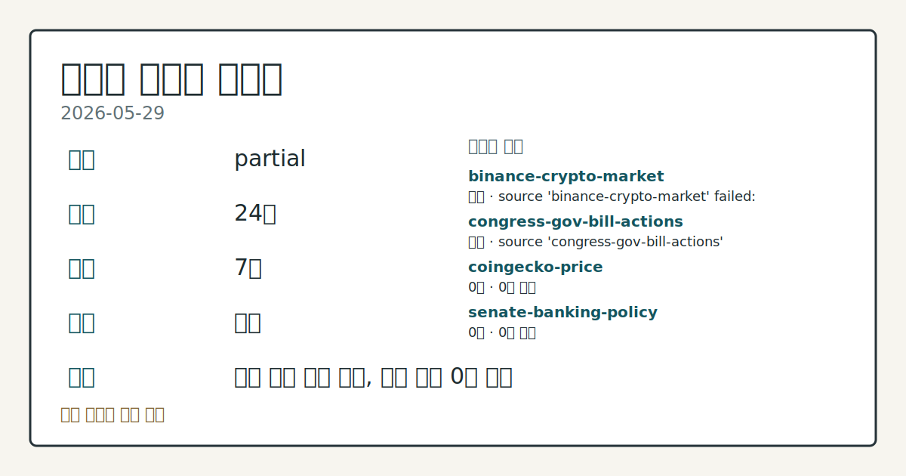
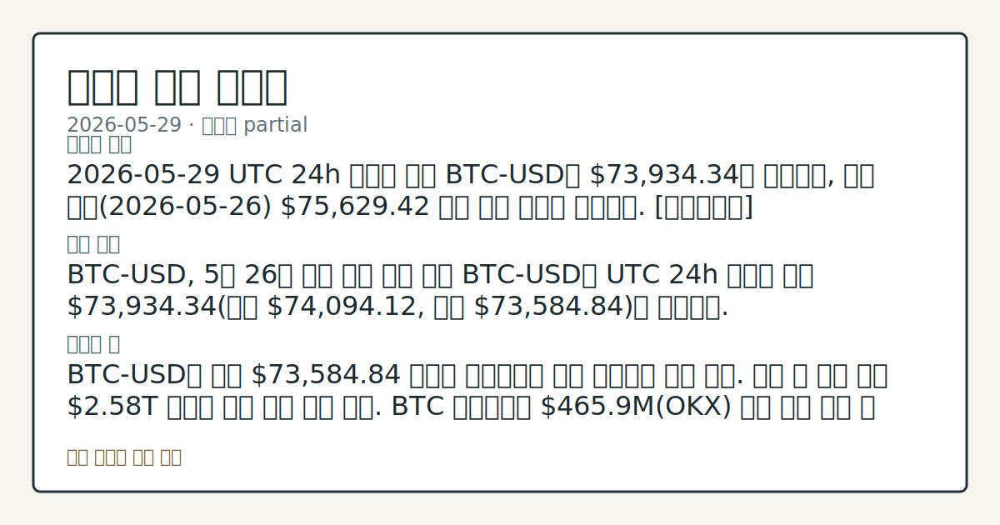

> 정보 제공용 자동 시황이며 가상자산 매매 권유가 아닙니다. 가상자산은 가격 변동성이 매우 큽니다.

# 2026-05-29 크립토 시황

**기준 시각**: 2026-05-29 UTC · [2026-05-29T00:00Z, 2026-05-30T00:00Z)

| 종목 | 스냅샷(UTC 24h) | 구간 변동 | 비고 |
|------|------|------|------|
| BTC-USD | 73,934.34 | +0.25% | +17.92% from 52w low · -16.67% YTD |
| ETH-USD | 2,015.16 | -0.23% | +10.61% from 52w low · -32.85% YTD |

**세그먼트**: [국내 증시](../../../domestic-equity/2026/05/2026-05-29.md) | [미국 증시](../../../us-equity/2026/05/2026-05-29.md) | [크립토](2026-05-29.md)

*이미지: 데이터 신뢰도 · 출처: investo 자체 생성 · 생성: investo 0.1.0 · 2026-05-31 UTC*

> **내 관심 자산 영향**: 10건 확인 (기본 바스켓) — BTC: [boundary-term] Global crypto market cap **$2,584,161,091,835**; BTC dominance **57.30%**; BTC: [alias:Bitcoin] DeFi TVL **$80.5**B; leader Ethereum; BTC: [boundary-term] BTC 미결제약정 **$465,912,370** (OKX, UTC 24h); BTC: [boundary-term] BTC 펀딩비 0.0000660349123262 (OKX, UTC 24h); BTC: [structured-symbol] BTC-USD 73,934.34 외
> **오늘의 결론**: 2026-05-29 UTC 24h 스냅샷 기준 BTC-USD는 **$73,934.34**로 확인되며, 직전 시황(2026-05-26) **$75,629.42** 대비 하락 흐름이 연장됐다. [데이터부족]
> **핵심 동인**: BTC-USD, 5월 26일 대비 하락 흐름 연장 BTC-USD는 UTC 24h 스냅샷 기준 **$73,934.34**(고가 **$74,094.12**, 저가 **$73,584.84**)로 확인됐다.
> **주의할 점**: BTC-USD가 저가 **$73,584.84** 지지를 유지하는지 추가 구간에서 추세 확인. 이탈 시 전체 시총 **$2.58**T 기준선 이탈 여부 연계 관찰...

> **데이터 상태**: 부분 · 본문 사용 미집계 · 실패 2 · 0건 3

수집/품질 진단

> **데이터 상태**: 부분 — 수집 24건 / 소스 7개 / 누락: 없음 · 부분 — 일부 카테고리 미수집, 본문 일부 결론 보강 필요
> **소스 카운트**: 수집 대상 13 / 성공 8 / 0건 3 / 실패 2 / 본문 사용 미집계
> **소스 등급 분포**: S=1 / A=1 / B=6
> **상세 사유**: 일부 소스 수집 실패, 일부 소스 0건 반환
> **소스별 상태**: binance-crypto-market 실패 (접근 제한), congress-gov-bill-actions 실패 (설정 미완료(미수집)), coingecko-price 0건, senate-banking-policy 0건, house-financial-services-policy 0건, 정상 8개

## 한눈에 보기

- BTC-USD가 **$73,934.34**로 스냅샷, 전체 시총 **$2.58T**(**+0.24%** 24h) — 직전 시황 **$75,629.42** 대비 하락 흐름 연장
- CFTC(미국상품선물거래위원회)가 미국 내 크립토 퍼페추얼 선물(무기한 선물 계약) 공식 허용 — Coinbase·Kalshi 즉각 접근 준비, 미국 파생 시장 구조 전환 관찰
- 공포·탐욕 지수 **28**(Fear), BTC 미결제약정 OKX 기준 **$465.9M** — 펀딩비 소폭 양수 속 심리·포지션 괴리 추세 점검, §④ 참조

## ⓪ 오늘의 매크로

- **미 국채 수익률** — UST curve 2026-05-29: 10Y 4.45%, 2Y10Y +0.47pp

## ⓪-A 크립토 지표 (UTC 24h 스냅샷)

| 지표 | 값 |
|------|------|
| 공포·탐욕 | 28 (Fear) |
| BTC 도미넌스 | 57.30% |
| 전체 시총 | $2.58T (+0.24% 24h) |
| BTC 펀딩비 | 0.0000660349123262 (okx) |
| BTC 미결제약정 | $465.9M (okx) |
| DeFi TVL | $80.5B |
| 스테이블코인 공급 | $318.9B |
| 24h 청산 / 거래소 순유출입 | 무료 검증 소스 미확정 |

## ⓪-B 채널 기준선

| 기준선 | 값 |
|------|------|
| 비트코인 | 73,934.34 (+0.25%) |
| 이더리움 | 2,015.16 (-0.23%) |
| BTC 도미넌스 | 57.30% |
| 공포·탐욕 | 28 |
| 펀딩/OI/청산 | 펀딩 0.0000660349123262 · OI 수집됨 |

> **크로스마켓 연결 고리**: 금리 이벤트가 할인율/달러 경로의 공통 변수로 남아 있습니다.

## ① 요약

*이미지: 시장 스냅샷 · 출처: investo 자체 생성 · 생성: investo 0.1.0 · 2026-05-31 UTC*

2026-05-29 UTC 24h 스냅샷 기준 BTC-USD는 **$73,934.34**로 확인되며, 직전 시황 **$75,629.42** 대비 하락 흐름이 연장됐다. 전체 시총은 **$2.58T**(**+0.24%** 24h)로 소폭 반등했으나 공포·탐욕 지수 **28**(Fear)이 나타내는 심리 위축은 지속됐고, BTC 도미넌스는 **57.30%**로 알트코인 대비 BTC 집중 구도가 유지됐다. 규제 측면에서는 CFTC의 퍼페추얼 선물 허용 공식화, Paxos의 SEC(미국증권거래위원회) 결제·정리기관 등록, 재무장관 Bessent의 CBDC(중앙은행디지털화폐) 불도입 재확인이 집중되며 미국 제도화 흐름이 가속됐다. 반면 JPMorgan CEO Dimon이 Clarity Act(디지털자산시장구조법)에 공개 반대 입장을 선언하며 법안 통과 경로의 마찰이 부각됐다. [하락 관찰]

## ② 전일 핵심 이슈

### BTC-USD, 5월 26일 대비 하락 흐름 연장

BTC-USD는 UTC 24h 스냅샷 기준 [**$73,934.34**](https://stooq.com/q/?s=btc.v)(고가 **$74,094.12**, 저가 **$73,584.84**)로 확인됐다. 직전 시황 기록 **$75,629.42** 이후 하방 압력이 이어지며, 5월 20일 반등 구간에서 지속된 하락 추세가 이번 스냅샷에서도 연장됐다. 전체 시총 **$2.58T** 내 BTC 도미넌스 **57.30%**는 하락 국면에서 알트코인 대비 BTC로의 집중이 지속됨을 보여준다.

> **그래서 의미는?** BTC 가격 하락이 공포 심리 구간(공포·탐욕 **28**)과 같은 방향으로 누적되며, 5월 중순 반등 이후의 단기 회복 동력이 이번...

### CFTC, 미국 내 크립토 퍼페추얼 선물 공식 허용 — Coinbase·Kalshi 접근 준비

[CFTC는 미국 내 암호화폐 무기한 선물(퍼페추얼 선물) 계약 거래의 문을 공식 열었으며](https://www.theblock.co/post/403040/cftc-opens-door-for-crypto-perpetual-future-contracts-in-us-as-coinbase-kalshi-move-forward), Coinbase와 예측시장 플랫폼 Kalshi가 해당 상품 제공 준비에 나섰다. 그간 해외 거래소의 핵심 상품으로 여겨졌던 퍼페추얼 선물이 미국 제도권 내에 포함되는 구조적 전환점으로 관찰된다.

### JPMorgan CEO Dimon, Clarity Act 공개 반대 — 행정부와 입장 충돌

[Dimon은 Coinbase CEO Brian Armstrong이 Clarity Act 통과를 위해 수억 달러를 지출하고 있다고 공개 비판하며 법안 반대 입장을 선언했다.](https://www.theblock.co/post/403049/jpmorgan-ceo-jamie-dimon-blasts-coinbases-brian-armstrong-plans-fight-clarity-act) 같은 날 [재무장관 Bessent는 의회를 향해 Clarity Act 마무리를 촉구하는 동시에 CBDC 불도입 방침을 재확인했다.](https://www.theblock.co/post/402971/scott-bessent-reiterates-no-cbdc) 행정부와 전통 금융 대형 기관 간 입장 충돌이 법안 통과 일정의 마찰 요인으로 노출됐다.

### 미국, 이란 연계 크립토 자산 약 **$1**B 압류

[Bessent 재무장관에 따르면 미국은 이란 연계 크립토 자산을 올해 들어 약 **$1**B 가까이 압류했다.](https://www.theblock.co/post/403075/us-has-seized-nearly-1-billion-in-crypto-from-iran-bessent-says) 이전에 공개된 "**$500**M" 발언에서 규모가 두 배 수준으로 확대된 것으로, 지정학적 압류를 통해 대규모 크립토가 시장 외부에 동결 상태임을 확인하는 사례다.

### Paxos, SEC 결제·정리기관 등록 최초 획득

[Paxos는 블록체인 네이티브 기업 최초로 SEC로부터 결제·정리기관(Clearing Agency) 등록을 획득했다고 발표했다.](https://www.theblock.co/post/402994/paxos-sec-registration) 스테이블코인 인프라 기업이 전통 금융 규제 체계 안에 공식 포함된 첫 사례로, 크립토 결제 인프라의 제도화 진전이 확인됐다.

## ③ 섹터/수급 동향

### DeFi(탈중앙화금융) TVL(총예치액) 및 스테이블코인 공급

[DeFi TVL](https://defillama.com/)은 **$80.5B**로 Ethereum이 **$42.2B**로 1위를 유지하며 BSC **$5.7B**, Solana **$5.4B**, Tron **$4.9B**, Bitcoin **$4.8B** 순으로 집계됐다. 스테이블코인(안정화화폐) 총공급은 **$318.9B**로 USDT **$188.1B**, USDC **$75.9B**, USDS **$8.8B**, USD1 **$4.7B**, DAI **$4.6B** 순이다.

> **그래서 의미는?** 스테이블코인 공급 **$318.9B**이 유지되는 동안 BTC 가격이 하락하는 구도는, 대기 유동성은 존재하지만 즉각 유입이 나타나지 않는...

### 기관 인프라 확장 및 거래소 동향

[ICE(인터콘티넨탈익스체인지) CEO는 온체인 퍼페추얼 시장 평가를 위해 탈중앙화 파생 거래소 Hyperliquid와 복수의 협의를 진행했음을 확인했으며](https://www.theblock.co/post/402975/ice-ceo-hyperliquid), CME도 같은 논의에 참여한 것으로 보도됐다. 마켓메이커(시장조성자) Wintermute는 [예측시장(Prediction Market)으로 거래 인프라를 확장했으며](https://www.theblock.co/post/403029/wintermute-extends-trading-infrastructure-into-prediction-markets) 기관 유동성 공급자의 영역이 넓어졌다.

### OKX, Coinone 지분 20% 취득 — 한국 시장 접근

[OKX는 국내 거래소 Coinone 지분 **20%**를 **$53M**에 취득한다고 공식 확인했다.](https://www.theblock.co/post/402969/okx-confirms-53-million-coinone) Binance의 Gopax 인수에 이어 글로벌 대형 거래소의 한국 시장 교두보 확보 흐름이 이어졌다.

### Aave Labs, 영국 FCA(영국금융감독청) 이중 라이선스 취득

[Aave Labs는 자회사 Push를 통해 FCA 크립토자산 등록을 완료했으며](https://www.theblock.co/post/403014/aave-labs-secures-dual-uk-licenses-for-regulated-crypto-payments-infrastructure-through-local-subsidiary), 무수수료 법정화폐 온램프(fiat on-ramp) 서비스 개시를 위한 기반을 마련했다.

## ④ 지표·이벤트

### 공포·탐욕 지수 및 BTC 파생 지표

[공포·탐욕 지수](https://alternative.me/crypto/fear-and-greed-index/)는 **28**(Fear)으로 시장 심리가 위축 영역에 위치했다. BTC 펀딩비(선물 포지션 유지를 위한 정기 비용)는 [OKX 기준 **0.0000660349123262**](https://www.okx.com/trade-swap/btc-usd-swap)로 소폭 양수를 유지해 매수 포지션이 우위이나 절대값이 낮아 확신 강도는 약한 상태다. BTC 미결제약정(Open Interest)은 OKX 기준 [**$465,912,370**(**$465.9M**)](https://www.okx.com/trade-swap/btc-usd-swap)으로 확인됐다. 24h 정리 규모 및 거래소 순유출입은 무료 검증 소스 미확정으로 데이터 미수집 상태다.

> **그래서 의미는?** 공포 구간에서 펀딩비가 양수를 유지하는 괴리는 매수 포지션 유지 비용이 지속 발생하는 구조이며, 미결제약정 **$465.9M** 규모가 추가...

### UST 금리 (매크로 배경 참조)

[UST(미국채) 10Y 금리 **4.45%**, 2Y **3.98%**, 30Y **4.99%**, 2Y10Y 스프레드 **+0.47pp**](https://home.treasury.gov/resource-center/data-chart-center/interest-rates) (2026-05-29 기준). 크립토 위험자산의 달러 기회비용 배경 지표로, 세그먼트 직접 지표는 아니나 시장 전반의 조달 환경 참고 항목으로 관찰한다.

## ⑤ 주요 종목

<!-- u50 lightweight-charts-embed: placeholders consumed by site_docs/assets/investo-chart-init.js -->

<noscript><em>인터랙티브 차트는 JavaScript가 활성화된 환경에서 표시됩니다. 위 정적 카드가 동일한 정보를 담고 있습니다.</em></noscript>

### 가격 스냅샷 (UTC 24h)

| 자산 | 종가(C) | 고가(H) | 저가(L) |
|------|---------|---------|---------|
| [BTC-USD](https://stooq.com/q/?s=btc.v) | $73,934.34 | $74,094.12 | $73,584.84 |
| [ETH-USD](https://stooq.com/q/?s=eth.v) | $2,015.15 | $2,020.16 | $2,002.31 |

> **그래서 의미는?** BTC(비트코인)가 **$73,934.34**, ETH(이더리움)가 **$2,015.15**로 직전 시황 대비 하락한 가운데, BTC 도미넌스...

### 확인 항목

- **Sui**: [목요일 5시간 55분 다운타임](https://www.theblock.co/post/403028/sui-blockchain-suffers-more-downtime-following-thursdays-six-hour-outage) 이후 추가 장애 발생. 최신 "1.72 릴리즈" 버그가 원인으로 확인됐다.
- **Base(Coinbase Ethereum L2(이더리움 레이어2))**: [Azul 업그레이드 메인넷 배포 완료.](https://www.theblock.co/post/403003/base-launches-azul-on-mainnet-pushing-coinbases-ethereum-l2-toward-full-decentralization) 멀티프루프(multiproofs)·신규 클라이언트 스택 적용으로 탈중앙화 진전.
- **Hyperliquid**: Ventuals의 오라클 데이터 오류로 SPACEX 퍼페추얼(SpaceX 사전 IPO 연계 파생 계약)이 **-45%** 급락, **$1.51M** 손실 발생. [거래자 보상 계획 발표됨.](https://www.theblock.co/post/402991/ventuals-to-compensate-traders-after-pre-ipo-spacex-perps-plunge-45-on-hyperliquid)

### 관전 분류

- **Texas 전략 비트코인 준비금**: CleanSpark 임원·비트코인 채굴업체 CEO를 [위원회에 선임.](https://www.theblock.co/post/403026/texas-cleanspark-exec-bitcoin-miner-ceo-strategic-bitcoin-reserve-committee) Blackrock IBIT(비트코인 현물 ETF(상장지수펀드) 형태 보유)에서 직접 비트코인 보유로 전환하기 위한 커스터디언(수탁기관) 선정 절차 진행 중.

## ⑥ 오늘의 관전 포인트

| 관찰 신호 | 현재 | 상방 확인 조건 | 하방 확인 조건 | 신뢰도 | 섹션 내 관심 영향 |
| --- | --- | --- | --- | --- | --- |
| BTC-USD가 | — | 데이터부족 | 데이터부족 | 데이터부족 | — |
| BTC 미결제약정 **$465.9M**(OKX) 축소 … | — | 데이터부족 | 데이터부족 | 데이터부족 | — |
| CFTC 크립토 퍼페추얼 선물 허용 이후 Coinbas… | — | 데이터부족 | 데이터부족 | 데이터부족 | — |
| Clarity Act — Bessent의 통과 촉구와 … | — | 데이터부족 | 데이터부족 | 데이터부족 | — |
| OKX의 Coinone 지분 **20%** 취득(**$… | — | 데이터부족 | 데이터부족 | 데이터부족 | — |
| Sui 추가 | — | 데이터부족 | 데이터부족 | 데이터부족 | — |

_관전 신호 3건 추가 — 본문 참조._
## ⑦ 면책조항
본 시황은 일반 정보 제공을 목적으로 자동 생성된 자료이며,
특정 가상자산에 대한 매매 권유나 투자 자문이 아닙니다.
가상자산은 가상자산이용자보호법(2024-07-19 시행) §10·§19의 적용 대상으로,
24시간 거래되는 비제도권 자산이며 가격 변동성이 매우 크고 원금 전액 손실이 가능합니다.
투자 결정과 그 결과에 대한 책임은 전적으로 본인에게 있으며,
본 시황의 내용에 따라 발생한 손실에 대해 작성자는 일체의 책임을 지지 않습니다.