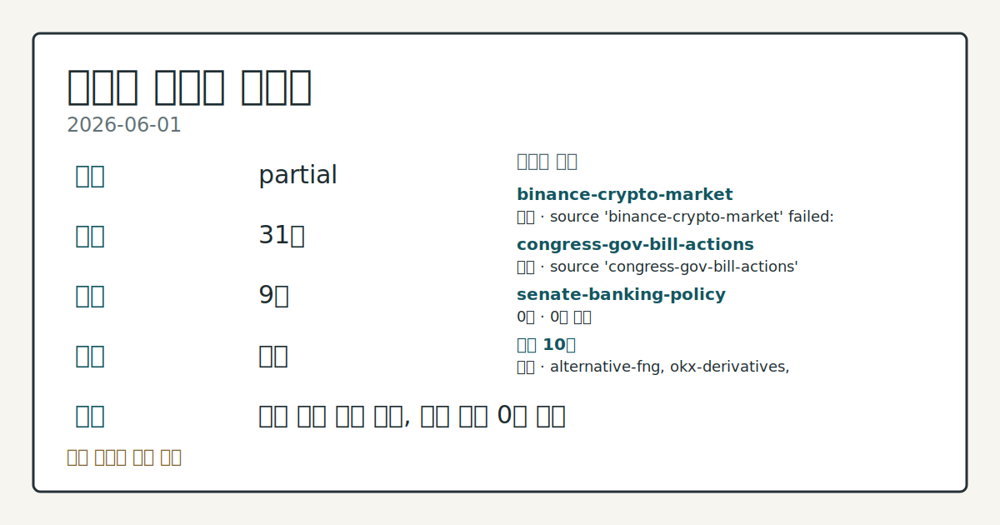
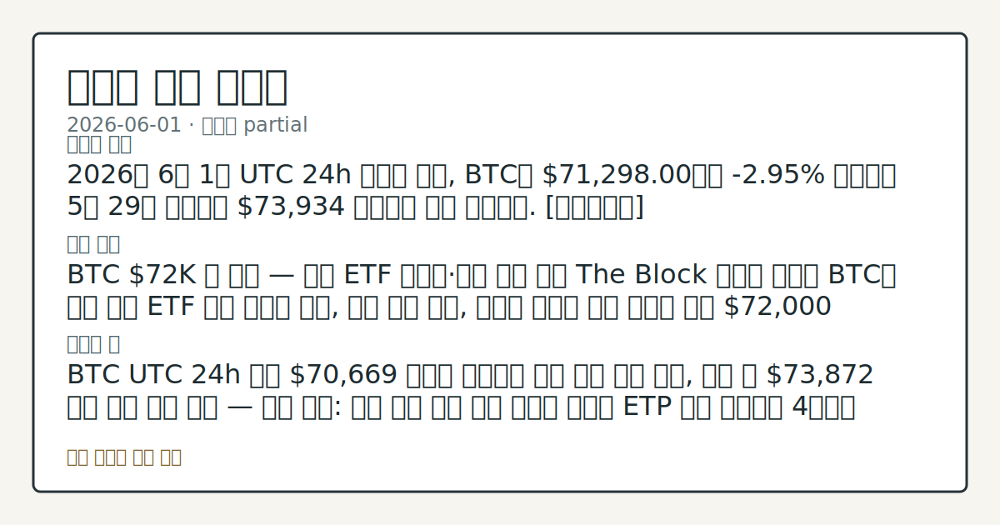
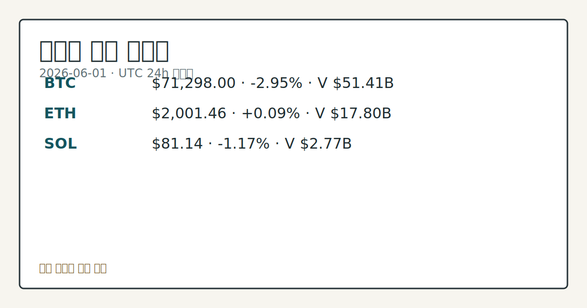

> 정보 제공용 자동 시황이며 가상자산 매매 권유가 아닙니다. 가상자산은 가격 변동성이 매우 큽니다.

# 2026-06-01 크립토 시황

**기준 시각**: 2026-06-01 UTC · [2026-06-01T00:00Z, 2026-06-02T00:00Z)

| 종목 | 스냅샷(UTC 24h) | 구간 변동 | 비고 |
|------|------|------|------|
| BTC-USD | 71,481.36 | -2.90% | +13.94% from 52w low · -19.48% YTD |
| ETH-USD | 2,004.89 | -0.01% | +10.01% from 52w low · -33.21% YTD |

**세그먼트**: [국내 증시](../../../domestic-equity/2026/06/2026-06-01.md) | [미국 증시](../../../us-equity/2026/06/2026-06-01.md) | [크립토](2026-06-01.md)

*이미지: 데이터 신뢰도 · 출처: investo 자체 생성 · 생성: investo 0.1.0 · 2026-06-02 UTC*

> **내 관심 자산 영향**: 17건 확인 (기본 바스켓) — BTC: [boundary-term] Global crypto market cap **$2,522,045,216,803**; BTC dominance **56.58%**; BTC: [structured-symbol] BTC **$71,298.00** (**-2.95%**); BTC: [alias:Bitcoin] DeFi TVL **$79.6**B; leader Ethereum; BTC: [boundary-term] BTC 미결제약정 **$476,016,620** (OKX, UTC 24h); BTC: [boundary-term] BTC 펀딩비 0.0001000000000000 (OKX, UTC 24h) 외
> **오늘의 결론**: 2026년 6월 1일 UTC 24h 스냅샷 기준, BTC는 **$71,298.00**으로 **-2.95%** 하락하며 5월 29일 기록했던 **$73,934** 수준에서 추가 이탈했다. [데이터부족]
> **핵심 동인**: BTC **$72**K 권 약세 — 현물 ETF 순유출·고래 매수 정체 The Block 보도에 따르면 BTC는 미국 현물 ETF 주간 순유출 재개, 고래 매수 정체, 이란발 리스크 오프 분위기 속에 **$72,000** 권에서 약세를 보였다.
> **주의할 점**: BTC UTC 24h 저점 **$70,669** 하단을 이탈하면 추가 하방 압력 관찰, 유지 시 **$73,872** 상단 회복 흐름 점검 — 관심 영향: 단기...

> **데이터 상태**: 부분 · 본문 사용 미집계 · 실패 2 · 0건 1

수집/품질 진단

> **데이터 상태**: 부분 — 수집 31건 / 소스 9개 / 누락: 없음 · 부분 — 일부 카테고리 미수집, 본문 일부 결론 보강 필요
> **소스 카운트**: 수집 대상 13 / 성공 10 / 0건 1 / 실패 2 / 본문 사용 미집계
> **소스 등급 분포**: S=2 / A=1 / B=7
> **상세 사유**: 일부 소스 수집 실패, 일부 소스 0건 반환
> **소스별 상태**: binance-crypto-market 실패 (접근 제한), congress-gov-bill-actions 실패 (설정 미완료(미수집)), senate-banking-policy 0건, 정상 10개

## 한눈에 보기

- BTC가 UTC 24h 기준 **-2.95%** 하락해 **$71,298** 기록, 전체 크립토 시총은 **-2.06%**로 **$2.52T** 수준으로 축소
- 글로벌 크립토 ETP(상장지수상품) 순유출 3주 연속 지속, 지난주 **$1.67B** 이탈 — BTC 상품 기준 올해 최대 주간 유출 규모
- 공포·탐욕(Fear & Greed) 지수 **29**(Fear) 기록 — §② BTC 고래 매수 정체·ETF 유출 흐름 참조

## ⓪ 오늘의 매크로

- **미 국채 수익률** — UST curve 2026-06-01: 10Y 4.47%, 2Y10Y +0.42pp

## ⓪-A 크립토 지표 (UTC 24h 스냅샷)

| 지표 | 값 |
|------|------|
| 공포·탐욕 | 29 (Fear) |
| BTC 도미넌스 | 56.58% |
| 전체 시총 | $2.52T (-2.06% 24h) |
| BTC 펀딩비 | 0.0001000000000000 (okx) |
| BTC 미결제약정 | $476.0M (okx) |
| DeFi TVL | $79.6B |
| 스테이블코인 공급 | $318.8B |
| 24h 청산 / 거래소 순유출입 | 무료 검증 소스 미확정 |

## ⓪-B 채널 기준선

| 기준선 | 값 |
|------|------|
| 비트코인 | 71,481.36 (-2.90%) |
| 이더리움 | 2,004.89 (-0.01%) |
| BTC 도미넌스 | 56.58% |
| 공포·탐욕 | 29 |
| 펀딩/OI/청산 | 펀딩 0.0001000000000000 · OI 수집됨 |

> **크로스마켓 연결 고리**: 금리 이벤트가 할인율/달러 경로의 공통 변수로 남아 있습니다.

## ① 요약

*이미지: 시장 스냅샷 · 출처: investo 자체 생성 · 생성: investo 0.1.0 · 2026-06-02 UTC*

2026년 6월 1일 UTC 24h 스냅샷 기준, BTC는 **$71,298.00**으로 **-2.95%** 하락하며 5월 29일 기록했던 **$73,934** 수준에서 추가 이탈했다. 전체 크립토 시총은 **$2.52T**로 **-2.06%** 수축했고, 공포·탐욕 지수는 **29**(Fear)로 위험 회피 심리가 우세한 국면이다. 미국 현물 ETF(상장지수펀드) 주간 순유출 재개, 고래(대형 보유자) 매수세 정체, 이란 관련 리스크 오프 분위기가 겹치며 BTC는 **$72**K 권 지지를 시험했다. ETH(이더리움)는 **+0.09%** 보합 수준을 유지했고, DeFi TVL(탈중앙화금융 총예치자산) **$79.6B**·스테이블코인(가치연동코인) 공급 **$318.8B**는 절대 규모를 유지하며 하단을 지지하는 모습이다. 5월 하순부터 이어진 하락 흐름이 연장되는 구간으로, 수급 지표의 추가 변화 관찰이 필요한 시점이다. [하락 관찰]

## ② 전일 핵심 이슈

### BTC **$72**K 권 약세 — 현물 ETF 순유출·고래 매수 정체

[The Block 보도에 따르면](https://www.theblock.co/post/403179/bitcoin-weakens-near-72k-as-etf-outflows-stalled-whale-buying-and-macro-uncertainty-weigh-on-prices-analysts) BTC는 미국 현물 ETF 주간 순유출 재개, 고래 매수 정체, 이란발 리스크 오프 분위기 속에 **$72,000** 권에서 약세를 보였다. [CoinShares 집계 기준 지난주 글로벌 크립토 ETP 순유출은 **$1.67B**로, 3주 연속 유출 흐름이 지속됐으며 BTC 상품 기준 올해 최대 주간 유출 규모다.](https://www.theblock.co/post/403167/us-based-funds-drive-1-7b-in-global-crypto-etp-outflows-as-redemption-streak-extends-to-three-weeks-coinshares)

> **그래서 의미는?** ETF 자금 이탈·고래 정체·지정학 리스크가 동시에 BTC에 부정적으로 정렬돼 단기 수급이 세 방향에서 하방 신호를 내고 있다.

### Strategy BTC 32개 매도 — Polymarket **$2**천만 풀 파장

[Michael Saylor의 Strategy는 BTC 32개를 **$2.5M**에 처분했으며](https://www.theblock.co/post/403160/michael-saylors-strategy-sells-bitcoin), 잔여 보유량은 843,706 BTC로 감소했다. 이 매도 타이밍이 "Strategy가 5월 31일 이전 BTC를 매도할 것인가"를 묻는 [**$2천만** 이상 거래대금이 몰린 Polymarket 풀 결과](https://www.theblock.co/post/403213/strategy-bitcoin-sale-timing-throws-wrench-20-million-polymarket-pool)와 맞물려 시장의 주목을 받았다. 잔여 보유량은 BTC 총 공급량(2,100만 개) 대비 **4%** 이상에 해당한다.

### Radiant Capital 사업 정리 — 약 **$5**천만 해킹 후 자본 조달 실패

[2024년 익스플로잇(취약점 공격)으로 약 **$5천만** 피해를 입은 Radiant Capital이 자금 회수 및 신규 자본 조달에 실패하며 사업 종료를 결정했다.](https://www.theblock.co/post/403254/unable-to-recover-from-roughly-50-million-hack-radiant-capital-is-winding-down) 디파이(DeFi) 대출 프로토콜의 해킹 후 회생 실패 사례로 기록됐다.

### Gnosis Pay 익스플로잇 — 공동창업자 손실 전액 보상 약속

[Gnosis 공동창업자 Martin Koppelmann은 Gnosis Pay 관련 익스플로잇 발생 후 모든 사용자 손실을 보상하겠다고 밝혔으며](https://www.theblock.co/post/403147/gnosis-will-cover-all-user-losses-amid-exploit-related-to-gnosis-pay-co-founder-koppelmann-says), 피해 차단 작업이 진행 중이다.

## ③ 섹터/수급 동향

### DeFi TVL 및 스테이블코인 공급 현황

[DeFi TVL은 **$79.6B**로 Ethereum이 **$41.9B**로 선두를 유지하고, BSC **$5.6B**, Solana **$5.3B**, Tron **$4.8B**, Bitcoin **$4.6B** 순으로 집계됐다.](https://defillama.com/) 스테이블코인 총 공급은 **$318.8B**이며, USDT(테더) **$187.8B**, USDC(USD 코인) **$76.1B**, USDS **$8.8B**, USD1 **$4.7B**, DAI **$4.6B** 순이다.

> **그래서 의미는?** TVL과 스테이블코인 공급이 큰 폭 감소 없이 유지된다는 점은 온체인(블록체인 상) 유동성 기반의 대규모 이탈이 아직 발생하지 않았음을...

### 글로벌 크립토 ETP 수급 동향

[CoinShares 보고에 따르면 지난주 글로벌 크립토 ETP 순유출은 **$1.67B**로, 미국 소재 펀드가 유출을 주도하며 3주 연속 유출 흐름이 이어졌다.](https://www.theblock.co/post/403167/us-based-funds-drive-1-7b-in-global-crypto-etp-outflows-as-redemption-streak-extends-to-three-weeks-coinshares) 지속적인 기관 자금 이탈이 BTC 현물 가격 하방 압력의 구조적 배경으로 작용하고 있다.

### 크립토 헤지펀드 약세장 대응

[약세장 국면에서 크립토 헤지펀드 매니저들은 종목 선별, 펀더멘털(기초체력), 알파(시장 초과수익) 확보를 강조하는 전략 전환을 보이고 있다.](https://www.theblock.co/post/403128/the-funding-how-crypto-hedge-funds-are-navigating-weak-markets)

## ④ 지표·이벤트

### 크립토 파생상품 및 시장 지표 (UTC 24h 스냅샷)

[OKX 기준 BTC 펀딩비(선물 보유 비용)는 0.0001로 중립권에 위치하며, BTC 미결제약정(오픈 인터레스트)은 **$476.0M**을 기록했다.](https://www.okx.com/trade-swap/btc-usd-swap) [전체 크립토 시총은 **$2.52T**, BTC 도미넌스(점유율)는 **56.58%**](https://www.coingecko.com/en/global-charts)이며, [공포·탐욕 지수는 **29**(Fear)](https://alternative.me/crypto/fear-and-greed-index/)로 집계됐다. 24h 정리 및 거래소 순유출입은 무료 검증 소스 미확정으로 데이터 미수집이다.

> **그래서 의미는?** 펀딩비가 중립권이라는 점은 과도한 레버리지 롱 포지션이 쌓이지 않았다는 신호로, 가격 약세가 정리 연쇄보다는 신규 매수세 부재에서 비롯됐을...

### 거시 및 규제 이벤트

[미국 재무부(U.S. Treasury) 기준 2026년 6월 1일자 10Y(10년물) 국채 금리는 **4.47%**, 2Y(2년물) **4.05%**, 30Y(30년물) **4.99%**, 2Y10Y 스프레드는 **+0.42pp**다.](https://home.treasury.gov/resource-center/data-chart-center/interest-rates) 크립토 세그먼트 관점에서 고금리 환경은 위험자산 수요를 제한하는 배경 요인으로 작용한다. [ECB(유럽중앙은행) 이사회 위원 Isabel Schnabel은 스테이블코인 리스크에 대응하기 위해 강력한 규제와 CBDC(중앙은행 디지털화폐) 도입이 필요하다고 밝혔다.](https://www.theblock.co/post/403142/digital-euro-stablecoin-risks-ecb) [미국 하원 금융서비스위원회(House Financial Services Committee)는 다양한 법안(Markup of Various Measures) 심의 일정을 등록했다.](http://financialservices.house.gov/calendar/eventsingle.aspx?EventID=411137)

## ⑤ 주요 종목

<!-- u50 lightweight-charts-embed: placeholders consumed by site_docs/assets/investo-chart-init.js -->

<noscript><em>인터랙티브 차트는 JavaScript가 활성화된 환경에서 표시됩니다. 위 정적 카드가 동일한 정보를 담고 있습니다.</em></noscript>

*이미지: 가격 스냅샷 · 출처: investo 자체 생성 · 생성: investo 0.1.0 · 2026-06-02 UTC*

### 확인 항목

| 자산 | 24h 변동 | 구간(고/저) | 비고 |
|------|----------|------------|------|
| [BTC-USD](https://www.coingecko.com/en/coins/bitcoin) | **-2.95%** / **$71,298** | $73,872 / $70,669 | ETF 유출·고래 정체 |
| [ETH-USD](https://www.coingecko.com/en/coins/ethereum) | **+0.09%** / **$2,001** | $2,015 / $1,960 | 보합 유지 |
| [SOL](https://www.coingecko.com/en/coins/solana) | **-1.17%** / **$81.14** | $82.83 / $79.25 | 전반 약세 동조 |

> **그래서 의미는?** BTC(비트코인)·SOL(솔라나)이 하락하는 동안 ETH(이더리움)가 보합을 유지해 알트코인(대안코인) 내에서도 자산별 차별화 흐름이 관찰된다.

### 체크리스트

- **TON** — [Telegram CEO Pavel Durov가 네트워크 원점 복귀 의사를 밝히며 TON이 Gram 토큰 브랜드를 부활시켰다.](https://www.theblock.co/post/403231/ton-revives-gram-token-brand-telegram-ceo-durov-network-returning-roots) 수수료 인하와 네트워크 업그레이드가 선행됐다.
- **Grayscale Hyperliquid ETF** — [Grayscale이 Hyperliquid ETF 스폰서 수수료를 **0.29%**로 책정해 Bitwise, 21Shares를 하회하며 이번 주 내 출시를 예고했다.](https://www.theblock.co/post/403234/grayscale-sets-0-29-fee-hyperliquid-etf-undercutting-bitwise-21shares)
- **ETH** — [Bitmine이 26,497 ETH를 추가 취득했으며, 이더리움 총 공급량의 5% 달성 목표 시점을 "2026년 중"으로 제시했다.](https://www.theblock.co/post/403203/bitmine-acquires-26497-eth-as-it-targets-a-slower-approach-to-5-of-ethereums-total-supply)
- **DOGE** — [House of Doge가 PayPal·Venmo에서 사용되는 Paxos 네트워크와 파트너십을 체결해 DOGE를 기업용 중개·수탁 인프라에 통합한다.](https://www.theblock.co/post/403193/dogecoin-gains-access-to-paxos-network-used-by-paypal-and-venmo)

## ⑥ 오늘의 관전 포인트

| 관찰 신호 | 현재 | 상방 확인 조건 | 하방 확인 조건 | 신뢰도 | 섹션 내 관심 영향 |
| --- | --- | --- | --- | --- | --- |
| BTC UTC 24h 저점 **$70,669** 하단을… | — | 데이터부족 | 데이터부족 | 데이터부족 | — |
| 글로벌 크립토 ETP 주간 순유출이 | — | 데이터부족 | 데이터부족 | 데이터부족 | — |
| 공포·탐욕 지수 **29**(Fear) 수준이 | — | 데이터부족 | 데이터부족 | 데이터부족 | — |
| 미국 하원 금융서비스위원회 법안 심의(크립토 시장구조·… | — | 데이터부족 | 데이터부족 | 데이터부족 | — |
| OKX 기준 BTC 펀딩비 0.0001 중립권 및 미결… | — | 데이터부족 | 데이터부족 | 데이터부족 | — |
| `input_hash`: `3c84b4c51e69` | — | 데이터부족 | 데이터부족 | 데이터부족 | — |

_관전 신호 2건 추가 — 본문 참조._
## ⑦ 면책조항
본 시황은 일반 정보 제공을 목적으로 자동 생성된 자료이며,
특정 가상자산에 대한 매매 권유나 투자 자문이 아닙니다.
가상자산은 가상자산이용자보호법(2024-07-19 시행) §10·§19의 적용 대상으로,
24시간 거래되는 비제도권 자산이며 가격 변동성이 매우 크고 원금 전액 손실이 가능합니다.
투자 결정과 그 결과에 대한 책임은 전적으로 본인에게 있으며,
본 시황의 내용에 따라 발생한 손실에 대해 작성자는 일체의 책임을 지지 않습니다.