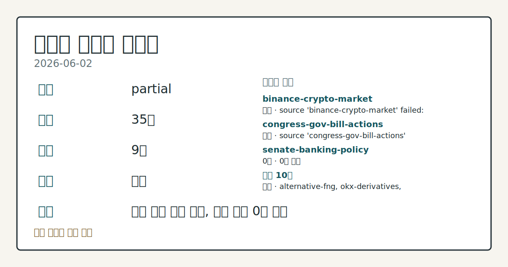
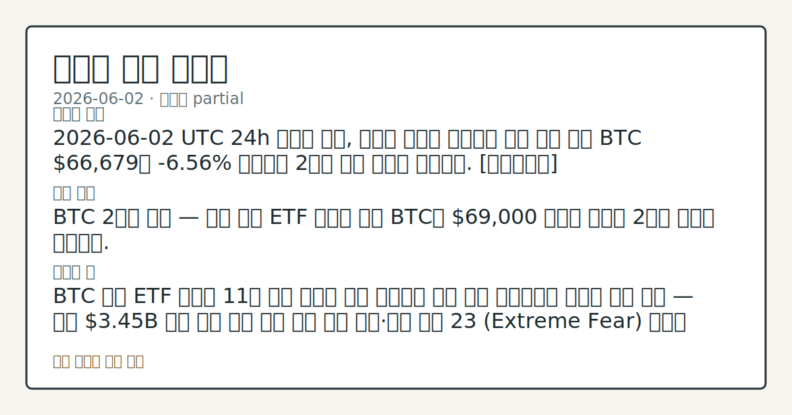
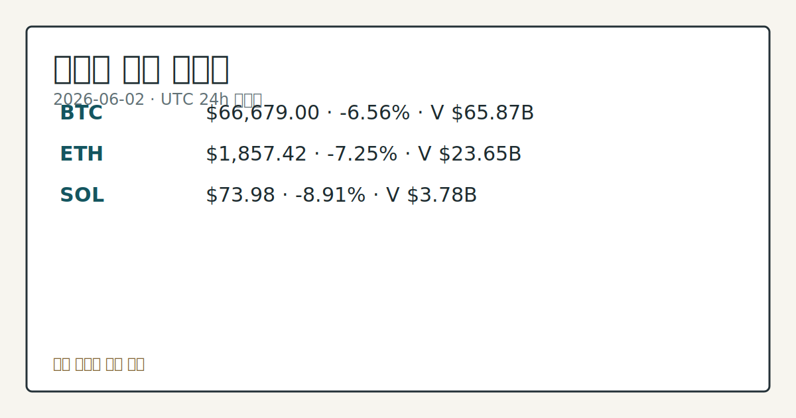

> 정보 제공용 자동 시황이며 가상자산 매매 권유가 아닙니다. 가상자산은 가격 변동성이 매우 큽니다.

# 2026-06-02 크립토 시황

**기준 시각**: 2026-06-02 UTC · [2026-06-02T00:00Z, 2026-06-03T00:00Z)

| 종목 | 스냅샷(UTC 24h) | 구간 변동 | 비고 |
|------|------|------|------|
| BTC-USD | 66,653.13 | -6.55% | +6.30% from 52w low · -24.88% YTD |
| ETH-USD | 1,858.78 | -7.21% | +2.04% from 52w low · -38.05% YTD |

**세그먼트**: [국내 증시](../../../domestic-equity/2026/06/2026-06-02.md) | [미국 증시](../../../us-equity/2026/06/2026-06-02.md) | [크립토](2026-06-02.md)

*이미지: 데이터 신뢰도 · 출처: investo 자체 생성 · 생성: investo 0.1.0 · 2026-06-03 UTC*

> **내 관심 자산 영향**: 16건 확인 (기본 바스켓) — BTC: [boundary-term] Global crypto market cap **$2,382,879,959,707**; BTC dominance **56.04%**; BTC: [structured-symbol] BTC **$66,679.00** (**-6.56%**); BTC: [alias:Bitcoin] DeFi TVL **$76.8**B; leader Ethereum; BTC: [boundary-term] BTC 미결제약정 **$485,403,710** (OKX, UTC 24h); BTC: [boundary-term] BTC 펀딩비 0.0000432254377085 (OKX, UTC 24h) 외
> **용어 가이드**: 이번 시황에서 처음 등장한 용어 — 스테이킹(예치보상)
> **오늘의 결론**: 2026-06-02 UTC 24h 스냅샷 기준, 크립토 시장은 전반적인 매도 압력 속에 BTC **$66,679**가 **-6.56%** 하락하며 2개월 저점 권역에 접근했다. [데이터부족]
> **핵심 동인**: BTC 2개월 저점 — 기관 현물 ETF 대규모 이탈 BTC가 **$69,000** 아래로 하락해 2개월 저점을 경신했다.
> **주의할 점**: BTC 현물 ETF 순유출 11일 연속 흐름이 오늘 구간에서 전환 또는 지속되는지 데이터 비교 점검 — 누적 **$3.45**B 이탈 이후 수급 반전 여부 확인...

> **데이터 상태**: 부분 · 본문 사용 미집계 · 실패 2 · 0건 1

수집/품질 진단

> **데이터 상태**: 부분 — 수집 35건 / 소스 9개 / 누락: 없음 · 부분 — 일부 카테고리 미수집, 본문 일부 결론 보강 필요
> **소스 카운트**: 수집 대상 13 / 성공 10 / 0건 1 / 실패 2 / 본문 사용 미집계
> **소스 등급 분포**: S=2 / A=1 / B=7
> **상세 사유**: 일부 소스 수집 실패, 일부 소스 0건 반환
> **소스별 상태**: binance-crypto-market 실패 (접근 제한), congress-gov-bill-actions 실패 (설정 미완료(미수집)), senate-banking-policy 0건, 정상 10개

## 한눈에 보기

- 전체 크립토 시총 **$2.38T** (24h **-5.85%**), BTC **$66,679** 로 2개월 저점 근접 — 하락 압력 지속
- **BTC** 현물 ETF 11일 연속 순유출 누적 **$3.45B**, 정리 규모 **$742M** — 기관 수요 이탈이 낙폭 확대를 주도
- 공포·탐욕 지수 **23** (Extreme Fear) — §② 기관 수급 동향과 §④ 파생 지표 비교 점검 필요

---

## ⓪ 오늘의 매크로

- **미 국채 수익률** — UST curve 2026-06-02: 10Y 4.46%, 2Y10Y +0.41pp

## ⓪-A 크립토 지표 (UTC 24h 스냅샷)

| 지표 | 값 |
|------|------|
| 공포·탐욕 | 23 (Extreme Fear) |
| BTC 도미넌스 | 56.04% |
| 전체 시총 | $2.38T (-5.85% 24h) |
| BTC 펀딩비 | 0.0000432254377085 (okx) |
| BTC 미결제약정 | $485.4M (okx) |
| DeFi TVL | $76.8B |
| 스테이블코인 공급 | $317.6B |
| 24h 청산 / 거래소 순유출입 | 무료 검증 소스 미확정 |

## ⓪-B 채널 기준선

| 기준선 | 값 |
|------|------|
| 비트코인 | 66,653.13 (-6.55%) |
| 이더리움 | 1,858.78 (-7.21%) |
| BTC 도미넌스 | 56.04% |
| 공포·탐욕 | 23 |
| 펀딩/OI/청산 | 펀딩 0.0000432254377085 · OI 수집됨 |

> **크로스마켓 연결 고리**: 금리 이벤트가 할인율/달러 경로의 공통 변수로 남아 있습니다.

## ① 요약

*이미지: 시장 스냅샷 · 출처: investo 자체 생성 · 생성: investo 0.1.0 · 2026-06-03 UTC*

2026-06-02 UTC 24h 스냅샷 기준, 크립토 시장은 전반적인 매도 압력 속에 [BTC **$66,679**](https://www.coingecko.com/en/coins/bitcoin)가 **-6.56%** 하락하며 2개월 저점 권역에 접근했다. 전체 시총은 **$2.38T**로 24h 기준 **-5.85%** 수축했고, SOL은 **-8.91%**, ETH는 **-7.25%** 내리며 하락폭이 BTC를 상회했다.

직전 5일 컨텍스트를 보면 BTC는 5월 22일 **$2.64T** 시총 수준에서 5월 26일 **$75,629**, 6월 1일 **$71,298**로 하락 연장선을 이어왔으며, 이번 구간에서 **$66,679** 까지 추가 이탈이 관찰된다. 6월 1일의 "ETF 순유출·고래 매수 정체" 동인이 오늘도 이어지고 있으며, 가속도는 더 확대된 흐름이다.

Bitwise CIO Matt Hougan은 크립토를 "contrarian bet(역발상 베팅)"으로 지칭하며 Clarity Act(디지털자산 규제 명확화 법안) 불강한성과 AI 주식 강세가 기관 자금 유입의 장애물이라고 지적했다. [하락 관찰]

---

## ② 전일 핵심 이슈

### BTC 2개월 저점 — 기관 현물 ETF 대규모 이탈

[BTC가 **$69,000** 아래로 하락](https://www.theblock.co/post/403356/materially-softer-demand-bitcoin-hits-two-month-low-below-69000-amid-institutional-outflow-streak-fading-onchain-interest)해 2개월 저점을 경신했다. The Block 보도에 따르면 현물 ETF(상장지수펀드)에서 11일 연속 순유출이 발생해 누적 **$3.45B**가 이탈했으며, 파생상품 정리 규모도 **$742M**에 달했다. 온체인(블록체인 상) 활동 지표도 동반 위축되고 있어 수요 기반이 "materially softer(실질적으로 약화)"됐다는 분석이 제기된 상태다.

> **그래서 의미는?** ETF 자금 11일 연속 이탈은 단순 가격 조정이 아니라 기관 자금 배분 자체가 축소되고 있음을 시사하는 흐름으로, 확인 필요 단계다.

### 미국, 이란 크립토 거래소 Nobitex 제재

[미국 재무부가 이란 크립토 거래소 Nobitex 등을 제재](https://www.theblock.co/post/403436/us-sanctions-nobitex-iranian-crypto-exchanges-economic-fury-campaign)했다. 'Economic Fury' 캠페인의 일환으로, Nobitex는 지난해 이란 크립토 유입량의 절반 이상을 처리한 것으로 알려졌다. 직접적인 BTC 가격 파급 경로는 즉각적이지 않으나, 거래소 규제 리스크(위험) 관련 시장 심리에 영향을 줄 수 있는 정책 이벤트로 관찰된다.

### Clarity Act 불강한성과 기관 심리

[Bitwise CIO Matt Hougan은 인터뷰](https://www.theblock.co/post/403423/bitwise-cio-matt-hougan-calls-crypto-a-contrarian-bet)에서 Clarity Act(디지털자산 시장구조 명확화 법안) 입법 진행 불강한성이 기관 투자자의 크립토 배분 결정을 지연시키고 있다고 밝혔다. AI 성장주와의 경쟁 심화도 자금 흐름 분산을 가중시키는 요인으로 언급됐다.

---

## ③ 섹터/수급 동향

### DeFi TVL 및 체인별 수급

> **그래서 의미는?** TVL(총 예치금액) 절대값은 유지되고 있으나 BTC 가격 하락폭을 고려하면 달러 기준 실질 이탈 여부를 추가 점검할 필요가 있다.

[DeFi(탈중앙화 금융) TVL은 **$76.8**B](https://defillama.com/)로 Ethereum이 **$40.3B**으로 선두를 유지하고 있으며, BSC(바이낸스 스마트 체인) **$5.4B**, Solana **$5.1B**, Tron **$4.7B**, Bitcoin **$4.4B** 순이다. 전체 시총이 하락하는 와중에도 DeFi TVL 절대 수치는 전일 대비 비교 데이터가 공개되지 않아 이탈 속도는 데이터 미수집 상태다.

### 스테이블코인 공급 및 기관 움직임

[스테이블코인(법정화폐 연동 코인) 공급은 **$317.6**B](https://defillama.com/)로 USDT(테더) **$187.8B**, USDC(유에스디코인) **$76.0B**, USDS **$8.7B**, USD1 **$4.7B**, DAI **$4.6B** 순으로 구성됐다.

Coinbase가 [ProShares GENIUS Money Market ETF](https://www.theblock.co/post/403367/coinbases-investing-into-stablecoin-reserves-etf-issued-by-proshares)에 스테이블코인 리저브 자산으로 투자한 사실이 공개됐다. 해당 펀드의 AUM(운용자산규모)은 **$22B**이며 올해 신규 출시됐다.

### 파생상품 시장 위축

[크립토 파생상품(선물·옵션) 거래량이 2023년 말 수준으로 급락](https://www.theblock.co/post/403379/crypto-derivatives-activity-slumps-late-2023-levels-us-perp-market-opportunity-emerges)했다는 보도가 나왔다. Binance(바이낸스)가 거래량의 지배적 점유율을 유지하는 가운데, 미국 내 퍼페추얼(무기한 선물) 시장의 성장 기회가 부각되고 있다는 분석도 병행 제기됐다.

Galaxy Digital은 기관 대상 [OTC(장외거래) 예측 시장 서비스를 개시](https://www.theblock.co/post/403338/galaxy-digital-opens-otc-prediction-market-trading-for-institutions-kicks-off-with-10-million-kalshi-trade)하며 Arca와 Kalshi 플랫폼을 통해 **$10M** 규모의 Clarity Act 관련 첫 거래를 체결했다.

### 토큰화 자산 인프라 확장

Franklin Templeton이 [BENJI 토큰화 펀드를 MoonPay와 연동](https://www.theblock.co/post/403223/franklin-templeton-brings-benji-tokenized-fund-to-moonpay)하며 파트너십을 확대했고, Backpack은 [전통 주식과 토큰화 주식을 결합한 증권 플랫폼](https://www.theblock.co/post/403328/backpack-launches-securities-platform-blending-traditional-and-tokenized-stock-trading)을 출시했다. 이는 온체인 금융 인프라 확장 추세를 반영하는 이벤트로, 직접적인 가격 연동보다는 중장기 구조적 변화 영역으로 분류된다.

---

## ④ 지표·이벤트

### BTC 파생상품 지표

> **그래서 의미는?** 펀딩비와 미결제약정 수준만으로 방향을 단정할 수 없으며, ETF 이탈 흐름과의 병행 관찰이 필요하다.

[OKX(오케이엑스) 기준 BTC 펀딩비](https://www.okx.com/trade-swap/btc-usd-swap)는 **0.0000432254377085**로 중립 근방이며, BTC 미결제약정(오픈 인터레스트)은 **$485.4M**로 집계됐다. 펀딩비가 양수이나 극히 낮은 수준으로, 레버리지 포지션의 강한 방향성이 확인되지 않는 상태다.

### 공포·탐욕 지수

[공포·탐욕 지수는 23 (Extreme Fear)](https://alternative.me/crypto/fear-and-greed-index/)를 기록했다. 전체 시장 심리가 극도의 공포 구간에 접근했으며, BTC 도미넌스(시총 점유율)는 **56.04%**로 알트코인 대비 BTC 선호 흐름이 관찰된다.

### 미국 국채 금리

[UST(미국채) 커브 기준](https://home.treasury.gov/resource-center/data-chart-center/interest-rates) 10Y(10년물) 금리는 **4.46%**, 2Y(2년물)는 **4.05%**이며, 2Y10Y 스프레드(차이)는 **+0.41pp**, 3M10Y 스프레드는 **+0.69pp**다. 30Y(30년물)는 **4.97%**다. 크립토 세그먼트 관점에서, 무위험 금리 상단이 유지될수록 위험자산 전반의 할인율 압력이 지속되는 구조로 관찰된다.

### 정책·입법 이벤트

[샌더스(Sanders)·워런(Warren) 상원의원이 노동부(DOL)에 401(k) 퇴직연금 계좌 내 크립토 포함 허용 규정안 철회를 촉구](https://www.theblock.co/post/403394/bernie-sanders-elizabeth-warren-push-labor-department-scrap-rule-crypto-401k)하는 서한을 발송했다. 해당 규정이 실제 철회될 경우, 기관 채널을 통한 크립토 접근성에 구조적 영향이 발생할 수 있는 정책 변수로 분류된다.

하원 금융서비스위원회는 [복수 법안에 대한 마크업(위원회 심의)](http://financialservices.house.gov/calendar/eventsingle.aspx?EventID=411137) 일정을 공개했다. Clarity Act 관련 진행 여부는 §⑥에서 관전 포인트로 정리한다.

---

## ⑤ 주요 종목

<!-- u50 lightweight-charts-embed: placeholders consumed by site_docs/assets/investo-chart-init.js -->

<noscript><em>인터랙티브 차트는 JavaScript가 활성화된 환경에서 표시됩니다. 위 정적 카드가 동일한 정보를 담고 있습니다.</em></noscript>

*이미지: 가격 스냅샷 · 출처: investo 자체 생성 · 생성: investo 0.1.0 · 2026-06-03 UTC*

> **그래서 의미는?** BTC(비트코인), ETH(이더리움), SOL(솔라나) 모두 큰 폭의 하락이 관찰됐으며, 개별 재료보다는 시장 전반의 하락 흐름이 주요...

### 가격 변동 관찰

| 자산 | 구간 종가 | 24h 변동 | 구간 고가 | 구간 저가 |
|------|-----------|----------|-----------|-----------|
| BTC-USD | $66,653.13 | -6.56% | $71,360.00 | $66,113.57 |
| ETH-USD | $1,858.78 | -7.25% | $2,003.37 | $1,837.13 |
| SOL | $73.98 | -8.91% | $81.22 | $73.04 |

### 기업·프로젝트 동향 확인

[Strive(스트라이브)](https://www.theblock.co/post/403352/strive-adds-2500-btc-treasury-saylor-strategy-sells)가 자사 트레저리(기업 재무)에 **2,500 BTC**를 추가 매입한 것으로 확인됐다. 동시에 Michael Saylor의 Strategy(스트래티지)는 BTC를 매도하고 있어 기업 트레저리 전략 내 방향성이 엇갈리는 흐름이 관찰된다. Standard Chartered(스탠다드차타드)는 Strategy의 BTC 매도가 ETH 아웃퍼폼(상대적 강세) 시작 신호가 될 수 있다는 분석을 [제시](https://www.theblock.co/post/403351/standard-chartered-strategy-bitcoin-sale-eth-outperformance)했으며, ETH 스테이킹 수익률이 BTC 트레저리 모델 대비 구조적 우위를 가진다는 논리를 근거로 들었다.

### 프로젝트 파트너십 체크리스트

- Ethena(에테나): [Anchorage(앵커리지)와 오프체인 담보 보관 협약](https://www.theblock.co/post/403410/ethena-taps-anchorage-secure-offchain-collateral-institutional-lending-push) 체결 — 초과담보 기관 대출 모델로 피벗 확인
- Coinbase(코인베이스): [ENA 공개시장 매입 및 Ethena 파트너십](https://www.theblock.co/post/403403/coinbase-invests-ethena-open-market-purchase-ena-flags-new-partnership) 발표 — 온체인 금융·저축 상품 공동 개발 추진

---

## ⑥ 오늘의 관전 포인트

| 관찰 신호 | 현재 | 상방 확인 조건 | 하방 확인 조건 | 신뢰도 | 섹션 내 관심 영향 |
| --- | --- | --- | --- | --- | --- |
| **BTC** 현물 ETF 순유출 11일 연속 흐름이 | — | 데이터부족 | 데이터부족 | 데이터부족 | — |
| 공포·탐욕 지수 **23** (Extreme Fear)… | — | 데이터부족 | 데이터부족 | 데이터부족 | — |
| [하원 금융서비스위원회 Clarity Act 마크업](… | — | 데이터부족 | 데이터부족 | 데이터부족 | — |
| 10Y 국채 금리 **4.46%** 수준이 | — | 데이터부족 | 데이터부족 | 데이터부족 | — |
| Strategy BTC 매도 vs. Strive **2… | — | 데이터부족 | 데이터부족 | 데이터부족 | — |
| Ethena·Coinbase 파트너십 및 Frankli… | — | 데이터부족 | 데이터부족 | 데이터부족 | — |

_관전 신호 3건 추가 — 본문 참조._
## ⑦ 면책조항
본 시황은 일반 정보 제공을 목적으로 자동 생성된 자료이며,
특정 가상자산에 대한 매매 권유나 투자 자문이 아닙니다.
가상자산은 가상자산이용자보호법(2024-07-19 시행) §10·§19의 적용 대상으로,
24시간 거래되는 비제도권 자산이며 가격 변동성이 매우 크고 원금 전액 손실이 가능합니다.
투자 결정과 그 결과에 대한 책임은 전적으로 본인에게 있으며,
본 시황의 내용에 따라 발생한 손실에 대해 작성자는 일체의 책임을 지지 않습니다.