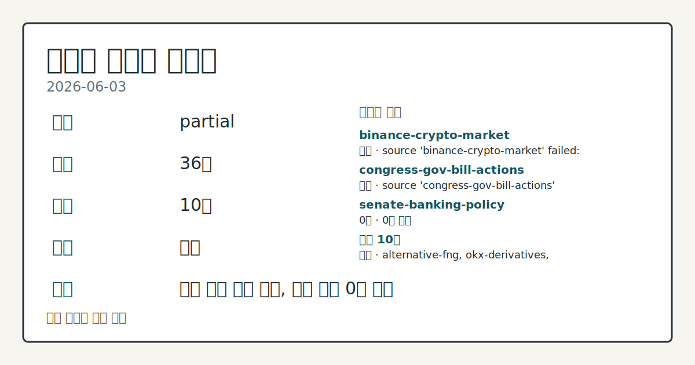
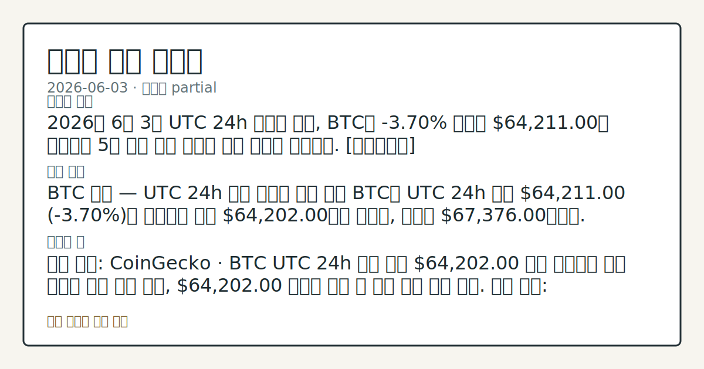
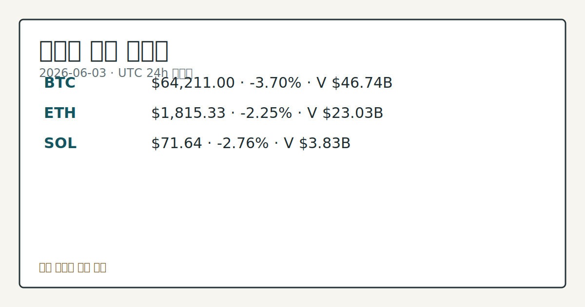

> 정보 제공용 자동 시황이며 가상자산 매매 권유가 아닙니다. 가상자산은 가격 변동성이 매우 큽니다.

# 2026-06-03 크립토 시황

**기준 시각**: 2026-06-03 UTC · [2026-06-03T00:00Z, 2026-06-04T00:00Z)

| 종목 | 스냅샷(UTC 24h) | 구간 변동 | 비고 |
|------|------|------|------|
| BTC-USD | 64,241.75 | -3.74% | +2.40% from 52w low · -27.64% YTD |
| ETH-USD | 1,818.17 | -2.17% | 0.00% from 52w low · -39.43% YTD |

**세그먼트**: [국내 증시](../../../domestic-equity/2026/06/2026-06-03.md) | [미국 증시](../../../us-equity/2026/06/2026-06-03.md) | [크립토](2026-06-03.md)

*이미지: 데이터 신뢰도 · 출처: investo 자체 생성 · 생성: investo 0.1.0 · 2026-06-04 UTC*

> **내 관심 자산 영향**: 16건 확인 (기본 바스켓) — BTC: [boundary-term] Global crypto market cap **$2,325,597,663,092**; BTC dominance **55.31%**; BTC: [structured-symbol] BTC **$64,211.00** (**-3.70%**); BTC: [alias:Bitcoin] DeFi TVL **$75.5**B; leader Ethereum; BTC: [boundary-term] BTC 미결제약정 **$489,587,140** (OKX, UTC 24h); BTC: [boundary-term] BTC 펀딩비 0.0001000000000000 (OKX, UTC 24h) 외
> **용어 가이드**: 이번 시황에서 처음 등장한 용어 — 공매도(차입매도)
> **오늘의 결론**: 2026년 6월 3일 UTC 24h 스냅샷 기준, BTC는 **-3.70%** 하락한 **$64,211.00**에 거래되며 5월 중순 이후 지속된 하락 흐름을 이어갔다. [데이터부족]
> **핵심 동인**: BTC 급락 — UTC 24h 기준 대규모 정리 발생 BTC는 UTC 24h 기준 **$64,211.00** (**-3.70%**)을 기록하며 저가 **$64,202.00**까지 밀렸고, 고가는 **$67,376.00**이었다.
> **주의할 점**: 확인 소스: CoinGecko · BTC UTC 24h 기준 저가 $64,202.00 위를 유지하면 단기 지지선 안착 흐름 확인, $64,202

> **데이터 상태**: 부분 · 본문 사용 미집계 · 실패 2 · 0건 1

수집/품질 진단

> **데이터 상태**: 부분 — 수집 36건 / 소스 10개 / 누락: 없음 · 부분 — 일부 카테고리 미수집, 본문 일부 결론 보강 필요
> **소스 카운트**: 수집 대상 13 / 성공 10 / 0건 1 / 실패 2 / 본문 사용 미집계
> **소스 등급 분포**: S=2 / A=1 / B=7
> **상세 사유**: 일부 소스 수집 실패, 일부 소스 0건 반환
> **소스별 상태**: binance-crypto-market 실패 (접근 제한), congress-gov-bill-actions 실패 (설정 미완료(미수집)), senate-banking-policy 0건, 정상 10개

## ⓪-A 크립토 지표 (UTC 24h 스냅샷)

| 지표 | 값 |
|------|------|
| 공포·탐욕 | 11 (Extreme Fear) |
| BTC 도미넌스 | 55.31% |
| 전체 시총 | $2.33T (-2.52% 24h) |
| BTC 펀딩비 | 0.0001 (OKX) |
| BTC 미결제약정 | $489.6M (OKX) |
| DeFi TVL | $75.5B |
| 스테이블코인 공급 | $316.6B |
| 24h 청산 / 거래소 순유출입 | 데이터 미수집 |

## 한눈에 보기

- BTC **-3.70%** 하락해 **$64,211.00**, 전체 크립토 시총 **-2.52%** 24h — 5월 이후 낙폭 지속 확대 중
- **공포·탐욕 지수 11** (Extreme Fear) — BTC UTC 24h 기준 저가 **$64,202.00** 기록, 대규모 정리 발생 보도와 동시 진행
- Clarity Act(디지털자산 시장구조법) 여름 통과 추진 — 미 재무장관 Bessent 지지 발언; 본문 §② 참조

## ⓪ 오늘의 매크로

- **FOMC 일정** — 2026-06-17 — FOMC Meeting
- **미 국채 수익률** — UST curve 2026-06-03: 10Y 4.49%, 2Y10Y +0.41pp

## ⓪-B 채널 기준선

| 기준선 | 값 |
|------|------|
| 비트코인 | 64,241.75 (-3.74%) |
| 이더리움 | 1,818.17 (-2.17%) |
| BTC 도미넌스 | 55.31% |
| 공포·탐욕 | 11 |
| 펀딩/OI/청산 | 펀딩 0.0001000000000000 · OI 수집됨 |

> **크로스마켓 연결 고리**: 금리 이벤트가 할인율/달러 경로의 공통 변수로 남아 있습니다.

## ① 요약

*이미지: 시장 스냅샷 · 출처: investo 자체 생성 · 생성: investo 0.1.0 · 2026-06-04 UTC*

2026년 6월 3일 UTC 24h 스냅샷 기준, BTC는 **-3.70%** 하락한 **$64,211.00**에 거래되며 5월 중순 이후 지속된 하락 흐름을 이어갔다. 전체 크립토 시총은 **-2.52%** 내린 **$2.33T**를 기록했고, 공포·탐욕 지수는 **11** (Extreme Fear)까지 떨어지며 시장 전반에 매도 심리가 최고조에 달했다. 어제(2026-06-02) **$69,000** 아래 이탈이 오늘 저가 **$64,202.00**까지 추가 연장되었고, 대규모 정리 발생 보도가 이 하락과 맞물렸다. ETH와 SOL도 각각 **-2.25%**, **-2.76%** 하락하며 알트코인 전반에 걸쳐 매도 압력이 확산됐다. [하락 관찰]

## ② 전일 핵심 이슈

### BTC 급락 — UTC 24h 기준 대규모 정리 발생

[BTC](https://www.coingecko.com/en/coins/bitcoin)는 UTC 24h 기준 **$64,211.00** (**-3.70%**)을 기록하며 저가 **$64,202.00**까지 밀렸고, 고가는 **$67,376.00**이었다. [Yahoo Finance](https://finance.yahoo.com/markets/crypto/articles/bitcoin-crash-wipes-billions-market-172226666.html) 보도에 따르면 이번 급락과 함께 대규모 정리 이벤트가 발생했다. 직전 영업일(2026-06-02) **$69,000** 이탈 흐름이 오늘 추가 하방으로 연장되며, 5월 26일 **$75,629** 대에서 이어진 하락 흐름이 한층 가팔라진 양상이다.

> **그래서 의미는?** 레버리지 정리과 가격 하락이 맞물리는 구조가 관찰되며, 단기 저점 안착 여부가 향후 수급 방향성 확인의 선결 항목으로 부각된다.

### Clarity Act — 미 재무장관 여름 통과 지지, 상원 Lummis 비판 가세

미 재무장관 Scott Bessent는 [The Block 보도](https://www.theblock.co/post/403563/bessent-backs-summer-push-clarity-act-bitcoin-reserve-moving-deliberate-speed)에서 Clarity Act(디지털자산 시장구조법) 여름 통과를 지지하며, 전략 비트코인 보유고(Strategic Bitcoin Reserve) 추진은 "신중한 속도(deliberate speed)"로 진행 중이라고 밝혔다. 공화당 상원의원 Lummis는 JP모건 CEO Jamie Dimon이 Clarity Act를 제대로 읽지 않았거나 "사람들을 오도하려는 것"이라고 비판했다 ([출처](https://www.theblock.co/post/403539/sen-lummis-jpmorgan-ceo-jamie-dimon-hasnt-read-clarity-act-remarks-distasteful)). 행정부와 의회의 정책 논의가 구체화되는 흐름이 관찰된다.

### EdgeX 플래시 크래시 — EDGE 토큰 **71%** 급락, **$200,000 USDC** 바운티 제시

[EdgeX](https://www.theblock.co/post/403567/edgex-offers-refunds-200000-usdc-bounty-71-token-flash-crash)의 EDGE 토큰이 저유동성 구간에 174개 주소가 PancakeSwap 풀에 집중 매도 주문을 넣으며 **71%** 플래시 크래시를 기록했다. 프로젝트 측은 영향을 받은 사용자에게 환불을 제공하고 **$200,000 USDC** 바운티를 제시했다. 소규모 탈중앙화 거래소 풀의 유동성 취약 구조가 다시 확인된 사례다.

### Binance NFT(대체불가토큰) 서비스 — 2026년 7월 3일 종료

[Binance](https://www.theblock.co/post/403483/binance-winds-down-centralized-nft-service-gives-users-one-month-to-withdraw-assets)는 중앙화 NFT 마켓플레이스를 2026년 7월 3일부로 종료한다고 발표했다. 이전 가능한 NFT를 한 달 내 출금하지 않을 경우 접근이 차단된다. 중앙화 NFT 플랫폼 수요 감소 흐름의 연장으로 관찰된다.

## ③ 섹터/수급 동향

### DeFi(탈중앙화금융) TVL(총 예치금) 및 스테이블코인 현황

[DeFiLlama](https://defillama.com/) 기준 DeFi TVL은 **$75.5B**이며, 체인별로는 Ethereum **$39.4B**, BSC(바이낸스 스마트체인) **$5.3B**, Solana **$5.0B**, Tron **$4.6B**, Bitcoin **$4.3B** 순이다. 스테이블코인 공급 규모는 **$316.6B**로, USDT **$187.4B**, USDC **$76.0B**, USDS **$8.7B**, USD1 **$4.7B**, DAI **$4.6B** 순으로 구성된다.

> **그래서 의미는?** 스테이블코인 공급 **$316.6B**가 시장 하락 속에도 유지되는 구간은 온체인 달러 유동성이 대기 상태에 있을 가능성으로 해석할 여지가...

### 크립토 VC(벤처캐피털) 투자 건수 5년 최저

[The Block](https://www.theblock.co/post/403382/crypto-vc-deal-flow-hits-multi-year-low-billion-dollar-rounds-keep-capital-flowing) 보도에 따르면 5월 크립토 VC 월별 거래 건수가 약 50건으로 2021년 이전 수준까지 하락했다. 대형 라운드는 여전히 진행되어 전체 투자 규모는 유지되나, 초기 단계 딜(deal) 건수 감소가 두드러진다.

### Hyperliquid — 글로벌 퍼프스(무기한선물) 시장 점유율 신고점, HIP-3 월거래량 **$62B**

[Hyperliquid](https://www.theblock.co/post/403384/hyperliquid-record-share-global-perps-market-hip-3-tops-62-billion-monthly-volume)가 글로벌 퍼프스 시장 점유율 신고점을 기록하며 HIP-3 월거래량이 **$62B**에 달했다. 다만 순수 크립토 거래량은 전년 동기 대비 큰 폭으로 감소한 것으로 나타났다.

### Revolut 미국 법인 — 스테이블코인 서비스 추진

[Revolut](https://www.theblock.co/post/403541/revoluts-us-bank-offer-stablecoin-services-fdic-insured-products-reuters) 미국 법인 CEO Cetin Duransoy는 Reuters에 FDIC(연방예금보험공사) 확인 필요 예금 상품과 함께 스테이블코인 서비스를 제공할 계획임을 밝혔다. 규제 기반 은행-크립토 융합 서비스 확산 흐름의 일환으로 관찰된다.

### Variant — **$222M** 크립토·AI 초기 단계 펀드 결성

[Variant](https://www.theblock.co/post/403513/variant-raises-222-million-fund-early-stage-crypto-ai-autonomy)가 **$222M** 규모 펀드를 결성해 크립토 및 AI 스타트업 초기 단계를 대상으로 투자할 예정이다. 창업자 Jesse Walden은 무허가(permissionless) 금융 및 에이전틱(agentic, 자율 대리인 기반) 금융 분야에 집중할 방침이라고 밝혔다.

## ④ 지표·이벤트

### UST(미국 국채) 금리 곡선 2026-06-03

[미 재무부](https://home.treasury.gov/resource-center/data-chart-center/interest-rates) 자료 기준, 10Y(10년물) 금리 **4.49%**, 2Y(2년물) **4.08%**, 30Y(30년물) **4.99%**, 3M(3개월물) **3.78%**가 기록됐다. 장단기 스프레드는 2Y10Y +**0.41pp**, 3M10Y +**0.71pp**로 정상 우상향 곡선이 유지됐다.

> **그래서 의미는?** 10Y 금리 **4.49%** 수준은 위험자산 전반의 할인율 기준으로 작용하며, 크립토 투자심리와의 연동 변화 확인이 필요한 구간이다.

### BTC 파생상품 지표 — OKX 기준 UTC 24h 스냅샷

[OKX](https://www.okx.com/trade-swap/btc-usd-swap) 기준 BTC 펀딩비(funding rate)는 **0.0001**로, 롱(long, 매수 포지션)-숏(short, 공매도 포지션) 포지션 간 극단적 편향은 관찰되지 않는다. BTC 미결제약정(open interest, OI)은 **$489,587,140**이다. 24h 정리 및 거래소 순유출입 데이터는 무료 검증 소스 미확정으로 데이터 미수집이다.

### 영국 상원 — 스테이블코인 규제 완화 권고

[영국 상원(House of Lords) 위원회](https://www.theblock.co/post/403498/house-of-lords-committee-urges-uk-regulators-to-ease-stablecoin-rules-that-could-stifle-market-growth)는 영국이 미국·EU 대비 스테이블코인 규제에서 뒤처지고 있다며 BoE(영국중앙은행)와 FCA(금융감독청)에 규칙 개정을 촉구했다. 주요 국가 간 스테이블코인 규제 경쟁 심화 추세가 관찰된다.

### 미 하원 금융서비스위원회 — 다수 안건 심의 예고

미 [하원 금융서비스위원회(House Financial Services Committee)](http://financialservices.house.gov/calendar/eventsingle.aspx?EventID=411137)가 다수 안건(Various Measures) 심의(markup)를 예고했다. 크립토 시장구조 관련 법안이 포함될 경우 Clarity Act 진행 속도에 영향을 미칠 수 있는 일정으로, 확정 내용 확인이 필요하다.

## ⑤ 주요 종목

<!-- u50 lightweight-charts-embed: placeholders consumed by site_docs/assets/investo-chart-init.js -->

<noscript><em>인터랙티브 차트는 JavaScript가 활성화된 환경에서 표시됩니다. 위 정적 카드가 동일한 정보를 담고 있습니다.</em></noscript>

*이미지: 가격 스냅샷 · 출처: investo 자체 생성 · 생성: investo 0.1.0 · 2026-06-04 UTC*

### 가격 동향 확인 (CoinGecko · UTC 24h 스냅샷)

| 자산 | 현재가 | 24h 변동 | 24h 고가 | 24h 저가 |
|------|--------|---------|---------|---------|
| BTC | $64,211.00 | -3.70% | $67,376.00 | $64,202.00 |
| ETH | $1,815.33 | -2.25% | $1,886.55 | $1,777.57 |
| SOL | $71.64 | -2.76% | $75.52 | $71.05 |

> **그래서 의미는?** BTC(비트코인), ETH(이더리움), SOL(솔라나) 모두 동반 하락 기조 속에, SOL이 2023년 이후 최저 수준까지 밀린 점과 HYPE...

### 주목 이벤트

[Hyperliquid의 HYPE 토큰](https://www.theblock.co/post/403585/hyperliquid-hype-overtakes-solana-price-sol-falls-lowest-since-2023)이 가격 기준으로 SOL을 추월했다. Hyperliquid 시총은 **$16B** 이상으로 확대됐지만 SOL 시총 **$42B**와는 여전히 상당한 격차가 있다. SOL은 2023년 이후 최저 가격 수준으로 하락한 것으로 보고됐다.

[Tether](https://www.theblock.co/post/403509/tether-launching-tokenized-gold-visa-card-with-xaut-rewards)는 XAUT(토큰화 금) 보상이 제공되는 Visa 카드를 출시할 예정이다. Visa 네트워크를 통해 전 세계 가맹점에서 사용 가능하도록 설계됐다.

[Kraken](https://www.theblock.co/post/403495/kraken-tokenized-us-ipo-access-retail-investors-xstocks)은 xStocks를 통해 수 주 내 미국 IPO(기업공개)에 대한 글로벌 소매 투자자의 토큰화 접근 서비스를 제공할 예정이다.

[Grayscale](https://www.theblock.co/post/403428/grayscale-behind-hype-launching-hypg-hyperliquid-etf-nasdaq)이 HYPG라는 이름의 Hyperliquid 연동 ETF(상장지수펀드)를 Nasdaq에 상장할 예정이다. 경쟁사 대비 최저 수수료를 내세우며 상장을 준비 중인 흐름이 관찰된다.

## ⑥ 오늘의 관전 포인트

| 관찰 신호 | 현재 | 상방 확인 조건 | 하방 확인 조건 | 신뢰도 | 섹션 내 관심 영향 |
| --- | --- | --- | --- | --- | --- |
| BTC UTC 24h 기준 저 | 확인 소스: CoinGecko · BTC UTC 24h 기준 저가 **$64,202.00** 위를 유지하면 단기 지지선 안착 흐름 확인, **$64,202.00** 아래로 이탈 시 추가 하방 압력 관찰. 관심 영향: 공포·탐욕 지수 **11** (Extreme Fear) 환경에서 레버리지 정리 압력 변동 점검. | 데이터부족 | BTC UTC 24h 기준 저가 **$64,202.00** 위를 유지하면 단기 지지선 안착 흐름 확인, **$64,202.00** 아래로 이탈 시 추가 하방 압력 관찰 | 높음 | 관심 영향: 공포 |
| BTC 펀딩비 **0.0001** 수준 | 확인 소스: OKX 파생상품 · BTC 펀딩비 **0.0001** 수준이 상승해 롱 편향이 강화되면 단기 상방 압력 흐름 관찰, 음(-)전환 시 숏커버링 우위 전환 비교. 관심 영향: 미결제약정 **$489,587,140** 변동 추세 확인. | BTC 펀딩비 **0.0001** 수준이 상승해 롱 편향이 강화되면 단기 상방 압력 흐름 관찰, 음(-)전환 시 숏커버링 우위 전환 비교 | 데이터부족 | 높음 | 관심 영향: 미결제약정 **$489,587,140** 변동 추세 확인. |
| Clarity Act 미 하원 금융서비스위원회 심의 안… | 확인 소스: The Block · Clarity Act 미 하원 금융서비스위원회 심의 안건 확정 발표 시 디지털자산 규제 명확성 강화 흐름 관찰, 심의 연기 또는 철회 발표 시 정책 불강한성 지속 흐름 확인. 관심 영향: 전략 비트코인 보유고 추진 속도 추세 점검. | 데이터부족 | 데이터부족 | 보통 | 관심 영향: 전략 비트코인 보유고 추진 속도 추세 점검. |
| SOL 24h 저 | 확인 소스: CoinGecko · SOL 24h 저가 **$71.05** 지지 유지 시 반등 흐름 관찰, 이탈 지속 시 하방 추세 연장 확인. 관심 영향: HYPE 시총 **$16B** 이상 대 SOL 시총 **$42B** 격차 변동 흐름 비교. | 데이터부족 | SOL 24h 저가 **$71.05** 지지 유지 시 반등 흐름 관찰, 이탈 지속 시 하방 추세 연장 확인 | 높음 | 관심 영향: HYPE 시총 **$16B** 이상 대 SOL 시총 **$42B** 격차 변동 흐름 비교. |
| 스테이블코인 공급 **$316.6B** 및 DeFi T… | 확인 소스: DeFiLlama · 스테이블코인 공급 **$316.6B** 및 DeFi TVL **$75.5B** 유지 시 온체인 대기 유동성 안정 흐름 관찰, TVL 하락 가속 확인 시 디레버리징(부채 축소) 추세 점검. 관심 영향: 전체 시총 **-2.52%** 24h 환경에서 ETH 생태계 수급 변동 확인. | 데이터부족 | 데이터부족 | 높음 | 관심 영향: 전체 시총 **-2.52%** 24h 환경에서 ETH 생태계 수급 변동 확인. |
## ⑦ 면책조항
본 시황은 일반 정보 제공을 목적으로 자동 생성된 자료이며,
특정 가상자산에 대한 매매 권유나 투자 자문이 아닙니다.
가상자산은 가상자산이용자보호법(2024-07-19 시행) §10·§19의 적용 대상으로,
24시간 거래되는 비제도권 자산이며 가격 변동성이 매우 크고 원금 전액 손실이 가능합니다.
투자 결정과 그 결과에 대한 책임은 전적으로 본인에게 있으며,
본 시황의 내용에 따라 발생한 손실에 대해 작성자는 일체의 책임을 지지 않습니다.