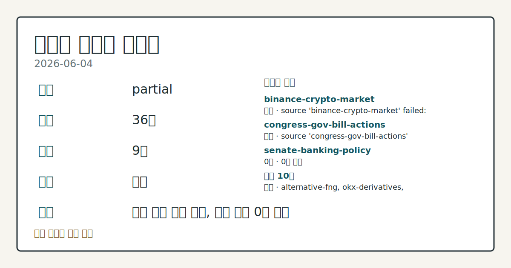
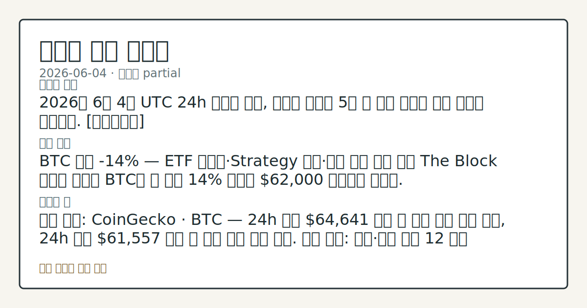
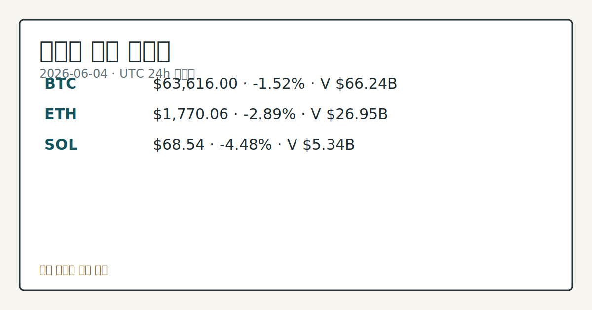

> 정보 제공용 자동 시황이며 가상자산 매매 권유가 아닙니다. 가상자산은 가격 변동성이 매우 큽니다.

# 2026-06-04 크립토 시황

**기준 시각**: 2026-06-04 UTC · [2026-06-04T00:00Z, 2026-06-05T00:00Z)

| 종목 | 스냅샷(UTC 24h) | 구간 변동 | 비고 |
|------|------|------|------|
| BTC-USD | 63,600.39 | -0.71% | +1.37% from 52w low · -28.37% YTD |
| ETH-USD | 1,770.25 | -2.33% | 0.00% from 52w low · -41.02% YTD |

**세그먼트**: [국내 증시](../../../domestic-equity/2026/06/2026-06-04.md) | [미국 증시](../../../us-equity/2026/06/2026-06-04.md) | [크립토](2026-06-04.md)

*이미지: 데이터 신뢰도 · 출처: investo 자체 생성 · 생성: investo 0.1.0 · 2026-06-05 UTC*

> **내 관심 자산 영향**: 20건 확인 (기본 바스켓) — BTC: [boundary-term] Global crypto market cap **$2,288,983,614,630**; BTC dominance **55.81%**; BTC: [structured-symbol] BTC **$63,616.00** (**-1.52%**); BTC: [alias:Bitcoin] DeFi TVL **$74.1**B; leader Ethereum; BTC: [boundary-term] BTC 미결제약정 **$489,771,400** (OKX, UTC 24h); BTC: [boundary-term] BTC 펀딩비 0.0000068350766498 (OKX, UTC 24h) 외
> **오늘의 결론**: 2026년 6월 4일 UTC 24h 스냅샷 기준, 크립토 시장은 5월 말 이후 지속된 하락 흐름을 연장했다. [데이터부족]
> **핵심 동인**: BTC 주간 **-14%** — ETF 순유출·Strategy 매각·거시 압박 복합 작용 The Block 보도에 따르면 BTC는 한 주간 14% 하락해 **$62,000** 근방까지 내렸다.
> **주의할 점**: 확인 소스: CoinGecko · BTC — 24h 고가 **$64,641** 상회 시 단기 반등 압력 관찰, 24h 저가 **$61,557** 하회 시 추가...

> **데이터 상태**: 부분 · 본문 사용 미집계 · 실패 2 · 0건 1

수집/품질 진단

> **데이터 상태**: 부분 — 수집 36건 / 소스 9개 / 누락: 없음 · 부분 — 일부 카테고리 미수집, 본문 일부 결론 보강 필요
> **소스 카운트**: 수집 대상 13 / 성공 10 / 0건 1 / 실패 2 / 본문 사용 미집계
> **소스 등급 분포**: S=2 / A=1 / B=7
> **상세 사유**: 일부 소스 수집 실패, 일부 소스 0건 반환
> **소스별 상태**: binance-crypto-market 실패 (접근 제한), congress-gov-bill-actions 실패 (설정 미완료(미수집)), senate-banking-policy 0건, 정상 10개

## 한눈에 보기

- 크립토 전체 시총 **-1.38%** 24h 축소, BTC는 주간 누적 **-14%** 하락 후 **$63,616** 기록
- 공포·탐욕(Fear & Greed) 지수 **12 (Extreme Fear)** — 현물 ETF(상장지수펀드) 순유출 **$4.2B**과 Strategy BTC 매각이 주간 하락의 핵심 압력으로 확인
- BTC 24h 저가 **$61,557** 이탈 여부 및 Clarity Act(가상자산 시장구조 법안) 입법 동향을 §②·§⑥에서 추적

## ⓪ 오늘의 매크로

- **FOMC 일정** — 2026-06-17 — FOMC Meeting
- **미 국채 수익률** — UST curve 2026-06-04: 10Y 4.47%, 2Y10Y +0.42pp

## ⓪-A 크립토 지표 (UTC 24h 스냅샷)

| 지표 | 값 |
|------|------|
| 공포·탐욕 | 12 (Extreme Fear) |
| BTC 도미넌스 | 55.81% |
| 전체 시총 | $2.29T (-1.38% 24h) |
| BTC 펀딩비 | 0.0000068350766498 (okx) |
| BTC 미결제약정 | $489.8M (okx) |
| DeFi TVL | $74.1B |
| 스테이블코인 공급 | $315.5B |
| 24h 청산 / 거래소 순유출입 | 무료 검증 소스 미확정 |

## ⓪-B 채널 기준선

| 기준선 | 값 |
|------|------|
| 비트코인 | 63,600.39 (-0.71%) |
| 이더리움 | 1,770.25 (-2.33%) |
| BTC 도미넌스 | 55.81% |
| 공포·탐욕 | 12 |
| 펀딩/OI/청산 | 펀딩 0.0000068350766498 · OI 수집됨 |

> **크로스마켓 연결 고리**: 금리 이벤트가 할인율/달러 경로의 공통 변수로 남아 있습니다.

## ① 요약

*이미지: 시장 스냅샷 · 출처: investo 자체 생성 · 생성: investo 0.1.0 · 2026-06-05 UTC*

2026년 6월 4일 UTC 24h 스냅샷 기준, 크립토 시장은 5월 말 이후 지속된 하락 흐름을 연장했다. BTC는 **$63,616** (**-1.52%**)로 주간 기준 누적 **-14%** 하락이 이어졌으며, ETH(**-2.89%**)와 SOL(**-4.48%**)은 BTC 대비 낙폭이 컸다. 공포·탐욕 지수는 **12 **를 유지하고 전체 시총은 **$2.29T**로 **-1.38%** 24h 축소됐다. 현물 ETF 순유출 **$4.2B**과 Strategy의 BTC 매각이 전주 매도 압력의 주요 원인으로 지목된다. Standard Chartered는 저점 근접 견해를 제시했으나, JPMorgan은 Clarity Act 올해 통과 가능 창이 좁다고 분석해 규제 불강한성이 재부각됐다. [하락 관찰]

## ② 전일 핵심 이슈

### BTC 주간 **-14%** — ETF 순유출·Strategy 매각·거시 압박 복합 작용

[The Block 보도](https://www.theblock.co/post/403659/the-rally-that-wasnt-bitcoin-slides-14-in-one-week-as-etf-outflows-strategy-sale-and-oil-prices-hit-sentiment)에 따르면 BTC는 한 주간 **14%** 하락해 **$62,000** 근방까지 내렸다. 현물 ETF 순유출 **$4.2B**, Strategy의 BTC 매각, 유가 상승에 따른 거시 리스크 심리 위축이 복합적으로 작용했다. 6월 3일 전일 **-3.70%** 하락에 이어 오늘 **-1.52%**로 낙폭은 다소 완화됐으나 하락 흐름은 지속됐다.

> **그래서 의미는?** 기관 자금의 현물 ETF 이탈이 동반된 구조적 매도 압력으로, 단순 변동성 조정보다 수급 공백 규모를 확인할 필요가 있다.

### Standard Chartered — "저점 근접" vs. JPMorgan — "입법 창 좁다"

[Standard Chartered](https://www.theblock.co/post/403625/the-low-is-almost-in-standard-chartered-says-bitcoin-bottom-near-after-tough-week-for-crypto)는 ETF 보유잔고 회복력과 Strategy의 추가 취득 가능성을 근거로 BTC 저점이 임박했다는 견해를 제시했다. [JPMorgan 분석](https://www.theblock.co/post/403676/jpmorgan-crypto-bill-narrow-window-passage-this-year)은 Clarity Act가 올해 내 통과될 시간이 매우 제한적이라고 분석하며 규제 불강한성을 재부각했다.

### Clarity Act — 백악관 지지 표명 속 입법 레이스

[백악관 암호화폐 자문관 Patrick Witt](https://www.theblock.co/post/403693/white-house-crypto-adviser-witt-defends-clarity-act-calls-it-pro-law-enforcement-as-lawmakers-race-to-pass-bill)는 Clarity Act를 "친법 집행 법안"으로 옹호했다. House Financial Services 위원회의 Markup of Various Measures([이벤트 1](http://financialservices.house.gov/calendar/eventsingle.aspx?EventID=411137), [이벤트 2](http://financialservices.house.gov/calendar/eventsingle.aspx?EventID=411136)) 일정이 예정돼 있어 입법 진행 경과를 관찰할 수 있다. JPMorgan이 지적한 일정 제약 요인과 함께 실제 통과 여부 흐름을 추적하는 구간이다.

## ③ 섹터/수급 동향

### DeFi TVL · 스테이블코인 공급 현황

[DefiLlama 데이터](https://defillama.com/) 기준 DeFi(탈중앙화금융) TVL(예치 총액)은 **$74.1B**이며 Ethereum이 **$38.9B**로 1위를 유지한다. BSC는 **$5.2B**, Solana는 **$5.0B**, Tron은 **$4.5B**, Bitcoin은 **$4.2B**이다. 스테이블코인(가치고정 암호화폐) 총 공급은 **$315.5B**로 USDT(테더)가 **$187.0B**, USDC가 **$75.7B**, USDS가 **$8.7B**, USD1이 **$4.6B**, DAI가 **$4.5B**이다.

> **그래서 의미는?** 스테이블코인 공급 **$315.5B** 유지는 시장 이탈 자금 일부가 온체인 내 대기 상태임을 시사하며, DeFi TVL 현황은 프로토콜별...

### BTC 도미넌스 — **55.81%**

[CoinGecko 스냅샷](https://www.coingecko.com/en/global-charts) 기준 BTC 도미넌스(전체 시총 대비 BTC 비중)는 **55.81%**로, ETH·SOL의 낙폭이 BTC를 상회하는 구간에서 BTC의 상대적 방어력을 관찰할 수 있다.

## ④ 지표·이벤트

### UST(미국 국채) 금리 — 10Y **4.47%**

[미국 재무부 데이터](https://home.treasury.gov/resource-center/data-chart-center/interest-rates) 기준 2026-06-04 UST 커브: 3M **3.78%**, 2Y **4.05%**, 10Y **4.47%**, 30Y **4.97%**, 2Y10Y 스프레드(장단기 금리 차) **+0.42pp**. 크립토 세그먼트 관점에서 고금리 환경은 위험자산 선호도 변화를 추적하는 배경 지표로 확인된다.

> **그래서 의미는?** 10Y 금리 **4.47%** 유지 구조는 크립토를 포함한 위험자산 전반의 심리 압박 배경으로 지속 관찰된다.

### BTC 파생상품 — 낮은 펀딩비·미결제약정 **$489.8M**

[OKX 파생상품](https://www.okx.com/trade-swap/btc-usd-swap) 기준 BTC 펀딩비(선물 롱·숏 포지션 균형 지표)는 **0.0000068350766498**로 거의 중립 수준이며, BTC 미결제약정(오픈 인터레스트·미정리 선물 계약 총량)은 **$489.8M**이다. 24h 정리 및 거래소 순유출입은 데이터 미수집이다.

### 상원 공화당 — 디지털 자산 은행 자본 기준 재검토 촉구

[The Block 보도](https://www.theblock.co/post/403671/senate-republicans-urged-financial-regulators-to-rework-bank-capital-rules-for-digital-assets)에 따르면 미국 상원 공화당 의원단이 금융 규제 당국에 디지털 자산의 은행 자본 기준 명확화를 요구했다. 기관 투자자의 크립토 참여 경로에 영향을 줄 수 있는 정책 동향으로 관찰된다.

## ⑤ 주요 종목

<!-- u50 lightweight-charts-embed: placeholders consumed by site_docs/assets/investo-chart-init.js -->

<noscript><em>인터랙티브 차트는 JavaScript가 활성화된 환경에서 표시됩니다. 위 정적 카드가 동일한 정보를 담고 있습니다.</em></noscript>

*이미지: 가격 스냅샷 · 출처: investo 자체 생성 · 생성: investo 0.1.0 · 2026-06-05 UTC*

### 가격 변동 확인 항목

| 자산 | UTC 24h 종가 | 24h 변동 | 24h 고가 | 24h 저가 |
|------|------------|---------|---------|---------|
| [BTC](https://www.coingecko.com/en/coins/bitcoin) | $63,616.00 | **-1.52%** | $64,641.00 | $61,557.00 |
| [ETH](https://www.coingecko.com/en/coins/ethereum) | $1,770.06 | **-2.89%** | $1,822.83 | $1,733.65 |
| [SOL](https://www.coingecko.com/en/coins/solana) | $68.54 | **-4.48%** | $71.87 | $67.35 |

> **그래서 의미는?** BTC(비트코인), ETH, SOL(솔라나) 모두 하락하며 SOL 낙폭이 가장 컸고, BTC 도미넌스 **55.81%** 수준에서 알트코인...

### 산업 동향 확인 항목

- [Coinbase · Better](https://www.theblock.co/post/403640/coinbase-better-first-bitcoin-backed-mortgage-nationwide-rollout-soon): Fannie Mae(패니메이·미국 연방저당공사) 보증 모기지(주택담보대출)에 BTC를 담보로 활용한 최초 실행 사례 확인, 전국 출시 예정 발표.
- [DDC Enterprise](https://www.theblock.co/post/403642/when-the-market-offers-discounts-we-lean-in-ddc-enterprise-lifts-bitcoin-holdings-to-2804-btc): BTC **90개** 추가 취득, 총 보유량 **2,804 BTC**로 공개 기업 보유 순위 28위 등재.

## ⑥ 오늘의 관전 포인트

| 관찰 신호 | 현재 | 상방 확인 조건 | 하방 확인 조건 | 신뢰도 | 섹션 내 관심 영향 |
| --- | --- | --- | --- | --- | --- |
| BTC](https://www.coingecko.com… | 확인 소스: CoinGecko · BTC — 24h 고가 **$64,641** 상회 시 단기 반등 압력 관찰, 24h 저가 **$61,557** 하회 시 추가 하방 흐름 추적. 관심 영향: 공포·탐욕 지수 **12** 극단 구간에서 BTC 수급 방향 변화 데이터 비교. | BTC](https://www.coingecko.com/en/coins/bitcoin) — 24h 고가 **$64,641** 상회 시 단기 반등 압력 관찰, 24h 저가 **$61,557** 하회 시 추가 하방 흐름 추적 | BTC](https://www.coingecko.com/en/coins/bitcoin) — 24h 고가 **$64,641** 상회 시 단기 반등 압력 관찰, 24h 저가 **$61,557** 하회 시 추가 하방 흐름 추적 | 높음 | 관심 영향: 공포 |
| 확인 소스: Alternative.me · 공포·탐욕… | 확인 소스: Alternative.me · 공포·탐욕 지수 현재 **12 ** — 지수 상승 전환 시 심리 개선 신호 관찰, 추가 하락 시 패닉 심화 단계 흐름 점검. 관심 영향: 5월 말 이후 지속 하락 구간에서 투자자 심리 변화 추세 확인. | 데이터부족 | 데이터부족 | 보통 | 관심 영향: 5월 말 이후 지속 하락 구간에서 투자자 심리 변화 추세 확인. |
| ETF 동향 / Standard Chartered](h… | 확인 소스: The Block · ETF 동향 / Standard Chartered — ETF 순유출 **$4.2B** 이후 유입 전환 신호 포착 시 기관 수요 회복 흐름 관찰, 순유출 지속 시 수급 공백 연장 추세 추적. 관심 영향: 저점 근접 견해의 실증 데이터 비교. | ETF 동향 / Standard Chartered](https://www.theblock.co/post/403625/the-low-is-almost-in-standard-chartered-says-bitcoin-bottom-near-after-tough-week-for-crypto) — ETF 순유출 **$4.2B** 이후 유입 전환 신호 포착 시 기관 수요 회복 흐름 관찰, 순유출 지속 시 수급 공백 연장 추세 추적 | 데이터부족 | 높음 | 관심 영향: 저점 근접 견해의 실증 데이터 비교. |
| JPMorgan / Clarity Act](https:… | 확인 소스: The Block · JPMorgan / Clarity Act — 위원회 심의 일정 확정 시 규제 명확성 방향 관찰, 입법 창 추가 축소 시 정책 불강한성 연장 추세 확인. 관심 영향: 기관 크립토 참여 경로 규제 환경 변화 점검. | 데이터부족 | 데이터부족 | 낮음 | 관심 영향: 기관 크립토 참여 경로 규제 환경 변화 점검. |
| BTC 미결제약정](https://www.okx.com… | 확인 소스: OKX · BTC 미결제약정 **$489.8M** — 미결제약정 유의미 확대 시 파생상품 포지션 재구축 흐름 관찰, 추가 감소 시 레버리지 수축 추세 확인. 관심 영향: 펀딩비 **0.0000068350766498** 수준과 함께 BTC 선물 시장 구조 변화 데이터 비교. | 데이터부족 | 데이터부족 | 높음 | 관심 영향: 펀딩비 **0.0000068350766498** 수준과 함께 BTC 선물 시장 구조 변화 데이터 비교. |
## ⑦ 면책조항
본 시황은 일반 정보 제공을 목적으로 자동 생성된 자료이며,
특정 가상자산에 대한 매매 권유나 투자 자문이 아닙니다.
가상자산은 가상자산이용자보호법(2024-07-19 시행) §10·§19의 적용 대상으로,
24시간 거래되는 비제도권 자산이며 가격 변동성이 매우 크고 원금 전액 손실이 가능합니다.
투자 결정과 그 결과에 대한 책임은 전적으로 본인에게 있으며,
본 시황의 내용에 따라 발생한 손실에 대해 작성자는 일체의 책임을 지지 않습니다.