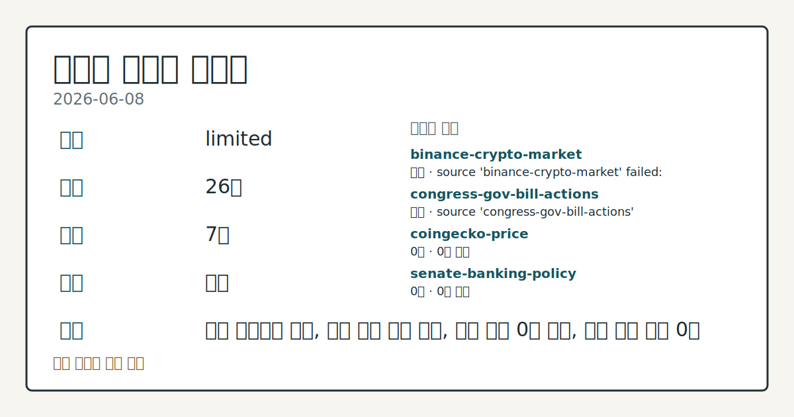
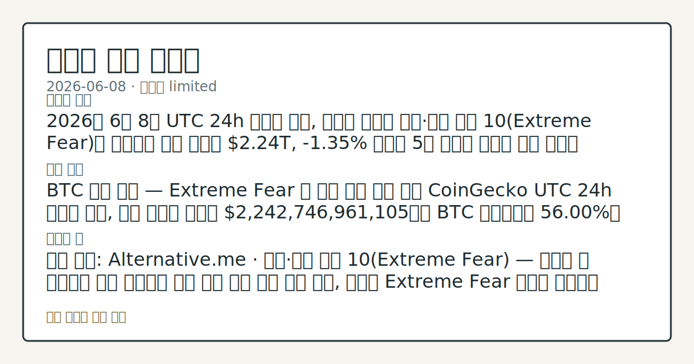

> 정보 제공용 자동 시황이며 가상자산 매매 권유가 아닙니다. 가상자산은 가격 변동성이 매우 큽니다.

# 2026-06-08 크립토 시황

**기준 시각**: 2026-06-08 UTC · [2026-06-08T00:00Z, 2026-06-09T00:00Z)

| 종목 | 스냅샷(UTC 24h) | 구간 변동 | 비고 |
|------|------|------|------|
| BTC-USD | 62,607.00 | -0.77% | +2.86% from 52w low · -29.44% YTD |
| ETH-USD | 1,676.84 | -0.79% | +6.89% from 52w low · -44.11% YTD |

**세그먼트**: [국내 증시](../../../domestic-equity/2026/06/2026-06-08.md) | [미국 증시](../../../us-equity/2026/06/2026-06-08.md) | [크립토](2026-06-08.md)

*이미지: 데이터 신뢰도 · 출처: investo 자체 생성 · 생성: investo 0.1.0 · 2026-06-09 UTC*

> **내 관심 자산 영향**: 데이터 수집 부족으로 매칭 판단 보류 — 추가 수집 후 재평가됩니다.
> **오늘의 결론**: 2026년 6월 8일 UTC 24h 스냅샷 기준, 크립토 시장은 공포·탐욕 지수 10(Extreme Fear)을 기록하며 전체 시총이 **$2.24**T, **-1.35%** 하락해 5월 말부터 이어진 조정 흐름을 연장했다. [데이터부족]
> **핵심 동인**: BTC 시장 상태 — Extreme Fear 속 기관 누적 흐름 확인 CoinGecko UTC 24h 스냅샷 기준, 전체 크립토 시총은 **$2,242,746,961,105**이며 BTC 도미넌스는 **56.00%**로 확인됐다.
> **주의할 점**: 확인 소스: Alternative.me · 공포·탐욕 지수 10 — 지수가 현 수준에서 추가 하락하면 시장 심리 위축 심화 방향 관찰, 반등해 Extreme...

> **데이터 상태**: 제한 · 본문 사용 미집계 · 실패 2 · 0건 3

수집/품질 진단

> **데이터 상태**: 제한 — 수집 26건 / 소스 7개 / 누락: 가격 · 제한 — 핵심 가격 소스 0건/실패/stale, 본문 결론 신뢰도 낮음
> **소스 카운트**: 수집 대상 13 / 성공 8 / 0건 3 / 실패 2 / 본문 사용 미집계
> **소스 등급 분포**: S=2 / B=6
> **상세 사유**: 가격 카테고리 누락, 일부 소스 수집 실패, 일부 소스 0건 반환, 핵심 가격 소스 0건
> **소스별 상태**: binance-crypto-market 실패 (접근 제한), congress-gov-bill-actions 실패 (설정 미완료(미수집)), coingecko-price 0건, senate-banking-policy 0건, stooq-price 0건, 정상 8개

## 한눈에 보기

- 전체 크립토 시총 **$2.24T**, UTC 24h 기준 **-1.35%** 하락 — 공포·탐욕 지수 **10**(Extreme Fear)으로 5월 말 이후 조정 흐름 연장.
- **Strategy**가 BTC **1,550**개를 **$101M**에 추가 매입, 누적 보유량 **845,256** BTC — 총 공급량 21M 개의 **4%** 초과, 평가액 약 **$53.5B**.
- BTC 현물 ETF(상장지수펀드) 2026년 누적 유출 **$2.6B** — Bernstein의 가치 저장 테제 해석과 기관 누적 서사의 정합성을 §②에서 확인.

## ⓪ 오늘의 매크로

- **미 국채 수익률** — UST curve 2026-06-08: 10Y 4.56%, 2Y10Y +0.41pp

## ⓪-A 크립토 지표 (UTC 24h 스냅샷)

| 지표 | 값 |
|------|------|
| 공포·탐욕 | 10 (Extreme Fear) |
| BTC 도미넌스 | 56.00% |
| 전체 시총 | $2.24T (-1.35% 24h) |
| BTC 펀딩비 | 0.0000377473588502 (okx) |
| BTC 미결제약정 | $427.9M (okx) |
| DeFi TVL | $72.0B |
| 스테이블코인 공급 | $315.2B |
| 24h 청산 / 거래소 순유출입 | 무료 검증 소스 미확정 |

## ⓪-B 채널 기준선

| 기준선 | 값 |
|------|------|
| 비트코인 | 62,607.00 (-0.77%) |
| 이더리움 | 1,676.84 (-0.79%) |
| BTC 도미넌스 | 56.00% |
| 공포·탐욕 | 10 |
| 펀딩/OI/청산 | 펀딩 0.0000377473588502 · OI 수집됨 |

> **크로스마켓 연결 고리**: 금리 이벤트가 할인율/달러 경로의 공통 변수로 남아 있습니다.

## ① 요약

*이미지: 시장 스냅샷 · 출처: investo 자체 생성 · 생성: investo 0.1.0 · 2026-06-09 UTC*

2026년 6월 8일 UTC 24h 스냅샷 기준, 크립토 시장은 공포·탐욕 지수 **10**(Extreme Fear)을 기록하며 전체 시총이 **$2.24T**, **-1.35%** 하락해 5월 말부터 이어진 조정 흐름을 연장했다. BTC 도미넌스(비트코인시장점유율)는 **56.00%**로 알트코인 대비 상대적인 BTC 집중 현상이 유지됐다. 기관 측면에서는 Coinbase 전략가가 패밀리오피스와 국부펀드의 BTC 누적 매수를 확인했고, Bernstein은 2026년 현물 ETF 누적 유출 **$2.6B**에도 BTC 가치 저장 테제가 훼손되지 않는다고 분석했다. 규제 측면에서는 200개 이상의 크립토 기관이 Senate Clarity Act 상원 표결을 촉구하는 한편 UK FCA(영국금융행위청)가 인가 펀드의 크립토 ETN(상장지수채권) 포함 한도 **10%** 허용안을 제안해 미국·영국 동시 제도화 흐름이 가시화됐다. [하락 관찰]

## ② 전일 핵심 이슈

### BTC 시장 상태 — Extreme Fear 속 기관 누적 흐름 확인

[CoinGecko](https://www.coingecko.com/en/global-charts) UTC 24h 스냅샷 기준, 전체 크립토 시총은 **$2,242,746,961,105**이며 BTC 도미넌스는 **56.00%**로 확인됐다. 공포·탐욕 지수 **10** 구간에서도 Coinbase 전략가 John D'Agostino는 [패밀리오피스와 국부펀드가 BTC 조정을 누적 기회로 활용하고 있다](https://www.theblock.co/post/404019/coinbase-strategist-institutions-arent-panicking-bitcoin-love-more-lower-prices)고 밝혔다. 5월 말 이후 이어진 조정 흐름이 오늘도 극단적 공포 지수와 시총 하락으로 연장됐다.

> **그래서 의미는?** 극단적 공포 속에서도 대형 기관의 BTC 누적 흐름이 확인돼, 단기 매도 압력과 중장기 수급 수요가 교차하는 구간임을 관찰할 수 있습니다.

### Senate Clarity Act 및 글로벌 규제 정비 — 입법 모멘텀 동시 가시화

Coinbase, Ripple 등 [200개 이상의 크립토 기관](https://www.theblock.co/post/403964/coinbase-ripple-among-over-200-crypto-organizations-urging-senate-clarity-act-vote)이 Senate Clarity Act(디지털자산 시장구조 법안) 상원 표결을 공개 촉구했다. House Financial Services Committee(미국 하원 금융서비스위원회)는 [다양한 안건 마크업](http://financialservices.house.gov/calendar/eventsingle.aspx?EventID=411137) 일정을 진행하며 감독 당국과의 정책 정렬 방향을 점검했다. UK FCA는 [인가 펀드의 크립토 ETN 포함 한도 최대 **10%** 허용안](https://www.theblock.co/post/403957/uk-fca-proposes-allowing-authorized-funds-to-allocate-up-to-10-to-crypto-etns)을 제안해, 지난해 소매 투자자 접근 제한 완화에 이어 기관 채널 확대 흐름이 이어지고 있다.

### Bernstein — ETF 유출 **$2.6**B에도 BTC 가치 저장 테제 유효

Bernstein 애널리스트는 [2026년 누적 BTC 현물 ETF 유출 **$2.6B**](https://www.theblock.co/post/403950/bernstein-says-bitcoins-boring-cycle-doesnt-undermine-store-of-value-thesis-despite-2-6b-etf-outflows-in-2026)가 "boring cycle"에 해당하지만 BTC 가치 저장 테제를 약화시키지는 않는다고 분석했다. 이는 오늘 Coinbase 전략가의 기관 누적 매수 확인 발언과 함께 Extreme Fear 구간 내 수급 분기 서사를 형성한다.

## ③ 섹터/수급 동향

### DeFi TVL 분포 — Ethereum 절대 우위

[DeFi(탈중앙화금융) TVL(총예치자산)](https://defillama.com/)은 **$72.0B**로 집계됐다. 체인별로는 Ethereum이 **$37.5B**로 1위를 차지했으며 BSC **$5.2B**, Solana **$4.9B**, Tron **$4.5B**, Bitcoin **$4.1B** 순으로 분포했다.

> **그래서 의미는?** Ethereum이 DeFi TVL의 절반 이상을 점유하며 탈중앙화 금융 생태계의 중심 역할을 유지하고 있음을 확인할 수 있습니다.

### 스테이블코인 공급 구조 — USDT 절대 우위 유지

스테이블코인(가치안정화화폐) 총 공급은 **$315.2B**이며, USDT가 **$186.8B**로 시장을 주도했다. USDC **$76.0B**, USDS **$8.5B**, USD1 **$4.6B**, USDe **$4.5B** 순으로 상위권이 형성됐다.

### RWA(실물자산토큰화) — 토큰화 주식 시총 **$5.5**B 도달

[토큰화 주식](https://www.theblock.co/post/404034/tokenized-equities-5-5-billion-market-cap-fueled-spacex-ipo-exchange-expansion)이 SpaceX IPO 접근성 및 거래소 확장에 힘입어 시총 **$5.5B**를 기록했다. RWA 카테고리 중 네 번째 규모로 성장하며 크립토 사용자의 주식시장 노출 수요가 구조적으로 형성되고 있음을 확인했다.

## ④ 지표·이벤트

### 공포·탐욕 지수 — 극단적 공포 구간 지속

[Alternative.me](https://alternative.me/crypto/fear-and-greed-index/) 기준 공포·탐욕(Fear & Greed) 지수는 **10**(Extreme Fear)으로 집계됐다. 5월 말 이후 이어진 공포 심리가 오늘도 유지되며 시장 참여자들의 위험 회피 기조가 지속되고 있음을 확인했다.

> **그래서 의미는?** 공포·탐욕 지수 10은 극단적 공포의 최저 수준대로, 과거 유사 극단값 구간 이후 시장 흐름과 비교 관찰하는 것이 유효합니다.

### BTC 파생상품 지표 — 소폭 양수 펀딩비·미결제약정 현황

[OKX](https://www.okx.com/trade-swap/btc-usd-swap) UTC 24h 기준 BTC 펀딩비는 **0.0000377473588502**로 소폭 양수를 유지했고, BTC 미결제약정(오픈인터레스트)은 **$427,889,310**으로 집계됐다. 24h 정리 및 거래소 순유출입은 무료 검증 소스 미확정으로 데이터 미수집 상태다.

## ⑤ 주요 종목

<!-- u50 lightweight-charts-embed: placeholders consumed by site_docs/assets/investo-chart-init.js -->

<noscript><em>인터랙티브 차트는 JavaScript가 활성화된 환경에서 표시됩니다. 위 정적 카드가 동일한 정보를 담고 있습니다.</em></noscript>

### 누적 매수 확인 항목

| 자산 | 주체 | 내용 |
|------|------|------|
| BTC | Strategy | 1,550개 추가 매입, $101M — 누적 845,256 BTC (공급량 4% 초과, 평가액 약 $53.5B) |
| ETH(이더리움) | Bitmine | 126,971개 추가 매입, 약 $207M — 누적 5.54M ETH ($9B), 4월 고점 대비 약 30% 하락 수준 |

> **그래서 의미는?** Strategy(BTC 재무 전략 기업)와 Bitmine(ETH 보유 기업)이 Extreme Fear 구간에서도 대규모 추가 매입을 단행해...

### 프로토콜 관찰 항목

Consensys(컨센시스) 산하 MetaMask가 AI 에이전트용 [Agent Wallet](https://www.theblock.co/post/403865/metamask-debuts-agent-wallet-giving-ai-bots-self-custody-access-ethereum)을 출시했다. Ethereum 기반 비수탁형(셀프커스터디) 지갑으로 AI 봇의 자율 트랜잭션을 지원하며 올 여름 일반 공개 예정이다.

## ⑥ 오늘의 관전 포인트

| 관찰 신호 | 현재 | 상방 확인 조건 | 하방 확인 조건 | 신뢰도 | 섹션 내 관심 영향 |
| --- | --- | --- | --- | --- | --- |
| 확인 소스: Alternative.me · 공포·탐욕… | 확인 소스: Alternative.me · 공포·탐욕 지수 **10**(Extreme Fear) — 지수가 현 수준에서 추가 하락하면 시장 심리 위축 심화 방향 관찰, 반등해 Extreme Fear 구간을 이탈하면 심리 회복 흐름 점검. 관심 영향: 전체 시총 **$2.24T** 방향성과의 상관관계 비교. | 탐욕 지수 **10**(Extreme Fear) — 지수가 현 수준에서 추가 하락하면 시장 심리 위축 심화 방향 관찰, 반등해 Extreme Fear 구간을 이탈하면 심리 회복 흐름 점검 | 탐욕 지수 **10**(Extreme Fear) — 지수가 현 수준에서 추가 하락하면 시장 심리 위축 심화 방향 관찰, 반등해 Extreme Fear 구간을 이탈하면 심리 회복 흐름 점검 | 높음 | 관심 영향: 전체 시총 **$2.24T** 방향성과의 상관관계 비교. |
| BTC 도미넌스 **56.00%**, 전체 시총 **-… | 확인 소스: CoinGecko · BTC 도미넌스 **56.00%**, 전체 시총 **-1.35%** 24h — 도미넌스가 **56.00%** 상회를 유지하면 BTC 쏠림 심화 여부 관찰, 도미넌스 하락 전환 시 알트코인 수급 회복 흐름 점검. 관심 영향: 섹터 내 수급 분산 추세 비교. | BTC 도미넌스 **56.00%**, 전체 시총 **-1.35%** 24h — 도미넌스가 **56.00%** 상회를 유지하면 BTC 쏠림 심화 여부 관찰, 도미넌스 하락 전환 시 알트코인 수급 회복 흐름 점검 | 데이터부족 | 높음 | 관심 영향: 섹터 내 수급 분산 추세 비교. |
| BTC 현물 ETF 2026년 누적 유출 **$2.6B… | 확인 소스: Bernstein 리포트 · BTC 현물 ETF 2026년 누적 유출 **$2.6B** — 유출이 지속 확대되면 기관 수요 지속 가능성 재평가 흐름 관찰, 유출 감소 또는 유입 전환 시 수급 개선 신호 점검. 관심 영향: Coinbase 전략가의 기관 누적 매수 서사와 정합성 비교. | 데이터부족 | 데이터부족 | 높음 | 관심 영향: Coinbase 전략가의 기관 누적 매수 서사와 정합성 비교. |
| BTC 미결제약정 **$427,889,310**, 펀딩… | 확인 소스: OKX · BTC 미결제약정 **$427,889,310**, 펀딩비 **0.0000377** — 미결제약정이 확대되면 레버리지 포지션 증가 방향 관찰, 감소하면 디레버리징(포지션 축소) 흐름 점검. 관심 영향: 펀딩비 방향과 연계한 파생상품 포지션 구조 확인. | 데이터부족 | 데이터부족 | 높음 | 관심 영향: 펀딩비 방향과 연계한 파생상품 포지션 구조 확인. |
| Senate Clarity Act 200개+ 기관 촉구… | 확인 소스: The Block · Senate Clarity Act 200개+ 기관 촉구 — 상원 표결 일정 공식 확정 시 디지털자산 시장구조 입법 모멘텀 강화 방향 관찰, 일정 지연 확인 시 정책 불강한성 지속 여부 점검. 관심 영향: UK FCA ETN **10%** 허용 제안과 함께 글로벌 기관 접근성 확대 추세 비교. | 데이터부족 | 데이터부족 | 높음 | 관심 영향: UK FCA ETN **10%** 허용 제안과 함께 글로벌 기관 접근성 확대 추세 비교. |
## ⑦ 면책조항
본 시황은 일반 정보 제공을 목적으로 자동 생성된 자료이며,
특정 가상자산에 대한 매매 권유나 투자 자문이 아닙니다.
가상자산은 가상자산이용자보호법(2024-07-19 시행) §10·§19의 적용 대상으로,
24시간 거래되는 비제도권 자산이며 가격 변동성이 매우 크고 원금 전액 손실이 가능합니다.
투자 결정과 그 결과에 대한 책임은 전적으로 본인에게 있으며,
본 시황의 내용에 따라 발생한 손실에 대해 작성자는 일체의 책임을 지지 않습니다.