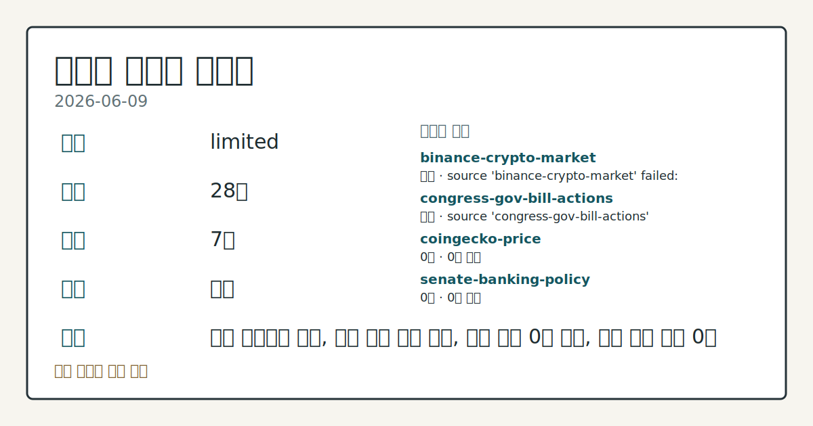
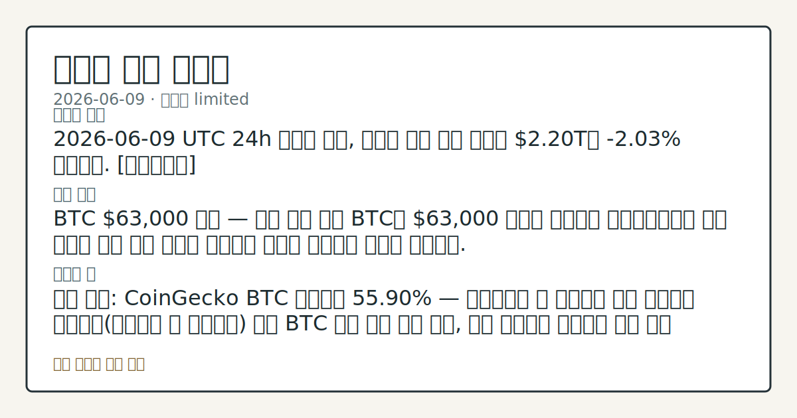

> 정보 제공용 자동 시황이며 가상자산 매매 권유가 아닙니다. 가상자산은 가격 변동성이 매우 큽니다.

# 2026-06-09 크립토 시황

**기준 시각**: 2026-06-09 UTC · [2026-06-09T00:00Z, 2026-06-10T00:00Z)

| 종목 | 스냅샷(UTC 24h) | 구간 변동 | 비고 |
|------|------|------|------|
| BTC-USD | 61,300.69 | -2.84% | +0.71% from 52w low · -30.91% YTD |
| ETH-USD | 1,623.68 | -3.93% | +3.50% from 52w low · -45.88% YTD |

**세그먼트**: [국내 증시](../../../domestic-equity/2026/06/2026-06-09.md) | [미국 증시](../../../us-equity/2026/06/2026-06-09.md) | [크립토](2026-06-09.md)

*이미지: 데이터 신뢰도 · 출처: investo 자체 생성 · 생성: investo 0.1.0 · 2026-06-10 UTC*

> **내 관심 자산 영향**: 데이터 수집 부족으로 매칭 판단 보류 — 추가 수집 후 재평가됩니다.
> **오늘의 결론**: 2026-06-09 UTC 24h 스냅샷 기준, 크립토 시장 전체 시총은 **$2.20**T로 **-2.03%** 하락했다. [데이터부족]
> **핵심 동인**: BTC **$63,000** 이탈 — 분배 국면 지속 BTC가 **$63,000** 아래로 하락하며 애널리스트들은 기관 순유출 속에 상승 구간이 매집보다 분배로 소화되고 있다고 경고했다.
> **주의할 점**: 확인 소스: CoinGecko BTC 도미넌스 **55.90%** — 도미넌스가 현 수준에서 상승 지속하면 알트코인(비트코인 외 암호화폐) 대비 BTC 집중...

> **데이터 상태**: 제한 · 본문 사용 미집계 · 실패 2 · 0건 3

수집/품질 진단

> **데이터 상태**: 제한 — 수집 28건 / 소스 7개 / 누락: 가격 · 제한 — 핵심 가격 소스 0건/실패/stale, 본문 결론 신뢰도 낮음
> **소스 카운트**: 수집 대상 13 / 성공 8 / 0건 3 / 실패 2 / 본문 사용 미집계
> **소스 등급 분포**: S=2 / B=6
> **상세 사유**: 가격 카테고리 누락, 일부 소스 수집 실패, 일부 소스 0건 반환, 핵심 가격 소스 0건
> **소스별 상태**: binance-crypto-market 실패 (접근 제한), congress-gov-bill-actions 실패 (설정 미완료(미수집)), coingecko-price 0건, senate-banking-policy 0건, stooq-price 0건, 정상 8개

## 한눈에 보기

- 전체 시총 **-2.03%** 하락, BTC(비트코인)가 **$63,000** 아래로 이탈하며 분배 국면 심화 신호
- **Humanity Protocol** 해킹으로 **$32M** 이상 탈취, 해당 토큰 **-89%** 급락
- 공포·탐욕 지수 **9(Extreme Fear)** — 극단적 공포 이틀 연속 유지, 본문 §② 참조

## ⓪ 오늘의 매크로

- **미 국채 수익률** — UST curve 2026-06-09: 10Y 4.53%, 2Y10Y +0.40pp

## ⓪-A 크립토 지표 (UTC 24h 스냅샷)

| 지표 | 값 |
|------|------|
| 공포·탐욕 | 9 (Extreme Fear) |
| BTC 도미넌스 | 55.90% |
| 전체 시총 | $2.20T (-2.03% 24h) |
| BTC 펀딩비 | 0.0000636981435931 (okx) |
| BTC 미결제약정 | $455.1M (okx) |
| DeFi TVL | $71.0B |
| 스테이블코인 공급 | $314.7B |
| 24h 청산 / 거래소 순유출입 | 무료 검증 소스 미확정 |

## ⓪-B 채널 기준선

| 기준선 | 값 |
|------|------|
| 비트코인 | 61,300.69 (-2.84%) |
| 이더리움 | 1,623.68 (-3.93%) |
| BTC 도미넌스 | 55.90% |
| 공포·탐욕 | 9 |
| 펀딩/OI/청산 | 펀딩 0.0000636981435931 · OI 수집됨 |

> **크로스마켓 연결 고리**: 금리 이벤트가 할인율/달러 경로의 공통 변수로 남아 있습니다.

## ① 요약

*이미지: 시장 스냅샷 · 출처: investo 자체 생성 · 생성: investo 0.1.0 · 2026-06-10 UTC*

2026-06-09 UTC 24h 스냅샷 기준, 크립토 시장 전체 시총은 **$2.20T**로 **-2.03%** 하락했다. BTC가 **$63,000** 아래로 이탈하며 애널리스트들은 랠리가 매집보다 매도로 소화되는 분배 국면을 경고하고 있다. 공포·탐욕 지수는 **9(Extreme Fear)**로 전일(10)과 거의 동일한 극단적 공포가 이틀째 지속됐다. 전일(2026-06-08) 컨텍스트에서 일부 기관 누적 흐름이 관찰되었지만, 오늘의 데이터는 미국 BTC 현물 ETF(상장지수펀드) 순유출 4주 연속과 분배 압력 지속을 가리키고 있다. 미국 의회에서는 AML(자금세탁방지) 규칙 개정, CFTC(상품선물거래위원회) 약화 우려, 암호화폐 세금 법안 심의 등 규제 변수가 복수 트랙으로 진행 중이다. [하락 관찰]

## ② 전일 핵심 이슈

### BTC **$63,000** 이탈 — 분배 국면 지속

[BTC가 **$63,000** 아래로 하락](https://www.theblock.co/post/404082/stuck-in-distribution-bitcoin-slips-below-63000-as-analysts-warn-rallies-are-being-sold-not-bought)하며 애널리스트들은 기관 순유출 속에 상승 구간이 매집보다 분배로 소화되고 있다고 경고했다. 전일 일부 기관 누적 신호 관찰 이후에도 하락 흐름이 이어지며 방향 전환은 확인되지 않았다. 미국 비트코인 현물 ETF는 [4주 연속 순유출 추세](https://www.theblock.co/post/404075/us-bitcoin-etfs-four-week-negative-streak)를 이어갔으나, 한 애널리스트는 4개 펀드의 일별 순유입을 근거로 매도 압력 완화 신호를 언급했다.

> **그래서 의미는?** BTC 분배 국면 지속은 단기 반등 시도가 매집 수요보다 매도 소화로 무력화되고 있음을 시사하며, 수급 전환 여부를 관찰할 필요가 있다.

### 미국 의회 규제 복수 트랙 — AML·CFTC·세금

[Hyperliquid 지지 로비 그룹과 Paradigm은 퍼블릭 블록체인 상의 분산형 스테이블코인 사용을 제한할 수 있는 AML 규칙 개정을 요구했다](https://www.theblock.co/post/404159/hyperliquid-advocate-paradigm-urge-us-revise-proposed-anti-money-laundering-rule). [워런(Warren) 상원의원은 CFTC 약화를 "재앙의 레시피"로 규정하며 Clarity Act(명확성법)와 관련 기록 제출을 요청했다](https://www.theblock.co/post/404147/warren-weakened-cftc-recipe-disaster-congress-advances-crypto-legislation). [하원에서는 디지털 자산에 세금 규칙을 어떻게 적용할지를 둘러싼 암호화폐 세금 법안 심의가 예정됐다](https://www.theblock.co/post/404146/third-leg-stool-house-lawmakers-to-debate-crypto-tax-bills-questions-still-loom). [하원 금융서비스위원회](http://financialservices.house.gov/news/documentsingle.aspx?DocumentID=411158)는 신중 규제기관과의 정책 정렬을 별도로 강조하며 마크업(markup·법안 심사) 일정을 진행 중이다.

### Humanity Protocol 해킹 — **$32**M 이상 탈취

[온체인 애널리스트에 따르면 Humanity Protocol과 연결된 지갑에서 **$32M** 이상이 탈취됐으며](https://www.theblock.co/post/404053/humanity-protocol-exploit), 이 중 **$23.7M**이 ETH(이더리움)로 스왑됐고 약 **$7.9M**이 H 토큰 상태로 잔류한다. 해당 토큰은 **-89%** 급락했다. 이번 사건은 DeFi(탈중앙화 금융) 프로토콜 보안 취약점에 대한 시장 경계를 다시 높이고 있다.

## ③ 섹터/수급 동향

### 기관 인프라 확장 — 규제 적응 가속

[Morpho가 Paradigm, a16z crypto, Ribbit Capital 공동 주도로 **$175M**을 조달해 개방형 온체인 신용 네트워크 구축을 추진한다](https://www.theblock.co/post/404111/morpho-raises-175m-paradigm-a16z-crypto-ribbit-capital). [GSR은 FINRA(미국금융산업규제기구) 승인을 받아 브로커-딜러 인수를 완료했고](https://www.theblock.co/post/404097/gsr-receives-finra-approval-to-complete-broker-dealer-acquisition), [Backpack US는 전 SEC(증권거래위원회) 대행 의장 Piwowar를 이사회에 영입해 크립토 퍼페추얼(영구 계약) 시장 확장을 추진 중이다](https://www.theblock.co/post/404084/backpack-us-appoints-former-sec-acting-chairman-piwowar-to-board-amid-push-for-crypto-perps). [Zodia Custody는 룩셈부르크 CSSF(결제 감독 기관)로부터 결제기관 라이선스를 취득해 EU 내 규제 스테이블코인 커스터디 서비스를 확장할 수 있게 됐다](https://www.theblock.co/post/404086/zodia-custody-secures-luxembourg-payment-institution-license-to-expand-eu-stablecoin-services).

> **그래서 의미는?** 시장 하락 국면에서도 기관 인프라 투자와 규제 적응 움직임이 이어지고 있어, 중장기 수급 기반 구축 흐름을 관찰할 필요가 있다.

### 일본 전통 금융의 크립토 연계

[SBI 신세이 은행(SBI Shinsei Bank)은 예금 이자의 **20%** 상당 바우처를 암호화폐로 교환 가능한 리워드 프로그램을 올 가을 시행할 계획이라고 닛케이(Nikkei)가 보도했다](https://www.theblock.co/post/404080/japan-sbi-shinsei-bank-plans-crypto-rewards-program). 일본 은행권의 크립토 연계 서비스 확장 사례로, 아시아 리테일 접근성 변화 추세를 보여준다.

## ④ 지표·이벤트

### UTC 24h 시장 구조 스냅샷

| 지표 | 값 | 출처 |
|------|------|------|
| 공포·탐욕 | 9 (Extreme Fear) | [Alternative.me](https://alternative.me/crypto/fear-and-greed-index/) |
| BTC 도미넌스 | 55.90% | [CoinGecko](https://www.coingecko.com/en/global-charts) |
| 전체 시총 | $2.20T (-2.03% 24h) | CoinGecko |
| DeFi TVL(총예치금) | $71.0B | [DeFiLlama](https://defillama.com/) |
| 스테이블코인 공급 | $314.7B | DeFiLlama |
| BTC 펀딩비 | 0.0000636981435931 | [OKX](https://www.okx.com/trade-swap/btc-usd-swap) |
| BTC 미결제약정 | $455.1M | OKX |
| 24h 청산 / 거래소 순유출입 | 데이터 미수집 | — |

> **그래서 의미는?** 공포·탐욕 지수가 극단적 공포 구간을 이틀 연속 유지하는 가운데, BTC 펀딩비가 소폭 양수(롱 우위)를 나타내 파생상품 시장의 포지셔닝...

### DeFi 체인별 TVL 및 스테이블코인 구성

[DeFiLlama에 따르면](https://defillama.com/) TVL 상위 체인은 Ethereum **$37.0B**, BSC(바이낸스 스마트 체인) **$5.2B**, Solana **$4.8B**, Tron **$4.4B**, Bitcoin **$4.1B** 순으로 Ethereum이 전체 DeFi TVL의 절반 이상을 차지한다. 스테이블코인 상위는 USDT(테더) **$186.8B**, USDC **$75.1B**, USDS **$8.5B**, USD1 **$4.5B**, USDe **$4.5B** 순으로 전체 **$314.7B**이다.

### 거시 금리 배경 — 크립토 관련성

[미 재무부 기준](https://home.treasury.gov/resource-center/data-chart-center/interest-rates) UST(미국 국채) 10Y 금리 **4.53%**, 2Y **4.13%**, 30Y **5.01%**, 장단기 금리차 2Y10Y **+0.40pp**. 고금리 환경은 리스크 자산으로서의 크립토 수요에 간접적 배경을 형성한다.

## ⑤ 주요 종목

<!-- u50 lightweight-charts-embed: placeholders consumed by site_docs/assets/investo-chart-init.js -->

<noscript><em>인터랙티브 차트는 JavaScript가 활성화된 환경에서 표시됩니다. 위 정적 카드가 동일한 정보를 담고 있습니다.</em></noscript>

### 보안 이벤트

- **AAVE**: [KelpDAO 익스플로잇(취약점 공격) 이후 새 리스크 프레임워크 제안이 제출됐으며](https://www.theblock.co/post/404136/new-aave-risk-framework-proposed-following-kelpdao-exploit), 창업자 Stani Kulechov는 제안 통과 시 전 시장·자산에 적용할 것이라고 밝혔다.

### 기관 관심 자산

- **ENA**: [Janus Henderson이 ENA 포지션을 취득하고 Ethena 생태계 연계 규제 투자 상품 출시를 검토 중이다](https://www.theblock.co/post/404109/janus-henderson-takes-ena-position-eyes-regulated-investment-products-tied-to-ethena).

### 프로토콜 업그레이드

- **STRK**: [ZK(영지식 증명) 프라이버시 레이어 STRK20이 Starknet 메인넷에 출시되며 ERC20(이더리움 토큰 규격) 잔액·전송의 프라이빗 처리와 규제 기관용 선택적 공개 메커니즘이 적용됐다](https://www.theblock.co/post/404008/starknet-rolls-out-zk-privacy-layer-for-erc20-balances-and-transfers).
- **ZEC**: [Ironwood 업그레이드 계획이 확정되어 7월 활성화를 목표로 하며](https://www.theblock.co/post/404065/zcash-finalizes-ironwood-upgrade-plan), 새 실드풀(shielded pool·익명 거래 풀) 도입과 유통 ZEC 공급량 상한 유지가 포함된다.

> **그래서 의미는?** AAVE(아베)·ENA(에나)·STRK(스타크넷)·ZEC(지캐시) 각각의 프로토콜 이벤트는 개별 자산의 수급 및 보안 리스크 변화를 관찰할...

## ⑥ 오늘의 관전 포인트

| 관찰 신호 | 현재 | 상방 확인 조건 | 하방 확인 조건 | 신뢰도 | 섹션 내 관심 영향 |
| --- | --- | --- | --- | --- | --- |
| 확인 소스: CoinGecko BTC 도미넌스 **55… | 확인 소스: CoinGecko BTC 도미넌스 **55.90%** — 도미넌스가 현 수준에서 상승 지속하면 알트코인 대비 BTC 집중 심화 흐름 관찰, 하락 전환하면 알트코인 수급 분산 신호 점검. 관심 영향: 전체 시총 내 배분 구조 변동 여부 확인. | 데이터부족 | 데이터부족 | 높음 | 관심 영향: 전체 시총 내 배분 구조 변동 여부 확인. |
| 확인 소스: Alternative.me 공포·탐욕 지수… | 확인 소스: Alternative.me 공포·탐욕 지수 **9(Extreme Fear)** — 지수가 Extreme Fear 구간을 이탈해 Fear 구간으로 회복하면 심리 개선 신호 관찰, Extreme Fear 구간 장기화 시 패닉 심화 추세 점검. 관심 영향: 단기 수급 심리 전환 여부 확인. | 탐욕 지수 **9(Extreme Fear)** — 지수가 Extreme Fear 구간을 이탈해 Fear 구간으로 회복하면 심리 개선 신호 관찰, Extreme Fear 구간 장기화 시 패닉 심화 추세 점검 | 탐욕 지수 **9(Extreme Fear)** — 지수가 Extreme Fear 구간을 이탈해 Fear 구간으로 회복하면 심리 개선 신호 관찰, Extreme Fear 구간 장기화 시 패닉 심화 추세 점검 | 보통 | 관심 영향: 단기 수급 심리 전환 여부 확인. |
| BTC 현물 ETF 4주 연속 순유출 추세 — 일별 순… | 확인 소스: The Block · BTC 현물 ETF 4주 연속 순유출 추세 — 일별 순유입 펀드 수가 확대되어 주간 합산이 순유입으로 전환하면 기관 수요 회복 신호 관찰, 순유출 확대 지속 시 분배 국면 장기화 흐름 점검. 관심 영향: 기관 수급 방향성 변화 확인. | BTC 현물 ETF 4주 연속 순유출 추세 — 일별 순유입 펀드 수가 확대되어 주간 합산이 순유입으로 전환하면 기관 수요 회복 신호 관찰, 순유출 확대 지속 시 분배 국면 장기화 흐름 점검 | 데이터부족 | 보통 | 관심 영향: 기관 수급 방향성 변화 확인. |
| Clarity Act 진행 상황 — 법안 | — | 데이터부족 | 데이터부족 | 데이터부족 | — |
| 확인 소스: OKX BTC 미결제약정 **$455.1M… | 확인 소스: OKX BTC 미결제약정 **$455.1M**, 펀딩비 양수 유지 중 — 미결제약정이 증가 추세로 전환하면 레버리지 포지션 축적 흐름 관찰, 감소 전환 시 포지션 정리 압력 점검. 관심 영향: 파생상품 시장 단기 변동성 방향 확인. | 데이터부족 | 데이터부족 | 높음 | 관심 영향: 파생상품 시장 단기 변동성 방향 확인. |
## ⑦ 면책조항
본 시황은 일반 정보 제공을 목적으로 자동 생성된 자료이며,
특정 가상자산에 대한 매매 권유나 투자 자문이 아닙니다.
가상자산은 가상자산이용자보호법(2024-07-19 시행) §10·§19의 적용 대상으로,
24시간 거래되는 비제도권 자산이며 가격 변동성이 매우 크고 원금 전액 손실이 가능합니다.
투자 결정과 그 결과에 대한 책임은 전적으로 본인에게 있으며,
본 시황의 내용에 따라 발생한 손실에 대해 작성자는 일체의 책임을 지지 않습니다.