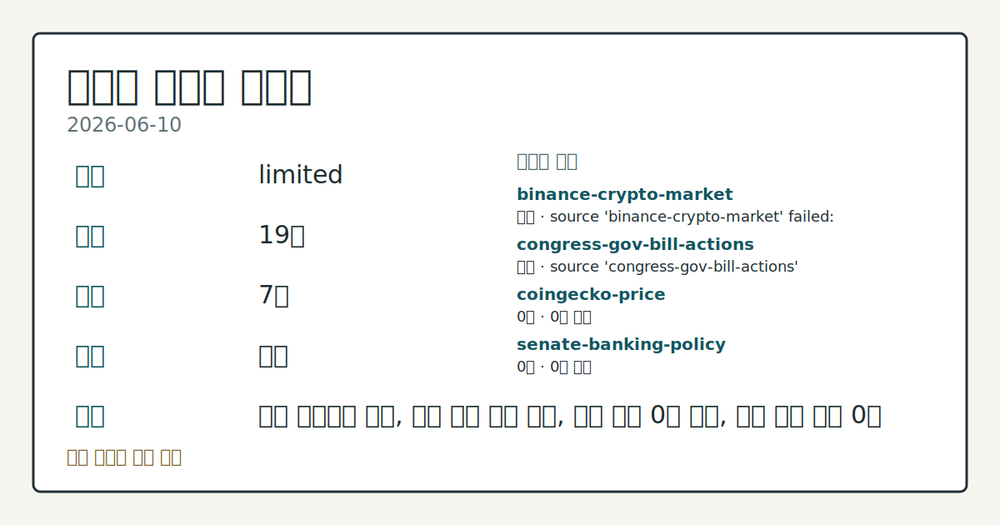
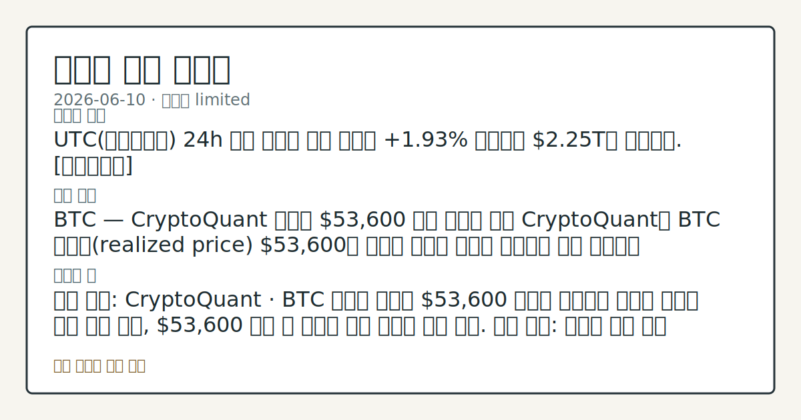

# 2026-06-10 크립토 시황
**기준 시각**: 2026-06-10 UTC · 2026-06-10T00:00Z, 2026-06-11T00:00Z)
| 종목 | 스냅샷(UTC 24h) | 구간 변동 | 비고 |
|------|------|------|------|
| BTC-USD | 63,279.21 | +2.98% | +3.96% from 52w low · -28.69% YTD |
| ETH-USD | 1,674.36 | +3.35% | +6.73% from 52w low · -44.20% YTD |
**세그먼트**: [국내 증시](../../../domestic-equity/2026/06/2026-06-10.md) | [미국 증시](../../../us-equity/2026/06/2026-06-10.md) | [크립토](2026-06-10.md)

*이미지: 데이터 신뢰도 · 출처: investo 자체 생성 · 생성: investo 0.1.0 · 2026-06-11 UTC*
> **내 관심 자산 영향**: 데이터 수집 부족으로 매칭 판단 보류 — 추가 수집 후 재평가됩니다.
> **오늘의 결론**: UTC(협정세계시) 24h 기준 크립토 전체 시총이 **+1.93%** 반등하며 **$2.25**T를 회복했다. [데이터부족]
> **핵심 동인**: BTC — CryptoQuant 실현가 **$53,600** 하방 임계선 분석 CryptoQuant는 BTC 실현가(realized price) **$53,600**을 역사적 약세장 저점이 형성됐던 임계 수준으로 제시하며, 현재 온체인 수요 지표가 "깊이 비우호적(deeply unfavorable)"이라고 진단했다.
> **주의할 점**: 확인 소스: CryptoQuant · BTC 가격이 실현가 **$53,600** 상회를 유지하면 역사적 지지선 구간 흐름 확인, **$53,600** 이탈 시...
> **데이터 상태**: 제한 · 본문 사용 미집계 · 실패 2 · 0건 3

수집/품질 진단

> **데이터 상태**: 제한 — 수집 19건 / 소스 7개 / 누락: 가격 · 제한 — 핵심 가격 소스 0건/실패/stale, 본문 결론 신뢰도 낮음
> **소스 카운트**: 수집 대상 13 / 성공 8 / 0건 3 / 실패 2 / 본문 사용 미집계
> **소스 등급 분포**: S=2 / B=6
> **상세 사유**: 가격 카테고리 누락, 일부 소스 수집 실패, 일부 소스 0건 반환, 핵심 가격 소스 0건
> **소스별 상태**: binance-crypto-market 실패 (접근 제한), congress-gov-bill-actions 실패 (설정 미완료(미수집)), coingecko-price 0건, senate-banking-policy 0건, stooq-price 0건, 정상 8개

> 정보 제공용 자동 시황이며 가상자산 매매 권유가 아닙니다. 가상자산은 가격 변동성이 매우 큽니다.
## 한눈에 보기
전체 시총 **+1.93%** 반등하며 **$2.25T** 회복 — 공포·탐욕(Fear & Greed) 지수는 **12**(Extreme Fear, 극단적 공포) 구간 지속 유지
CryptoQuant(크립토퀀트)가 **BTC** 실현가(realized price) **$53,600**을 역사적 약세장 저점 임계선으로 제시, 온체인 수요 "깊이 비우호적" 진단
DeFi TVL(탈중앙화금융 총예치금) **$71.0B**, 스테이블코인(stablecoin) 공급 **$314.6B** — 온체인 자금 흐름 §③에서 점검
## ⓪ 오늘의 매크로
**미 국채 수익률** — UST curve 2026-06-10: 10Y 4.55%, 2Y10Y +0.42pp
## ⓪-A 크립토 지표 (UTC 24h 스냅샷)
| 지표 | 값 |
|------|------|
| 공포·탐욕 | 12 (Extreme Fear) |
| BTC 도미넌스 | 56.27% |
| 전체 시총 | $2.25T (+1.93% 24h) |
| BTC 펀딩비 | 0.0000557680511197 (okx) |
| BTC 미결제약정 | $470.0M (okx) |
| DeFi TVL | $71.0B |
| 스테이블코인 공급 | $314.6B |
| 24h 청산 / 거래소 순유출입 | 무료 검증 소스 미확정 |
## ⓪-B 채널 기준선
| 기준선 | 값 |
|------|------|
| 비트코인 | 63,279.21 (+2.98%) |
| 이더리움 | 1,674.36 (+3.35%) |
| BTC 도미넌스 | 56.27% |
| 공포·탐욕 | 12 |
| 펀딩/OI/청산 | 펀딩 0.0000557680511197 · OI 수집됨 |
> **크로스마켓 연결 고리**: 금리 이벤트가 할인율/달러 경로의 공통 변수로 남아 있습니다.
> **오늘의 큰 그림:** 금리와 달러 변수가 미국·가상자산에 동시에 걸리며, 오늘 독자는 금리·달러 민감도을 먼저 확인해야 합니다.
## ① 요약

*이미지: 시장 스냅샷 · 출처: investo 자체 생성 · 생성: investo 0.1.0 · 2026-06-11 UTC*

UTC 24h 기준 크립토 전체 시총이 **+1.93%** 반등하며 **$2.25T**를 회복했다. 전일(2026-06-09) **$2.20T** 수준에서 소폭 반등했으나 공포·탐욕 지수는 **12**(Extreme Fear)로 극단적 공포 구간을 유지하고 있어 추세 전환으로 판단하기 어렵다. BTC 도미넌스(dominance)는 **56.27%**로 알트코인 대비 상대적 강세 흐름을 이어가고 있다. CryptoQuant는 BTC 실현가 **$53,600**을 역사적 약세장 저점 기준선으로 제시하며 수요 지표가 "깊이 비우호적"이라고 분석했고, SpaceX IPO(기업공개) 소매 배정 이슈가 잠재적 크립토 자금 이탈 압력으로 부상했다. [혼재]

## ② 전일 핵심 이슈

### BTC — CryptoQuant 실현가 **$53,600** 하방 임계선 분석

[CryptoQuant](https://www.theblock.co/post/404316/cryptoquant-sees-bitcoin-bottom-near-53600-while-demand-remains-deeply-unfavorable)는 BTC 실현가(realized price) **$53,600**을 역사적 약세장 저점이 형성됐던 임계 수준으로 제시하며, 현재 온체인 수요 지표가 "깊이 비우호적"이라고 진단했다. 이 수준은 과거 약세장 바닥과 역사적으로 일치하는 가격대로, 현재 BTC가 이 임계선을 얼마나 상회하고 있는지가 관찰 포인트다.

> **그래서 의미는?** 온체인 수요 지표가 악화된 상태에서 역사적 저점 임계선이 제시됐다는 점은 추가 하락 여부를 확인할 필요가 있는 국면임을 시사합니다.

### SpaceX IPO 소매 배정 — 크립토 자금 이탈 리스크 부상

[SpaceX](https://www.theblock.co/post/404324/elon-musks-spacex-ipo-could-become-bitcoins-latest-headwind) IPO에서 소매 투자자에게 최대 **30%**의 공모 물량 배정이 예정되어 있어, BTC 및 ETH 등 크립토 자산 보유자들이 IPO 자금 마련을 위해 크립토를 정리할 수 있다는 분석이 제기됐다.

## ③ 섹터/수급 동향

### DeFi TVL 체인별 분포 — Ethereum 선두

[DeFi Llama](https://defillama.com/) 기준 DeFi TVL은 **$71.0B**이며, 체인별로는 Ethereum: **$37.2B**, BSC(바이낸스 스마트 체인): **$5.2B**, Solana: **$4.6B**, Tron: **$4.4B**, Bitcoin: **$4.1B** 순이다.

> **그래서 의미는?** DeFi 예치금의 절반 이상이 Ethereum에 집중된 구조는 ETH 가격 변동이 DeFi TVL 전반에 연동될 수 있음을 관찰 대상으로 볼...

### 스테이블코인 공급 — USDT 압도적 우위 구조

[DeFi Llama](https://defillama.com/) 기준 스테이블코인 총 공급은 **$314.6B**이며, USDT: **$186.7B**, USDC: **$75.0B**, USDS: **$8.4B**, USDe: **$4.5B**, DAI: **$4.4B** 순이다.

### 금융 어드바이저 — 스테이블코인·토크나이제이션 관심 부상

[Bitwise](https://www.theblock.co/post/404341/bitcoin-stablecoins-tokenization-bitwise-cio-financial-advisors) CIO(최고투자책임자) 매트 호건은 금융 어드바이저들이 BTC보다 스테이블코인과 토크나이제이션(tokenization, 자산 토큰화)에 더 높은 관심을 보이고 있다고 밝혔다.

## ④ 지표·이벤트

### BTC 파생상품 지표 — OKX UTC 24h 스냅샷

[OKX](https://www.okx.com/trade-swap/btc-usd-swap) 기준 BTC 미결제약정(open interest)은 **$469,977,340** ~ **$469,982,190** 수준이며, 펀딩비(funding rate)는 0.0000557680511197로 소폭 양수를 유지하고 있다. [CoinGecko](https://www.coingecko.com/en/global-charts) 기준 전체 시총 **$2,251,631,162,319**, BTC 도미넌스 **56.27%**. [Alternative.me](https://alternative.me/crypto/fear-and-greed-index/) 공포·탐욕 지수 **12**/100(Extreme Fear).

> **그래서 의미는?** BTC 펀딩비가 소폭 양수를 유지하는 반면 공포·탐욕 지수는 극단적 공포 구간으로, 파생상품과 심리 지표 간 괴리를 관찰할 필요가 있습니다.

### UST(미국 국채) 금리 — 크립토 할인율 배경

[미 재무부](https://home.treasury.gov/resource-center/data-chart-center/interest-rates) 2026-06-10 기준: 3M **3.79%**, 2Y **4.13%**, 10Y **4.55%**, 30Y **5.03%**, 2Y10Y 스프레드 **+0.42pp**. 장기 금리 고수준 지속은 위험자산 전반의 할인율 상승 압박 배경으로 관찰된다.

24h 정리 및 거래소 순유출입: 데이터 미수집 (무료 검증 소스 미확정).

## ⑤ 주요 종목

<!-- u50 lightweight-charts-embed: placeholders consumed by site_docs/assets/investo-chart-init.js -->

<noscript><em>인터랙티브 차트는 JavaScript가 활성화된 환경에서 표시됩니다. 위 정적 카드가 동일한 정보를 담고 있습니다.</em></noscript>

### 확인 항목

[Raydium](https://www.theblock.co/post/404304/raydium-dex-1-34-million-exploit-retired-amm-program-treasury-cover-losses)(레이디움) DEX(탈중앙화거래소)는 은퇴한 AMM(자동화된 시장조성자, Automated Market Maker) 프로그램에서 **$1.34M** 규모의 익스플로잇(exploit, 보안 취약점 악용)이 발생했다고 밝혔다. 5개 비활성 유동성 풀에서 자산이 유출됐으며, 피해 사용자는 트레저리(treasury, 운영 자금)를 통해 보상받을 예정이다.

> **그래서 의미는?** Raydium DEX 보안 사고와 Tether(테더)의 로보틱스 투자는 크립토 생태계 내 보안 리스크와 기업 전략 다각화 흐름을 동시에 관찰할...

### 체크리스트

[Tether](https://www.theblock.co/post/404303/tether-leads-up-to-1-4-billion-round-in-robotics-firm-neura-plans-crypto-wallet-integration)(테더)는 로보틱스 기업 Neura에 최대 **$1.4B** 규모 투자 라운드를 주도하며 크립토 지갑 통합을 계획 중이라고 밝혔다.

## ⑥ 오늘의 관전 포인트

#### 관찰 신호: 확인 소스: CryptoQuant · BTC 가격

- 출처: 확인 소스 미상
- 현재: 확인 소스: CryptoQuant · BTC 가격이 실현가 **$53,600** 상회를 유지하면 역사적 지지선 구간 흐름 확인, **$53,600** 이탈 시 약세장 저점 재접근 추세 점검. 관심 영향: 온체인 수요 지표 회복 여부 데이터 비교.
- 확인 조건: 상방 BTC 가격이 실현가 **$53,600** 상회를 유지하면 역사적 지지선 구간 흐름 확인, **$53,600** 이탈 시 약세장 저점 재접근 추세 점검; 하방 BTC 가격이 실현가 **$53,600** 상회를 유지하면 역사적 지지선 구간 흐름 확인, **$53,600** 이탈 시 약세장 저점 재접근 추세 점검
- 신뢰도: 높음
- 관심 영향: 관심 영향: 온체인 수요 지표 회복 여부 데이터 비교.

#### 관찰 신호: 확인 소스: Alternative.me · 공포·탐욕…

- 출처: 확인 소스 미상
- 현재: 확인 소스: Alternative.me · 공포·탐욕 지수 **12**(Extreme Fear) 구간에서 심리 개선 징후가 관찰될 경우 극단적 공포 이탈 방향 추세 확인, 지수 추가 하락 시 매도 압력 지속 흐름 점검. 관심 영향: BTC 도미넌스 변화와 연동한 알트코인 수급 변동 관찰.
- 확인 조건: 상방 상방 데이터 부족; 하방 탐욕 지수 **12**(Extreme Fear) 구간에서 심리 개선 징후가 관찰될 경우 극단적 공포 이탈 방향 추세 확인, 지수 추가 하락 시 매도 압력 지속 흐름 점검
- 신뢰도: 보통
- 관심 영향: 관심 영향: BTC 도미넌스 변화와 연동한 알트코인 수급 변동 관찰.

#### 관찰 신호: 확인 소스: 하원 금융서비스위원회 · 디지털 자산 관련…

- 출처: 확인 소스 미상
- 현재: 확인 소스: 하원 금융서비스위원회 · 디지털 자산 관련 법안 마크업(markup, 법안 심의) 진행 시 심의 내용을 상방 정책 환경으로 관찰, 심의 지연·수정 시 규제 불확실성 지속 흐름 점검. 관심 영향: 스테이블코인·디지털 자산 정책 동향 일정 체크.
- 확인 조건: 상방 디지털 자산 관련 법안 마크업(markup, 법안 심의) 진행 시 심의 내용을 상방 정책 환경으로 관찰, 심의 지연; 하방 하방 데이터 부족
- 신뢰도: 보통
- 관심 영향: 관심 영향: 스테이블코인

#### 관찰 신호: 확인 소스: The Block · SpaceX IPO…

- 출처: 확인 소스 미상
- 현재: 확인 소스: The Block · SpaceX IPO 소매 배정 **30%** 실행 시점에서 BTC·ETH 거래량 변화를 상방 이탈 흐름으로 관찰, 크립토 전체 시총 감소 흐름이 지속될 경우 IPO 자금 이동 경로 점검. 관심 영향: 크립토 전체 시총 변동 방향 관찰.
- 확인 조건: 상방 ETH 거래량 변화를 상방 이탈 흐름으로 관찰, 크립토 전체 시총 감소 흐름이 지속될 경우 IPO 자금 이동 경로 점검; 하방 ETH 거래량 변화를 상방 이탈 흐름으로 관찰, 크립토 전체 시총 감소 흐름이 지속될 경우 IPO 자금 이동 경로 점검
- 신뢰도: 높음
- 관심 영향: 관심 영향: 크립토 전체 시총 변동 방향 관찰.

#### 관찰 신호: 확인 소스: DeFi Llama · DeFi TVL *…

- 출처: 확인 소스 미상
- 현재: 확인 소스: DeFi Llama · DeFi TVL **$71.0B** 수준 유지를 상방 온체인 안정 흐름으로 관찰, TVL 감소가 이어질 경우 Ethereum 중심 체인별 이탈 속도 비교. 관심 영향: 스테이블코인 공급 **$314.6B** 추이와 연계한 온체인 자금 동향 데이터 비교.
- 확인 조건: 상방 DeFi TVL **$71.0B** 수준 유지를 상방 온체인 안정 흐름으로 관찰, TVL 감소가 이어질 경우 Ethereum 중심 체인별 이탈 속도 비교; 하방 DeFi TVL **$71.0B** 수준 유지를 상방 온체인 안정 흐름으로 관찰, TVL 감소가 이어질 경우 Ethereum 중심 체인별 이탈 속도 비교
- 신뢰도: 높음
- 관심 영향: 관심 영향: 스테이블코인 공급 **$314.6B** 추이와 연계한 온체인 자금 동향 데이터 비교.
## ⑦ 면책조항
본 시황은 일반 정보 제공을 목적으로 자동 생성된 자료이며,
특정 가상자산에 대한 매매 권유나 투자 자문이 아닙니다.
가상자산은 가상자산이용자보호법(2024-07-19 시행) §10·§19의 적용 대상으로,
24시간 거래되는 비제도권 자산이며 가격 변동성이 매우 크고 원금 전액 손실이 가능합니다.
투자 결정과 그 결과에 대한 책임은 전적으로 본인에게 있으며,
본 시황의 내용에 따라 발생한 손실에 대해 작성자는 일체의 책임을 지지 않습니다.