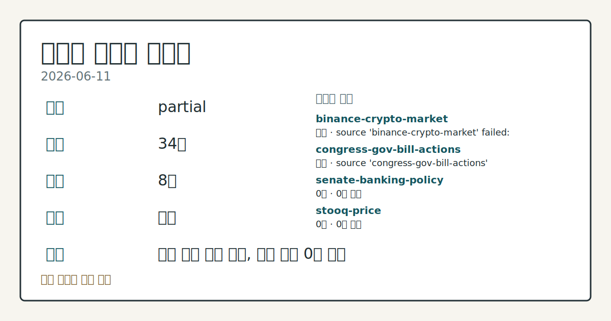
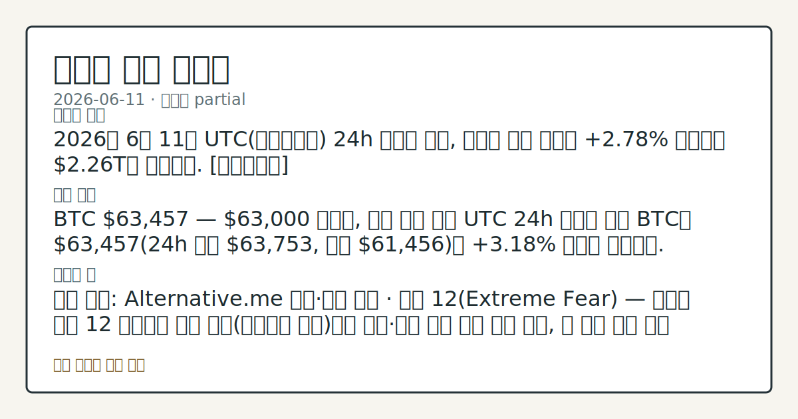
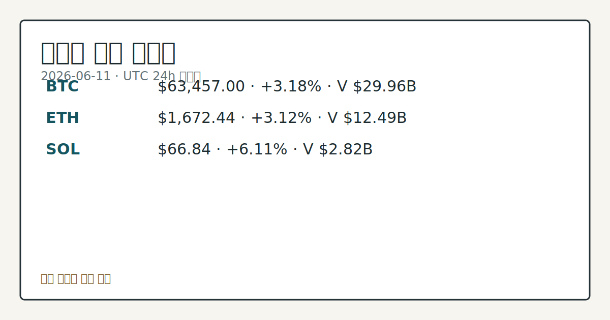

> 정보 제공용 자동 시황이며 가상자산 매매 권유가 아닙니다. 가상자산은 가격 변동성이 매우 큽니다.
# 2026-06-11 크립토 시황
**기준 시각**: 2026-06-11 UTC · 2026-06-11T00:00Z, 2026-06-12T00:00Z)
| 종목 | 스냅샷(UTC 24h) | 구간 변동 | 비고 |
|------|------|------|------|
| BTC-USD | 63,597.97 | +3.50% | +4.49% from 52w low · -28.33% YTD |
| ETH-USD | 1,676.55 | +3.48% | +6.87% from 52w low · -44.12% YTD |
**세그먼트**: [국내 증시](../../../domestic-equity/2026/06/2026-06-11.md) | [미국 증시](../../../us-equity/2026/06/2026-06-11.md) | [크립토](2026-06-11.md)

*이미지: 데이터 신뢰도 · 출처: investo 자체 생성 · 생성: investo 0.1.0 · 2026-06-12 UTC*
> **내 관심 자산 영향**: 15건 확인 (기본 바스켓) — BTC: [boundary-term] Global crypto market cap **$2,255,051,442,046**; BTC dominance **56.29%**; BTC: [structured-symbol] BTC **$63,457.00** (**+3.18%**); BTC: [alias:Bitcoin] DeFi TVL **$71.7**B; leader Ethereum; BTC: [boundary-term] BTC 미결제약정 **$471,904,350** (OKX, UTC 24h); BTC: [boundary-term] BTC 미결제약정 **$471,926,520** (OKX, UTC 24h) 외
> **용어 가이드**: 이번 시황에서 처음 등장한 용어 — 시가총액(시장가치), 콜옵션(매수권리)
> **오늘의 결론**: 2026년 6월 11일 UTC(협정세계시) 24h 스냅샷 기준, 크립토 전체 시총은 **+2.78%** 상승하며 **$2.26**T를 회복했다. [데이터부족]
> **핵심 동인**: BTC **$63,457** — **$63,000** 재탈환, 이틀 연속 반등 UTC 24h 스냅샷 기준 BTC는 **$63,457**(24h 고점 **$63,753**, 저점 **$61,456**)로 **+3.18%** 상승이 관찰됐다.
> **주의할 점**: 확인 소스: Alternative.me 공포·탐욕 지수 · 현재 12(Extreme Fear) — 지수가 현재 12 수준에서 상방 개선(카테고리 전환)되면 가격...
> **데이터 상태**: 부분 · 본문 사용 미집계 · 실패 2 · 0건 2

수집/품질 진단

> **데이터 상태**: 부분 — 수집 34건 / 소스 8개 / 누락: 없음 · 부분 — 일부 카테고리 미수집, 본문 일부 결론 보강 필요
> **소스 카운트**: 수집 대상 13 / 성공 9 / 0건 2 / 실패 2 / 본문 사용 미집계
> **소스 등급 분포**: S=2 / B=7
> **상세 사유**: 일부 소스 수집 실패, 일부 소스 0건 반환
> **소스별 상태**: binance-crypto-market 실패 (접근 제한), congress-gov-bill-actions 실패 (설정 미완료(미수집)), senate-banking-policy 0건, stooq-price 0건, 정상 9개

립 구간 속 반등 추세를 §④에서 점검
## 한눈에 보기
2026년 6월 11일 UTC 24h 스냅샷 기준, 크립토 전체 시총은 **+2.78%** 상승하며 **$2.26**T를 회복했다. [데이터부족]
BTC **$63,457** — **$63,000** 재탈환, 이틀 연속 반등 UTC 24h 스냅샷 기준 BTC는 **$63,457**(24h 고점 **$63,753**, 저점 **$61,456**)로 **+3.18%** 상승이 관찰됐다.
확인 소스: Alternative.me 공포·탐욕 지수 · 현재 12 — 지수가 현재 12 수준에서 상방 개선되면 가격·심리 괴리 완화 흐름 관찰, 현 수준 유지 또는 재하락 시 Extreme Fear 지속 구간 확인. 관심 영향: BTC 반등 지속성 추세 점검. 확인 소스: CoinGecko BTC · 24h 고점 **$63,753** / 저점 **$61,456** — BTC가 24h 고점 **$63,753** 상회 시 상방 연장 구간 관찰, 저점 **$61,456** 이탈 시 반등
## ⓪ 오늘의 매크로
**미 국채 수익률** — UST curve 2026-06-11: 10Y 4.45%, 2Y10Y +0.40pp
## ⓪-A 크립토 지표 (UTC 24h 스냅샷)
| 지표 | 값 |
|------|------|
| 공포·탐욕 | 12 (Extreme Fear) |
| BTC 도미넌스 | 56.29% |
| 전체 시총 | $2.26T (+2.78% 24h) |
| BTC 펀딩비 | 0.0000115047363973 (okx) |
| BTC 미결제약정 | $471.9M (okx) |
| DeFi TVL | $71.7B |
| 스테이블코인 공급 | $314.5B |
| 24h 청산 / 거래소 순유출입 | 무료 검증 소스 미확정 |
## ⓪-B 채널 기준선
| 기준선 | 값 |
|------|------|
| 비트코인 | 63,597.97 (+3.50%) |
| 이더리움 | 1,676.55 (+3.48%) |
| BTC 도미넌스 | 56.29% |
| 공포·탐욕 | 12 |
| 펀딩/OI/청산 | 펀딩 0.0000115047363973 · OI 수집됨 |
> **크로스마켓 연결 고리**: 금리 이벤트가 할인율/달러 경로의 공통 변수로 남아 있습니다.
> **오늘의 큰 그림:** 금리와 달러 변수가 미국·가상자산에 동시에 걸리며, 오늘 독자는 금리·달러 민감도을 먼저 확인해야 합니다.
## ① 요약

*이미지: 시장 스냅샷 · 출처: investo 자체 생성 · 생성: investo 0.1.0 · 2026-06-12 UTC*

2026년 6월 11일 UTC 24h 스냅샷 기준, 크립토 전체 시총은 **+2.78%** 상승하며 **$2.26T**를 회복했다. BTC는 **$63,457**(**+3.18%**)로 **$63,000** 선을 재탈환했고, ETH **+3.12%**, SOL **+6.11%** 등 주요 자산 전반에 동반 상승이 관찰됐다. 전날(2026-06-10)에 이어 이틀 연속 시총 반등 흐름이 이어지고 있다. 그러나 공포·탐욕 지수(Fear & Greed Index, 크립토 투자 심리 지표)는 **12**(Extreme Fear)에 머물러 가격 회복과 투자 심리 간 괴리가 지속되고 있으며, JPMorgan은 BTC에서 탈가치절하(debasement trade, 화폐 가치 하락 헤지 목적 투자) 트레이드 후퇴가 "가속화"됐다고 분석했다. [혼재]

## ② 전일 핵심 이슈

### BTC **$63,457** — **$63,000** 재탈환, 이틀 연속 반등

UTC 24h 스냅샷 기준 [BTC](https://www.coingecko.com/en/coins/bitcoin)는 **$63,457**(24h 고점 **$63,753**, 저점 **$61,456**)로 **+3.18%** 상승이 관찰됐다. 2026-06-09 **$63,000** 이탈 이후 시작된 반등이 이틀째 이어지는 구간이며, 24h 거래량은 **$29,960,252,868**이다. ETH는 **$1,672.44**(**+3.12%**), SOL은 **$66.84**(**+6.11%**)로 알트코인도 동반 상승이 확인된다.

> **그래서 의미는?** 가격이 **$63,000** 선을 재탈환했으나 공포·탐욕 지수가 여전히 **12**(Extreme Fear)를 가리켜, 가격과 투자 심리 간...

### JPMorgan: BTC 탈가치절하 트레이드 후퇴 "가속화"

[JPMorgan](https://www.theblock.co/post/404471/jpmorgan-debasement-trade-retreat-bitcoin-gold) 분석에 따르면 금(Gold)과 BTC 모두에서 탈가치절하 트레이드 후퇴가 관찰됐으며, 특히 BTC에서 이 후퇴가 "가속화"됐다는 분석이 나왔다. Strike CEO Jack Mallers는 [BTC의 **$63,000** 수준](https://www.theblock.co/post/404453/sell-what-you-can-not-what-you-want-jack-mallers-bitcoin-pricing-global-liquidity-crisis)이 글로벌 유동성 위기(global liquidity crisis) 상황을 반영한 것이며, 유동성이 부족한 환경에서 "팔 수 있는 것을 팔게 된다"는 압력이 작용한다고 밝혔다.

## ③ 섹터/수급 동향

### DeFi TVL 및 스테이블코인 공급

[DeFi(탈중앙화금융) TVL(총예치자산)](https://defillama.com/)은 **$71.7B** 수준이며, Ethereum이 **$37.5**B로 1위를 유지하고 BSC(바이낸스 스마트 체인) **$5.2**B, Solana **$4.7**B, Tron **$4.4**B, Bitcoin **$4.2**B 순이다. 스테이블코인(달러 연동 가상자산) 총 공급은 [**$314.5**B](https://defillama.com/)이며, USDT가 **$186.7**B, USDC가 **$74.9**B, USDS **$8.4**B, USDe **$4.5**B, DAI **$4.4**B 순이다.

> **그래서 의미는?** DeFi TVL과 스테이블코인 공급 규모가 유지되고 있어, 온체인 유동성 인프라는 현 수준에서 관찰 가능한 상태입니다.

### 기관·기업 블록체인 활용 동향

[Citigroup(씨티그룹)](https://www.theblock.co/post/404422/citigroup-to-offer-tokenized-shares-of-private-companies-for-wealthy-and-institutional-clients-wsj)은 부유층·기관 고객을 대상으로 비상장 기업 주식의 블록체인 토큰화(tokenization) 서비스를 출시할 예정이라고 WSJ이 보도했다. [Visa](https://www.theblock.co/post/404376/visa-stablecoins-reshaping-back-end-of-commerce)는 스테이블코인이 상거래의 "백엔드를 재편"하고 있다고 밝히며 AI 도구, 토큰화 기능, OpenAI 파트너십 등 신규 이니셔티브를 발표했다.

## ④ 지표·이벤트

### BTC 파생상품 지표 — 미결제약정·펀딩비

OKX 기준 BTC 미결제약정(Open Interest, 선물 미정리 계약 총액)은 **$471.9M** 수준이며, 펀딩비(Funding Rate, 선물·현물 간 가격 차이 수렴 비용)는 **0.0000115** 수준으로 0에 근접한 양수다. 이는 선물 롱(long, 상승 방향 포지션)과 숏(short, 하락 방향 포지션) 수급이 비교적 균형에 가깝다는 것을 시사한다. 24h 정리 데이터 및 거래소 순유출입은 무료 검증 소스 미확정으로 데이터 미수집이다.

> **그래서 의미는?** 펀딩비가 중립 수준에 가까워 선물 시장에서 한쪽으로 과도하게 쏠린 레버리지가 축적된 상황은 아닌 것으로 관찰됩니다.

### 공포·탐욕 지수 및 BTC 도미넌스

[공포·탐욕 지수](https://alternative.me/crypto/fear-and-greed-index/)는 **12**(Extreme Fear)로, 최근 며칠간 이어온 극단적 공포 구간이 지속되고 있다. BTC 도미넌스(비트코인 시장 점유 비중)는 **56.29%**로 알트코인 대비 BTC의 상대적 비중이 높은 수준이다.

### 규제 동향 — 미국 CLARITY 법안·헝가리

미국 [하원 금융서비스위원회(House Financial Services Committee)](http://financialservices.house.gov/calendar/eventsingle.aspx?EventID=411137)가 복수의 안건 심의(Markup)를 예정하고 있다. CLARITY(크립토 자산 규제 명확화) 법안의 스테이블코인 리워드(reward) 조항에 반대하는 지역 [커뮤니티 은행 단체의 광고 캠페인](https://www.theblock.co/post/404439/community-bank-group-ad-campaign-targeting-clarity-act-stablecoin-reward-language)이 개시됐다. [헝가리](https://www.theblock.co/post/404417/hungary-reverses-orban-era-crypto-rules)는 오르반(Orban) 시대의 크립토 거래 관련 징역형 규정을 폐지해 거래를 비범죄화할 예정이라고 보도됐다.

## ⑤ 주요 종목

<!-- u50 lightweight-charts-embed: placeholders consumed by site_docs/assets/investo-chart-init.js -->

<noscript><em>인터랙티브 차트는 JavaScript가 활성화된 환경에서 표시됩니다. 위 정적 카드가 동일한 정보를 담고 있습니다.</em></noscript>

*이미지: 가격 스냅샷 · 출처: investo 자체 생성 · 생성: investo 0.1.0 · 2026-06-12 UTC*

| 자산 | UTC 24h 가격 변동 | 24h 거래량 | 시가총액 |
|------|-----------------|-----------|--------|
| [BTC](https://www.coingecko.com/en/coins/bitcoin) | $63,457 (+3.18%) | $29,960,252,868 | $1,271,356,799,299 |
| [ETH](https://www.coingecko.com/en/coins/ethereum) | $1,672.44 (+3.12%) | $12,493,155,133 | $201,748,700,403 |
| [SOL](https://www.coingecko.com/en/coins/solana) | $66.84 (+6.11%) | $2,823,639,354 | $38,738,035,218 |

> **그래서 의미는?** BTC(비트코인), ETH(이더리움), SOL(솔라나) 모두 UTC 24h 기준 상승이 관찰됐으며, SOL의 상대 강도가 두드러진 점과...

### 기관 상품 확장 확인 항목

[BlackRock(블랙록)](https://www.theblock.co/post/404367/blackrock-amendment-yield-bitcoin-etf)은 커버드콜(covered call, 주식 보유 후 콜옵션 매도를 통한 수익 창출) 전략을 통해 IBIT(블랙록 현물 BTC ETF(상장지수펀드)) 주식 기반 수익을 제공하는 신규 비트코인 펀드 관련 개정안(amendment)을 SEC(미국 증권거래위원회)에 제출했으며, Bloomberg 애널리스트는 출시가 임박했다고 전했다.

### 개별 이슈 관찰 항목

- [ARB(Arbitrum, 이더리움 레이어2 네트워크 토큰)](https://www.theblock.co/post/404494/arbitrum-token-jumps-5-news-lg-electronics-building-new-blockchain): LG전자의 Arbitrum 기반 디지털 광고 블록체인 구축 소식에 **+5%** 상승이 관찰됐다.
- [Bithumb(빗썸)](https://www.theblock.co/post/404392/bithumb-ceo-bribery-case): 경찰이 빗썸 CEO 이씨를 뇌물 혐의로 입건했다는 보도가 나왔다. 국내 거래소 관련 이슈로 추가 경과를 관찰할 필요가 있다.
- [Coinbase(코인베이스)](https://www.theblock.co/post/404458/coinbase-agents-dedicated-accounts-ai-bots-trade-pay-users): AI 에이전트(자율 실행 소프트웨어)에 전용 계좌를 부여해 거래·결제를 위임하는 'Coinbase for Agents' 서비스를 출시했다.
- [Bitmine](https://www.theblock.co/post/404352/tom-lees-bitmine-buys-41-million-worth-eth): Tom Lee의 Bitmine이 온체인 데이터 기준 ETH를 **$41**M 규모 추가 매수한 것으로 관찰됐다.

## ⑥ 오늘의 관전 포인트

#### 관찰 신호: 확인 소스: Alternative.me 공포·탐욕 지수…

- 출처: 확인 소스 미상
- 현재: 확인 소스: Alternative.me 공포·탐욕 지수 · 현재 **12**(Extreme Fear) — 지수가 현재 **12** 수준에서 상방 개선(카테고리 전환)되면 가격·심리 괴리 완화 흐름 관찰, 현 수준 유지 또는 재하락 시 Extreme Fear 지속 구간 확인. 관심 영향: BTC 반등 지속성 추세 점검.
- 확인 조건: 상방 현재 **12**(Extreme Fear) — 지수가 현재 **12** 수준에서 상방 개선(카테고리 전환)되면 가격; 하방 하방 데이터 부족
- 신뢰도: 보통
- 관심 영향: 관심 영향: BTC 반등 지속성 추세 점검.

#### 관찰 신호: 확인 소스: CoinGecko BTC · 24h 고점…

- 출처: 확인 소스 미상
- 현재: 확인 소스: CoinGecko BTC · 24h 고점 **$63,753** / 저점 **$61,456** — BTC가 24h 고점 **$63,753** 상회 시 상방 연장 구간 관찰, 저점 **$61,456** 이탈 시 반등 구간 재하락 흐름 확인. 관심 영향: **$63,000** 선 안착 여부와 가격 구간 변동 추이 확인.
- 확인 조건: 상방 24h 고점 **$63,753** / 저점 **$61,456** — BTC가 24h 고점 **$63,753** 상회 시 상방 연장 구간 관찰, 저점 **$61,456** 이탈 시 반등 구간 재하락 흐름 확인; 하방 24h 고점 **$63,753** / 저점 **$61,456** — BTC가 24h 고점 **$63,753** 상회 시 상방 연장 구간 관찰, 저점 **$61,456** 이탈 시 반등 구간 재하락 흐름 확인
- 신뢰도: 높음
- 관심 영향: 관심 영향: **$63,000** 선 안착 여부와 가격 구간 변동 추이 확인.

#### 관찰 신호: 확인 소스: OKX BTC 미결제약정 · 현재 **$4…

- 출처: 확인 소스 미상
- 현재: 확인 소스: OKX BTC 미결제약정 · 현재 **$471.9M** — 미결제약정이 **$471.9M** 대비 증가 추세 시 레버리지 참여 확대 관찰, 감소 추세 시 포지션 축소 흐름 확인. 관심 영향: 선물 시장 레버리지 방향성 추이 점검.
- 확인 조건: 상방 상방 데이터 부족; 하방 하방 데이터 부족
- 신뢰도: 높음
- 관심 영향: 관심 영향: 선물 시장 레버리지 방향성 추이 점검.

#### 관찰 신호: 확인 소스: CoinGecko 전체 시총 · BTC…

- 출처: 확인 소스 미상
- 현재: 확인 소스: CoinGecko 전체 시총 · BTC 도미넌스 현재 **56.29%** — 도미넌스가 **56.29%** 대비 상승 시 알트코인 대비 BTC 수급 집중 흐름 관찰, 하락 전환 시 알트코인 순환 흐름 확인. 관심 영향: 알트코인 섹터 상대 강도 변동 관찰.
- 확인 조건: 상방 상방 데이터 부족; 하방 하방 데이터 부족
- 신뢰도: 높음
- 관심 영향: 관심 영향: 알트코인 섹터 상대 강도 변동 관찰.

#### 관찰 신호: 확인 소스: 하원 금융서비스위원회 일정 · CLARIT…

- 출처: 확인 소스 미상
- 현재: 확인 소스: 하원 금융서비스위원회 일정 · CLARITY 법안 안건 심의(Markup) 예정 — 스테이블코인 리워드 조항 원안 유지 시 규제 찬반 압력 지속 관찰, 조항 수정 또는 삭제 시 스테이블코인 규제 환경 변화 방향 확인. 관심 영향: 스테이블코인 및 관련 크립토 자산 규제 흐름 점검.
- 확인 조건: 상방 상방 데이터 부족; 하방 하방 데이터 부족
- 신뢰도: 낮음
- 관심 영향: 관심 영향: 스테이블코인 및 관련 크립토 자산 규제 흐름 점검.
## ⑦ 면책조항
본 시황은 일반 정보 제공을 목적으로 자동 생성된 자료이며,
특정 가상자산에 대한 매매 권유나 투자 자문이 아닙니다.
가상자산은 가상자산이용자보호법(2024-07-19 시행) §10·§19의 적용 대상으로,
24시간 거래되는 비제도권 자산이며 가격 변동성이 매우 크고 원금 전액 손실이 가능합니다.
투자 결정과 그 결과에 대한 책임은 전적으로 본인에게 있으며,
본 시황의 내용에 따라 발생한 손실에 대해 작성자는 일체의 책임을 지지 않습니다.