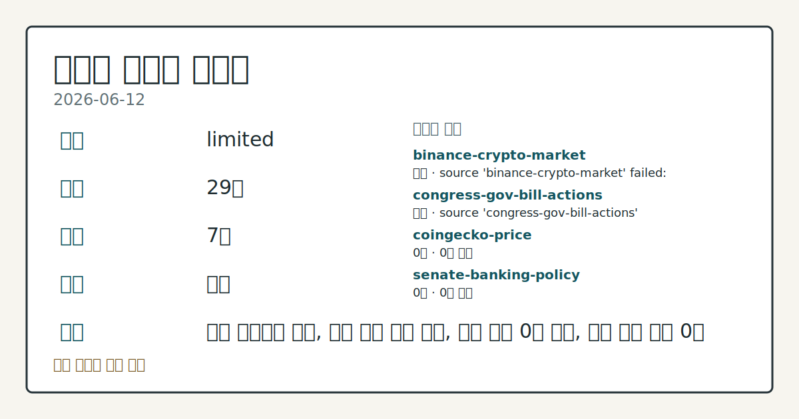
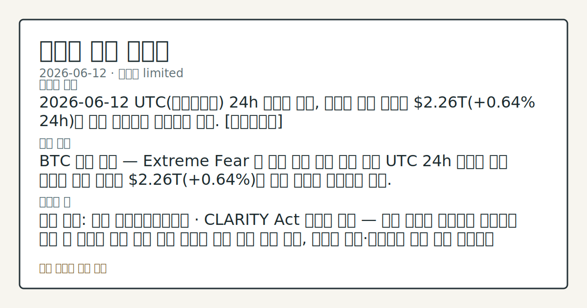

# 2026-06-12 크립토 시황
**기준 시각**: 2026-06-12 UTC · 2026-06-12T00:00Z, 2026-06-13T00:00Z)
| 종목 | 스냅샷(UTC 24h) | 구간 변동 | 비고 |
|------|------|------|------|
| BTC-USD | 65,509.13 | +1.69% | +7.63% from 52w low · -26.17% YTD |
| ETH-USD | 1,723.20 | +2.56% | +9.84% from 52w low · -42.57% YTD |
**세그먼트**: [국내 증시](../../../domestic-equity/2026/06/2026-06-12.md) | [미국 증시](../../../us-equity/2026/06/2026-06-12.md) | [크립토](2026-06-12.md)

*이미지: 데이터 신뢰도 · 출처: investo 자체 생성 · 생성: investo 0.1.0 · 2026-06-14 UTC*
> **내 관심 자산 영향**: 데이터 수집 부족으로 매칭 판단 보류 — 추가 수집 후 재평가됩니다.
> **용어 가이드**: 이번 시황에서 처음 등장한 용어 — 공매도(차입매도)
> **오늘의 결론**: 2026년 6월 12일 UTC(협정세계시) 24h 스냅샷 기준, 크립토 전체 시총은 **+1.26%** 반등해 **$2.31**T를 기록하며 최근 5일간 지속된 회복 흐름을 이어갔다. [데이터부족]
> **핵심 동인**: BTC 심리 지표 — Extreme Fear 구간 지속 공포·탐욕 지수 UTC 24h 기준 18 (Extreme Fear)를 기록했다.
> **주의할 점**: 확인 소스: alternative.me · 공포·탐욕 지수 — 현재 18 (Extreme Fear); 지수가 25 이상으로 회복되면 심리 반전 흐름 추세 확인...
> **데이터 상태**: 제한 · 본문 사용 미집계 · 실패 2 · 0건 3

수집/품질 진단

> **데이터 상태**: 제한 — 수집 25건 / 소스 7개 / 누락: 가격 · 제한 — 핵심 가격 소스 0건/실패/stale, 본문 결론 신뢰도 낮음
> **소스 카운트**: 수집 대상 13 / 성공 8 / 0건 3 / 실패 2 / 본문 사용 미집계
> **소스 등급 분포**: S=2 / B=6
> **상세 사유**: 가격 카테고리 누락, 일부 소스 수집 실패, 일부 소스 0건 반환, 핵심 가격 소스 0건
> **소스별 상태**: binance-crypto-market 실패 (접근 제한), congress-gov-bill-actions 실패 (설정 미완료(미수집)), coingecko-price 0건, senate-banking-policy 0건, stooq-price 0건, 정상 8개

> 정보 제공용 자동 시황이며 가상자산 매매 권유가 아닙니다. 가상자산은 가격 변동성이 매우 큽니다.
## 한눈에 보기
UTC 24h 기준 크립토 전체 시총 **+1.26%** 상승, **$2.31T** 수준 유지 — 최근 5일 회복 흐름 연장
공포·탐욕 지수 **18** (Extreme Fear) — 6월 8일 극단치 **10** 대비 소폭 완화됐으나 극도의 공포 구간 지속
Bitwise 분석가가 BTC 최대 **20%** 추가 하방 및 "max pain" 시나리오로 **$48,000** 제시 — 본문 §② 참조
## ⓪ 오늘의 매크로
**미 국채 수익률** — UST curve 2026-06-12: 10Y 4.48%, 2Y10Y +0.39pp
## ⓪-A 크립토 지표 (UTC 24h 스냅샷)
| 지표 | 값 |
|------|------|
| 공포·탐욕 | 18 (Extreme Fear) |
| BTC 도미넌스 | 56.61% |
| 전체 시총 | $2.31T (+1.26% 24h) |
| BTC 펀딩비 | 0.0000695781281840 (okx) |
| BTC 미결제약정 | $459.0M (okx) |
| DeFi TVL | $72.7B |
| 스테이블코인 공급 | $314.3B |
| 24h 청산 / 거래소 순유출입 | 무료 검증 소스 미확정 |
## ⓪-B 채널 기준선
| 기준선 | 값 |
|------|------|
| 비트코인 | 65,509.13 (+1.69%) |
| 이더리움 | 1,723.20 (+2.56%) |
| BTC 도미넌스 | 56.61% |
| 공포·탐욕 | 18 |
| 펀딩/OI/청산 | 펀딩 0.0000695781281840 · OI 수집됨 |
> **크로스마켓 연결 고리**: 금리 이벤트가 할인율/달러 경로의 공통 변수로 남아 있습니다.
> **오늘의 큰 그림:** 금리와 달러 변수가 미국·가상자산에 동시에 걸리며, 오늘 독자는 금리·달러 민감도을 먼저 확인해야 합니다.
## ① 요약

*이미지: 시장 스냅샷 · 출처: investo 자체 생성 · 생성: investo 0.1.0 · 2026-06-14 UTC*

2026년 6월 12일 UTC 24h 스냅샷 기준, 크립토 전체 시총은 **+1.26%** 반등해 **$2.31T**를 기록하며 최근 5일간 지속된 회복 흐름을 이어갔다. BTC 도미넌스(전체 시총 대비 BTC 비중)는 **56.61%**로 알트코인 대비 BTC 우위 구도가 유지됐다. 그러나 [공포·탐욕 지수](https://alternative.me/crypto/fear-and-greed-index/)는 **18** (Extreme Fear)로 심리적 위축이 지속됐으며, Bitwise 분석가가 BTC 최대 **20%** 추가 하락 시나리오를 언급한 점이 회복 기대를 상쇄하고 있다. CLARITY Act(크립토 자산 규제 명확화 법안)를 둘러싼 미국 의회 논의에 Y Combinator가 공개 지지를 표명하며 제도화 논의에 민간 벤처 자본이 목소리를 더했다. [혼재]

## ② 전일 핵심 이슈

### BTC 심리 지표 — Extreme Fear 구간 지속

[공포·탐욕 지수](https://alternative.me/crypto/fear-and-greed-index/) UTC 24h 기준 **18** (Extreme Fear)를 기록했다. 6월 8일 **10** 대비 소폭 완화됐으나 여전히 극단적 공포 구간에 머물고 있다. 어제(2026-06-11) BTC가 **$63,457**까지 반등하며 이틀 연속 상승 흐름을 보인 것과 비교하면, 심리 지표는 가격 회복 속도를 따라가지 못하는 양상이 관찰된다.

> **그래서 의미는?** 가격 소폭 반등에도 공포 심리가 해소되지 않아, 반등 지속성보다 하방 리스크 확인이 우선인 구간으로 관찰된다.

### CLARITY Act — Y Combinator 지지 표명

[Y Combinator](https://www.theblock.co/post/404643/early-airbnb-doordash-backer-y-combinator-expects-crypto-to-be-used-by-every-one-of-its-portfolio-companies)는 미국 의회가 CLARITY Act를 통과시키면 포트폴리오 전 기업이 크립토를 활용할 수 있을 것으로 전망했다. Airbnb, Coinbase, Stripe, Reddit, OpenAI 등의 초기 투자자인 Y Combinator가 공개적으로 지지한 점은 민간 벤처 자본이 크립토 법제화 논의에 직접 개입하는 흐름으로 관찰된다. 한편 미국 하원 금융서비스위원회(House Financial Services Committee)는 [각종 법안 마크업(법안 조항 심사·수정) 일정](http://financialservices.house.gov/calendar/eventsingle.aspx?EventID=411137)을 예고해 디지털 자산 관련 규제 진전 여부가 주목된다.

### SBF 항소 기각 — 25년 형 유지

[항소법원이 Sam Bankman-Fried의 재심 신청을 기각](https://www.theblock.co/post/404637/appeals-court-rejects-sam-bankman-frieds-bid-for-new-trial-in-ftx-fraud-case)하며 FTX(에프티엑스) 사기 사건의 **25년** 형이 유지됐다. 원심 절차 공정성 문제를 주장했으나 법원은 이를 받아들이지 않았다.

### Bitwise — BTC 최대 20% 추가 하방 시나리오

[Bitwise의 Dragosch 분석가](https://www.theblock.co/post/404561/bitwise-dragosch-bitcoin-max-pain-48k)는 BTC의 최대 **20%** 추가 하락 가능성을 언급하며, 장기 보유자 비용 기반인 **$48,000**을 "max pain(최대 고통)" 시나리오로 제시했다. AI(인공지능) 분야로의 유동성 이탈이 BTC 수요를 압박하는 배경으로 제시됐다.

### 한국 기획재정부 — 토큰화 주식, 증권 분류

[한국 기획재정부](https://www.theblock.co/post/404580/south-korea-finance-ministry-says-tokenized-stocks-are-securities-not-crypto-assets-opening-door-to-taxes-report)가 토큰화 주식(tokenized stocks)을 가상자산이 아닌 증권으로 분류한다는 방침을 밝혔다. 빠르면 2026년 하반기 과세가 가능하며, 금융감독원 등 관계 기관과의 최종 합의가 남아 있다.

## ③ 섹터/수급 동향

### DeFi TVL — Ethereum 우위 속 체인 간 경쟁

[DeFi(탈중앙화 금융) TVL(총예치자산)](https://defillama.com/)은 **$72.7B**이며, Ethereum(이더리움)이 **$37.9B**으로 1위를 유지하고 있다. 뒤를 이어 BSC(바이낸스 스마트체인) **$5.3B**, Solana(솔라나) **$4.8B**, Tron(트론) **$4.5B**, Bitcoin(비트코인) **$4.3B** 순으로 집계됐다.

> **그래서 의미는?** Ethereum이 DeFi TVL의 절반 이상을 점유해 생태계 허브 지위를 유지하고 있으며, Solana는 TVL과 토큰화 자산 확장 양면에서...

### 스테이블코인 공급 — **$314.3**B 고수준 유지

[스테이블코인(가치 고정 가상자산) 전체 공급량](https://defillama.com/)은 **$314.3B**이다. 개별 비중은 USDT(테더) **$186.5B**, USDC(USD코인) **$74.9B**, USDS **$8.4B**, USDe(에테나 달러) **$4.5B**, USD1 **$4.4B** 순이다. 스테이블코인 공급이 고수준을 유지하는 점은 시장 내 잠재 유동성이 여전히 대기 중임을 시사한다.

### 토큰화 자산 — Solana 중심 확장 흐름

[Exodus와 Ondo](https://www.theblock.co/post/404622/exodus-launches-tokenized-markets-200-plus-stocks-etfs-on-solana)가 Solana 블록체인 위에서 200개 이상 주식·ETF(상장지수펀드)의 토큰화 거래를 시작했다. [Ethena Labs](https://www.theblock.co/post/404602/ethena-labs-to-allocate-250-million-to-securitizes-tokenized-aaa-clo-fund-as-it-deploys-on-solana)도 Securitize의 토큰화 AAA CLO(담보부대출채권) 펀드에 **$250M**을 배분하며 Solana 기반 기관 자산 확장에 합류했다. 토큰화 증권 시장이 Solana 체인을 중심으로 기관 자본 유치 경쟁을 벌이는 흐름이 관찰된다.

## ④ 지표·이벤트

### BTC 파생상품 — 미결제약정·펀딩비 현황

[OKX(암호화폐 파생상품 거래소)](https://www.okx.com/trade-swap/btc-usd-swap) UTC 24h 기준 BTC 미결제약정(선물·스왑의 미정리 포지션 규모)은 **$458,961,590**으로 집계됐다. BTC 펀딩비(현물·선물 가격 격차 조정 비율)는 **0.0000695781281840**으로 양수(+) 구간을 유지하고 있으나 수치 자체는 미미한 수준이다.

> **그래서 의미는?** 소폭 양수 펀딩비와 낮은 미결제약정 규모는 레버리지 과열보다 포지션 정리 구간에 가깝다는 관찰 근거로 해석된다.

### 글로벌 크립토 시총·BTC 도미넌스

[CoinGecko(코인게코)](https://www.coingecko.com/en/global-charts) UTC 24h 스냅샷 기준 전체 시총은 **$2,311,630,841,861**이며, BTC 도미넌스는 **56.61%**를 기록했다. 전체 시총은 전 구간 대비 **+1.26%** 상승했다.

### 하원 금융서비스위원회 마크업 일정

미국 하원 금융서비스위원회가 [각종 법안 마크업 일정](http://financialservices.house.gov/calendar/eventsingle.aspx?EventID=411137)을 예고했다. CLARITY Act를 포함한 디지털 자산 관련 법안의 심사 진전 여부가 관찰 포인트다.

### 24h 정리·거래소 순유출입

24h 정리 및 거래소 순유출입 데이터는 이번 구간 무료 검증 소스 미확정으로 데이터 미수집 상태다.

## ⑤ 주요 종목

<!-- u50 lightweight-charts-embed: placeholders consumed by site_docs/assets/investo-chart-init.js -->

<noscript><em>인터랙티브 차트는 JavaScript가 활성화된 환경에서 표시됩니다. 위 정적 카드가 동일한 정보를 담고 있습니다.</em></noscript>

> **그래서 의미는?** 이번 구간 주요 가상자산의 개별 가격 데이터가 제한적이며, 기관·거래소 관련 사실 관찰 중심으로 정리한다.

### 실적·이벤트 항목

- **IBIT**(BlackRock 비트코인 현물 ETF): 미국 스팟 비트코인 ETF 전체 [누적 거래대금이 **$2**T(조 달러) 달성](https://www.theblock.co/post/404584/bitcoin-etfs-2-trillion-usd-cumulative-trading-volume) 직전이며, IBIT의 시장 점유율은 **73.7%**로 집계됐다. 동시에 순유출(net outflow) 흐름이 지속되고 있다는 점도 보고됐다.

### 확인 항목

- **Metaplanet**(일본 상장 비트코인 투자사): [일본 증권사 Siiibo Securities를 **$13M**에 인수](https://www.theblock.co/post/404564/metaplanet-siiibo-securities-acquisition)하며 비트코인 연계 수익 상품 개발을 예고했다. 거래 완료는 2026년 7월 예정이며 법인명은 Metaplanet Securities로 변경 계획이다.
- **USDe**: [Ethena Labs가 Securitize의 토큰화 AAA CLO 펀드에 **$250M** 배분](https://www.theblock.co/post/404602/ethena-labs-to-allocate-250-million-to-securitizes-tokenized-aaa-clo-fund-as-it-deploys-on-solana)을 결정하며 Solana 기반 기관 자산 확장 흐름을 추진 중이다.

### 체크리스트

- **Bybit·Binance·Bitget**(주요 거래소 3사): [토큰화 SpaceX(스페이스엑스) IPO(기업공개) 배정 물량 부족](https://www.theblock.co/post/404644/bybit-binance-bitget-cancel-tokenized-spacex-ipo-allocations-share-shortage)으로 관련 할당을 전면 취소하고 전액 환불 및 추가 보상을 진행 중이다. 토큰화 IPO 시장에서 실물 주식 조달 한계가 확인된 사례로 관찰된다.

## ⑥ 오늘의 관전 포인트

#### 관찰 신호: 확인 소스: alternative.me · 공포·탐욕…

- 출처: 확인 소스 미상
- 현재: 확인 소스: alternative.me · 공포·탐욕 지수 — 현재 **18** (Extreme Fear); 지수가 **25** 이상으로 회복되면 심리 반전 흐름 추세 확인, **10** 이하로 재접근하면 6월 8일 저점 수준 재도달 여부를 추가 점검. 관심 영향: BTC 단기 수급 방향성 변동 관찰.
- 확인 조건: 상방 지수가 **25** 이상으로 회복되면 심리 반전 흐름 추세 확인, **10** 이하로 재접근하면 6월 8일 저점 수준 재도달 여부를 추가 점검; 하방 하방 데이터 부족
- 신뢰도: 보통
- 관심 영향: 관심 영향: BTC 단기 수급 방향성 변동 관찰.

#### 관찰 신호: BTC 펀딩비

- 출처: 확인 소스 미상
- 현재: 확인 소스: OKX · BTC 펀딩비 — 현재 **0.0000695781281840** (소폭 양수); 펀딩비가 음수로 전환되면 숏커버링 국면 전환 추세 확인, 양수 확대 시 롱포지션 재편 흐름 점검. 관심 영향: 선물 시장 포지션 쏠림 추세 관찰.
- 확인 조건: 상방 상방 데이터 부족; 하방 하방 데이터 부족
- 신뢰도: 보통
- 관심 영향: 관심 영향: 선물 시장 포지션 쏠림 추세 관찰.

#### 관찰 신호: 확인 소스: House Financial Service…

- 출처: 확인 소스 미상
- 현재: 확인 소스: House Financial Services Committee 마크업 일정 — CLARITY Act 포함 디지털 자산 법안 심사 예고; 위원회 단계 통과 시 미국 크립토 규제 명확화 진전 흐름 관찰, 지연 또는 내용 수정 시 제도화 일정 재점검. 관심 영향: 크립토 정책 방향성 추세 확인.
- 확인 조건: 상방 상방 데이터 부족; 하방 하방 데이터 부족
- 신뢰도: 보통
- 관심 영향: 관심 영향: 크립토 정책 방향성 추세 확인.

#### 관찰 신호: DeFi TVL

- 출처: 확인 소스 미상
- 현재: 확인 소스: DeFiLlama · DeFi TVL — 현재 **$72.7B** (Ethereum **$37.9B** 선두); TVL이 현 수준 이상 유지되면 Ethereum 생태계 자금 흐름 지속 관찰, 하방 이탈 시 Solana·BSC 등으로의 자금 이동 추세 비교. 관심 영향: 체인별 DeFi 수급 경쟁 흐름 점검.
- 확인 조건: 상방 상방 데이터 부족; 하방 TVL이 현 수준 이상 유지되면 Ethereum 생태계 자금 흐름 지속 관찰, 하방 이탈 시 Solana
- 신뢰도: 높음
- 관심 영향: 관심 영향: 체인별 DeFi 수급 경쟁 흐름 점검.

#### 관찰 신호: Bitwise 하방 분석

- 출처: 확인 소스 미상
- 현재: 확인 소스: theblock · Bitwise 하방 분석 — BTC "max pain" 시나리오 **$48,000** 제시; 현 가격이 해당 수준 이하로 이탈하면 장기 보유자 비용 기반 하방 돌파 여부 추가 점검, 반등 지속 시 단기 하방 압력 완화 추세 관찰. 관심 영향: 장기 보유자 포지션 비용 대비 시장 위치 확인.
- 확인 조건: 상방 현 가격이 해당 수준 이하로 이탈하면 장기 보유자 비용 기반 하방 돌파 여부 추가 점검, 반등 지속 시 단기 하방 압력 완화 추세 관찰; 하방 Bitwise 하방 분석
- 신뢰도: 높음
- 관심 영향: 관심 영향: 장기 보유자 포지션 비용 대비 시장 위치 확인.
## ⑦ 면책조항
본 시황은 일반 정보 제공을 목적으로 자동 생성된 자료이며,
특정 가상자산에 대한 매매 권유나 투자 자문이 아닙니다.
가상자산은 가상자산이용자보호법(2024-07-19 시행) §10·§19의 적용 대상으로,
24시간 거래되는 비제도권 자산이며 가격 변동성이 매우 크고 원금 전액 손실이 가능합니다.
투자 결정과 그 결과에 대한 책임은 전적으로 본인에게 있으며,
본 시황의 내용에 따라 발생한 손실에 대해 작성자는 일체의 책임을 지지 않습니다.