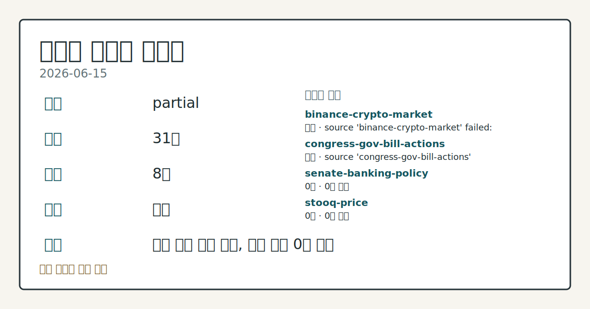
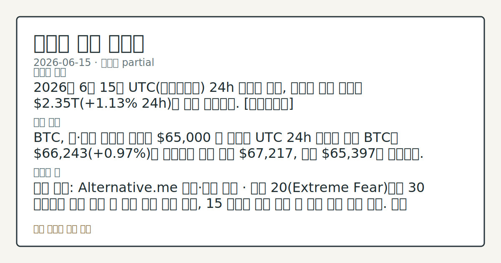
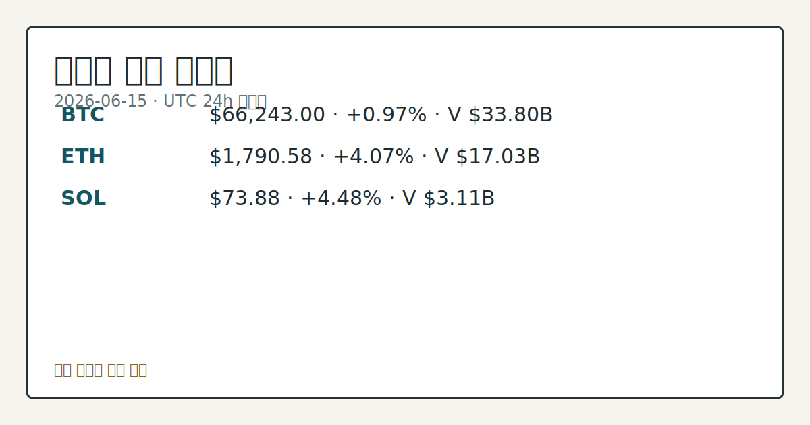

# 2026-06-15 크립토 시황
**기준 시각**: 2026-06-15 UTC · 2026-06-15T00:00Z, 2026-06-16T00:00Z)
| 종목 | 스냅샷(UTC 24h) | 구간 변동 | 비고 |
|------|------|------|------|
| BTC-USD | 66,293.08 | +0.89% | +8.91% from 52w low · -25.29% YTD |
| ETH-USD | 1,794.06 | +4.03% | +14.36% from 52w low · -40.21% YTD |
**세그먼트**: [국내 증시](../../../domestic-equity/2026/06/2026-06-15.md) | [미국 증시](../../../us-equity/2026/06/2026-06-15.md) | [크립토](2026-06-15.md)

*이미지: 데이터 신뢰도 · 출처: investo 자체 생성 · 생성: investo 0.1.0 · 2026-06-16 UTC*
> **내 관심 자산 영향**: 19건 확인 (기본 바스켓) — BTC: [boundary-term] Global crypto market cap **$2,350,950,783,512**; BTC dominance **56.48%**; BTC: [structured-symbol] BTC **$66,243.00** (**+0.97%**); BTC: [alias:Bitcoin] DeFi TVL **$74.7**B; leader Ethereum; BTC: [boundary-term] BTC 미결제약정 **$455,961,030** (OKX, UTC 24h); BTC: [boundary-term] BTC 펀딩비 0.0000282677142226 (OKX, UTC 24h) 외
> **오늘의 결론**: 2026년 6월 15일 UTC(협정세계시) 24h 스냅샷 기준, 크립토 전체 시총은 **$2.35**T(**+1.13%** 24h)로 소폭 반등했다. [데이터부족]
> **핵심 동인**: BTC, 미·이란 지정학 완화에 **$65,000** 선 재확인 UTC 24h 스냅샷 기준 BTC는 **$66,243**(**+0.97%**)을 기록하며 구간 고점 **$67,217**, 저점 **$65,397**을 형성했다.
> **주의할 점**: 확인 소스: Alternative.me 공포·탐욕 지수 · 현재 20(Extreme Fear)에서 30 이상으로 회복 관찰 시 심리 개선 신호 확인, 15...
> **데이터 상태**: 부분 · 본문 사용 미집계 · 실패 2 · 0건 2

수집/품질 진단

> **데이터 상태**: 부분 — 수집 31건 / 소스 8개 / 누락: 없음 · 부분 — 일부 카테고리 미수집, 본문 일부 결론 보강 필요
> **소스 카운트**: 수집 대상 13 / 성공 9 / 0건 2 / 실패 2 / 본문 사용 미집계
> **소스 등급 분포**: S=2 / B=7
> **상세 사유**: 일부 소스 수집 실패, 일부 소스 0건 반환
> **소스별 상태**: binance-crypto-market 실패 (접근 제한), congress-gov-bill-actions 실패 (설정 미완료(미수집)), senate-banking-policy 0건, stooq-price 0건, 정상 9개

> 정보 제공용 자동 시황이며 가상자산 매매 권유가 아닙니다. 가상자산은 가격 변동성이 매우 큽니다.
## 한눈에 보기
2026년 6월 15일 UTC 24h 스냅샷 기준, 크립토 전체 시총은 **$2.35**T(**+1.13%** 24h)로 소폭 반등했다. [데이터부족]
BTC, 미·이란 지정학 완화에 **$65,000** 선 재확인 UTC 24h 스냅샷 기준 BTC는 **$66,243**(**+0.97%**)을 기록하며 구간 고점 **$67,217**, 저점 **$65,397**을 형성했다.
확인 소스: Alternative.me 공포·탐욕 지수 · 현재 20에서 30 이상으로 회복 관찰 시 심리 개선 신호 확인, 15 이하로 하락 관찰 시 추가 하방 압력 점검. 관심 영향: BTC **$66,243** 수준의 가격 지지 여부와 교차 비교. 확인 소스: OKX BTC 미결제약정 · **$456.0**M 기준으로 뚜렷한 증가 관찰 시 레버리지 유입 확대 흐름 점검, 급감 관찰 시 포지션 축소 압력 데이터 비교. 관심 영향: 단기 변동성 확대 여부 추적. 확인 소스: 미국 재무
## ⓪ 오늘의 매크로
**미 국채 수익률** — UST curve 2026-06-15: 10Y 4.47%, 2Y10Y +0.40pp
## ⓪-A 크립토 지표 (UTC 24h 스냅샷)
| 지표 | 값 |
|------|------|
| 공포·탐욕 | 20 (Extreme Fear) |
| BTC 도미넌스 | 56.48% |
| 전체 시총 | $2.35T (+1.13% 24h) |
| BTC 펀딩비 | 0.0000282677142226 (okx) |
| BTC 미결제약정 | $456.0M (okx) |
| DeFi TVL | $74.7B |
| 스테이블코인 공급 | $314.7B |
| 24h 청산 / 거래소 순유출입 | 무료 검증 소스 미확정 |
## ⓪-B 채널 기준선
| 기준선 | 값 |
|------|------|
| 비트코인 | 66,293.08 (+0.89%) |
| 이더리움 | 1,794.06 (+4.03%) |
| BTC 도미넌스 | 56.48% |
| 공포·탐욕 | 20 |
| 펀딩/OI/청산 | 펀딩 0.0000282677142226 · OI 수집됨 |
> **크로스마켓 연결 고리**: 금리 이벤트가 할인율/달러 경로의 공통 변수로 남아 있습니다.
> **오늘의 큰 그림:** 금리와 달러 변수가 국내·미국·가상자산에 동시에 걸리며, 오늘 독자는 금리·달러 민감도을 먼저 확인해야 합니다.
## ① 요약

*이미지: 시장 스냅샷 · 출처: investo 자체 생성 · 생성: investo 0.1.0 · 2026-06-16 UTC*

2026년 6월 15일 UTC 24h 스냅샷 기준, 크립토 전체 시총은 **$2.35T**(**+1.13%** 24h)로 소폭 반등했다. BTC(비트코인)는 **$66,243**(**+0.97%**)으로 **$65,000** 선을 유지했으며, ETH(이더리움)와 SOL(솔라나)이 각각 **+4.07%**, **+4.48%** 상승해 알트코인이 BTC 대비 상대적으로 강한 구간 움직임을 보였다. 미국·이란 종전 합의 보도가 위험자산 심리를 일부 완화한 가운데 Strategy의 BTC 추가 매입이 수급 측면에서 확인됐다. 그러나 공포·탐욕 지수는 **20**(Extreme Fear·극단적 공포)으로 6월 초 이후 지속된 극단적 공포 구간에서 벗어나지 못해 가격 반등과 심리 지표 간 엇갈림이 유지되고 있다. [혼재]

## ② 전일 핵심 이슈

### BTC, 미·이란 지정학 완화에 **$65,000** 선 재확인

UTC 24h 스냅샷 기준 BTC는 **$66,243**(**+0.97%**)을 기록하며 구간 고점 **$67,217**, 저점 **$65,397**을 형성했다. [The Block](https://www.theblock.co/post/404723/bitcoin-tops-65000-us-iran-peace-deal) 보도에 따르면 미국과 이란의 종전 합의 보도가 위험 선호 심리를 개선시키며 BTC가 **$65,000** 위로 올라섰다는 분석이 제기됐다. 크립토 세그먼트 관점에서 이번 지정학 리스크 완화는 무위험 자산 대비 위험자산 선호 압력이 일부 해소되는 방향으로 해석할 수 있으나, 공포 지수 **20**은 심리 회복이 아직 진행 중임을 시사한다.

> **그래서 의미는?** 지정학 리스크 완화가 BTC의 단기 가격을 지지했지만 극단적 공포 구간이 이어지고 있어 반등 모멘텀의 지속 여부를 추가 확인 중이다.

### Strategy, 1,587 BTC 추가 매입 — 총 846,842 BTC 보유

[The Block](https://www.theblock.co/post/404728/still-adding-dots-michael-saylors-strategy-buys-more-bitcoin) 보도에 따르면 Strategy가 **$100M**를 투입해 1,587 BTC를 추가 매입, 총 보유량은 846,842 BTC(전체 공급 한도 21백만 개의 4% 이상, 평가액 약 **$56B**)에 달한다. Benchmark는 '데스 스파이럴(death spiral)' 우려에 대해 "Strategy가 한 주 만에 BTC를 매각해야 한다는 가정부터 틀렸으며 여러 단계를 건너뛴 서사"라고 반박했다고 [The Block](https://www.theblock.co/post/404764/strategy-supporters-rebut-death-spiral-fears-as-bitcoin-price-wobbles)이 전했다.

## ③ 섹터/수급 동향

### DeFi TVL(탈중앙화 금융 총예치금액) — **$74.7**B, Ethereum 선두

[DeFiLlama](https://defillama.com/) 기준 DeFi TVL(탈중앙화 금융 총예치금액)은 **$74.7B**로, 체인별로는 Ethereum **$39.3B**, BSC(바이낸스 스마트 체인) **$5.4B**, Solana **$5.0B**, Tron **$4.6B**, Bitcoin **$4.4B** 순이다.

> **그래서 의미는?** Ethereum이 DeFi 예치금의 절반 이상을 보유한 상황에서 ETH 가격 **+4.07%** 구간 상승이 TVL 수치 변화에 어떻게...

### 스테이블코인 공급 — **$314.7**B, USDT 선두

스테이블코인(가치안정형 가상자산) 총 공급량은 **$314.7B**로 USDT(테더) **$186.4B**, USDC(USD코인) **$75.0B**, USDS **$8.5B**, USD1 **$4.5B**, USDe **$4.5B** 순이다. 스테이블코인 공급 규모는 시장 내 가용 유동성의 잠재적 지표로 관찰된다.

### Spot HYPE ETF(현물 상장지수펀드) — 누적 거래량 **$900**M 근접

[The Block](https://www.theblock.co/post/404802/spot-hype-etfs-near-900-million-volume-early-demand-signals-institutional-interest)에 따르면 Hyperliquid(하이퍼리퀴드) 기반 HYPE 토큰을 추종하는 현물 ETF 세 종목(BHYP, THYP, HYPG)의 누적 거래량이 **$900M**에 근접했다. 초기 기관 수요 신호로 해석되나 BHYP·THYP가 거래량의 대부분을 차지하고 HYPG는 램프업 단계로 제품 간 편차가 큰 점이 확인된다.

## ④ 지표·이벤트

### 공포·탐욕 지수 20 (Extreme Fear) — 심리 지표 지속 약세

[Alternative.me](https://alternative.me/crypto/fear-and-greed-index/) UTC 24h 기준 공포·탐욕 지수(Fear & Greed Index)는 **20**/100(Extreme Fear·극단적 공포)으로 6월 초 이후 이어진 공포 구간에서 벗어나지 못하고 있다. 가격 지표와 심리 지표가 서로 다른 방향을 가리키고 있어 방향성 확인이 필요한 국면이다.

> **그래서 의미는?** 가격은 반등했지만 심리는 여전히 방어적이어서, 공포 지수 개선 여부가 상승 모멘텀 지속의 확인 변수로 관찰되고 있다.

### BTC 파생상품 — 펀딩비·미결제약정 현황

[OKX](https://www.okx.com/trade-swap/btc-usd-swap) UTC 24h 스냅샷 기준 BTC 펀딩비(funding rate·롱/숏 포지션 균형 비용)는 **0.0000282677142226**(양수), 미결제약정(open interest·정리되지 않은 파생상품 계약 총량)은 **$456.0M**이다. 펀딩비가 매우 낮은 양수 수준에 머물러 극단적 레버리지 과열 신호는 이 데이터에서 확인되지 않는다. 24h 정리(liquidation) 및 거래소 순유출입(net exchange flow)은 무료 검증 소스 미확정으로 이번 스냅샷에서 데이터 미수집이다.

### UST(미국 국채) 수익률 곡선 — 10Y **4.47%**

[미국 재무부](https://home.treasury.gov/resource-center/data-chart-center/interest-rates) 2026-06-15 기준 10Y(10년물) 금리는 **4.47%**, 2Y(2년물) **4.07%**, 30Y(30년물) **4.97%**, 3M(3개월물) **3.79%**이며 2Y10Y 스프레드는 **+0.40pp**다. 장기 금리 수준은 BTC·ETH 등 위험자산의 상대 매력도를 결정하는 할인율 배경 변수로 작용한다.

### House Financial Services Committee(미국 하원 금융서비스위원회) 마크업 일정

[하원 금융서비스위원회](http://financialservices.house.gov/calendar/eventsingle.aspx?EventID=411137) 일정에 'Markup of Various Measures(다양한 법안 마크업·위원회 심의)' 세션이 예정되어 있다. 아울러 [Benchmark](https://www.theblock.co/post/404768/benchmark-sec-nms-proposal-most-consequential-us-crypto-rule-this-year)는 SEC(미국증권거래위원회)의 NMS(National Market System·전국시장시스템) Rule 611 및 Rule 610(e) 폐지 제안을 올해 "가장 중요한" 미국 크립토 규제로 평가했다.

## ⑤ 주요 종목

<!-- u50 lightweight-charts-embed: placeholders consumed by site_docs/assets/investo-chart-init.js -->

<noscript><em>인터랙티브 차트는 JavaScript가 활성화된 환경에서 표시됩니다. 위 정적 카드가 동일한 정보를 담고 있습니다.</em></noscript>

*이미지: 가격 스냅샷 · 출처: investo 자체 생성 · 생성: investo 0.1.0 · 2026-06-16 UTC*

2026년 6월 15일 UTC 24h 기준 ETH와 SOL이 BTC 대비 상대적으로 강한 구간 변동을 보였으며, Strategy·Bitmine 등 기관들의 개별 자산 매입 동향이 수급 측면에서 확인됐다.

> **그래서 의미는?** ETH와 SOL의 BTC 대비 알트 상대 강세가 관찰되며, Strategy(BTC)·Bitmine(ETH) 등 기관 보유 확대 흐름의 지속...

### 가격 변동 관찰

| 티커 | 24h 변동 | 현재 가격 | 24h 고점 | 24h 저점 |
|------|---------|---------|---------|---------|
| [BTC](https://www.coingecko.com/en/coins/bitcoin) | +0.97% | $66,243.00 | $67,217.00 | $65,397.00 |
| [ETH](https://www.coingecko.com/en/coins/ethereum) | +4.07% | $1,790.58 | $1,846.10 | $1,711.57 |
| [SOL](https://www.coingecko.com/en/coins/solana) | +4.48% | $73.88 | $75.81 | $70.71 |

### 기관 수급 확인 항목

- **Strategy**: BTC 1,587개 추가 매입(**$100M** 투입), 총 보유 846,842 BTC
- **Bitmine**: ETH 76,881 토큰 추가 매입, 총 보유 5.62백만 ETH(공급량의 **4.66%**)
- **Forward Industries**: SOL DAT(솔라나 재무 보유 기업) 소규모 경쟁사의 mNAV(순자산가치 대비 시장가격 배율) 하락 국면 인수 추진 논의 확인 중

### 시장 구조 관찰 항목

- **Hyperliquid SPCX 퍼프(영구 선물)**: SpaceX IPO(기업공개) 연계 HIP-3(Hyperliquid 자산 상장 프로토콜) 시장의 이달 거래량 **$18.8B** 이상 기록 — 주식 연계 크립토 파생상품 거래 확대 흐름 관찰
- **BTC 도미넌스(시장 점유율)**: [CoinGecko](https://www.coingecko.com/en/global-charts) 기준 **56.48%** — ETH·SOL 상대 강세 구간에서의 방향성 추세 관찰

## ⑥ 오늘의 관전 포인트

#### 관찰 신호: 확인 소스: Alternative.me 공포·탐욕 지수…

- 출처: 확인 소스 미상
- 현재: 확인 소스: Alternative.me 공포·탐욕 지수 · 현재 **20**(Extreme Fear)에서 30 이상으로 회복 관찰 시 심리 개선 신호 확인, 15 이하로 하락 관찰 시 추가 하방 압력 점검. 관심 영향: BTC **$66,243** 수준의 가격 지지 여부와 교차 비교.
- 확인 조건: 상방 현재 **20**(Extreme Fear)에서 30 이상으로 회복 관찰 시 심리 개선 신호 확인, 15 이하로 하락 관찰 시 추가 하방 압력 점검; 하방 현재 **20**(Extreme Fear)에서 30 이상으로 회복 관찰 시 심리 개선 신호 확인, 15 이하로 하락 관찰 시 추가 하방 압력 점검
- 신뢰도: 높음
- 관심 영향: 관심 영향: BTC **$66,243** 수준의 가격 지지 여부와 교차 비교.

#### 관찰 신호: 확인 소스: OKX BTC 미결제약정 · **$456.…

- 출처: 확인 소스 미상
- 현재: 확인 소스: OKX BTC 미결제약정 · **$456.0M** 기준으로 뚜렷한 증가 관찰 시 레버리지 유입 확대 흐름 점검, 급감 관찰 시 포지션 축소 압력 데이터 비교. 관심 영향: 단기 변동성 확대 여부 추적.
- 확인 조건: 상방 상방 데이터 부족; 하방 하방 데이터 부족
- 신뢰도: 높음
- 관심 영향: 관심 영향: 단기 변동성 확대 여부 추적.

#### 관찰 신호: 확인 소스: 미국 재무부 10Y UST 금리 · **4…

- 출처: 확인 소스 미상
- 현재: 확인 소스: 미국 재무부 10Y UST 금리 · **4.47%** 수준에서 추가 상승 관찰 시 위험자산 할인율 부담 흐름 점검, 안정·하락 관찰 시 크립토 수급 환경 데이터 비교. 관심 영향: BTC·ETH 대형 자산 수급 방향 관찰.
- 확인 조건: 상방 상방 데이터 부족; 하방 하방 데이터 부족
- 신뢰도: 높음
- 관심 영향: 관심 영향: BTC

#### 관찰 신호: 확인 소스: 하원 금융서비스위원회 마크업 세션 · 디지…

- 출처: 확인 소스 미상
- 현재: 확인 소스: 하원 금융서비스위원회 마크업 세션 · 디지털 자산 관련 법안 포함 확인 시 SEC/CFTC(상품선물거래위원회) 관할 구분 논의 방향 관찰, 크립토 미포함 확인 시 다음 위원회 일정 체크. 관심 영향: 미국 크립토 규제 환경 추세 점검.
- 확인 조건: 상방 상방 데이터 부족; 하방 하방 데이터 부족
- 신뢰도: 보통
- 관심 영향: 관심 영향: 미국 크립토 규제 환경 추세 점검.

#### 관찰 신호: 확인 소스: CoinGecko BTC 도미넌스 · **…

- 출처: 확인 소스 미상
- 현재: 확인 소스: CoinGecko BTC 도미넌스 · **56.48%** 기준 추가 하락 관찰 시 알트 분산 수급 확대 흐름 비교, 반등 관찰 시 BTC 집중 수급 복귀 여부 추세 확인. 관심 영향: ETH·SOL(**+4.48%**) 알트 상대 강도 변동 관찰.
- 확인 조건: 상방 상방 데이터 부족; 하방 하방 데이터 부족
- 신뢰도: 높음
- 관심 영향: 관심 영향: ETH
## ⑦ 면책조항
본 시황은 일반 정보 제공을 목적으로 자동 생성된 자료이며,
특정 가상자산에 대한 매매 권유나 투자 자문이 아닙니다.
가상자산은 가상자산이용자보호법(2024-07-19 시행) §10·§19의 적용 대상으로,
24시간 거래되는 비제도권 자산이며 가격 변동성이 매우 크고 원금 전액 손실이 가능합니다.
투자 결정과 그 결과에 대한 책임은 전적으로 본인에게 있으며,
본 시황의 내용에 따라 발생한 손실에 대해 작성자는 일체의 책임을 지지 않습니다.