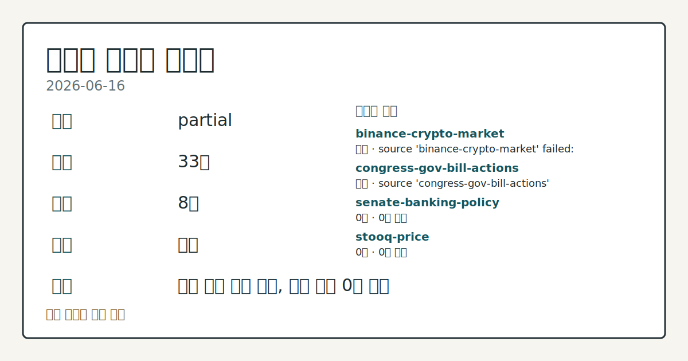
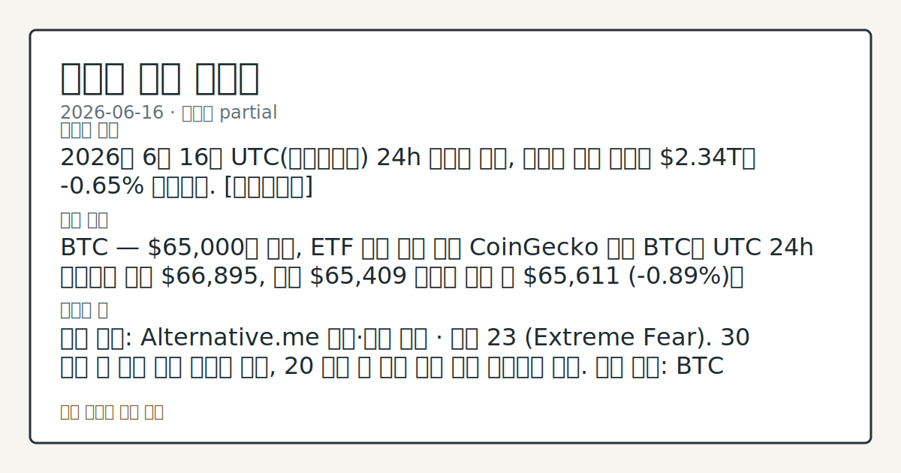
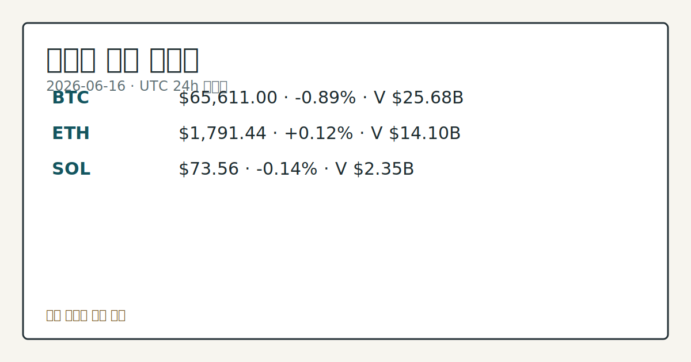

# 2026-06-16 크립토 시황
**기준 시각**: 2026-06-16 UTC · 2026-06-16T00:00Z, 2026-06-17T00:00Z)
| 종목 | 스냅샷(UTC 24h) | 구간 변동 | 비고 |
|------|------|------|------|
| BTC-USD | 65,639.56 | -0.98% | +7.84% from 52w low · -26.02% YTD |
| ETH-USD | 1,792.31 | -0.15% | +14.25% from 52w low · -40.26% YTD |
**세그먼트**: [국내 증시](../../../domestic-equity/2026/06/2026-06-16.md) | [미국 증시](../../../us-equity/2026/06/2026-06-16.md) | [크립토](2026-06-16.md)

*이미지: 데이터 신뢰도 · 출처: investo 자체 생성 · 생성: investo 0.1.0 · 2026-06-17 UTC*
> **내 관심 자산 영향**: 15건 확인 (기본 바스켓) — BTC: [boundary-term] Global crypto market cap **$2,337,875,060,708**; BTC dominance **56.28%**; BTC: [structured-symbol] BTC **$65,611.00** (**-0.89%**); BTC: [alias:Bitcoin] DeFi TVL **$74.8**B; leader Ethereum; BTC: [boundary-term] BTC 미결제약정 **$453,333,680** (OKX, UTC 24h); BTC: [boundary-term] BTC 펀딩비 0.0000982217286796 (OKX, UTC 24h) 외
> **오늘의 결론**: 2026년 6월 16일 UTC(협정세계시) 24h 스냅샷 기준, 크립토 전체 시총은 **$2.34**T로 **-0.65%** 하락했다. [데이터부족]
> **핵심 동인**: BTC — **$65,000**대 유지, ETF 자금 확신 부재 CoinGecko 기준 BTC는 UTC 24h 구간에서 고가 **$66,895**, 저가 **$65,409** 사이를 오간 뒤 **$65,611** (**-0.89%**)에 스냅샷됐다.
> **주의할 점**: 확인 소스: Alternative.me 공포·탐욕 지수 · 현재 23 (Extreme Fear). 30 상회 시 심리 개선 신호를 확인, 20 이탈 시 추가...
> **데이터 상태**: 부분 · 본문 사용 미집계 · 실패 2 · 0건 2

수집/품질 진단

> **데이터 상태**: 부분 — 수집 33건 / 소스 8개 / 누락: 없음 · 부분 — 일부 카테고리 미수집, 본문 일부 결론 보강 필요
> **소스 카운트**: 수집 대상 13 / 성공 9 / 0건 2 / 실패 2 / 본문 사용 미집계
> **소스 등급 분포**: S=2 / B=7
> **상세 사유**: 일부 소스 수집 실패, 일부 소스 0건 반환
> **소스별 상태**: binance-crypto-market 실패 (접근 제한), congress-gov-bill-actions 실패 (설정 미완료(미수집)), senate-banking-policy 0건, stooq-price 0건, 정상 9개

> 정보 제공용 자동 시황이며 가상자산 매매 권유가 아닙니다. 가상자산은 가격 변동성이 매우 큽니다.
## 한눈에 보기
2026년 6월 16일 UTC 24h 스냅샷 기준, 크립토 전체 시총은 **$2.34**T로 **-0.65%** 하락했다. [데이터부족]
BTC — **$65,000**대 유지, ETF 자금 확신 부재 CoinGecko 기준 BTC는 UTC 24h 구간에서 고가 **$66,895**, 저가 **$65,409** 사이를 오간 뒤 **$65,611** (**-0.89%**)에 스냅샷됐다.
확인 소스: Alternative.me 공포·탐욕 지수 · 현재 23 . 30 상회 시 심리 개선 신호를 확인, 20 이탈 시 추가 공포 심화 구간으로 비교. 관심 영향: BTC **$65,000**대 지지력 및 전반 참여도 변동 관찰. 확인 소스: OKX BTC 파생상품 · 펀딩비 현재 0.0000982. 플러스 방향으로 확대 시 롱 과열 신호를 확인, 마이너스 전환 시 숏커버링 압력 흐름을 비교. 관심 영향: 단기 방향성 변동 추세 점검. 확인 소스: 미 재무부
## ⓪ 오늘의 매크로
**FOMC 일정** — 2026-06-17 — FOMC Meeting
**미 국채 수익률** — UST curve 2026-06-16: 10Y 4.43%, 2Y10Y +0.38pp
## ⓪-A 크립토 지표 (UTC 24h 스냅샷)
| 지표 | 값 |
|------|------|
| 공포·탐욕 | 23 (Extreme Fear) |
| BTC 도미넌스 | 56.28% |
| 전체 시총 | $2.34T (-0.65% 24h) |
| BTC 펀딩비 | 0.0000982217286796 (okx) |
| BTC 미결제약정 | $453.3M (okx) |
| DeFi TVL | $74.8B |
| 스테이블코인 공급 | $313.9B |
| 24h 청산 / 거래소 순유출입 | 무료 검증 소스 미확정 |
## ⓪-B 채널 기준선
| 기준선 | 값 |
|------|------|
| 비트코인 | 65,639.56 (-0.98%) |
| 이더리움 | 1,792.31 (-0.15%) |
| BTC 도미넌스 | 56.28% |
| 공포·탐욕 | 23 |
| 펀딩/OI/청산 | 펀딩 0.0000982217286796 · OI 수집됨 |
> **크로스마켓 연결 고리**: 금리 이벤트가 할인율/달러 경로의 공통 변수로 남아 있습니다.
> **오늘의 큰 그림:** 금리와 달러 변수가 국내·미국에 동시에 걸리며, 오늘 독자는 금리·달러 민감도을 먼저 확인해야 합니다.
## ① 요약

*이미지: 시장 스냅샷 · 출처: investo 자체 생성 · 생성: investo 0.1.0 · 2026-06-17 UTC*

2026년 6월 16일 UTC 24h 스냅샷 기준, 크립토 전체 시총은 **$2.34T**로 **-0.65%** 하락했다. BTC(비트코인)는 **$65,611** (**-0.89%**), ETH(이더리움)는 **$1,791.44** (**+0.12%**), SOL(솔라나)은 **$73.56** (**-0.14%**)에 각각 스냅샷됐다. 공포·탐욕 지수는 **23** (Extreme Fear·극도의 공포)으로 6월 12일 이후 같은 구간에 지속 머물고 있으며, Wintermute와 Bitfinex는 BTC 랠리와 HYPE(하이퍼리퀴드 토큰) ATH(사상 최고치) 경신이 시장 전반의 실질적 확신을 반영하지 못한다고 분석했다. BlackRock(블랙록)의 커버드콜 BTC ETF(상장지수펀드) 출시, State Street(스테이트 스트리트)의 스테이블코인용 머니마켓 펀드 론칭 등 기관 인프라 확장은 이어지나, 단기 가격 방향은 혼재 양상이다. [혼재]

## ② 전일 핵심 이슈

### BTC — **$65,000**대 유지, ETF 자금 확신 부재

[CoinGecko](https://www.coingecko.com/en/coins/bitcoin) 기준 BTC는 UTC 24h 구간에서 고가 **$66,895**, 저가 **$65,409** 사이를 오간 뒤 **$65,611** (**-0.89%**)에 스냅샷됐다. 전일(6월 15일) 미·이란 지정학 완화 흐름 속 **$65,000** 재확인에서 하루 만에 일부 반납된 양상이다. Wintermute와 Bitfinex 애널리스트들은 [The Block 보도](https://www.theblock.co/post/404920/bitcoin-rally-hype-record-run-market-waiting-real-conviction-analysts)에서 "랠리와 HYPE ATH 경신이 시장의 실질 확신 부재를 가리고 있다"며 ETF 자금 유입 두께가 충분하지 않다고 지적했다.

> **그래서 의미는?** BTC가 **$65,000**선을 유지하는 가운데에도 ETF 수급이 뒷받침되지 않으면 단기 반등 연속성은 제한적으로 관찰된다.

### GENIUS Act — 주 규제권·예측 시장 관할 논쟁

초당적 상원의원 그룹이 재무부에 GENIUS Act(지니어스법·스테이블코인 규제 법안) 하에서 주(州) 규제 권한 유지를 촉구했다([The Block](https://www.theblock.co/post/405018/bipartisan-senators-push-treasury-uphold-states-authorities-under-genius-act)). SEC(증권거래위원회) 위원장 폴 앳킨스는 CFTC(상품선물거래위원회) 위원장 마이클 셀리그를 [지지하며](https://www.theblock.co/post/404956/sec-atkins-defends-cftc-selig-questions-agencys-ability-regulate-prediction-markets) 예측 시장 규제 관할 논쟁에 가세했다.

### Binance — EU MiCA 인가 데드라인

[Reuters 인용 The Block](https://www.theblock.co/post/404947/binance-may-forced-halt-services-eu-clients-next-month-reuters)에 따르면, Binance(바이낸스)가 EU(유럽연합) MiCA(미카·가상자산시장규제) 인가를 7월 1일까지 획득하지 못할 경우 EU 고객 서비스를 중단해야 할 수 있다고 보도됐다.

## ③ 섹터/수급 동향

### 기관 인프라 — 스테이블코인·BTC 담보 대출 확장

State Street는 GENIUS Act 준수 머니마켓 펀드 [SSCXX](https://www.theblock.co/post/404941/state-street-launches-genius-compliant-money-market-fund-for-stablecoin-issuers)(Rule 2a-7 정부 펀드)를 출시해 스테이블코인 발행사 준비 자산 수단으로 제공했다. Ledn은 BTC 담보 대출 시장이 유동화를 통한 기관 자본 유입으로 **$1조** 규모에 이를 수 있다고 전망하며, 2025년 자사 대출 실행액을 **$14억**으로 밝혔다([The Block](https://www.theblock.co/post/404885/ledn-says-bitcoin-backed-lending-market-could-reach-1-trillion-as-securitization-attracts-institutional-capital)). Gate CrossEx는 다중 CEX(중앙화 거래소) 환경의 자본 분산 문제를 해결하기 위한 거래소 네이티브 유동성 통합 서비스를 소개했다([The Block](https://www.theblock.co/post/404882/gate-crossex-an-exchange-native-answer-to-the-institutional-capital-fragmentation-problem)).

> **그래서 의미는?** BTC 담보 대출·스테이블코인 준비 자산 등 기관 자금 편의 인프라 확장 흐름이 관찰된다.

### Solana 밈코인 생태계 — Pump.fun 활동 급감

[The Block 보도](https://www.theblock.co/post/404806/pump-fun-activity-craters-80-three-months-solana-fees-lower-traders-rotate-perps)에 따르면, Pump.fun(펌프닷펀) 플랫폼 활동량이 3개월 새 **80%** 급감하며 Solana 온체인 수수료 수입이 줄었다. 트레이더들이 밈코인 스팟 거래에서 퍼프스(영구선물)로 이동하는 경향이 확인됐고, PUMP 토큰은 최근 6개월간 **40%** 하락했다.

### DeFi(탈중앙화금융) — TVL(총예치자산) **$74.8**B, Ethereum 중심 구도

[DeFiLlama](https://defillama.com/) 기준 DeFi TVL은 **$74.8B**로 Ethereum이 **$39.8B**로 선두, BSC(바이낸스스마트체인) **$5.3B**, Solana **$4.9B**, Tron **$4.6B**, Bitcoin **$4.3B** 순이다. Rootstock 임원은 TVL이 약 **$180B**에서 현재 수준으로 감소했다고 언급했다([The Block](https://www.theblock.co/post/404980/bitcoin-defi-demand-concentrated-small-pockets-rootstock-exec-says)).

## ④ 지표·이벤트

### BTC 파생상품 — 미결제약정(오픈인터레스트)·펀딩비 중립 수준

[OKX](https://www.okx.com/trade-swap/btc-usd-swap) 기준 BTC 미결제약정은 **$453.3M**, 펀딩비(롱 포지션 유지 비용)는 **0.0000982** 수준으로 중립에 가깝다. 극단적 방향성 베팅이 집중된 구간은 아닌 것으로 파악된다. 24h 정리 및 거래소 순유출입은 무료 검증 소스 미확정으로 데이터 미수집 상태다.

> **그래서 의미는?** 펀딩비 중립 수준은 파생상품 시장의 과열·과냉 신호가 없음을 시사하며, 관망 흐름을 확인할 수 있다.

### 공포·탐욕 지수 **23** (Extreme Fear) · 스테이블코인 공급 **$313.9**B

[Alternative.me](https://alternative.me/crypto/fear-and-greed-index/) 기준 공포·탐욕 지수는 **23/100** (Extreme Fear)으로 6월 12일 이후 극도 공포 구간이 지속 중이다. 스테이블코인 공급은 **$313.9B**로 집계됐으며, 잠재적 재접근 여력을 가늠하는 참고 지표로 관찰된다.

### House Financial Services 마크업(법안 심의) 일정

[하원 금융서비스위원회 일정](http://financialservices.house.gov/calendar/eventsingle.aspx?EventID=411137)에 따라 복수의 법안 마크업이 예정돼 있다. 가상자산 관련 조항 포함 여부를 공식 일정에서 추가 확인할 수 있다.

## ⑤ 주요 종목

<!-- u50 lightweight-charts-embed: placeholders consumed by site_docs/assets/investo-chart-init.js -->

<noscript><em>인터랙티브 차트는 JavaScript가 활성화된 환경에서 표시됩니다. 위 정적 카드가 동일한 정보를 담고 있습니다.</em></noscript>

*이미지: 가격 스냅샷 · 출처: investo 자체 생성 · 생성: investo 0.1.0 · 2026-06-17 UTC*

| 자산 | 스냅샷 가격 | 24h 변동 | 24h 범위 |
|------|-----------|---------|---------|
| BTC | $65,611.00 | **-0.89%** | $65,409 ~ $66,895 |
| ETH | $1,791.44 | **+0.12%** | $1,760.31 ~ $1,832.65 |
| SOL | $73.56 | **-0.14%** | $72.61 ~ $75.36 |

> **그래서 의미는?** BTC·SOL 소폭 하락, ETH 소폭 반등으로 시총 상위 자산 간 혼재된 흐름이 관찰된다.

### 개별 이슈 확인 항목

**BlackRock BITA** — [커버드콜 전략 BTC ETF](https://www.theblock.co/post/404825/blackrock-launches-new-ishares-bitcoin-premium-income-etf-covered-call-nasdaq) 출시. IBIT(블랙록 비트코인 ETF) 보유분 최대 **35%**에 콜옵션을 매도해 인컴을 창출하는 구조다.

**MANTRA** — [Inveniam에 인수](https://www.theblock.co/post/404964/mantra-to-be-acquired-by-inveniam-backer-that-invested-20-million-last-year) 예정. 2025년 토큰 가격 급락 이후 구조조정·감원을 거쳐 인수 단계에 접근했다.

**Coinbase** — [토큰화 미국 주식 출시](https://www.theblock.co/post/404978/coinbase-launching-tokenized-us-stocks-backed-11-holders-receive-dividends)(1:1 백킹, 배당 지급 가능)와 AI 어드바이저·글로벌 유동성 통합 등 [System Update 공개](https://www.theblock.co/post/405012/coinbase-unveils-system-update-unlocking-an-ai-advisor-global-unified-liquidity-options-trading-and-more).

## ⑥ 오늘의 관전 포인트

#### 관찰 신호: 확인 소스: Alternative.me 공포·탐욕 지수…

- 출처: 확인 소스 미상
- 현재: 확인 소스: Alternative.me 공포·탐욕 지수 · 현재 **23** (Extreme Fear). **30** 상회 시 심리 개선 신호를 확인, **20** 이탈 시 추가 공포 심화 구간으로 비교. 관심 영향: BTC **$65,000**대 지지력 및 전반 참여도 변동 관찰.
- 확인 조건: 상방 **30** 상회 시 심리 개선 신호를 확인, **20** 이탈 시 추가 공포 심화 구간으로 비교; 하방 **30** 상회 시 심리 개선 신호를 확인, **20** 이탈 시 추가 공포 심화 구간으로 비교
- 신뢰도: 높음
- 관심 영향: 관심 영향: BTC **$65,000**대 지지력 및 전반 참여도 변동 관찰.

#### 관찰 신호: 확인 소스: OKX BTC 파생상품 · 펀딩비 현재 *…

- 출처: 확인 소스 미상
- 현재: 확인 소스: OKX BTC 파생상품 · 펀딩비 현재 **0.0000982**. 플러스 방향으로 확대 시 롱 과열 신호를 확인, 마이너스 전환 시 숏커버링 압력 흐름을 비교. 관심 영향: 단기 방향성 변동 추세 점검.
- 확인 조건: 상방 상방 데이터 부족; 하방 하방 데이터 부족
- 신뢰도: 보통
- 관심 영향: 관심 영향: 단기 방향성 변동 추세 점검.

#### 관찰 신호: 확인 소스: 미 재무부 금리 데이터 · 10Y UST(…

- 출처: 확인 소스 미상
- 현재: 확인 소스: 미 재무부 금리 데이터 · 10Y UST(미 국채) 현재 **4.43%**. **4.5%** 상회 시 위험자산 배분 비용 상승 압력을 확인, **4.2%** 하향 이탈 시 리스크 온(위험선호) 자산 흐름 변화를 관찰. 관심 영향: 기관 자금 유입 여건 흐름 점검.
- 확인 조건: 상방 **4.5%** 상회 시 위험자산 배분 비용 상승 압력을 확인, **4.2%** 하향 이탈 시 리스크 온(위험선호) 자산 흐름 변화를 관찰; 하방 **4.5%** 상회 시 위험자산 배분 비용 상승 압력을 확인, **4.2%** 하향 이탈 시 리스크 온(위험선호) 자산 흐름 변화를 관찰
- 신뢰도: 높음
- 관심 영향: 관심 영향: 기관 자금 유입 여건 흐름 점검.

#### 관찰 신호: 확인 소스: 하원 금융서비스위원회 일정 · 법안 마크업…

- 출처: 확인 소스 미상
- 현재: 확인 소스: 하원 금융서비스위원회 일정 · 법안 마크업. 가상자산 조항 포함 시 디지털자산 규제 경로 변화를 추적, 미포함 시 현 불확실성 지속 구간을 확인. 관심 영향: GENIUS Act·스테이블코인 법안 진행 일정 체크.
- 확인 조건: 상방 상방 데이터 부족; 하방 하방 데이터 부족
- 신뢰도: 보통
- 관심 영향: 관심 영향: GENIUS Act

#### 관찰 신호: 확인 소스: DeFiLlama TVL · DeFi TV…

- 출처: 확인 소스 미상
- 현재: 확인 소스: DeFiLlama TVL · DeFi TVL 현재 **$74.8B**. **$78B** 상회 시 온체인 유동성 회복 흐름을 비교, **$70B** 이탈 시 DeFi 수급 이탈 추세를 관찰. 관심 영향: Ethereum·Solana 체인별 생태계 수급 흐름 점검.
- 확인 조건: 상방 **$78B** 상회 시 온체인 유동성 회복 흐름을 비교, **$70B** 이탈 시 DeFi 수급 이탈 추세를 관찰; 하방 **$78B** 상회 시 온체인 유동성 회복 흐름을 비교, **$70B** 이탈 시 DeFi 수급 이탈 추세를 관찰
- 신뢰도: 높음
- 관심 영향: 관심 영향: Ethereum
## ⑦ 면책조항
본 시황은 일반 정보 제공을 목적으로 자동 생성된 자료이며,
특정 가상자산에 대한 매매 권유나 투자 자문이 아닙니다.
가상자산은 가상자산이용자보호법(2024-07-19 시행) §10·§19의 적용 대상으로,
24시간 거래되는 비제도권 자산이며 가격 변동성이 매우 크고 원금 전액 손실이 가능합니다.
투자 결정과 그 결과에 대한 책임은 전적으로 본인에게 있으며,
본 시황의 내용에 따라 발생한 손실에 대해 작성자는 일체의 책임을 지지 않습니다.