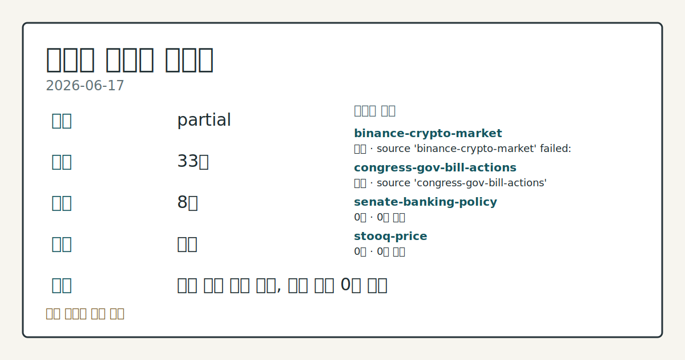
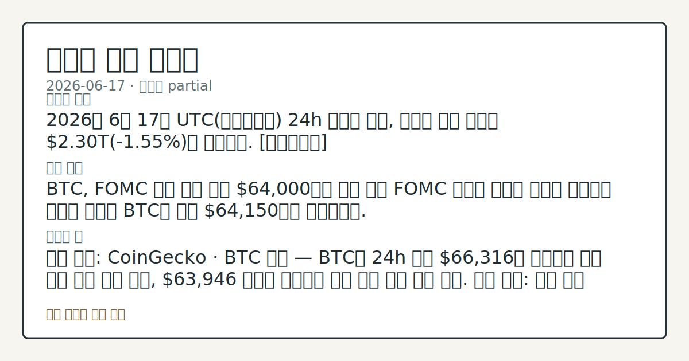
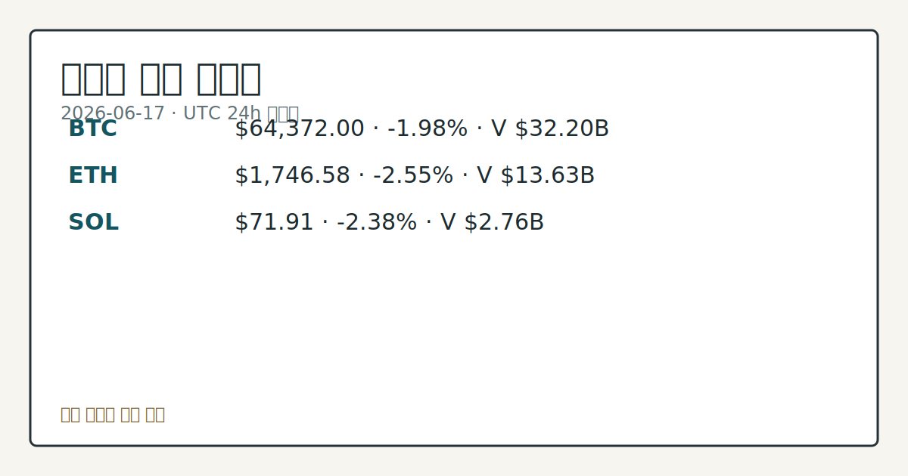

> 정보 제공용 자동 시황이며 가상자산 매매 권유가 아닙니다. 가상자산은 가격 변동성이 매우 큽니다.
# 2026-06-17 크립토 시황
**기준 시각**: 2026-06-17 UTC · 2026-06-17T00:00Z, 2026-06-18T00:00Z)
| 종목 | 스냅샷(UTC 24h) | 구간 변동 | 비고 |
|------|------|------|------|
| BTC-USD | 64,382.36 | -1.86% | +5.77% from 52w low · -27.44% YTD |
| ETH-USD | 1,746.30 | -2.46% | +11.32% from 52w low · -41.80% YTD |
**세그먼트**: [국내 증시](../../../domestic-equity/2026/06/2026-06-17.md) | [미국 증시](../../../us-equity/2026/06/2026-06-17.md) | [크립토](2026-06-17.md)

*이미지: 데이터 신뢰도 · 출처: investo 자체 생성 · 생성: investo 0.1.0 · 2026-06-18 UTC*
> **내 관심 자산 영향**: 13건 확인 (기본 바스켓) — BTC: [boundary-term] Global crypto market cap **$2,299,902,179,299**; BTC dominance **56.09%**; BTC: [structured-symbol] BTC **$64,372.00** (**-1.98%**); BTC: [alias:Bitcoin] DeFi TVL **$73.4**B; leader Ethereum; BTC: [boundary-term] BTC 미결제약정 **$453,328,630** (OKX, UTC 24h); BTC: [boundary-term] BTC 펀딩비 0.0000070162339289 (OKX, UTC 24h) 외
> **용어 가이드**: 이번 시황에서 처음 등장한 용어 — FOMC(연준회의)
> **오늘의 결론**: 2026년 6월 17일 UTC(협정세계시) 24h 스냅샷 기준, 크립토 전체 시총은 **$2.30**T(**-1.55%**)로 감소했다. [데이터부족]
> **핵심 동인**: BTC, FOMC 매파 기조 이후 **$64,000**대로 후퇴 이번 FOMC 매파적 기조는 크립토 위험자산 선호를 낮추며 BTC를 일시 **$64,150**까지 끌어내렸다.
> **주의할 점**: 확인 소스: CoinGecko · BTC 가격 — BTC가 24h 고점 **$66,316**을 상회하면 단기 반등 압력 추세 확인, **$63,946** 저점을...
> **데이터 상태**: 부분 · 본문 사용 미집계 · 실패 2 · 0건 2

수집/품질 진단

> **데이터 상태**: 부분 — 수집 33건 / 소스 8개 / 누락: 없음 · 부분 — 일부 카테고리 미수집, 본문 일부 결론 보강 필요
> **소스 카운트**: 수집 대상 13 / 성공 9 / 0건 2 / 실패 2 / 본문 사용 미집계
> **소스 등급 분포**: S=2 / B=7
> **상세 사유**: 일부 소스 수집 실패, 일부 소스 0건 반환
> **소스별 상태**: binance-crypto-market 실패 (접근 제한), congress-gov-bill-actions 실패 (설정 미완료(미수집)), senate-banking-policy 0건, stooq-price 0건, 정상 9개

**22** (Extreme Fear) — 2026년 6월 12일부터 이어진 극단적 공포 구간이 FOMC 이후에도 유지
BTC **$63,946** 24h 저점 지지 여부와 House Financial Services(하원 금융서비스위원회) 디지털자산 법안 마크업 일정이 주요 관전 변수 — 본문 §⑥ 확인
## 한눈에 보기
2026년 6월 17일 UTC 24h 스냅샷 기준, 크립토 전체 시총은 **$2.30**T(**-1.55%**)로 감소했다. [데이터부족]
BTC, FOMC 매파 기조 이후 **$64,000**대로 후퇴 이번 FOMC 매파적 기조는 크립토 위험자산 선호를 낮추며 BTC를 일시 **$64,150**까지 끌어내렸다.
확인 소스: CoinGecko · BTC 가격 — BTC가 24h 고점 **$66,316**을 상회하면 단기 반등 압력 추세 확인, **$63,946** 저점을 이탈하면 하방 구간 심화 흐름 관찰. 관심 영향: 전체 시총 및 주요 알트코인 동반 방향성 점검. 확인 소스: Alternative.me · 공포·탐욕 지수 현재 22 — 지수가 22 초과로 회복 시 심리 개선 신호 확인, 22 미만으로 추가 하락 시 Extreme Fear 심화 구간 지속 흐름 관찰. 관심 영향: BTC 단기 수급 압력 변화 비교. 확
## ⓪ 오늘의 매크로
**FOMC 일정** — 2026-06-17 — FOMC Meeting
**미 국채 수익률** — UST curve 2026-06-17: 10Y 4.49%, 2Y10Y +0.29pp
## ⓪-A 크립토 지표 (UTC 24h 스냅샷)
| 지표 | 값 |
|------|------|
| 공포·탐욕 | 22 (Extreme Fear) |
| BTC 도미넌스 | 56.09% |
| 전체 시총 | $2.30T (-1.55% 24h) |
| BTC 펀딩비 | 0.0000070162339289 (okx) |
| BTC 미결제약정 | $453.3M (okx) |
| DeFi TVL | $73.4B |
| 스테이블코인 공급 | $314.5B |
| 24h 청산 / 거래소 순유출입 | 무료 검증 소스 미확정 |
## ⓪-B 채널 기준선
| 기준선 | 값 |
|------|------|
| 비트코인 | 64,382.36 (-1.86%) |
| 이더리움 | 1,746.30 (-2.46%) |
| BTC 도미넌스 | 56.09% |
| 공포·탐욕 | 22 |
| 펀딩/OI/청산 | 펀딩 0.0000070162339289 · OI 수집됨 |
> **크로스마켓 연결 고리**: 금리 이벤트가 할인율/달러 경로의 공통 변수로 남아 있습니다.
> **오늘의 큰 그림:** 금리와 달러 변수가 국내·미국·가상자산에 동시에 걸리며, 오늘 독자는 금리·달러 민감도을 먼저 확인해야 합니다.
## ① 요약

*이미지: 시장 스냅샷 · 출처: investo 자체 생성 · 생성: investo 0.1.0 · 2026-06-18 UTC*

2026년 6월 17일 UTC 24h 스냅샷 기준, 크립토 전체 시총은 **$2.30T**(**-1.55%**)로 감소했다. BTC(비트코인)는 **$64,372**(**-1.98%**)로, 직전 이틀간 유지하던 **$65,000**대 지지선에서 하락 이탈했으며, ETH(이더리움) **-2.55%**, SOL(솔라나) **-2.38%** 등 주요 자산이 동반 약세를 보였다. 공포·탐욕 지수는 **22**(Extreme Fear)로 극단적 공포 구간이 이어지고 있으며, BTC 도미넌스(시총 비중)는 **56.09%**로 알트코인 대비 상대적 안정을 유지 중이다. [하락 관찰]

## ② 전일 핵심 이슈

### BTC, FOMC 매파 기조 이후 **$64,000**대로 후퇴

이번 FOMC 매파적 기조는 크립토 위험자산 선호를 낮추며 [BTC를 일시 **$64,150**까지 끌어내렸다](https://www.theblock.co/post/405152/crypto-markets-wobble-hawkish-fed-outlook-kevin-warsh-first-fomc-meeting). UTC 24h 구간 BTC는 고점 **$66,316**에서 저점 **$63,946** 사이를 등락했으며, 직전 이틀간 **$65,000**대를 유지하던 흐름에서 하락 이탈이 관찰되었다.

> **그래서 의미는?** FOMC 이후 BTC의 단기 지지 구간이 **$65,000**에서 **$64,000**대로 낮아진 수급 전환 흐름을 점검합니다.

### 일리노이주 디지털자산세법 서명 — 미국 주(州) 차원 **0.2%** 크립토 과세

[일리노이(Illinois) 주지사 Pritzker가 디지털자산세법(Digital Asset Tax Act)에 서명했다](https://www.theblock.co/post/405146/one-most-anti-crypto-laws-in-us-illinois-gov-pritzker-signs-0-2-crypto-tax). 크립토 업계는 "미국 내 가장 반(反)크립토 법률 중 하나"로 평가하며 반발하고 있다.

### 미 상·하원, 주택법안에 CBDC(중앙은행디지털화폐) 금지 조항 합의

[미국 상원과 하원 지도부가 2030년까지 CBDC를 금지하는 조항이 포함된 주택법안 수정안에 합의했다](https://www.theblock.co/post/405037/housing-bill-cbdc-ban-agreement). CBDC 발행 논의를 당분간 제한하는 방향이 입법 구도상 확인되었다.

### World Liberty Financial, OCC(통화감독청) 연방 신탁 인가 근접

[Trump 전 대통령 지지 기업 World Liberty Financial이 OCC로부터 연방 신탁 은행 인가 획득에 근접했다는 보도가 나왔다](https://www.theblock.co/post/405022/world-liberty-financial-nears-occ-approval). 인가 시 단일 연방 규제기관 하에서 USD1 스테이블코인(stablecoin, 법정화폐 연동 가상자산)을 발행·상환할 수 있게 되는 구조다.

## ③ 섹터/수급 동향

### DeFi TVL(탈중앙화금융 총예치자산) **$73.4**B — Ethereum 절반 이상 점유

[DeFi TVL은 **$73.4B**이며](https://defillama.com/), Ethereum이 **$39.0B**으로 1위를 유지 중이다. BSC(바이낸스스마트체인) **$5.2B**, Solana **$4.9B**, Tron **$4.6B**, Bitcoin **$4.2B** 순이다.

> **그래서 의미는?** Ethereum이 DeFi 자금의 절반 이상을 점유하며 생태계 주도권을 유지 중임을 확인합니다.

### 스테이블코인 공급 **$314.5**B — USDT·USDC 양강 구도

[전체 스테이블코인 공급은 **$314.5B**이며](https://defillama.com/), USDT(테더) **$186.4B**, USDC **$74.8B**, USDS **$8.2B**, USD1 **$4.6B**, USDe **$4.5B** 순이다. World Liberty Financial의 USD1이 공급량 기준 상위 4위에 위치해 있음이 확인된다.

### Trace Finance, **$32**M 시리즈 A 조달

[스테이블코인 인프라 기업 Trace Finance가 CoinFund 주도로 **$32 million** 시리즈 A 투자를 완료했다](https://www.theblock.co/post/405104/trace-finance-funding-valuation-stablecoins-crypto). Coinbase Ventures, Haun Ventures, Jump Capital, Paxos, Chainlink Labs 등이 참여했으며, 시드(seed, 초기 투자) 라운드 대비 밸류에이션이 10배 성장했다고 밝혔다.

## ④ 지표·이벤트

### BTC 파생상품 지표 — 펀딩비 중립, 미결제약정 **$453.3**M

[OKX(오케이엑스) 기준 BTC 펀딩비(funding rate, 선물 포지션 보유 비용)는 0.0000070162339289이며, BTC 미결제약정(open interest, 미정리 선물 계약 잔액)은 **$453.3M**이다](https://www.okx.com/trade-swap/btc-usd-swap). 24h 정리 및 거래소 순유출입 데이터는 무료 검증 소스 미확정으로 데이터 미수집이다.

> **그래서 의미는?** 펀딩비 중립 수준을 유지하는 가운데 가격 하락이 나타나, 파생상품 포지션 추세를 병행 확인하는 구간입니다.

### 공포·탐욕 지수 22 — Extreme Fear 구간 지속

[Alternative.me의 크립토 공포·탐욕 지수는 **22**/100 (Extreme Fear)를 기록했다](https://alternative.me/crypto/fear-and-greed-index/). 2026년 6월 12일부터 이어진 Extreme Fear 구간이 FOMC 이후에도 유지되고 있다.

### UST(미국국채) 수익률 곡선 — 10Y **4.49%**

[2026년 6월 17일 기준 UST 수익률 곡선: 3M **3.83%**, 2Y **4.20%**, 10Y **4.49%**, 30Y **4.93%**, 2Y10Y 스프레드(금리 차이) **+0.29pp**, 3M10Y 스프레드 **+0.66pp**](https://home.treasury.gov/resource-center/data-chart-center/interest-rates). 10Y **4.49%** 수준이 위험자산 크립토 수요에 영향을 미치는 매크로 배경으로 작용 중이다.

## ⑤ 주요 종목

<!-- u50 lightweight-charts-embed: placeholders consumed by site_docs/assets/investo-chart-init.js -->

<noscript><em>인터랙티브 차트는 JavaScript가 활성화된 환경에서 표시됩니다. 위 정적 카드가 동일한 정보를 담고 있습니다.</em></noscript>

*이미지: 가격 스냅샷 · 출처: investo 자체 생성 · 생성: investo 0.1.0 · 2026-06-18 UTC*

### 가격 변동 확인 항목

| 자산 | UTC 24h 가격 | 24h 변동 | 24h 고점 | 24h 저점 | 24h 거래량 |
|------|-------------|---------|---------|---------|-----------|
| [BTC](https://www.coingecko.com/en/coins/bitcoin) | $64,372.00 | -1.98% | $66,316.00 | $63,946.00 | $32,202,258,571 |
| [ETH](https://www.coingecko.com/en/coins/ethereum) | $1,746.58 | -2.55% | $1,804.06 | $1,728.68 | $13,629,846,663 |
| [SOL](https://www.coingecko.com/en/coins/solana) | $71.91 | -2.38% | $74.25 | $71.01 | $2,756,191,881 |

> **그래서 의미는?** BTC, ETH, SOL 모두 **-2%** 내외 하락으로 주요 크립토 자산 전반에서 동반 약세를 확인합니다.

### 체크리스트 항목

[Strategy의 STRC 우선주(preferred stock)가 액면가 대비 **11%** 낮은 **$89**에 마감했다](https://www.theblock.co/post/405160/strategys-strc-preferred-stock-closes-day-89). 2025년 발행 이후 최저 수준으로 확인된다.

[부탄(Bhutan) 정부 연계 지갑이 **533 BTC**(**$34.5 million**)를 Binance(바이낸스)로 전송했다고 Arkham(아캄) 데이터가 보여준다](https://www.theblock.co/post/405111/bhutan-bitcoin-binance-holdings-fall-below-1750-btc-arkham). 전송 후 잔존 보유량은 **1,749.96 BTC**로 감소했다.

## ⑥ 오늘의 관전 포인트

#### 관찰 신호: BTC 가격

- 출처: 확인 소스 미상
- 현재: 확인 소스: CoinGecko · BTC 가격 — BTC가 24h 고점 **$66,316**을 상회하면 단기 반등 압력 추세 확인, **$63,946** 저점을 이탈하면 하방 구간 심화 흐름 관찰. 관심 영향: 전체 시총 및 주요 알트코인 동반 방향성 점검.
- 확인 조건: 상방 BTC 가격; 하방 BTC 가격
- 신뢰도: 높음
- 관심 영향: 관심 영향: 전체 시총 및 주요 알트코인 동반 방향성 점검.

#### 관찰 신호: 확인 소스: Alternative.me · 공포·탐욕…

- 출처: 확인 소스 미상
- 현재: 확인 소스: Alternative.me · 공포·탐욕 지수 현재 **22** — 지수가 **22** 초과로 회복 시 심리 개선 신호 확인, **22** 미만으로 추가 하락 시 Extreme Fear 심화 구간 지속 흐름 관찰. 관심 영향: BTC 단기 수급 압력 변화 비교.
- 확인 조건: 상방 탐욕 지수; 하방 하방 데이터 부족
- 신뢰도: 보통
- 관심 영향: 관심 영향: BTC 단기 수급 압력 변화 비교.

#### 관찰 신호: 마크업 일정

- 출처: 확인 소스 미상
- 현재: 확인 소스: House Financial Services Committee · 마크업 일정 — 디지털자산 관련 법안 마크업(markup, 위원회 심의) 진행 시 규제 완화 방향 신호 확인, 지연 또는 수정 시 불확실성 유지 흐름 관찰. 관심 영향: 미국 크립토 정책 환경 변화 추세 살피기.
- 확인 조건: 상방 상방 데이터 부족; 하방 하방 데이터 부족
- 신뢰도: 보통
- 관심 영향: 관심 영향: 미국 크립토 정책 환경 변화 추세 살피기.

#### 관찰 신호: 확인 소스: U.S. Treasury · 10Y 국채…

- 출처: 확인 소스 미상
- 현재: 확인 소스: U.S. Treasury · 10Y 국채 금리 현재 **4.49%** — 금리 추가 상승 시 위험자산 크립토 수요 압력 확대 여부 관찰, **4.20%**(2Y 현 수준) 방향으로 하락 시 긴장 완화 신호 흐름 점검. 관심 영향: BTC 매크로 배경 변화 비교.
- 확인 조건: 상방 상방 데이터 부족; 하방 하방 데이터 부족
- 신뢰도: 높음
- 관심 영향: 관심 영향: BTC 매크로 배경 변화 비교.

#### 관찰 신호: BTC 미결제약정

- 출처: 확인 소스 미상
- 현재: 확인 소스: OKX · BTC 미결제약정 현재 **$453.3M** — 미결제약정이 현 수준 대비 확대되면 신규 포지션 유입 신호 확인, 감소 시 포지션 정리 흐름 관찰. 관심 영향: 단기 파생상품 수급 변동 추세 살피기.
- 확인 조건: 상방 상방 데이터 부족; 하방 하방 데이터 부족
- 신뢰도: 높음
- 관심 영향: 관심 영향: 단기 파생상품 수급 변동 추세 살피기.
## ⑦ 면책조항
본 시황은 일반 정보 제공을 목적으로 자동 생성된 자료이며,
특정 가상자산에 대한 매매 권유나 투자 자문이 아닙니다.
가상자산은 가상자산이용자보호법(2024-07-19 시행) §10·§19의 적용 대상으로,
24시간 거래되는 비제도권 자산이며 가격 변동성이 매우 크고 원금 전액 손실이 가능합니다.
투자 결정과 그 결과에 대한 책임은 전적으로 본인에게 있으며,
본 시황의 내용에 따라 발생한 손실에 대해 작성자는 일체의 책임을 지지 않습니다.