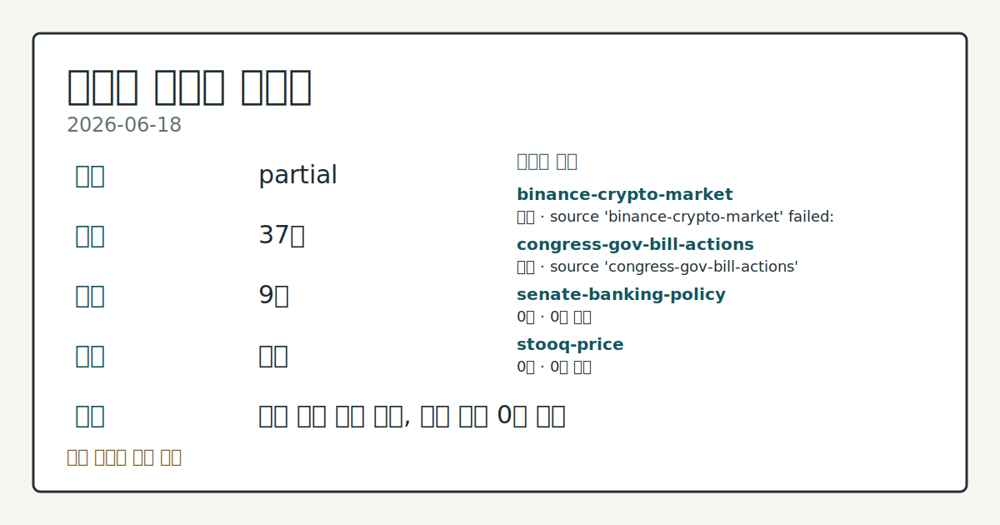
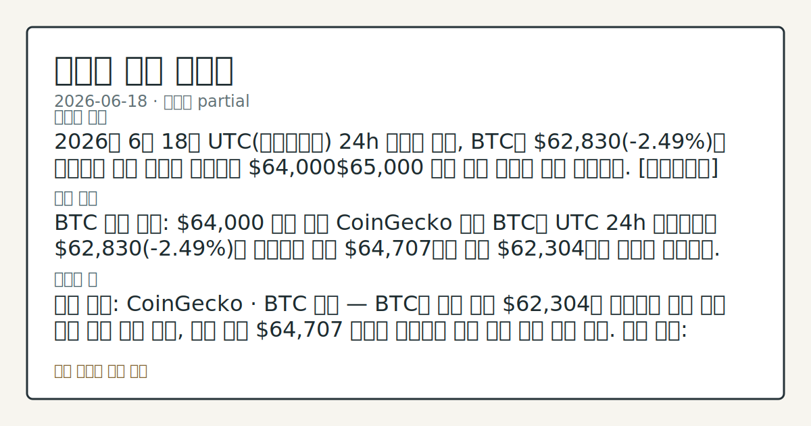
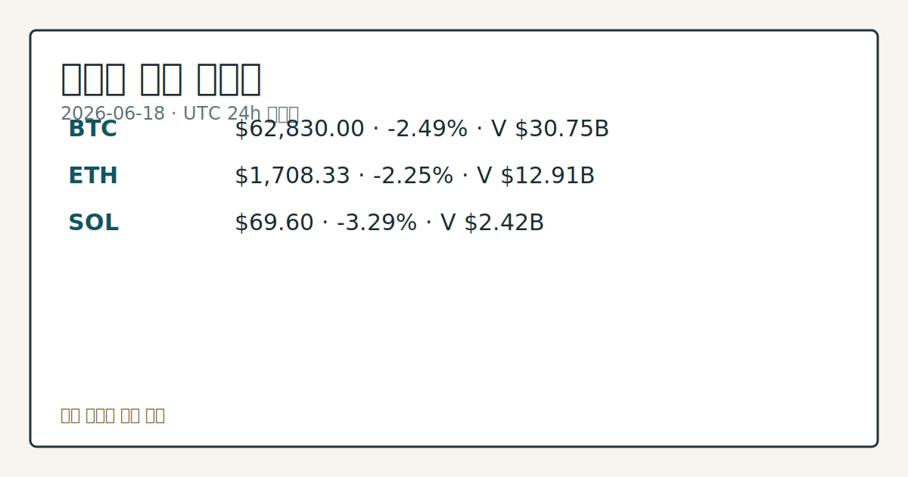

# 2026-06-18 크립토 시황
**기준 시각**: 2026-06-18 UTC · 2026-06-18T00:00Z, 2026-06-19T00:00Z)
| 종목 | 스냅샷(UTC 24h) | 구간 변동 | 비고 |
|------|------|------|------|
| BTC-USD | 62,868.77 | -2.41% | +3.29% from 52w low · -29.15% YTD |
| ETH-USD | 1,708.73 | -2.24% | +8.92% from 52w low · -43.05% YTD |
**세그먼트**: [국내 증시](../../../domestic-equity/2026/06/2026-06-18.md) | [미국 증시](../../../us-equity/2026/06/2026-06-18.md) | [크립토](2026-06-18.md)

*이미지: 데이터 신뢰도 · 출처: investo 자체 생성 · 생성: investo 0.1.0 · 2026-06-19 UTC*
> **내 관심 자산 영향**: 20건 확인 (기본 바스켓) — BTC: [alias:Bitcoin] CFTC Bitcoin CME leveraged_money net -5995 contracts; BTC: [boundary-term] Global crypto market cap **$2,254,111,279,922**; BTC dominance **55.90%**; BTC: [structured-symbol] BTC **$62,830.00** (**-2.49%**); BTC: [boundary-term] BTC 미결제약정 **$467,665,770** (OKX, UTC 24h); BTC: [boundary-term] BTC 펀딩비 0.0000440619335888 (OKX, UTC 24h) 외
> **오늘의 결론**: 2026년 6월 18일 UTC(협정세계시) 24h 스냅샷 기준, BTC는 **$62,830**(**-2.49%**)에 거래되며 직전 사흘간 유지했던 **$64,000****$65,000** 지지 구간 아래로 추가 이탈했다. [데이터부족]
> **핵심 동인**: BTC 추가 하락: **$64,000** 지지 붕괴 CoinGecko 기준 BTC는 UTC 24h 스냅샷에서 **$62,830**(**-2.49%**)을 기록하며 고점 **$64,707**에서 저점 **$62,304**까지 구간을 형성했다.
> **주의할 점**: 확인 소스: CoinGecko · BTC 가격 — BTC가 당일 저점 $62,304를 하회하면 추가 하방 추세 심화 여부 관찰, 당일 고점 $64
> **데이터 상태**: 부분 · 본문 사용 미집계 · 실패 2 · 0건 2

수집/품질 진단

> **데이터 상태**: 부분 — 수집 37건 / 소스 9개 / 누락: 없음 · 부분 — 일부 카테고리 미수집, 본문 일부 결론 보강 필요
> **소스 카운트**: 수집 대상 14 / 성공 10 / 0건 2 / 실패 2 / 본문 사용 미집계
> **소스 등급 분포**: S=3 / A=2 / B=5
> **상세 사유**: 일부 소스 수집 실패, 일부 소스 0건 반환
> **소스별 상태**: binance-crypto-market 실패 (접근 제한), congress-gov-bill-actions 실패 (설정 미완료(미수집)), senate-banking-policy 0건, stooq-price 0건, 정상 10개

> 정보 제공용 자동 시황이며 가상자산 매매 권유가 아닙니다. 가상자산은 가격 변동성이 매우 큽니다.
## 한눈에 보기
BTC **-2.49%** 하락해 **$62,830**에 거래되며 전체 암호화폐 시총 **-2.05%** 감소, **$2.25**T(조 달러) 기록.
CFTC(상품선물거래위원회) Bitcoin CME 레버리지드머니 순포지션 **-5,995**계약(**-30.3%** of OI) — 선물 시장 매도 우위가 주간 단위로 지속 확인됨.
BTC ETF(상장지수펀드) **$82.2M** 순유출과 JPMorgan 채굴 원가 추정 **$78,000** 경고가 단기 하방 압력 요인으로 부상 — 본문 §② 참조.
## ⓪ 오늘의 매크로
**FOMC 일정** — 2026-07-08 — FOMC Minutes
**미 국채 수익률** — UST curve 2026-06-18: 10Y 4.46%, 2Y10Y +0.27pp
## ⓪-A 크립토 지표 (UTC 24h 스냅샷)
| 지표 | 값 |
|------|------|
| 공포·탐욕 | 15 (Extreme Fear) |
| BTC 도미넌스 | 55.90% |
| 전체 시총 | $2.25T (-2.05% 24h) |
| BTC 펀딩비 | 0.0000440619335888 (okx) |
| BTC 미결제약정 | $467.7M (okx) |
| DeFi TVL | $72.5B |
| 스테이블코인 공급 | $314.1B |
| 24h 청산 / 거래소 순유출입 | 무료 검증 소스 미확정 |
## ⓪-B 채널 기준선
| 기준선 | 값 |
|------|------|
| 비트코인 | 62,868.77 (-2.41%) |
| 이더리움 | 1,708.73 (-2.24%) |
| BTC 도미넌스 | 55.90% |
| 공포·탐욕 | 15 |
| 펀딩/OI/청산 | 펀딩 0.0000440619335888 · OI 수집됨 |
| CFTC 코인 포지셔닝 | Bitcoin CME 순포지션 -5995계약 (-30.31% OI), 2026-06-09 기준/2026-06-12 공개 · Ether CME 순포지션 -4651계약 (-18.50% OI), 2026-06-09 기준/2026-06-12 공개 · 주간 지연 |
> **크로스마켓 연결 고리**: 금리 이벤트가 할인율/달러 경로의 공통 변수로 남아 있습니다.
> **오늘의 큰 그림:** 금리와 달러 변수가 국내·미국에 동시에 걸리며, 오늘 독자는 금리·달러 민감도을 먼저 확인해야 합니다.
## ① 요약

*이미지: 시장 스냅샷 · 출처: investo 자체 생성 · 생성: investo 0.1.0 · 2026-06-19 UTC*

2026년 6월 18일 UTC 24h 스냅샷 기준, BTC는 **$62,830**(**-2.49%**)에 거래되며 직전 사흘간 유지했던 **$64,000**~**$65,000** 지지 구간 아래로 추가 이탈했다. ETH는 **$1,708.33**(**-2.25%**), SOL은 **$69.60**(**-3.29%**)로 알트코인도 동반 하락했으며, 전체 시총은 **-2.05%** 감소해 **$2.25**T를 기록했다. CFTC Bitcoin CME 레버리지드머니 순포지션은 **-5,995**계약으로 매도 우위가 지속됐고, 공포·탐욕 지수(Fear & Greed Index)는 **15**(Extreme Fear)를 유지했다. 온체인(블록체인 위 직접 기록) 유동성 지표는 일부 회복 조짐이 관찰됐으나 ETF 순유출과 채굴 원가 부담이 단기 하방 압력으로 작용하는 구간이다. [하락 관찰]

## ② 전일 핵심 이슈

### BTC 추가 하락: **$64,000** 지지 붕괴

[CoinGecko](https://www.coingecko.com/en/coins/bitcoin) 기준 BTC는 UTC 24h 스냅샷에서 **$62,830**(**-2.49%**)을 기록하며 고점 **$64,707**에서 저점 **$62,304**까지 구간을 형성했다. 2026-06-17 브리핑에서 확인된 **$64,000**대 후퇴가 이날 **$62,000**대로 심화됐으며, 연준(Federal Reserve) 매파 기조 여파가 지속되는 가운데 BTC ETF에서 **$82.2M** 순유출이 발생했다고 [The Block](https://www.theblock.co/post/405213/bitcoin-slips-below-64000-as-hawkish-fed-overshadows-signs-of-onchain-repair)이 보도했다. Glassnode는 온체인 유동성이 일부 바닥을 형성할 조짐이라고 분석했다.

> **그래서 의미는?** BTC가 수일째 지켜온 **$64,000** 지지선을 하향 이탈해 단기 하락 추세가 심화되는지 추가 확인이 필요한 구간입니다.

### CFTC 레버리지드머니 순매도 우위와 JPMorgan 채굴 원가 경고

[CFTC](https://www.cftc.gov/MarketReports/CommitmentsofTraders/index.htm) COT(미결제약정 보고서) 주간 보고에 따르면 Bitcoin CME 레버리지드머니 롱(매수) **6,153**계약, 숏(매도) **12,148**계약으로 순포지션은 **-5,995**계약(**-30.3%** of OI(미결제약정))이다. Ether CME 역시 레버리지드머니 순포지션 **-4,651**계약으로 양대 자산 모두 선물 시장 매도 우위가 확인됐다. [JPMorgan](https://www.theblock.co/post/405302/jpmorgan-bitcoin-mining-btc-production-cost)은 BTC 채굴 원가(생산원가)를 약 **$78,000**으로 추정하며, 현재 거래 가격 약 **$62,500**이 원가를 하회하는 상황이라고 지적했다.

### CME와 CFTC 간 영구선물(퍼프) 소송

[The Block](https://www.theblock.co/post/405286/cme-sues-cftc-over-perpetual-futures-us-accusing-agency-suddenly-changing-course)에 따르면 CME Group(시카고 상품거래소)이 CFTC를 상대로 미국 내 영구선물(퍼프: 만기 없는 선물계약) 거래 허용 여부를 두고 소송을 제기했다. CME는 CFTC가 "갑작스럽게 방향을 바꿨다"고 주장하며 법원에 제소한 상태로, 미국 크립토 파생상품 감독 체계의 불확실성이 추가될 소지가 있다.

## ③ 섹터/수급 동향

### BTC 파생상품 — OKX 미결제약정과 펀딩비

[OKX](https://www.okx.com/trade-swap/btc-usd-swap) UTC 24h 기준 BTC 미결제약정은 **$467,665,770**, 펀딩비(funding rate: 롱·숏 균형을 맞추기 위해 주기적으로 지급되는 비용)는 **0.0000440619335888**로 소폭 플러스 상태다.

> **그래서 의미는?** 펀딩비가 미세 플러스 수준이라 롱 포지션의 비용 부담이 크지 않지만, CFTC COT 매도 우위와의 방향 괴리를 비교해 관찰할 필요가 있습니다.

### DeFi TVL과 스테이블코인 공급

[DeFiLlama](https://defillama.com/) 기준 DeFi TVL(탈중앙화금융 총 예치자산)은 **$72.5B**로 Ethereum이 **$38.5B**로 선두이며, BSC **$5.1B**, Solana **$4.8B**, Tron **$4.5B**, Base **$4.1B** 순이다. 스테이블코인(가치고정형 디지털자산) 전체 공급은 **$314.1B**로 USDT(테더) **$185.9B**, USDC(써클) **$74.9B**가 대부분을 차지한다.

### BTC 온체인 소액 거래 노출 변화 점검

[The Block](https://www.theblock.co/post/405340/cryptoquant-bitcoin-micro-transactions-btc)에 따르면 CryptoQuant는 BTC 거래 중 0.01 BTC 미만 소액 거래가 일일 전체 거래의 **80%**를 차지한다고 발표했다 (2023년 약 **44%** 대비). 대규모 기관 거래 비중이 상대적으로 줄고 소액 분산 거래가 증가하는 온체인 구조 변화로 관찰됐다.

## ④ 지표·이벤트

### House Financial Services 위원회 마크업(법안 심의) 일정

미국 하원 금융서비스위원회(House Financial Services Committee)는 [복수 법안 심의 일정](http://financialservices.house.gov/calendar/eventsingle.aspx?EventID=411137)을 예고했다. 디지털자산 관련 법안이 포함될 경우 크립토 규제 환경에 영향을 미칠 수 있는 일정이나 현재 수집 가능한 세부 내용은 제한적이다.

> **그래서 의미는?** 현재 수집 근거가 부족해 방향보다 확인 필요 항목으로만 봅니다.

### 전 Celsius CEO CFTC 제재 및 예측 시장 법안

[The Block](https://www.theblock.co/post/405323/cftc-enters-settlement-former-celsius-ceo-imposes-permanent-trading-ban)에 따르면 CFTC는 전 Celsius(셀시우스) CEO 알렉산더 마신스키(Alexander Mashinsky)와 합의를 체결하고 영구 거래 금지 제재를 부과했다. 마신스키는 현재 12년 징역형 복역 중이다. 별도로 [Rep. Bryan Steil](https://www.theblock.co/post/405331/rep-steil-introduces-bill-to-block-lawmakers-from-placing-prediction-markets-bets-on-public-policy-issues)은 의원 및 가족이 공공정책 예측 베팅으로 수익을 얻는 행위를 금지하는 법안을 발의했다.

## ⑤ 주요 종목

<!-- u50 lightweight-charts-embed: placeholders consumed by site_docs/assets/investo-chart-init.js -->

<noscript><em>인터랙티브 차트는 JavaScript가 활성화된 환경에서 표시됩니다. 위 정적 카드가 동일한 정보를 담고 있습니다.</em></noscript>

*이미지: 가격 스냅샷 · 출처: investo 자체 생성 · 생성: investo 0.1.0 · 2026-06-19 UTC*

### 가격 변동 확인 항목

| 자산 | UTC 24h 변동 | 24h 고점 / 저점 | 24h 거래량 |
|------|-------------|----------------|-----------|
| [BTC](https://www.coingecko.com/en/coins/bitcoin) | **-2.49%** (**$62,830**) | $64,707 / $62,304 | $30,745,958,517 |
| [ETH](https://www.coingecko.com/en/coins/ethereum) | **-2.25%** (**$1,708.33**) | $1,760.33 / $1,674.89 | $12,914,566,344 |
| [SOL](https://www.coingecko.com/en/coins/solana) | **-3.29%** (**$69.60**) | $72.54 / $68.37 | $2,424,470,998 |

> **그래서 의미는?** BTC(비트코인), ETH(이더리움), SOL(솔라나) 세 주요 자산이 모두 하락해 특정 자산 이슈가 아닌 시장 전반 하방 압력인지 확인...

### 개별 이슈 체크리스트

- **STRC** (Strategy 우선주): Strategy(스트래티지)의 우선주 STRC가 이틀 연속 **$90** 미만 거래되며 스냅샷 기준 **$88.59**, 저점 **$82.50** 기록. 거래량 급증이 동반됐다고 [The Block](https://www.theblock.co/post/405350/strategys-preferred-stock-strc-continues-trade-under-90-trading-volume-jumps)이 보도했다.
- **HIVE** (채굴업체): [The Block](https://www.theblock.co/post/405234/bitcoin-miner-hive-220-million-ai-gpu-deal-bell-expects-70-million-annual-revenue)에 따르면 HIVE(하이브)가 캐나다 Bell과 **$220M** 규모 AI GPU 클라우드 계약 체결, 연간 **$70M** 매출 전망 및 2027년 초까지 NVIDIA Blackwell GPU **2,304**개 배치 예정.
- **SOL 생태계**: Kraken(크라켄 거래소)이 Solana DEX(탈중앙화거래소) 거래를 핵심 앱에 통합, 추가 네트워크 지원도 예정이라고 [The Block](https://www.theblock.co/post/405242/kraken-integrates-solana-dex-trading-into-core-app-support-additional-networks-planned)이 보도했다.

## ⑥ 오늘의 관전 포인트

#### 관찰 신호: BTC 가격 — BTC

- 출처: CoinGecko
- 현재: 확인 소스: CoinGecko · BTC 가격 — BTC가 당일 저점 **$62,304**를 하회하면 추가 하방 추세 심화 여부 관찰, 당일 고점 **$64,707** 수준을 회복하면 지지 구간 복귀 흐름 점검. 관심 영향: 전체 시총 **$2.25T** 지지 지속 여부 추적.
- 확인 조건: 상방 BTC 가격 — BTC가 당일 저점 **$62,304**를 하회하면 추가 하방 추세 심화 여부 관찰, 당일 고점 **$64,707** 수준을 회복하면 지지 구간 복귀 흐름 점검; 하방 BTC 가격 — BTC가 당일 저점 **$62,304**를 하회하면 추가 하방 추세 심화 여부 관찰, 당일 고점 **$64,707** 수준을 회복하면 지지 구간 복귀 흐름 점검
- 신뢰도: 높음
- 관심 영향: 관심 영향: 전체 시총 **$2.25T** 지지 지속 여부 추적.

#### 관찰 신호: Bitcoin CME 레버리지드머니 포지션 — 순포지션…

- 출처: CFTC COT 주간 보고
- 현재: 확인 소스: CFTC COT 주간 보고 · Bitcoin CME 레버리지드머니 포지션 — 순포지션 **-5,995**계약 수준이 유지되면 선물 매도 우위 지속 확인, 순포지션이 플러스 전환되면 수급 반전 신호 관찰. 관심 영향: BTC 파생상품 수급 방향 점검.
- 확인 조건: 상방 상방 데이터 부족; 하방 하방 데이터 부족
- 신뢰도: 보통
- 관심 영향: 관심 영향: BTC 파생상품 수급 방향 점검.

#### 관찰 신호: 확인 소스: Alternative.me 공포·탐욕 지수…

- 출처: Alternative
- 현재: 확인 소스: Alternative.me 공포·탐욕 지수 — 지수 **15** (Extreme Fear) 구간이 연속 유지되면 극단 공포 지속 확인, 지수가 상방 반전하면 심리 개선 전환 신호 관찰. 관심 영향: 시장 심리 방향 추세 비교.
- 확인 조건: 상방 탐욕 지수 — 지수 **15** (Extreme Fear) 구간이 연속 유지되면 극단 공포 지속 확인, 지수가 상방 반전하면 심리 개선 전환 신호 관찰; 하방 하방 데이터 부족
- 신뢰도: 보통
- 관심 영향: 관심 영향: 시장 심리 방향 추세 비교.

#### 관찰 신호: DeFi TVL 및 스테이블코인 공급 — DeFi TV…

- 출처: DeFiLlama
- 현재: 확인 소스: DeFiLlama · DeFi TVL 및 스테이블코인 공급 — DeFi TVL **$72.5B** 및 스테이블코인 공급 **$314.1B** 수준이 유지되면 온체인 기반 안정 지속 확인, 두 지표 모두 하락하면 유동성 이탈 흐름 점검. 관심 영향: 온체인 유동성 변동 관찰.
- 확인 조건: 상방 상방 데이터 부족; 하방 DeFi TVL 및 스테이블코인 공급 — DeFi TVL **$72.5B** 및 스테이블코인 공급 **$314.1B** 수준이 유지되면 온체인 기반 안정 지속 확인, 두 지표 모두 하락하면 유동성 이탈 흐름 점검
- 신뢰도: 높음
- 관심 영향: 관심 영향: 온체인 유동성 변동 관찰.
## ⑦ 면책조항
본 시황은 일반 정보 제공을 목적으로 자동 생성된 자료이며,
특정 가상자산에 대한 매매 권유나 투자 자문이 아닙니다.
가상자산은 가상자산이용자보호법(2024-07-19 시행) §10·§19의 적용 대상으로,
24시간 거래되는 비제도권 자산이며 가격 변동성이 매우 크고 원금 전액 손실이 가능합니다.
투자 결정과 그 결과에 대한 책임은 전적으로 본인에게 있으며,
본 시황의 내용에 따라 발생한 손실에 대해 작성자는 일체의 책임을 지지 않습니다.