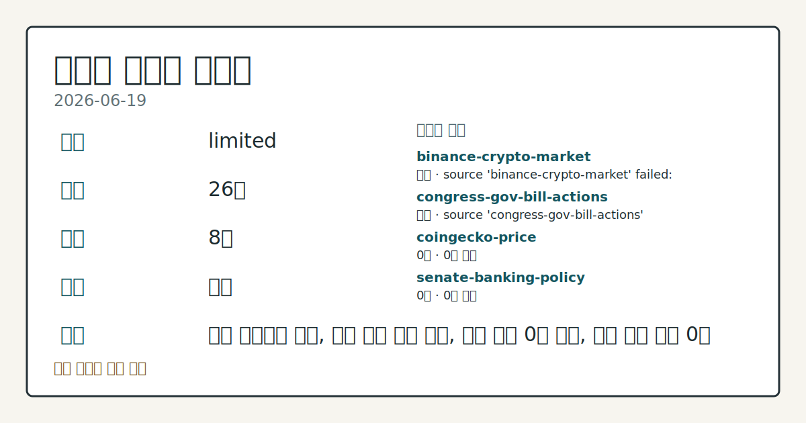
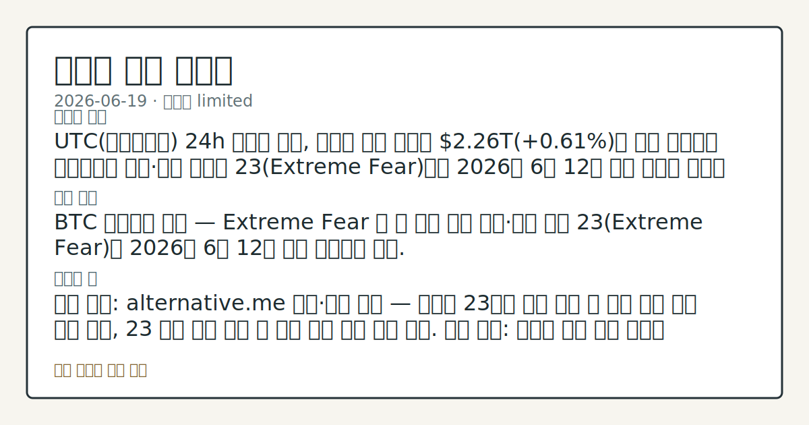

# 2026-06-19 크립토 시황
**기준 시각**: 2026-06-19 UTC · 2026-06-19T00:00Z, 2026-06-20T00:00Z)
| 종목 | 스냅샷(UTC 24h) | 구간 변동 | 비고 |
|------|------|------|------|
| BTC-USD | 63,678.02 | -0.87% | +4.62% from 52w low · -28.24% YTD |
| ETH-USD | 1,712.12 | -1.56% | +9.14% from 52w low · -42.94% YTD |
**세그먼트**: [국내 증시](../../../domestic-equity/2026/06/2026-06-19.md) | [미국 증시](../../../us-equity/2026/06/2026-06-19.md) | [크립토](2026-06-19.md)

*이미지: 데이터 신뢰도 · 출처: investo 자체 생성 · 생성: investo 0.1.0 · 2026-06-22 UTC*
> **내 관심 자산 영향**: 데이터 수집 부족으로 매칭 판단 보류 — 추가 수집 후 재평가됩니다.
> **용어 가이드**: 이번 시황에서 처음 등장한 용어 — 공매도(차입매도)
> **오늘의 결론**: 2026년 6월 19일 UTC(협정세계시) 24h 스냅샷 기준, 크립토 전체 시총은 **$2.27**T로 **-0.89%** 하락했다. [데이터부족]
> **핵심 동인**: BTC 하락 흐름 — **$64,000** 이탈 후 심리 회복 미확인 직전 영업일(2026-06-18) 기준 BTC는 **$64,000** 지지선을 하향 이탈한 흐름이 기록되어 있으며, 6/17 FOMC(연방공개시장위원회) 매파적 기조 이후 **$65,000**대에서 후퇴한 추세가 이어지고 있다.
> **주의할 점**: 확인 소스: Alternative.me 공포·탐욕 지수 · 현재 23(Extreme Fear). 지수가 30 이상으로 회복하면 단기 심리 안정 상방 확인, 20...
> **데이터 상태**: 제한 · 본문 사용 미집계 · 실패 2 · 0건 3

수집/품질 진단

> **데이터 상태**: 제한 — 수집 26건 / 소스 8개 / 누락: 가격 · 제한 — 핵심 가격 소스 0건/실패/stale, 본문 결론 신뢰도 낮음
> **소스 카운트**: 수집 대상 14 / 성공 9 / 0건 3 / 실패 2 / 본문 사용 미집계
> **소스 등급 분포**: S=3 / A=2 / B=4
> **상세 사유**: 가격 카테고리 누락, 일부 소스 수집 실패, 일부 소스 0건 반환, 핵심 가격 소스 0건
> **소스별 상태**: binance-crypto-market 실패 (접근 제한), congress-gov-bill-actions 실패 (설정 미완료(미수집)), coingecko-price 0건, senate-banking-policy 0건, stooq-price 0건, 정상 9개

> 정보 제공용 자동 시황이며 가상자산 매매 권유가 아닙니다. 가상자산은 가격 변동성이 매우 큽니다.
## 한눈에 보기
크립토 전체 시총 **-0.89%** 하락해 **$2.27T** 기록, 공포·탐욕 지수 **23**(Extreme Fear) 구간이 6주 연속 이어짐
CFTC(상품선물거래위원회)) CME(시카고상업거래소) Bitcoin 레버리지드 머니 순포지션 **-5,995** 계약으로 미결제약정(OI) 대비 **-30.3%** 순매도 우위
BTC 펀딩비 음(-)전환 유지 및 미결제약정 **$459.1M** 변동이 단기 방향성 확인 핵심 변수 — 본문 §④ 참조
> **용어 가이드**: CME=시카고상업거래소 · CFTC=상품선물거래위원회 · DeFi TVL=탈중앙화금융 총예치금 · OI=미결제약정 · CoT=트레이더 포지션 보고서 · ETF=상장지수펀드 · EF=이더리움 재단 · GENIUS Act=제니어스법안(스테이블코인 준비자산 규정) · UST=미국채
## ⓪ 오늘의 매크로
**FOMC 일정** — 2026-07-08 — FOMC Minutes
**미 국채 수익률** — UST curve 2026-06-18: 10Y 4.46%, 2Y10Y +0.27pp
## ⓪-A 크립토 지표 (UTC 24h 스냅샷)
| 지표 | 값 |
|------|------|
| 공포·탐욕 | 23 (Extreme Fear) |
| BTC 도미넌스 | 56.22% |
| 전체 시총 | $2.27T (-0.89% 24h) |
| BTC 펀딩비 | -0.0000113038736510 (okx) |
| BTC 미결제약정 | $459.1M (okx) |
| DeFi TVL | $73.1B |
| 스테이블코인 공급 | $314.7B |
| 24h 청산 / 거래소 순유출입 | 무료 검증 소스 미확정 |
## ⓪-B 채널 기준선
| 기준선 | 값 |
|------|------|
| 비트코인 | 63,678.02 (-0.87%) |
| 이더리움 | 1,712.12 (-1.56%) |
| BTC 도미넌스 | 56.22% |
| 공포·탐욕 | 23 |
| 펀딩/OI/청산 | 펀딩 -0.0000113038736510 · OI 수집됨 |
| CFTC 코인 포지셔닝 | Bitcoin CME 순포지션 -5995계약 (-30.31% OI), 2026-06-09 기준/2026-06-12 공개 · Ether CME 순포지션 -4651계약 (-18.50% OI), 2026-06-09 기준/2026-06-12 공개 · 주간 지연 |
> **크로스마켓 연결 고리**: 금리 이벤트가 할인율/달러 경로의 공통 변수로 남아 있습니다.
> **오늘의 큰 그림:** 금리와 달러 변수가 국내·미국에 동시에 걸리며, 오늘 독자는 금리·달러 민감도을 먼저 확인해야 합니다.
## ① 요약

*이미지: 시장 스냅샷 · 출처: investo 자체 생성 · 생성: investo 0.1.0 · 2026-06-22 UTC*

2026년 6월 19일 UTC 24h 스냅샷 기준, 크립토 전체 시총은 **$2.27T**로 **-0.89%** 하락했다. BTC 도미넌스는 **56.22%**를 기록해 알트코인 대비 BTC 상대 강세가 유지되는 가운데, 공포·탐욕 지수가 **23**(Extreme Fear) 구간에 머물며 6/12 이후 직전 5거래일의 하방 심리가 이어지고 있다. CME Bitcoin 레버리지드 머니(투기성 포지션)의 순매도가 **-5,995** 계약에 달하고, OKX(오케이엑스) BTC 펀딩비가 음(-)전환 상태를 유지해 숏(공매도) 포지션 우위가 관찰된다. 한편 Franklin Templeton(프랭클린 템플턴), Morgan Stanley(모건 스탠리), Fidelity(피델리티) 등 전통 금융기관의 크립토 상품 출원·출시가 연이어 확인되며 규제 환경 정비와 기관 접근의 교차 국면이 지속되고 있다. [하락 관찰]

## ② 전일 핵심 이슈

### BTC 하락 흐름 — **$64,000** 이탈 후 심리 회복 미확인

직전 영업일(2026-06-18) 기준 BTC는 **$64,000** 지지선을 하향 이탈한 흐름이 기록되어 있으며, 6/17 FOMC 매파적 기조 이후 **$65,000**대에서 후퇴한 추세가 이어지고 있다. UTC 24h 스냅샷 기준 전체 시총은 **-0.89%** 하락해 **$2.27T**로 집계되었다. BTC 도미넌스 **56.22%**는 알트코인 대비 상대 강세를 시사하나, 공포·탐욕 지수가 **23**에 머물러 심리 회복이 확인되지 않은 상태다. 어제 대비 방향 전환 신호 없이 하락 흐름이 연장되고 있으며, 레버리지 수급(펀딩비 음전환, CFTC 순매도)이 그 배경으로 관찰된다.

> **그래서 의미는?** BTC **$64,000** 이탈 이후 공포 심리가 극단 구간에 머물고 레버리지 매도 우위가 확인되어, 단순 반등보다 하방 추세 지속 가능성을...

### CME vs. CFTC 소송 — 크립토 영구선물 분류 공방

[CME가 CFTC를 상대로 제기한 소송](https://www.theblock.co/post/405446/td-cowen-cme-upper-hand-cftc-lawsuit-crypto-perpetual-futures)에서, TD Cowen은 "CME가 유리한 위치에 있으며 소송 진행 중 예비 금지명령(preliminary injunction)을 신청해 퍼페추얼(영구선물) 상품 출시를 저지할 것"으로 전망했다. 이와 별개로 [CFTC와 SEC(미국증권거래위원회)는 '스왑(교환계약)' 정의 명확화를 위한 공개 의견 수렴을 개시](https://www.theblock.co/post/405380/cftc-sec-public-comment-swaps)했다. 이 소송의 핵심은 크립토 영구선물을 '선물(futures)'로 볼지 '스왑'으로 볼지의 관할권 분쟁이며, 결과에 따라 미국 내 크립토 파생상품 시장 구조가 달라질 수 있는 항목으로 관찰된다.

## ③ 섹터/수급 동향

### DeFi TVL — Ethereum 압도적 1위, **$73.1**B

[DeFi TVL](https://defillama.com/)은 UTC 24h 기준 **$73.1B**로 집계되었다. 체인별 TVL은 Ethereum **$38.8B**으로 1위를 유지하고 있으며, 이어 BSC **$5.1B**, Solana **$4.9B**, Tron **$4.6B**, Bitcoin **$4.2B** 순이다.

> **그래서 의미는?** Ethereum이 DeFi TVL의 과반을 점유해 플랫폼 우위를 확인할 수 있으나, ETH 핵심 개발 자금 위기 경고(§⑤)와 연계해 생태계...

### 스테이블코인 공급 — **$314.7**B, USDT 절대 우위

[스테이블코인(가치안정코인) 총 공급](https://defillama.com/)은 **$314.7B**이다. USDT(테더) **$186.4B**, USDC(USD코인) **$74.9B**, USDS **$8.2B**, USD1 **$4.8B**, DAI **$4.5B** 순으로 집계되었다. Fidelity의 GENIUS Act 준거 머니마켓 펀드 출시(§⑤)와 맞물려 기관 주도 스테이블코인 수요 확대 추세가 병행 관찰된다.

### 24h 정리 / 거래소 순유출입

무료 검증 소스 미확정으로 데이터 미수집 상태다.

## ④ 지표·이벤트

### 공포·탐욕 지수 — Extreme Fear 23, 6주 이상 지속

[Alternative.me 공포·탐욕 지수](https://alternative.me/crypto/fear-and-greed-index/)는 UTC 24h 기준 **23**(Extreme Fear)을 기록했다. 6/12 이후 최근 컨텍스트 전반에서 Extreme Fear 구간이 연속적으로 관찰된다.

> **그래서 의미는?** 공포·탐욕 지수 **23**은 시장 참여자의 심리가 과도한 공포 구간에 머물고 있음을 나타내며, 반등 시 저항 부재 여부를 추가 관찰할 필요가...

### UST 금리 곡선 — 10Y **4.46%**, 정상화 유지

[미국 재무부 데이터](https://home.treasury.gov/resource-center/data-chart-center/interest-rates) 기준 2026-06-18 UST(미국채) 금리: 3M **3.83%**, 2Y **4.19%**, 10Y **4.46%**, 30Y **4.90%**. 2Y10Y 스프레드(장단기 금리차) **+0.27pp**, 3M10Y 스프레드 **+0.63pp**로 정상화(우상향) 곡선이 유지되고 있다. 10Y **4.46%** 금리 수준은 위험자산 전반의 할인율 부담 요인으로 작용하는 배경 변수다.

### OKX BTC 파생상품 — 펀딩비 음전환, 미결제약정 **$459.1**M

[OKX BTC 영구선물](https://www.okx.com/trade-swap/btc-usd-swap) 기준 BTC 펀딩비는 **-0.0000113038736510**으로 음(-)전환 상태다. BTC 미결제약정(OI)은 **$459.1M**(UTC 24h)으로 집계되었다. 펀딩비 음전환은 숏커버링(공매도상환) 이전 숏 포지션 우위를 나타내는 관찰 지표로 해석된다.

### CFTC CoT 보고서 — 레버리지드 머니 Bitcoin 순매도 -5,995 계약

[CFTC CoT(Commitments of Traders, 트레이더 포지션 보고서)](https://www.cftc.gov/MarketReports/CommitmentsofTraders/index.htm) 기준, CME Bitcoin 레버리지드 머니 포지션: 롱(매수) **6,153** 계약, 숏(매도) **12,148** 계약, 순포지션 **-5,995** 계약(미결제약정 대비 **-30.3%**). 주간 보고서 기준으로 장중 실시간 흐름과는 별개다.

## ⑤ 주요 종목

<!-- u50 lightweight-charts-embed: placeholders consumed by site_docs/assets/investo-chart-init.js -->

<noscript><em>인터랙티브 차트는 JavaScript가 활성화된 환경에서 표시됩니다. 위 정적 카드가 동일한 정보를 담고 있습니다.</em></noscript>

> **그래서 의미는?** ETH(이더리움) 생태계 자금 우려와 동시에 Franklin Templeton, Morgan Stanley, Fidelity 등 전통...

### 관찰 분류: 기관 크립토 상품 출원·출시

- **Franklin Templeton** — [주식 배당금을 BTC에 재투자하는 구조의 ETF 2종 출원](https://www.theblock.co/post/405402/franklin-templeton-files-for-etfs-that-reinvest-stock-dividends-into-bitcoin). 예상 발효일 2026년 9월 1일 이른 시일 가능성 포함.
- **Morgan Stanley** — [ETH, SOL(솔라나) ETF 수정 출원 공시](https://www.theblock.co/post/405362/morgan-stanley-eth-sol-etf-amendments), 시장 최저 수수료 공개 포함. SEC와의 적극적 소통 신호로 관찰됨.
- **Fidelity** — [GENIUS Act 준거 스테이블코인 발행사 대상 머니마켓 펀드 출시](https://www.theblock.co/post/405357/fidelity-stablecoin-money-market-fund). 적격 준비자산만 운용하는 구조.

### 관찰 분류: 생태계 리스크 항목

- **ETH** — [전 EF 기여자 VanEpps, "CIP(커뮤니티 이니셔티브 프로그램) 만료 후 3~9개월 내 핵심 개발 자금 위기 가능성" 경고](https://www.theblock.co/post/405404/ethereum-could-face-core-development-funding-crisis-within-nine-months-says-former-ef-contributor).
- **STRC / SATA** — [레버리지 정리 압박으로 **$100** 페그(연동) 가치에서 급락 후 부분 회복](https://www.theblock.co/post/405406/strive-ceo-strc-sata). Strive CEO는 "디지털 크레딧 역사상 가장 어려운 날"로 표현.

### 확인 항목: 업그레이드 일정

- **Base** — [Beryl 업그레이드 및 B20 네이티브 토큰 표준 2026년 6월 25일 메인넷 예정](https://www.theblock.co/post/405410/base-targets-june-25-mainnet-launch-for-beryl-upgrade-and-new-b20-token-standard). 출금 지연 시간 5일로 단축 포함.

## ⑥ 오늘의 관전 포인트

#### 관찰 신호: 확인 소스: Alternative.me 공포·탐욕 지수…

- 출처: 확인 소스 미상
- 현재: 확인 소스: Alternative.me 공포·탐욕 지수 · 현재 **23**(Extreme Fear). 지수가 30 이상으로 회복하면 단기 심리 안정 상방 확인, **20** 이하로 하락하면 공포 심화 하방 관찰. 관심 영향: 전체 시총 방향성 및 BTC 도미넌스 변동 흐름 점검.
- 확인 조건: 상방 지수가 30 이상으로 회복하면 단기 심리 안정 상방 확인, **20** 이하로 하락하면 공포 심화 하방 관찰; 하방 지수가 30 이상으로 회복하면 단기 심리 안정 상방 확인, **20** 이하로 하락하면 공포 심화 하방 관찰
- 신뢰도: 보통
- 관심 영향: 관심 영향: 전체 시총 방향성 및 BTC 도미넌스 변동 흐름 점검.

#### 관찰 신호: 확인 소스: OKX BTC 영구선물 펀딩비 · 현재 *…

- 출처: 확인 소스 미상
- 현재: 확인 소스: OKX BTC 영구선물 펀딩비 · 현재 **-0.0000113038736510**. 펀딩비가 음에서 양으로 전환하면 숏커버링 가능성 상방 추세 확인, 음(-)폭이 확대되면 롱 투항 압력 지속 하방 관찰. 관심 영향: 미결제약정 **$459.1M** 수준과 연계해 파생 수급 흐름 비교.
- 확인 조건: 상방 펀딩비가 음에서 양으로 전환하면 숏커버링 가능성 상방 추세 확인, 음(-)폭이 확대되면 롱 투항 압력 지속 하방 관찰; 하방 펀딩비가 음에서 양으로 전환하면 숏커버링 가능성 상방 추세 확인, 음(-)폭이 확대되면 롱 투항 압력 지속 하방 관찰
- 신뢰도: 높음
- 관심 영향: 관심 영향: 미결제약정 **$459.1M** 수준과 연계해 파생 수급 흐름 비교.

#### 관찰 신호: 확인 소스: CFTC CoT 보고서 CME Bitcoi…

- 출처: 확인 소스 미상
- 현재: 확인 소스: CFTC CoT 보고서 CME Bitcoin 레버리지드 머니 · 현재 순포지션 **-5,995** 계약. 다음 주간 보고서에서 순매수 전환이 확인되면 기관 투기 자금 복귀 상방 데이터 확인, 순매도 폭 확대 시 기관 심리 악화 하방 관찰. 관심 영향: BTC 방향성에 대한 투기성 자금 태도 변동 추이 확인.
- 확인 조건: 상방 다음 주간 보고서에서 순매수 전환이 확인되면 기관 투기 자금 복귀 상방 데이터 확인, 순매도 폭 확대 시 기관 심리 악화 하방 관찰; 하방 다음 주간 보고서에서 순매수 전환이 확인되면 기관 투기 자금 복귀 상방 데이터 확인, 순매도 폭 확대 시 기관 심리 악화 하방 관찰
- 신뢰도: 보통
- 관심 영향: 관심 영향: BTC 방향성에 대한 투기성 자금 태도 변동 추이 확인.

#### 관찰 신호: 확인 소스: CME vs. CFTC 소송 진행 상황.…

- 출처: 확인 소스 미상
- 현재: 확인 소스: CME vs. CFTC 소송 진행 상황. 법원이 CME 예비 금지명령 신청을 인용하면 미국 내 크립토 영구선물 상장 저지 규제 리스크 상방 관찰, 기각 시 CFTC 분류 기준 유지로 규제 불확실성 하방 감소 흐름 확인. 관심 영향: 미국 크립토 파생상품 시장 접근성 변화 추세 점검.
- 확인 조건: 상방 법원이 CME 예비 금지명령 신청을 인용하면 미국 내 크립토 영구선물 상장 저지 규제 리스크 상방 관찰, 기각 시 CFTC 분류 기준 유지로 규제 불확실성 하방 감소 흐름 확인; 하방 법원이 CME 예비 금지명령 신청을 인용하면 미국 내 크립토 영구선물 상장 저지 규제 리스크 상방 관찰, 기각 시 CFTC 분류 기준 유지로 규제 불확실성 하방 감소 흐름 확인
- 신뢰도: 보통
- 관심 영향: 관심 영향: 미국 크립토 파생상품 시장 접근성 변화 추세 점검.

#### 관찰 신호: 확인 소스: House Financial Service…

- 출처: 확인 소스 미상
- 현재: 확인 소스: House Financial Services 위원회 마크업 일정. 이번 주 'Various Measures' 마크업이 예정대로 진행되면 디지털자산 규제 입법 일정 상방 확인, 연기 또는 의제 축소 시 입법 속도 하방 관찰. 관심 영향: GENIUS Act 및 크립토 시장구조 법안 관련 스테이블코인·ETF 수급 흐름 데이터 비교.
- 확인 조건: 상방 이번 주 'Various Measures' 마크업이 예정대로 진행되면 디지털자산 규제 입법 일정 상방 확인, 연기 또는 의제 축소 시 입법 속도 하방 관찰; 하방 이번 주 'Various Measures' 마크업이 예정대로 진행되면 디지털자산 규제 입법 일정 상방 확인, 연기 또는 의제 축소 시 입법 속도 하방 관찰
- 신뢰도: 보통
- 관심 영향: 관심 영향: GENIUS Act 및 크립토 시장구조 법안 관련 스테이블코인
## ⑦ 면책조항
본 시황은 일반 정보 제공을 목적으로 자동 생성된 자료이며,
특정 가상자산에 대한 매매 권유나 투자 자문이 아닙니다.
가상자산은 가상자산이용자보호법(2024-07-19 시행) §10·§19의 적용 대상으로,
24시간 거래되는 비제도권 자산이며 가격 변동성이 매우 크고 원금 전액 손실이 가능합니다.
투자 결정과 그 결과에 대한 책임은 전적으로 본인에게 있으며,
본 시황의 내용에 따라 발생한 손실에 대해 작성자는 일체의 책임을 지지 않습니다.