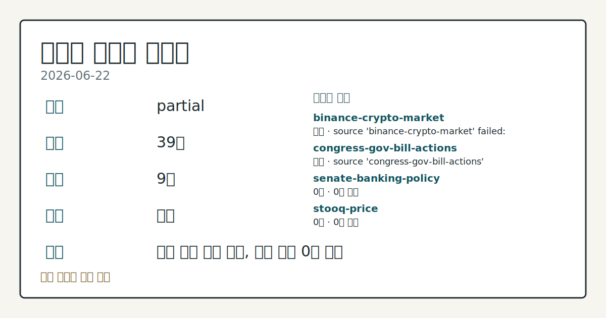
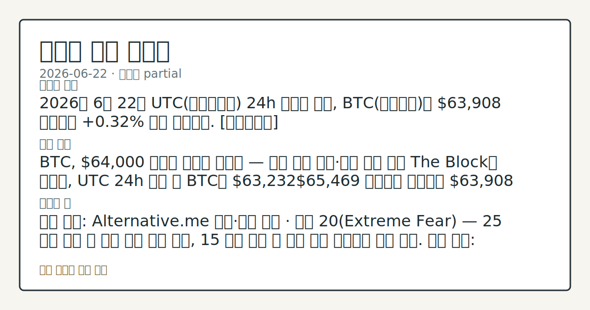
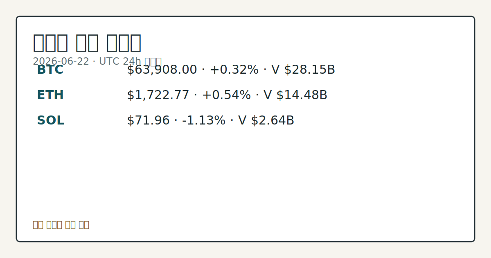

# 2026-06-22 크립토 시황
**기준 시각**: 2026-06-22 UTC · 2026-06-22T00:00Z, 2026-06-23T00:00Z)
| 종목 | 스냅샷(UTC 24h) | 구간 변동 | 비고 |
|------|------|------|------|
| BTC-USD | 63,921.03 | +1.08% | +5.02% from 52w low · -27.96% YTD |
| ETH-USD | 1,723.68 | +1.12% | +9.87% from 52w low · -42.55% YTD |
**세그먼트**: [국내 증시](../../../domestic-equity/2026/06/2026-06-22.md) | [미국 증시](../../../us-equity/2026/06/2026-06-22.md) | [크립토](2026-06-22.md)

*이미지: 데이터 신뢰도 · 출처: investo 자체 생성 · 생성: investo 0.1.0 · 2026-06-23 UTC*
> **내 관심 자산 영향**: 18건 확인 (기본 바스켓) — BTC: [alias:Bitcoin] CFTC Bitcoin CME leveraged_money net -6607 contracts; BTC: [boundary-term] Global crypto market cap **$2,276,241,248,282**; BTC dominance **56.24%**; BTC: [structured-symbol] BTC **$63,908.00** (**+0.32%**); BTC: [boundary-term] BTC 미결제약정 **$443,941,720** (OKX, UTC 24h); BTC: [boundary-term] BTC 펀딩비 0.0000219816612042 (OKX, UTC 24h) 외
> **용어 가이드**: 이번 시황에서 처음 등장한 용어 — 스테이킹(예치보상), 시가총액(시장가치)
> **오늘의 결론**: 2026년 6월 22일 UTC(협정세계시) 24h 스냅샷 기준, BTC(비트코인)는 **$63,908** 수준에서 **+0.32%** 소폭 반등했다. [데이터부족]
> **핵심 동인**: BTC, **$64,000** 저항선 재돌파 미확인 — 연준 매파 기조·이란 완화 교차 The Block에 따르면, UTC 24h 구간 내 BTC는 **$63,232****$65,469** 범위에서 등락하다 **$63,908** 수준에서 스냅샷이 확인됐다.
> **주의할 점**: 확인 소스: Alternative.me 공포·탐욕 지수 · 현재 20(Extreme Fear) — 25 이상 회복 시 심리 개선 추세 관찰, 15 미만 이탈 시...
> **데이터 상태**: 부분 · 본문 사용 미집계 · 실패 2 · 0건 2

수집/품질 진단

> **데이터 상태**: 부분 — 수집 39건 / 소스 9개 / 누락: 없음 · 부분 — 일부 카테고리 미수집, 본문 일부 결론 보강 필요
> **소스 카운트**: 수집 대상 14 / 성공 10 / 0건 2 / 실패 2 / 본문 사용 미집계
> **소스 등급 분포**: S=3 / A=2 / B=5
> **상세 사유**: 일부 소스 수집 실패, 일부 소스 0건 반환
> **소스별 상태**: binance-crypto-market 실패 (접근 제한), congress-gov-bill-actions 실패 (설정 미완료(미수집)), senate-banking-policy 0건, stooq-price 0건, 정상 10개

> 정보 제공용 자동 시황이며 가상자산 매매 권유가 아닙니다. 가상자산은 가격 변동성이 매우 큽니다.
## 한눈에 보기
2026년 6월 22일 UTC 24h 스냅샷 기준, BTC는 **$63,908** 수준에서 **+0.32%** 소폭 반등했다. [데이터부족]
BTC, **$64,000** 저항선 재돌파 미확인 — 연준 매파 기조·이란 완화 교차 The Block에 따르면, UTC 24h 구간 내 BTC는 **$63,232****$65,469** 범위에서 등락하다 **$63,908** 수준에서 스냅샷이 확인됐다.
확인 소스: Alternative.me 공포·탐욕 지수 · 현재 20 — 25 이상 회복 시 심리 개선 추세 관찰, 15 미만 이탈 시 추가 하방 불확실성 신호 점검. 관심 영향: BTC 단기 가격 변동폭 방향 비교. 확인 소스: The Block 보도 · 현물 BTC ETF 6주 연속 순유출  — 이번 주 순유입 전환 확인 시 스팟 수요 재유입 신호 관찰, 7주 이상 순유출 지속 시 기관 수요 부재 흐름 점검. 관심 영향: BTC 24h 저가
## ⓪ 오늘의 매크로
**FOMC 일정** — 2026-07-08 — FOMC Minutes
**국제 유가** — CFTC WTI crude oil managed_money net +96228 contracts
**미 국채 수익률** — UST curve 2026-06-22: 10Y 4.51%, 2Y10Y +0.27pp
## ⓪-A 크립토 지표 (UTC 24h 스냅샷)
| 지표 | 값 |
|------|------|
| 공포·탐욕 | 20 (Extreme Fear) |
| BTC 도미넌스 | 56.24% |
| 전체 시총 | $2.28T (+0.77% 24h) |
| BTC 펀딩비 | 0.0000219816612042 (okx) |
| BTC 미결제약정 | $443.9M (okx) |
| DeFi TVL | $73.5B |
| 스테이블코인 공급 | $314.1B |
| 24h 청산 / 거래소 순유출입 | 무료 검증 소스 미확정 |
## ⓪-B 채널 기준선
| 기준선 | 값 |
|------|------|
| 비트코인 | 63,921.03 (+1.08%) |
| 이더리움 | 1,723.68 (+1.12%) |
| BTC 도미넌스 | 56.24% |
| 공포·탐욕 | 20 |
| 펀딩/OI/청산 | 펀딩 0.0000219816612042 · OI 수집됨 |
| CFTC 코인 포지셔닝 | Bitcoin CME 순포지션 -6607계약 (-31.28% OI), 2026-06-16 기준/2026-06-22 공개 · Ether CME 순포지션 -6752계약 (-25.86% OI), 2026-06-16 기준/2026-06-22 공개 · 주간 지연 |
> **크로스마켓 연결 고리**: 유가/지정학 이슈가 여러 자산군의 변동성 연결 고리로 관찰됩니다. / 금리 이벤트가 할인율/달러 경로의 공통 변수로 남아 있습니다.
> **오늘의 큰 그림:** 금리와 달러 변수가 국내·미국·가상자산에 동시에 걸리며, 오늘 독자는 금리·달러 민감도을 먼저 확인해야 합니다.
## ① 요약

*이미지: 시장 스냅샷 · 출처: investo 자체 생성 · 생성: investo 0.1.0 · 2026-06-23 UTC*

2026년 6월 22일 UTC 24h 스냅샷 기준, BTC는 **$63,908** 수준에서 **+0.32%** 소폭 반등했다. 직전 영업일(2026-06-19) 이후 **$64,000** 하방 등락이 연장된 구도이며, 미국 현물 BTC ETF(상장지수펀드) 자금이 6주 연속 순유출을 기록하는 가운데 공포·탐욕 지수가 **20(Extreme Fear)**에 머물러 심리적 회복은 확인되지 않았다. CFTC(상품선물거래위원회) 레버리지 머니(leveraged money)의 순매도 포지션과 케빈 워시(Kevin Warsh) 연준(연방준비제도) 의장의 매파적 기조가 지정학적 완화 요인을 압도하는 구도가 유지됐다. 전체 크립토 시총은 **$2.28T**(**+0.77%** 24h)로 소폭 회복했으나 기조 전환의 확인은 미완성 상태다. [하락 관찰]

## ② 전일 핵심 이슈

### BTC, **$64,000** 저항선 재돌파 미확인 — 연준 매파 기조·이란 완화 교차

[The Block](https://www.theblock.co/post/405557/between-supportive-and-restrictive-forces-bitcoin-stalls-near-64000-as-fed-rate-hike-risk-overshadows-iran-ceasefire-relief)에 따르면, UTC 24h 구간 내 BTC는 **$63,232**~**$65,469** 범위에서 등락하다 **$63,908** 수준에서 스냅샷이 확인됐다. 미·이란 평화 협상 타결 소식이 단기 안도감을 제공했으나, 케빈 워시 연준 의장의 금리 인상 리스크 경계감이 상방을 제한했다. 직전 영업일 당시 "**$64,000** 이탈 후 심리 회복 미확인" 구도에서 이번 스냅샷도 크게 벗어나지 않아 하락 흐름이 연장된 국면이다.

> **그래서 의미는?** BTC가 소폭 반등에도 **$64,000** 재돌파에 실패한 것은, 이란 완화 모멘텀이 선반영되거나 연준 금리 인상 우려가 상방을 억제하고...

### 현물 BTC ETF 6주 연속 순유출 — 매도세 소진 여부 관찰 중

[The Block 보도](https://www.theblock.co/post/405540/spot-bitcoin-etfs-sixth-consecutive-week-outflow)에 따르면, 미국 현물 BTC ETF는 지난주 **$227M** 순유출을 기록하며 6주 연속 마이너스 흐름을 이어갔다. 일부 애널리스트는 이 같은 매도세가 소진 국면에 접어들었다고 진단했으나, 이번 스냅샷 데이터에서 흐름 전환의 실질적 확인은 이뤄지지 않았다.

### ETH 스테이킹 보상 생태계 기금 전환 제안 — 커뮤니티 논쟁

[Ethereum Research 포럼 제안](https://www.theblock.co/post/405525/ethereum-tax-debate)에서 ETH(이더리움) 검증자(validator)들이 스테이킹 보상의 최대 **10%**를 공공재(public goods) 재원으로 전환하는 방안에 투표할 수 있도록 하는 안이 제기됐다. 커뮤니티에서는 이를 "ETH 세금" 논쟁으로 표현하며 찬반 논의가 이어지고 있다.

## ③ 섹터/수급 동향

### CFTC COT(약정잔고 보고서) — BTC·ETH 선물 레버리지 머니 순매도 지속

[CFTC](https://www.cftc.gov/MarketReports/CommitmentsofTraders/index.htm) 주간 보고서 기준, BTC CME(시카고상품거래소) 선물에서 레버리지 머니의 순포지션은 **-6,607** 계약(롱 6,077 / 숏 12,684, OI(미결제약정) 대비 **-31.3%**)이다. ETH CME 선물에서도 레버리지 머니 순포지션이 **-6,752** 계약(롱 4,855 / 숏 11,607, OI 대비 **-25.9%**)으로 집계됐다. 주간 스냅샷 기준이므로 장중 실시간 흐름과는 차이가 있을 수 있다.

> **그래서 의미는?** 헤지펀드 계열 단기 투기 자금이 BTC·ETH 선물 양쪽에서 순매도 우위를 유지 중이어서, 선물 시장 기준 상승 베팅 확인은 아직 관찰되지...

### DeFi TVL 및 스테이블코인 공급 현황

[DeFiLlama](https://defillama.com/) 기준 DeFi(탈중앙화금융) TVL(총 예치자산)은 **$73.5B**이며, Ethereum이 **$39.1B**으로 선두, BSC **$5.1B**, Solana(솔라나) **$4.9B**, Tron **$4.7B**, Base **$4.2B** 순이다. 스테이블코인(달러 연동 가상자산) 총 공급은 **$314.1B**이며, USDT(테더) **$186.2B**, USDC **$74.6B**, USDS **$8.2B**, DAI **$4.9B**, USD1 **$4.9B** 순으로 확인됐다.

ICE(인터콘티넨탈익스체인지)와 OKX의 합작법인이 OKX 고객에게 ICE 선물 및 NYSE(뉴욕증권거래소) 토큰화 주식 시장 접근을 제공하는 토큰화 RWA(실물자산) 플랫폼을 추진 중이다. [Bernstein 보고서](https://www.theblock.co/post/405578/tokenized-rwa-market-cap-rises-51-billion-industry-races-define-equity-tokenization-model-bernstein)에 따르면 토큰화 RWA 시총은 **$51B**를 상회했으며, 주식 토큰화 부문은 **130%** 성장세가 관찰됐다.

## ④ 지표·이벤트

### 크립토 핵심 지표 — 공포·탐욕 Extreme Fear, 펀딩비 중립 근접

[CoinGecko](https://www.coingecko.com/en/global-charts) UTC 24h 스냅샷 기준 전체 크립토 시총은 **$2,276,241,248,282**이며, BTC 도미넌스(BTC가 전체 시총에서 차지하는 비중)는 **56.24%**다. [공포·탐욕 지수](https://alternative.me/crypto/fear-and-greed-index/)는 **20/100 (Extreme Fear)**를 기록했다. [OKX](https://www.okx.com/trade-swap/btc-usd-swap) 기준 BTC 미결제약정(open interest)은 **$443,941,720**이며, 펀딩비(funding rate)는 **0.0000219816612042**로 사실상 중립 수준에 근접했다. 24h 정리 및 거래소 순유출입 데이터는 무료 검증 소스 미확정으로 데이터 미수집 상태다.

> **그래서 의미는?** 펀딩비가 거의 0에 근접해 롱·숏 과열 없이 균형 상태이나, Extreme Fear 수치는 시장 참여자들이 추가 하락 위험을 높게 체감하고...

### UST 장기금리 및 의회 디지털자산 마크업 일정

[미 재무부](https://home.treasury.gov/resource-center/data-chart-center/interest-rates) 기준 2026-06-22 UST(미국채) 10Y 금리는 **4.51%**(2Y **4.24%**, 30Y **4.95%**, 3M **3.85%**, 3M~10Y 스프레드 **+0.66pp**)로, 장기 실질 금리 부담이 크립토 등 위험자산 수급에 지속적인 압력으로 작용하고 있다.

하원 금융서비스위원회(House Financial Services Committee)는 디지털자산 관련 법안 [마크업(markup, 법안 수정·표결 절차)](http://financialservices.house.gov/calendar/eventsingle.aspx?EventID=411137) 일정을 복수로 예고했으며, [2026년 7월 위원회 전체 일정](http://financialservices.house.gov/news/documentsingle.aspx?DocumentID=411173)도 공개됐다. 크립토 업계 단체들은 스테이킹·마이닝 과세 법안을 현행 그대로 [통과시킬 것을 의회에 촉구](https://www.theblock.co/post/405603/crypto-industry-groups-urge-congress-pass-tax-staking-mining-bill-unchanged)했다.

## ⑤ 주요 종목

<!-- u50 lightweight-charts-embed: placeholders consumed by site_docs/assets/investo-chart-init.js -->

<noscript><em>인터랙티브 차트는 JavaScript가 활성화된 환경에서 표시됩니다. 위 정적 카드가 동일한 정보를 담고 있습니다.</em></noscript>

*이미지: 가격 스냅샷 · 출처: investo 자체 생성 · 생성: investo 0.1.0 · 2026-06-23 UTC*

### 가격 변동 관찰 (UTC 24h 스냅샷)

| 자산 | 가격 | 24h 변동 | 24h 고가 | 24h 저가 | 시가총액 |
|------|------|-----------|-----------|-----------|---------|
| [BTC](https://www.coingecko.com/en/coins/bitcoin) | $63,908.00 | +0.32% | $65,469.00 | $63,232.00 | $1,280,010,371,300 |
| [ETH](https://www.coingecko.com/en/coins/ethereum) | $1,722.77 | +0.54% | $1,773.96 | $1,704.60 | $207,712,871,279 |
| [SOL](https://www.coingecko.com/en/coins/solana) | $71.96 | -1.13% | $74.86 | $71.69 | $41,740,820,967 |

> **그래서 의미는?** BTC와 ETH(이더리움)가 소폭 플러스 전환된 반면, SOL(솔라나)은 **-1.13%** 하락해 알트코인 전반으로 자금이 고르게 유입되지...

### 기업·펀드 동향 확인 항목

- **Strive**: BTC 재무 보유량이 20,000 BTC에 근접했다는 소식과 함께 주가가 장중 약 **10%** 상승한 것으로 [보도됐다](https://www.theblock.co/post/405602/bitcoin-treasury-strives-shares-jump-as-companys-holdings-near-20000-btc).
- **Strategy / STRC**: STRC 우선주 가격 하락에 대해 Benchmark 리서치는 "레버리지 플러시(일시적 강제 정리)"로 분류하고, Strategy 주가 분석 기준 **$570** 수준을 재확인했다. ([The Block](https://www.theblock.co/post/405581/benchmark-reiterates-570-target-on-strategy-after-strc-selloff-says-preferred-stock-is-not-a-stablecoin))
- **Bitmine**: **52,203 ETH** 추가 매입으로 총 보유량 **5.67M ETH** 확인. Joe Lubin 지원을 받은 비영리법인 Ethlabs가 ETH 생태계의 기관 채택 확대를 위한 활동을 시작했다. ([The Block](https://www.theblock.co/post/405694/bitmine-sharplink-and-joe-lubin-back-ethlabs-nonprofit-to-advance-ethereums-next-phase-of-growth))
- **HIVE**: 파라과이 GPU(그래픽처리장치)에서 신경망 훈련을 진행한 아이비리그 연구진 논문이 NeurIPS 학회에 제출됐다는 소식과 함께 주가가 **25%** 상승한 것으로 [전해졌다](https://www.theblock.co/post/405637/hive-stock-surges-ivy-league-researchers-train-neural-networks-paraguay-gpus).

## ⑥ 오늘의 관전 포인트

#### 관찰 신호: 확인 소스: Alternative.me 공포·탐욕 지수…

- 출처: 확인 소스 미상
- 현재: 확인 소스: Alternative.me 공포·탐욕 지수 · 현재 **20** — **25** 이상 회복 시 심리 개선 추세 관찰, **15** 미만 이탈 시 추가 하방 불확실성 신호 점검. 관심 영향: BTC 단기 가격 변동폭 방향 비교.
- 확인 조건: 상방 현재 **20** — **25** 이상 회복 시 심리 개선 추세 관찰, **15** 미만 이탈 시 추가 하방 불확실성 신호 점검; 하방 현재 **20** — **25** 이상 회복 시 심리 개선 추세 관찰, **15** 미만 이탈 시 추가 하방 불확실성 신호 점검
- 신뢰도: 보통
- 관심 영향: 관심 영향: BTC 단기 가격 변동폭 방향 비교.

#### 관찰 신호: 확인 소스: The Block 보도 · 현물 BTC E…

- 출처: 확인 소스 미상
- 현재: 확인 소스: The Block 보도 · 현물 BTC ETF 6주 연속 순유출 — 이번 주 순유입 전환 확인 시 스팟 수요 재유입 신호 관찰, 7주 이상 순유출 지속 시 기관 수요 부재 흐름 점검. 관심 영향: BTC 24h 저가 **$63,232** 지지 추세 확인.
- 확인 조건: 상방 상방 데이터 부족; 하방 하방 데이터 부족
- 신뢰도: 높음
- 관심 영향: 관심 영향: BTC 24h 저가 **$63,232** 지지 추세 확인.

#### 관찰 신호: 확인 소스: CFTC COT 보고서 · BTC CME…

- 출처: 확인 소스 미상
- 현재: 확인 소스: CFTC COT 보고서 · BTC CME 레버리지 머니 순포지션 **-6,607** 계약 / ETH CME **-6,752** 계약 — 주간 업데이트에서 순매도 계약 수 축소 확인 시 선물 포지션 전환 신호 관찰, 순매도 확대 확인 시 하방 압력 지속 흐름 점검. 관심 영향: 파생상품 OI 변화 추이 비교.
- 확인 조건: 상방 상방 데이터 부족; 하방 BTC CME 레버리지 머니 순포지션 **-6,607** 계약 / ETH CME **-6,752** 계약 — 주간 업데이트에서 순매도 계약 수 축소 확인 시 선물 포지션 전환 신호 관찰, 순매도 확대 확인 시 하방 압력 지속 흐름 점검
- 신뢰도: 보통
- 관심 영향: 관심 영향: 파생상품 OI 변화 추이 비교.

#### 관찰 신호: 확인 소스: 하원 금융서비스위원회 마크업 일정 · 디지…

- 출처: 확인 소스 미상
- 현재: 확인 소스: 하원 금융서비스위원회 마크업 일정 · 디지털자산 법안 마크업 복수 일정 예고 — 스테이블코인·시장구조 법안 위원회 가결 확인 시 규제 명확성 확보 신호 관찰, 부결·연기 확인 시 입법 불확실성 지속 흐름 점검. 관심 영향: 크립토 관련 기업·토큰 수급 환경 변화 확인.
- 확인 조건: 상방 상방 데이터 부족; 하방 하방 데이터 부족
- 신뢰도: 보통
- 관심 영향: 관심 영향: 크립토 관련 기업

#### 관찰 신호: 확인 소스: Ethereum Research 포럼 /…

- 출처: 확인 소스 미상
- 현재: 확인 소스: Ethereum Research 포럼 / The Block · ETH 스테이킹 보상 최대 **10%** 생태계 기금 전환 제안 — 커뮤니티 투표 찬성 우세 확인 시 ETH 스테이킹 수익 구조 변화 관찰, 반대 우세 확인 시 기존 보상 구조 유지 흐름 점검. 관심 영향: ETH 온체인 스테이킹 참여율 데이터 추이 확인.
- 확인 조건: 상방 상방 데이터 부족; 하방 하방 데이터 부족
- 신뢰도: 높음
- 관심 영향: 관심 영향: ETH 온체인 스테이킹 참여율 데이터 추이 확인.
## ⑦ 면책조항
본 시황은 일반 정보 제공을 목적으로 자동 생성된 자료이며,
특정 가상자산에 대한 매매 권유나 투자 자문이 아닙니다.
가상자산은 가상자산이용자보호법(2024-07-19 시행) §10·§19의 적용 대상으로,
24시간 거래되는 비제도권 자산이며 가격 변동성이 매우 크고 원금 전액 손실이 가능합니다.
투자 결정과 그 결과에 대한 책임은 전적으로 본인에게 있으며,
본 시황의 내용에 따라 발생한 손실에 대해 작성자는 일체의 책임을 지지 않습니다.