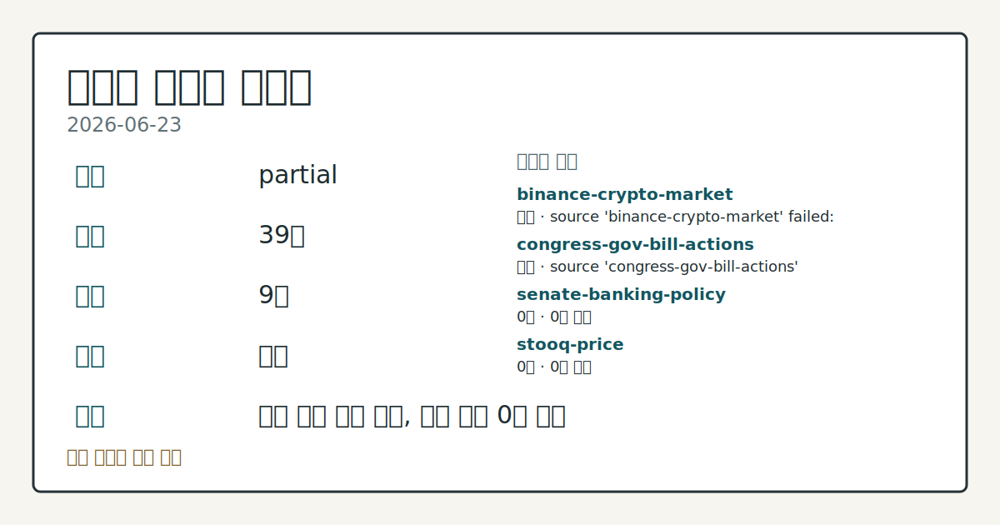
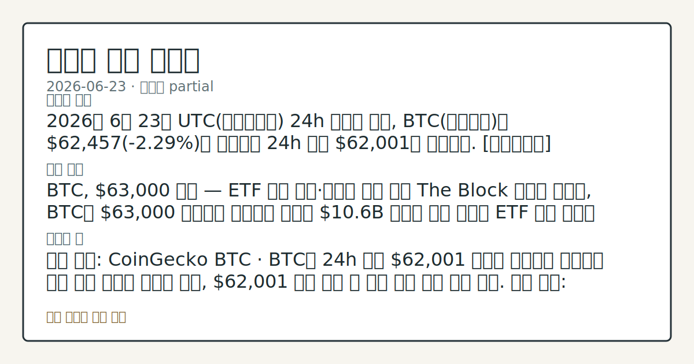
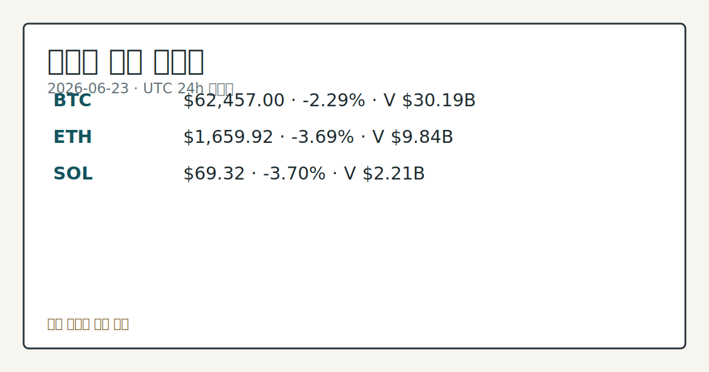

# 2026-06-23 크립토 시황
**기준 시각**: 2026-06-23 UTC · 2026-06-23T00:00Z, 2026-06-24T00:00Z)
| 종목 | 스냅샷(UTC 24h) | 구간 변동 | 비고 |
|------|------|------|------|
| BTC-USD | 62,467.45 | -2.32% | +2.63% from 52w low · -29.60% YTD |
| ETH-USD | 1,660.85 | -3.80% | +5.87% from 52w low · -44.65% YTD |
**세그먼트**: [국내 증시](../../../domestic-equity/2026/06/2026-06-23.md) | [미국 증시](../../../us-equity/2026/06/2026-06-23.md) | [크립토](2026-06-23.md)

*이미지: 데이터 신뢰도 · 출처: investo 자체 생성 · 생성: investo 0.1.0 · 2026-06-23 UTC*
> **내 관심 자산 영향**: 16건 확인 (기본 바스켓) — BTC: [alias:Bitcoin] CFTC Bitcoin CME leveraged_money net -6607 contracts; BTC: [boundary-term] Global crypto market cap **$2,228,133,195,841**; BTC dominance **56.20%**; BTC: [structured-symbol] BTC **$62,457.00** (**-2.29%**); BTC: [boundary-term] BTC 미결제약정 **$439,475,630** (OKX, UTC 24h); BTC: [boundary-term] BTC 펀딩비 0.0000866102034811 (OKX, UTC 24h) 외
> **용어 가이드**: 이번 시황에서 처음 등장한 용어 — ESMA(미니S&P선물)
> **오늘의 결론**: 2026년 6월 23일 UTC(협정세계시) 24h 스냅샷 기준, BTC(비트코인)는 **$62,457**(**-2.29%**)로 하락하며 24h 저점 **$62,001**을 기록했다. [데이터부족]
> **핵심 동인**: BTC, **$63,000** 하회 — ETF 자금 이탈·대규모 옵션 만기 The Block 보도에 따르면, BTC는 **$63,000** 아래에서 거래되고 있으며 **$10.6**B 규모의 옵션 만기와 ETF 자금 이탈이 동시에 진행 중이다.
> **주의할 점**: 확인 소스: CoinGecko BTC · BTC가 24h 저점 $62,001 위에서 지지선을 유지하면 단기 안정 신호로 방향성 관찰, $62
> **데이터 상태**: 부분 · 본문 사용 미집계 · 실패 2 · 0건 2

수집/품질 진단

> **데이터 상태**: 부분 — 수집 39건 / 소스 9개 / 누락: 없음 · 부분 — 일부 카테고리 미수집, 본문 일부 결론 보강 필요
> **소스 카운트**: 수집 대상 14 / 성공 10 / 0건 2 / 실패 2 / 본문 사용 미집계
> **소스 등급 분포**: S=3 / A=2 / B=5
> **상세 사유**: 일부 소스 수집 실패, 일부 소스 0건 반환
> **소스별 상태**: binance-crypto-market 실패 (접근 제한), congress-gov-bill-actions 실패 (설정 미완료(미수집)), senate-banking-policy 0건, stooq-price 0건, 정상 10개

> 정보 제공용 자동 시황이며 가상자산 매매 권유가 아닙니다. 가상자산은 가격 변동성이 매우 큽니다.
## 한눈에 보기
2026년 6월 23일 UTC 24h 스냅샷 기준, BTC는 **$62,457**(**-2.29%**)로 하락하며 24h 저점 **$62,001**을 기록했다. [데이터부족]
BTC, **$63,000** 하회 — ETF 자금 이탈·대규모 옵션 만기 The Block 보도에 따르면, BTC는 **$63,000** 아래에서 거래되고 있으며 **$10.6**B 규모의 옵션 만기와 ETF 자금 이탈이 동시에 진행 중이다.
확인 소스: CoinGecko BTC · BTC가 24h 저점 **$62,001** 위에서 지지선을 유지하면 단기 안정 신호로 방향성 관찰, **$62,001** 하향 이탈 시 추가 하락 구간 여부 점검. 관심 영향: 공포·탐욕 지수 추가 하락 및 전체 시총 축소 흐름 확인. 확인 소스: CFTC COT 보고서 · 레버리지드머니 BTC CME 순포지션 -6,607 계약 기준, 숏 포지션 축소 신호가 나타나면 단기 반등 압력 추세 확인, 숏 추가 확대 시 하방 압력 심화 여부
## ⓪ 오늘의 매크로
**FOMC 일정** — 2026-07-08 — FOMC Minutes
**미 국채 수익률** — UST curve 2026-06-23: 10Y 4.50%, 2Y10Y +0.34pp
## ⓪-A 크립토 지표 (UTC 24h 스냅샷)
| 지표 | 값 |
|------|------|
| 공포·탐욕 | 23 (Extreme Fear) |
| BTC 도미넌스 | 56.20% |
| 전체 시총 | $2.23T (-2.24% 24h) |
| BTC 펀딩비 | 0.0000866102034811 (okx) |
| BTC 미결제약정 | $439.5M (okx) |
| DeFi TVL | $71.9B |
| 스테이블코인 공급 | $313.7B |
| 24h 청산 / 거래소 순유출입 | 무료 검증 소스 미확정 |
## ⓪-B 채널 기준선
| 기준선 | 값 |
|------|------|
| 비트코인 | 62,467.45 (-2.32%) |
| 이더리움 | 1,660.85 (-3.80%) |
| BTC 도미넌스 | 56.20% |
| 공포·탐욕 | 23 |
| 펀딩/OI/청산 | 펀딩 0.0000866102034811 · OI 수집됨 |
| CFTC 코인 포지셔닝 | Bitcoin CME 순포지션 -6607계약 (-31.28% OI), 2026-06-16 기준/2026-06-22 공개 · Ether CME 순포지션 -6752계약 (-25.86% OI), 2026-06-16 기준/2026-06-22 공개 · 주간 지연 |
> **크로스마켓 연결 고리**: 금리 이벤트가 할인율/달러 경로의 공통 변수로 남아 있습니다.
> **오늘의 큰 그림:** 금리와 달러 변수가 국내·미국에 동시에 걸리며, 오늘 독자는 금리·달러 민감도을 먼저 확인해야 합니다.
## ① 요약

*이미지: 시장 스냅샷 · 출처: investo 자체 생성 · 생성: investo 0.1.0 · 2026-06-23 UTC*

2026년 6월 23일 UTC 24h 스냅샷 기준, BTC는 **$62,457**(**-2.29%**)로 하락하며 24h 저점 **$62,001**을 기록했다. ETH(이더리움)는 **-3.69%**, SOL(솔라나)는 **-3.70%** 하락하며 알트코인 전반이 BTC보다 깊은 낙폭을 보였다. 크립토 전체 시총은 **$2.23T**(**-2.24%** 24h)로 축소됐으며, 공포·탐욕 지수(Fear & Greed Index)는 23(극단적 공포, Extreme Fear)을 기록 중이다. CFTC(미상품선물거래위원회) CME(시카고상업거래소) 레버리지드머니 순매도 포지션, ETF(상장지수펀드) 자금 이탈, **$10.6B** 규모 옵션 만기가 복합 압력으로 작용 중이며, 6월 22일 이후 **$64,000** 저항선 재돌파가 확인되지 않은 채 추가 하락이 이어지는 흐름이다. [하락 관찰]

## ② 전일 핵심 이슈

### BTC, **$63,000** 하회 — ETF 자금 이탈·대규모 옵션 만기

[The Block 보도](https://www.theblock.co/post/405831/quarter-end-catalyst-consolidation-bitcoin-below-63000-etf-outflows-10-6-billion-options-expiry)에 따르면, BTC는 **$63,000** 아래에서 거래되고 있으며 **$10.6B** 규모의 옵션 만기와 ETF 자금 이탈이 동시에 진행 중이다. 분기말 촉매 혹은 조정이라는 이중 해석이 공존하며, 시장의 다음 테스트 지점으로 목요일 PCE(개인소비지출) 데이터가 거론된다. 6월 22일 핵심 동인으로 지목됐던 **$64,000** 저항선 재돌파 미확인 흐름이 오늘도 연장되며 24h 저점은 **$62,001**까지 하락했다.

> **그래서 의미는?** 분기말 대규모 옵션 만기와 ETF 자금 이탈이 겹쳐 단기 가격 변동성이 확대될 수 있는 수급 환경이 형성됐다.

### Ethereum Foundation, 인력 20% 감축·5개 클러스터 재편

[The Block 보도](https://www.theblock.co/post/405809/ethereum-foundation-cuts-20-of-its-workforce-as-new-5-cluster-structure-takes-shape)에 따르면, Ethereum Foundation(이더리움 재단)이 전체 인력의 **20%**를 감축하고 5개 클러스터(cluster) 구조로 조직을 재편했다. 오랫동안 논의돼 온 구조조정의 결과물로, ETH 생태계 거버넌스 변화의 관찰 사안이다.

### DOJ, Huione Group 클라우드 계정 압수

[The Block 보도](https://www.theblock.co/post/405834/doj-seizes-huione-group-account-launder-billions)에 따르면, 미 DOJ(법무부, Department of Justice)가 Huione Group의 클라우드 컴퓨팅 계정을 압수했다. Huione Group은 지난해 FinCEN(금융범죄단속네트워크, Financial Crimes Enforcement Network)으로부터 USA Patriot Act상 주요 자금세탁 우려 기관으로 지정된 바 있다.

## ③ 섹터/수급 동향

### CFTC CME 레버리지드머니 — BTC·ETH 순매도 포지션 유지

[CFTC 주간 COT(Commitments of Traders; 포지션 보고서)](https://www.cftc.gov/MarketReports/CommitmentsofTraders/index.htm)에 따르면, Bitcoin CME 기준 레버리지드머니(leveraged money; 헤지펀드 등 단기 투기 자금)의 순 포지션은 **-6,607** 계약(롱 6,077, 숏 12,684, OI(Open Interest; 미결제약정, 미정리 파생상품 계약 잔고) 대비 **-31.3%**)이다. Ether CME도 **-6,752** 계약(롱 4,855, 숏 11,607, OI 대비 **-25.9%**)으로 순매도 포지션이 유지 중이다. 이 수치는 인트라데이(intraday; 당일 중) 흐름이 아닌 주간 CFTC 보고서 기준이다.

> **그래서 의미는?** 헤지펀드 등 단기 투기 자금이 BTC·ETH 모두에 대해 순매도(숏) 포지션을 유지하고 있어, 가격 반등 시 숏커버링(공매도 상환)과 추가...

### MiCA 시행 임박 — 유럽 거래소 80% 도태 전망

[The Block 보도](https://www.theblock.co/post/405777/okx-europe-chief-mica-deadline-nears)에 따르면, OKX Europe CEO 그후스(Ghoos)는 7월 1일 ESMA(유럽증권시장청, European Securities and Markets Authority) MiCA(Markets in Crypto-Assets Regulation; 암호자산시장법) 시행 마감을 앞두고 미허가 거래소의 **80%**가 EU 운영을 중단하게 될 것이라고 밝혔다.

### 24h 정리 / 거래소 순유출입

무료 검증 소스 미확정으로 데이터 미수집이며, 해당 항목의 방향성은 판단 불가 상태다.

## ④ 지표·이벤트

### 크립토 시장 주요 지표 (UTC 24h 스냅샷)

[CoinGecko](https://www.coingecko.com/en/global-charts) 기준 전체 시총은 **$2.23T**(**-2.24%** 24h), BTC 도미넌스(dominance; 비트코인 시장 점유율)는 **56.20%**다. [Alternative.me](https://alternative.me/crypto/fear-and-greed-index/) 공포·탐욕 지수는 **23**(극단적 공포, Extreme Fear)을 기록 중이다. OKX 기준 BTC 미결제약정은 **$439.5M**, 펀딩비(funding rate; 선물 매수·매도 간 유지 비용)는 **0.0000866** 수준이다.

> **그래서 의미는?** 공포·탐욕 지수 23은 극단적 공포 구간으로, 투자 심리가 극도로 위축된 상태임을 지표로 확인할 수 있다.

### UST(미국 국채) 금리 곡선 (2026-06-23)

[미 재무부](https://home.treasury.gov/resource-center/data-chart-center/interest-rates) 기준 10Y(10년물) 금리는 **4.50%**, 2Y(2년물) 금리는 **4.16%**, 2Y10Y 스프레드는 **+0.34pp**, 30Y(30년물)는 **4.94%**다. 크립토 세그먼트 관점에서 **4.50%** 수준의 10Y 금리는 위험자산 전반의 할인율 환경을 높여 가격 흐름에 간접적 하방 압력 요인으로 관찰된다.

### CLARITY Act 현장 청문회 — House Financial Services Committee

[House Financial Services Committee(하원 금융서비스위원회)](http://financialservices.house.gov/calendar/eventsingle.aspx?EventID=411176)가 "Building the Future of Finance: How the CLARITY Act Unlocks Innovation" 현장 청문회와 복수의 법안 마크업(markup; 의회 법안 심의 절차) 일정을 공고했다. CLARITY Act(클래리티 법안; 디지털 자산 시장 구조·SEC·CFTC 관할 명확화 법안)는 디지털 자산 규제 체계 정립을 목표로 하는 정책 관찰 사안이다.

## ⑤ 주요 종목

<!-- u50 lightweight-charts-embed: placeholders consumed by site_docs/assets/investo-chart-init.js -->

<noscript><em>인터랙티브 차트는 JavaScript가 활성화된 환경에서 표시됩니다. 위 정적 카드가 동일한 정보를 담고 있습니다.</em></noscript>

*이미지: 가격 스냅샷 · 출처: investo 자체 생성 · 생성: investo 0.1.0 · 2026-06-23 UTC*

### 가격 변동 관찰 (UTC 24h 기준)

| 자산 | 가격 | 24h 변동 | 24h 고점 | 24h 저점 |
|------|------|---------|---------|---------|
| BTC | $62,457.00 | **-2.29%** | $64,168.00 | $62,001.00 |
| ETH | $1,659.92 | **-3.69%** | $1,732.21 | $1,642.63 |
| SOL | $69.32 | **-3.70%** | $72.02 | $68.41 |

> **그래서 의미는?** BTC·ETH·SOL 모두 24h 내 하락세이며, ETH와 SOL의 낙폭이 BTC보다 깊어 알트코인 상대적 약세를 확인할 수 있다.

### 확인 항목

- **Strategy(구 MicroStrategy)**: [CryptoQuant](https://www.theblock.co/post/405885/cryptoquant-strategy-should-pause-bitcoin-purchases-rebuild-cash-reserves)가 BTC 가격 하락 국면에서 Strategy의 BTC 추가 매입 일시 중단 및 현금 보유 비율 확대를 권고했다는 외부 분석이 제기됐다. BTC 하락 구간에서 자본 구조 부담 관찰이 필요한 상황이다.

- **THORChain**: [**$10.7M** 멀티체인 익스플로잇(exploit; 취약점 공격) 이후 5주간 거래 중단](https://www.theblock.co/post/405767/thorchain-resumes-trading-after-exploit)을 거쳐 거래가 재개됐다.

- **Hut 8**: 2023년 US Bitcoin Corp 합병 관련 증권 집단소송을 [**$2.35M** 합의금으로 종결](https://www.theblock.co/post/405760/hut-8-agrees-to-2-35-million-settlement-in-investor-suit-tied-to-us-bitcoin-merger)했다.

### DeFi TVL 현황

[DeFiLlama](https://defillama.com/) 기준 DeFi(탈중앙화금융, Decentralized Finance) TVL(총 예치 자산, Total Value Locked)은 **$71.9B**이며, Ethereum이 **$38.1B**로 선두다. 스테이블코인(stablecoin; 가치 안정 암호화폐) 공급 총액은 **$313.7B**이며, USDT(테더)가 **$186.1B**으로 최대 발행량을 기록 중이다.

## ⑥ 오늘의 관전 포인트

#### 관찰 신호: 확인 소스: CoinGecko BTC · BTC

- 출처: 확인 소스 미상
- 현재: 확인 소스: CoinGecko BTC · BTC가 24h 저점 **$62,001** 위에서 지지선을 유지하면 단기 안정 신호로 방향성 관찰, **$62,001** 하향 이탈 시 추가 하락 구간 여부 점검. 관심 영향: 공포·탐욕 지수 추가 하락 및 전체 시총 축소 흐름 확인.
- 확인 조건: 상방 상방 데이터 부족; 하방 BTC가 24h 저점 **$62,001** 위에서 지지선을 유지하면 단기 안정 신호로 방향성 관찰, **$62,001** 하향 이탈 시 추가 하락 구간 여부 점검
- 신뢰도: 높음
- 관심 영향: 관심 영향: 공포

#### 관찰 신호: 확인 소스: CFTC COT 보고서 · 레버리지드머니…

- 출처: 확인 소스 미상
- 현재: 확인 소스: CFTC COT 보고서 · 레버리지드머니 BTC CME 순포지션 **-6,607** 계약 기준, 숏 포지션 축소 신호가 나타나면 단기 반등 압력 추세 확인, 숏 추가 확대 시 하방 압력 심화 여부 데이터 비교. 관심 영향: 파생상품 포지션 변화와 현물 가격 간 괴리 흐름 점검.
- 확인 조건: 상방 상방 데이터 부족; 하방 레버리지드머니 BTC CME 순포지션 **-6,607** 계약 기준, 숏 포지션 축소 신호가 나타나면 단기 반등 압력 추세 확인, 숏 추가 확대 시 하방 압력 심화 여부 데이터 비교
- 신뢰도: 보통
- 관심 영향: 관심 영향: 파생상품 포지션 변화와 현물 가격 간 괴리 흐름 점검.

#### 관찰 신호: 확인 소스: The Block 옵션 만기 보도 · **…

- 출처: 확인 소스 미상
- 현재: 확인 소스: The Block 옵션 만기 보도 · **$10.6B** 규모 옵션 만기 통과 후 ETF 자금 흐름이 순유입으로 전환되면 반등 모멘텀 추세 살피기, 순유출 지속 확인 시 하방 흐름 연장 여부 데이터 비교. 관심 영향: 분기말 수급 환경 변화가 단기 가격 방향에 미치는 영향 흐름 확인.
- 확인 조건: 상방 상방 데이터 부족; 하방 **$10.6B** 규모 옵션 만기 통과 후 ETF 자금 흐름이 순유입으로 전환되면 반등 모멘텀 추세 살피기, 순유출 지속 확인 시 하방 흐름 연장 여부 데이터 비교
- 신뢰도: 높음
- 관심 영향: 관심 영향: 분기말 수급 환경 변화가 단기 가격 방향에 미치는 영향 흐름 확인.

#### 관찰 신호: 확인 소스: House Financial Service…

- 출처: 확인 소스 미상
- 현재: 확인 소스: House Financial Services Committee · CLARITY Act 청문회·마크업 절차에서 SEC·CFTC 관할 명확화 방향이 확인되면 규제 불확실성 완화 신호 관찰, 법안 심의 지연 또는 이견 확대 시 불확실성 유지 환경 추세 살피기. 관심 영향: 디지털 자산 규제 체계 변화가 크립토 시장 구조에 미치는 영향 점검.
- 확인 조건: 상방 상방 데이터 부족; 하방 하방 데이터 부족
- 신뢰도: 보통
- 관심 영향: 관심 영향: 디지털 자산 규제 체계 변화가 크립토 시장 구조에 미치는 영향 점검.

#### 관찰 신호: 확인 소스: 미 재무부 UST 금리 · 10Y 금리

- 출처: 확인 소스 미상
- 현재: 확인 소스: 미 재무부 UST 금리 · 10Y 금리가 **4.50%** 위에서 유지되면 위험자산 할인율 부담 지속 흐름 확인, **4.50%** 하향 이탈 시 크립토 포함 위험자산 수급 환경 변화 여부 데이터 비교. 관심 영향: 금리 환경과 크립토 가격 상관관계 변동 추세 관찰.
- 확인 조건: 상방 상방 데이터 부족; 하방 10Y 금리가 **4.50%** 위에서 유지되면 위험자산 할인율 부담 지속 흐름 확인, **4.50%** 하향 이탈 시 크립토 포함 위험자산 수급 환경 변화 여부 데이터 비교
- 신뢰도: 높음
- 관심 영향: 관심 영향: 금리 환경과 크립토 가격 상관관계 변동 추세 관찰.
## ⑦ 면책조항
본 시황은 일반 정보 제공을 목적으로 자동 생성된 자료이며,
특정 가상자산에 대한 매매 권유나 투자 자문이 아닙니다.
가상자산은 가상자산이용자보호법(2024-07-19 시행) §10·§19의 적용 대상으로,
24시간 거래되는 비제도권 자산이며 가격 변동성이 매우 크고 원금 전액 손실이 가능합니다.
투자 결정과 그 결과에 대한 책임은 전적으로 본인에게 있으며,
본 시황의 내용에 따라 발생한 손실에 대해 작성자는 일체의 책임을 지지 않습니다.