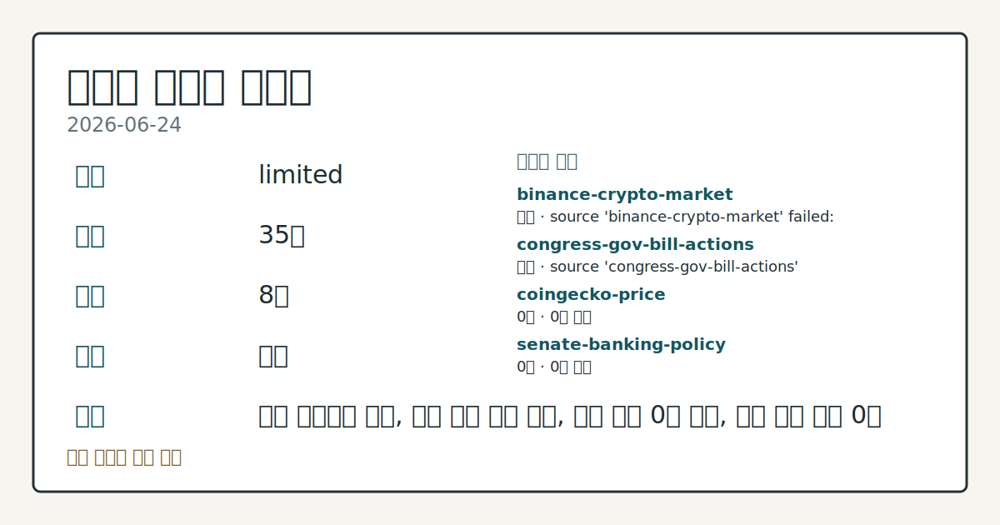
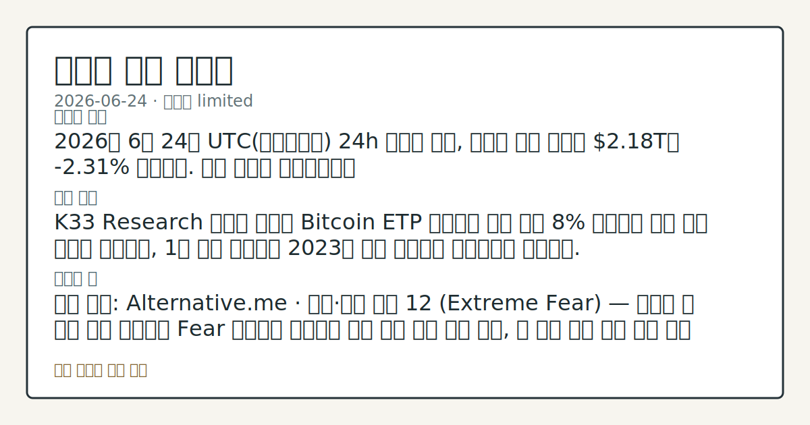

# 2026-06-24 크립토 시황
**기준 시각**: 2026-06-24 UTC · 2026-06-24T00:00Z, 2026-06-25T00:00Z)
| 종목 | 스냅샷(UTC 24h) | 구간 변동 | 비고 |
|------|------|------|------|
| BTC-USD | 60,692.45 | -3.15% | 0.00% from 52w low · -31.60% YTD |
| ETH-USD | 1,613.89 | -3.10% | +2.88% from 52w low · -46.21% YTD |
**세그먼트**: [국내 증시](../../../domestic-equity/2026/06/2026-06-24.md) | [미국 증시](../../../us-equity/2026/06/2026-06-24.md) | [크립토](2026-06-24.md)

*이미지: 데이터 신뢰도 · 출처: investo 자체 생성 · 생성: investo 0.1.0 · 2026-06-25 UTC*
> **내 관심 자산 영향**: 데이터 수집 부족으로 매칭 판단 보류 — 추가 수집 후 재평가됩니다.
> **오늘의 결론**: 2026년 6월 24일 UTC(협정세계시) 24h 스냅샷 기준, 크립토 전체 시총은 **$2.18T**로 **-2.31%** 하락했다. 수집 근거가 제한적입니다
> **핵심 동인**: K33 Research 보고에 따르면 Bitcoin ETP 보유량이 고점 대비 8% 감소하며 사상 최대 낙폭을 기록했고, 1년 누적 순유입이 2023년 이후 처음으로 마이너스로 돌아섰다.
> **주의할 점**: 확인 소스: Alternative.me · 공포·탐욕 지수 12 (Extreme Fear) — 지수가 현 수준 대비 상승하며 Fear 구간으로 본문 참고.
> 정보 제공용 자동 시황이며 가상자산 매매 권유가 아닙니다. 가상자산은 가격 변동성이 매우 큽니다.
## 한눈에 보기
크립토 전체 시총 **-2.31%** 24h 하락, 공포·탐욕 지수 **12** (Extreme Fear) 유지 — 6월 중순 이후 지속된 하락 흐름이 이어짐
Bitcoin ETP(상장지수상품) 1년 누적 순유입이 2023년 이후 처음으로 마이너스 전환, BTC 고점 대비 **8%** 유출 (사상 최대 감소폭 기록)
채굴자 약 **20%** 수익성 악화 구간 접근, 네트워크 레벨 스트레스 포착 — 공급 측 압박 흐름을 본문 §③에서 확인
## ⓪ 오늘의 매크로
**미 국채 수익률** — UST curve 2026-06-24: 10Y 4.41%, 2Y10Y +0.30pp
## ⓪-A 크립토 지표 (UTC 24h 스냅샷)
| 지표 | 값 |
|------|------|
| 공포·탐욕 | 12 (Extreme Fear) |
| BTC 도미넌스 | 55.94% |
| 전체 시총 | $2.18T (-2.31% 24h) |
| BTC 펀딩비 | -0.0000087712509608 (okx) |
| BTC 미결제약정 | $423.7M (okx) |
| DeFi TVL | $70.8B |
| 스테이블코인 공급 | $312.9B |
| 24h 청산 / 거래소 순유출입 | 무료 검증 소스 미확정 |
## ⓪-B 채널 기준선
| 기준선 | 값 |
|------|------|
| 비트코인 | 60,692.45 (-3.15%) |
| 이더리움 | 1,613.89 (-3.10%) |
| BTC 도미넌스 | 55.94% |
| 공포·탐욕 | 12 |
| 펀딩/OI/청산 | 펀딩 -0.0000087712509608 · OI 수집됨 |
| CFTC 코인 포지셔닝 | Bitcoin CME 순포지션 -6607계약 (-31.28% OI), 2026-06-16 기준/2026-06-22 공개 · Ether CME 순포지션 -6752계약 (-25.86% OI), 2026-06-16 기준/2026-06-22 공개 · 주간 지연 |
> **크로스마켓 연결 고리**: 금리 이벤트가 할인율/달러 경로의 공통 변수로 남아 있습니다.
> **오늘의 큰 그림:** 금리와 달러 변수가 미국·가상자산에 동시에 걸리며, 오늘 독자는 금리·달러 민감도를 먼저 확인해야 합니다.
## ① 요약

*이미지: 시장 스냅샷 · 출처: investo 자체 생성 · 생성: investo 0.1.0 · 2026-06-25 UTC*

2026년 6월 24일 UTC 24h 스냅샷 기준, 크립토 전체 시총은 **$2.18T**로 **-2.31%** 하락했다. 공포·탐욕 지수(Fear & Greed Index)는 **12** (Extreme Fear)에 머물며 6월 중순 이후 지속된 극도의 공포 구간이 이어졌다. [K33 Research](https://www.theblock.co/post/405989/bitcoin-etp-outflows-push-rolling-one-year-flows-negative-first-time-since-2023-k33)가 Bitcoin ETP 보유량이 고점 대비 **8%** 감소하며 1년 누적 순유입이 2023년 이후 처음으로 마이너스로 전환됐다고 보고했으며, 직전 영업일(2026-06-23)까지 확인된 **$63,000** 하회·심리 미회복 흐름이 구조적 자금 이탈로 재확인된 형국이다. [하락 관찰]

## ② 전일 핵심 이슈

[K33 Research](https://www.theblock.co/post/405989/bitcoin-etp-outflows-push-rolling-one-year-flows-negative-first-time-since-2023-k33) 보고에 따르면 Bitcoin ETP 보유량이 고점 대비 **8%** 감소하며 사상 최대 낙폭을 기록했고, 1년 누적 순유입이 2023년 이후 처음으로 마이너스로 돌아섰다. 전일부터 이어진 BTC 하락·심리 미회복 국면이 기관 수급 이탈 데이터로 뒷받침됐으며, 어제 흐름 연장으로 추가 확인이 필요한 상황이다.

> **그래서 의미는?** ETP 1년 누적 자금 이탈이 2023년 이후 처음이라는 사실은 단기 충격인지 구조적 이탈인지 추가 데이터를 통해 확인이 필요함을 나타낸다.

### Bitcoin ETP 1년 누적 순유입 마이너스 전환 — 사상 최대 낙폭

Head of Research Vetle Lunde 분석을 인용한 [K33 Research 보고서](https://www.theblock.co/post/405989/bitcoin-etp-outflows-push-rolling-one-year-flows-negative-first-time-since-2023-k33)는 Bitcoin ETP 보유량이 고점 대비 **8%** 감소하며 기록상 최대 감소폭이라고 명시했다. 2023년 이후 처음으로 1년 누적 기준 순유입이 마이너스로 전환된 이번 데이터는, 기관 투자자의 실질적 이탈 흐름이 수치로 확인됐음을 보여준다.

### CLARITY Act(디지털자산 시장구조 명확화 법안) 하원 청문회 및 마크업

[하원 금융서비스위원회(House Financial Services Committee)](http://financialservices.house.gov/calendar/eventsingle.aspx?EventID=411176)는 'Building the Future of Finance: How the CLARITY Act Unlocks Innovation' 주제로 현장 청문회를 개최했다. [다양한 법안 마크업(Markup of Various Measures)](http://financialservices.house.gov/calendar/eventsingle.aspx?EventID=411137)도 진행 중이며, SEC(미국 증권거래위원회)와 CFTC(미국 상품선물거래위원회) 간 디지털자산 관할권 조정이 핵심 의제다. [결제 혁신 전체위원회 청문회](http://financialservices.house.gov/news/documentsingle.aspx?DocumentID=411181)도 병행 개최됐다.

### Binance EU 라이선스 1주일 기한

[Binance](https://www.theblock.co/post/406009/binance-ceo-remains-committed-securing-eu-license-exchange-withdraws-greece-bid) 공동 CEO는 그리스 라이선스 신청을 철회한 이후에도 EU 라이선스 확보에 대한 의지를 공개적으로 밝혔다. 합법적 EU 영업을 위해 남은 기간은 1주일로, 처리 결과가 유럽 내 크립토 수급 환경에 직접 영향을 미칠 수 있다.

## ③ 섹터/수급 동향

[CoinGecko](https://www.coingecko.com/en/global-charts) 기준 BTC 도미넌스(전체 시총 대비 BTC 비중)는 **55.94%**로 알트코인 대비 BTC 상대 우위가 유지됐다. [DeFiLlama](https://defillama.com/) 기준 DeFi TVL(탈중앙화 금융 총예치자산)은 **$70.8B**이며 Ethereum이 **$37.4B**으로 1위를 차지했다. BSC(바이낸스 스마트체인, **$5.0B**), Solana(**$4.7B**), Tron(**$4.5B**), Base(**$4.1B**)가 그 뒤를 이었다.

> **그래서 의미는?** 하락 국면에서도 BTC 도미넌스와 Ethereum 중심의 DeFi 점유 구조가 유지되고 있어 알트코인 상대 수급 흐름 변화를 함께 점검할...

### 스테이블코인 공급

[DeFiLlama](https://defillama.com/) 기준 스테이블코인(달러 연동 가상자산) 총공급은 **$312.9B**로 USDT(**$186.1B**)가 최대 규모를 유지했고, USDC(**$73.8B**), USDS(**$8.1B**), DAI(**$4.9B**), USD1(**$4.7B**)가 뒤를 이었다. 스테이블코인 공급 규모는 시장 내 대기 유동성의 간접 지표로 관찰된다.

### 비트코인 채굴 마진 압박

[The Block 보고](https://www.theblock.co/post/405858/bitcoin-miners-face-deepening-margin-squeeze-as-revenue-falls-below-production-costs)에 따르면 현재 가격 수준에서 전체 채굴자의 약 **20%**가 수익성 악화 구간에 접근했으며 네트워크 레벨에서도 스트레스 징후가 관찰됐다. 24h 정리 및 거래소 순유출입 데이터는 미수집 상태다.

## ④ 지표·이벤트

BTC 파생상품 지표와 미국 국채(UST) 금리 곡선이 크립토 세그먼트의 핵심 관찰 지표로 수집됐다.

> **그래서 의미는?** 펀딩비 음수와 국채 고금리 환경이 동시에 위험자산 이탈 배경 요인으로 작용하는지 추세 점검이 필요하다.

### BTC 파생상품 — 펀딩비·미결제약정

[OKX](https://www.okx.com/trade-swap/btc-usd-swap) 기준 BTC 펀딩비(Funding Rate, 롱·숏 포지션 간 비용 교환 지표)는 **-0.0000087712509608**으로 소폭 음수를 기록했다. 음수 펀딩비는 파생상품 시장에서 숏(공매도) 포지션이 롱(매수) 포지션보다 우위에 있음을 뜻하며, 현재 하방 심리가 파생 시장에도 반영된 흐름이다. BTC 미결제약정(Open Interest, 정리되지 않은 파생 계약 잔량)은 **$423.7M** (OKX, UTC 24h)이다.

### UST 금리 곡선 — 크립토 영향 각도

[미국 재무부](https://home.treasury.gov/resource-center/data-chart-center/interest-rates) 발표 기준 2026년 6월 24일 10Y(10년물) 금리는 **4.41%**, 2Y10Y(2년-10년 금리차) 스프레드는 **+0.30pp**, 30Y(30년물)는 **4.86%**다. 고금리 환경은 위험자산인 크립토의 기회비용을 높여 자금 이탈 배경 요인으로 기능하는지 관찰이 필요하다.

### 공포·탐욕 지수

[Alternative.me](https://alternative.me/crypto/fear-and-greed-index/) 기준 공포·탐욕 지수는 **12** (Extreme Fear)로 6월 중순 이후 극도의 공포 구간이 지속됐다. 해당 지수는 UTC 24h 기준 스냅샷이며 추가 지표와 병행 확인이 필요하다.

## ⑤ 주요 종목

<!-- u50 lightweight-charts-embed: placeholders consumed by site_docs/assets/investo-chart-init.js -->

<noscript><em>인터랙티브 차트는 JavaScript가 활성화된 환경에서 표시됩니다. 위 정적 카드가 동일한 정보를 담고 있습니다.</em></noscript>

수집 근거가 있는 종목·자산의 중립 관찰 항목이다.

> **그래서 의미는?** BTC(비트코인) 및 Aave(디파이 대출 프로토콜) 관련 기관 분석 리포트가 하락 국면 중 회복 전망을 제시하고 있으나, 현재 시장 심리와의...

### 실적·리포트 관찰

[21Shares](https://www.theblock.co/post/405960/21shares-says-bitcoins-post-halving-price-action-still-looks-familiar-but-sees-recovery-toward-100000-by-year-end)는 BTC가 2025년 10월 기록된 **$126,000** 고점 대비 약 50% 하락한 수준에 있으며, 반감기 후 가격 흐름이 과거 사이클과 유사한 패턴을 보인다고 분석했다. 해당 리포트가 연말 기준 제시한 BTC 회복 전망치는 **$100,000**으로, 기관 분석 의견이므로 실제 가격 흐름과 비교 확인이 필요하다.

### 확인 항목

Standard Chartered(스탠다드차타드 은행)는 [Aave](https://www.theblock.co/post/405996/standard-chartered-generational-wealth-potential-aave-recovery-predicts-50x-upside-2030)에 대해 DeFi 자산 성장 전망 및 KelpDAO 회복을 근거로 2030년 말까지 **$3,500** 도달 가능성을 분석 의견으로 제시했다. 현재 DeFi TVL 추세 및 시장 심리와의 괴리가 크므로 장기 전망치로 분류해 관찰이 필요하다.

## ⑥ 오늘의 관전 포인트

> **관전 포인트**: 구조화 가능한 관찰 신호가 부족합니다 — 본문 §②·§④ 참조

> **데이터 상태**: 제한

수집/품질 진단

> **데이터 상태**: 제한 — 수집 35건 / 소스 8개 / 누락: 가격 · 제한 — 핵심 가격 소스 0건/실패/stale, 본문 결론 신뢰도 낮음
> **소스 카운트**: 수집 대상 14 / 성공 9 / 수집 상세는 진단 섹션에서 확인할 수 있습니다. / 수집 상세는 진단 섹션에서 확인할 수 있습니다. / 수집 상세는 진단 섹션에서 확인할 수 있습니다.
> **소스 등급 분포**: S=3 / A=2 / B=4
> **상세 사유**: 가격 카테고리 누락, 일부 소스 수집 실패, 일부 소스 0건 반환, 핵심 가격 소스 0건
> **소스별 상태**: binance-crypto-market 실패 (접근 제한), congress-gov-bill-actions 실패 (설정 미완료(미수집)), coingecko-price 0건, senate-banking-policy 0건, stooq-price 0건, 정상 9개

## ⑦ 면책조항
본 시황은 일반 정보 제공을 목적으로 자동 생성된 자료이며,
특정 가상자산에 대한 매매 권유나 투자 자문이 아닙니다.
가상자산은 가상자산이용자보호법(2024-07-19 시행) §10·§19의 적용 대상으로,
24시간 거래되는 비제도권 자산이며 가격 변동성이 매우 크고 원금 전액 손실이 가능합니다.
투자 결정과 그 결과에 대한 책임은 전적으로 본인에게 있으며,
본 시황의 내용에 따라 발생한 손실에 대해 작성자는 일체의 책임을 지지 않습니다.