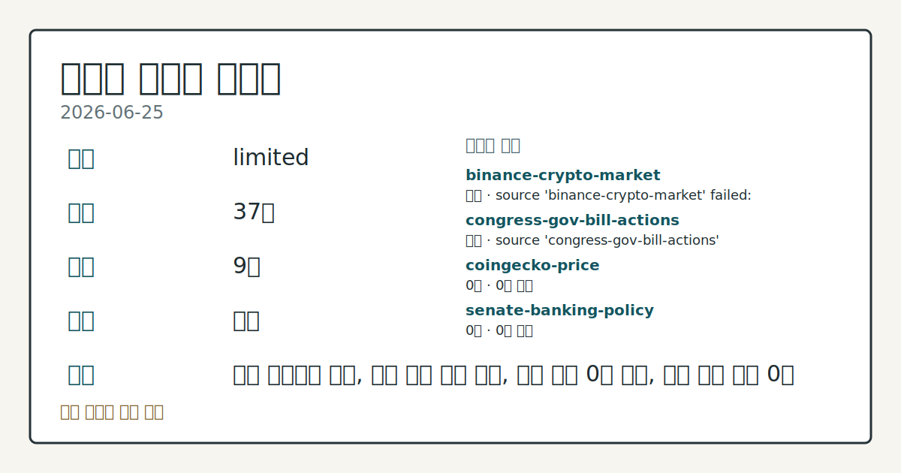
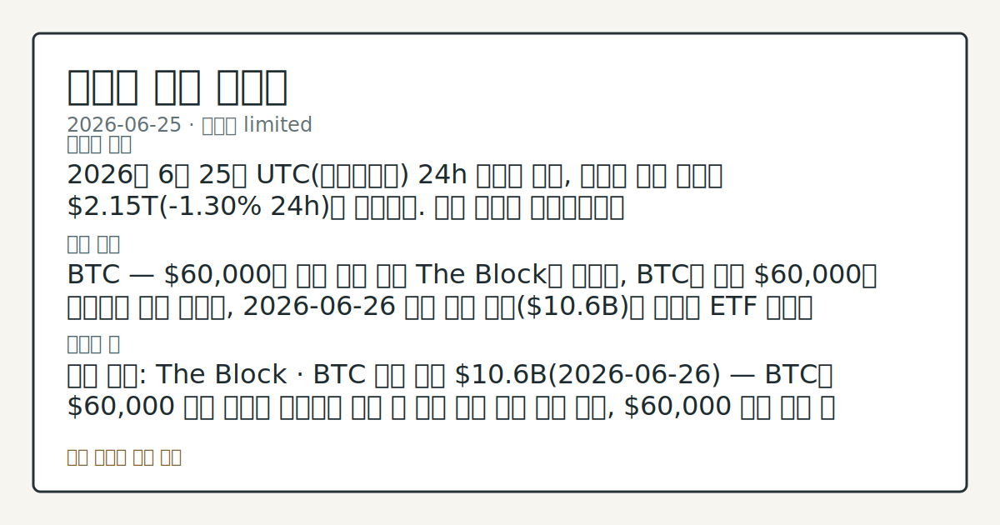

# 2026-06-25 크립토 시황
**기준 시각**: 2026-06-25 UTC · 2026-06-25T00:00Z, 2026-06-26T00:00Z)
| 종목 | 스냅샷(UTC 24h) | 구간 변동 | 비고 |
|------|------|------|------|
| BTC-USD | 59,689.99 | -2.14% | 0.00% from 52w low · -32.73% YTD |
| ETH-USD | 1,566.12 | -3.32% | 0.00% from 52w low · -47.80% YTD |
**세그먼트**: [국내 증시](../../../domestic-equity/2026/06/2026-06-25.md) | [미국 증시](../../../us-equity/2026/06/2026-06-25.md) | [크립토](2026-06-25.md)

*이미지: 데이터 신뢰도 · 출처: investo 자체 생성 · 생성: investo 0.1.0 · 2026-06-26 UTC*
> **내 관심 자산 영향**: 데이터 수집 부족으로 매칭 판단 보류 — 추가 수집 후 재평가됩니다.
> **오늘의 결론**: 2026년 6월 25일 UTC(협정세계시) 24h 스냅샷 기준, 크립토 전체 시총은 **$2.15T**(**-1.30%** 24h)로 하락했다. 수집 근거가 제한적입니다
> **핵심 동인**: BTC — **$60,000**대 초반 지지 점검 The Block에 따르면, BTC는 저점 **$60,000**대 초반으로 밀린 가운데, 2026-06-26 분기 옵션 만기(**$10.6B**)를 앞두고 ETF 순유출 **$469M** 및 네거티브 감마 포지션이 수급을 압박하고 있다.
> **주의할 점**: 확인 소스: The Block · BTC 분기 만기 **$10.6B**(2026-06-26) — BTC가 **$60,000** 수준 이상을 유지하면 본문 참고.
> 정보 제공용 자동 시황이며 가상자산 매매 권유가 아닙니다. 가상자산은 가격 변동성이 매우 큽니다.
## 한눈에 보기
2026년 6월 25일 UTC 24h 스냅샷 기준, 크립토 전체 시총은 **$2.15T**(**-1.30%** 24h)로 하락했다. 수집 근거가 제한적입니다
BTC — **$60,000**대 초반 지지 점검 The Block에 따르면, BTC는 저점 **$60,000**대 초반으로 밀린 가운데, 2026-06-26 분기 옵션 만기를 앞두고 ETF 순유출 **$469M** 및 네거티브 감마 포지션이 수급을 압박하고 있다.
확인 소스: The Block · BTC 분기 만기 **$10.6B**(2026-06-26) — BTC가 **$60,000** 수준 이상을 유지하면 만기 후 수급 흐름 개선 방향 확인, **$60,000** 이탈 지속 시 하방 가속 여부 관찰. 관심 영향: 전체 시총 **$2.15T** 방향성 변동 추세 점검. 확인 소스: The Block · ETF 자금 흐름 — ETF 순유입 전환 확인 시 수급 개선 상방 신호 관찰, 순유출 지속·확대 확인 시 하방 압력 연장 추세 비교. 관심 영향: BTC 도미
## ⓪ 오늘의 매크로
**국제 유가** — CFTC WTI crude oil managed_money net +96228 contracts
**미 국채 수익률** — UST curve 2026-06-25: 10Y 4.40%, 2Y10Y +0.31pp
## ⓪-A 크립토 지표 (UTC 24h 스냅샷)
| 지표 | 값 |
|------|------|
| 공포·탐욕 | 13 (Extreme Fear) |
| BTC 도미넌스 | 55.78% |
| 전체 시총 | $2.15T (-1.30% 24h) |
| BTC 펀딩비 | 0.0000064332007793 (okx) |
| BTC 미결제약정 | $447.1M (okx) |
| DeFi TVL | $69.9B |
| 스테이블코인 공급 | $312.9B |
| 24h 청산 / 거래소 순유출입 | 무료 검증 소스 미확정 |
## ⓪-B 채널 기준선
| 기준선 | 값 |
|------|------|
| 비트코인 | 59,689.99 (-2.14%) |
| 이더리움 | 1,566.12 (-3.32%) |
| BTC 도미넌스 | 55.78% |
| 공포·탐욕 | 13 |
| 펀딩/OI/청산 | 펀딩 0.0000064332007793 · OI 수집됨 |
| CFTC 코인 포지셔닝 | Bitcoin CME 순포지션 -6607계약 (-31.28% OI), 2026-06-16 기준/2026-06-22 공개 · Ether CME 순포지션 -6752계약 (-25.86% OI), 2026-06-16 기준/2026-06-22 공개 · 주간 지연 |
> **크로스마켓 연결 고리**: 유가/지정학 이슈가 여러 자산군의 변동성 연결 고리로 관찰됩니다. / 금리 이벤트가 할인율/달러 경로의 공통 변수로 남아 있습니다.
> **오늘의 큰 그림:** 이 세그먼트의 공통 신호는 제한적입니다. 본문 수급·지표 항목을 먼저 확인하세요.
## ① 요약

*이미지: 시장 스냅샷 · 출처: investo 자체 생성 · 생성: investo 0.1.0 · 2026-06-26 UTC*

2026년 6월 25일 UTC 24h 스냅샷 기준, 크립토 전체 시총은 **$2.15T**(**-1.30%** 24h)로 하락했다. BTC(비트코인)가 **$60,000**대 초반에서 취약한 지지를 타진하는 가운데, 2026-06-26 분기 만기(**$10.6B**)를 하루 앞두고 ETF(상장지수펀드) 순유출 **$469M** 및 네거티브 감마가 심리를 압박하고 있다. 공포·탐욕 지수 **13(Extreme Fear)**은 극단적 공포 구간으로, 지난 주 **$63,000**~**$64,000** 지지 붕괴 이후 하락 흐름이 **$60,000** 선까지 확대된 양상이다. [하락 관찰]

## ② 전일 핵심 이슈

### BTC — **$60,000**대 초반 지지 점검

[The Block](https://www.theblock.co/post/406112/waiting-for-buyers-bitcoin-holds-fragile-60k-floor-ahead-of-10-6b-quarterly-expiry)에 따르면, BTC는 저점 **$60,000**대 초반으로 밀린 가운데, 2026-06-26 분기 옵션 만기를 앞두고 ETF 순유출 **$469M** 및 네거티브 감마 포지션이 수급을 압박하고 있다. 직전 주 **$63,000**~**$64,000** 저항 미돌파 흐름에서 추가 하락이 관찰된 연장이다.

> **그래서 의미는?** 대규모 분기 만기 직전 파생 포지션이 하방을 가중시키는 국면으로, 수급 방향 확인이 필요한 상황입니다.

### Strategy STRC·MSTR — BTC 약세 파급

[The Block](https://www.theblock.co/post/406185/bitcoin-rout-strategy-strc-slides-26-below-par-mstr-shares-16-month-low)에 따르면, BTC 하락의 영향으로 Strategy의 우선증권 STRC가 액면 대비 **26%** 하회했으며, MSTR(MicroStrategy) 주식은 16개월 저점을 기록했다. Strategy는 STRC 등 우선증권 발행으로 BTC 추가 취득 자금을 조달해 온 구조이며, BTC 가격 약세가 관련 증권에 직접 파급되는 흐름이 확인된다.

### 미 상원 크립토 법안 — 7월 처리 일정 불강한

[The Block](https://www.theblock.co/post/406231/senate-races-advance-crypto-legislation-housing-bill-turmoil-threatens-timeline)에 따르면, 포괄적 암호화폐 법안이 상원 7월 처리를 목표로 하나 주택 법안 의사 진행 혼란이 일정을 위협하고 있다.

## ③ 섹터/수급 동향

### CFTC(미국 상품선물거래위원회) CME(시카고상업거래소) 포지셔닝

[CFTC 주간 보고서](https://www.cftc.gov/MarketReports/CommitmentsofTraders/index.htm)에 따르면, CME BTC 선물의 레버리지 머니 순포지션은 **-6,607 계약**(롱 6,077, 숏 12,684, 미결제약정(OI) 대비 **-31.3%**)이다. CME ETH(이더리움) 선물도 레버리지 머니 순포지션 **-6,752 계약**(롱 4,855, 숏 11,607, OI 대비 **-25.9%**)으로, BTC·ETH 양쪽 모두 순매도 우위다. 이 수치는 주간 단위 보고서 기준이며 장중 실시간 흐름과 다를 수 있다.

> **그래서 의미는?** 기관 레버리지 자금이 BTC·ETH 양쪽 모두 순매도 포지션을 유지하고 있어, 전문 투기 자금의 방향성 추세를 점검할 필요가 있습니다.

### DeFi(탈중앙화 금융) TVL(총 예치 자산) 및 스테이블코인

[DefiLlama](https://defillama.com/)에 따르면, DeFi TVL은 **$69.9B**으로 Ethereum이 **$37.0B** 선두이며 BSC **$5.0B**, Solana **$4.6B**, Tron **$4.5B**, Base **$4.0B** 순이다. 스테이블코인 총 공급은 **$312.9B**으로 USDT(테더) **$186.1B**, USDC **$73.8B**, USDS **$8.2B**, DAI **$4.9B**, USD1 **$4.7B** 구성이다.

### Invesco 토큰화 스테이블코인 리저브 섹터 진출

[The Block](https://www.theblock.co/post/406239/trillion-dollar-asset-manager-invesco-plant-flag-tokenized-stablecoin-reserve-sector)에 따르면, 자산운용사 Invesco가 토큰화 스테이블코인 리저브 섹터 진출을 추진 중이며, 해당 펀드는 미국 국채·레포·현금성 자산에 주로 투자해 NAV(순자산가치) **$1** 유지를 목표로 한다.

## ④ 지표·이벤트

### 크립토 파생 지표 (UTC 24h 스냅샷)

[CoinGecko](https://www.coingecko.com/en/global-charts) 기준 글로벌 크립토 시총 **$2,146,961,122,097**, BTC 도미넌스 **55.78%**. [Alternative.me](https://alternative.me/crypto/fear-and-greed-index/) 공포·탐욕 지수 **13/100(Extreme Fear)**. [OKX](https://www.okx.com/trade-swap/btc-usd-swap) 기준 BTC 미결제약정 **$447,053,950**, 펀딩비 **0.0000064332007793**. 24h 정리 및 거래소 순유출입은 무료 검증 소스 미확정으로 데이터 미수집이다.

> **그래서 의미는?** 공포 지수 13은 극단적 공포 구간으로, 심리 수축이 파생 지표 전반에 동시 반영된 상태입니다.

### CLARITY Act(디지털자산 혁신 명확화법) 하원 청문회

[하원 금융서비스위원회](http://financialservices.house.gov/calendar/eventsingle.aspx?EventID=411176) 현장 청문회 "Building the Future of Finance: How the CLARITY Act Unlocks Innovation"와 [법안 마크업 일정](http://financialservices.house.gov/calendar/eventsingle.aspx?EventID=411137)이 예정되어 있으며, SEC(미국 증권거래위원회)/CFTC 관할권 구분을 포함한 디지털 자산 시장 구조 논의가 지속되고 있다.

### Base 블록체인 체인 정지

[The Block](https://www.theblock.co/post/406213/coinbase-incubated-base-blockchain-suffers-unsafe-head-stall-interrupting-block-production)에 따르면, Coinbase 인큐베이팅 레이어-2 블록체인 Base가 unsafe head stall로 블록 생성이 중단됐으며, 입출금 및 거래 지연이 동반됐다. DeFi TVL 기준 Base의 **$4.0B** 예치 자산에 대한 접근성 영향이 단기 관찰 대상이다.

## ⑤ 주요 종목

<!-- u50 lightweight-charts-embed: placeholders consumed by site_docs/assets/investo-chart-init.js -->

<noscript><em>인터랙티브 차트는 JavaScript가 활성화된 환경에서 표시됩니다. 위 정적 카드가 동일한 정보를 담고 있습니다.</em></noscript>

BTC 하락 압력이 관련 상장 증권과 크립토 인프라 전반에 파급되는 가운데, M&A(인수합병) 및 스테이블코인 확장 움직임도 병행 확인된다.

> **그래서 의미는?** BTC 약세가 MSTR(MicroStrategy)·STRC 같은 관련 금융상품과 Base 블록체인 인프라에 동시 파급되는 양상이 관찰됩니다.

### 확인 항목

| 자산·종목 | 관찰 내용 | 출처 |
|----------|---------|------|
| BTC | $60,000대 초반 지지 여부, 분기 만기 **$10.6B**(2026-06-26) 전후 변동 | [The Block](https://www.theblock.co/post/406112/waiting-for-buyers-bitcoin-holds-fragile-60k-floor-ahead-of-10-6b-quarterly-expiry) |
| MSTR | 16개월 저점 기록 | [The Block](https://www.theblock.co/post/406185/bitcoin-rout-strategy-strc-slides-26-below-par-mstr-shares-16-month-low) |
| STRC | 액면 대비 **26%** 하회 | [The Block](https://www.theblock.co/post/406185/bitcoin-rout-strategy-strc-slides-26-below-par-mstr-shares-16-month-low) |
| Bitbank | SBI Holdings 인수 합의, **$288.6M** 규모, 2026년 10월경 완료 예정 | [The Block](https://www.theblock.co/post/406105/sbi-holdings-agrees-to-acquire-japanese-crypto-exchange-bitbank-in-288-6-million-deal) |
| AAVE | 창업자 Stani Kulechov, 70% 할인 매각 불가 공개 발언 | [The Block](https://www.theblock.co/post/406252/aave-stani-kulechov-says-aave-isnt-for-sale-at-70-discount-report-payward-bid) |
| RLUSD | Ripple, 일본 규제 승인 후 SBI VC Trade 통해 출시 | [The Block](https://www.theblock.co/post/406067/ripple-launches-rlusd-stablecoin-japan) |
| USDT0 | Tether 연동 스테이블코인, 거래량 **$100B** 돌파 | [The Block](https://www.theblock.co/post/405912/tether-pegged-usdt0-stablecoin-crosses-100-billion-transaction-volume-milestone) |
| HYPE | Multicoin Capital 리서치 보고서에서 중장기 전망 제시; 2025년 사용자 수 923,000명 기록 | [The Block](https://www.theblock.co/post/406212/multicoin-hype-hits-319-by-2028-hyperliquid-everything-exchange) |

## ⑥ 오늘의 관전 포인트

#### 관찰 신호: The Block · ETF 자금 흐름 —…

- 출처: The Block
- 현재: The Block
- 확인 조건: 상방 ETF 자금 흐름 — ETF 순유입 전환 확인 시 수급 개선 상방 신호 관찰; 하방 확대 확인 시 하방 압력 연장 추세 비교
- 신뢰도: 높음
- 관심 영향: BTC 도미넌스(**55.78%**) 방향 변화 확인.

#### 관찰 신호: The Block · 미 상원 크립토 법안…

- 출처: The Block
- 현재: The Block
- 확인 조건: 상방 미 상원 크립토 법안 7월 처리 일정 — 상원 일정 확정 소식 확인 시 입법 진전 상방 신호 관찰; 하방 주택 법안 충돌로 7월 처리 이탈 확인 시 규제 명확성 공백 연장 추세 확인
- 신뢰도: 낮음
- 관심 영향: 크립토 규제 환경 방향성 변화 추세 살피기.

> **데이터 상태**: 제한

수집/품질 진단

> **데이터 상태**: 제한 — 수집 37건 / 소스 9개 / 누락: 가격 · 제한 — 핵심 가격 소스 0건/실패/stale, 본문 결론 신뢰도 낮음
> **소스 카운트**: 수집 대상 14 / 성공 9 / 수집 상세는 진단 섹션에서 확인할 수 있습니다. / 수집 상세는 진단 섹션에서 확인할 수 있습니다. / 수집 상세는 진단 섹션에서 확인할 수 있습니다.
> **소스 등급 분포**: S=3 / A=2 / B=4
> **상세 사유**: 가격 카테고리 누락, 일부 소스 수집 실패, 일부 소스 0건 반환, 핵심 가격 소스 0건
> **소스별 상태**: binance-crypto-market 실패 (접근 제한), congress-gov-bill-actions 실패 (설정 미완료(미수집)), coingecko-price 0건, senate-banking-policy 0건, stooq-price 0건, 정상 9개

## ⑦ 면책조항
본 시황은 일반 정보 제공을 목적으로 자동 생성된 자료이며,
특정 가상자산에 대한 매매 권유나 투자 자문이 아닙니다.
가상자산은 가상자산이용자보호법(2024-07-19 시행) §10·§19의 적용 대상으로,
24시간 거래되는 비제도권 자산이며 가격 변동성이 매우 크고 원금 전액 손실이 가능합니다.
투자 결정과 그 결과에 대한 책임은 전적으로 본인에게 있으며,
본 시황의 내용에 따라 발생한 손실에 대해 작성자는 일체의 책임을 지지 않습니다.