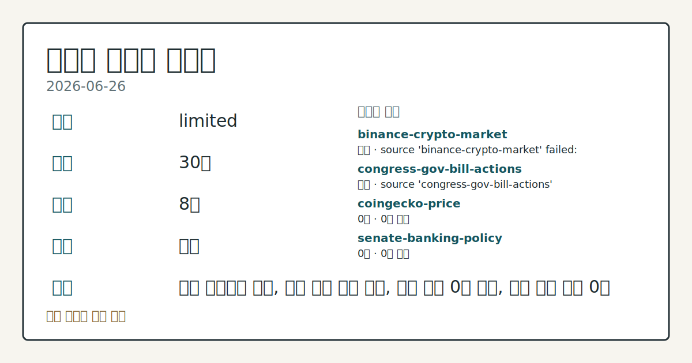
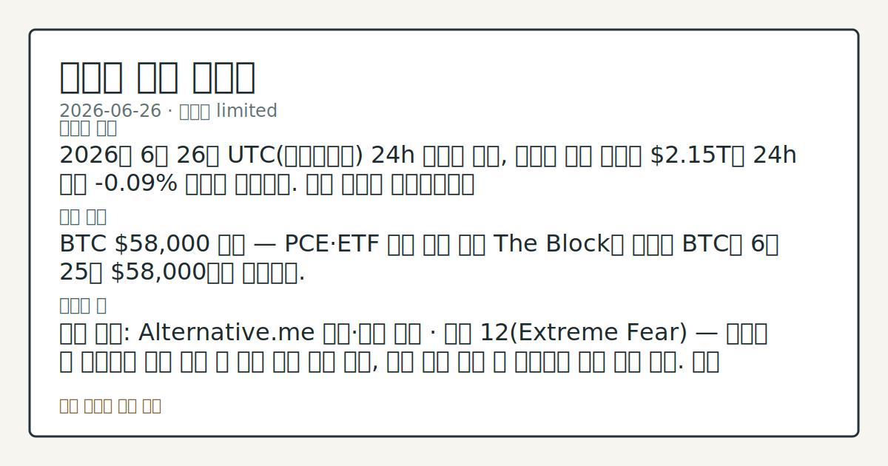

# 2026-06-26 크립토 시황
**기준 시각**: 2026-06-26 UTC · 2026-06-26T00:00Z, 2026-06-27T00:00Z)
| 종목 | 스냅샷(UTC 24h) | 구간 변동 | 비고 |
|------|------|------|------|
| BTC-USD | 59,192.91 | -0.57% | 0.00% from 52w low · -33.29% YTD |
| ETH-USD | 1,566.71 | -0.23% | +0.12% from 52w low · -47.78% YTD |
**세그먼트**: [국내 증시](../../../domestic-equity/2026/06/2026-06-26.md) | [미국 증시](../../../us-equity/2026/06/2026-06-26.md) | [크립토](2026-06-26.md)

*이미지: 데이터 신뢰도 · 출처: investo 자체 생성 · 생성: investo 0.1.0 · 2026-06-29 UTC*
> **내 관심 자산 영향**: 데이터 수집 부족으로 매칭 판단 보류 — 추가 수집 후 재평가됩니다.
> **오늘의 결론**: 2026년 6월 26일 UTC(협정세계시) 24h 스냅샷 기준, 크립토 전체 시총은 **$2.14T**로 **-0.74%** 하락했다. 수집 근거가 제한적입니다
> **핵심 동인**: 이번 UTC 24h 구간에서 크립토 시장의 핵심 이슈는 Base 체인 이중 메인넷 스톨과 Strategy 우선주 사상 최저가 갱신으로 요약된다.
> **주의할 점**: 확인 소스: Alternative.me · 공포·탐욕 지수 현재 12(극단적 공포) — 지수가 12 상회 시 심리 저점 이탈 신호 관찰, 12 이하 본문 참고.
> 정보 제공용 자동 시황이며 가상자산 매매 권유가 아닙니다. 가상자산은 가격 변동성이 매우 큽니다.
## 한눈에 보기
크립토 전체 시총 **-0.74%** 하락해 **$2.14T**, 공포·탐욕 지수(Fear & Greed Index) **12**(극단적 공포) 지속
SOL(솔라나)이 UTC 24h 구간 **+9%** 급등, Sol Strategies(STKE) **+22%** 상승해 고점 **$1.20** 기록
CFTC(미상품선물거래위원회) 주간 BTC CME(시카고상품거래소) 레버리지 머니 순포지션 **-6,130**계약(**-29.8%** of OI) — §③ 수급 추세 점검
## ⓪ 오늘의 매크로
**미 국채 수익률** — UST curve 2026-06-26: 10Y 4.38%, 2Y10Y +0.31pp
## ⓪-A 크립토 지표 (UTC 24h 스냅샷)
| 지표 | 값 |
|------|------|
| 공포·탐욕 | 12 (Extreme Fear) |
| BTC 도미넌스 | 55.62% |
| 전체 시총 | $2.14T (-0.74% 24h) |
| BTC 펀딩비 | 0.0001000000000000 (okx) |
| BTC 미결제약정 | $477.6M (okx) |
| DeFi TVL | $70.5B |
| 스테이블코인 공급 | $312.4B |
| 24h 청산 / 거래소 순유출입 | 무료 검증 소스 미확정 |
## ⓪-B 채널 기준선
| 기준선 | 값 |
|------|------|
| 비트코인 | 59,192.91 (-0.57%) |
| 이더리움 | 1,566.71 (-0.23%) |
| BTC 도미넌스 | 55.62% |
| 공포·탐욕 | 12 |
| 펀딩/OI/청산 | 펀딩 0.0001000000000000 · OI 수집됨 |
| CFTC 코인 포지셔닝 | Bitcoin CME 순포지션 -6130계약 (-29.82% OI), 2026-06-23 기준/2026-06-26 공개 · Ether CME 순포지션 -4977계약 (-19.14% OI), 2026-06-23 기준/2026-06-26 공개 · 주간 지연 |
> **크로스마켓 연결 고리**: 금리 이벤트가 할인율/달러 경로의 공통 변수로 남아 있습니다.
> **오늘의 큰 그림:** 금리와 달러 변수가 공통 변수지만, BTC·ETH 유동성를 먼저 확인해야 합니다.
## ① 요약

*이미지: 시장 스냅샷 · 출처: investo 자체 생성 · 생성: investo 0.1.0 · 2026-06-29 UTC*

2026년 6월 26일 UTC 24h 스냅샷 기준, 크립토 전체 시총은 **$2.14T**로 **-0.74%** 하락했다. 공포·탐욕 지수는 **12**(극단적 공포)로, 최근 5영업일간 이어진 심리 위축 흐름이 이 구간에서도 지속됐다. BTC(비트코인) 도미넌스는 **55.62%**를 유지하며 알트코인 대비 상대적 강세를 보였으나, CME 파생시장에서는 레버리지 머니가 BTC·ETH(이더리움) 모두에서 대규모 순매도를 기록해 기관 포지셔닝은 방어적이었다. SOL이 이 구간 **+9%** 급등하며 시장 평균 대비 독립적 상승 흐름을 보여 신호가 엇갈렸다. Base(베이스) L2(레이어2) 체인이 이틀 연속 메인넷 블록 생성 중단을 겪었고, Strategy의 BTC 레버리지 프리미엄 소멸도 주목받았다. [혼재]

## ② 전일 핵심 이슈

이번 UTC 24h 구간에서 크립토 시장의 핵심 이슈는 Base 체인 이중 메인넷 스톨과 Strategy 우선주 사상 최저가 갱신으로 요약된다. 어제(2026-06-25)까지 이어진 BTC 지지 점검 흐름에서 구조적 전환은 확인되지 않았으며, 극단적 공포 심리와 기관 파생 순매도 포지셔닝이 이 구간도 계속됐다.

> **그래서 의미는?** L2 인프라 반복 장애와 BTC 레버리지 프리미엄 소멸이 동시에 부각돼, 온체인·오프체인 양면에서 시장 신뢰도를 재점검하는 흐름이 이어지고...

### Base 체인 이틀 연속 메인넷 스톨

[Base 메인넷은 UTC 15:33 블록 생성 중단 경보 발령 후 16:11에 재개](https://www.theblock.co/post/406409/base-suffers-second-mainnet-stall-in-two-days)됐다. 이는 이틀 연속으로 발생한 동일 유형의 장애로, DeFi TVL(탈중앙화금융 총예치금) 기준 상위 5위 체인(TVL **$4.1B**)인 Base의 온체인 활동 연속성과 인프라 신뢰도에 대한 점검이 부각됐다.

### Strategy STRC 사상 최저치 및 업계 반응

[Strategy의 우선주 STRC는 장중 사상 최저치 **$71.40**까지 하락](https://www.theblock.co/post/406438/strategy-loses-bitcoin-premium-enterprise-mnav-dips-below-1)하며 액면가 대비 약 **25%** 할인 상태에 접근했다. 기업 mNAV(시장가치/순자산가치 배수)가 1 아래로 하락하면서 BTC 보유 프리미엄이 소멸됐다는 평가가 나왔다. [Ripple CEO 가링하우스는 "금융 엔지니어링은 장기 가치를 창출하지 않으며, 디지털 자산의 장기 가치는 실용성(utility)에 의해 결정된다"](https://www.theblock.co/post/406432/ripple-ceo-says-michael-saylor-has-hurt-crypto-market-as-strategys-strc-trades-25-below-par)며 Strategy 모델에 비판적 시각을 표명했다.

## ③ 섹터/수급 동향

### CFTC CME 선물: BTC·ETH 동반 순매도 포지셔닝

[CFTC 주간 COT(트레이더 포지션 보고서)](https://www.cftc.gov/MarketReports/CommitmentsofTraders/index.htm)에 따르면, BTC CME 레버리지 머니는 롱 4,925계약·숏 11,055계약으로 순포지션 **-6,130**계약이다. ETH CME 레버리지 머니도 롱 5,617계약·숏 10,594계약으로 순포지션 **-4,977**계약을 기록했다. 이 데이터는 주간 기준 스냅샷으로, 인트라데이 흐름을 반영하지 않는다.

> **그래서 의미는?** 기관 레버리지 머니가 BTC·ETH 모두에서 대규모 순매도를 유지하고 있어, 공포·탐욕 지수 극단적 공포와 함께 파생시장 수급 방향성 비교가...

### DeFi TVL 및 스테이블코인 공급

[DeFiLlama](https://defillama.com/)에 따르면 DeFi TVL은 **$70.5B**이며, 체인별 상위는 Ethereum **$37.4B**, Solana **$5.0B**, BSC(바이낸스 스마트 체인) **$4.8B**, Tron **$4.4B**, Base **$4.1B** 순이다. 스테이블코인 공급은 **$312.4B**로, USDT **$184.9B**, USDC **$73.9B**, USDS **$8.2B**, DAI **$4.8B**, USD1 **$4.7B** 순이다. 24h 정리 규모 및 거래소 순유출입은 무료 검증 소스 미확정으로 데이터 미수집이다.

## ④ 지표·이벤트

### 크립토 시장 핵심 지표

[CoinGecko(코인게코)](https://www.coingecko.com/en/global-charts) 기준 전체 시총은 **$2,142,822,222,778**이며, BTC 도미넌스는 **55.62%**다. [Alternative.me 공포·탐욕 지수](https://alternative.me/crypto/fear-and-greed-index/)는 **12/100**(극단적 공포)를 기록했다. [OKX](https://www.okx.com/trade-swap/btc-usd-swap) 기준 BTC 미결제약정(Open Interest)은 **$477,612,440**, 펀딩비는 **0.0001**이다. 24h 정리 규모 및 거래소 순유출입은 무료 검증 소스 미확정으로 데이터 미수집이다.

> **그래서 의미는?** 펀딩비가 낮아 롱 포지션 비용 부담은 적지만, CME 대규모 순매도와 극단적 공포 지수 **12**의 조합은 파생시장 수급이 현물 심리보다...

### 미 하원 금융서비스위원회 디지털 자산 입법 일정

[미 하원 금융서비스위원회(House Financial Services Committee)](http://financialservices.house.gov/calendar/eventsingle.aspx?EventID=411176)는 CLARITY Act(클래리티법 — 디지털 자산 시장 구조 및 혁신 관련 법안) 현장 청문회 "Building the Future of Finance: How the CLARITY Act Unlocks Innovation"를 개최했다. 위원회는 [복수의 법안 마크업(markup · 심의 및 수정)](http://financialservices.house.gov/calendar/eventsingle.aspx?EventID=411137)도 함께 진행했으며, [자본시장 소위원회는 진화하는 투자 환경과 시장 규제를 점검](http://financialservices.house.gov/news/documentsingle.aspx?DocumentID=411184)했다. 이는 미국 디지털 자산 관련 입법 논의가 구체적인 마크업 단계로 진행 중임을 보여주는 공식 일정이다.

## ⑤ 주요 종목

<!-- u50 lightweight-charts-embed: placeholders consumed by site_docs/assets/investo-chart-init.js -->

<noscript><em>인터랙티브 차트는 JavaScript가 활성화된 환경에서 표시됩니다. 위 정적 카드가 동일한 정보를 담고 있습니다.</em></noscript>

이번 UTC 24h 구간에서는 SOL과 관련 상장 주식이 시장 평균 대비 상승 이탈을 보인 반면, BTC·ETH는 CME 파생시장에서 방어적 포지셔닝이 확인됐다.

> **그래서 의미는?** SOL·STKE(Sol Strategies)의 동반 상승은 솔라나 생태계 관련 자산의 독립적 흐름을 확인하는 관찰 지점이며, BTC·ETH의...

### 상승 관찰

| 자산 / 종목 | 구간 내 변동 | 비고 |
|---|---|---|
| SOL | **+9%** | UTC 24h 구간 기준 |
| STKE  | **+22%**, 고점 **$1.20** | SOL 연동 크립토 트레저리 주식 |

### 확인 항목

| 자산 / 종목 | 관찰 내용 |
|---|---|
| BTC | 도미넌스 **55.62%** 유지, CME 레버리지 머니 순포지션 **-6,130**계약 |
| ETH | CME 레버리지 머니 순포지션 **-4,977**계약 |
| STRC (Strategy 우선주) | 장중 사상 최저 **$71.40**, 액면가 대비 약 **25%** 할인 |

## ⑥ 오늘의 관전 포인트

#### 관찰 신호: CFTC COT · BTC CME 레버리지…

- 출처: CFTC COT
- 현재: CFTC COT
- 확인 조건: 상방 **-6,130** 이하로 확대 시 파생 하방 압력 심화 비교; 하방 BTC CME 레버리지 머니 순포지션 **-6,130**계약 — 다음 주간 보고에서 순포지션이 **-6,130** 위로 개선되면 기관 방어적 포지셔닝 완화 추세 확인
- 신뢰도: 보통
- 관심 영향: CME 수급과 현물 BTC 방향성 비교.

> **데이터 상태**: 제한

수집/품질 진단

> **데이터 상태**: 제한 — 수집 21건 / 소스 8개 / 누락: 가격 · 제한 — 핵심 가격 소스 0건/실패/stale, 본문 결론 신뢰도 낮음
> **소스 카운트**: 수집 대상 14 / 성공 9 / 수집 상세는 진단 섹션에서 확인할 수 있습니다. / 수집 상세는 진단 섹션에서 확인할 수 있습니다. / 수집 상세는 진단 섹션에서 확인할 수 있습니다.
> **소스 등급 분포**: S=3 / A=2 / B=4
> **상세 사유**: 가격 카테고리 누락, 일부 소스 수집 실패, 일부 소스 0건 반환, 핵심 가격 소스 0건
> **소스별 상태**: binance-crypto-market 실패 (접근 제한), congress-gov-bill-actions 실패 (설정 미완료(미수집)), coingecko-price 0건, senate-banking-policy 0건, stooq-price 0건, 정상 9개

## ⑦ 면책조항
본 시황은 일반 정보 제공을 목적으로 자동 생성된 자료이며,
특정 가상자산에 대한 매매 권유나 투자 자문이 아닙니다.
가상자산은 가상자산이용자보호법(2024-07-19 시행) §10·§19의 적용 대상으로,
24시간 거래되는 비제도권 자산이며 가격 변동성이 매우 크고 원금 전액 손실이 가능합니다.
투자 결정과 그 결과에 대한 책임은 전적으로 본인에게 있으며,
본 시황의 내용에 따라 발생한 손실에 대해 작성자는 일체의 책임을 지지 않습니다.