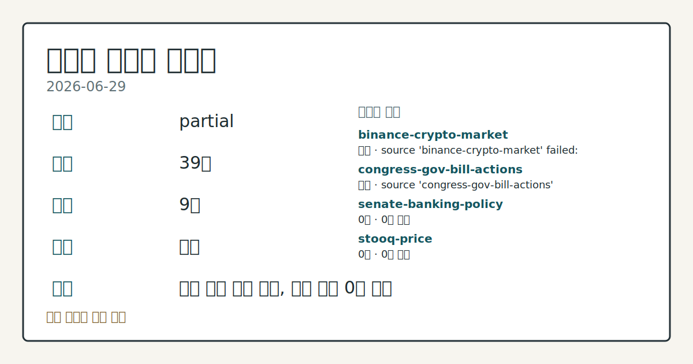
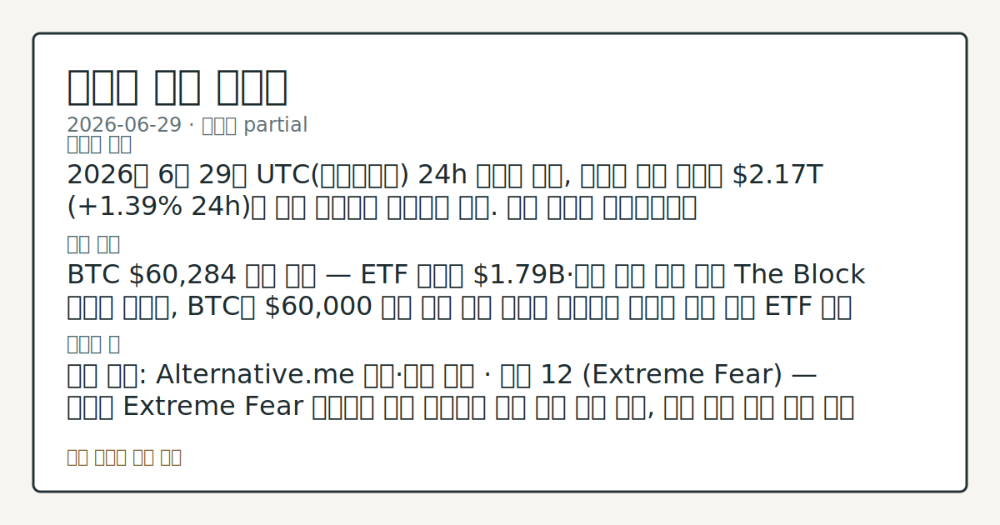
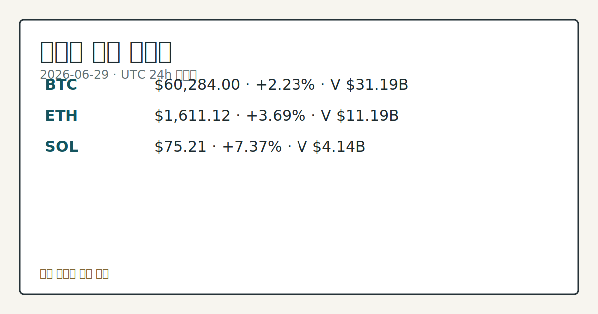

# 2026-06-29 크립토 시황
**기준 시각**: 2026-06-29 UTC · 2026-06-29T00:00Z, 2026-06-30T00:00Z)
| 종목 | 스냅샷(UTC 24h) | 구간 변동 | 비고 |
|------|------|------|------|
| BTC-USD | 60,284.41 | +1.26% | +1.26% from 52w low · -32.06% YTD |
| ETH-USD | 1,611.30 | +2.61% | +2.97% from 52w low · -46.30% YTD |
**세그먼트**: [국내 증시](../../../domestic-equity/2026/06/2026-06-29.md) | [미국 증시](../../../us-equity/2026/06/2026-06-29.md) | [크립토](2026-06-29.md)

*이미지: 데이터 신뢰도 · 출처: investo 자체 생성 · 생성: investo 0.1.0 · 2026-06-29 UTC*
> **내 관심 자산 영향**: 15건 확인 (기본 바스켓) — BTC: 직접 관련 · [cftc-cot-positioning] CFTC Bitcoin CME leveraged_money net -6130 contracts; BTC: 직접 관련 · [coingecko-global-market] Global crypto market cap **$2,172,148,172,995**; BTC dominance **55.63%**; BTC: 직접 관련 · [coingecko-price] BTC **$60,284.00** (**+2.23%**); BTC: 직접 관련 · [okx-derivatives] BTC 미결제약정 **$473,956,460** (OKX, UTC 24h); BTC: 직접 관련 · [okx-derivatives] BTC 펀딩비 0.0001000000000000 (OKX, UTC 24h) 외
> **오늘의 결론**: 2026년 6월 29일 UTC(협정세계시) 24h 스냅샷 기준, 크립토 전체 시총은 **$2.17T** (**+1.39%** 24h)로 소폭 회복세를 이어가고 있다. 수집 근거가 제한적입니다
> **핵심 동인**: BTC **$60,284** 지지 유지 — ETF 순유출 **$1.79B**·연준 인상 기대 교차 The Block 보도에 따르면, BTC는 **$60,000** 부근 주요 지지 구간을 유지하는 가운데 미국 스팟 ETF 주간 순유출이 **$1.79B**를 기록했다.
> **주의할 점**: 확인 소스: Alternative.me 공포·탐욕 지수 · 현재 12 (Extreme Fear) — 지수가 Extreme Fear 구간에서 상승 본문 참고.
> 정보 제공용 자동 시황이며 가상자산 매매 권유가 아닙니다. 가상자산은 가격 변동성이 매우 큽니다.
## 한눈에 보기
BTC **+2.23%**, ETH **+3.69%**, SOL **+7.37%** 동반 상승, 전체 시총 **$2.17T** (**+1.39%** 24h) 기록
미국 스팟 BTC ETF(상장지수펀드) 주간 순유출 **$1.79B** — BTC가 **$60,284.00** 지지선을 유지하면서도 기관 자금 이탈이 병존하는 괴리 국면 관찰
공포·탐욕 지수 **12** (Extreme Fear) 극단치 지속 — 가격 반등에도 심리 회복이 제한적인 이유는 §② 참조
## ⓪ 오늘의 매크로
**FOMC 일정** — 2026-07-08 — FOMC Minutes
**미 국채 수익률** — UST curve 2026-06-29: 10Y 4.38%, 2Y10Y +0.28pp
## ⓪-A 크립토 지표 (UTC 24h 스냅샷)
| 지표 | 값 |
|------|------|
| 공포·탐욕 | 12 (Extreme Fear) |
| BTC 도미넌스 | 55.63% |
| 전체 시총 | $2.17T (+1.39% 24h) |
| BTC 펀딩비 | 0.0001000000000000 (okx) |
| BTC 미결제약정 | $474.0M (okx) |
| DeFi TVL | $71.2B |
| 스테이블코인 공급 | $311.7B |
| 24h 청산 / 거래소 순유출입 | 무료 검증 소스 미확정 |
## ⓪-B 채널 기준선
| 기준선 | 값 |
|------|------|
| 비트코인 | 60,284.41 (+1.26%) |
| 이더리움 | 1,611.30 (+2.61%) |
| BTC 도미넌스 | 55.63% |
| 공포·탐욕 | 12 |
| 펀딩/OI/청산 | 펀딩 0.0001000000000000 · OI 수집됨 |
| CFTC 코인 포지셔닝 | Bitcoin CME 순포지션 -6130계약 (-29.82% OI), 2026-06-23 기준/2026-06-26 공개 · Ether CME 순포지션 -4977계약 (-19.14% OI), 2026-06-23 기준/2026-06-26 공개 · 주간 지연 |
> **크로스마켓 연결 고리**: 금리 이벤트가 할인율/달러 경로의 공통 변수로 남아 있습니다.
> **오늘의 큰 그림:** 금리와 달러 변수가 공통 변수지만, BTC·ETH 유동성를 먼저 확인해야 합니다.
## ① 요약

*이미지: 시장 스냅샷 · 출처: investo 자체 생성 · 생성: investo 0.1.0 · 2026-06-29 UTC*

2026년 6월 29일 UTC 24h 스냅샷 기준, 크립토 전체 시총은 **$2.17T** (**+1.39%** 24h)로 소폭 회복세를 이어가고 있다. BTC(비트코인)는 **$60,284.00** (**+2.23%**)에서 주요 지지 구간을 유지하고, ETH(이더리움)는 **$1,611.12** (**+3.69%**), SOL(솔라나)는 **$75.21** (**+7.37%**)로 알트코인의 단기 반등폭이 더 두드러졌다. 그러나 공포·탐욕 지수는 **12** (Extreme Fear)에 머물러 심리 회복은 제한적이며, 미국 스팟 BTC ETF 주간 순유출 **$1.79B**와 CFTC(상품선물거래위원회) CME(시카고상업거래소) 레버리지 머니의 BTC·ETH 순매도 포지셔닝이 가격 상승과 대조를 이루고 있다. 2026년 6월 22일 이후 이어진 **$60,000**대 지지선 점검 흐름은 오늘도 연장된 양상이다. [혼재]

## ② 전일 핵심 이슈

### BTC **$60,284** 지지 유지 — ETF 순유출 **$1.79B**·연준 인상 기대 교차

[The Block 보도](https://www.theblock.co/post/406516/bitcoin-clings-to-key-support-level-as-weekly-us-spot-etf-outflows-hit-1-8b-and-fed-rate-hike-bets-mount-analysts)에 따르면, BTC는 **$60,000** 부근 주요 지지 구간을 유지하는 가운데 미국 스팟 ETF 주간 순유출이 **$1.79B**를 기록했다. AI(인공지능) 섹터 매도세와 연준(Federal Reserve) 금리 인상 가능성 재부상이 위험자산 전반의 투자심리를 억누르고 있다고 분석가들은 설명한다. UST(미국채) 10Y 금리가 **4.38%** 수준을 유지하는 상황은 크립토 고위험 자산의 할인율 상승 우려로 이어지며, 연준 통화정책 경로의 직접적인 크립토 세그먼트 영향으로 관찰된다. 연준 의장 Kevin Warsh(케빈 워시) 체제 하에서의 금리 결정 방향성이 지속 관찰 대상으로 남아 있다.

> **그래서 의미는?** ETF 대규모 순유출과 레버리지 매도 포지션 동시 증가는 기관 수요 회복 여부를 확인할 필요가 있음을 시사합니다.

### 크립토 규제 동향 — CLARITY Act·UK FCA·SEC 집행

미국 하원 금융서비스위원회(House Financial Services Committee)는 [CLARITY Act(디지털자산 시장구조법안) 관련 현장 청문회](http://financialservices.house.gov/calendar/eventsingle.aspx?EventID=411176)와 [다양한 법안 마크업](http://financialservices.house.gov/calendar/eventsingle.aspx?EventID=411137) 일정을 진행 중이다. TD Cowen은 [중간선거 전 CLARITY Act 통과가 "far from assured"라고 평가](https://www.theblock.co/post/406621/td-cowen-crypto-market-structure-bill-clarity-act)했으며, Galaxy Research는 [2026년 내 통과 가능성을 50%로 하향 조정](https://www.theblock.co/post/406497/galaxy-cuts-clarity-act-passage-odds-50)했다. 영국 FCA(금융감독청)는 [자본·스테이블코인·시장남용 규제를 포함한 크립토 프레임워크를 확정](https://www.theblock.co/post/406546/uk-sets-capital-market-abuse-rules-landmark-crypto-framework)했으며 2027년 10월 시행 예정이다. SEC(증권거래위원회)는 [NanoBit 사기 사건을 최종 판결로 종결](https://www.theblock.co/post/406613/sec-wraps-up-nanobit-crypto-fraud-case-final-judgment-ordering-5-million-fines)하며 **$5M** 이상의 벌금을 부과했다.

## ③ 섹터/수급 동향

### DeFi TVL 및 스테이블코인 공급 현황

[DeFiLlama](https://defillama.com/) 기준 DeFi(탈중앙화 금융) TVL(총예치가치)은 **$71.2B**이며, Ethereum이 **$37.9B**로 선두를 유지 중이다. Solana **$4.9B**, BSC **$4.9B**, Tron **$4.5B**, Base **$4.2B** 순으로 뒤를 잇는다. 스테이블코인 전체 공급은 **$311.7B**로 USDT가 **$184.5B**, USDC가 **$73.9B**를 차지하며, 인도에서는 당국의 크립토 송금 단속으로 [USDT 프리미엄이 **8.5%**를 상회](https://www.theblock.co/post/406502/indias-usdt-premium-tops-8-5-as-crypto-remittance-crackdown-squeezes-stablecoin-supply-report)하는 지역별 왜곡이 보고됐다.

> **그래서 의미는?** Ethereum 기반 DeFi TVL 집중은 ETH 생태계 수요의 구조적 기반으로 관찰되며, 인도 USDT 프리미엄 이상 급등은 특정 지역의...

### CFTC COT(트레이더 포지셔닝 보고서) — BTC·ETH 레버리지 머니 순매도 포지션

[CFTC](https://www.cftc.gov/MarketReports/CommitmentsofTraders/index.htm) 주간 보고서 기준, BTC CME 레버리지 머니 순포지션은 **-6,130** 계약(롱 4,925 / 숏 11,055, OI(미결제약정) 대비 **-29.8%**)으로 매도 우위가 확인된다. ETH CME 레버리지 머니 순포지션도 **-4,977** 계약(롱 5,617 / 숏 10,594, OI 대비 **-19.1%**)으로 동일한 방향성이다. 이는 주간 단위 포지셔닝 데이터로 당일 장중 흐름을 반영하지 않는다.

### 기관 수급 배경

[JPMorgan](https://www.theblock.co/post/406599/jpmorgan-execs-draw-comparison-between-yield-stablecoins-shadow-banking) 임원진은 이자 지급형 스테이블코인이 "shadow banking(그림자금융)" 위험을 내포한다고 언급했다. BlackRock의 Aladdin 플랫폼은 [Ethena의 스테이블코인 상품(USDe)에 대한 기관 지원을 확대](https://www.theblock.co/post/405670/blackrock-ethena-partnership-usde)했다. Binance 창업자 CZ는 [EU MiCA(암호자산시장법) 신청이 정치적 개입 전 승인 단계에 근접했다](https://www.theblock.co/post/406554/binance-founder-cz-mica-application-fully-compliant-near-approval-political-forces-intervened)고 밝혔다.

## ④ 지표·이벤트

### 크립토 핵심 지표

[Alternative.me](https://alternative.me/crypto/fear-and-greed-index/) 공포·탐욕(Fear & Greed) 지수는 **12** (Extreme Fear)로 2026년 6월 하순 이후 극단적 공포 구간이 지속 중이다. BTC 도미넌스(전체 시총 내 BTC 비중)는 **55.63%**이다. [OKX](https://www.okx.com/trade-swap/btc-usd-swap) 기준 BTC 미결제약정은 **$473,956,460**, BTC 펀딩비는 **0.0001**로 중립에 수렴하는 수준이다. 24h 정리 규모 및 거래소 순유출입은 무료 검증 소스 미확정으로 데이터 미수집 상태다.

> **그래서 의미는?** 공포 지수 극단치와 낮은 펀딩비의 병존은 파생상품 시장이 방향성 베팅보다 중립·관망 상태에 가까움을 시사하며, 추가 변동 신호 출현 여부를...

### UST 금리 곡선 (2026-06-29 기준)

[미국 재무부](https://home.treasury.gov/resource-center/data-chart-center/interest-rates) 기준 3M **3.87%**, 2Y **4.10%**, 10Y **4.38%**, 30Y **4.86%**이며, 2Y10Y(장단기 금리 스프레드) **+0.28pp**, 3M10Y **+0.51pp**로 수익률 곡선은 우상향 구조를 유지하고 있다. 연준의 금리 정책 기조는 크립토 위험자산 수급에 직접적인 영향을 미치는 통화정책 경로로 분류된다.

## ⑤ 주요 종목

<!-- u50 lightweight-charts-embed: placeholders consumed by site_docs/assets/investo-chart-init.js -->

<noscript><em>인터랙티브 차트는 JavaScript가 활성화된 환경에서 표시됩니다. 위 정적 카드가 동일한 정보를 담고 있습니다.</em></noscript>

*이미지: 가격 스냅샷 · 출처: investo 자체 생성 · 생성: investo 0.1.0 · 2026-06-29 UTC*

### 가격 동향 확인 (UTC 24h 스냅샷)

| 자산 | 가격 | 24h 변동 | 24h 범위 |
|------|------|----------|----------|
| BTC | $60,284.00 | +2.23% | $58,935.00 – $60,644.00 |
| ETH | $1,611.12 | +3.69% | $1,553.81 – $1,630.03 |
| SOL | $75.21 | +7.37% | $70.05 – $75.93 |

> **그래서 의미는?** SOL의 단기 반등폭이 BTC(비트코인)·ETH를 상회하고 있으나, 공포·탐욕 지수 **12** (Extreme Fear) 수준에서 반등의...

### 기관·기업 동향 체크리스트

[The Block](https://www.theblock.co/post/406538/bitmine-lifts-ethereum-treasury-to-5-7-million-eth-through-challenging-weekly-slide-joins-russell-1000)에 따르면 Bitmine은 지난주 ETH 27,084개를 추가 확보해 총 보유량 **5.70M** ETH를 기록했으며 Russell 1000 지수에 포함됐다. Strategy는 [BTC 신규 매수를 일시 중단](https://www.theblock.co/post/406512/strategy-buys-btc-mstr-strc-collapse-bitcoin-holdings-underwater)하고 **$1B** 규모의 디지털 크레딧 자사주 매입 프로그램을 발표했으며, BTC 보유량은 847,363 BTC(전체 공급량의 4% 이상), USD 준비금은 **$2.5B** 초과로 유지되고 있다. BNY(뱅크오브뉴욕멜론)와 Circle은 [USDC 발행·소각 기능 확대 파트너십](https://www.theblock.co/post/406581/bny-circle-expand-partnership-adding-mint-burn-capabilities-usdc)을 체결했다.

### 실적·규제 확인 항목

Strategy의 MSTR·STRC 주가는 [지난주 급락 이후 자사주 매입 발표를 계기로 회복 흐름](https://www.theblock.co/post/406568/strategy-mstr-strc-shares-recover-after-brutal-week-saylor-unveils-new-buyback-plans)을 보이고 있으며, Bitcoin 보유분의 수익성 추이는 지속 관찰 대상이다.

## ⑥ 오늘의 관전 포인트

#### 관찰 신호: CoinGecko BTC · UTC 24h…

- 출처: CoinGecko BTC
- 현재: CoinGecko BTC
- 확인 조건: 상방 UTC 24h 고가 **$60,644** / 저가 **$58,935** — BTC가 **$60,644** 저항을 상회하면 단기 회복 흐름 확인; 하방 **$58,935** 지지를 이탈하면 방어적 수급 관찰
- 신뢰도: 높음
- 관심 영향: ETF 주간 순유출 **$1.79B** 흐름과 연계해 기관 수요 추이 점검.

> **데이터 상태**: 부분

수집/품질 진단

> **데이터 상태**: 부분 — 수집 39건 / 소스 9개 / 누락: 없음 · 부분 — 일부 카테고리 미수집, 본문 일부 결론 보강 필요
> **소스 카운트**: 수집 대상 14 / 성공 10 / 수집 상세는 진단 섹션에서 확인할 수 있습니다. / 수집 상세는 진단 섹션에서 확인할 수 있습니다. / 수집 상세는 진단 섹션에서 확인할 수 있습니다.
> **소스 등급 분포**: S=3 / A=2 / B=5
> **상세 사유**: 일부 소스 수집 실패, 일부 소스 0건 반환
> **소스별 상태**: binance-crypto-market 실패 (접근 제한), congress-gov-bill-actions 실패 (설정 미완료(미수집)), senate-banking-policy 0건, stooq-price 0건, 정상 10개

## ⑦ 면책조항
본 시황은 일반 정보 제공을 목적으로 자동 생성된 자료이며,
특정 가상자산에 대한 매매 권유나 투자 자문이 아닙니다.
가상자산은 가상자산이용자보호법(2024-07-19 시행) §10·§19의 적용 대상으로,
24시간 거래되는 비제도권 자산이며 가격 변동성이 매우 크고 원금 전액 손실이 가능합니다.
투자 결정과 그 결과에 대한 책임은 전적으로 본인에게 있으며,
본 시황의 내용에 따라 발생한 손실에 대해 작성자는 일체의 책임을 지지 않습니다.