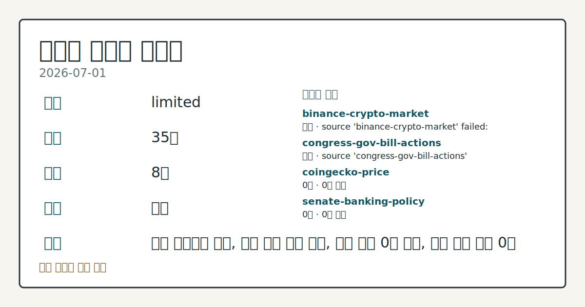
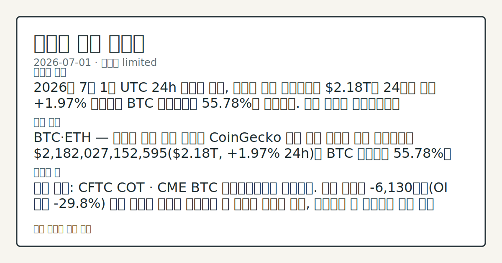

# 2026-07-01 크립토 시황
**기준 시각**: 2026-07-01 UTC · 2026-07-01T00:00Z, 2026-07-02T00:00Z)
| 종목 | 스냅샷(UTC 24h) | 구간 변동 | 비고 |
|------|------|------|------|
| BTC-USD | 60,877.48 | +3.96% | +3.96% from 52w low · -31.39% YTD |
| ETH-USD | 1,636.03 | +4.23% | +4.55% from 52w low · -45.47% YTD |
**세그먼트**: [국내 증시](../../../domestic-equity/2026/07/2026-07-01.md) | [미국 증시](../../../us-equity/2026/07/2026-07-01.md) | [크립토](2026-07-01.md)

*이미지: 데이터 신뢰도 · 출처: investo 자체 생성 · 생성: investo 0.1.0 · 2026-07-02 UTC*
> **내 관심 자산 영향**: 데이터 수집 부족으로 매칭 판단 보류 — 추가 수집 후 재평가됩니다.
> **오늘의 결론**: 2026년 7월 1일 UTC 24h 스냅샷 기준, 크립토 전체 시가총액은 **$2.18T**로 24시간 동안 **+1.97%** 상승했고 BTC 도미넌스는 **55.78%**를 나타냈다. 수집 근거가 제한적입니다
> **핵심 동인**: BTC·ETH — 크립토 시장 전반 스냅샷 CoinGecko 집계 기준 크립토 전체 시가총액은 **$2,182,027,152,595**(**$2.18T**, **+1.97%** 24h)로 BTC 도미넌스 **55.78%**를 유지했다.
> **주의할 점**: 확인 소스: CFTC COT · CME BTC 레버리지드머니 순포지션. 현재 순매도 -6,130계약(OI 대비 **-29.8%**) 대비 순매도 본문 참고.
> 정보 제공용 자동 시황이며 가상자산 매매 권유가 아닙니다. 가상자산은 가격 변동성이 매우 큽니다.
## 한눈에 보기
크립토 전체 시총 **$2.18T**로 UTC 24h 기준 **+1.97%** 상승, BTC 도미넌스는 **55.78%**로 유지됐다.
공포·탐욕 지수가 **19**(Extreme Fear)로 극단적 공포 구간을 나타냈다.
BTC·ETH CME(시카고상업거래소) 레버리지드머니 순포지션이 각각 **-6,130**·**-4,977**계약 순매도로 집계됐다 — 본문 §③ 참조.
## ⓪ 오늘의 매크로
**미 국채 수익률** — UST curve 2026-07-01: 10Y 4.48%, 2Y10Y +0.31pp
## ⓪-A 크립토 지표 (UTC 24h 스냅샷)
| 지표 | 값 |
|------|------|
| 공포·탐욕 | 19 (Extreme Fear) |
| BTC 도미넌스 | 55.78% |
| 전체 시총 | $2.18T (+1.97% 24h) |
| BTC 펀딩비 | 0.0000891595481363 (okx) |
| BTC 미결제약정 | $443.5M (okx) |
| DeFi TVL | $70.6B |
| 스테이블코인 공급 | $310.2B |
| 24h 청산 / 거래소 순유출입 | 무료 검증 소스 미확정 |
## ⓪-B 채널 기준선
| 기준선 | 값 |
|------|------|
| 비트코인 | 60,877.48 (+3.96%) |
| 이더리움 | 1,636.03 (+4.23%) |
| BTC 도미넌스 | 55.78% |
| 공포·탐욕 | 19 |
| 펀딩/OI/청산 | 펀딩 0.0000891595481363 · OI 수집됨 |
| CFTC 코인 포지셔닝 | Bitcoin CME 순포지션 -6130계약 (-29.82% OI), 2026-06-23 기준/2026-06-26 공개 · Ether CME 순포지션 -4977계약 (-19.14% OI), 2026-06-23 기준/2026-06-26 공개 · 주간 지연 |
> **크로스마켓 연결 고리**: 금리 이벤트가 할인율/달러 경로의 공통 변수로 남아 있습니다.
> **오늘의 큰 그림:** 금리와 달러 변수가 공통 변수지만, BTC·ETH 유동성를 먼저 확인해야 합니다.
## ① 요약

*이미지: 시장 스냅샷 · 출처: investo 자체 생성 · 생성: investo 0.1.0 · 2026-07-02 UTC*

2026년 7월 1일 UTC 24h 스냅샷 기준, 크립토 전체 시가총액은 **$2.18T**로 24시간 동안 **+1.97%** 상승했고 BTC 도미넌스는 **55.78%**를 나타냈다. 그러나 공포·탐욕 지수는 **19**(Extreme Fear)로 극단적 공포 구간에 머물렀고, CFTC 자료상 BTC·ETH CME 레버리지드머니 포지션은 각각 순매도 우위(-6,130계약, -4,977계약)로 나타나 가격 지표와 심리·포지셔닝 지표가 서로 다른 방향을 가리켰다. 여기에 크립토 정책·컴플라이언스 이슈(미 하원 금융서비스위원회 법안 마크업, EU MiCA 전면 시행, 바이낸스 영국 소송)까지 겹치며 방향성보다 개별 지표 확인이 필요한 구간으로 판단된다. [혼재]

## ② 전일 핵심 이슈

### BTC·ETH — 크립토 시장 전반 스냅샷

[CoinGecko](https://www.coingecko.com/en/global-charts) 집계 기준 크립토 전체 시가총액은 **$2,182,027,152,595**(**$2.18T**, **+1.97%** 24h)로 BTC 도미넌스 **55.78%**를 유지했다. 같은 구간 [alternative.me 공포·탐욕 지수](https://alternative.me/crypto/fear-and-greed-index/)는 **19**(Extreme Fear)를 기록해, 시총 확대와 투자 심리 사이에 괴리가 나타났다.

> **그래서 의미는?** 시총은 늘었지만 투자 심리는 극단적 공포라 방향 해석에 주의가 필요합니다.

### 정책·컴플라이언스 이슈

[The Block](https://www.theblock.co/post/406953/desperately-need-legislation-on-ethics-trump-financial-filing-adds-urgency-to-crypto-bill-negotiations) 보도에 따르면 트럼프 대통령의 금융 공개 자료에 다액의 크립토 관련 소득이 드러나면서, 크립토 법안 협상에 윤리 조항을 포함해야 한다는 목소리가 커졌다. 같은 흐름에서 [미 하원 금융서비스위원회](http://financialservices.house.gov/news/documentsingle.aspx?DocumentID=411188)는 10개 법안과 결의안 1건을 통과시켰으며, [자본시장 소위원회](http://financialservices.house.gov/news/documentsingle.aspx?DocumentID=411184)는 투자 환경·시장 규제 변화를 검토했다. 이는 U.S. CLARITY 성격의 시장구조 입법 논의가 본회의로 향하는 절차적 진전을 시사하는 공식 소스 기반 사실이며, 통과 가능성이나 토큰별 영향은 확인되지 않았다.

### 인프라·법적 리스크

[The Block](https://www.theblock.co/post/406918/robinhood-chain-goes-live-mainnet-alongside-24-7-tokenized-stocks-lighter-perps-planned-crypto-agentic-trading) 보도에 따르면 Robinhood Chain(아비트럼 기술 스택 기반 레이어2(L2, 확장 솔루션))이 퍼블릭 메인넷에 가동을 시작했고 Uniswap이 출시일부터 파트너로 참여했다. [EU MiCA(유럽연합 가상자산시장 규제)](https://www.theblock.co/post/406766/europes-mica-crypto-regime-is-fully-in-force-heres-who-wins-and-loses) 는 7월 1일 마감 시한을 지나 전환 단계가 종료돼 전면 시행에 들어갔다. 한편 [The Block](https://www.theblock.co/post/406842/uk-investors-sue-binance-cz) 보도에 따르면 영국 투자자 약 1,700명이 바이낸스와 창펑자오(CZ)를 상대로 런던 고등법원에 파생상품 무허가 판매 관련 소송을 제기했다.

## ③ 섹터/수급 동향

### 파생 포지셔닝 — CFTC COT

[CFTC(미국 상품선물거래위원회) COT(트레이더 포지션 보고서)](https://www.cftc.gov/MarketReports/CommitmentsofTraders/index.htm) 주간 자료(주간 집계, 실시간 흐름 아님)에 따르면 BTC CME 레버리지드머니 포지션은 롱 4,925 / 숏 11,055로 순매도 **-6,130**계약(OI(미결제약정) 대비 **-29.8%**)을 기록했다. ETH CME 레버리지드머니 포지션도 롱 5,617 / 숏 10,594로 순매도 **-4,977**계약(OI 대비 **-19.1%**)로 나타나, 두 자산 모두 파생시장에서 순매도 우위가 관찰됐다.

> **그래서 의미는?** 파생시장에서 BTC·ETH 모두 순매도 우위라 단기 심리가 방어적임을 보여줍니다.

### 자금 조달·인프라

[The Block](https://www.theblock.co/post/406934/venice-ai-funding-equity-valuation-dragonfly) 보도에 따르면 Erik Voorhees의 크립토-AI 스타트업 Venice AI가 Dragonfly 주도로 시리즈A **$65 million**을 유치하며 기업가치 **$1 billion**을 인정받았다. [Panther Hollow](https://www.theblock.co/post/406875/panther-hollow-launches-multi-strategy-merchant-bank-focused-on-compliant-rwa-and-yield-strategies)는 이더리움·Canton·솔라나·StarkNet을 대상으로 RWA(실물자산 토큰화) 및 수익 전략에 집중하는 멀티전략 머천트뱅크를 출범했다. [The Block](https://www.theblock.co/post/406198/the-cross-asset-frontier-tokenized-equities-and-stock-trading-on-crypto-platforms)은 전통 주식이 크립토 거래 플랫폼에 통합되는 흐름을 다루며, 토큰화 주식·크립토 거래 인프라 통합을 다자산 거래 인프라의 구조적 변화로 짚었다.

### 기타 생태계 동향

[The Block](https://www.theblock.co/post/406900/solana-based-prediction-market-app-on-phantom-wallet-launches) 보도에 따르면 솔라나 기반 예측시장 앱이 팬텀 지갑에서 출시됐다. [Symbiotic](https://www.theblock.co/post/406862/symbiotic-officially-pivots-to-collateral-markets-with-core-v2-launch)은 Core V2 출시와 함께 DeFi(탈중앙화 금융) 공유 담보 인프라로 전환을 공식화해 보험·신용·RWA 등 다양한 DeFi 활용 사례를 지원한다고 밝혔다. [PeckShield 집계](https://www.theblock.co/post/406854/crypto-hack-theft-falls-7-in-june-to-76-million-as-humanity-protocol-tops-list-peckshield)에 따르면 6월 크립토 해킹 피해액은 **$76 million**(40건)으로 전월 대비 **7%** 감소했으며 Humanity Protocol 관련 익스플로잇(**$31M**)이 최대 규모였다.

## ④ 지표·이벤트

| 지표 | 값 |
|------|------|
| 공포·탐욕 지수 | 19 (Extreme Fear) |
| BTC 도미넌스 | 55.78% |
| 전체 시총 | $2.18T (+1.97% 24h) |
| BTC 펀딩비 (OKX) | 0.0000891595481363 |
| BTC 미결제약정 (OKX) | $443,492,210 |
| DeFi TVL(총예치자산) | $70.6B |
| 스테이블코인 공급 | $310.2B |
| 24h 청산 / 거래소 순유출입 | 데이터 미수집 |

[DefiLlama](https://defillama.com/) 기준 DeFi TVL(총예치자산)(TVL: Total Value Locked)은 **$70.6B**로 이더리움이 **$37.4B**로 1위, 이어 솔라나 **$4.9B**, BSC **$4.8B**, 트론 **$4.4B**, Base **$4.2B** 순이었다. 스테이블코인 공급 총액은 **$310.2B**로 USDT **$184.4B**가 최대 비중을 차지했고 USDC **$73.3B**, USDS **$7.9B**, DAI **$4.8B**, USD1 **$4.6B**가 뒤를 이었다. [OKX](https://www.okx.com/trade-swap/btc-usd-swap) 기준 BTC 펀딩비는 0.0000891595481363, 미결제약정은 **$443,492,210**로 집계됐다. 24h 정리 및 거래소 순유출입 지표는 무료 검증 소스가 확정되지 않아 데이터 미수집으로 남아 있다. 한편 [미 재무부](https://home.treasury.gov/resource-center/data-chart-center/interest-rates) UST(미국 국채) 커브는 2026-07-01 기준 3M **3.85%**, 2Y **4.17%**, 10Y **4.48%**, 30Y **4.97%**, 2Y10Y 스프레드 **+0.31pp**, 3M10Y 스프레드 **+0.63pp**로 나타났다.

> **그래서 의미는?** 극단적 공포 심리와 시총 확대가 엇갈려 단일 방향으로 보기 어려운 혼재 신호입니다.

최근 며칠간 이 세그먼트 문서에서는 BTC의 **$60,000**대 지지선 점검과 ETF(상장지수펀드) 자금 흐름이 반복적으로 언급됐으나, 오늘 UTC 24h 입력 데이터에는 BTC 현물가격이 포함되지 않아 시총·도미넌스·파생 포지셔닝 지표로 흐름을 대신 점검했다 — 큰 방향 전환이 확인된 것은 아니며 지표 구성만 달라진 것으로 해석된다.

## ⑤ 주요 종목

<!-- u50 lightweight-charts-embed: placeholders consumed by site_docs/assets/investo-chart-init.js -->

<noscript><em>인터랙티브 차트는 JavaScript가 활성화된 환경에서 표시됩니다. 위 정적 카드가 동일한 정보를 담고 있습니다.</em></noscript>

### 기업 재무·구조 이벤트

[The Block](https://www.theblock.co/post/406941/trump-backed-american-bitcoin-1-for-15-reverse-stock-split-maintain-nasdaq-listing) 보도에 따르면 American Bitcoin은 나스닥 상장 유지를 위해 1대15 역병합을 결정했으며, 유통 주식수가 약 10.9억 주에서 약 7,300만 주로 줄어들 예정이다. [Forward Industries](https://www.theblock.co/post/406903/forward-industries-stock-jumps-expanding-solana-treasury-7-55-million-sol)는 솔라나 트레저리 보유량을 **7.55 million SOL**로 확대한 뒤 주가가 **17%** 상승했다고 보도됐다.

> **그래서 의미는?** American Bitcoin(비트코인 채굴 관련주)과 Forward Industries(솔라나 보유 기업)의 재무 구조 변화가 부각됩니다.

### 기관·생태계 파트너십

[The Block](https://www.theblock.co/post/406920/neutral-counterpart-bitmine-sharplink-joe-lubin-back-ethereum-institutional-non-profit) 보도에 따르면 Bitmine, Sharplink, Consensys CEO Joseph Lubin이 새로운 비영리 조직 Ethereum Institutional을 후원한다고 밝혔다.

### 애널리스트 코멘트 확인 항목

[The Block](https://www.theblock.co/post/406888/bullish-on-morpho-standard-chartered-sees-token-at-60-by-2030-outperforming-bitcoin-ether) 보도에 따르면 Standard Chartered는 Morpho에 대해 볼트 성장, TradFi 채택, DeFi 확장 전망을 근거로 2030년까지 **$60** 수준을 언급하는 코멘트를 냈다. [The Block](https://www.theblock.co/post/406877/bernstein-sees-203-upside-for-circle-even-as-new-stablecoin-rival-ousd-debuts) 보도에 따르면 Bernstein은 신규 스테이블코인 OUSD 출시로 CRCL 주가가 **17%** 넘게 하락한 가운데도 Circle(CRCL)에 대한 코멘트에서 **$190** 수준과 **203%**라는 수치를 함께 제시했다.

## ⑥ 오늘의 관전 포인트

#### 관찰 신호: 전체 **$310.2B**, 1위 USDT **$184…

- 출처: DefiLlama 스테이블코인 공급
- 현재: 전체 **$310.2B**
- 확인 조건: 상방 공급 총액이 **$310.2B**보다 확대되면 스테이블코인 자금 유입으로 관찰; 하방 축소되면 자금 이탈 신호로 해석
- 신뢰도: 높음
- 관심 영향: 온체인 유동성 점검.

> **데이터 상태**: 제한

수집/품질 진단

> **데이터 상태**: 제한 — 수집 35건 / 소스 8개 / 누락: 가격 · 제한 — 핵심 가격 소스 0건/실패/stale, 본문 결론 신뢰도 낮음
> **소스 카운트**: 수집 대상 14 / 성공 9 / 수집 상세는 진단 섹션에서 확인할 수 있습니다. / 수집 상세는 진단 섹션에서 확인할 수 있습니다. / 수집 상세는 진단 섹션에서 확인할 수 있습니다.
> **소스 등급 분포**: S=3 / A=2 / B=4
> **상세 사유**: 가격 카테고리 누락, 일부 소스 수집 실패, 일부 소스 0건 반환, 핵심 가격 소스 0건
> **소스별 상태**: binance-crypto-market 실패 (접근 제한), congress-gov-bill-actions 실패 (설정 미완료(미수집)), coingecko-price 0건, senate-banking-policy 0건, stooq-price 0건, 정상 9개

## ⑦ 면책조항
본 시황은 일반 정보 제공을 목적으로 자동 생성된 자료이며,
특정 가상자산에 대한 매매 권유나 투자 자문이 아닙니다.
가상자산은 가상자산이용자보호법(2024-07-19 시행) §10·§19의 적용 대상으로,
24시간 거래되는 비제도권 자산이며 가격 변동성이 매우 크고 원금 전액 손실이 가능합니다.
투자 결정과 그 결과에 대한 책임은 전적으로 본인에게 있으며,
본 시황의 내용에 따라 발생한 손실에 대해 작성자는 일체의 책임을 지지 않습니다.