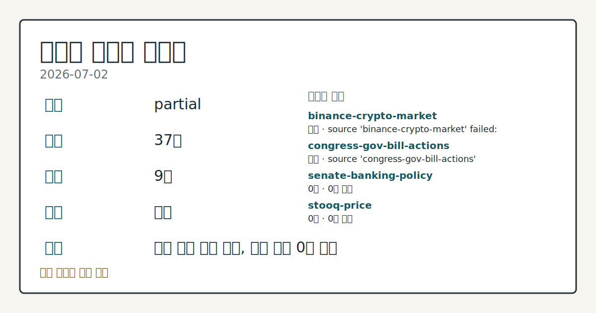
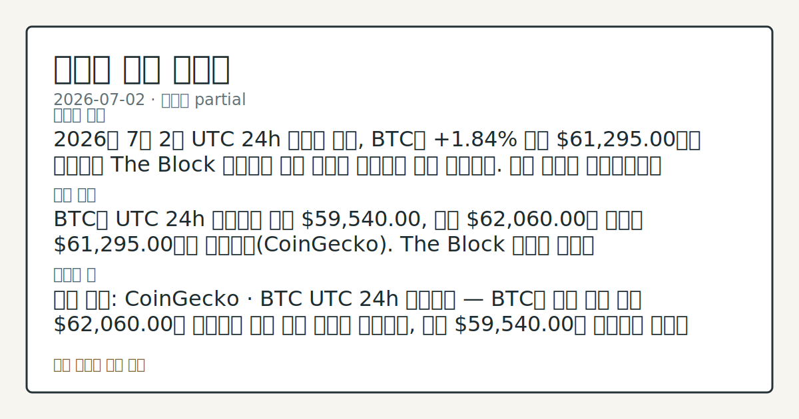
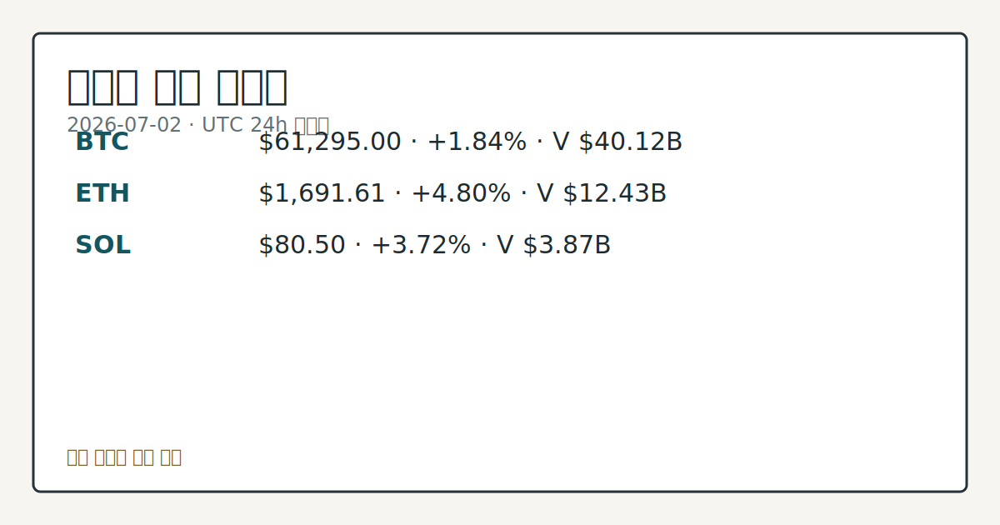

# 2026-07-02 크립토 시황
**기준 시각**: 2026-07-02 UTC · 2026-07-02T00:00Z, 2026-07-03T00:00Z)
| 종목 | 스냅샷(UTC 24h) | 구간 변동 | 비고 |
|------|------|------|------|
| BTC-USD | 61,278.51 | +2.12% | +4.64% from 52w low · -30.94% YTD |
| ETH-USD | 1,690.89 | +5.09% | +8.06% from 52w low · -43.64% YTD |
**세그먼트**: [국내 증시](../../../domestic-equity/2026/07/2026-07-02.md) | [미국 증시](../../../us-equity/2026/07/2026-07-02.md) | [크립토](2026-07-02.md)

*이미지: 데이터 신뢰도 · 출처: investo 자체 생성 · 생성: investo 0.1.0 · 2026-07-02 UTC*
> **내 관심 자산 영향**: 16건 확인 (기본 바스켓) — BTC: 직접 관련 · [cftc-cot-positioning] CFTC Bitcoin CME leveraged_money net -6130 contracts; BTC: 직접 관련 · [coingecko-global-market] Global crypto market cap **$2,207,536,713,609**; BTC dominance **55.68%**; BTC: 직접 관련 · [coingecko-price] BTC **$61,295.00** (**+1.84%**); BTC: 직접 관련 · [okx-derivatives] BTC 미결제약정 **$442,575,480** (OKX, UTC 24h); BTC: 직접 관련 · [okx-derivatives] BTC 펀딩비 0.0001000000000000 (OKX, UTC 24h) 외
> **용어 가이드**: 이번 시황에서 처음 등장한 용어 — 시가총액(시장가치), 거래대금(거래총액), 숏커버링(공매도상환)
> **오늘의 결론**: 2026년 7월 2일 UTC 24h 스냅샷 기준, BTC는 **+1.84%** 오른 **$61,295.00**에서 거래되며 The Block 보도대로 장기 보유자 축적세가 함께 포착됐다. 수집 근거가 제한적입니다
> **핵심 동인**: BTC는 UTC 24h 구간에서 저가 **$59,540.00**, 고가 **$62,060.00**을 오가며 **$61,295.00**까지 반등했다(CoinGecko). The Block 보도에 따르면 Glassnode·Bitfinex 데이터 상 장기 보유자(long-term holder) 축적이 포착됐으며, 이는 ETF(상장지수펀드) 자금이 꾸준히 순유출되는 국면에서도 나타난 현상이다.
> **주의할 점**: 확인 소스: CoinGecko · BTC UTC 24h 가격밴드 — BTC가 이번 구간 고가 **$62,060.00**을 상회하면 반등 압력 확대로 본문 참고.
> 정보 제공용 자동 시황이며 가상자산 매매 권유가 아닙니다. 가상자산은 가격 변동성이 매우 큽니다.
## 한눈에 보기
BTC가 UTC 24h 기준 **+1.84%** 상승한 **$61,295.00**을 기록했고, ETH는 **+4.80%** 오른 **$1,691.61**로 더 강한 상승폭을 보였다.
크립토 공포·탐욕지수가 **19**(Extreme Fear)로 극도의 공포 구간에 머물러, 가격 반등에도 투자심리는 여전히 위축돼 있다.
**10Y** 금리 **4.49%**와 BTC CME 레버리지드머니 순포지션 -6,130계약이 파생시장·금리 환경을 가늠할 변수 — 본문 §④ 참조.
## ⓪ 오늘의 매크로
**국제 유가** — CFTC WTI crude oil managed_money net +82872 contracts
**미 국채 수익률** — UST curve 2026-07-02: 10Y 4.49%, 2Y10Y +0.35pp
## ⓪-A 크립토 지표 (UTC 24h 스냅샷)
| 지표 | 값 |
|------|------|
| 공포·탐욕 | 19 (Extreme Fear) |
| BTC 도미넌스 | 55.68% |
| 전체 시총 | $2.21T (+2.16% 24h) |
| BTC 펀딩비 | 0.0001000000000000 (okx) |
| BTC 미결제약정 | $442.6M (okx) |
| DeFi TVL | $72.5B |
| 스테이블코인 공급 | $309.8B |
| 24h 청산 / 거래소 순유출입 | 무료 검증 소스 미확정 |
## ⓪-B 채널 기준선
| 기준선 | 값 |
|------|------|
| 비트코인 | 61,278.51 (+2.12%) |
| 이더리움 | 1,690.89 (+5.09%) |
| BTC 도미넌스 | 55.68% |
| 공포·탐욕 | 19 |
| 펀딩/OI/청산 | 펀딩 0.0001000000000000 · OI 수집됨 |
| CFTC 코인 포지셔닝 | Bitcoin CME 순포지션 -6130계약 (-29.82% OI), 2026-06-23 기준/2026-06-26 공개 · Ether CME 순포지션 -4977계약 (-19.14% OI), 2026-06-23 기준/2026-06-26 공개 · 주간 지연 |
> **크로스마켓 연결 고리**: 유가/지정학 이슈가 여러 자산군의 변동성 연결 고리로 관찰됩니다. / 금리 이벤트가 할인율/달러 경로의 공통 변수로 남아 있습니다.
> **오늘의 큰 그림:** 이 세그먼트의 공통 신호는 제한적입니다. 본문 수급·지표 항목을 먼저 확인하세요.
## ① 요약

*이미지: 시장 스냅샷 · 출처: investo 자체 생성 · 생성: investo 0.1.0 · 2026-07-02 UTC*

2026년 7월 2일 UTC 24h 스냅샷 기준, BTC는 **+1.84%** 오른 **$61,295.00**에서 거래되며 [The Block](https://www.theblock.co/post/407020/accumulation-beneath-the-surface-bitcoin-rebounds-above-61000-as-long-term-holders-accumulate-amid-steady-etf-outflows) 보도대로 장기 보유자 축적세가 함께 포착됐다. ETH(**+4.80%**, **$1,691.61**)·SOL(**+3.72%**, **$80.50**)도 동반 상승해 크립토 전체 시가총액은 **$2.21T**로 24h 기준 **+2.16%** 늘었지만, 공포·탐욕지수는 **19**(Extreme Fear)에 머물러 있고 CFTC COT 상 BTC·ETH CME 레버리지드머니 포지션은 모두 순숏을 유지해 가격 반등과 파생시장 포지셔닝·투자심리 지표가 엇갈리는 모습이다. 전일(2026-07-01) 대비로도 시가총액 확대 흐름은 이어졌으나 방향성 신호는 혼재된 채다. [혼재]

## ② 전일 핵심 이슈

BTC는 UTC 24h 구간에서 저가 **$59,540.00**, 고가 **$62,060.00**을 오가며 **$61,295.00**까지 반등했다([CoinGecko](https://www.coingecko.com/en/coins/bitcoin)). [The Block](https://www.theblock.co/post/407020/accumulation-beneath-the-surface-bitcoin-rebounds-above-61000-as-long-term-holders-accumulate-amid-steady-etf-outflows) 보도에 따르면 Glassnode·Bitfinex 데이터 상 장기 보유자 축적이 포착됐으며, 이는 ETF 자금이 꾸준히 순유출되는 국면에서도 나타난 현상이다.

> **그래서 의미는?** 가격은 반등했지만 매도 압력이 완전히 해소된 것은 아니라는 신호로 확인할 필요가 있습니다.

### BTC, 매도 압력 속 관련 코멘트

[The Block](https://www.theblock.co/post/407094/cftcs-selig-says-illinois-lawmakers-decided-they-know-better-on-crypto-tax) 보도에 따르면 CFTC(상품선물거래위원회) 마이클 셀리그(Selig) 의장은 일리노이주가 크립토 거래에 **0.2%** 세금을 부과하는 법을 통과시킨 데 대해 비판적 입장을 밝혔다. 같은 날 [JPMorgan 분석](https://www.theblock.co/post/407071/jpmorgan-strategy-mstr-bitcoin-sale-policy-risk-crypto-markets)은 Strategy의 비트코인 매도 정책이 크립토 시장에 "피할 수 있었던" 양방향 리스크를 더했다고 지적했고, [Bitwise CIO 매트 호건](https://www.theblock.co/post/407013/i-think-were-nearing-the-bottom-bitwise-cio-says-strategys-strc-selloff-is-part-of-bitcoins-end-of-cycle-dynamics)은 Strategy STRC 매도가 사이클 말기 디레버리징 국면의 일부라는 관측을 전했다.

## ③ 섹터/수급 동향

DeFi(탈중앙금융) TVL(총예치자산)은 **$72.5B**로 집계됐으며 이더리움이 **$38.6B**로 선두를 유지했다(Solana **$5.0B**, BSC **$4.9B**, Tron **$4.5B**, Base **$4.3B**)([DefiLlama](https://defillama.com/)). 스테이블코인 공급은 **$309.8B**로 USDT가 **$184.1B**로 최대 비중을 차지했다(USDC **$73.5B**, USDS **$7.6B**, DAI **$4.8B**, USD1 **$4.6B**). 한편 CFTC COT(거래자별포지션보고서) 상 BTC CME(시카고상업거래소) 레버리지드머니 순포지션은 **-6,130**계약(롱 4,925·숏 11,055, OI 대비 **-29.8%**), ETH는 **-4,977**계약으로 두 자산 모두 순숏 우위를 나타냈다([CFTC](https://www.cftc.gov/MarketReports/CommitmentsofTraders/index.htm)).

> **그래서 의미는?** 온체인 자금은 안정적이지만 파생시장 레버리지 자금은 하락 쪽에 더 쏠려 있다는 뜻으로 볼 수 있습니다.

### 토큰화·RWA 확장 소식

[The Block](https://www.theblock.co/post/407104/securitize-first-debut-shares-nyse-onchain-but-wont-be-last) 보도에 따르면 Securitize가 NYSE(뉴욕증권거래소)와 온체인에 동시에 주식을 상장한 최초 사례가 됐으며, 브렛 레드펀 대표는 향후 1년 내 다른 IPO(기업공개)도 토큰화하는 방안을 논의 중이라고 밝혔다. [eToro](https://www.theblock.co/post/407093/etoro-leads-12-5-million-round-in-onchain-perps-exchange-extended)는 온체인 무기한선물 거래소 Extended의 **$12.5M** 규모 라운드를 주도했고, [Robinhood CEO 블라드 테네브](https://www.theblock.co/post/407047/robinhood-ceo-says-future-of-crypto-is-in-real-world-assets-not-memecoins)는 크립토의 미래가 밈코인이 아닌 RWA(실물자산)에 있다는 견해를 전했다.

### Metaplanet, 2분기 BTC 보유량 확대

[The Block](https://www.theblock.co/post/406999/metaplanet-bitcoin-acquisition-q2) 보도에 따르면 Metaplanet은 2분기 중 BTC 2,823개를 추가 매입해 누적 보유량을 43,000 BTC로 늘렸으며, 매입액은 **$222M**, 평균 단가는 BTC당 **$78,608**로 집계됐다.

## ④ 지표·이벤트

크립토 전체 시가총액은 **$2.21T**로 UTC 24h 기준 **+2.16%** 늘었고 BTC 도미넌스는 **55.68%**를 기록했다([CoinGecko](https://www.coingecko.com/en/global-charts)). 크립토 공포·탐욕지수는 **19**(Extreme Fear)로 극단적 공포 구간에 머물렀다([Alternative.me](https://alternative.me/crypto/fear-and-greed-index/)). 파생시장에서는 OKX 기준 BTC 미결제약정이 **$442.6M**, 펀딩비가 0.0001000000000000으로 집계됐다([OKX](https://www.okx.com/trade-swap/btc-usd-swap)). 美 국채(UST) 금리커브는 3M **3.82%**, 2Y **4.14%**, 10Y **4.49%**, 30Y **4.98%**이며 2Y10Y 스프레드는 **+0.35pp**, 3M10Y 스프레드는 **+0.67pp**로 나타났다([U.S. Treasury](https://home.treasury.gov/resource-center/data-chart-center/interest-rates)).

> **그래서 의미는?** 크립토 파생 지표는 안정적이지만 금리 환경은 위험자산 전반의 자금 흐름에 계속 영향을 줄 변수로 볼 수 있습니다.

### CLARITY법 관련 하원 청문회

[하원 금융서비스위원회](http://financialservices.house.gov/calendar/eventsingle.aspx?EventID=411176)는 CLARITY법(디지털자산 시장구조 법안)이 혁신을 어떻게 뒷받침하는지를 주제로 한 현장 청문회(Field Hearing)를 진행했다. 이는 시장구조·SEC/CFTC 관할권 관련 정책 사안으로, 특정 종목이나 가격에 대한 즉각적 영향을 시사하는 자료는 아니다.

## ⑤ 주요 종목

<!-- u50 lightweight-charts-embed: placeholders consumed by site_docs/assets/investo-chart-init.js -->

<noscript><em>인터랙티브 차트는 JavaScript가 활성화된 환경에서 표시됩니다. 위 정적 카드가 동일한 정보를 담고 있습니다.</em></noscript>

*이미지: 가격 스냅샷 · 출처: investo 자체 생성 · 생성: investo 0.1.0 · 2026-07-02 UTC*

ETH는 **+4.80%** 오른 **$1,691.61**(24h 거래대금 **$12,434,534,635**, 시가총액 **$204,171,790,138**)([CoinGecko](https://www.coingecko.com/en/coins/ethereum)), SOL은 **+3.72%** 오른 **$80.50**(24h 거래대금 **$3,872,610,251**, 시가총액 **$46,776,894,850**)([CoinGecko](https://www.coingecko.com/en/coins/solana))으로 두 자산 모두 BTC 대비 상대적으로 강한 상승폭을 나타냈다.

> **그래서 의미는?** ETH·SOL 등 알트코인이 BTC보다 상대적으로 강한 흐름을 보였다는 뜻으로 확인할 수 있습니다.

### 확인 항목 — RWA 토큰화 확대

[Ondo Finance](https://www.theblock.co/post/407031/ondo-tokenizes-blackrocks-ivv-etf-and-micron-stock-under-us-custodial-model)는 BlackRock IVV ETF와 Micron 주식을 미국 SEC 커스터디 모델 하에서 이더리움 기반으로 토큰화했다. [Anchorage Digital](https://www.theblock.co/post/406587/anchorage-digital-adds-lido-support-giving-institutions-access-to-wsteth)은 Lido 지원을 추가해 기관 고객이 wstETH에 접근할 수 있는 경로를 열었다.

### 체크리스트 — 개별 종목 관련 확인 사항

[The Block](https://www.theblock.co/post/406990/avalanche-treasury-stock-plunge) 보도에 따르면 Avalanche 트레저리 관련 상장주식은 데뷔 이후 73% 하락했고, 회사 측은 1분기 말 기준 계속기업 존속 능력에 대한 "중대한 의문"을 제기했다. [Ark Invest](https://www.theblock.co/post/406978/ark-invest-18-million-circle)는 Circle 주식 **$18M**어치를 매입했는데, Circle은 최근 한 달간 41% 하락했고 화요일 18% 급락 이후 이날도 1% 내렸다 — 경쟁 스테이블코인 프로젝트 OUSD 출시가 배경으로 거론된다.

## ⑥ 오늘의 관전 포인트

#### 관찰 신호: BTC UTC 24h 가격밴드 — BTC

- 출처: CoinGecko
- 현재: CoinGecko · BTC UTC 24h 가격밴드 — BTC가 이번 구간 고가 **$62,060.00**을 상회하면 반등 압력 확대로 관찰하고, 저가 **$59,540.00**을 이탈하면 방어적 흐름으로 해석한다. 관심 영향: 단기 변동성 점검.
- 확인 조건: 상방 BTC UTC 24h 가격밴드 — BTC가 이번 구간 고가 **$62,060.00**을 상회하면 반등 압력 확대로 관찰하고; 하방 저가 **$59,540.00**을 이탈하면 방어적 흐름으로 해석한다
- 신뢰도: 높음
- 관심 영향: 단기 변동성 점검.

> **데이터 상태**: 부분

수집/품질 진단

> **데이터 상태**: 부분 — 수집 37건 / 소스 9개 / 누락: 없음 · 부분 — 일부 카테고리 미수집, 본문 일부 결론 보강 필요
> **소스 카운트**: 수집 대상 14 / 성공 10 / 수집 상세는 진단 섹션에서 확인할 수 있습니다. / 수집 상세는 진단 섹션에서 확인할 수 있습니다. / 수집 상세는 진단 섹션에서 확인할 수 있습니다.
> **소스 등급 분포**: S=3 / A=2 / B=5
> **상세 사유**: 일부 소스 수집 실패, 일부 소스 0건 반환
> **소스별 상태**: binance-crypto-market 실패 (접근 제한), congress-gov-bill-actions 실패 (설정 미완료(미수집)), senate-banking-policy 0건, stooq-price 0건, 정상 10개

## ⑦ 면책조항
본 시황은 일반 정보 제공을 목적으로 자동 생성된 자료이며,
특정 가상자산에 대한 매매 권유나 투자 자문이 아닙니다.
가상자산은 가상자산이용자보호법(2024-07-19 시행) §10·§19의 적용 대상으로,
24시간 거래되는 비제도권 자산이며 가격 변동성이 매우 크고 원금 전액 손실이 가능합니다.
투자 결정과 그 결과에 대한 책임은 전적으로 본인에게 있으며,
본 시황의 내용에 따라 발생한 손실에 대해 작성자는 일체의 책임을 지지 않습니다.