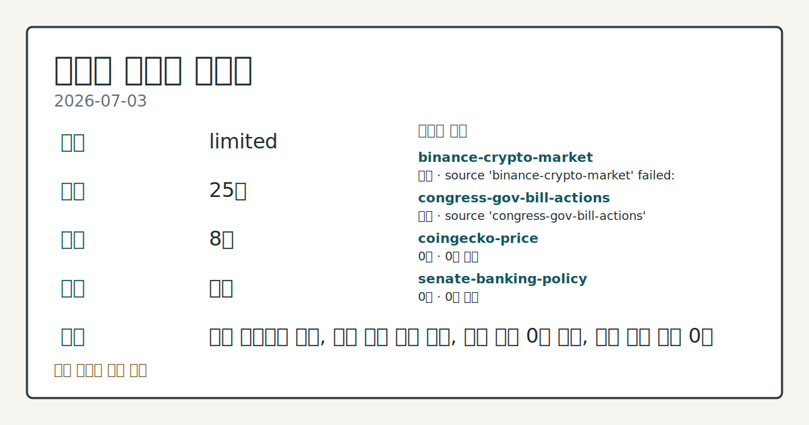
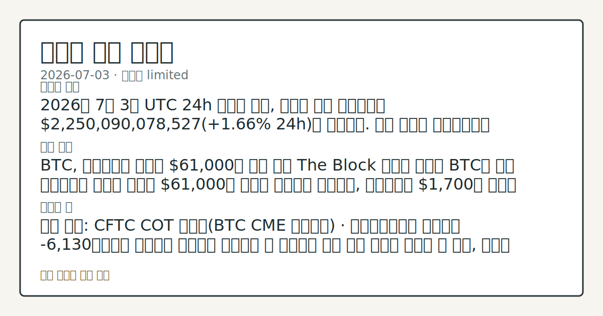

# 2026-07-03 크립토 시황
**기준 시각**: 2026-07-03 UTC · 2026-07-03T00:00Z, 2026-07-04T00:00Z)
| 종목 | 스냅샷(UTC 24h) | 구간 변동 | 비고 |
|------|------|------|------|
| BTC-USD | 63,787.54 | +1.11% | +8.93% from 52w low · -28.11% YTD |
| ETH-USD | 1,794.64 | +0.88% | +14.69% from 52w low · -40.19% YTD |
**세그먼트**: [국내 증시](../../../domestic-equity/2026/07/2026-07-03.md) | [미국 증시](../../../us-equity/2026/07/2026-07-03.md) | [크립토](2026-07-03.md)

*이미지: 데이터 신뢰도 · 출처: investo 자체 생성 · 생성: investo 0.1.0 · 2026-07-05 UTC*
> **내 관심 자산 영향**: 데이터 수집 부족으로 매칭 판단 보류 — 추가 수집 후 재평가됩니다.
> **오늘의 결론**: 2026년 7월 3일 UTC 24h 스냅샷 기준, 크립토 전체 시가총액은 **+0.70%** 늘어난 **$2.29T**를 기록했다. 수집 근거가 제한적입니다
> **핵심 동인**: BTC — **$61,000**대 지지와 ETF 자금 흐름 전환 The Block에 따르면 BTC는 미국 독립기념일을 앞두고 완만한 고용지표 발표 이후 연준 추가 인상 우려가 완화되면서 **$61,000**대 지지를 유지했고, ETH도 **$1,700**대를 지켰다.
> **주의할 점**: 확인 소스: The Block · 미국 현물 비트코인 ETF 자금 흐름 — 순유입이 이어지면 위험선호 회복 신호로, **$222** million 본문 참고.
> 정보 제공용 자동 시황이며 가상자산 매매 권유가 아닙니다. 가상자산은 가격 변동성이 매우 큽니다.
## 한눈에 보기
크립토 전체 시가총액이 UTC 24h 스냅샷에서 **+0.70%** 늘어난 **$2.29T**(정확히는 **$2,286,964,207,602**)를 기록했다.
**BTC**가 **$61,000**대 지지를 유지하는 가운데, 미국 현물 비트코인 ETF(상장지수펀드)가 10거래일 만에 순유입으로 전환해 **$222 million** 유입을 기록했다.
**23**(Extreme Fear) 공포·탐욕 지수와 CFTC 포지셔닝 순매도 우위가 본문 §③·④에서 확인된다.
## ⓪ 오늘의 매크로
**미 국채 수익률** — UST curve 2026-07-02: 10Y 4.49%, 2Y10Y +0.35pp
## ⓪-A 크립토 지표 (UTC 24h 스냅샷)
| 지표 | 값 |
|------|------|
| 공포·탐욕 | 23 (Extreme Fear) |
| BTC 도미넌스 | 55.78% |
| 전체 시총 | $2.29T (+0.70% 24h) |
| BTC 펀딩비 | 0.0000882895845066 (okx) |
| BTC 미결제약정 | $437.9M (okx) |
| DeFi TVL | $74.6B |
| 스테이블코인 공급 | $310.0B |
| 24h 청산 / 거래소 순유출입 | 무료 검증 소스 미확정 |
## ⓪-B 채널 기준선
| 기준선 | 값 |
|------|------|
| 비트코인 | 63,787.54 (+1.11%) |
| 이더리움 | 1,794.64 (+0.88%) |
| BTC 도미넌스 | 55.78% |
| 공포·탐욕 | 23 |
| 펀딩/OI/청산 | 펀딩 0.0000882895845066 · OI 수집됨 |
| CFTC 코인 포지셔닝 | Bitcoin CME 순포지션 -6130계약 (-29.82% OI), 2026-06-23 기준/2026-06-26 공개 · Ether CME 순포지션 -4977계약 (-19.14% OI), 2026-06-23 기준/2026-06-26 공개 · 주간 지연 |
> **크로스마켓 연결 고리**: 금리 이벤트가 할인율/달러 경로의 공통 변수로 남아 있습니다.
> **오늘의 큰 그림:** 금리와 달러 변수가 공통 변수지만, BTC·ETH 유동성를 먼저 확인해야 합니다.
## ① 요약

*이미지: 시장 스냅샷 · 출처: investo 자체 생성 · 생성: investo 0.1.0 · 2026-07-05 UTC*

2026년 7월 3일 UTC 24h 스냅샷 기준, 크립토 전체 시가총액은 **+0.70%** 늘어난 **$2.29T**를 기록했다. **BTC**는 **$61,000**대, **ETH**는 **$1,700**대를 유지했고, 미국 현물 비트코인 ETF는 10거래일 연속 순유출 이후 처음으로 **$222 million** 규모 순유입 전환을 기록했다([The Block](https://www.theblock.co/post/407131/markets-find-their-footing-bitcoin-holds-61000-rebound-ahead-of-us-independence-day-as-soft-jobs-data-eases-rate-fears)). 반면 공포·탐욕 지수는 **23**(Extreme Fear)에 머물러 있고, CFTC(미국 상품선물거래위원회) 포지셔닝은 BTC·ETH CME(시카고상업거래소) 선물 모두에서 레버리지드머니 순매도 우위를 나타냈다. 자금 유입과 낮은 투자심리 지표가 동시에 나타나는 흐름이다. [혼재]

## ② 전일 핵심 이슈

### BTC — **$61,000**대 지지와 ETF 자금 흐름 전환

The Block에 따르면 BTC는 미국 독립기념일을 앞두고 완만한 고용지표 발표 이후 연준 추가 인상 우려가 완화되면서 **$61,000**대 지지를 유지했고, ETH도 **$1,700**대를 지켰다. 같은 기간 미국 현물 비트코인 ETF는 10거래일 연속 순유출을 끊고 **$222 million** 순유입으로 전환했으며, IBIT는 목요일 하루 **$40.4 million** 순유출로 개별 펀드 단위에서는 유출 흐름이 이어졌다([The Block](https://www.theblock.co/post/407110/us-bitcoin-etfs-222-million-inflows)).

> **그래서 의미는?** 가격은 버티는데 개별 펀드는 여전히 자금이 빠져나가는 엇갈린 흐름입니다.

### 스테이블코인 컨소시엄 및 정책 이슈

삼성과 두나무는 자신들이 사전 협의 없이 OUSD 스테이블코인 컨소시엄 회원으로 등재됐다고 밝혔다([The Block](https://www.theblock.co/post/407147/samsung-dunamu-say-they-were-listed-as-ousd-stablecoin-consortium-members-without-official-consultation-report)). 한편 IMF(국제통화기금)의 토비아스 애드리안은 정책 선택에 따라 토큰화가 금융 시스템을 강화할 수도, 분절시킬 수도 있으며 위험이 은행에서 시장 인프라 사업자와 스마트 컨트랙트로 이동할 수 있다고 언급했다([The Block](https://www.theblock.co/post/407140/imf-says-policy-choices-will-determine-whether-tokenization-strengthens-or-fragments-the-financial-system)).

## ③ 섹터/수급 동향

### DeFi(탈중앙화 금융) TVL(총예치자산)과 체인별 점유

DeFiLlama 기준 DeFi TVL은 **$74.6B**이며, 체인별로는 Ethereum **$39.9B**, Solana **$5.1B**, BSC **$5.0B**, Tron **$4.7B**, Base **$4.4B** 순으로 집계됐다([DefiLlama](https://defillama.com/)).

> **그래서 의미는?** 이더리움이 여전히 예치 자금의 절반 이상을 차지하는 중심축입니다.

### CFTC 포지셔닝과 거래소 입금

CFTC COT(트레이더별 포지션) 리포트에 따르면 BTC CME 선물 레버리지드머니 포지션은 롱 4,925계약, 숏 11,055계약으로 순매도 -6,130계약(OI(미결제약정) 대비 **-29.8%**)을 기록했고, ETH CME 선물도 순매도 -4,977계약(OI 대비 **-19.1%**)으로 나타났다([CFTC](https://www.cftc.gov/MarketReports/CommitmentsofTraders/index.htm)). CryptoQuant는 비트코인·알트코인 거래소 입금량이 최근 약 **49,000 BTC**까지 급증해 올해 들어 네 번째 수준의 이례적 흐름이라며 변동성 확대 가능성을 언급했다([The Block](https://www.theblock.co/post/407160/cryptoquant-bitcoin-ether-altcoin-exchange-deposits-volatility)). Perp DEX(무기한 선물형 분산거래소) 부문은 파생시장 내에서 가장 빠르게 성장하는 섹터로 소개됐다([The Block](https://www.theblock.co/post/407075/grvt-and-the-rise-of-composable-onchain-wealth)).

## ④ 지표·이벤트

### UST(미 국채) 금리 커브와 크립토 매크로 지표

Treasury 데이터 기준 2026-07-02 UST 커브는 3개월 **3.82%**, 2년 **4.14%**, 10년 **4.49%**, 30년 **4.98%**이며 2Y10Y 스프레드는 **+0.35pp**, 3M10Y 스프레드는 **+0.67pp**로 집계됐다([U.S. Treasury](https://home.treasury.gov/resource-center/data-chart-center/interest-rates)). CoinGecko 기준 크립토 전체 시가총액은 **$2,286,964,207,602**, BTC 도미넌스는 **55.78%**이며([CoinGecko](https://www.coingecko.com/en/global-charts)), 공포·탐욕 지수는 **23**(Extreme Fear)([Alternative.me](https://alternative.me/crypto/fear-and-greed-index/)), 스테이블코인 공급은 **$310.0B**(USDT 184.2B, USDC 73.0B, USDS 8.0B, DAI 4.8B, USD1 4.6B)([DefiLlama](https://defillama.com/))로 나타났다.

> **그래서 의미는?** 국채 금리와 크립토 지표를 함께 보면 위험선호 여력을 가늠할 수 있습니다.

### 파생상품 지표: 미결제약정과 펀딩비

OKX 기준 BTC 미결제약정은 **$437.9M**, BTC 펀딩비는 **0.0000882895845066**로 집계됐다([OKX](https://www.okx.com/trade-swap/btc-usd-swap)). 24시간 정리 규모와 거래소 순유출입 지표는 무료 검증 소스가 확정되지 않아 데이터 미수집 상태다.

## ⑤ 주요 종목

<!-- u50 lightweight-charts-embed: placeholders consumed by site_docs/assets/investo-chart-init.js -->

<noscript><em>인터랙티브 차트는 JavaScript가 활성화된 환경에서 표시됩니다. 위 정적 카드가 동일한 정보를 담고 있습니다.</em></noscript>

### ETF 자금 흐름

미국 현물 비트코인 ETF 전체는 목요일 **$222 million** 순유입을 기록해 10거래일 순유출 흐름을 끊었으나, BlackRock의 IBIT(아이셰어즈 비트코인 트러스트)는 유일하게 **$40.4 million** 순유출을 이어갔다([The Block](https://www.theblock.co/post/407110/us-bitcoin-etfs-222-million-inflows)).

> **그래서 의미는?** 전체 펀드군과 개별 펀드(IBIT)의 자금 방향이 엇갈리는 점을 확인할 필요가 있습니다.

### 확인 항목

Spotify는 Kalshi·Polymarket에 자사 로고 사용 중단을 요청했다. 50만 건의 조작된 스트리밍이 300만 달러 규모 음악 관련 예측시장 정산에 사용된 데이터로 전해졌다([The Block](https://www.theblock.co/post/407134/spotify-asks-kalshi-polymarket-to-remove-branding-after-manipulated-streams-used-to-settle-music-bets-bloomberg)).

## ⑥ 오늘의 관전 포인트

#### 관찰 신호: 미국 현물 비트코인 ETF 자금 흐름 — 순유입

- 출처: The Block
- 현재: The Block · 미국 현물 비트코인 ETF 자금 흐름 — 순유입이 이어지면 위험선호 회복 신호로, **$222 million** 유입이 다시 순유출로 전환되면 자금 이탈 신호로 해석된다. 관심 영향: 비트코인 현물 ETF 수급 흐름을 점검.
- 확인 조건: 상방 미국 현물 비트코인 ETF 자금 흐름 — 순유입이 이어지면 위험선호 회복 신호로; 하방 **$222 million** 유입이 다시 순유출로 전환되면 자금 이탈 신호로 해석된다
- 신뢰도: 높음
- 관심 영향: 비트코인 현물 ETF 수급 흐름을 점검.

> **데이터 상태**: 제한

수집/품질 진단

> **데이터 상태**: 제한 — 수집 25건 / 소스 8개 / 누락: 가격 · 제한 — 핵심 가격 소스 0건/실패/stale, 본문 결론 신뢰도 낮음
> **소스 카운트**: 수집 대상 14 / 성공 9 / 수집 상세는 진단 섹션에서 확인할 수 있습니다. / 수집 상세는 진단 섹션에서 확인할 수 있습니다. / 수집 상세는 진단 섹션에서 확인할 수 있습니다.
> **소스 등급 분포**: S=3 / A=2 / B=4
> **상세 사유**: 가격 카테고리 누락, 일부 소스 수집 실패, 일부 소스 0건 반환, 핵심 가격 소스 0건
> **소스별 상태**: binance-crypto-market 실패 (접근 제한), congress-gov-bill-actions 실패 (설정 미완료(미수집)), coingecko-price 0건, senate-banking-policy 0건, stooq-price 0건, 정상 9개

## ⑦ 면책조항
본 시황은 일반 정보 제공을 목적으로 자동 생성된 자료이며,
특정 가상자산에 대한 매매 권유나 투자 자문이 아닙니다.
가상자산은 가상자산이용자보호법(2024-07-19 시행) §10·§19의 적용 대상으로,
24시간 거래되는 비제도권 자산이며 가격 변동성이 매우 크고 원금 전액 손실이 가능합니다.
투자 결정과 그 결과에 대한 책임은 전적으로 본인에게 있으며,
본 시황의 내용에 따라 발생한 손실에 대해 작성자는 일체의 책임을 지지 않습니다.