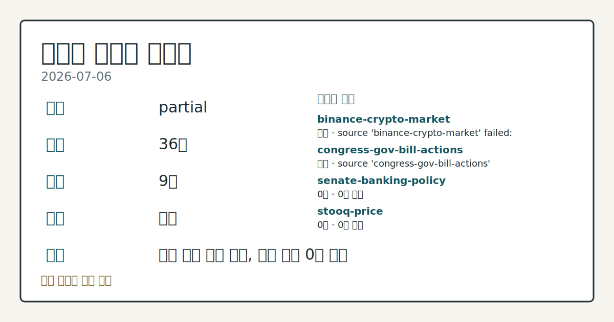
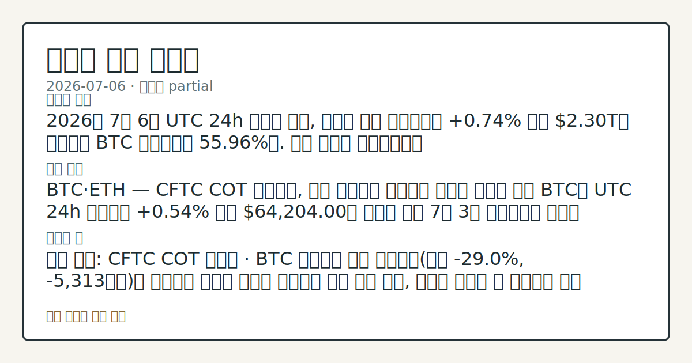
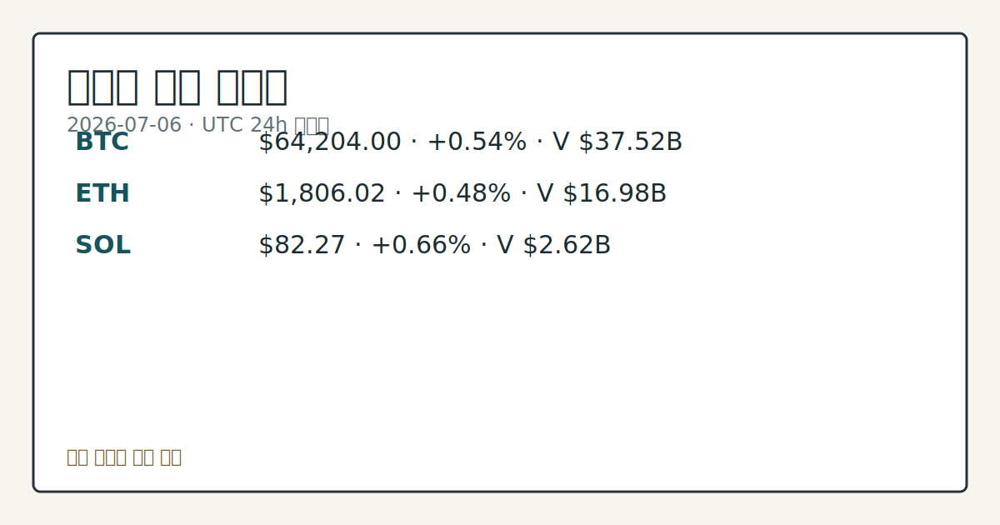

# 2026-07-06 크립토 시황
**기준 시각**: 2026-07-06 UTC · 2026-07-06T00:00Z, 2026-07-07T00:00Z)
| 종목 | 스냅샷(UTC 24h) | 구간 변동 | 비고 |
|------|------|------|------|
| BTC-USD | 64,222.54 | +1.06% | +9.67% from 52w low · -27.62% YTD |
| ETH-USD | 1,807.06 | +1.35% | +15.48% from 52w low · -39.77% YTD |
**세그먼트**: [국내 증시](../../../domestic-equity/2026/07/2026-07-06.md) | [미국 증시](../../../us-equity/2026/07/2026-07-06.md) | [크립토](2026-07-06.md)

*이미지: 데이터 신뢰도 · 출처: investo 자체 생성 · 생성: investo 0.1.0 · 2026-07-06 UTC*
> **내 관심 자산 영향**: 17건 확인 (기본 바스켓) — BTC: 직접 관련 · [cftc-cot-positioning] CFTC Bitcoin CME leveraged_money net -5313 contracts; BTC: 직접 관련 · [coingecko-global-market] Global crypto market cap **$2,301,148,091,363**; BTC dominance **55.96%**; BTC: 직접 관련 · [coingecko-price] BTC **$64,204.00** (**+0.54%**); BTC: 직접 관련 · [okx-derivatives] BTC 미결제약정 **$441,685,920** (OKX, UTC 24h); BTC: 직접 관련 · [okx-derivatives] BTC 펀딩비 0.0001000000000000 (OKX, UTC 24h) 외
> **오늘의 결론**: 2026년 7월 6일 UTC 24h 스냅샷 기준, 크립토 전체 시가총액은 **+0.74%** 오른 **$2.30T**를 기록했고 BTC 도미넌스는 **55.96%**다. 수집 근거가 제한적입니다
> **핵심 동인**: BTC·ETH — CFTC COT 포지셔닝, 가격 반등에도 레버리지 자금은 순매도 우위 BTC는 UTC 24h 구간에서 **+0.54%** 오른 **$64,204.00**을 기록해 지난 7월 3일 브리핑에서 언급된 **$61,000**대 지지선을 상회하며 상승 흐름을 이어갔다.
> **주의할 점**: 확인 소스: CFTC COT 보고서 · BTC 레버리지 자금 순포지션(현재 **-29.0%**, -5,313계약)이 축소되며 순매도 규모가 줄어들면 본문 참고.
> 정보 제공용 자동 시황이며 가상자산 매매 권유가 아닙니다. 가상자산은 가격 변동성이 매우 큽니다.
## 한눈에 보기
크립토 전체 시가총액이 UTC 24h 기준 **+0.74%** 상승한 **$2.30T**를 기록했고, BTC·ETH·SOL 등 주요 자산이 모두 소폭 반등했다.
**BTC**는 CFTC COT 보고서에서 레버리지 자금 순포지션이 -5,313계약(미결제약정 대비 **-29.0%**)으로 순매도 우위를 나타냈다.
공포·탐욕 지수 24(Extreme Fear)와 미 하원 금융서비스위원회의 크립토 법안 10건 통과 소식은 본문 §②·§④에서 확인할 수 있다.
## ⓪ 오늘의 매크로
**미 국채 수익률** — UST curve 2026-07-06: 10Y 4.48%, 2Y10Y +0.35pp
## ⓪-A 크립토 지표 (UTC 24h 스냅샷)
| 지표 | 값 |
|------|------|
| 공포·탐욕 | 24 (Extreme Fear) |
| BTC 도미넌스 | 55.96% |
| 전체 시총 | $2.30T (+0.74% 24h) |
| BTC 펀딩비 | 0.0001000000000000 (okx) |
| BTC 미결제약정 | $441.7M (okx) |
| DeFi TVL | $74.8B |
| 스테이블코인 공급 | $310.8B |
| 24h 청산 / 거래소 순유출입 | 무료 검증 소스 미확정 |
## ⓪-B 채널 기준선
| 기준선 | 값 |
|------|------|
| 비트코인 | 64,222.54 (+1.06%) |
| 이더리움 | 1,807.06 (+1.35%) |
| BTC 도미넌스 | 55.96% |
| 공포·탐욕 | 24 |
| 펀딩/OI/청산 | 펀딩 0.0001000000000000 · OI 수집됨 |
| CFTC 코인 포지셔닝 | Bitcoin CME 순포지션 -5313계약 (-28.98% OI), 2026-06-30 기준/2026-07-06 공개 · Ether CME 순포지션 -4691계약 (-21.84% OI), 2026-06-30 기준/2026-07-06 공개 · 주간 지연 |
> **크로스마켓 연결 고리**: 금리 이벤트가 할인율/달러 경로의 공통 변수로 남아 있습니다.
> **오늘의 큰 그림:** 금리와 달러 변수가 공통 변수지만, BTC·ETH 유동성를 먼저 확인해야 합니다.
## ① 요약

*이미지: 시장 스냅샷 · 출처: investo 자체 생성 · 생성: investo 0.1.0 · 2026-07-06 UTC*

2026년 7월 6일 UTC 24h 스냅샷 기준, 크립토 전체 시가총액은 **+0.74%** 오른 **$2.30T**를 기록했고 BTC 도미넌스는 **55.96%**다. BTC는 **+0.54%** 오른 **$64,204.00**, ETH는 **+0.48%** 오른 **$1,806.02**, SOL은 **+0.66%** 오른 **$82.27**로 모두 소폭 상승했다. 그러나 CFTC(미국 상품선물거래위원회) COT(트레이더별 포지션 보고서)에서 BTC·ETH 레버리지 자금의 순포지션은 각각 -5,313계약, -4,691계약으로 순매도 우위를 나타냈고, 공포·탐욕 지수는 24(Extreme Fear)로 낮은 수준을 유지했다. 가격은 완만히 올랐지만 포지셔닝·심리 지표는 경계 신호를 보여 방향성이 엇갈린다. [혼재]

## ② 전일 핵심 이슈

### BTC·ETH — CFTC COT 포지셔닝, 가격 반등에도 레버리지 자금은 순매도 우위

BTC는 UTC 24h 구간에서 **+0.54%** 오른 **$64,204.00**을 기록해 지난 7월 3일 브리핑에서 언급된 **$61,000**대 지지선을 상회하며 상승 흐름을 이어갔다. 다만 CFTC COT(트레이더별 포지션 보고서)에서 BTC 레버리지 자금 순포지션은 -5,313계약으로 순매도 우위를 보였고, ETH도 -4,691계약(롱 4,668, 숏 9,359, **-21.8%**)으로 유사한 구도다 ([CFTC Commitments of Traders](https://www.cftc.gov/MarketReports/CommitmentsofTraders/index.htm)). 가격 반등과 파생 포지셔닝이 엇갈리는 모습이다.

> **그래서 의미는?** 가격은 오르지만 큰손 자금은 여전히 하락 쪽에 걸려 있어 변동성 확인이 필요하다.

### 하원 금융서비스위원회 — 크립토 관련 법안 10건 통과

미국 하원 금융서비스위원회(House Financial Services Committee)는 크립토 시장구조 관련 법안 10건과 결의안 1건을 통과시켰다고 공식 발표했다 ([Financial Services Advances 10 Bills and a Resolution](http://financialservices.house.gov/news/documentsingle.aspx?DocumentID=411188)). 위원회는 관련 법안 마크업(Markup, 조문 심의) 회의를 진행했으며 ([Markup of Various Measures](http://financialservices.house.gov/calendar/eventsingle.aspx?EventID=411136)), 힐 위원장은 이번 법안들이 금융서비스 정책에 대한 상식적 접근을 반영한다고 밝혔다 ([Chairman Hill 발언](http://financialservices.house.gov/news/documentsingle.aspx?DocumentID=411186)). 이는 시장구조·SEC/CFTC 권한과 관련된 공식 입법 절차이며, 통과 가능성이나 특정 토큰에 대한 영향은 확인되지 않는다.

## ③ 섹터/수급 동향

### DeFi·스테이블코인 — TVL **$74.8B**, 스테이블코인 공급 **$310.8B**

DeFiLlama 집계 기준 DeFi TVL(총예치자산)은 **$74.8B**로 이더리움이 **$40.2B**로 선두를 유지했고 Solana **$5.1B**, BSC **$5.0B**, Tron **$4.9B**, Base **$4.5B**가 뒤를 이었다. 스테이블코인 공급은 **$310.8B**로 USDT가 **$184.2B**로 최대 비중을 차지했고 USDC **$73.2B**, USDS **$7.6B**, DAI **$4.9B**, USD1 **$4.6B** 순이다 ([DefiLlama](https://defillama.com/)).

> **그래서 의미는?** 대형 체인·스테이블코인 비중 구도에 큰 변화가 없는지 점검하는 참고 지표다.

### 자금조달·규제 — Paradigm 시드 투자, Ripple MiCA 인가

Paradigm은 토큰화된 국채 플랫폼 M1X Global의 **$5.5 million** 규모 시드 라운드를 주도했다 ([Paradigm leads **$5.5** million seed round in M1X Global](https://www.theblock.co/post/407341/paradigm-m1x-global-funding-tokenized-sovereign-debt)). Ripple은 룩셈부르크로부터 MiCA(유럽 암호자산시장 규정) CASP(암호자산서비스제공자) 인가를 취득해 유럽경제지역(EEA) 30개국에서 서비스가 가능해졌다 ([Ripple secures full MiCA CASP authorization](https://www.theblock.co/post/407207/ripple-secures-full-mica-casp-authorization-for-crypto-services-across-30-eea-countries)). 러시아 스베르방크는 12월 초 크립토 지갑 출시를 목표로 한다고 보도됐다 ([Sber targets early December crypto wallet launch](https://www.theblock.co/post/407273/russias-largest-bank-sber-targets-early-december-crypto-wallet-launch-report)).

### 보안·법제 — Summer Finance 익스플로잇, 한국 자산 압류 절차

DeFi 프로토콜 Summer Finance(Lazy Summer Protocol)가 플래시론(무담보 즉시 대출) 공격으로 약 **$6 million** 규모의 피해를 입었다는 분석이 나왔다 ([Summer Finance exploited for **$6** million](https://www.theblock.co/post/407198/summer-finance-exploited)). 한국은 크립토 자산에 특화된 압류·환가 절차를 마련 중이라고 보도됐다 ([South Korea develops crypto-specific procedures](https://www.theblock.co/post/407183/south-korea-crypto-specific-procedure)).

## ④ 지표·이벤트

### 크립토 지표 스냅샷 — 공포·탐욕 24, BTC 펀딩비·미결제약정

UTC 24h 스냅샷 기준 공포·탐욕 지수는 24로 낮은 심리를 나타냈고, 전체 시가총액은 **+0.74%** 오른 **$2.30T**다. BTC 펀딩비는 0.0001000000000000(OKX)로 중립적 수준이며, BTC 미결제약정은 **$441,685,920**(OKX, UTC 24h)이다. 24h 정리과 거래소 순유출입은 무료 검증 소스가 미확정돼 데이터 미수집으로 남아 있다.

> **그래서 의미는?** 심리는 여전히 위축돼 있지만 파생 지표는 극단적이지 않다는 뜻이라 변화 여부 확인이 필요하다.

## ⑤ 주요 종목

<!-- u50 lightweight-charts-embed: placeholders consumed by site_docs/assets/investo-chart-init.js -->

<noscript><em>인터랙티브 차트는 JavaScript가 활성화된 환경에서 표시됩니다. 위 정적 카드가 동일한 정보를 담고 있습니다.</em></noscript>

*이미지: 가격 스냅샷 · 출처: investo 자체 생성 · 생성: investo 0.1.0 · 2026-07-06 UTC*

### 가격 스냅샷 — BTC·ETH·SOL 소폭 상승

BTC(비트코인)는 **+0.54%** 오른 **$64,204.00**(24h 거래량 **$37,516,239,927**, 시가총액 **$1,287,629,703,568**, 고가 **$64,387.00**, 저가 **$61,339.00**)를 기록했다. ETH(이더리움)는 **+0.48%** 오른 **$1,806.02**(24h 거래량 **$16,978,504,387**, 시가총액 **$217,998,910,526**, 고가 **$1,819.88**, 저가 **$1,732.10**), SOL(솔라나)은 **+0.66%** 오른 **$82.27**(24h 거래량 **$2,616,675,820**, 시가총액 **$47,825,194,561**, 고가 **$82.98**, 저가 **$79.31**)이다.

> **그래서 의미는?** 세 자산 모두 완만한 상승권에 있다는 사실을 빠르게 확인할 수 있다.

### 확인 항목 — BonkDAO 거버넌스 공격, Keel 인사 발표

BonkDAO는 '악의적 거버넌스 제안' 공격으로 **$20 million** 손실을 입었고, 한국 거래소 업비트(Upbit)는 BONK 입출금을 일시 중단했다 ([BonkDAO loses **$20** million](https://www.theblock.co/post/407343/bonkdao-loses-20-million-following-malicious-governance-proposal-attack)). 과거 비트코인 채굴업체였던 Keel은 데이터센터 베테랑을 신임 사장으로 영입한 뒤 주가가 10% 상승했다고 보도됐다 ([Keel jumps 10%](https://www.theblock.co/post/407300/keel-jumps-10-former-bitcoin-miner-hires-data-center-veteran-president)).

### 체크리스트 — 이더리움 로드맵, AVAX One 리더십, Bitmine 트레저리

비탈릭 부테린(Vitalik Buterin)은 ZK(영지식증명) 기반으로 체인 상태를 거의 제로에 가깝게 줄이는 '익스트림 린 이더리움' 구상을 제안했다 ([Vitalik Buterin proposes 'Extremely Lean' Ethereum](https://www.theblock.co/post/407319/vitalik-buterin-extremely-lean-ethereum-shrinking-chain-to-near-zero-state-zk-proofs)). AVAX(아발란체) One은 트레저리 전략을 이끌던 리더가 사임하면서 신임 CEO 탐색을 시작했다 ([AVAX One launches CEO search](https://www.theblock.co/post/407309/avax-one-ceo-search-leader-avalanche-treasury-pivot-steps-down)). Bitmine의 톰 리(Tom Lee)는 CLARITY 법안(크립토 시장구조 법안) 통과 가능성과 ETH 강세를 연결지었고, 트레저리 보유량은 이더리움 전체 공급의 5%에 근접했다고 밝혔다 ([Bitmine's Tom Lee ties ether strength to Clarity Act odds](https://www.theblock.co/post/407283/bitmines-tom-lee-ties-ether-strength-to-clarity-act-odds-as-treasury-nears-5-of-ethereums-total-supply)).

## ⑥ 오늘의 관전 포인트

#### 관찰 신호: BTC 레버리지 자금 순포지션이 축소되며 순매도 규모

- 출처: CFTC COT 보고서
- 현재: CFTC COT 보고서 · BTC 레버리지 자금 순포지션이 축소되며 순매도 규모가 줄어들면 상방 압력 관찰, 순매도 규모가 더 확대되면 하방 우위로 해석. 관심 영향: 파생 포지셔닝과 현물 가격 흐름 간 괴리 추세 확인.
- 확인 조건: 상방 BTC 레버리지 자금 순포지션이 축소되며 순매도 규모가 줄어들면 상방 압력 관찰; 하방 순매도 규모가 더 확대되면 하방 우위로 해석
- 신뢰도: 보통
- 관심 영향: 파생 포지셔닝과 현물 가격 흐름 간 괴리 추세 확인.

> **데이터 상태**: 부분

수집/품질 진단

> **데이터 상태**: 부분 — 수집 36건 / 소스 9개 / 누락: 없음 · 부분 — 일부 카테고리 미수집, 본문 일부 결론 보강 필요
> **소스 카운트**: 수집 대상 14 / 성공 10 / 수집 상세는 진단 섹션에서 확인할 수 있습니다. / 수집 상세는 진단 섹션에서 확인할 수 있습니다. / 수집 상세는 진단 섹션에서 확인할 수 있습니다.
> **소스 등급 분포**: S=3 / A=2 / B=5
> **상세 사유**: 일부 소스 수집 실패, 일부 소스 0건 반환
> **소스별 상태**: binance-crypto-market 실패 (접근 제한), congress-gov-bill-actions 실패 (설정 미완료(미수집)), senate-banking-policy 0건, stooq-price 0건, 정상 10개

## ⑦ 면책조항
본 시황은 일반 정보 제공을 목적으로 자동 생성된 자료이며,
특정 가상자산에 대한 매매 권유나 투자 자문이 아닙니다.
가상자산은 가상자산이용자보호법(2024-07-19 시행) §10·§19의 적용 대상으로,
24시간 거래되는 비제도권 자산이며 가격 변동성이 매우 크고 원금 전액 손실이 가능합니다.
투자 결정과 그 결과에 대한 책임은 전적으로 본인에게 있으며,
본 시황의 내용에 따라 발생한 손실에 대해 작성자는 일체의 책임을 지지 않습니다.