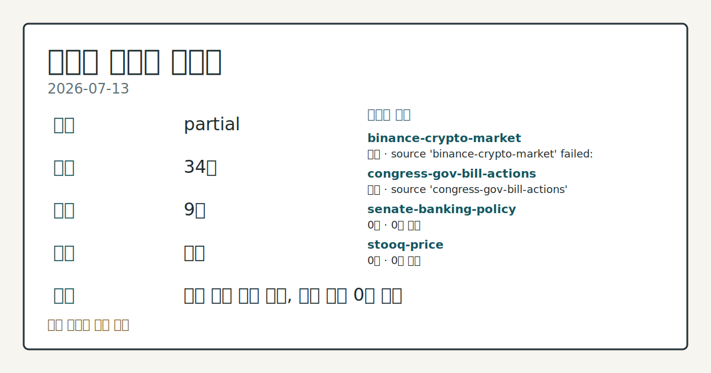
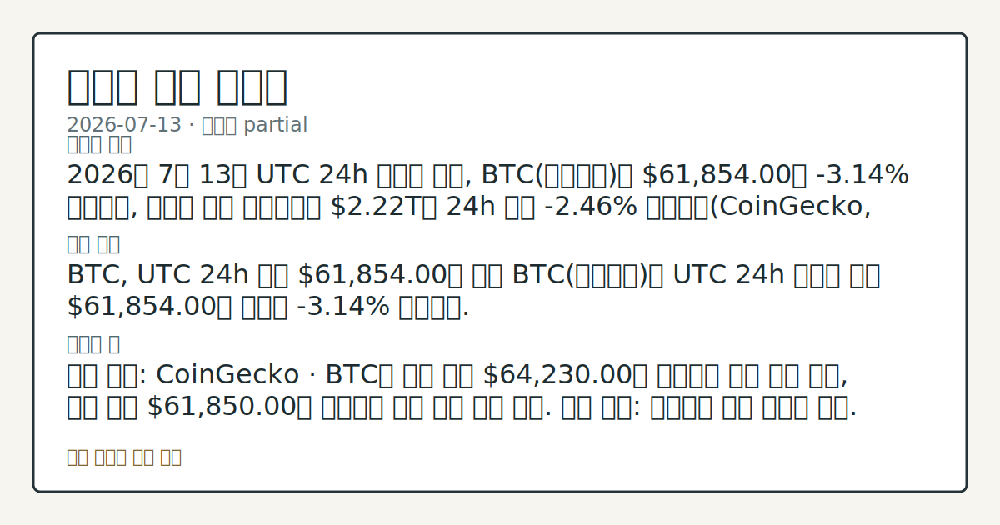
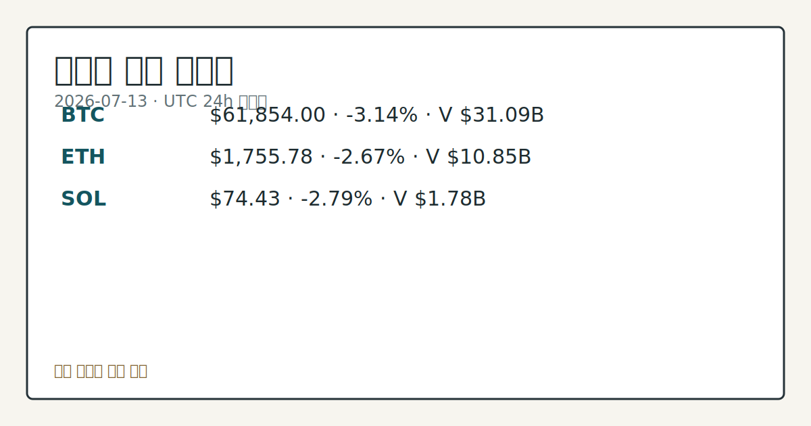

# 2026-07-13 크립토 시황
**기준 시각**: 2026-07-13 UTC · 2026-07-13T00:00Z, 2026-07-14T00:00Z)
| 종목 | 스냅샷(UTC 24h) | 구간 변동 | 비고 |
|------|------|------|------|
| BTC-USD | 61,840.54 | -3.01% | +5.60% from 52w low · -30.31% YTD |
| ETH-USD | 1,754.91 | -2.82% | +12.15% from 52w low · -41.51% YTD |
**세그먼트**: [국내 증시](../../../domestic-equity/2026/07/2026-07-13.md) | [미국 증시](../../../us-equity/2026/07/2026-07-13.md) | [크립토](2026-07-13.md)

*이미지: 데이터 신뢰도 · 출처: investo 자체 생성 · 생성: investo 0.1.0 · 2026-07-13 UTC*
> **내 관심 자산 영향**: 17건 확인 (기본 바스켓) — BTC: 직접 관련 · [cftc-cot-positioning] CFTC Bitcoin CME leveraged_money net -6717 contracts; BTC: 직접 관련 · [coingecko-global-market] Global crypto market cap **$2,220,277,795,348**; BTC dominance **55.96%**; BTC: 직접 관련 · [coingecko-price] BTC **$61,854.00** (**-3.14%**); BTC: 직접 관련 · [okx-derivatives] BTC 미결제약정 **$466,365,420** (OKX, UTC 24h); BTC: 직접 관련 · [okx-derivatives] BTC 펀딩비 0.0001000000000000 (OKX, UTC 24h) 외
> **오늘의 결론**: 2026년 7월 13일 UTC 24h 스냅샷 기준, BTC(비트코인)는 **$61,854.00**로 **-3.14%** 하락했고, 크립토 전체 시가총액은 **$2.22T**로 24h 구간 **-2.46%** 위축됐다(CoinGecko, CoinGecko Global). ETH **-2.67%**, SOL **-2.79%**로 주요 알트코인도 동반 하락했으며, CFTC(미국 상품선물거래위원회) COT(트레이더별 포지션) 보고서 기준 BTC·ETH CME(시카고상품거래소) 레버리지 펀드 포지션은 각각 순매도 -6,717계약, -7,309계약으 수집 근거가 제한적입니다
> **핵심 동인**: BTC, UTC 24h 구간 **$61,854.00**로 하락 BTC(비트코인)는 UTC 24h 스냅샷 기준 **$61,854.00**를 기록해 **-3.14%** 하락했다.
> **주의할 점**: 확인 소스: CoinGecko · BTC가 구간 고가 **$64,230.00**을 상회하면 반등 압력 관찰, 구간 저가 **$61,850.00**를 본문 참고.
> 정보 제공용 자동 시황이며 가상자산 매매 권유가 아닙니다. 가상자산은 가격 변동성이 매우 큽니다.
## 한눈에 보기
미국 증시 마감 이후 크립토 시장은 UTC 24h 스냅샷 기준 BTC **-3.14%**, ETH **-2.67%**, SOL **-2.79%**로 동반 하락했고, 크립토 전체 시가총액은 **-2.46%** 축소됐다.
**BTC**는 CME 레버리지 펀드 포지션이 순매도 **-6,717**계약으로 전환되며 숏 우위 구간으로 바뀌었다(CFTC COT).
공포·탐욕 지수 **28**(공포)과 BTC 미결제약정 **$466,365,420** 수준이 변동성 단서 — 본문 §④ 참조.
## ⓪ 오늘의 매크로
**국제 유가** — CFTC WTI crude oil managed_money net +64041 contracts
**미 국채 수익률** — UST curve 2026-07-13: 10Y 4.62%, 2Y10Y +0.36pp
## ⓪-A 크립토 지표 (UTC 24h 스냅샷)
| 지표 | 값 |
|------|------|
| 공포·탐욕 | 28 (Fear) |
| BTC 도미넌스 | 55.96% |
| 전체 시총 | $2.22T (-2.46% 24h) |
| BTC 펀딩비 | 0.0001000000000000 (okx) |
| BTC 미결제약정 | $466.4M (okx) |
| DeFi TVL | $73.2B |
| 스테이블코인 공급 | $309.7B |
| 24h 청산 / 거래소 순유출입 | 무료 검증 소스 미확정 |
## ⓪-B 채널 기준선
| 기준선 | 값 |
|------|------|
| 비트코인 | 61,840.54 (-3.01%) |
| 이더리움 | 1,754.91 (-2.82%) |
| BTC 도미넌스 | 55.96% |
| 공포·탐욕 | 28 |
| 펀딩/OI/청산 | 펀딩 0.0001000000000000 · OI 수집됨 |
| CFTC 코인 포지셔닝 | Bitcoin CME 순포지션 -6717계약 (-35.67% OI), 2026-07-07 기준/2026-07-10 공개 · Ether CME 순포지션 -7309계약 (-33.61% OI), 2026-07-07 기준/2026-07-10 공개 · 주간 지연 |
> **크로스마켓 연결 고리**: 유가/지정학 이슈가 여러 자산군의 변동성 연결 고리로 관찰됩니다. / 금리 이벤트가 할인율/달러 경로의 공통 변수로 남아 있습니다.
> **오늘의 큰 그림:** 이 세그먼트의 공통 신호는 제한적입니다. 본문 수급·지표 항목을 먼저 확인하세요.
## ① 요약

*이미지: 시장 스냅샷 · 출처: investo 자체 생성 · 생성: investo 0.1.0 · 2026-07-13 UTC*

2026년 7월 13일 UTC 24h 스냅샷 기준, BTC는 **$61,854.00**로 **-3.14%** 하락했고, 크립토 전체 시가총액은 **$2.22T**로 24h 구간 **-2.46%** 위축됐다([CoinGecko](https://www.coingecko.com/en/coins/bitcoin), [CoinGecko Global](https://www.coingecko.com/en/global-charts)). ETH **-2.67%**, SOL **-2.79%**로 주요 알트코인도 동반 하락했으며, CFTC COT 보고서 기준 BTC·ETH CME 레버리지 펀드 포지션은 각각 순매도 **-6,717**계약, **-7,309**계약으로 숏 우위 전환이 확인됐다([CFTC](https://www.cftc.gov/MarketReports/CommitmentsofTraders/index.htm)). 공포·탐욕 지수는 **28**(공포) 구간으로 내려와 가격 하락과 포지셔닝 숏 우위가 같은 방향을 가리킨다. [하락 관찰]

## ② 전일 핵심 이슈

### BTC, UTC 24h 구간 **$61,854.00**로 하락

BTC는 UTC 24h 스냅샷 기준 **$61,854.00**를 기록해 **-3.14%** 하락했다. 이 구간 거래대금은 **$31,090,977,401**, 시가총액은 **$1,240,549,592,793**이며 구간 고가 **$64,230.00**·저가 **$61,850.00**를 오갔다([CoinGecko](https://www.coingecko.com/en/coins/bitcoin)). 최근 흐름에서는 7월 초 크립토 시가총액이 연이어 플러스(+) 전환을 보였던 것과 달리, 이번 스냅샷은 하락 쪽으로 방향이 바뀌며 CME 레버리지 포지션의 숏 우위와 맞물렸다.

> **그래서 의미는?** 최근 상승 흐름이 하락 쪽으로 바뀌어 단기 방향 전환 여부를 확인할 대목입니다.

### Clarity Act, 백악관·상원 압박 국면

The Block에 따르면 트럼프 대통령과 백악관 고위 관계자, 일부 의원들이 Clarity Act(가상자산 시장구조 법안) 처리를 위해 상원에 재차 압박을 가하고 있으며, 윤리 논쟁이 겹친 국면이다([The Block](https://www.theblock.co/post/408054/trump-white-house-press-senate-advance-clarity-act-ethics-fight-looms)). 통과 여부나 가격 영향을 예단하지 않고, 공식 소스가 전한 절차 진행 상황만 전달한다.

## ③ 섹터/수급 동향

### CME 레버리지 펀드, BTC·ETH 모두 순매도 전환

CFTC COT 보고서(주간 집계, 인트라데이 흐름 아님) 기준 BTC CME 레버리지 펀드는 롱 4,406계약·숏 11,123계약으로 순매도 **-6,717**계약(미결제약정의 **-35.7%**)을 기록했고, ETH CME 레버리지 펀드도 롱 2,488계약·숏 9,797계약으로 순매도 **-7,309**계약을 나타냈다([CFTC](https://www.cftc.gov/MarketReports/CommitmentsofTraders/index.htm)). 두 자산 모두 레버리지 자금이 숏 방향으로 기운 점이 공통적이다.

> **그래서 의미는?** 선물시장 레버리지 자금이 BTC·ETH 모두 매도 우위로 기울어 수급 압박 신호로 확인됩니다.

### 온체인·구조적 수급 이슈

소셜 데이터 측면에서 BTC·ETH 트윗 언급량은 기관 자금 유입 확대에도 12개월 최저 수준으로 낮아졌다([The Block](https://www.theblock.co/post/408061/bitcoin-ethereum-tweet-volume-falls-12-month-lows-despite-institutional-crypto-boom)). 파생상품 구조에서는 Hyperliquid의 HIP-3 마켓 비중이 연초 약 2%에서 현재 약 50% 수준까지 늘어 온체인 주식형 거래 확대를 보여줬고([The Block](https://www.theblock.co/post/408064/hyperliquid-hip-3-markets-surge-50-perp-volume-onchain-stock-trading-grows)), 일본 최대 증권형 토큰 플랫폼 Progmat은 자사 발행 잔액의 약 **64.6%**를 차지하는 물량 중 약 **$3B** 규모를 Avalanche 체인으로 이전했다([The Block](https://www.theblock.co/post/408036/japans-largest-security-token-platform-moves-nearly-3-billion-to-avalanche-blockchain)). 스테이블코인 결제 분야에서는 Borderless.xyz 집계 기준 2분기 260개 통화 코리도어에서 스테이블코인 FX(외환)가 은행간 환율보다 3.2bp(베이시스포인트) 낮게 책정돼 라우팅이 최대 비용 변수로 지목됐다([The Block](https://www.theblock.co/post/408006/stablecoin-fx-priced-below-interbank-rates-in-q2-with-routing-now-the-biggest-cost-lever-borderless)). Robinhood Chain은 7월 1일 출시 이후 주간 DEX(탈중앙화 거래소) 거래량 **$3.1B**, 이용자 65,000명을 기록하며 상위 5대 체인권에 접근했다([The Block](https://www.theblock.co/post/408024/robinhood-chain-draws-over-3-billion-in-weekly-dex-volume-to-join-top-five-chains-bernstein)).

## ④ 지표·이벤트

### 크립토 지표 스냅샷 — 공포·탐욕 28, 도미넌스 **55.96%**

UTC 24h 스냅샷 기준 크립토 전체 시가총액은 **$2.22T**(**-2.46%** 24h)로 집계됐고 BTC 도미넌스는 **55.96%**를 기록했다([CoinGecko Global](https://www.coingecko.com/en/global-charts)). 공포·탐욕 지수는 **28**(공포) 구간으로 내려왔다([Alternative.me](https://alternative.me/crypto/fear-and-greed-index/)). DeFi(탈중앙화 금융) TVL(총예치자산)은 **$73.2B**로 이더리움이 **$39.7B**로 최대 비중을 차지했고, 스테이블코인 공급량은 **$309.7B**로 USDT가 **$184.2B**로 선두를 지켰다([DefiLlama](https://defillama.com/)). BTC 미결제약정은 **$466,365,420**, 펀딩비는 0.0001000000000000 수준으로 나타났다([OKX](https://www.okx.com/trade-swap/btc-usd-swap)). 24h 정리·거래소 순유출입 지표는 무료 검증 소스가 확정되지 않아 데이터 미수집으로 표기한다.

> **그래서 의미는?** 공포 심리와 시총 축소가 겹쳐 단기 변동성 확대 가능성을 점검할 필요가 있습니다.

## ⑤ 주요 종목

<!-- u50 lightweight-charts-embed: placeholders consumed by site_docs/assets/investo-chart-init.js -->

<noscript><em>인터랙티브 차트는 JavaScript가 활성화된 환경에서 표시됩니다. 위 정적 카드가 동일한 정보를 담고 있습니다.</em></noscript>

*이미지: 가격 스냅샷 · 출처: investo 자체 생성 · 생성: investo 0.1.0 · 2026-07-13 UTC*

### 가격 관전

ETH(이더리움)는 UTC 24h 스냅샷 기준 **$1,755.78**로 **-2.67%** 하락했고, 거래대금 **$10,846,464,962**, 시가총액 **$211,896,903,062**, 구간 고가 **$1,837.21**·저가 **$1,753.21**를 기록했다([CoinGecko](https://www.coingecko.com/en/coins/ethereum)). SOL(솔라나)은 **$74.43**로 **-2.79%** 내렸고 거래대금 **$1,782,547,422**, 시가총액 **$43,336,223,425**, 구간 고가 **$77.96**·저가 **$74.20**를 나타냈다([CoinGecko](https://www.coingecko.com/en/coins/solana)).

> **그래서 의미는?** ETH·SOL 모두 BTC와 같은 방향으로 하락해 알트코인 전반의 동조화 여부를 확인할 대목입니다.

### 보유·수급 확인 항목

Strategy는 이번 주 비트코인을 추가 매입하지 않았고 **$467M** 규모 MSTR 주식을 매도했으며, 보유 현금성 자산은 **$3B**에 도달했다. 총 보유량은 843,775 BTC로 2,100만 개 공급 상한의 약 4%에 해당하며, 소스는 이를 약 **$53B** 상당으로 전했다([The Block](https://www.theblock.co/post/408004/strategy-sells-467-million-in-mstr-shares-makes-no-bitcoin-purchases-as-usd-reserve-hits-3-billion)). Benchmark·TD Cowen 애널리스트는 Buy 등급과 **$570**, **$260** 수준의 가격 전망치를 유지하며 이를 "재무 규율 강화"로 평가했다([The Block](https://www.theblock.co/post/408069/strategy-no-bitcoin-buy-week-shows-balance-sheet-discipline-analysts-say)). Bitmine은 ETH 27,801개를 추가해 누적 보유량 5,770,000 ETH(전체 공급량의 **4.8%**)로 늘었다고 Tom Lee가 언급했다([The Block](https://www.theblock.co/post/408029/tom-lee-says-users-starting-see-ethereum-money-bitmine-adds-27801-eth)).

### 온체인 관전

7년간 이동이 없던 지갑에서 BTC **$188M** 규모가 이동한 것이 온체인 데이터로 확인됐다. 해당 지갑은 2018년 BTC가 약 **$6,475**에 거래되던 시점 이후 처음 움직였다([The Block](https://www.theblock.co/post/407973/bitcoin-whale-moves-188-million-worth-btc)).

## ⑥ 오늘의 관전 포인트

#### 관찰 신호: BTC

- 출처: CoinGecko
- 현재: CoinGecko · BTC가 구간 고가 **$64,230.00**을 상회하면 반등 압력 관찰, 구간 저가 **$61,850.00**를 하회하면 추가 하방 흐름 점검. 관심 영향: 알트코인 동반 변동성 비교.
- 확인 조건: 상방 BTC가 구간 고가 **$64,230.00**을 상회하면 반등 압력 관찰; 하방 구간 저가 **$61,850.00**를 하회하면 추가 하방 흐름 점검
- 신뢰도: 높음
- 관심 영향: 알트코인 동반 변동성 비교.

#### 관찰 신호: BTC 도미넌스

- 출처: CoinGecko Global
- 현재: CoinGecko Global · BTC 도미넌스가 **55.96%**를 상회 유지하면 알트코인 대비 자금 쏠림 관찰, 하회로 전환되면 알트코인 상대강도 회복 점검. 관심 영향: 알트코인 섹터 자금 흐름 비교.
- 확인 조건: 상방 BTC 도미넌스가 **55.96%**를 상회 유지하면 알트코인 대비 자금 쏠림 관찰; 하방 하회로 전환되면 알트코인 상대강도 회복 점검
- 신뢰도: 높음
- 관심 영향: 알트코인 섹터 자금 흐름 비교.

#### 관찰 신호: DeFi TVL

- 출처: DefiLlama
- 현재: DefiLlama · DeFi TVL이 **$73.2B**를 상회 유지하면 온체인 자금 유입 관찰, 하회하면 자금 이탈 점검. 관심 영향: 스테이블코인 공급 **$309.7B**와의 흐름 비교.
- 확인 조건: 상방 DeFi TVL이 **$73.2B**를 상회 유지하면 온체인 자금 유입 관찰; 하방 하회하면 자금 이탈 점검
- 신뢰도: 높음
- 관심 영향: 스테이블코인 공급 **$309.7B**와의 흐름 비교.

> **데이터 상태**: 부분

수집/품질 진단

> **데이터 상태**: 부분 — 수집 34건 / 소스 9개 / 누락: 없음 · 부분 — 일부 카테고리 미수집, 본문 일부 결론 보강 필요
> **소스 카운트**: 수집 대상 14 / 성공 10 / 수집 상세는 진단 섹션에서 확인할 수 있습니다. / 수집 상세는 진단 섹션에서 확인할 수 있습니다. / 수집 상세는 진단 섹션에서 확인할 수 있습니다.
> **소스 등급 분포**: S=3 / A=2 / B=5
> **상세 사유**: 일부 소스 수집 실패, 일부 소스 0건 반환
> **소스별 상태**: binance-crypto-market 실패 (접근 제한), congress-gov-bill-actions 실패 (설정 미완료(미수집)), senate-banking-policy 0건, stooq-price 0건, 정상 10개

## ⑦ 면책조항
본 시황은 일반 정보 제공을 목적으로 자동 생성된 자료이며,
특정 가상자산에 대한 매매 권유나 투자 자문이 아닙니다.
가상자산은 가상자산이용자보호법(2024-07-19 시행) §10·§19의 적용 대상으로,
24시간 거래되는 비제도권 자산이며 가격 변동성이 매우 크고 원금 전액 손실이 가능합니다.
투자 결정과 그 결과에 대한 책임은 전적으로 본인에게 있으며,
본 시황의 내용에 따라 발생한 손실에 대해 작성자는 일체의 책임을 지지 않습니다.