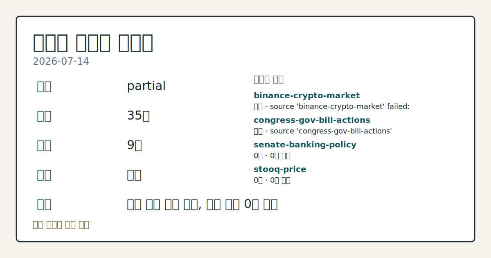
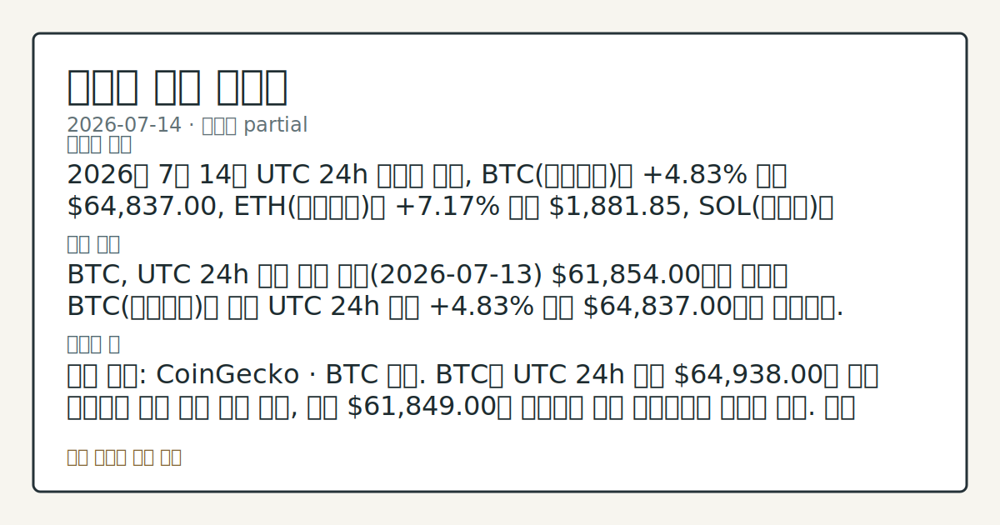
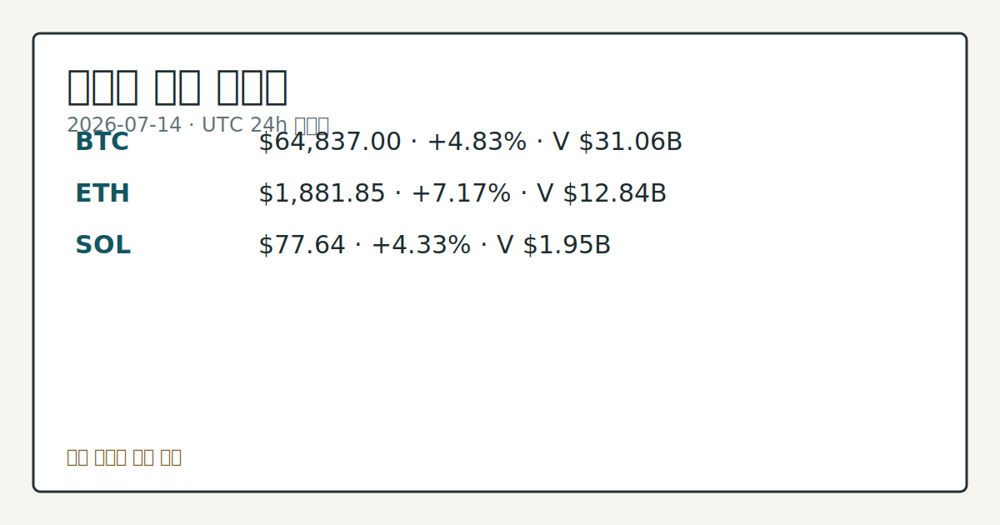

# 2026-07-14 크립토 시황
**기준 시각**: 2026-07-14 UTC · 2026-07-14T00:00Z, 2026-07-15T00:00Z)
| 종목 | 스냅샷(UTC 24h) | 구간 변동 | 비고 |
|------|------|------|------|
| BTC-USD | 64,745.30 | +4.03% | +10.56% from 52w low · -27.03% YTD |
| ETH-USD | 1,878.31 | +5.91% | +20.03% from 52w low · -37.40% YTD |
**세그먼트**: [국내 증시](../../../domestic-equity/2026/07/2026-07-14.md) | [미국 증시](../../../us-equity/2026/07/2026-07-14.md) | [크립토](2026-07-14.md)

*이미지: 데이터 신뢰도 · 출처: investo 자체 생성 · 생성: investo 0.1.0 · 2026-07-14 UTC*
> **내 관심 자산 영향**: 15건 확인 (기본 바스켓) — BTC: 직접 관련 · [cftc-cot-positioning] CFTC Bitcoin CME leveraged_money net -6717 contracts; BTC: 직접 관련 · [coingecko-global-market] Global crypto market cap **$2,309,375,095,328**; BTC dominance **56.34%**; BTC: 직접 관련 · [coingecko-price] BTC **$64,837.00** (**+4.83%**); BTC: 직접 관련 · [okx-derivatives] BTC 미결제약정 **$470,679,030** (OKX, UTC 24h); BTC: 직접 관련 · [okx-derivatives] BTC 펀딩비 0.0000878476270459 (OKX, UTC 24h) 외
> **용어 가이드**: 이번 시황에서 처음 등장한 용어 — 거래대금(거래총액), 시가총액(시장가치)
> **오늘의 결론**: 2026년 7월 14일 UTC 24h 스냅샷 기준, BTC(비트코인)는 **+4.83%** 오른 **$64,837.00**, ETH(이더리움)는 **+7.17%** 오른 **$1,881.85**, SOL(솔라나)은 **+4.33%** 오른 **$77.64**로 3대 자산이 함께 상승했다. 수집 근거가 제한적입니다
> **핵심 동인**: BTC, UTC 24h 반등 전환 어제(2026-07-13) **$61,854.00**까지 밀렸던 BTC(비트코인)는 오늘 UTC 24h 구간 **+4.83%** 오른 **$64,837.00**으로 반등했다.
> **주의할 점**: 확인 소스: CoinGecko · BTC 가격. BTC가 UTC 24h 고가 **$64,938.00**를 재차 상회하면 상승 흐름 지속 관찰, 저가 본문 참고.
> 정보 제공용 자동 시황이며 가상자산 매매 권유가 아닙니다. 가상자산은 가격 변동성이 매우 큽니다.
## 한눈에 보기
**BTC**(비트코인)가 UTC 24h 구간 **+4.83%** 오른 **$64,837.00**을 기록했고, 크립토 전체 시가총액은 **$2.31T**로 **+4.16%** 상승했다.
**ETH**(이더리움)는 **+7.17%** 올라 **$1,881.85**를 기록해 3대 자산 중 가장 큰 상승폭을 보였다.
**CFTC** COT 상 BTC 레버리지 자금은 순매도 **-6,717**계약, 10Y 국채금리는 **4.58%**로 유지돼 본문 §③·§④에서 반등의 지속가능성을 확인할 변수로 남아 있다.
## ⓪ 오늘의 매크로
**FOMC 일정** — 2026-07-29 — FOMC Meeting
**국제 유가** — CFTC WTI crude oil managed_money net +64041 contracts
**미 국채 수익률** — UST curve 2026-07-14: 10Y 4.58%, 2Y10Y +0.40pp
## ⓪-A 크립토 지표 (UTC 24h 스냅샷)
| 지표 | 값 |
|------|------|
| 공포·탐욕 | 22 (Extreme Fear) |
| BTC 도미넌스 | 56.34% |
| 전체 시총 | $2.31T (+4.16% 24h) |
| BTC 펀딩비 | 0.0000878476270459 (okx) |
| BTC 미결제약정 | $470.7M (okx) |
| DeFi TVL | $75.5B |
| 스테이블코인 공급 | $308.6B |
| 24h 청산 / 거래소 순유출입 | 무료 검증 소스 미확정 |
## ⓪-B 채널 기준선
| 기준선 | 값 |
|------|------|
| 비트코인 | 64,745.30 (+4.03%) |
| 이더리움 | 1,878.31 (+5.91%) |
| BTC 도미넌스 | 56.34% |
| 공포·탐욕 | 22 |
| 펀딩/OI/청산 | 펀딩 0.0000878476270459 · OI 수집됨 |
| CFTC 코인 포지셔닝 | Bitcoin CME 순포지션 -6717계약 (-35.67% OI), 2026-07-07 기준/2026-07-10 공개 · Ether CME 순포지션 -7309계약 (-33.61% OI), 2026-07-07 기준/2026-07-10 공개 · 주간 지연 |
> **크로스마켓 연결 고리**: 유가/지정학 이슈가 여러 자산군의 변동성 연결 고리로 관찰됩니다. / 금리 이벤트가 할인율/달러 경로의 공통 변수로 남아 있습니다.
> **오늘의 큰 그림:** 이 세그먼트의 공통 신호는 제한적입니다. 본문 수급·지표 항목을 먼저 확인하세요.
## ① 요약

*이미지: 시장 스냅샷 · 출처: investo 자체 생성 · 생성: investo 0.1.0 · 2026-07-14 UTC*

2026년 7월 14일 UTC 24h 스냅샷 기준, BTC는 **+4.83%** 오른 **$64,837.00**, ETH는 **+7.17%** 오른 **$1,881.85**, SOL은 **+4.33%** 오른 **$77.64**로 3대 자산이 함께 상승했다. 크립토 전체 시가총액은 **$2.31T**로 **+4.16%** 늘며 BTC 도미넌스 **56.34%**를 유지했지만, 같은 구간 공포·탐욕 지수는 22(Extreme Fear)에 머물렀고 CFTC(상품선물거래위원회) COT(트레이더포지션보고서) 상 비트코인·이더 레버리지 자금은 각각 순매도 **-6,717**계약, **-7,309**계약 포지션을 유지해 가격 반등과 포지셔닝·심리 지표가 엇갈렸다. [혼재]

## ② 전일 핵심 이슈

### BTC, UTC 24h 반등 전환

어제(2026-07-13) **$61,854.00**까지 밀렸던 BTC는 오늘 UTC 24h 구간 **+4.83%** 오른 **$64,837.00**으로 반등했다. [The Block](https://www.theblock.co/post/408263/soft-print-hard-regime-bitcoin-climbs-64000-june-cpi-falls-largest-monthly-drop-since-2020) 보도에 따르면 6월 CPI(소비자물가지수)가 전월 대비 **0.4%** 하락해 2020년 이후 최대 월간 낙폭을 기록했고 근원 CPI는 연 **2.6%**로 유지되면서, 이 인플레이션 둔화가 BTC의 **$64,000**선 접근을 뒷받침하는 배경으로 거론됐다.

> **그래서 의미는?** 물가 상승세 둔화 신호가 위험자산 매수 심리를 일부 되살린 것으로 관찰된다.

### 반등에도 남은 경계 신호

다만 같은 구간 공포·탐욕 지수는 22에 머물러 있고, CFTC COT 상 레버리지 자금 포지셔닝도 순매도 우위를 유지해(자세한 수치는 §③ 참고) 가격 반등과 심리·수급 지표가 엇갈리는 모습이다.

## ③ 섹터/수급 동향

### CFTC 포지셔닝: 레버리지 자금 순매도 유지

CFTC COT 최신 주간 보고서에 따르면 비트코인 CME(시카고상업거래소) 선물의 레버리지 자금은 롱 4,406계약, 숏 11,123계약으로 순매도 **-6,717**계약(전체 미결제약정의 **-35.7%**)을 기록했고, 이더 CME 선물 레버리지 자금도 롱 2,488계약, 숏 9,797계약으로 순매도 **-7,309**계약을 유지했다. [CFTC](https://www.cftc.gov/MarketReports/CommitmentsofTraders/index.htm) 주간 집계로 장중 실시간 흐름은 아니다.

> **그래서 의미는?** 파생 시장에서는 여전히 하방 베팅이 우위인 만큼 현물 반등의 지속 여부는 추가 확인이 필요하다.

### DeFi·스테이블코인 예치 규모

DeFi(탈중앙화 금융) TVL(예치자산총액)은 [**$75.5B**](https://defillama.com/)로 이더리움이 **$41.1B**로 선두를 유지했고, BSC **$5.0B**, Solana **$4.9B**, Tron **$4.8B**, Base **$4.5B**가 뒤를 이었다. 스테이블코인 공급은 **$308.6B**로 USDT가 **$184.2B**로 최대 비중을 차지했고, USDC **$73.1B**, USDS **$6.6B**, DAI **$4.9B**, USD1 **$4.4B** 순이다.

### 기관·정책 동향

이더리움 재단 프라이버시팀은 기관 고객 대상 컨설팅을 위해 영리법인 EthSystems로 분사했으며 Lubin과 Bitmine이 지원한다([The Block](https://www.theblock.co/post/408331/ethereum-foundation-privacy-team-spins-out-as-for-profit-ethsystems-to-serve-institutions-with-lubin-bitmine-backing)). 미국과 영국은 스테이블코인·토큰화 자산을 중심으로 한 디지털자산 로드맵을 공개했고([The Block](https://www.theblock.co/post/408305/us-uk-transatlantic-taskforce-unveils-digital-asset-roadmap-promoting-stablecoin-innovation)), Galaxy는 Aave·Morpho 등 DeFi 금리를 결합한 신규 대출 상품 GOFR를 출시했다([The Block](https://www.theblock.co/post/408267/galaxy-blends-aave-morpho-other-defi-rates-new-gofr-crypto-borrowing-product)). Tether는 USAT 스테이블코인 확산을 위해 Pact Labs 대상 700만 달러 규모 투자 라운드를 주도했다([The Block](https://www.theblock.co/post/408239/tether-leads-7-million-round-in-pact-labs-to-boost-usat-stablecoin-adoption)).

## ④ 지표·이벤트

### 파생·자금조달 지표

OKX 기준 BTC OI(미결제약정)는 **$470,679,030**([OKX](https://www.okx.com/trade-swap/btc-usd-swap)), 펀딩비는 0.0000878476270459로 집계됐다. 24h 정리 및 거래소 순유출입은 데이터 미수집 상태다.

> **그래서 의미는?** 펀딩비가 극단적이지 않은 수준이어서 아직 과열된 레버리지 쏠림으로 보기는 이르다.

### 매크로 배경

UST(미국 국채) 금리는 10Y **4.58%**, 2Y10Y 스프레드 **+0.40pp**를 기록했다([Treasury](https://home.treasury.gov/resource-center/data-chart-center/interest-rates)) (3M **3.84%**, 2Y **4.18%**, 30Y **5.08%**, 3M10Y **+0.74pp**). ECB(유럽중앙은행)는 2027년 후반 시작하는 디지털 유로 파일럿에 결제 서비스 제공업체 36곳을 선정했다([The Block](https://www.theblock.co/post/408228/european-central-bank-taps-36-payment-providers-for-yearlong-digital-euro-pilot)).

## ⑤ 주요 종목

<!-- u50 lightweight-charts-embed: placeholders consumed by site_docs/assets/investo-chart-init.js -->

<noscript><em>인터랙티브 차트는 JavaScript가 활성화된 환경에서 표시됩니다. 위 정적 카드가 동일한 정보를 담고 있습니다.</em></noscript>

*이미지: 가격 스냅샷 · 출처: investo 자체 생성 · 생성: investo 0.1.0 · 2026-07-14 UTC*

### 시세 스냅샷 (UTC 24h)

| 자산 | 가격 | 변동 | 24h 거래대금 | 시가총액 |
|---|---|---|---|---|
| BTC | $64,837.00 | +4.83% | $31,055,051,351 | $1,300,505,984,291 |
| ETH | $1,881.85 | +7.17% | $12,841,745,253 | $227,116,613,553 |
| SOL | $77.64 | +4.33% | $1,953,474,582 | $45,216,588,191 |

> **그래서 의미는?** BTC·ETH·SOL이 고르게 올라 반등이 특정 종목에 국한되지 않음을 보여준다.

### 체크리스트: 스테이블코인 경제성

Circle(USDC 발행사)에 대해 월가는 신중론으로 기운다. Mizuho는 투자의견을 하향했고 JPMorgan은 이익 전망치를 낮추며 USDC 수익 구조에 대한 압박 우려를 제기했다([The Block](https://www.theblock.co/post/408280/wall-street-cautious-circle-warn-usdc-economics)).

### 채굴·인프라 관전

CleanSpark, BitFuFu, Canaan은 채굴 난이도가 10% 넘게 하락했음에도 6월 비트코인 생산량이 줄었다고 밝혔다([The Block](https://www.theblock.co/post/408260/bitcoin-mining-production-slips-june-cleanspark-bitfufu-canaan)). Benchmark는 Hut 8 주가 전망치를 **$165**로 상향하며 **$16.8B** 규모의 AI 데이터센터 계약과 Beacon Point 상업화를 근거로 들었다([The Block](https://www.theblock.co/post/408264/benchmark-sees-long-pathway-growth-hut-8-raises-target-to-165-on-ai-data-center-deals)). CleanSpark은 조지아주 샌더스빌에서 미공개 대형 기술기업과 20년간 **$6.6B** 규모의 데이터센터 임대 계약을 체결했다([The Block](https://www.theblock.co/post/408215/cleanspark-signs-20-year-data-center-lease-with-unnamed-tech-giant)).

## ⑥ 오늘의 관전 포인트

#### 관찰 신호: BTC 가격. BTC

- 출처: CoinGecko
- 현재: BTC 가격
- 확인 조건: 상방 BTC가 UTC 24h 고가 **$64,938.00**를 재차 상회하면 상승 흐름 지속 관찰; 하방 저가 **$61,849.00**를 하회하면 어제 수준으로의 되돌림 관찰
- 신뢰도: 높음
- 관심 영향: 어제 하락에서 오늘 반등으로 전환된 흐름의 지속 여부를 점검.

#### 관찰 신호: ETH 가격. ETH

- 출처: CoinGecko
- 현재: ETH 가격
- 확인 조건: 상방 ETH가 UTC 24h 고가 **$1,890.43**을 상회하면 BTC 대비 상대 강세 지속 관찰; 하방 저가 **$1,755.90**을 하회하면 상대 강세 되돌림 관찰
- 신뢰도: 높음
- 관심 영향: BTC 대비 ETH 상승폭 우위의 지속 여부 확인.

> **데이터 상태**: 부분

수집/품질 진단

> **데이터 상태**: 부분 — 수집 35건 / 소스 9개 / 누락: 없음 · 부분 — 일부 카테고리 미수집, 본문 일부 결론 보강 필요
> **소스 카운트**: 수집 대상 14 / 성공 10 / 수집 상세는 진단 섹션에서 확인할 수 있습니다. / 수집 상세는 진단 섹션에서 확인할 수 있습니다. / 수집 상세는 진단 섹션에서 확인할 수 있습니다.
> **소스 등급 분포**: S=3 / A=2 / B=5
> **상세 사유**: 일부 소스 수집 실패, 일부 소스 0건 반환
> **소스별 상태**: binance-crypto-market 실패 (접근 제한), congress-gov-bill-actions 실패 (설정 미완료(미수집)), senate-banking-policy 0건, stooq-price 0건, 정상 10개

## ⑦ 면책조항
본 시황은 일반 정보 제공을 목적으로 자동 생성된 자료이며,
특정 가상자산에 대한 매매 권유나 투자 자문이 아닙니다.
가상자산은 가상자산이용자보호법(2024-07-19 시행) §10·§19의 적용 대상으로,
24시간 거래되는 비제도권 자산이며 가격 변동성이 매우 크고 원금 전액 손실이 가능합니다.
투자 결정과 그 결과에 대한 책임은 전적으로 본인에게 있으며,
본 시황의 내용에 따라 발생한 손실에 대해 작성자는 일체의 책임을 지지 않습니다.