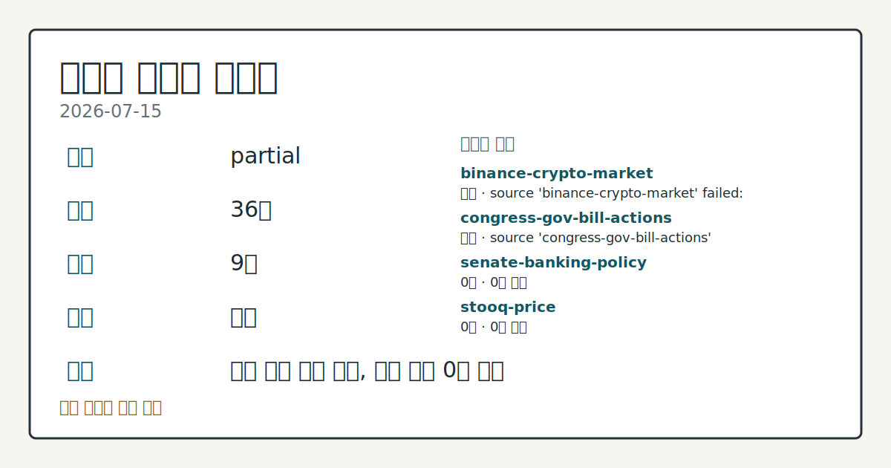
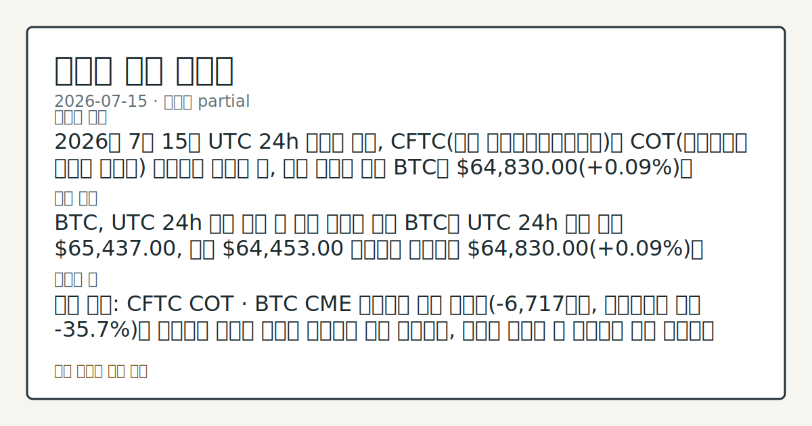
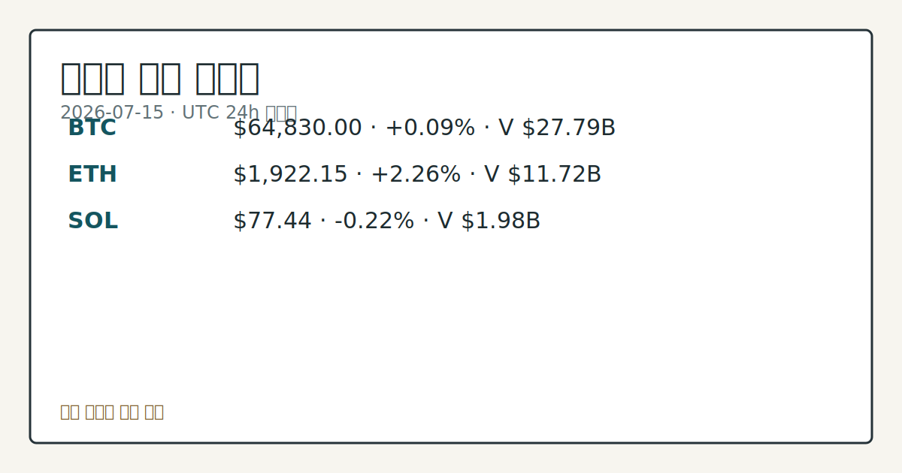
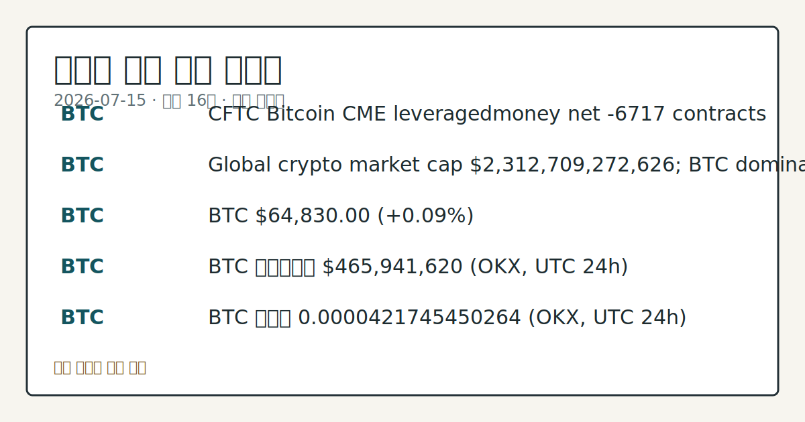

# 2026-07-15 크립토 시황
**기준 시각**: 2026-07-15 UTC · 2026-07-15T00:00Z, 2026-07-16T00:00Z)
| 종목 | 스냅샷(UTC 24h) | 구간 변동 | 비고 |
|------|------|------|------|
| BTC-USD | 64,851.43 | -0.16% | +10.75% from 52w low · -26.91% YTD |
| ETH-USD | 1,923.62 | +1.81% | +22.93% from 52w low · -35.89% YTD |
**세그먼트**: [국내 증시](../../../domestic-equity/2026/07/2026-07-15.md) | 미국 증시(미발행) | [크립토](2026-07-15.md)

*이미지: 데이터 신뢰도 · 출처: investo 자체 생성 · 생성: investo 0.1.0 · 2026-07-15 UTC*
> **내 관심 자산 영향**: 16건 확인 (기본 바스켓) — BTC: 직접 관련 · [cftc-cot-positioning] CFTC Bitcoin CME leveraged_money net -6717 contracts; BTC: 직접 관련 · [coingecko-global-market] Global crypto market cap **$2,312,709,272,626**; BTC dominance **56.24%**; BTC: 직접 관련 · [coingecko-price] BTC **$64,830.00** (**+0.09%**); BTC: 직접 관련 · [okx-derivatives] BTC 미결제약정 **$465,941,620** (OKX, UTC 24h); BTC: 직접 관련 · [okx-derivatives] BTC 펀딩비 0.0000421745450264 (OKX, UTC 24h) 외
> **용어 가이드**: 이번 시황에서 처음 등장한 용어 — ETF(상장지수펀드)
> **오늘의 결론**: 2026년 7월 15일 UTC 24h 스냅샷 기준, CFTC(미국 상품선물거래위원회)의 COT(트레이더별 포지션 보고서) 데이터가 나오기 전, 가격 축부터 보면 BTC는 **$64,830.00**(**+0.09%**)로 어제(2026-07-14)의 **+4.83%** 급반등 대비 상승 탄력이 크게 둔화됐다. 수집 근거가 제한적입니다
> **핵심 동인**: BTC, UTC 24h 소폭 상승 속 반등 탄력은 둔화 BTC는 UTC 24h 구간 고가 **$65,437.00**, 저가 **$64,453.00** 사이에서 움직이며 **$64,830.00**(**+0.09%**)을 기록했다.
> **주의할 점**: 확인 소스: CFTC COT · BTC CME 레버리지 자금 순매도(-6,717계약, 미결제약정 대비 **-35.7%**)가 축소되며 순매수 쪽으로 본문 참고.
> 정보 제공용 자동 시황이며 가상자산 매매 권유가 아닙니다. 가상자산은 가격 변동성이 매우 큽니다.
## 한눈에 보기
2026년 7월 15일 UTC 24h 스냅샷 기준, CFTC의 COT 데이터가 나오기 전, 가격 축부터 보면 BTC는 **$64,830.00**(**+0.09%**)로 어제의 **+4.83%** 급반등 대비 상승 탄력이 크게 둔화됐다. 수집 근거가 제한적입니다
BTC, UTC 24h 소폭 상승 속 반등 탄력은 둔화 BTC는 UTC 24h 구간 고가 **$65,437.00**, 저가 **$64,453.00** 사이에서 움직이며 **$64,830.00**(**+0.09%**)을 기록했다.
확인 소스: CFTC COT · BTC CME 레버리지 자금 순매도가 축소되며 순매수 쪽으로 돌아서면 상방 압력으로, 순매도 규모가 더 벌어지면 하방 압력으로 해석되며, 관심 영향은 기관 포지셔닝 흐름을 점검하는 것이다.
## ⓪ 오늘의 매크로
**FOMC 일정** — 2026-07-29 — FOMC Meeting
**미 국채 수익률** — UST curve 2026-07-15: 10Y 4.55%, 2Y10Y +0.42pp
## ⓪-A 크립토 지표 (UTC 24h 스냅샷)
| 지표 | 값 |
|------|------|
| 공포·탐욕 | 25 (Extreme Fear) |
| BTC 도미넌스 | 56.24% |
| 전체 시총 | $2.31T (+0.21% 24h) |
| BTC 펀딩비 | 0.0000421745450264 (okx) |
| BTC 미결제약정 | $465.9M (okx) |
| DeFi TVL | $75.9B |
| 스테이블코인 공급 | $308.3B |
| 24h 청산 / 거래소 순유출입 | 무료 검증 소스 미확정 |
## ⓪-B 채널 기준선
| 기준선 | 값 |
|------|------|
| 비트코인 | 64,851.43 (-0.16%) |
| 이더리움 | 1,923.62 (+1.81%) |
| BTC 도미넌스 | 56.24% |
| 공포·탐욕 | 25 |
| 펀딩/OI/청산 | 펀딩 0.0000421745450264 · OI 수집됨 |
| CFTC 코인 포지셔닝 | Bitcoin CME 순포지션 -6717계약 (-35.67% OI), 2026-07-07 기준/2026-07-10 공개 · Ether CME 순포지션 -7309계약 (-33.61% OI), 2026-07-07 기준/2026-07-10 공개 · 주간 지연 |
> **크로스마켓 연결 고리**: 금리 이벤트가 할인율/달러 경로의 공통 변수로 남아 있습니다.
> **오늘의 큰 그림:** 이 세그먼트의 공통 신호는 제한적입니다. 본문 수급·지표 항목을 먼저 확인하세요.
## ① 요약

*이미지: 시장 스냅샷 · 출처: investo 자체 생성 · 생성: investo 0.1.0 · 2026-07-15 UTC*

2026년 7월 15일 UTC 24h 스냅샷 기준, [CFTC](https://www.cftc.gov/MarketReports/CommitmentsofTraders/index.htm)(미국 상품선물거래위원회)의 COT 데이터가 나오기 전, 가격 축부터 보면 BTC는 **$64,830.00**(**+0.09%**)로 어제의 **+4.83%** 급반등 대비 상승 탄력이 크게 둔화됐다. ETH는 **$1,922.15**(**+2.26%**)로 개별 강세를 보였지만 SOL은 **$77.44**(**-0.22%**)로 소폭 밀렸고, 전체 크립토 시가총액은 **$2.31T**(**+0.21%** 24h)로 BTC 도미넌스 **56.24%**를 유지했다. 공포·탐욕지수는 25(Extreme Fear·극단적 공포)로 여전히 극단적 공포 구간이며, BTC·ETH CME(시카고상품거래소) 레버리지 자금은 COT 기준 각각 순매도 -6,717계약, -7,309계약으로 순매도 우위가 이어졌다. 가격 반등폭 둔화, 극단적 공포 심리, 레버리지 자금 순매도가 동시에 나타나는 흐름이다. [혼재]

## ② 전일 핵심 이슈

### BTC, UTC 24h 소폭 상승 속 반등 탄력은 둔화

BTC는 UTC 24h 구간 고가 **$65,437.00**, 저가 **$64,453.00** 사이에서 움직이며 **$64,830.00**(**+0.09%**)을 기록했다. 어제(2026-07-14) **$61,854.00**대에서 **+4.83%** 강하게 반등했던 흐름과 비교하면 오늘은 상승폭이 크게 줄어, 반등이 이어지되 속도는 눈에 띄게 느려진 모습이다.

> **그래서 의미는?** 가격은 소폭 올랐지만 어제 같은 강한 반등 탄력은 약해졌습니다.

### Ostium 볼트 익스플로잇과 Circle-Tether 펀드 정지

[The Block](https://www.theblock.co/post/408450/ostium-pauses-trading-after-apparent-18-million-vault-exploit) 보도에 따르면 파생상품 플랫폼 Ostium은 약 **$18 million** 규모 볼트 익스플로잇 의혹이 제기된 뒤 거래를 일시 중단했다. 온체인 데이터상 공격자는 탈취 자금을 USDC에서 ETH로 전환한 뒤 여러 지갑으로 분산시킨 것으로 나타났다. 별도로 [The Block](https://www.theblock.co/post/408377/circle-suspended-tether-backed-fund-over-market-manipulation-concerns-arbitration-filings-show) 은 Circle이 Tether가 **$800 million**을 투자한 차익거래 펀드 Heka Funds를, 시세 조작 의혹 정황이 확인된 뒤 정지시켰다고 중재 서류를 인용해 전했다.

### 트럼프 회동과 기관 채택 배경 뉴스

[The Block](https://www.theblock.co/post/408517/hugely-positive-meeting-thursday-trump-ethics-raises-hopes-passage-sweeping-crypto-legislation) 은 목요일 트럼프 대통령과 소수 의원단·백악관 관계자의 회동에서 윤리 문제가 핵심 의제가 될 예정이며, 이를 두고 포괄적 크립토 입법 통과에 대한 기대가 커지고 있다고 전했다. [Bitwise](https://www.theblock.co/post/408449/bull-markets-everywhere-bitwise-crypto-equities-beat-major-asset-class-h1) 는 2026년 상반기 크립토 자산 가격이 36% 하락한 반면 크립토 관련 상장주식은 23% 상승해 신흥시장을 제외한 모든 주요 자산군을 앞섰고, RWA(실물자산 토큰화) 규모는 2분기 기준 **$33 billion**으로 사상 최고치를 기록했다고 밝혔다. 또 [The Block](https://www.theblock.co/post/408419/dtcc-begins-first-tokenized-stock-and-treasury-production-trades-involving-jpmorgan-blackrock-and-goldman-wsj) 에 따르면 DTCC(예탁결제원)가 JPMorgan·BlackRock·Goldman이 관여한 최초의 토큰화 주식·국채 프로덕션 거래를 시작했으며, JPMorgan은 Invesco QQQ Trust 보유분 일부를 토큰화하고 Microsoft·Circle·SPY 주식도 토큰화 대상에 포함된다.

## ③ 섹터/수급 동향

### BTC·ETH 레버리지 자금, CME 순매도 우위 지속

[CFTC COT](https://www.cftc.gov/MarketReports/CommitmentsofTraders/index.htm) 주간 보고서 기준 BTC CME 레버리지 자금은 롱 4,406계약, 숏 11,123계약으로 순매도 -6,717계약(미결제약정 대비 **-35.7%**)을 기록했다. ETH CME 레버리지 자금 역시 롱 2,488계약, 숏 9,797계약으로 순매도 -7,309계약(미결제약정 대비 **-33.6%**)이었다. 두 자산 모두 레버리지 자금이 순매도 우위를 이어가고 있으며, 이는 실시간 흐름이 아닌 주간 보고서 기준이다.

> **그래서 의미는?** 기관·레버리지 자금은 BTC·ETH 모두에서 여전히 매도 쪽에 무게가 실려 있습니다.

### 기관 인프라 확장 스토리

[The Block](https://www.theblock.co/post/408525/stripe-paypal-deal-accelerate-stablecoins-blockchain) 보도에서 Polygon Labs 임원은 Stripe-PayPal 제휴가 "향후 수년 내 자금 대부분이 어떤 형태로든 블록체인 위에서 움직이는" 흐름을 앞당길 수 있다고 말했다. [BlackRock](https://www.theblock.co/post/408436/blackrock-outlines-vision-crypto-tradfi-convergence-product-pipeline-grows) 은 국채 펀드·iShares ETF·사모시장까지 토큰화된 장기 투자상품을 제공하겠다는 크립토-전통금융 융합 비전을 제시했다. [The Block](https://www.theblock.co/post/408308/how-crypto-venues-are-building-financial-operating-systems-binance-as-a-super-app) 은 Binance 등 대형 거래소들이 체결·유동성·지연시간·수수료 경쟁력을 기반으로 거래 플랫폼에서 종합 금융 운영체제로 진화하고 있다고 분석했다.

### 수익형 볼트·RWA 확장 (참고)

[The Block](https://www.theblock.co/post/408448/kraken-institutional-taps-upshift-to-build-vaults-that-earn-yield-on-idle-bitcoin-eth-and-stablecoins) 에 따르면 Kraken Institutional은 Upshift와 손잡고 유휴 비트코인·ETH·스테이블코인에서 수익을 내는 맞춤형 볼트를 구축한다. [Aave](https://www.theblock.co/post/408366/stani-kulechov-on-aave-v4-avalanche-and-why-rwas-will-hit-100-billion-this-year) 창립자 Stani Kulechov는 V4의 Avalanche 진출을 언급하며 RWA 시장이 연말까지 **$100 billion** 규모로 커질 것이라는 전망을 밝혔다. [The Block](https://www.theblock.co/post/408399/tokenization-startup-tradable-plans-bring-1-billion-private-credit-assets-stellar) 은 토큰화 스타트업 Tradable이 **$1 billion** 규모 사모 신용자산을 Stellar로 가져올 계획이라고 전했다.

## ④ 지표·이벤트

### 매크로·시장 전반 지표

전체 크립토 시가총액은 [CoinGecko](https://www.coingecko.com/en/global-charts) 기준 **$2,312,709,272,626**(약 **$2.31T**, **+0.21%** 24h)이며 BTC 도미넌스는 **56.24%**다. [alternative.me](https://alternative.me/crypto/fear-and-greed-index/) 공포·탐욕지수는 25로 극단적 공포 구간을 유지했다. [미 재무부](https://home.treasury.gov/resource-center/data-chart-center/interest-rates) UST 커브는 3M **3.83%**, 2Y **4.13%**, 10Y **4.55%**, 30Y **5.08%**로, 2Y10Y 스프레드는 **+0.42%p**, 3M10Y 스프레드는 **+0.72%p**다.

> **그래서 의미는?** 극단적 공포 심리와 금리 부담이 겹쳐 자금 유입 여건이 아직 우호적이지 않습니다.

### 온체인·파생 지표

[DefiLlama](https://defillama.com/) 기준 DeFi(탈중앙화 금융) TVL(예치자산총액)은 **$75.9B**로 Ethereum이 **$41.5B**로 선두, BSC **$5.0B**, Solana **$4.9B**, Tron **$4.8B**, Base **$4.6B** 순이다. 스테이블코인 공급은 **$308.3B**로 USDT **$184.1B**, USDC **$73.1B**, USDS **$6.7B**, DAI **$4.9B**, USD1 **$4.4B** 순이다. [OKX](https://www.okx.com/trade-swap/btc-usd-swap) 기준 BTC 미결제약정은 **$465,941,620**, 펀딩비는 0.0000421745450264다. 24시간 정리 규모와 거래소 순유출입은 무료 검증 소스가 미확정 상태로, 데이터 미수집으로 남겨둔다.

## ⑤ 주요 종목

<!-- u50 lightweight-charts-embed: placeholders consumed by site_docs/assets/investo-chart-init.js -->

<noscript><em>인터랙티브 차트는 JavaScript가 활성화된 환경에서 표시됩니다. 위 정적 카드가 동일한 정보를 담고 있습니다.</em></noscript>

*이미지: 가격 스냅샷 · 출처: investo 자체 생성 · 생성: investo 0.1.0 · 2026-07-15 UTC*

### 가격 스냅샷

[CoinGecko](https://www.coingecko.com/en/coins/bitcoin) 기준 BTC는 **$64,830.00**(**+0.09%**), 24h 거래량 **$27,786,787,364**, 시가총액 **$1,300,301,646,889**, 고가 **$65,437.00**·저가 **$64,453.00**다. [ETH](https://www.coingecko.com/en/coins/ethereum)는 **$1,922.15**(**+2.26%**), 24h 거래량 **$11,723,155,024**, 시가총액 **$231,943,077,144**, 고가 **$1,938.65**·저가 **$1,864.04**다. [SOL](https://www.coingecko.com/en/coins/solana)은 **$77.44**(**-0.22%**), 24h 거래량 **$1,981,002,193**, 시가총액 **$45,105,674,816**, 고가 **$78.80**·저가 **$77.06**이다.

> **그래서 의미는?** BTC(비트코인)·ETH(이더리움)·SOL(솔라나) 가격 변화 폭은 크지 않지만 개별 기업 이슈는 계속 확인이 필요합니다.

### 실적·전망 확인

[The Block](https://www.theblock.co/post/408532/strategy-ceo-bitcoin-debt-concerns-btc-interview) 인터뷰에서 Strategy CEO Phong Le는 회사가 비트코인 매수자로서 계속 갈 것이며, 부채 관련 우려는 BTC가 약 **$8,000**-$10**,000** 수준까지 떨어질 때만 검토 대상이 된다고 말했다. [William Blair](https://www.theblock.co/post/408423/blair-cuts-coinbase-forecasts-but-crypto-downturn-nearing-bottom) 는 Coinbase 실적 전망치를 낮추면서도 크립토 하락 국면이 바닥에 가까워지고 있다고 진단, 2026년 하반기 실적 저점 이후 이듬해 반등을 예상했다. [Bitmine](https://www.theblock.co/post/408400/bitmine-eth-staking-generated-45-7-million-accounting-98-of-quarterly-revenue) 은 ETH 스테이킹에서 **$45.7 million**을 창출해 분기 매출의 98%를 차지했다고 밝혔다.

### 체크리스트 (참고)

[The Block](https://www.theblock.co/post/408538/hyperliquid-treasury-firm-hyperion-new-500k-hype-bond-skew) 에 따르면 Hyperliquid 트레저리 기업 Hyperion은 HAUS(HYPE 자산 활용 서비스) 계약으로 Skew에 500,000 HYPE를 배치하기로 했다. [Benchmark](https://www.theblock.co/post/408511/benchmark-says-securitize-investors-strip-out-noise-after-post-spac-selloff) 는 SPAC(기업인수목적회사) 합병 이후 매도세를 겪은 Securitize 투자자들에게 "잡음을 걷어내라"고 조언했으며, Securitize는 Cantor Fitzgerald와 블록체인 기반 IPO·2차 발행 지원 파트너십도 발표했다. [The Block](https://www.theblock.co/post/408490/crypto-clearinghouse-glacis-labs-zerodelta-funding) 은 크립토 클리어링하우스 Glacis Labs가 ZeroDelta 플랫폼 확장을 위해 **$6.8 million** 규모 시드 투자를 유치했다고 전했다.

## ⑥ 오늘의 관전 포인트

*이미지: 관심 자산 관련성 · 출처: investo 자체 생성 · 생성: investo 0.1.0 · 2026-07-15 UTC*

확인 소스: CFTC COT · BTC CME 레버리지 자금 순매도가 축소되며 순매수 쪽으로 돌아서면 상방 압력으로, 순매도 규모가 더 벌어지면 하방 압력으로 해석되며, 관심 영향은 기관 포지셔닝 흐름을 점검하는 것이다.

확인 소스: CFTC COT · ETH CME 레버리지 자금도 순매도 -7,309계약으로, 이 수치가 플러스로 전환되면 상방 신호로, 마이너스 폭이 더 커지면 하방 신호로 관찰되며, 관심 영향은 BTC·ETH 포지셔닝 방향을 비교하는 것이다.

확인 소스: alternative.me 공포·탐욕지수 · 현재 25(Extreme Fear)를 기준으로 지수가 이보다 오르면 투자심리 완화로, 더 내려가면 공포 심화로 관찰되며, 관심 영향은 가격 변동성 확대 가능성을 점검하는 것이다.

확인 소스: 미 재무부 UST 커브 · 10Y 금리 **4.55%**(2Y10Y **+0.42%p**)를 기준으로 10Y가 이보다 상승하면 위험자산 전반 압박 요인으로, 하락하면 위험선호 회복 신호로 관찰되며, 관심 영향은 크립토 자금 유입 여건을 확인하는 것이다.

확인 소스: OKX 파생상품 · BTC 미결제약정 **$465,941,620**·펀딩비 0.0000421745450264를 기준으로 미결제약정이 늘고 펀딩비가 더 오르면 롱 쏠림 확대로, 미결제약정이 줄고 펀딩비가 낮아지면 포지션 정리 압력으로 해석되며, 관심 영향은 단기 레버리지 쏠림 여부를 확인할 필요가 있다는 것이다.

이 외에 하원 금융서비스위원회가 연준 의장 Warsh를 초청해 연준 통화정책 보고 청문회를 열었고, 위원장 Hill은 개혁이 연준을 위한 최선의 메커니즘이라는 입장을 밝혔다는 소식도 있었다. 트럼프 대통령과의 암호자산 입법 관련 회동 소식도 나왔지만, 구체 결과는 소스에 명시되지 않아 결과를 단정하지 않고 확인 대상으로 남겨둔다.

📑 트레이스 + 서명 (Stage 1/2)

- `input_hash`: `3eb81c3fb3c7`
- `stage1_hash`: `5f3bb59654e6`
- `stage2_hash`: `16cbe32011f1`

| 항목 ID | 소스 | 카테고리 | 섹션 | 제목 |
|---------|------|----------|------|------|
| 0 | house-financial-services-policy | news | — | Field Hearing Entitled: “Building the Future of Finance:… |
| 1 | house-financial-services-policy | news | 4 | Chairman Hill: Reform is the Mechanism by Which the Fed C… |
| 2 | house-financial-services-policy | news | — | Full Committee Hosts Federal Reserve Chairman Warsh for H… |
| 3 | alternative-fng | macro | — | Crypto Fear & Greed 25 (Extreme Fear) |
| 4 | okx-derivatives | macro | 4 | BTC 펀딩비 0.0000421745450264  |
| 5 | okx-derivatives | macro | 4 | BTC 미결제약정 $465,941,620 (OKX, UTC 24h) |
| 6 | okx-derivatives | macro | 4 | BTC 펀딩비 0.0000421745450264  |
| 7 | okx-derivatives | macro | 4 | BTC 미결제약정 $465,941,620  |
| 8 | cftc-cot-positioning | macro | 4 | CFTC Bitcoin CME leveraged_money net -6717 contracts |
| 9 | cftc-cot-positioning | macro | 3 | CFTC Ether CME leveraged_money net -7309 contracts |
| 10 | coingecko-price | price | 3 | BTC $64,830.00 (+0.09%) |
| 11 | coingecko-price | price | 5 | ETH $1,922.15 (+2.26%) |
| 12 | coingecko-price | price | 5 | SOL $77.44 (-0.22%) |
| 13 | coingecko-global-market | macro | 5 | Global crypto market cap $2,312,709,272,626; BTC dominanc… |
| 14 | defillama-market-structure | macro | 4 | DeFi TVL $75.9B; leader Ethereum |
| 15 | defillama-market-structure | macro | 4 | Stablecoin supply $308.3B; leader USDT |
| 16 | theblock-crypto | news | 4 | Stripe-PayPal deal could accelerate shift to blockchain-b… |
| 17 | theblock-crypto | news | 3 | Public Hyperliquid treasury firm Hyperion enters into new… |
| 18 | theblock-crypto | news | 5 | Strategy CEO says company isn’t going anywhere as bitcoin… |
| 19 | theblock-crypto | news | 5 | ‘Hugely positive’ meeting on Thursday with Trump to discu… |
| 20 | theblock-crypto | news | 2 | Benchmark says Securitize investors should ‘strip out the… |
| 21 | theblock-crypto | news | 5 | Coinbase’s Jesse Pollak hands Base app leadership to Cobi… |
| 22 | theblock-crypto | news | 5 | BlackRock outlines vision for crypto-TradFi convergence a… |
| 23 | theblock-crypto | news | 3 | Crypto clearinghouse Glacis Labs raises $6.8 million seed… |
| 24 | theblock-crypto | news | — | Kraken Institutional taps Upshift to build vaults that ea… |
| 25 | theblock-crypto | news | 3 | ‘Bull markets everywhere’: Bitwise says crypto equities b… |
| 26 | theblock-crypto | news | 2 | Ostium pauses trading after apparent $18 million vault ex… |
| 27 | theblock-crypto | news | 2 | William Blair cuts Coinbase forecasts but says crypto dow… |
| 28 | theblock-crypto | news | 5 | Stani Kulechov on Aave V4, Avalanche, and why RWAs will h… |
| 29 | theblock-crypto | news | 3 | DTCC begins first tokenized stock and Treasury production… |
| 30 | theblock-crypto | news | 2 | Core Scientific’s 75% return on AI deal isn’t the templat… |
| 31 | theblock-crypto | news | 5 | Tokenization startup Tradable plans to bring $1 billion w… |
| 32 | theblock-crypto | news | 3 | Bitmine says ETH staking generated $45.7 million, account… |
| 33 | theblock-crypto | news | 5 | How Crypto Venues Are Building Financial Operating System… |
| 34 | theblock-crypto | news | 3 | Circle suspended Tether-backed fund over market manipulat… |
| 35 | treasury-rates | macro | 2 | UST curve 2026-07-15: 10Y 4.55%, 2Y10Y +0.42pp |

> **데이터 상태**: 부분

수집/품질 진단

> **데이터 상태**: 부분 — 수집 36건 / 소스 9개 / 누락: 없음 · 부분 — 일부 카테고리 미수집, 본문 일부 결론 보강 필요
> **소스 카운트**: 수집 대상 14 / 성공 10 / 수집 상세는 진단 섹션에서 확인할 수 있습니다. / 수집 상세는 진단 섹션에서 확인할 수 있습니다. / 수집 상세는 진단 섹션에서 확인할 수 있습니다.
> **소스 등급 분포**: S=3 / A=2 / B=5
> **상세 사유**: 일부 소스 수집 실패, 일부 소스 0건 반환
> **소스별 상태**: binance-crypto-market 실패 (접근 제한), congress-gov-bill-actions 실패 (설정 미완료(미수집)), senate-banking-policy 0건, stooq-price 0건, 정상 10개

## ⑦ 면책조항
본 시황은 일반 정보 제공을 목적으로 자동 생성된 자료이며,
특정 가상자산에 대한 매매 권유나 투자 자문이 아닙니다.
가상자산은 가상자산이용자보호법(2024-07-19 시행) §10·§19의 적용 대상으로,
24시간 거래되는 비제도권 자산이며 가격 변동성이 매우 크고 원금 전액 손실이 가능합니다.
투자 결정과 그 결과에 대한 책임은 전적으로 본인에게 있으며,
본 시황의 내용에 따라 발생한 손실에 대해 작성자는 일체의 책임을 지지 않습니다.