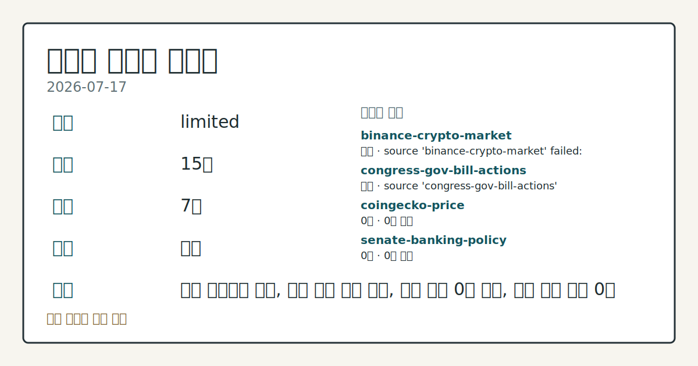
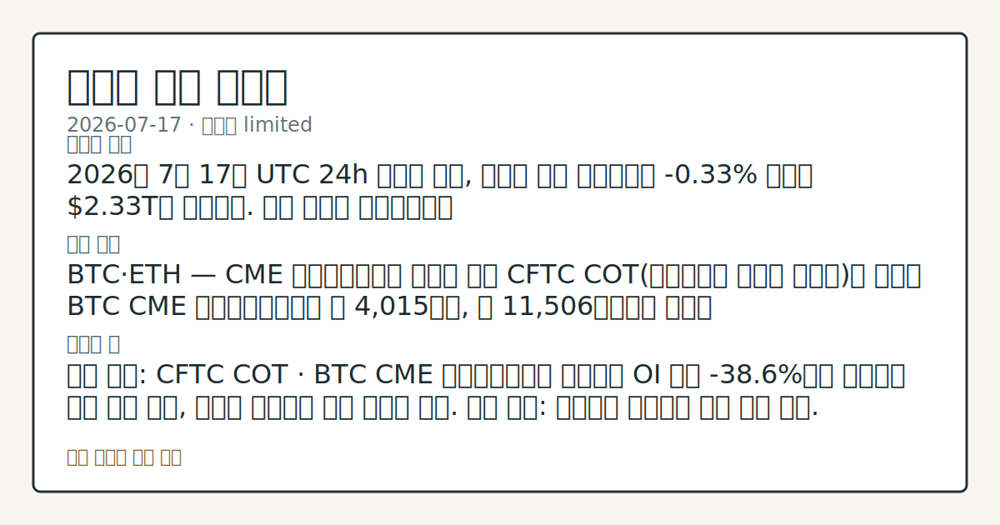
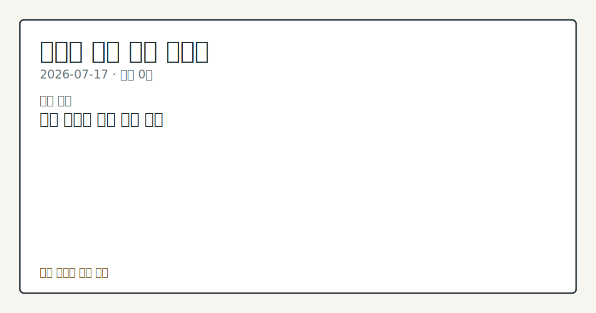

# 2026-07-17 크립토 시황
> 정보 제공용 자동 시황이며 가상자산 매매 권유가 아닙니다. 가상자산은 가격 변동성이 매우 큽니다.
# 2026-07-17 크립토 시황
**기준 시각**: 2026-07-17 UTC · 수집창 2026-07-17T00:00Z ~ 2026-07-18T00:00Z (종료 미포함)
| 종목 | 스냅샷(UTC 24h) | 구간 변동 | 비고 |
|------|------|------|------|
| BTC-USD | 65,901.10 | -0.91% | +12.54% from 52w low · -25.73% YTD |
| ETH-USD | 1,916.55 | -0.61% | +22.48% from 52w low · -36.12% YTD |
**세그먼트**: [국내 증시](../../../domestic-equity/2026/07/2026-07-17.md) | 미국 증시(미발행) | [크립토](2026-07-17.md)
<!-- investo:block visual:crypto.visual.data-confidence -->

*이미지: 데이터 신뢰도 · 출처: investo 자체 생성 · 생성: investo 0.1.0 · 2026-07-22 UTC*
<!-- /investo:block visual:crypto.visual.data-confidence -->
> **내 관심 자산 영향**: 데이터 수집 부족으로 매칭 판단 보류 — 추가 수집 후 재평가됩니다.
> **오늘의 결론**: 2026년 7월 17일 UTC 24h 스냅샷 기준, 크립토 전체 시가총액은 **-0.33%** 하락한 **$2.33T**로 집계됐다. 수집 근거가 제한적입니다
> **핵심 동인**: BTC·ETH — CME 레버리지드머니 순매도 확대 CFTC COT(트레이더별 포지션 보고서)에 따르면 BTC CME 레버리지드머니는 롱 본문 참고.
> **주의할 점**: 확인 소스: CFTC COT · BTC CME 레버리지드머니 순매도가 OI 대비 **-38.6%**에서 축소되면 상방 전환 관찰, 추가로 확대되면 본문 참고.
## 한눈에 보기
크립토 전체 시가총액이 UTC 24h 기준 **-0.33%** 하락한 **$2.33T**로 집계, BTC 도미넌스는 **56.75%** 유지
BTC·ETH CME(시카고상업거래소) 레버리지드머니(전문 트레이더 포지션)가 나란히 순매도로 전환 — 각각 -7,491계약, -7,961계약
10Y 국채금리 **4.55%**와 공포·탐욕지수 33(Fear)이 유동성·심리 압박 신호 — 본문 §④ 참조
## ⓪ 오늘의 매크로
**미 국채 수익률** — UST curve 2026-07-17: 10Y 4.55%, 2Y10Y +0.37pp
## ⓪-A 크립토 지표 (UTC 24h 스냅샷)
| 지표 | 값 |
|------|------|
| 공포·탐욕 | 33 (Fear) |
| BTC 도미넌스 | 56.75% |
| 전체 시총 | $2.33T (-0.33% 24h) |
| BTC 펀딩비 | 0.0000705934819172 (okx) |
| BTC 미결제약정 | $474.1M (okx) |
| DeFi TVL | $77.2B |
| 스테이블코인 공급 | $309.0B |
| 24h 청산 / 거래소 순유출입 | 무료 검증 소스 미확정 |
## ⓪-B 채널 기준선
| 기준선 | 값 |
|------|------|
| 비트코인 | 65,901.10 (-0.91%) |
| 이더리움 | 1,916.55 (-0.61%) |
| BTC 도미넌스 | 56.75% |
| 공포·탐욕 | 33 |
| 펀딩/OI/청산 | 펀딩 0.0000705934819172 · OI 수집됨 |
| CFTC 코인 포지셔닝 | Bitcoin CME 순포지션 -7491계약 (-38.64% OI), 2026-07-14 기준/2026-07-17 공개 · Ether CME 순포지션 -7961계약 (-35.32% OI), 2026-07-14 기준/2026-07-17 공개 · 주간 지연 |
> **크로스마켓 연결 고리**: 금리 이벤트가 할인율/달러 경로의 공통 변수로 남아 있습니다.
> **오늘의 큰 그림:** 이 세그먼트의 공통 신호는 제한적입니다. 본문 수급·지표 항목을 먼저 확인하세요.
## ① 요약

<!-- investo:block visual:crypto.visual.market-snapshot -->

*이미지: 시장 스냅샷 · 출처: investo 자체 생성 · 생성: investo 0.1.0 · 2026-07-22 UTC*
<!-- /investo:block visual:crypto.visual.market-snapshot -->

2026년 7월 17일 UTC 24h 스냅샷 기준, 크립토 전체 시가총액은 **-0.33%** 하락한 **$2.33T**로 집계됐다. CFTC(미국 상품선물거래위원회) 자료에 따르면 BTC·ETH의 CME(시카고상업거래소) 레버리지드머니 순포지션이 각각 -7,491계약, -7,961계약으로 순매도 우위를 이어갔고, 공포·탐욕지수는 33(Fear)로 관망 심리가 우세하다. 최근 며칠간의 반등 흐름과 달리 오늘은 포지셔닝과 심리 지표 모두 숨 고르기 국면으로 해석된다. [하락 관찰]

## ② 전일 핵심 이슈

### BTC·ETH — CME 레버리지드머니 순매도 확대

[CFTC COT(트레이더별 포지션 보고서)](https://www.cftc.gov/MarketReports/CommitmentsofTraders/index.htm)에 따르면 BTC CME 레버리지드머니는 롱 4,015계약, 숏 11,506계약으로 순매도 -7,491계약(미결제약정 대비 **-38.6%**)을 기록했다. 같은 자료에서 ETH CME 레버리지드머니도 롱 2,914계약, 숏 10,875계약으로 순매도 -7,961계약(OI 대비 **-35.3%**)을 나타내, 두 자산 모두 전문 트레이더 포지셔닝이 동시에 순매도 쪽으로 기운 모습이다.

> **그래서 의미는?** 전문 투자자들의 파생 포지션이 BTC·ETH 모두 매도 우위로, 단기 방향성에 대한 신중한 시각을 시사합니다.

### CLARITY Act — 하원 금융서비스위원회 정책 이슈

[하원 금융서비스위원회](http://financialservices.house.gov/news/documentsingle.aspx?DocumentID=411198)는 디지털자산시장 명확성법(CLARITY Act, H.R. 3633) 하원 통과 1주년을 맞아 [현장 청문회](http://financialservices.house.gov/calendar/eventsingle.aspx?EventID=411176)를 개최했다. 디지털자산·핀테크·AI 소위원장 [Bryan Steil은](http://financialservices.house.gov/news/documentsingle.aspx?DocumentID=411196) CLARITY Act가 관련 규제 체계를 명확히 한다고 밝혔으며, [Chairman Hill](http://financialservices.house.gov/news/documentsingle.aspx?DocumentID=411190)은 연준(Federal Reserve) 개혁 논의도 함께 언급했다. 이는 시장 가격 변동과 직접 연결된 사안은 아니지만, 규제 명확성 관련 입법 동향으로 공식 소스에 근거한 정책 이슈다.

## ③ 섹터/수급 동향

BTC CME 포지셔닝은 롱 4,015계약 대비 숏 11,506계약으로 숏 쪽이 약 2.9배 많고, ETH CME도 롱 2,914계약 대비 숏 10,875계약으로 유사한 비대칭 구조를 보였다. 체인·스테이블코인 구조 측면에서는 [DeFi(탈중앙화 금융) TVL(예치자산총액)](https://defillama.com/)이 **$77.2B**로 집계됐으며, Ethereum이 **$42.0B**로 최대 비중을 차지하고 Solana **$5.0B**, BSC **$4.9B**, Tron **$4.9B**, Base **$4.7B** 순이다. 스테이블코인 공급은 **$309.0B**로, USDT **$184.1B**가 최대 비중이며 USDC **$73.3B**, USDS **$6.7B**, DAI **$4.8B**, USD1 **$4.2B**가 뒤를 이었다.

> **그래서 의미는?** 파생 포지션은 매도 쪽으로 쏠렸지만, DeFi·스테이블코인 자금 규모 자체는 견고하게 유지되고 있습니다.

## ④ 지표·이벤트

[UST(미국채) 금리 곡선](https://home.treasury.gov/resource-center/data-chart-center/interest-rates)은 2026-07-17 기준 3M **3.85%**, 2Y **4.18%**, 10Y **4.55%**, 30Y **5.06%**로, 2Y10Y 스프레드는 **+0.37pp**, 3M10Y 스프레드는 **+0.70pp**를 나타냈다. [Alternative.me 공포·탐욕지수](https://alternative.me/crypto/fear-and-greed-index/)는 33(Fear)이며, [OKX](https://www.okx.com/trade-swap/btc-usd-swap) 기준 BTC 미결제약정(OI)은 **$474,118,170**, BTC 펀딩비는 0.0000705934819172로 집계됐다. [글로벌 시가총액](https://www.coingecko.com/en/global-charts)은 **$2,326,737,786,797**, BTC 도미넌스는 **56.75%**다. 24h 정리 및 거래소 순유출입 지표는 데이터 미수집 상태다.

> **그래서 의미는?** 국채금리 상승과 Fear 구간 심리가 겹치며, 크립토 유동성 환경이 다소 위축된 신호로 읽힙니다.

## ⑤ 주요 종목
<!-- investo:block chart:crypto.chart.market -->

<!-- u50 lightweight-charts-embed: placeholders consumed by site_docs/assets/investo-chart-init.js -->

<noscript><em>인터랙티브 차트는 JavaScript가 활성화된 환경에서 표시됩니다. 위 정적 카드가 동일한 정보를 담고 있습니다.</em></noscript>

<!-- /investo:block chart:crypto.chart.market -->

이번 문서는 수집 근거가 제한적입니다.

## ⑥ 오늘의 관전 포인트

<!-- investo:block visual:crypto.visual.watchlist-relevance -->

*이미지: 관심 자산 관련성 · 출처: investo 자체 생성 · 생성: investo 0.1.0 · 2026-07-22 UTC*
<!-- /investo:block visual:crypto.visual.watchlist-relevance -->

#### 관찰 신호: BTC CME 레버리지드머니 순매도

- 출처: CFTC COT
- 현재: CFTC COT · BTC CME 레버리지드머니 순매도가 OI 대비 **-38.6%**에서 축소되면 상방 전환 관찰, 추가로 확대되면 하방 우세로 해석. 관심 영향: 파생시장 레버리지 자금 흐름 점검.
- 확인 조건: 상방 BTC CME 레버리지드머니 순매도가 OI 대비 **-38.6%**에서 축소되면 상방 전환 관찰; 하방 추가로 확대되면 하방 우세로 해석
- 신뢰도: 높음
- 관심 영향: 파생시장 레버리지 자금 흐름 점검.

#### 관찰 신호: ETH CME 레버리지드머니 순매도

- 출처: CFTC COT
- 현재: CFTC COT · ETH CME 레버리지드머니 순매도가 OI 대비 **-35.3%**에서 축소되면 상방 전환 관찰, 추가로 확대되면 하방 우세로 해석. 관심 영향: BTC 대비 ETH 파생 포지셔닝 상대 강도 비교.
- 확인 조건: 상방 ETH CME 레버리지드머니 순매도가 OI 대비 **-35.3%**에서 축소되면 상방 전환 관찰; 하방 추가로 확대되면 하방 우세로 해석
- 신뢰도: 높음
- 관심 영향: BTC 대비 ETH 파생 포지셔닝 상대 강도 비교.

#### 관찰 신호: 10Y 금리

- 출처: 미 재무부 UST 금리
- 현재: 미 재무부 UST 금리 · 10Y 금리가 **4.55%**를 하회하면 유동성 환경 개선 관찰, **4.55%**를 상회 지속되면 압박 요인으로 해석. 관심 영향: 크립토 전반 유동성 민감도 점검.
- 확인 조건: 상방 **4.55%**를 상회 지속되면 압박 요인으로 해석; 하방 10Y 금리가 **4.55%**를 하회하면 유동성 환경 개선 관찰
- 신뢰도: 높음
- 관심 영향: 크립토 전반 유동성 민감도 점검.

#### 관찰 신호: 전체 시가총액

- 출처: CoinGecko 글로벌 시총
- 현재: CoinGecko 글로벌 시총 · 전체 시가총액이 **$2.33T**를 상회 회복하면 반등 신호로 해석, 추가로 하회 확대되면 위축 국면으로 관찰. 관심 영향: BTC 도미넌스 **56.75%** 유지 여부 함께 확인.
- 확인 조건: 상방 전체 시가총액이 **$2.33T**를 상회 회복하면 반등 신호로 해석; 하방 추가로 하회 확대되면 위축 국면으로 관찰
- 신뢰도: 높음
- 관심 영향: BTC 도미넌스 **56.75%** 유지 여부 함께 확인.

> **데이터 상태**: 제한

수집/품질 진단

> **데이터 상태**: 제한 — 수집 15건 / 소스 7개 / 누락: 가격 · 제한 — 핵심 가격 소스 0건/실패/stale, 본문 결론 신뢰도 낮음
> **소스 카운트**: 수집 대상 14 / 성공 8 / 수집 상세는 진단 섹션에서 확인할 수 있습니다. / 수집 상세는 진단 섹션에서 확인할 수 있습니다. / 수집 상세는 진단 섹션에서 확인할 수 있습니다.
> **소스 등급 분포**: S=3 / A=2 / B=3
> **상세 사유**: 가격 카테고리 누락, 일부 소스 수집 실패, 일부 소스 0건 반환, 핵심 가격 소스 0건
> **소스별 상태**: binance-crypto-market 실패 (접근 제한), congress-gov-bill-actions 실패 (설정 미완료(미수집)), coingecko-price 0건, senate-banking-policy 0건, stooq-price 0건, theblock-crypto 0건, 정상 8개

## ⑦ 면책조항
본 시황은 일반 정보 제공을 목적으로 자동 생성된 자료이며,
특정 가상자산에 대한 매매 권유나 투자 자문이 아닙니다.
가상자산은 가상자산이용자보호법(2024-07-19 시행) §10·§19의 적용 대상으로,
24시간 거래되는 비제도권 자산이며 가격 변동성이 매우 크고 원금 전액 손실이 가능합니다.
투자 결정과 그 결과에 대한 책임은 전적으로 본인에게 있으며,
본 시황의 내용에 따라 발생한 손실에 대해 작성자는 일체의 책임을 지지 않습니다.