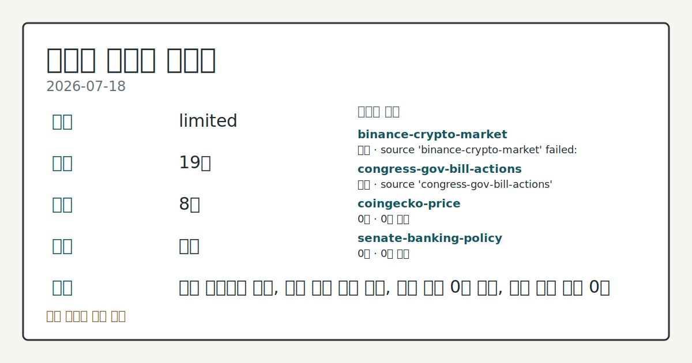
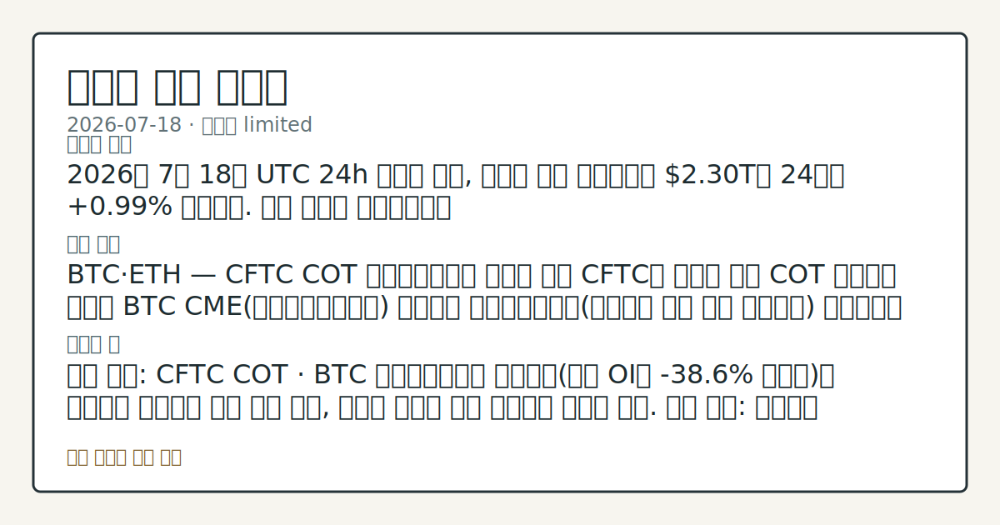

# 2026-07-18 크립토 시황
**기준 시각**: 2026-07-18 UTC · 수집창 2026-07-18T00:00Z ~ 2026-07-19T00:00Z (종료 미포함)
| 종목 | 스냅샷(UTC 24h) | 구간 변동 | 비고 |
|------|------|------|------|
| BTC-USD | 64,587.68 | -0.32% | +10.30% from 52w low · -27.21% YTD |
| ETH-USD | 1,869.30 | +0.42% | +19.46% from 52w low · -37.70% YTD |
**세그먼트**: [국내 증시](../../../domestic-equity/2026/07/2026-07-18.md) | [미국 증시](../../../us-equity/2026/07/2026-07-18.md) | [크립토](2026-07-18.md)

*이미지: 데이터 신뢰도 · 출처: investo 자체 생성 · 생성: investo 0.1.0 · 2026-07-19 UTC*
> **내 관심 자산 영향**: 데이터 수집 부족으로 매칭 판단 보류 — 추가 수집 후 재평가됩니다.
> **오늘의 결론**: 2026년 7월 18일 UTC 24h 스냅샷 기준, 크립토 전체 시가총액은 **$2.30T**로 24시간 **+0.99%** 상승했다. 수집 근거가 제한적입니다
> **핵심 동인**: BTC·ETH — CFTC COT 레버리지드머니 순매도 전환 CFTC가 발표한 최신 COT 보고서에 따르면 BTC CME(시카고상업거래소) 선물에서 본문 참고.
> **주의할 점**: 확인 소스: CFTC COT · BTC 레버리지드머니 순포지션(현재 OI의 **-38.6%** 순매도)이 플러스로 전환되면 상방 압력 관찰, 순매도 본문 참고.
> 정보 제공용 자동 시황이며 가상자산 매매 권유가 아닙니다. 가상자산은 가격 변동성이 매우 큽니다.
## 한눈에 보기
크립토 전체 시가총액 **$2.30T**, UTC 24h **+0.99%** 상승세를 나타냈다.
CFTC(미국 상품선물거래위원회) COT 리포트에서 **BTC**·**ETH** 레버리지드머니 순포지션이 각각 **-38.6%** 본문 참고.
10Y 국채금리 **4.55%**가 위험자산 심리와 연동되는 변수로 본문 §④에서 확인 가능하다.
## ⓪ 오늘의 매크로
**국제 유가** — CFTC WTI crude oil managed_money net +61974 contracts
**미 국채 수익률** — UST curve 2026-07-17: 10Y 4.55%, 2Y10Y +0.37pp
## ⓪-A 크립토 지표 (UTC 24h 스냅샷)
| 지표 | 값 |
|------|------|
| 공포·탐욕 | 28 (Fear) |
| BTC 도미넌스 | 56.49% |
| 전체 시총 | $2.30T (+0.99% 24h) |
| BTC 펀딩비 | 0.0000917486511632 (okx) |
| BTC 미결제약정 | $461.4M (okx) |
| DeFi TVL | $75.9B |
| 스테이블코인 공급 | $308.9B |
| 24h 청산 / 거래소 순유출입 | 무료 검증 소스 미확정 |
## ⓪-B 채널 기준선
| 기준선 | 값 |
|------|------|
| 비트코인 | 64,587.68 (-0.32%) |
| 이더리움 | 1,869.30 (+0.42%) |
| BTC 도미넌스 | 56.49% |
| 공포·탐욕 | 28 |
| 펀딩/OI/청산 | 펀딩 0.0000917486511632 · OI 수집됨 |
| CFTC 코인 포지셔닝 | Bitcoin CME 순포지션 -7491계약 (-38.64% OI), 2026-07-14 기준/2026-07-17 공개 · Ether CME 순포지션 -7961계약 (-35.32% OI), 2026-07-14 기준/2026-07-17 공개 · 주간 지연 |
> **크로스마켓 연결 고리**: 유가/지정학 이슈가 여러 자산군의 변동성 연결 고리로 관찰됩니다. / 금리 이벤트가 할인율/달러 경로의 공통 변수로 남아 있습니다.
> **오늘의 큰 그림:** 이 세그먼트의 공통 신호는 제한적입니다. 본문 수급·지표 항목을 먼저 확인하세요.
## ① 요약

*이미지: 시장 스냅샷 · 출처: investo 자체 생성 · 생성: investo 0.1.0 · 2026-07-19 UTC*

2026년 7월 18일 UTC 24h 스냅샷 기준, 크립토 전체 시가총액은 **$2.30T**로 24시간 **+0.99%** 상승했다. 최근 며칠간 이어졌던 완만한 반등 흐름과 달리, 오늘은 파생 포지셔닝 지표에서 조심스러운 전환이 감지된다. CFTC COT(Commitments of Traders, 트레이더별 포지션 보고서)에 따르면 BTC(비트코인)·ETH(이더리움) 레버리지드머니 포지션이 모두 순매도 우위로 전환했다(OI(미결제약정) 대비 각각 **-38.6%**, **-35.3%**). 공포·탐욕 지수도 28(Fear)에 머물러 있어, 가격은 완만한 상승이지만 파생 포지셔닝과 투자심리는 방어적으로 엇갈리는 하루였다. [혼재]

## ② 전일 핵심 이슈

### BTC·ETH — CFTC COT 레버리지드머니 순매도 전환

CFTC가 발표한 최신 COT 보고서에 따르면 BTC CME 선물에서 레버리지드머니 순포지션이 롱 4,015계약·숏 11,506계약으로 순매도 -7,491계약을 기록했다. ETH CME 선물 역시 롱 2,914계약·숏 10,875계약으로 순매도 -7,961계약(OI의 **-35.3%**)을 나타내 두 자산 모두 전문 트레이더의 방어적 포지셔닝이 뚜렷했다. ([CFTC](https://www.cftc.gov/MarketReports/CommitmentsofTraders/index.htm))

> **그래서 의미는?** 전문 트레이더들이 BTC·ETH 선물에서 나란히 숏 우위로 기운 점검 신호입니다.

### 스테이블코인 규제 — GENIUS Act 최종룰 지연

The Block에 따르면 미국 규제당국이 GENIUS Act(스테이블코인 발행 규제법)의 1년 기한인 최종 규정 마련 시한을 넘겼다. 다만 법의 2027년 1월 18일 발효일 자체는 미뤄지지 않아, 규제당국과 스테이블코인 발행사 모두 준비 기간이 압축된 상태다. ([The Block](https://www.theblock.co/post/408843/us-regulators-miss-genius-acts-one-year-deadline-for-final-stablecoin-rules))

### 정책 — CLARITY Act 논의와 연준 통화정책 청문회

하원 금융서비스위원회 산하 디지털자산 소위원회는 설립 1주년을 맞아 CLARITY Act(디지털자산 시장구조 법안)의 중요성을 강조했다. 같은 위원회는 연방준비제도(Fed) 통화정책보고서에 관한 연준 의장 청문회도 개최했다. ([하원 금융서비스위원회](http://financialservices.house.gov/news/documentsingle.aspx?DocumentID=411198))

## ③ 섹터/수급 동향

### BTC 파생시장 — OI·펀딩비 스냅샷

OKX 기준 BTC 무기한 스왑 OI는 **$461,380,420**, 펀딩비는 0.0000917486511632로 집계됐다(UTC 24h). 앞서 확인된 CFTC COT의 레버리지드머니 순매도 포지셔닝과 겹쳐보면, 파생시장 전반의 방향성 베팅이 약화된 모습이다. ([OKX](https://www.okx.com/trade-swap/btc-usd-swap))

> **그래서 의미는?** 파생시장 OI·펀딩비 수준을 통해 단기 방향성 베팅 강도를 가늠할 수 있습니다.

### DeFi·스테이블코인 — 자금 배분 구조

DefiLlama 기준 DeFi(탈중앙화 금융) TVL(총예치자산)은 **$75.9B**로 이더리움이 41.2B로 선두를 유지했고, BSC·솔라나가 각 4.9B, 트론 4.8B, Base 4.6B로 뒤를 이었다. 스테이블코인 공급은 **$308.9B**로 USDT가 184.1B로 최대 비중을 차지했고 USDC 73.4B, USDS 6.7B, DAI 4.8B, USD1 4.3B 순이었다. ([DefiLlama](https://defillama.com/))

## ④ 지표·이벤트

### 매크로 — 美 국채금리 커브

美 재무부 자료에 따르면 2026년 7월 17일 기준 UST(미 국채) 금리커브는 3개월물 **3.85%**, 2년물 **4.18%**, 10년물 **4.55%**, 30년물 **5.06%**로 나타났다. 2Y10Y 스프레드는 **+0.37%p**, 3M10Y 스프레드는 **+0.70%p**로 집계됐다. ([美 재무부](https://home.treasury.gov/resource-center/data-chart-center/interest-rates))

> **그래서 의미는?** 국채 금리 수준은 위험자산 전반의 자금 조달 비용과 투자심리에 영향을 주는 배경 변수입니다.

### 크립토 매크로 지표 — 시가총액·공포탐욕

CoinGecko 집계로 크립토 전체 시가총액은 **$2,295,064,268,857**(BTC 도미넌스 **56.49%**)로 UTC 24h 스냅샷 기준 집계됐다. Alternative.me 공포·탐욕 지수는 28(Fear)로 조사됐다. 24시간 정리 규모와 거래소 순유출입은 무료 검증 소스가 확정되지 않아 데이터 미수집 상태다. ([CoinGecko](https://www.coingecko.com/en/global-charts), [Alternative.me](https://alternative.me/crypto/fear-and-greed-index/))

## ⑤ 주요 종목

<!-- u50 lightweight-charts-embed: placeholders consumed by site_docs/assets/investo-chart-init.js -->

<noscript><em>인터랙티브 차트는 JavaScript가 활성화된 환경에서 표시됩니다. 위 정적 카드가 동일한 정보를 담고 있습니다.</em></noscript>

이번 세그먼트에서는 개별 대형 코인의 가격 변수보다 자금조달·거버넌스 이슈가 두드러졌다.

> **그래서 의미는?** 대형 코인 가격 변수 대신 자금조달·거버넌스 이슈가 이번 스냅샷의 핵심 확인 항목입니다.

### 확인 항목

- Bitcoin Japan(비트코인 보유량 없음)이 EVO Fund를 통해 **$60** million 규모 자금조달을 추진 중이다. 앞선 12월 조달금은 SpaceX·Figure AI 관련 지분 투자에 쓰였다고 회사 측은 밝혔다. ([The Block](https://www.theblock.co/post/408838/bitcoin-japan-which-holds-no-bitcoin-taps-evo-fund-in-planned-60-million-raise-to-finally-buy-some))
- UNI(유니스왑 거버넌스 토큰) 소각 규모가 커질 가능성이 제기됐다 — Uniswap 거버넌스가 v4 수수료 구조와 Robinhood Chain 확장안을 놓고 7월 19일부터 26일까지 투표를 진행한다. 두 제안 모두 12월 "UNIfication" 개편에서 만들어진 UNI 소각 메커니즘으로 수수료를 유입시키는 구조다. ([The Block](https://www.theblock.co/post/408836/uni-burn-poised-to-grow-as-uniswap-governance-votes-on-v4-fees-and-robinhood-chain-expansion))

## ⑥ 오늘의 관전 포인트

#### 관찰 신호: BTC 레버리지드머니 순포지션

- 출처: CFTC COT
- 현재: CFTC COT · BTC 레버리지드머니 순포지션이 플러스로 전환되면 상방 압력 관찰, 순매도 비중이 추가 확대되면 방어적 해석. 관심 영향: 파생시장 방향성 베팅 회복 여부 점검.
- 확인 조건: 상방 BTC 레버리지드머니 순포지션이 플러스로 전환되면 상방 압력 관찰; 하방 순매도 비중이 추가 확대되면 방어적 해석
- 신뢰도: 보통
- 관심 영향: 파생시장 방향성 베팅 회복 여부 점검.

> **데이터 상태**: 제한

수집/품질 진단

> **데이터 상태**: 제한 — 수집 19건 / 소스 8개 / 누락: 가격 · 제한 — 핵심 가격 소스 0건/실패/stale, 본문 결론 신뢰도 낮음
> **소스 카운트**: 수집 대상 14 / 성공 9 / 수집 상세는 진단 섹션에서 확인할 수 있습니다. / 수집 상세는 진단 섹션에서 확인할 수 있습니다. / 수집 상세는 진단 섹션에서 확인할 수 있습니다.
> **소스 등급 분포**: S=3 / A=2 / B=4
> **상세 사유**: 가격 카테고리 누락, 일부 소스 수집 실패, 일부 소스 0건 반환, 핵심 가격 소스 0건
> **소스별 상태**: binance-crypto-market 실패 (접근 제한), congress-gov-bill-actions 실패 (설정 미완료(미수집)), coingecko-price 0건, senate-banking-policy 0건, stooq-price 0건, 정상 9개

## ⑦ 면책조항
본 시황은 일반 정보 제공을 목적으로 자동 생성된 자료이며,
특정 가상자산에 대한 매매 권유나 투자 자문이 아닙니다.
가상자산은 가상자산이용자보호법(2024-07-19 시행) §10·§19의 적용 대상으로,
24시간 거래되는 비제도권 자산이며 가격 변동성이 매우 크고 원금 전액 손실이 가능합니다.
투자 결정과 그 결과에 대한 책임은 전적으로 본인에게 있으며,
본 시황의 내용에 따라 발생한 손실에 대해 작성자는 일체의 책임을 지지 않습니다.