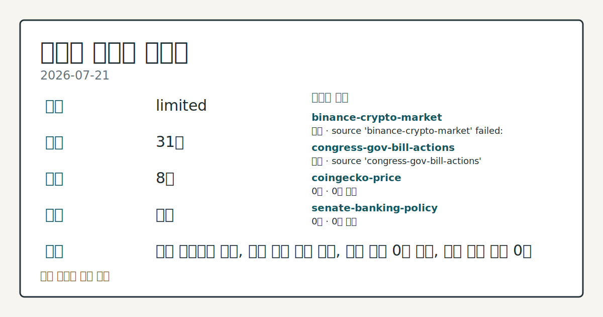
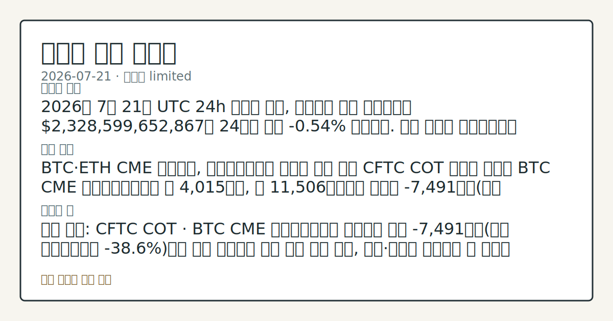
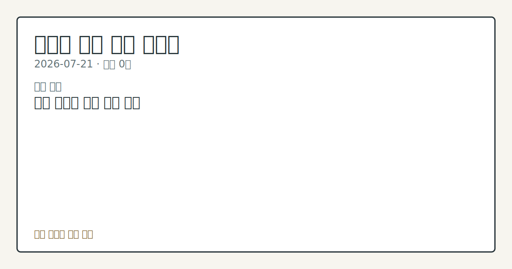

# 2026-07-21 크립토 시황
> 정보 제공용 자동 시황이며 가상자산 매매 권유가 아닙니다. 가상자산은 가격 변동성이 매우 큽니다.
# 2026-07-21 크립토 시황
**기준 시각**: 2026-07-21 UTC · 수집창 2026-07-21T00:00Z ~ 2026-07-22T00:00Z (종료 미포함)
| 종목 | 스냅샷(UTC 24h) | 구간 변동 | 비고 |
|------|------|------|------|
| BTC-USD | 65,952.00 | -0.83% | +12.63% from 52w low · -25.67% YTD |
| ETH-USD | 1,921.00 | -0.38% | +22.76% from 52w low · -35.98% YTD |
**세그먼트**: [국내 증시](../../../domestic-equity/2026/07/2026-07-21.md) | [미국 증시](../../../us-equity/2026/07/2026-07-21.md) | [크립토](2026-07-21.md)
<!-- investo:block visual:crypto.visual.data-confidence -->

*이미지: 데이터 신뢰도 · 출처: investo 자체 생성 · 생성: investo 0.1.0 · 2026-07-22 UTC*
<!-- /investo:block visual:crypto.visual.data-confidence -->
> **내 관심 자산 영향**: 데이터 수집 부족으로 매칭 판단 보류 — 추가 수집 후 재평가됩니다.
> **오늘의 결론**: 2026년 7월 21일 UTC 24h 스냅샷 기준, 크립토 전체 시가총액은 **$2.33T**로 24시간 동안 **-0.49%** 하락했고 BTC 본문 참고.
> **핵심 동인**: BTC·ETH CME 포지셔닝, 레버리지드머니 순매도 우위 지속 CFTC(미국 상품선물거래위원회) CME(시카고상업거래소) 리포트에 따르면 BTC 본문 참고.
> **주의할 점**: 확인 소스: CFTC(미국 상품선물거래위원회) CME BTC 리포트 · 레버리지드머니 순매도 -7,491계약이 이번 주 대비 축소되면 매도 압력 본문 참고.
## 한눈에 보기
크립토 전체 시가총액이 UTC 24h 기준 **-0.49%** 하락한 **$2.33T**를 기록했고, BTC 도미넌스는 **56.77%**로 집계됐다.
CFTC 자료에서 **BTC**·**ETH** CME 레버리지드머니가 각각 **-38.6%**, **-35.3%** 순매도로 나타나 파생 포지셔닝이 본문 참고.
**4.63%** 10Y 미국 국채 금리와 미확정 상태인 24h 정리 데이터가 변수로 남아있다 — 본문 §④ 참조.
## ⓪ 오늘의 매크로
**미 국채 수익률** — UST curve 2026-07-21: 10Y 4.63%, 2Y10Y +0.37pp
## ⓪-A 크립토 지표 (UTC 24h 스냅샷)
| 지표 | 값 |
|------|------|
| 공포·탐욕 | 33 (Fear) |
| BTC 도미넌스 | 56.77% |
| 전체 시총 | $2.33T (-0.49% 24h) |
| BTC 펀딩비 | 0.0000661652785122 (okx) |
| BTC 미결제약정 | $470.0M (okx) |
| DeFi TVL | $77.0B |
| 스테이블코인 공급 | $309.0B |
| 24h 청산 / 거래소 순유출입 | 무료 검증 소스 미확정 |
## ⓪-B 채널 기준선
| 기준선 | 값 |
|------|------|
| 비트코인 | 65,952.00 (-0.83%) |
| 이더리움 | 1,921.00 (-0.38%) |
| BTC 도미넌스 | 56.77% |
| 공포·탐욕 | 33 |
| 펀딩/OI/청산 | 펀딩 0.0000661652785122 · OI 수집됨 |
| CFTC 코인 포지셔닝 | Bitcoin CME 순포지션 -7491계약 (-38.64% OI), 2026-07-14 기준/2026-07-17 공개 · Ether CME 순포지션 -7961계약 (-35.32% OI), 2026-07-14 기준/2026-07-17 공개 · 주간 지연 |
> **크로스마켓 연결 고리**: 금리 이벤트가 할인율/달러 경로의 공통 변수로 남아 있습니다.
> **오늘의 큰 그림:** 금리와 달러 변수가 공통 변수지만, BTC·ETH 유동성를 먼저 확인해야 합니다.
## ① 요약

<!-- investo:block visual:crypto.visual.market-snapshot -->

*이미지: 시장 스냅샷 · 출처: investo 자체 생성 · 생성: investo 0.1.0 · 2026-07-22 UTC*
<!-- /investo:block visual:crypto.visual.market-snapshot -->

2026년 7월 21일 UTC 24h 스냅샷 기준, 크립토 전체 시가총액은 **$2.33T**로 24시간 동안 **-0.49%** 하락했고 BTC 도미넌스는 **56.77%**를 나타냈다. CFTC CME 리포트에서 BTC·ETH 레버리지드머니가 각각 전체 미결제약정 대비 **-38.6%**, **-35.3%** 순매도로 집계돼 파생 포지셔닝이 매도 우위를 유지했다. Fear & Greed 지수는 33(Fear)으로 위축된 투자심리를 반영했으며, 지난 기록에서도 유사한 순매도 우위 흐름이 나타난 바 있어 이번에도 큰 반전 신호는 확인되지 않는다. [하락 관찰]

## ② 전일 핵심 이슈

### BTC·ETH CME 포지셔닝, 레버리지드머니 순매도 우위 지속

CFTC CME 리포트에 따르면 BTC 레버리지드머니는 롱 4,015계약, 숏 11,506계약으로 순매도 -7,491계약을 기록했고, ETH 레버리지드머니도 롱 2,914계약, 숏 10,875계약으로 순매도 -7,961계약에 달했다 ([CFTC](https://www.cftc.gov/MarketReports/CommitmentsofTraders/index.htm)). 이는 주간 단위 집계로 실시간 자금 흐름은 아니며, 최근 문서에서도 비슷한 순매도 우위가 관찰된 바 있어 큰 흐름 전환보다는 연장에 가깝다.

> **그래서 의미는?** 선물시장에서 매도 쪽 베팅이 매수보다 많다는 뜻으로, 단기 수급 심리가 위축돼 있음을 보여준다.

### 규제·정책 동향: CLARITY Act 1주년과 각국 입법 움직임

미국 하원 금융서비스위원회 산하 디지털자산 소위원회는 CLARITY Act(디지털자산시장 명확화법, H.R. 3633)의 하원 통과 1주년을 맞아 성과를 조명했고, 소위원장 Bryan Steil은 해당 법이 "향후 250년간의 혁신"을 뒷받침할 것이라고 밝혔다 ([House Financial Services](http://financialservices.house.gov/news/documentsingle.aspx?DocumentID=411198), [Steil 발언](http://financialservices.house.gov/news/documentsingle.aspx?DocumentID=411196)). 한편 트럼프 대통령이 서명한 새 윤리 규정은 DOJ(법무부)가 집행을 맡아 연방 공직자의 암호화폐 발행을 금지하도록 했고 ([theblock](https://www.theblock.co/post/409173/trump-backed-crypto-ethics-rule-doj-enforcement-prohibits-federal-officials-issuing-cryptocurrencies)), Digital Chamber는 디지털자산 거래에 **0.2%** 세율을 부과하는 일리노이주 법을 상대로 소송을 제기했다 ([theblock](https://www.theblock.co/post/409160/the-digital-chamber-sues-illinois-over-incoming-crypto-transaction-tax)). 러시아 국가두마는 비적격 개인투자자에게 연 30만 루블 한도를 두는 암호화폐 소매거래 합법화 법안을 통과시켰다 ([theblock](https://www.theblock.co/post/409121/russia-passes-landmark-crypto-bill-allowing-regulated-retail-trading)).

## ③ 섹터/수급 동향

### BTC·ETH 파생 포지셔닝 세부 내역

CFTC 자료를 세부적으로 보면 BTC CME 레버리지드머니는 롱 4,015계약 대비 숏 11,506계약으로 순매도 -7,491계약, ETH는 롱 2,914계약 대비 숏 10,875계약으로 순매도 -7,961계약을 나타냈다 ([CFTC](https://www.cftc.gov/MarketReports/CommitmentsofTraders/index.htm)). 이는 주간 리포트 기준으로, 일중 변동을 즉시 반영하지는 않는다.

> **그래서 의미는?** 레버리지 자금이 매도 쪽에 더 쏠려 있다는 의미로, 파생시장 참여자들의 단기 방향성 베팅이 하락 쪽에 가깝다는 뜻이다.

### 알트코인 ETF(상장지수펀드) 자금 흐름

Solana ETF는 **$904 million** AUM(운용자산)을 보유했고 Hyperliquid 펀드에는 **$350 million** 규모의 순유입이 발생해, 두 상품 모두 주목도에 비해 자금 유입이 눈에 띄었다 ([theblock](https://www.theblock.co/post/408963/solana-hyperliquid-etfs-dominate-altcoin-fund-flows-despite-flying-under-the-radar)).

## ④ 지표·이벤트

### 크립토 시장 지표 스냅샷

UTC 24h 기준 전체 시가총액은 **$2,329,921,939,717**(**$2.33T**, 24h **-0.49%**)이며 BTC 도미넌스는 **56.77%**로 집계됐다 ([CoinGecko](https://www.coingecko.com/en/global-charts)). Fear & Greed 지수는 33으로 나타났고 ([alternative.me](https://alternative.me/crypto/fear-and-greed-index/)), DeFi(탈중앙화금융) TVL(총예치자산)은 **$77.0B**로 이더리움이 41.9B로 선두를 유지했고 솔라나 5.0B, BSC 4.9B, 트론 4.9B, 베이스 4.7B 순이었다 ([DefiLlama](https://defillama.com/)). 스테이블코인 공급은 **$309.0B**로 USDT가 184.1B로 최대 발행량을 보였고 USDC 73.3B, USDS 6.7B, DAI 4.8B, USD1 4.2B가 뒤를 이었다 ([DefiLlama](https://defillama.com/)). OKX 기준 BTC 미결제약정은 **$469,971,780**, BTC 펀딩비는 0.0000661215680713으로 나타났다 ([OKX](https://www.okx.com/trade-swap/btc-usd-swap)). 24h 정리과 거래소 순유출입 지표는 무료 검증 소스가 아직 확정되지 않아 데이터 미수집 상태다.

> **그래서 의미는?** 시가총액 하락과 낮은 공포·탐욕 지수가 겹쳐 있어, 투자심리가 위축된 채 관망 심리가 우세한 구간임을 보여준다.

### 미국 국채(UST) 금리 커브

2026년 7월 21일 기준 미국 국채(UST) 금리는 3개월물 **3.87%**, 2년물 **4.26%**, 10년물 **4.63%**, 30년물 **5.13%**로 나타났고, 2년-10년 스프레드는 **+0.37pp**, 3개월-10년 스프레드는 **+0.76pp**를 기록했다 ([미 재무부](https://home.treasury.gov/resource-center/data-chart-center/interest-rates)). 크립토 세그먼트 관점에서 이는 배경 매크로 지표로, 직접적인 온체인 수급 변화를 뜻하지는 않는다.

## ⑤ 주요 종목
<!-- investo:block chart:crypto.chart.market -->

<!-- u50 lightweight-charts-embed: placeholders consumed by site_docs/assets/investo-chart-init.js -->

<noscript><em>인터랙티브 차트는 JavaScript가 활성화된 환경에서 표시됩니다. 위 정적 카드가 동일한 정보를 담고 있습니다.</em></noscript>

<!-- /investo:block chart:crypto.chart.market -->

### 거래소·플랫폼 동향

Uphold는 미국에서 4,000개 이상의 주식·ETF 분할 매매 서비스를 출시해 비트코인을 팔아 버크셔 해서웨이 주식을 사는 등 단일 거래 내 자산 전환을 지원한다고 밝혔다 ([theblock](https://www.theblock.co/post/409087/uphold-launches-fractional-share-trading-4000-stocks-and-etfs)). Coinbase는 7월 14일 발생한 50분간의 거래·카드 결제 장애가 '저위험' 설정 변경 때문이었다고 설명하며, 이용자 자금은 위험에 노출되지 않았고 지연된 거래는 서비스 복구 후 정상 처리됐다고 밝혔다 ([theblock](https://www.theblock.co/post/409105/coinbase-says-low-risk-config-change-behind-50-minute-july-14-outage-impacting-trading-card-transactions)).

> **그래서 의미는?** Uphold(업홀드)와 Coinbase(코인베이스) 등 주요 거래 플랫폼의 서비스 확장과 장애 대응 사례로, 인프라 안정성 확인이 필요한...

### 기업 자금조달·구조조정 확인 항목

Canton Network 개발사 Digital Asset은 신한금융그룹과 SC Ventures로부터 **$2 billion** 밸류에이션으로 **$10 million**을 추가 조달했다 ([theblock](https://www.theblock.co/post/409168/canton-digital-asset-additional-10-million-funding-same-2-billion-equity-valuation-expanding-round-365-million)). 영국의 Satsuma Technology 주주들은 비트코인 트레저리 정리과 런던 상장폐지를 승인했는데, 앞서 **$218 million**을 조달해 비트코인 전략을 추진한 지 1년이 채 되지 않은 시점이다 ([theblock](https://www.theblock.co/post/409155/satsuma-shareholders-approve-bitcoin-treasury-liquidation-london-delisting)). Movement Labs의 파산 신청에서는 자산 **$100,001**~**$500,000**, 부채 최대 **$10 million** 규모 중 축출된 창업자의 **$1.6 million** 청구가 최대 규모로 나타났다 ([theblock](https://www.theblock.co/post/409151/ousted-founders-1-6-million-claim-tops-movement-labs-bankruptcy-filing)). 스테이블코인 기반 'Global Dollar Bank'를 구축 중인 Augustus는 **$1 billion** 밸류에이션으로 시리즈 B(투자 라운드) **$180 million**을 조달했다 ([theblock](https://www.theblock.co/post/409119/augustus-raises-180-million-series-b-global-dollar-bank)).

### 인프라·기술 체크리스트

RippleX는 XRP Ledger의 에이전트형 거래 건수가 곧 1000만 건에 도달할 것으로 내다봤고, Ripple은 최근 x402 Foundation에 Coinbase·Circle·Visa와 함께 프리미어 멤버로 합류했다 ([theblock](https://www.theblock.co/post/408987/ripplex-sees-xrp-ledger-agentic-transactions-hitting-10-million-mark-soon)). Galaxy는 비트코인 양자컴퓨팅 대비 이니셔티브를 출범하며 개발자 그랜트로 최대 **$5 million**을 지원하기로 했다 ([theblock](https://www.theblock.co/post/409129/galaxy-bitcoin-quantum-computing-threat-initiative)).

## ⑥ 오늘의 관전 포인트

<!-- investo:block visual:crypto.visual.watchlist-relevance -->

*이미지: 관심 자산 관련성 · 출처: investo 자체 생성 · 생성: investo 0.1.0 · 2026-07-22 UTC*
<!-- /investo:block visual:crypto.visual.watchlist-relevance -->

> **관전 포인트**: 오늘은 공개 근거가 충분한 관전 신호만 본문에 남겼습니다.

> **데이터 상태**: 제한

수집/품질 진단

> **데이터 상태**: 제한 — 수집 31건 / 소스 8개 / 누락: 가격 · 제한 — 핵심 가격 소스 0건/실패/stale, 본문 결론 신뢰도 낮음
> **소스 카운트**: 수집 대상 14 / 성공 9 / 수집 상세는 진단 섹션에서 확인할 수 있습니다. / 수집 상세는 진단 섹션에서 확인할 수 있습니다. / 수집 상세는 진단 섹션에서 확인할 수 있습니다.
> **소스 등급 분포**: S=3 / A=2 / B=4
> **상세 사유**: 가격 카테고리 누락, 일부 소스 수집 실패, 일부 소스 0건 반환, 핵심 가격 소스 0건
> **소스별 상태**: binance-crypto-market 실패 (접근 제한), congress-gov-bill-actions 실패 (설정 미완료(미수집)), coingecko-price 0건, senate-banking-policy 0건, stooq-price 0건, 정상 9개

## ⑦ 면책조항
본 시황은 일반 정보 제공을 목적으로 자동 생성된 자료이며,
특정 가상자산에 대한 매매 권유나 투자 자문이 아닙니다.
가상자산은 가상자산이용자보호법(2024-07-19 시행) §10·§19의 적용 대상으로,
24시간 거래되는 비제도권 자산이며 가격 변동성이 매우 크고 원금 전액 손실이 가능합니다.
투자 결정과 그 결과에 대한 책임은 전적으로 본인에게 있으며,
본 시황의 내용에 따라 발생한 손실에 대해 작성자는 일체의 책임을 지지 않습니다.