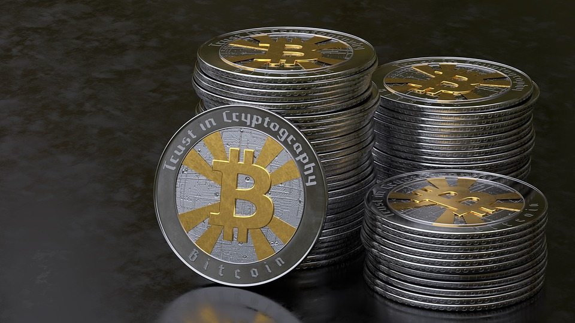
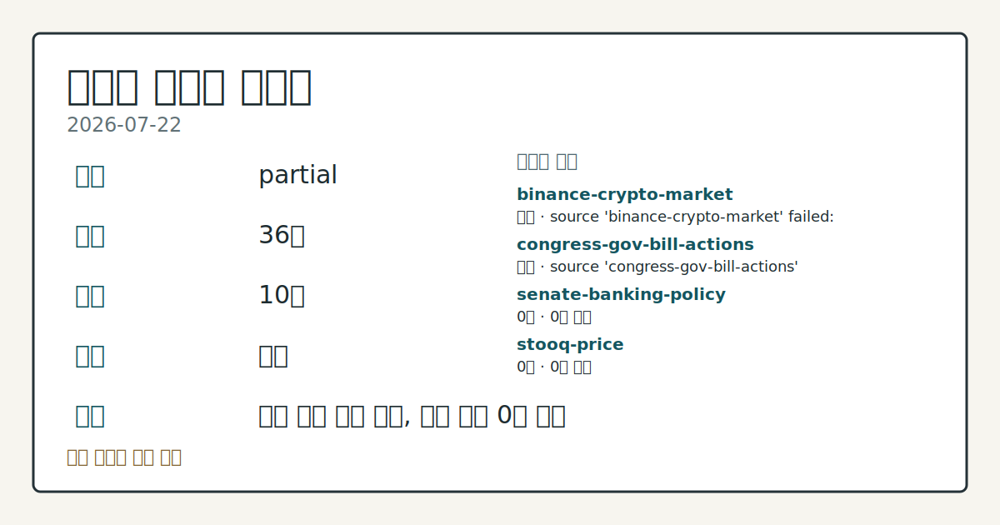
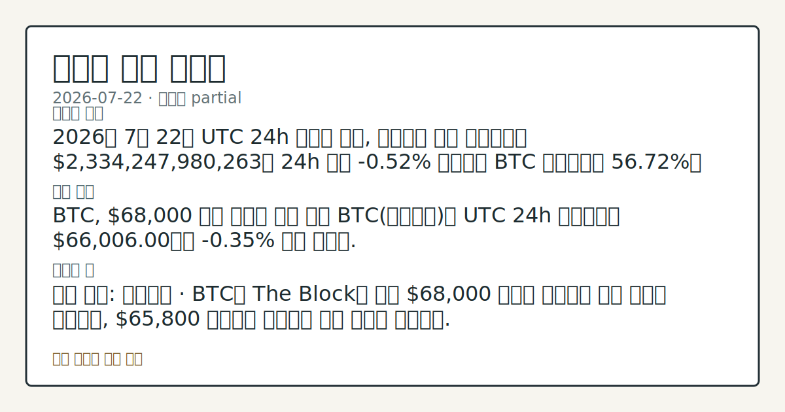
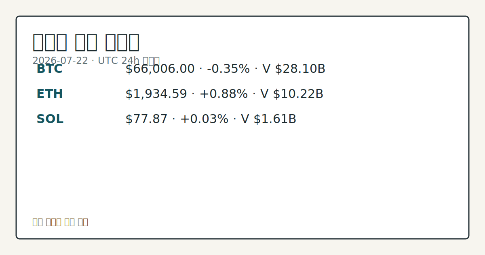
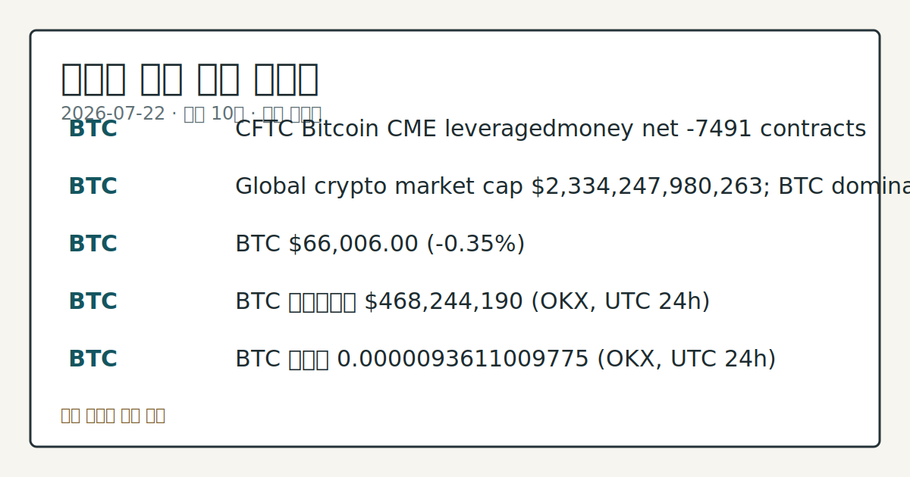

# 2026-07-22 크립토 시황
> 정보 제공용 자동 시황이며 가상자산 매매 권유가 아닙니다. 가상자산은 가격 변동성이 매우 큽니다.
# 2026-07-22 크립토 시황
**기준 시각**: 2026-07-22 UTC · 수집창 2026-07-22T00:00Z ~ 2026-07-23T00:00Z (종료 미포함)
| 종목 | 스냅샷(UTC 24h) | 구간 변동 | 비고 |
|------|------|------|------|
| BTC-USD | 66,029.08 | -0.72% | +12.76% from 52w low · -25.59% YTD |
| ETH-USD | 1,935.37 | +0.36% | +23.68% from 52w low · -35.50% YTD |
**세그먼트**: [국내 증시](../../../domestic-equity/2026/07/2026-07-22.md) | [미국 증시](../../../us-equity/2026/07/2026-07-22.md) | [크립토](2026-07-22.md)
<!-- investo:block visual:crypto.visual.curated-context-image -->

*이미지: 큐레이션 시황 이미지 · 출처: 외부 라이선스 이미지 · 생성: investo 0.1.0 · 2026-07-22 UTC*
<!-- /investo:block visual:crypto.visual.curated-context-image -->
> **내 관심 자산 영향**: 10건 확인 (기본 바스켓) — BTC: 직접 관련 · [cftc-cot-positioning] CFTC Bitcoin CME leveraged_money net -7491 contracts; BTC: 직접 관련 · [coingecko-global-market] Global crypto market cap **$2,334,247,980,263**; BTC dominance **56.72%**; BTC: 직접 관련 · [coingecko-price] BTC **$66,006.00** (**-0.35%**); BTC: 직접 관련 · [okx-derivatives] BTC 미결제약정 **$468,244,190** (OKX, UTC 24h); BTC: 직접 관련 · [okx-derivatives] BTC 펀딩비 0.0000093611009775 (OKX, UTC 24h) 외
> **오늘의 결론**: 2026년 7월 22일 UTC 24h 스냅샷 기준, 가상자산 전체 시가총액은 **$2,334,247,980,263**로 24h 대비 본문 참고.
> **핵심 동인**: BTC, **$68,000** 저항 앞두고 등락 지속 BTC(비트코인)는 UTC 24h 스냅샷에서 **$66,006.00**으로 **-0.35%** 소폭 밀렸다.
> **주의할 점**: 확인 소스: 코인게코 · BTC가 The Block이 짚은 **$68,000** 저항을 상회하면 상승 압력을 관찰하고, **$65,800** 본문 참고.
## 한눈에 보기
가상자산 전체 시가총액이 UTC 24h 기준 **-0.52%** 하락한 **$2,334,247,980,263**를 기록했고, BTC는 본문 참고.
**ETH**는 24h **+0.88%** 상승하며 **$1,934.59**에 거래됐다.
CFTC(미국 상품선물거래위원회) COT(트레이더별 포지션 보고) 자료에서 BTC CME 레버리지드머니 순포지션이 OI의 **-38.6%**로 본문 참고.
## ⓪ 오늘의 매크로
**미 국채 수익률** — UST curve 2026-07-22: 10Y 4.67%, 2Y10Y +0.36pp
## ⓪-A 크립토 지표 (UTC 24h 스냅샷)
| 지표 | 값 |
|------|------|
| 공포·탐욕 | 33 (Fear) |
| BTC 도미넌스 | 56.72% |
| 전체 시총 | $2.33T (-0.52% 24h) |
| BTC 펀딩비 | 0.0000093611009775 (okx) |
| BTC 미결제약정 | $468.2M (okx) |
| DeFi TVL | $77.1B |
| 스테이블코인 공급 | $310.3B |
| 24h 청산 / 거래소 순유출입 | 무료 검증 소스 미확정 |
## ⓪-B 채널 기준선
| 기준선 | 값 |
|------|------|
| 비트코인 | 66,029.08 (-0.72%) |
| 이더리움 | 1,935.37 (+0.36%) |
| BTC 도미넌스 | 56.72% |
| 공포·탐욕 | 33 |
| 펀딩/OI/청산 | 펀딩 0.0000093611009775 · OI 수집됨 |
| CFTC 코인 포지셔닝 | Bitcoin CME 순포지션 -7491계약 (-38.64% OI), 2026-07-14 기준/2026-07-17 공개 · Ether CME 순포지션 -7961계약 (-35.32% OI), 2026-07-14 기준/2026-07-17 공개 · 주간 지연 |
> **크로스마켓 연결 고리**: 금리 이벤트가 할인율/달러 경로의 공통 변수로 남아 있습니다.
> **오늘의 큰 그림:** 금리와 달러 변수가 공통 변수지만, BTC·ETH 유동성를 먼저 확인해야 합니다.
## ① 요약

<!-- investo:block visual:crypto.visual.data-confidence -->

*이미지: 데이터 신뢰도 · 출처: investo 자체 생성 · 생성: investo 0.1.0 · 2026-07-22 UTC*
<!-- /investo:block visual:crypto.visual.data-confidence -->

<!-- investo:block visual:crypto.visual.market-snapshot -->

*이미지: 시장 스냅샷 · 출처: investo 자체 생성 · 생성: investo 0.1.0 · 2026-07-22 UTC*
<!-- /investo:block visual:crypto.visual.market-snapshot -->

2026년 7월 22일 UTC 24h 스냅샷 기준, 가상자산 전체 시가총액은 **$2,334,247,980,263**로 24h 대비 **-0.52%** 하락했고 BTC 도미넌스는 **56.72%**를 유지했다. BTC(비트코인)는 **$66,006.00**으로 **-0.35%** 소폭 하락한 반면 ETH(이더리움)는 **+0.88%** 오른 **$1,934.59**를 기록해 대형 코인 간 방향이 엇갈렸다. 공포·탐욕 지수는 33(Fear)로 심리는 여전히 위축돼 있고, CFTC COT 자료 상 BTC·ETH CME 레버리지드머니 모두 순매도 우위(각각 OI의 **-38.6%**, **-35.3%**)를 이어갔다. [The Block 보도](https://www.theblock.co/post/409398/optimistic-signals-meet-68000-wall-bitcoin-recovery-faces-next-test-analysts)에 따르면 BTC는 스팟 ETF(상장지수펀드) 6거래일 연속 순유입 속에 **$65,800** 위를 지키며 **$68,000** 저항을 시험하고 있다. [혼재]

## ② 전일 핵심 이슈

### BTC, **$68,000** 저항 앞두고 등락 지속

BTC는 UTC 24h 스냅샷에서 **$66,006.00**으로 **-0.35%** 소폭 밀렸다. [The Block 기사](https://www.theblock.co/post/409398/optimistic-signals-meet-68000-wall-bitcoin-recovery-faces-next-test-analysts)에 따르면 BTC는 **$65,800** 위에서 지지를 유지하며 스팟 ETF(상장지수펀드)가 6거래일 연속 순유입을 기록하는 가운데 애널리스트들은 **$68,000**을 다음 저항으로 지목했다. CFTC COT 자료 기준 BTC·ETH CME(시카고상업거래소) 레버리지드머니 순매도 우위는 최근 며칠 흐름과 같은 방향으로 이어지고 있어 뚜렷한 전환은 아직 나타나지 않았다.

> **그래서 의미는?** ETF 자금은 들어오지만 파생시장 포지셔닝은 여전히 방어적이라는 뜻이다.

### Clarity Act 후속 입법 논의와 SEC 발언

상원은 소프트웨어 개발자 보호 조항과 2029년 일몰 조항을 담은 최신 Clarity Act 문안을 공개했다 ([기사](https://www.theblock.co/post/409442/senate-releases-latest-clarity-act-software-developer-protections-ethics-provision-sunset-date-2029)). 이 문안은 업계에서는 긍정적으로 받아들여졌지만 일부 민주당 의원과 은행권은 윤리 조항 등을 이유로 비판했고 ([기사](https://www.theblock.co/post/409470/bipartisan-support-critical-as-democrats-push-back-on-gop-crypto-bill-on-ethics-grounds)), 미즈호는 이 법안이 스테이블코인 발행사 Circle에 장기적으로 부정적일 수 있다고 평가했다 ([기사](https://www.theblock.co/post/409453/clarity-act-impact-on-circle-could-be-negative-over-long-term-mizuho)). SEC(증권거래위원회) 위원 헤스터 피어스는 온체인 볼트·대출 전략이 증권법 적용 대상이 될 수 있다고 경고했다 ([성명](https://www.sec.gov/newsroom/speeches-statements/peirce-statement-crypto-vaults-lending-strategies-072226)).

## ③ 섹터/수급 동향

### CFTC COT: BTC·ETH 레버리지드머니 순매도 우위 지속

CFTC COT 자료에 따르면 BTC CME 레버리지드머니는 롱 4,015계약·숏 11,506계약으로 순매도 -7,491계약(OI의 **-38.6%**)을 기록했고, ETH CME 레버리지드머니는 롱 2,914계약·숏 10,875계약으로 순매도 -7,961계약(OI의 **-35.3%**)을 나타냈다 ([자료](https://www.cftc.gov/MarketReports/CommitmentsofTraders/index.htm)).

> **그래서 의미는?** 대형 트레이더들이 BTC·ETH 모두에서 방어적 포지션을 유지하고 있다는 뜻이다.

### 토큰화 자산과 스테이블코인 규제 논의 확대

Kraken 모기업 Payward는 GTN과 제휴해 토큰화 주식 플랫폼 xStocks를 홍콩을 시작으로 국제 확장한다고 밝혔다 ([기사](https://www.theblock.co/post/409448/kraken-parent-payward-partners-gtn-scale-xstocks-internationally-beyond-us-equities)). RWA(실물자산 토큰화) 카테고리에서는 토큰화 주식 파생상품 거래가 늘며 월간 거래대금이 **$470** billion 규모로 집계됐고 ([기사](https://www.theblock.co/post/408961/tokenized-equity-perps-drive-rwa-trading-boom-to-470-billion-monthly-volume)), BIS(국제결제은행)는 달러 스테이블코인이 외환 규제·자본통제를 우회할 수 있다고 지적했다 ([기사](https://www.theblock.co/post/409193/bis-warns-stablecoins-capital-controls)).

## ④ 지표·이벤트

전체 시가총액은 **$2,334,247,980,263**로 BTC 도미넌스 **56.72%**를 유지했고 ([자료](https://www.coingecko.com/en/global-charts)), 공포·탐욕 지수는 33을 기록했다 ([자료](https://alternative.me/crypto/fear-and-greed-index/)). DeFi(디파이, 탈중앙화 금융) TVL(총예치자산)은 **$77.1B**로 Ethereum이 41.9B로 선두를 지켰고, 스테이블코인 공급은 **$310.3B**로 USDT가 184.2B로 최대 규모를 유지했다 ([자료](https://defillama.com/)). BTC 파생시장에서는 OKX 기준 미결제약정 **$468,244,190**, 펀딩비 0.0000093611009775이 관측됐다 ([자료](https://www.okx.com/trade-swap/btc-usd-swap)). 24h 정리 및 거래소 순유출입 지표는 무료 검증 소스가 확정되지 않아 데이터 미수집 상태다.

> **그래서 의미는?** 유동성 지표는 견조하지만 투자 심리는 여전히 위축돼 있다는 뜻이다.

## ⑤ 주요 종목
<!-- investo:block chart:crypto.chart.market -->

<!-- u50 lightweight-charts-embed: placeholders consumed by site_docs/assets/investo-chart-init.js -->

<noscript><em>인터랙티브 차트는 JavaScript가 활성화된 환경에서 표시됩니다. 위 정적 카드가 동일한 정보를 담고 있습니다.</em></noscript>

<!-- /investo:block chart:crypto.chart.market -->

<!-- investo:block visual:crypto.visual.price-snapshot -->

*이미지: 가격 스냅샷 · 출처: investo 자체 생성 · 생성: investo 0.1.0 · 2026-07-22 UTC*
<!-- /investo:block visual:crypto.visual.price-snapshot -->

### 관전 분류: 코인 시세

BTC는 **$66,006.00**(**-0.35%**, 24h 고가 **$66,674.00**·저가 **$65,537.00**, [자료](https://www.coingecko.com/en/coins/bitcoin)), ETH(이더리움)는 **$1,934.59**(**+0.88%**, 고가 **$1,952.51**·저가 **$1,910.77**, [자료](https://www.coingecko.com/en/coins/ethereum)), SOL(솔라나)은 **$77.87**(**+0.03%**, 고가 **$78.63**·저가 **$77.01**, [자료](https://www.coingecko.com/en/coins/solana))로 24h 구간을 지났다.

> **그래서 의미는?** 대형 코인 간 등락이 엇갈려 방향성 판단에는 추가 확인이 필요하다는 뜻이다.

### 관전 분류: 기업 실적·전망

벤치마크는 Coinbase 실적 추정치를 낮췄지만 Clarity Act가 부진한 2분기를 상쇄할 수 있다고 평가했다 ([기사](https://www.theblock.co/post/409390/benchmark-lowers-coinbase-earnings-estimates-clarity-act-eclipse-weak-quarter)). 또한 Hut 8을 'power-first data center REIT(부동산투자신탁)'로 규정하며 관련 전망치를 18% 추가로 상향했다 ([기사](https://www.theblock.co/post/409439/benchmark-hut-8-becoming-power-first-data-center-reit-raises-target-18)).

### 관전 분류: 규제·보안 확인 항목

SEC는 Gensler 시기 기록 요청을 둘러싼 Coinbase와의 소송을 합의로 마무리했고 ([기사](https://www.theblock.co/post/409437/sec-reaches-settlement-coinbase-over-records-requests-gensler-era)), Zilliqa는 2019년부터 이어진 Ledger 앱 버그로 네이티브 트랜잭션을 중단했다 ([기사](https://www.theblock.co/post/409383/zilliqa-halts-native-transactions-over-bug-in-its-ledger-app-dating-to-2019)).

## ⑥ 오늘의 관전 포인트

<!-- investo:block visual:crypto.visual.watchlist-relevance -->

*이미지: 관심 자산 관련성 · 출처: investo 자체 생성 · 생성: investo 0.1.0 · 2026-07-22 UTC*
<!-- /investo:block visual:crypto.visual.watchlist-relevance -->

#### 관찰 신호: BTC

- 출처: 코인게코
- 현재: 코인게코 · BTC가 The Block이 짚은 **$68,000** 저항을 상회하면 상승 압력을 관찰하고, **$65,800** 지지선을 이탈하면 하락 압력을 점검한다. 관심 영향: 스팟 ETF 자금 흐름의 지속 여부를 점검.
- 확인 조건: 상방 BTC가 The Block이 짚은 **$68,000** 저항을 상회하면 상승 압력을 관찰하고; 하방 **$65,800** 지지선을 이탈하면 하락 압력을 점검한다
- 신뢰도: 높음
- 관심 영향: 스팟 ETF 자금 흐름의 지속 여부를 점검.

#### 관찰 신호: DeFi TVL **$77.1B**와 스테이블코인 공급…

- 출처: DefiLlama
- 현재: DefiLlama · DeFi TVL **$77.1B**와 스테이블코인 공급 **$310.3B**가 함께 늘면 온체인 자금 유입 확대를 관찰하고, 반대로 줄면 자금 이탈 신호를 점검한다. 관심 영향: Ethereum 중심 자금 쏠림을 확인.
- 확인 조건: 상방 DeFi TVL **$77.1B**와 스테이블코인 공급 **$310.3B**가 함께 늘면 온체인 자금 유입 확대를 관찰하고; 하방 반대로 줄면 자금 이탈 신호를 점검한다
- 신뢰도: 높음
- 관심 영향: Ethereum 중심 자금 쏠림을 확인.

> **데이터 상태**: 부분

수집/품질 진단

> **데이터 상태**: 부분 — 수집 36건 / 소스 10개 / 누락: 없음 · 부분 — 일부 카테고리 미수집, 본문 일부 결론 보강 필요
> **소스 카운트**: 수집 대상 14 / 성공 10 / 수집 상세는 진단 섹션에서 확인할 수 있습니다. / 수집 상세는 진단 섹션에서 확인할 수 있습니다. / 수집 상세는 진단 섹션에서 확인할 수 있습니다.
> **소스 등급 분포**: S=3 / A=2 / B=5
> **상세 사유**: 일부 소스 수집 실패, 일부 소스 0건 반환
> **소스별 상태**: binance-crypto-market 실패 (접근 제한), congress-gov-bill-actions 실패 (설정 미완료(미수집)), senate-banking-policy 0건, stooq-price 0건, 정상 10개

## ⑦ 면책조항
본 시황은 일반 정보 제공을 목적으로 자동 생성된 자료이며,
특정 가상자산에 대한 매매 권유나 투자 자문이 아닙니다.
가상자산은 가상자산이용자보호법(2024-07-19 시행) §10·§19의 적용 대상으로,
24시간 거래되는 비제도권 자산이며 가격 변동성이 매우 크고 원금 전액 손실이 가능합니다.
투자 결정과 그 결과에 대한 책임은 전적으로 본인에게 있으며,
본 시황의 내용에 따라 발생한 손실에 대해 작성자는 일체의 책임을 지지 않습니다.