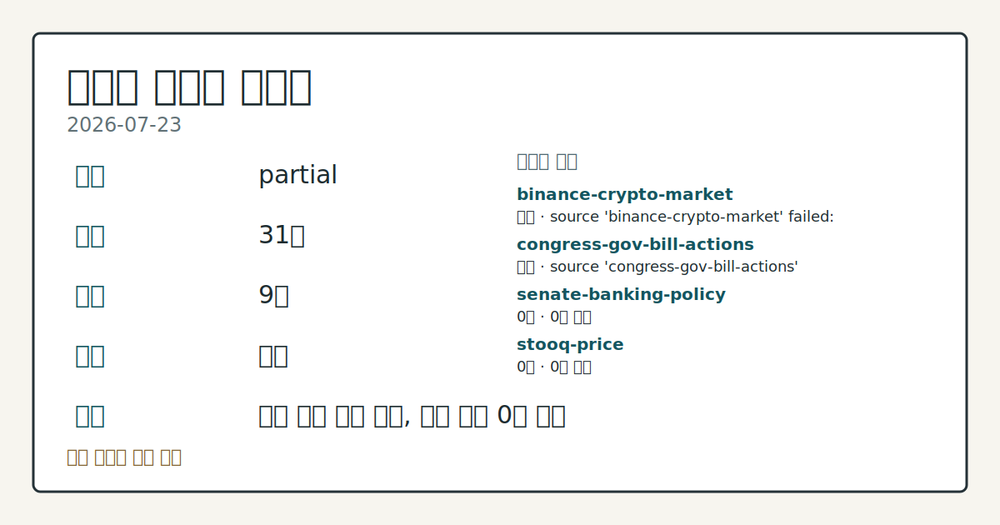
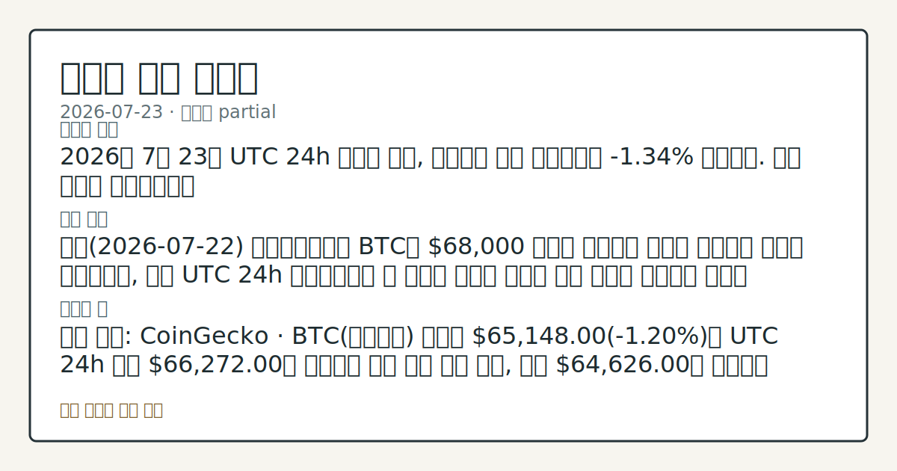
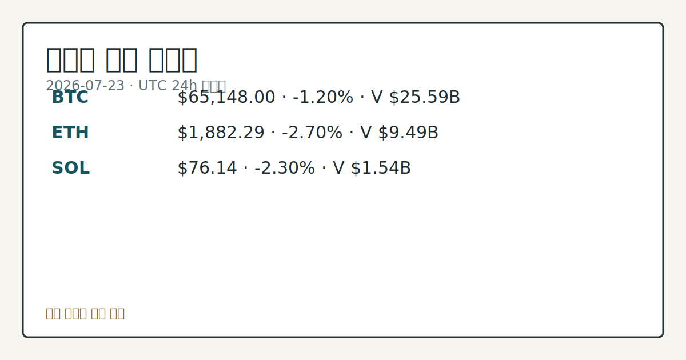
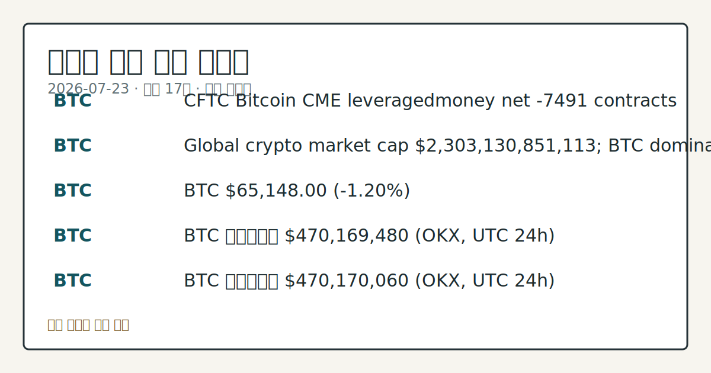

# 2026-07-23 크립토 시황
> 정보 제공용 자동 시황이며 가상자산 매매 권유가 아닙니다. 가상자산은 가격 변동성이 매우 큽니다.
# 2026-07-23 크립토 시황
**기준 시각**: 2026-07-23 UTC · 수집창 2026-07-23T00:00Z ~ 2026-07-24T00:00Z (종료 미포함)
| 종목 | 스냅샷(UTC 24h) | 구간 변동 | 비고 |
|------|------|------|------|
| BTC-USD | 65,141.69 | -1.45% | +11.24% from 52w low · -26.59% YTD |
| ETH-USD | 1,882.00 | -2.66% | +20.27% from 52w low · -37.27% YTD |
**세그먼트**: [국내 증시](../../../domestic-equity/2026/07/2026-07-23.md) | [미국 증시](../../../us-equity/2026/07/2026-07-23.md) | [크립토](2026-07-23.md)
<!-- investo:block visual:crypto.visual.curated-context-image -->

*이미지: 큐레이션 시황 이미지 · 출처: 외부 라이선스 이미지 · 생성: investo 0.1.0 · 2026-07-23 UTC*
<!-- /investo:block visual:crypto.visual.curated-context-image -->
> **내 관심 자산 영향**: 17건 확인 (기본 바스켓) — BTC: 직접 관련 · [cftc-cot-positioning] CFTC Bitcoin CME leveraged_money net -7491 contracts; BTC: 직접 관련 · [coingecko-global-market] Global crypto market cap **$2,303,130,851,113**; BTC dominance **56.74%**; BTC: 직접 관련 · [coingecko-price] BTC **$65,148.00** (**-1.20%**); BTC: 직접 관련 · [okx-derivatives] BTC 미결제약정 **$470,169,480** (OKX, UTC 24h); BTC: 직접 관련 · [okx-derivatives] BTC 미결제약정 **$470,170,060** (OKX, UTC 24h) 외
> **용어 가이드**: 이번 시황에서 처음 등장한 용어 — 시가총액(시장가치), 거래대금(거래총액)
> **오늘의 결론**: 2026년 7월 23일 UTC 24h 스냅샷 기준, 가상자산 전체 시가총액은 **-1.34%** 하락했다. 수집 근거가 제한적입니다
> **핵심 동인**: 어제(2026-07-22) 컨텍스트에서는 BTC가 **$68,000** 저항선 부근에서 등락을 이어가는 모습이 부각됐으나, 오늘 UTC 24h 본문 참고.
> **주의할 점**: 확인 소스: CoinGecko · BTC(비트코인) 현재가 **$65,148.00**(**-1.20%**)가 UTC 24h 고가 본문 참고.
## 한눈에 보기
가상자산 전체 시가총액 24h **-1.34%** 하락, BTC **-1.20%**·ETH **-2.70%**·SOL **-2.30%** 동반 조정
**BTC**·**ETH** CME 레버리지드머니 포지션이 각각 순매도 -7,491계약·-7,961계약으로 동반 숏 우위를 나타냈다
미 10년물 국채금리 **4.71%**·공포·탐욕지수 31(Fear) — 본문 §④ 참조
## ⓪ 오늘의 매크로
**국제 유가** — CFTC WTI crude oil managed_money net +61974 contracts
**미 국채 수익률** — UST curve 2026-07-23: 10Y 4.71%, 2Y10Y +0.34pp
## ⓪-A 크립토 지표 (UTC 24h 스냅샷)
| 지표 | 값 |
|------|------|
| 공포·탐욕 | 31 (Fear) |
| BTC 도미넌스 | 56.74% |
| 전체 시총 | $2.30T (-1.34% 24h) |
| BTC 펀딩비 | -0.0000231660198235 (okx) |
| BTC 미결제약정 | $470.2M (okx) |
| DeFi TVL | $76.3B |
| 스테이블코인 공급 | $308.9B |
| 24h 청산 / 거래소 순유출입 | 무료 검증 소스 미확정 |
## ⓪-B 채널 기준선
| 기준선 | 값 |
|------|------|
| 비트코인 | 65,141.69 (-1.45%) |
| 이더리움 | 1,882.00 (-2.66%) |
| BTC 도미넌스 | 56.74% |
| 공포·탐욕 | 31 |
| 펀딩/OI/청산 | 펀딩 -0.0000231660198235 · OI 수집됨 |
| CFTC 코인 포지셔닝 | Bitcoin CME 순포지션 -7491계약 (-38.64% OI), 2026-07-14 기준/2026-07-17 공개 · Ether CME 순포지션 -7961계약 (-35.32% OI), 2026-07-14 기준/2026-07-17 공개 · 주간 지연 |
> **크로스마켓 연결 고리**: 유가/지정학 이슈가 여러 자산군의 변동성 연결 고리로 관찰됩니다. / 금리 이벤트가 할인율/달러 경로의 공통 변수로 남아 있습니다.
> **오늘의 큰 그림:** 이 세그먼트의 공통 신호는 제한적입니다. 본문 수급·지표 항목을 먼저 확인하세요.
## ① 요약

<!-- investo:block visual:crypto.visual.data-confidence -->

*이미지: 데이터 신뢰도 · 출처: investo 자체 생성 · 생성: investo 0.1.0 · 2026-07-23 UTC*
<!-- /investo:block visual:crypto.visual.data-confidence -->

<!-- investo:block visual:crypto.visual.market-snapshot -->

*이미지: 시장 스냅샷 · 출처: investo 자체 생성 · 생성: investo 0.1.0 · 2026-07-23 UTC*
<!-- /investo:block visual:crypto.visual.market-snapshot -->

2026년 7월 23일 UTC 24h 스냅샷 기준, 가상자산 전체 시가총액은 **-1.34%** 하락했다. BTC는 **$65,148.00**로 **-1.20%**, ETH는 **$1,882.29**로 **-2.70%**, SOL(솔라나)은 **$76.14**로 **-2.30%** 하락하며 주요 자산이 동반 약세 흐름을 보였다. 공포·탐욕지수는 31(Fear)로 위험회피 심리가 우세했고, BTC 도미넌스는 **56.74%**를 기록했다. CFTC(미국 상품선물거래위원회) 자료 기준 BTC·ETH CME(시카고상업거래소) 레버리지드머니 포지션도 모두 순매도 우위를 이어갔다. [하락 관찰]

## ② 전일 핵심 이슈

어제 컨텍스트에서는 BTC가 **$68,000** 저항선 부근에서 등락을 이어가는 모습이 부각됐으나, 오늘 UTC 24h 스냅샷에서는 이 저항선 아래로 밀리며 하락 압력이 이어지는 흐름이 확인된다. 크립토 시장은 24시간 거래되므로 아래 이슈들은 UTC 24h 구간 스냅샷 기준으로 정리한다.

> **그래서 의미는?** 어제 언급된 저항선 부근 등락이 오늘은 하락 압력으로 이어졌다는 뜻이다.

### Arbitrum(이더리움 레이어2) 프로토콜 AFX Trade, 브릿지 익스플로잇으로 자금 유출

Arbitrum 프로토콜 AFX Trade가 [브릿지 익스플로잇](https://www.theblock.co/post/409482/arbitrum-protocol-afx-trade-exploit)으로 **$24** million 규모 피해를 입었다고 Blockaid가 확인했다. PeckShield 분석에 따르면 공격자는 탈취 자금을 Arbitrum에서 Ethereum으로 브릿지한 뒤 12,467 ETH로 스왑했다.

### CLARITY Act(디지털자산시장 명확성법), 하원 청문회에서 1주년 조명

하원 금융서비스위원회 산하 디지털자산·핀테크·AI 소위원회는 [CLARITY Act 통과 1주년을 조명하는 성명](http://financialservices.house.gov/news/documentsingle.aspx?DocumentID=411198)을 발표했다. Steil 소위원장은 별도 성명에서 [CLARITY Act가 미국 내 혁신을 뒷받침할 것](http://financialservices.house.gov/news/documentsingle.aspx?DocumentID=411196)이라고 밝혔으며, 같은 날 관련 현장 청문회도 진행됐다. 이는 SEC·CFTC 관할권과 시장구조에 관한 공식 입법 동향으로, 통과 가능성이나 토큰별 가격 영향을 예단하지 않는 사실 보고다.

### 추가 보안 이슈: BitMEX 폐쇄 예정, Verus 브릿지 재차 익스플로잇

[BitMEX](https://www.theblock.co/post/409495/bitmex-to-shut-down-permanently)는 설립 11년 만인 2026-09-23 04:00 UTC에 영구 폐쇄될 예정이라고 밝혔다. 같은 날 [Verus-Ethereum 브릿지](https://www.theblock.co/post/409489/new-verus-ethereum-bridge-attack)에서는 지난 5월과 동일한 취약점을 이용한 두 번째 익스플로잇으로 **$7.5** million 규모 자금이 유출됐다고 Blockaid가 밝혔다. 로빈후드 CEO의 X 계정도 [해킹되어 밈코인 홍보에 악용](https://www.theblock.co/post/409560/robinhood-ceo-x-account-apparently-hacked-promote-vladhood-memecoin-flagged-scam)된 사실이 확인됐다.

## ③ 섹터/수급 동향

UTC 24h 스냅샷 기준 DeFi(탈중앙화 금융) TVL(총예치자산)은 **$76.3B**로 이더리움이 최대 체인 지위를 유지했고, 스테이블코인 공급은 **$308.9B**로 USDT가 최대 발행량을 보였다. 파생시장에서는 CFTC 자료 기준 BTC·ETH CME 레버리지드머니 포지션이 모두 순매도 우위를 이어갔다.

> **그래서 의미는?** 자금이 이더리움·USDT 중심으로 몰리는 가운데 파생시장 심리는 여전히 조심스럽다는 뜻이다.

### DeFi TVL·스테이블코인 공급 스냅샷

[DeFiLlama 집계](https://defillama.com/)에 따르면 주요 체인별 TVL은 Ethereum 41.4B, Solana 4.9B, BSC 4.8B, Tron 4.8B, Base 4.6B 순이며, 스테이블코인은 USDT 183.0B, USDC 74.1B, USDS 6.7B, DAI 4.9B, USD1 4.2B 순으로 나타났다.

### CME 파생 포지셔닝, 레버리지드머니 순매도 우위 지속

[CFTC COT 리포트](https://www.cftc.gov/MarketReports/CommitmentsofTraders/index.htm)에 따르면 BTC CME 레버리지드머니는 롱 4,015계약, 숏 11,506계약으로 순매도 -7,491계약(미결제약정 대비 **-38.6%**)을 기록했다. ETH CME 레버리지드머니는 롱 2,914계약, 숏 10,875계약으로 순매도 -7,961계약(미결제약정 대비 **-35.3%**)을 나타냈다. 해당 수치는 주간 CFTC 리포트 기준으로 실시간 수급과는 차이가 있을 수 있다.

### 기관·인프라 확장: Flow Traders, LayerZero, Circle, Mirae Asset

[Flow Traders](https://www.theblock.co/post/409516/flow-traders-pilots-lombards-new-bitcoin-backed-credit-strategy-for-stablecoin-borrowing)는 Lombard Finance의 비트코인 담보 신용 전략 파일럿 파트너로 참여했다. [LayerZero와 Keeta](https://www.theblock.co/post/409507/layerzero-keeta-enable-tokenized-bank-deposits-across-ethereum-solana-and-base)는 Ethereum, Solana, Base 등에서 토큰화된 은행 예금 전송을 지원하는 파트너십을 맺었다. [Circle](https://www.theblock.co/post/409497/circle-partners-with-kakao-toss)은 카카오·토스뱅크와 한국 내 스테이블코인 결제 인프라 탐색을 위해 협력하며, [미래에셋](https://www.theblock.co/post/409485/mirae-asset-completes-acquisition-korbit)은 코빗 인수를 완료하고 지분을 **92.06%**에서 **97.15%**로 늘릴 계획이라고 현지 매체가 보도했다.

## ④ 지표·이벤트

[Coingecko 글로벌 마켓](https://www.coingecko.com/en/global-charts) 기준 전체 시가총액은 **$2,303,130,851,113**, BTC 도미넌스는 **56.74%**로 집계됐다(UTC 24h 스냅샷 기준 **-1.34%**). 같은 날 [미 재무부 국채금리](https://home.treasury.gov/resource-center/data-chart-center/interest-rates) 커브는 3개월물 **3.95%**, 2년물 **4.37%**, 10년물 **4.71%**, 30년물 **5.17%**로 나타났으며 2년-10년 스프레드는 **+0.34pp**, 3개월-10년 스프레드는 **+0.76pp**를 기록했다.

> **그래서 의미는?** 국채 금리와 시가총액 흐름을 함께 보면 위험자산 전반의 방어적 심리가 읽힌다.

### 공포·탐욕지수, 파생 포지셔닝

[Alternative.me 공포·탐욕지수](https://alternative.me/crypto/fear-and-greed-index/)는 31(Fear)을 나타내 위험회피 심리가 우세함을 시사했다. [OKX](https://www.okx.com/trade-swap/btc-usd-swap) 기준 BTC 미결제약정은 **$470,169,480** 수준, 펀딩비는 마이너스(-0.0000231660198235)를 나타내 숏 포지션 우위의 파생시장 구조를 보였다. 24h 정리 규모와 거래소 순유출입은 무료 검증 소스가 확정되지 않아 데이터 미수집으로 표기한다.

### CLARITY Act 관련 청문회

같은 날 하원 금융서비스위원회는 ["Building the Future of Finance"](http://financialservices.house.gov/calendar/eventsingle.aspx?EventID=411176) 현장 청문회를 열어 CLARITY Act 관련 증언을 청취했다.

## ⑤ 주요 종목
<!-- investo:block chart:crypto.chart.market -->

<!-- u50 lightweight-charts-embed: placeholders consumed by site_docs/assets/investo-chart-init.js -->

<noscript><em>인터랙티브 차트는 JavaScript가 활성화된 환경에서 표시됩니다. 위 정적 카드가 동일한 정보를 담고 있습니다.</em></noscript>

<!-- /investo:block chart:crypto.chart.market -->

<!-- investo:block visual:crypto.visual.price-snapshot -->

*이미지: 가격 스냅샷 · 출처: investo 자체 생성 · 생성: investo 0.1.0 · 2026-07-23 UTC*
<!-- /investo:block visual:crypto.visual.price-snapshot -->

UTC 24h 스냅샷 기준 BTC(비트코인)는 **$65,148.00**로 **-1.20%**, ETH는 **$1,882.29**로 **-2.70%**, SOL은 **$76.14**로 **-2.30%**를 기록하며 대형 자산군이 동반 조정을 나타냈다.

> **그래서 의미는?** 시가총액 상위 자산이 함께 조정폭을 키우고 있다는 뜻이다.

### 가격 스냅샷

[BTC](https://www.coingecko.com/en/coins/bitcoin)는 24h 거래대금 **$25,589,956,665**, 시가총액 **$1,306,892,704,837**, 구간 고가 **$66,272.00**·저가 **$64,626.00**를 기록했다. [ETH](https://www.coingecko.com/en/coins/ethereum)는 거래대금 **$9,485,389,511**, 시가총액 **$227,154,251,826**, 고가 **$1,939.98**·저가 **$1,870.73**를 나타냈다. [SOL](https://www.coingecko.com/en/coins/solana)은 거래대금 **$1,535,863,760**, 시가총액 **$44,376,137,046**, 고가 **$78.48**·저가 **$75.43**을 기록했다.

### 보안·리스크 확인 항목

[Strategy와 BlackRock](https://www.theblock.co/post/409522/strategy-blackrock-form-bitcoin-security-consortium-to-prepare-for-quantum-computing-threat) 등 9개 기관은 양자컴퓨팅 위협에 대비한 포스트양자암호 연구 지원을 위해 **$15** million 규모 Bitcoin Security Consortium을 결성했다. [Smarter Web Company](https://www.theblock.co/post/409506/not-currently-the-right-capital-solution-smarter-web-sells-178-bitcoin-to-repay-11-7m-convertible-instrument)는 보유 BTC 177.89개를 개당 **$65,762**에 매도해 TOBAM에 대한 **$11.7** million 규모 전환사채를 조기 상환했다고 밝혔다.

### 결제·인프라 체크리스트

[Coinbase](https://www.theblock.co/post/409539/coinbase-ai-payments-most-high-conviction-bet-businesses-accepting-agent-payments)는 AI 에이전트 결제를 "가장 확신하는 베팅"으로 꼽으며 x402 표준 기반 결제 지원을 확대한다고 밝혔다. [MoonPay](https://www.theblock.co/post/409536/moonpay-discover-network-card-payments-crypto)는 미국 내 Discover Network 카드를 통한 크립토 매수·매도를 지원한다고 발표했다.

## ⑥ 오늘의 관전 포인트

<!-- investo:block visual:crypto.visual.watchlist-relevance -->

*이미지: 관심 자산 관련성 · 출처: investo 자체 생성 · 생성: investo 0.1.0 · 2026-07-23 UTC*
<!-- /investo:block visual:crypto.visual.watchlist-relevance -->

#### 관찰 신호: BTC 현재

- 출처: CoinGecko
- 현재: CoinGecko · BTC 현재가 **$65,148.00**(**-1.20%**)가 UTC 24h 고가 **$66,272.00**를 상회하면 단기 반등 압력 관찰, 저가 **$64,626.00**를 하회하면 하락 압력 심화로 해석. 관심 영향: BTC 중심 변동성 폭 점검.
- 확인 조건: 상방 BTC 현재가 **$65,148.00**(**-1.20%**)가 UTC 24h 고가 **$66,272.00**를 상회하면 단기 반등 압력 관찰; 하방 저가 **$64,626.00**를 하회하면 하락 압력 심화로 해석
- 신뢰도: 높음
- 관심 영향: BTC 중심 변동성 폭 점검.

#### 관찰 신호: ETH 현재

- 출처: CoinGecko
- 현재: CoinGecko · ETH 현재가 **$1,882.29**(**-2.70%**)가 UTC 24h 고가 **$1,939.98**를 상회하면 반등 흐름으로 관찰, 저가 **$1,870.73**를 하회하면 약세 흐름 심화로 해석. 관심 영향: 알트코인 동반 변동성 비교.
- 확인 조건: 상방 ETH 현재가 **$1,882.29**(**-2.70%**)가 UTC 24h 고가 **$1,939.98**를 상회하면 반등 흐름으로 관찰; 하방 저가 **$1,870.73**를 하회하면 약세 흐름 심화로 해석
- 신뢰도: 높음
- 관심 영향: 알트코인 동반 변동성 비교.

#### 관찰 신호: SOL 현재

- 출처: CoinGecko
- 현재: CoinGecko · SOL 현재가 **$76.14**(**-2.30%**)가 UTC 24h 고가 **$78.48**를 상회하면 회복 흐름으로 관찰, 저가 **$75.43**를 하회하면 추가 조정으로 해석. 관심 영향: 레이어1 자금 흐름 점검.
- 확인 조건: 상방 SOL 현재가 **$76.14**(**-2.30%**)가 UTC 24h 고가 **$78.48**를 상회하면 회복 흐름으로 관찰; 하방 저가 **$75.43**를 하회하면 추가 조정으로 해석
- 신뢰도: 높음
- 관심 영향: 레이어1 자금 흐름 점검.

> **데이터 상태**: 부분

수집/품질 진단

> **데이터 상태**: 부분 — 수집 31건 / 소스 9개 / 누락: 없음 · 부분 — 일부 카테고리 미수집, 본문 일부 결론 보강 필요
> **소스 카운트**: 수집 대상 14 / 성공 10 / 수집 상세는 진단 섹션에서 확인할 수 있습니다. / 수집 상세는 진단 섹션에서 확인할 수 있습니다. / 수집 상세는 진단 섹션에서 확인할 수 있습니다.
> **소스 등급 분포**: S=3 / A=2 / B=5
> **상세 사유**: 일부 소스 수집 실패, 일부 소스 0건 반환
> **소스별 상태**: binance-crypto-market 실패 (접근 제한), congress-gov-bill-actions 실패 (설정 미완료(미수집)), senate-banking-policy 0건, stooq-price 0건, 정상 10개

## ⑦ 면책조항
본 시황은 일반 정보 제공을 목적으로 자동 생성된 자료이며,
특정 가상자산에 대한 매매 권유나 투자 자문이 아닙니다.
가상자산은 가상자산이용자보호법(2024-07-19 시행) §10·§19의 적용 대상으로,
24시간 거래되는 비제도권 자산이며 가격 변동성이 매우 크고 원금 전액 손실이 가능합니다.
투자 결정과 그 결과에 대한 책임은 전적으로 본인에게 있으며,
본 시황의 내용에 따라 발생한 손실에 대해 작성자는 일체의 책임을 지지 않습니다.