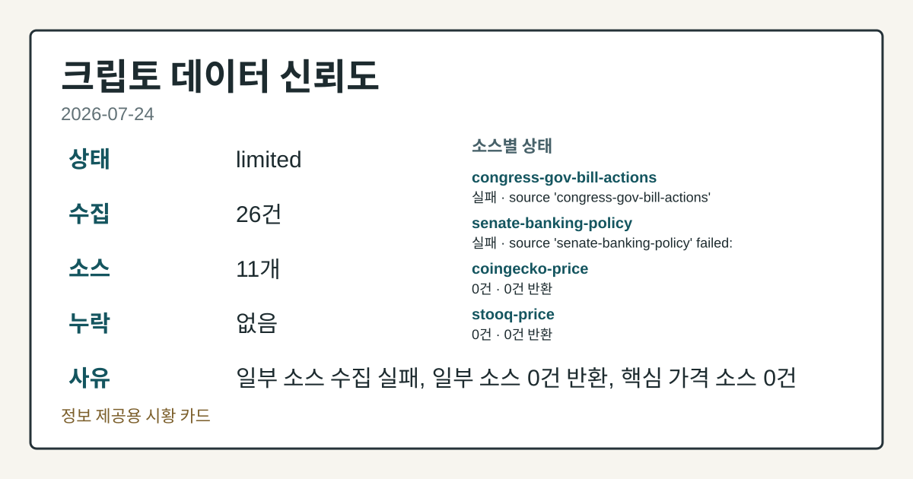
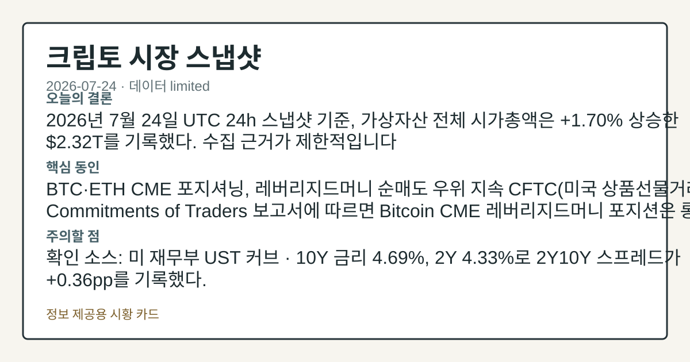
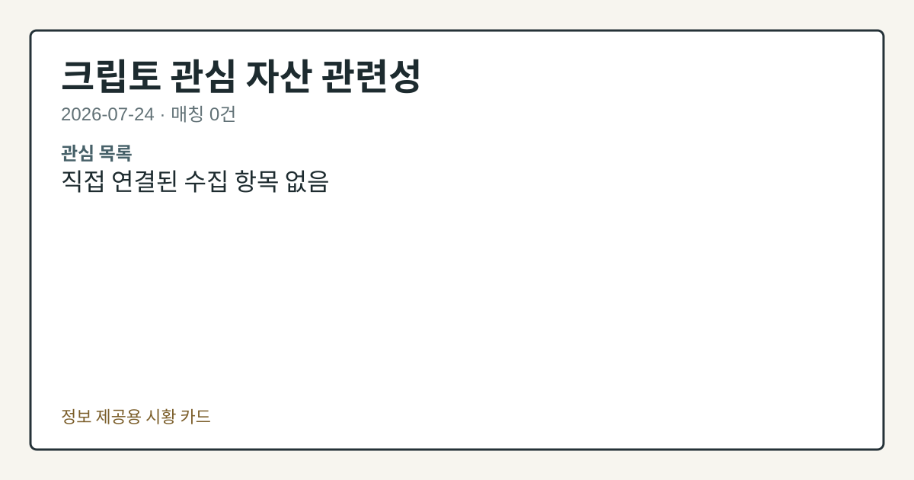

# 2026-07-24 크립토 시황
> 정보 제공용 자동 시황이며 가상자산 매매 권유가 아닙니다. 가상자산은 가격 변동성이 매우 큽니다.
# 2026-07-24 크립토 시황
**기준 시각**: 2026-07-24 UTC · 수집창 2026-07-24T00:00Z ~ 2026-07-25T00:00Z (종료 미포함)
| 종목 | 스냅샷(UTC 24h) | 구간 변동 | 비고 |
|------|------|------|------|
| BTC-USD | 64,437.19 | +0.19% | +10.04% from 52w low · -27.38% YTD |
| ETH-USD | 1,885.97 | +0.68% | +20.52% from 52w low · -37.14% YTD |
**세그먼트**: [국내 증시](../../../domestic-equity/2026/07/2026-07-24.md) | [미국 증시](../../../us-equity/2026/07/2026-07-24.md) | [크립토](2026-07-24.md)
<!-- investo:block visual:crypto.visual.curated-context-image -->

*이미지: 큐레이션 시황 이미지 · 출처: 외부 라이선스 이미지 · 생성: investo 0.1.0 · 2026-07-26 UTC*
<!-- /investo:block visual:crypto.visual.curated-context-image -->
> **내 관심 자산 영향**: 데이터 수집 부족으로 매칭 판단 보류 — 추가 수집 후 재평가됩니다.
> **오늘의 결론**: 2026년 7월 24일 UTC 24h 스냅샷 기준, 가상자산 전체 시가총액은 **$2.29T**(24h **+0.85%**)로 소폭 상승했다. 수집 본문 참고.
> **핵심 동인**: BTC·ETH CME 포지셔닝, 순매도 우위 지속 BTC·ETH CME(시카고상업거래소) 레버리지드머니 포지션은 CFTC 주간 리포트 기준 각각 본문 참고.
> **주의할 점**: 확인 소스: CFTC BTC CME 레버리지드머니 포지셔닝(-7,949계약, **-38.7%** of OI) — 순매도 비중이 추가로 확대되면 하방 본문 참고.
## 한눈에 보기
가상자산 전체 시가총액 **$2.29T**, UTC 24h **+0.85%** 상승 — BTC 도미넌스 **56.46%**
**BTC**·**ETH** CME(시카고상업거래소) 레버리지드머니 포지션이 각각 순매도 **-38.7%**, **-29.8%**(of OI) 본문 참고.
UST 10Y 금리 **4.69%**, 2Y10Y **+0.36pp** — 크립토 유동성 환경 점검 포인트, 본문 §④ 참조
## ⓪ 오늘의 매크로
**FOMC 일정** — 2026-07-29 — FOMC Meeting
**국제 유가** — CFTC WTI crude oil managed_money net +63979 contracts
**미 국채 수익률** — UST curve 2026-07-24: 10Y 4.69%, 2Y10Y +0.36pp
## ⓪-A 크립토 지표 (UTC 24h 스냅샷)
| 지표 | 값 |
|------|------|
| 공포·탐욕 | 26 (Fear) |
| BTC 도미넌스 | 56.46% |
| 전체 시총 | $2.29T (+0.85% 24h) |
| BTC 펀딩비 | 0.0000053524196854 (okx) |
| BTC 미결제약정 | $456.2M (okx) |
| DeFi TVL | $76.1B |
| 스테이블코인 공급 | $309.7B |
| 24h 청산 / 거래소 순유출입 | 무료 검증 소스 미확정 |
## ⓪-B 채널 기준선
| 기준선 | 값 |
|------|------|
| 비트코인 | 64,437.19 (+0.19%) |
| 이더리움 | 1,885.97 (+0.68%) |
| BTC 도미넌스 | 56.46% |
| 공포·탐욕 | 26 |
| 펀딩/OI/청산 | 펀딩 0.0000053524196854 · OI 수집됨 |
| CFTC 코인 포지셔닝 | Bitcoin CME 순포지션 -7949계약 (-38.72% OI), 2026-07-21 기준/2026-07-24 공개 · Ether CME 순포지션 -7053계약 (-29.80% OI), 2026-07-21 기준/2026-07-24 공개 · 주간 지연 |
> **크로스마켓 연결 고리**: 유가/지정학 이슈가 여러 자산군의 변동성 연결 고리로 관찰됩니다. / 금리 이벤트가 할인율/달러 경로의 공통 변수로 남아 있습니다.
> **오늘의 큰 그림:** 이 세그먼트의 공통 신호는 제한적입니다. 본문 수급·지표 항목을 먼저 확인하세요.
## ① 요약

<!-- investo:block visual:crypto.visual.data-confidence -->

*이미지: 데이터 신뢰도 · 출처: investo 자체 생성 · 생성: investo 0.1.0 · 2026-07-26 UTC*
<!-- /investo:block visual:crypto.visual.data-confidence -->

<!-- investo:block visual:crypto.visual.market-snapshot -->

*이미지: 시장 스냅샷 · 출처: investo 자체 생성 · 생성: investo 0.1.0 · 2026-07-26 UTC*
<!-- /investo:block visual:crypto.visual.market-snapshot -->

2026년 7월 24일 UTC 24h 스냅샷 기준, 가상자산 전체 시가총액은 **$2.29T**(24h **+0.85%**)로 소폭 상승했다. 다만 [CFTC](https://www.cftc.gov/MarketReports/CommitmentsofTraders/index.htm)(미국 상품선물거래위원회) 위클리 리포트에서는 BTC·ETH CME 레버리지드머니 포지션이 각각 순매도 -7,949계약(**-38.7%** of OI(미결제약정 대비)), -7,053계약으로 순매도 우위를 이어갔고, [공포·탐욕 지수](https://alternative.me/crypto/fear-and-greed-index/)는 26(Fear)로 위축된 심리를 유지했다. 가격 지표와 포지셔닝·심리 지표가 엇갈린 하루였다. [혼재]

## ② 전일 핵심 이슈

### BTC·ETH CME 포지셔닝, 순매도 우위 지속

BTC·ETH CME 레버리지드머니 포지션은 [CFTC](https://www.cftc.gov/MarketReports/CommitmentsofTraders/index.htm) 주간 리포트 기준 각각 순매도 -7,949계약, -7,053계약으로 순매도 우위를 이어갔다. 최근 컨텍스트에서도 7월 21일·17일 구간에서 레버리지드머니 순매도 우위가 관찰된 바 있어, 이번 스냅샷은 해당 흐름의 연장으로 볼 수 있다.

> **그래서 의미는?** 파생 포지셔닝은 순매도 우위, 입법 논의는 지연 신호로 엇갈린 그림입니다.

### CLARITY Act 입법 논의 진전

Galaxy는 [보도](https://www.theblock.co/post/409608/galaxy-says-clarity-act-now-needs-last-ditch-effort-cuts-passage-odds-30)에서 CLARITY Act(디지털자산 시장구조 법안) 통과 가능성 전망을 30%로 하향하며, 하원 협상 그룹 소속 민주당 의원 7인이 최신 초안에 더 강한 윤리·소비자 보호 조항을 요구하고 있다고 전했다. 같은 날 [하원 금융서비스위원회](http://financialservices.house.gov/news/documentsingle.aspx?DocumentID=411196) 디지털자산·핀테크·AI 소위원회는 CLARITY Act 관련 현장 청문회를 개최했다. 두 항목 모두 시장구조 관할권을 둘러싼 공식 입법 절차 보고이며, 통과 여부나 토큰별 영향에 대한 자체 추정은 담지 않는다.

## ③ 섹터/수급 동향

### BTC·ETH CME 레버리지드머니 상세

[CFTC](https://www.cftc.gov/MarketReports/CommitmentsofTraders/index.htm) 자료에 따르면 BTC CME 레버리지드머니는 롱 4,042계약, 숏 11,991계약으로 순매도 -7,949계약을 기록했고, ETH CME 레버리지드머니는 롱 2,223계약, 숏 9,276계약으로 순매도 -7,053계약을 기록했다.

> **그래서 의미는?** 레버리지 자금이 여전히 하락 쪽에 더 쏠려 있다는 뜻입니다.

### 스테이블코인·수탁 규제 동향

Wise는 [보도](https://www.theblock.co/post/409631/wise-plans-resubmit-national-trust-bank-application-under-genius-act-framework)에 따르면 GENIUS Act(스테이블코인 규제법) 프레임워크 하에서 전국 신탁은행 인가 신청을 재제출할 계획이며, OCC(통화감독청)는 지난 12월 이후 스테이블코인 중심 기관 여러 곳에 조건부 승인을 내준 바 있다. 같은 매체는 [스테이블코인 순위 해설](https://www.theblock.co/learn/409203/largest-stablecoins-ranked) 콘텐츠에서 스테이블코인이 크립토의 대표 활용 사례로 자리잡았다고 설명했다.

## ④ 지표·이벤트

### 크립토 온체인·심리 지표

[공포·탐욕 지수](https://alternative.me/crypto/fear-and-greed-index/)는 26을 기록했고, [DeFiLlama](https://defillama.com/) 기준 DeFi TVL(총 예치자산)은 **$76.1B**(1위 Ethereum **$41.5B**, BSC **$4.9B**, Solana **$4.9B**, Tron **$4.8B**, Base **$4.6B**)로 집계됐다. 스테이블코인 공급은 **$309.7B**(1위 USDT **$184.3B**, USDC **$73.5B**, USDS **$6.7B**, DAI **$4.8B**, USD1 **$4.1B**)이며, [코인게코](https://www.coingecko.com/en/global-charts) 기준 전체 시총 대비 BTC 도미넌스는 **56.46%**다. [OKX](https://www.okx.com/trade-swap/btc-usd-swap) 기준 BTC 미결제약정은 **$456,236,840**, BTC 펀딩비는 0.0000053524196854로 나타났다. 24h 정리·거래소 순유출입 지표는 데이터 미수집 상태다.

> **그래서 의미는?** 심리·유동성 지표가 조심스러운 흐름 속에 있다는 뜻입니다.

### 거시 금리 환경

[미 재무부](https://home.treasury.gov/resource-center/data-chart-center/interest-rates) UST 커브는 3M **3.96%**, 2Y **4.33%**, 10Y **4.69%**, 30Y **5.16%**, 2Y10Y **+0.36pp**, 3M10Y **+0.73pp**로 나타났다. 연준 정책 이벤트로서 크립토 유동성 환경과 연결되는 배경 지표다.

## ⑤ 주요 종목
<!-- investo:block chart:crypto.chart.market -->

<!-- u50 lightweight-charts-embed: placeholders consumed by site_docs/assets/investo-chart-init.js -->

<noscript><em>인터랙티브 차트는 JavaScript가 활성화된 환경에서 표시됩니다. 위 정적 카드가 동일한 정보를 담고 있습니다.</em></noscript>

<!-- /investo:block chart:crypto.chart.market -->

### 거버넌스·기술 관전

카르다노 공동창업자 Hoskinson은 [발언](https://www.theblock.co/post/409627/cardano-co-founder-hoskinson-bitcoin-lose-top-spot-governance-fails-quantum-test)에서 거버넌스와 업그레이드 대응력이 실존적 기술 위협(양자 컴퓨팅 등) 대응에 중요하며, 이 부분에서 뒤처질 경우 BTC(비트코인)가 시가총액 1위 지위를 잃을 수 있다고 언급했다.

> **그래서 의미는?** 거버넌스 우려부터 파산까지 개별 이슈가 흩어져 있어 종목별 확인이 필요합니다.

### 자금조달·토큰 이벤트

[World Foundation](https://www.theblock.co/post/409610/world-foundation-wld-token-sale-funding)은 WLD 토큰 세일 "첫 마감"에서 1년 락업 조건으로 **$52.5** million을 조달했으며, Pantera가 주도하고 Bain Capital Crypto, Eightco Holdings, Selini, Susquehanna 등이 참여했다.

### 법적 분쟁·파산 관전

Arthur Hayes와 전 BitMEX 공동창업자 Samuel Reed, Benjamin Delo는 [보도](https://www.theblock.co/post/409595/arthur-hayes-bitmex-co-founders-face-fraud-claims-over-alleged-insider-trading-desk-as-exchange-winds-down)에 따르면 거래소 정리 절차 진행 중 내부자거래·서버 동결 의혹으로 집단소송 대상이 됐다. 전 비트코인 채굴업체 Poolin은 [보도](https://www.theblock.co/post/409587/former-bitcoin-miner-poolin-files-chapter-11-sets-52-million-floor-bid-for-texas-operations)에 따르면 부채 **$173** million 규모로 Chapter 11을 신청했고, 텍사스 채굴 자산에 대해 **$52** million 규모 스토킹호스 입찰가를 설정했다.

## ⑥ 오늘의 관전 포인트

<!-- investo:block visual:crypto.visual.watchlist-relevance -->

*이미지: 관심 자산 관련성 · 출처: investo 자체 생성 · 생성: investo 0.1.0 · 2026-07-26 UTC*
<!-- /investo:block visual:crypto.visual.watchlist-relevance -->

> **관전 포인트**: 오늘은 공개 근거가 충분한 관전 신호만 본문에 남겼습니다.

> **데이터 상태**: 제한

수집/품질 진단

> **데이터 상태**: 제한 — 수집 23건 / 소스 9개 / 누락: 가격 · 제한 — 핵심 가격 소스 0건/실패/stale, 본문 결론 신뢰도 낮음
> **소스 카운트**: 수집 대상 13 / 성공 9 / 수집 상세는 진단 섹션에서 확인할 수 있습니다. / 수집 상세는 진단 섹션에서 확인할 수 있습니다. / 수집 상세는 진단 섹션에서 확인할 수 있습니다.
> **소스 등급 분포**: S=3 / A=2 / B=4
> **상세 사유**: 가격 카테고리 누락, 일부 소스 수집 실패, 일부 소스 0건 반환, 핵심 가격 소스 0건
> **소스별 상태**: binance-crypto-market 실패 (접근 제한), congress-gov-bill-actions 실패 (설정 미완료(미수집)), coingecko-price 0건, senate-banking-policy 0건, 정상 9개

## ⑦ 면책조항
본 시황은 일반 정보 제공을 목적으로 자동 생성된 자료이며,
특정 가상자산에 대한 매매 권유나 투자 자문이 아닙니다.
가상자산은 가상자산이용자보호법(2024-07-19 시행) §10·§19의 적용 대상으로,
24시간 거래되는 비제도권 자산이며 가격 변동성이 매우 크고 원금 전액 손실이 가능합니다.
투자 결정과 그 결과에 대한 책임은 전적으로 본인에게 있으며,
본 시황의 내용에 따라 발생한 손실에 대해 작성자는 일체의 책임을 지지 않습니다.