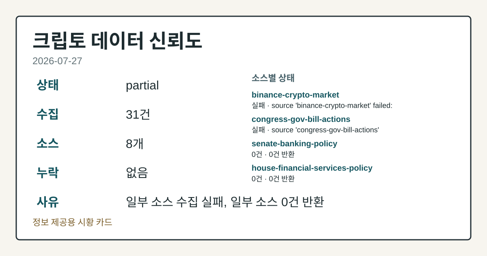
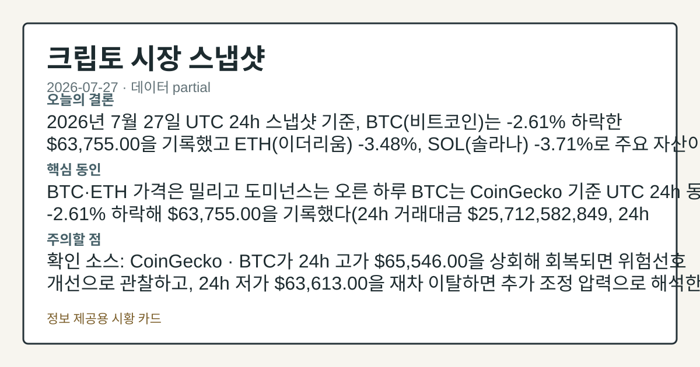
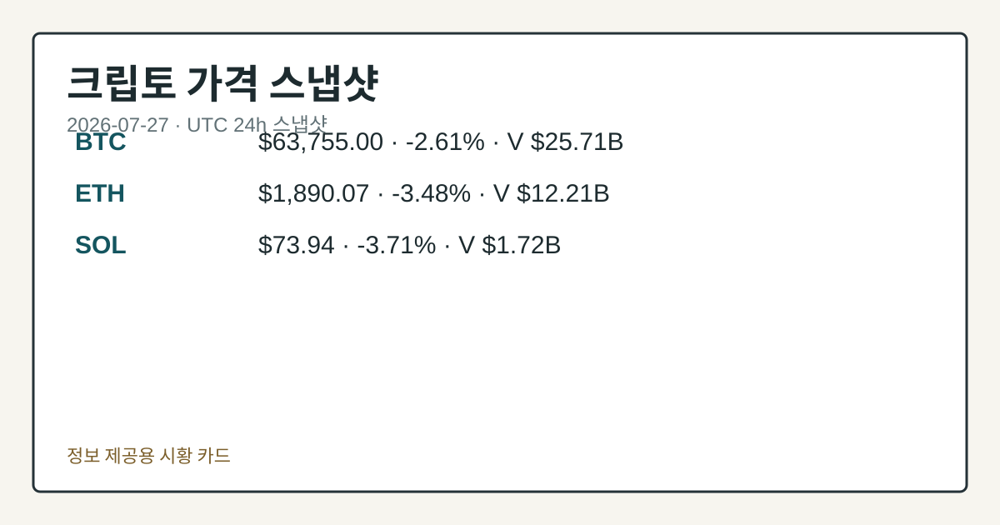
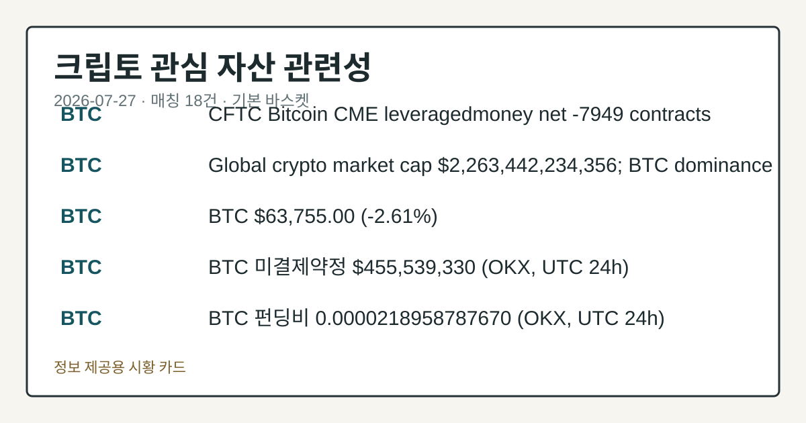

# 2026-07-27 크립토 시황
> 정보 제공용 자동 시황이며 가상자산 매매 권유가 아닙니다. 가상자산은 가격 변동성이 매우 큽니다.
# 2026-07-27 크립토 시황
**기준 시각**: 2026-07-27 UTC · 수집창 2026-07-27T00:00Z ~ 2026-07-28T00:00Z (종료 미포함)
| 종목 | 스냅샷(UTC 24h) | 구간 변동 | 비고 |
|------|------|------|------|
| BTC-USD | 63,619.84 | -2.63% | +8.64% from 52w low · -28.30% YTD |
| ETH-USD | 1,882.88 | -3.61% | +20.33% from 52w low · -37.25% YTD |
**세그먼트**: [국내 증시](../../../domestic-equity/2026/07/2026-07-27.md) | [미국 증시](../../../us-equity/2026/07/2026-07-27.md) | [크립토](2026-07-27.md)
<!-- investo:block visual:crypto.visual.curated-context-image -->

*이미지: 큐레이션 시황 이미지 · 출처: 외부 라이선스 이미지 · 생성: investo 0.1.0 · 2026-07-27 UTC*
<!-- /investo:block visual:crypto.visual.curated-context-image -->
> **내 관심 자산 영향**: 18건 확인 (기본 바스켓) — BTC: 직접 관련 · [cftc-cot-positioning] CFTC Bitcoin CME leveraged_money net -7949 contracts; BTC: 직접 관련 · [coingecko-global-market] Global crypto market cap **$2,263,442,234,356**; BTC dominance **56.41%**; BTC: 직접 관련 · [coingecko-price] BTC **$63,755.00** (**-2.61%**); BTC: 직접 관련 · [okx-derivatives] BTC 미결제약정 **$455,539,330** (OKX, UTC 24h); BTC: 직접 관련 · [okx-derivatives] BTC 펀딩비 0.0000218958787670 (OKX, UTC 24h) 외
> **오늘의 결론**: 2026년 7월 27일 UTC 24h 스냅샷 기준, BTC(비트코인)는 **-2.61%** 하락한 **$63,755.00**을 기록했고 본문 참고.
> **핵심 동인**: BTC·ETH 가격은 밀리고 도미넌스는 오른 하루 BTC는 CoinGecko 기준 UTC 24h 동안 **-2.61%** 하락해 본문 참고.
> **주의할 점**: 확인 소스: CoinGecko · BTC가 24h 고가 **$65,546.00**을 상회해 회복되면 위험선호 개선으로 관찰하고, 24h 저가 본문 참고.
## 한눈에 보기
**BTC**가 UTC 24h 기준 **-2.61%** 하락한 **$63,755.00**을 기록했고, **ETH**도 **-3.48%** 본문 참고.
가상자산 전체 시가총액은 **$2.26T**로 24h **-2.45%** 감소한 반면 BTC 도미넌스는 **56.41%**로 올라, 알트코인이 더 본문 참고.
CFTC(미국 상품선물거래위원회) 자료 기준 BTC·ETH CME(시카고상업거래소) 선물 모두 레버리지드머니(레버리지 활용 펀드) 순매도 우위가 본문 참고.
## ⓪ 오늘의 매크로
**미 국채 수익률** — UST curve 2026-07-27: 10Y 4.65%, 2Y10Y +0.34pp
## ⓪-A 크립토 지표 (UTC 24h 스냅샷)
| 지표 | 값 |
|------|------|
| 공포·탐욕 | 30 (Fear) |
| BTC 도미넌스 | 56.41% |
| 전체 시총 | $2.26T (-2.45% 24h) |
| BTC 펀딩비 | 0.0000229564499883 (okx) |
| BTC 미결제약정 | $455.5M (okx) |
| DeFi TVL | $76.4B |
| 스테이블코인 공급 | $309.0B |
| 24h 청산 / 거래소 순유출입 | 무료 검증 소스 미확정 |
## ⓪-B 채널 기준선
| 기준선 | 값 |
|------|------|
| 비트코인 | 63,619.84 (-2.63%) |
| 이더리움 | 1,882.88 (-3.61%) |
| BTC 도미넌스 | 56.41% |
| 공포·탐욕 | 30 |
| 펀딩/OI/청산 | 펀딩 0.0000229564499883 · OI 수집됨 |
| CFTC 코인 포지셔닝 | Bitcoin CME 순포지션 -7949계약 (-38.72% OI), 2026-07-21 기준/2026-07-24 공개 · Ether CME 순포지션 -7053계약 (-29.80% OI), 2026-07-21 기준/2026-07-24 공개 · 주간 지연 |
> **크로스마켓 연결 고리**: 금리 이벤트가 할인율/달러 경로의 공통 변수로 남아 있습니다.
> **오늘의 큰 그림:** 금리와 달러 변수가 공통 변수지만, BTC·ETH 유동성를 먼저 확인해야 합니다.
## ① 요약

<!-- investo:block visual:crypto.visual.data-confidence -->

*이미지: 데이터 신뢰도 · 출처: investo 자체 생성 · 생성: investo 0.1.0 · 2026-07-27 UTC*
<!-- /investo:block visual:crypto.visual.data-confidence -->

<!-- investo:block visual:crypto.visual.market-snapshot -->

*이미지: 시장 스냅샷 · 출처: investo 자체 생성 · 생성: investo 0.1.0 · 2026-07-27 UTC*
<!-- /investo:block visual:crypto.visual.market-snapshot -->

2026년 7월 27일 UTC 24h 스냅샷 기준, BTC는 **-2.61%** 하락한 **$63,755.00**을 기록했고 ETH **-3.48%**, SOL **-3.71%**로 주요 자산이 동반 조정을 받았다. 가상자산 전체 시가총액은 **$2.26T**로 24h **-2.45%** 감소했고, 공포·탐욕 지수는 **30**(Fear)까지 내려와 위험회피 심리가 짙어졌다. CFTC 자료로도 BTC·ETH CME 선물 모두 레버리지드머니 순매도 우위가 유지되며 하락 압력을 뒷받침했다. 직전 기록된 2026-07-24 스냅샷의 **+1.7%** 상승 흐름과 비교하면 오늘은 뚜렷한 하락 전환이다. [하락 관찰]

## ② 전일 핵심 이슈

### BTC·ETH 가격은 밀리고 도미넌스는 오른 하루

BTC는 [CoinGecko](https://www.coingecko.com/en/coins/bitcoin) 기준 UTC 24h 동안 **-2.61%** 하락해 **$63,755.00**을 기록했다(24h 거래대금 **$25,712,582,849**, 24h 고가 **$65,546.00**, 저가 **$63,613.00**). 같은 구간 가상자산 전체 시가총액 대비 BTC 도미넌스는 **56.41%**로, 가격 하락 속에서도 상대적으로 방어적인 흐름을 보였다.

> **그래서 의미는?** 가격 하락에도 도미넌스가 오른 점은 알트코인이 더 큰 조정 압력을 받았다는 뜻으로 관찰됩니다.

### 정책: 뉴욕주 검찰총장, Clarity Act 완화 우려 제기

[TheBlock](https://www.theblock.co/post/409831/ny-attorney-general-letitia-james-warns-clarity-act-dilute-states-ability-fraud-pressure-mounts) 보도에 따르면 뉴욕주 검찰총장 Letitia James는 Clarity Act가 사기 대응에 대한 각 주(州)의 권한을 약화시킬 수 있다고 의회에 경고했다. 이는 시장 구조 관할권을 다루는 공식 입법 절차상의 이슈로, 통과 여부나 가격 영향을 단정할 근거는 현재 입력에 없다.

## ③ 섹터/수급 동향

### CFTC COT(트레이더 포지션 보고서) 포지셔닝: 순매도 우위 지속

[CFTC](https://www.cftc.gov/MarketReports/CommitmentsofTraders/index.htm) 자료 기준 BTC CME 레버리지드머니는 롱 4,042계약, 숏 11,991계약으로 순포지션 -7,949계약(OI(미결제약정 대비 비율) 대비 **-38.7%**)을 기록했다. ETH CME도 롱 2,223계약, 숏 9,276계약으로 순포지션 -7,053계약(OI 대비 **-29.8%**)을 나타냈다. 두 자산 모두 주간 CFTC 리포트 기준이며 실시간 자금 흐름은 아니다.

> **그래서 의미는?** 선물시장 순매도 우위 지속은 기관 자금의 위험회피 심리를 보여주는 신호로 관찰됩니다.

### 온체인 활동은 늘고 매출은 줄어 — Bitwise 리포트

[TheBlock](https://www.theblock.co/post/409799/ethereum-solana-avalanche-get-busier-cheaper-even-as-token-prices-fall-bitwise) 보도에 따르면 Bitwise 리포트는 Ethereum, Solana, Avalanche의 온체인 활동이 늘었음에도 매출은 감소했고, ETH·SOL·AVAX 모두 1년 전 대비 50% 넘게 하락한 상태라고 밝혔다.

### Lido, 스테이킹된 ETH 통합 절차 시작

[TheBlock](https://www.theblock.co/post/409780/lido-begins-consolidating-16-billion-worth-of-staked-eth-as-curated-module-v2-rolls-out) 보도에 따르면 Lido는 Curated Module v2 도입과 함께 800만 ETH 이상(약 **$16B** 규모)을 Pectra 이후 0x02 대형 밸리데이터로 통합하는 작업을 시작했다.

## ④ 지표·이벤트

### 매크로·파생 지표 스냅샷

[CoinGecko](https://www.coingecko.com/en/global-charts) 기준 가상자산 전체 시가총액은 **$2,263,442,234,356**(BTC 도미넌스 **56.41%**)이다. [미 재무부](https://home.treasury.gov/resource-center/data-chart-center/interest-rates) UST(미국채) curve는 3M **3.96%**, 2Y **4.31%**, 10Y **4.65%**, 30Y **5.12%**로, 2Y10Y(2년물-10년물 금리차)는 **+0.34pp**, 3M10Y(3개월물-10년물 금리차)는 **+0.69pp**를 기록했다. [Alternative.me](https://alternative.me/crypto/fear-and-greed-index/) 공포·탐욕 지수는 **30**(Fear)이다. [DefiLlama](https://defillama.com/) 기준 DeFi(탈중앙화 금융) TVL(총예치자산)은 **$76.4B**로 Ethereum이 41.9B로 선두, Solana·BSC·Tron이 각 4.9B, Base가 4.6B로 뒤를 이었다. 스테이블코인 공급은 **$309.0B**로 USDT가 183.9B로 선두, USDC 73.5B, USDS 6.5B, DAI 4.8B, USD1 4.1B 순이다. [OKX](https://www.okx.com/trade-swap/btc-usd-swap) 기준 BTC 미결제약정은 **$455.5M**, 펀딩비는 0.0000229564499883이다.

> **그래서 의미는?** 국채 금리 상승과 파생시장 지표를 함께 보면 자금 흐름의 위험선호도를 가늠할 수 있습니다.

## ⑤ 주요 종목
<!-- investo:block chart:crypto.chart.market -->

<!-- u50 lightweight-charts-embed: placeholders consumed by site_docs/assets/investo-chart-init.js -->

<noscript><em>인터랙티브 차트는 JavaScript가 활성화된 환경에서 표시됩니다. 위 정적 카드가 동일한 정보를 담고 있습니다.</em></noscript>

<!-- /investo:block chart:crypto.chart.market -->

<!-- investo:block visual:crypto.visual.price-snapshot -->

*이미지: 가격 스냅샷 · 출처: investo 자체 생성 · 생성: investo 0.1.0 · 2026-07-27 UTC*
<!-- /investo:block visual:crypto.visual.price-snapshot -->

### 관전 분류: 대형 자산 가격

- ETH(이더리움) [CoinGecko](https://www.coingecko.com/en/coins/ethereum): **-3.48%**, **$1,890.07**(24h 고가 **$1,972.61**, 저가 **$1,885.78**)
- SOL [CoinGecko](https://www.coingecko.com/en/coins/solana): **-3.71%**, **$73.94**(24h 고가 **$77.23**, 저가 **$73.88**)

> **그래서 의미는?** ETH·SOL 가격 조정 속 Strategy·Bitmine 등 기관 동향을 함께 보면 자금 흐름을 가늠할 수 있습니다.

### 관전 분류: 기업·기관 동향

- [TD Cowen](https://www.theblock.co/post/409797/td-cowen-cuts-david-bailey-nakamoto-target-58-bitcoin-outlook-reset)은 BTC 전망 재조정을 이유로 David Bailey 주도 Nakamoto에 대한 밸류에이션 전망치를 58% 하향 조정했다.
- [Ondo](https://www.theblock.co/post/409792/ondo-launches-new-execution-network-calling-it-evolution-of-ondo-chain)는 기존 Ondo Chain을 계승하는 새 실행 네트워크를 공개했고, Ondo Perps의 기반이 된다고 밝혔다.
- [Bitmine](https://www.theblock.co/post/409749/bitmine-adds-nearly-10000-eth-repurchasing-6-1-million-common-shares)은 ETH 약 1만 개를 추가로 확보하는 동시에 610만 주를 재매입해, **$4B** 자사주 매입 프로그램 중 누적 1,160만 주를 재매입했다.
- [Benchmark](https://www.theblock.co/post/409752/benchmark-metaplanet-brokerage-deal-badly-undersells-plans-bitcoin-backed-bitbonds)는 Metaplanet의 브로커리지 계약이 4~6% BTC 담보 'Bitbonds' 계획을 저평가하고 있다고 평가했다.
- [Benchmark](https://www.theblock.co/post/409743/benchmark-reiterates-570-strategy-target-says-cash-reserve-strengthens-bitcoin-acquisition-plan)는 현금 보유 확대가 BTC 매입 계획을 뒷받침한다며 Strategy에 대한 **$570** 밸류에이션 전망치를 유지했다.
- [Strategy](https://www.theblock.co/post/409721/strategy-extends-bitcoin-pause-to-five-weeks-sells-544-5-million-in-mstr-as-usd-reserve-hits-3-75-billion)(MSTR)는 5주 연속 BTC 매입을 쉬며 **$544.5M** 규모 MSTR을 매도했고, USD 보유고는 **$3.75B**로 늘었다.

## ⑥ 오늘의 관전 포인트

<!-- investo:block visual:crypto.visual.watchlist-relevance -->

*이미지: 관심 자산 관련성 · 출처: investo 자체 생성 · 생성: investo 0.1.0 · 2026-07-27 UTC*
<!-- /investo:block visual:crypto.visual.watchlist-relevance -->

#### 관찰 신호: BTC

- 출처: CoinGecko
- 현재: 탐욕 지수 30(Fear) 레벨의 변화를 점검한다.
- 확인 조건: 상방 BTC가 24h 고가 **$65,546.00**을 상회해 회복되면 위험선호 개선으로 관찰하고; 하방 24h 저가 **$63,613.00**을 재차 이탈하면 추가 조정 압력으로 해석한다
- 신뢰도: 높음
- 관심 영향: 공포

#### 관찰 신호: ETH

- 출처: CoinGecko
- 현재: CoinGecko · ETH가 24h 고가 **$1,972.61**을 상회하면 대형 알트코인 반등 신호로 관찰하고, 24h 저가 **$1,885.78**을 이탈하면 하락 압력 지속으로 해석한다. 관심 영향: SOL 등 다른 대형 알트코인과의 동조화 정도를 비교한다.
- 확인 조건: 상방 ETH가 24h 고가 **$1,972.61**을 상회하면 대형 알트코인 반등 신호로 관찰하고; 하방 24h 저가 **$1,885.78**을 이탈하면 하락 압력 지속으로 해석한다
- 신뢰도: 높음
- 관심 영향: SOL 등 다른 대형 알트코인과의 동조화 정도를 비교한다.

> **데이터 상태**: 부분

수집/품질 진단

> **데이터 상태**: 부분 — 수집 31건 / 소스 8개 / 누락: 없음 · 부분 — 일부 카테고리 미수집, 본문 일부 결론 보강 필요
> **소스 카운트**: 수집 대상 13 / 성공 9 / 수집 상세는 진단 섹션에서 확인할 수 있습니다. / 수집 상세는 진단 섹션에서 확인할 수 있습니다. / 수집 상세는 진단 섹션에서 확인할 수 있습니다.
> **소스 등급 분포**: S=2 / A=2 / B=5
> **상세 사유**: 일부 소스 수집 실패, 일부 소스 0건 반환
> **소스별 상태**: binance-crypto-market 실패 (접근 제한), congress-gov-bill-actions 실패 (설정 미완료(미수집)), senate-banking-policy 0건, house-financial-services-policy 0건, 정상 9개

## ⑦ 면책조항
본 시황은 일반 정보 제공을 목적으로 자동 생성된 자료이며,
특정 가상자산에 대한 매매 권유나 투자 자문이 아닙니다.
가상자산은 가상자산이용자보호법(2024-07-19 시행) §10·§19의 적용 대상으로,
24시간 거래되는 비제도권 자산이며 가격 변동성이 매우 크고 원금 전액 손실이 가능합니다.
투자 결정과 그 결과에 대한 책임은 전적으로 본인에게 있으며,
본 시황의 내용에 따라 발생한 손실에 대해 작성자는 일체의 책임을 지지 않습니다.