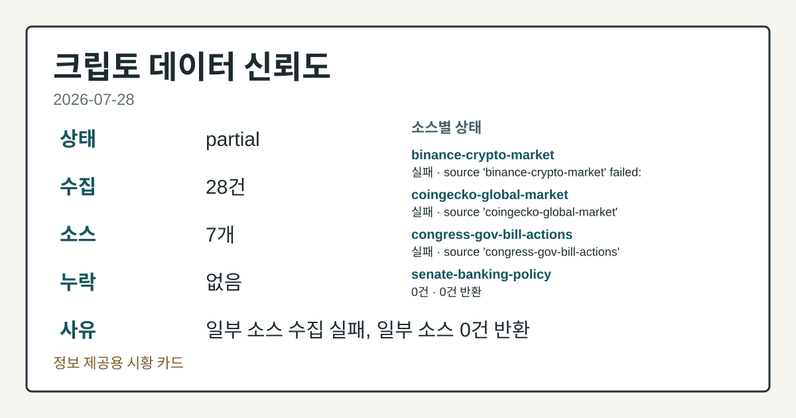
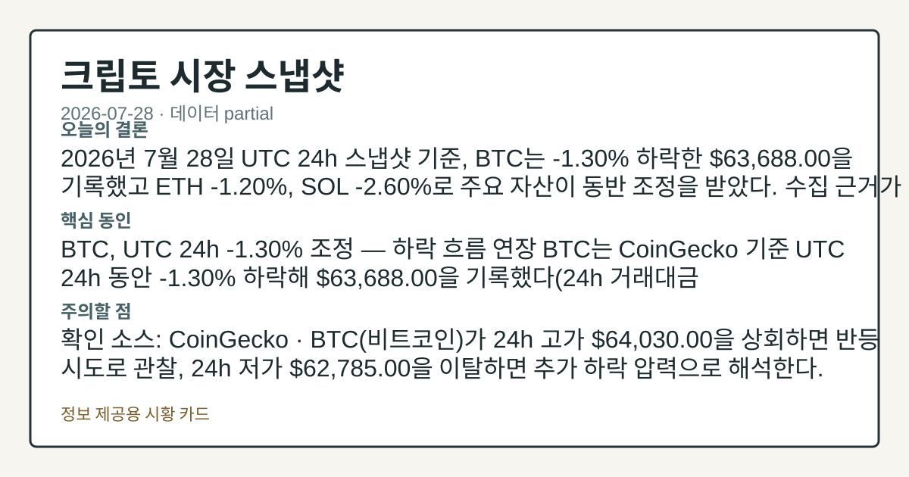
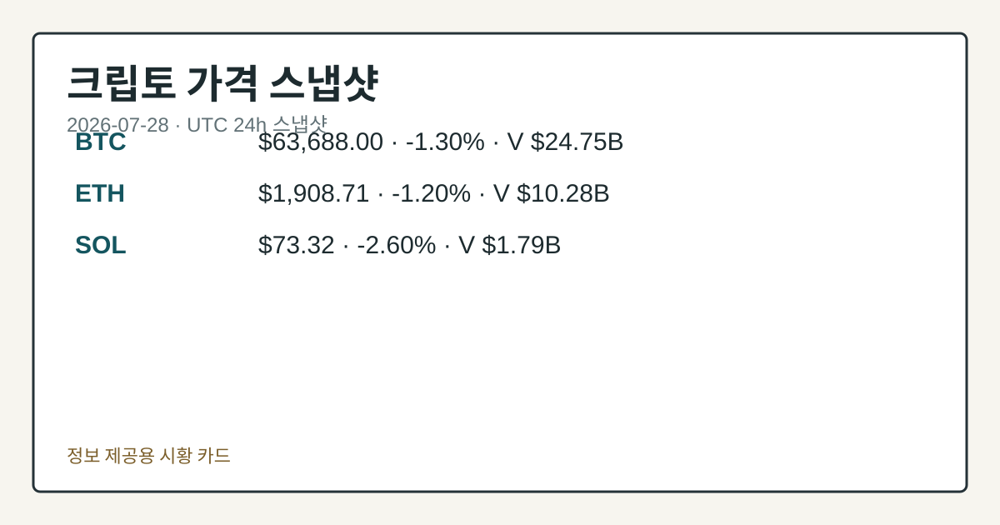
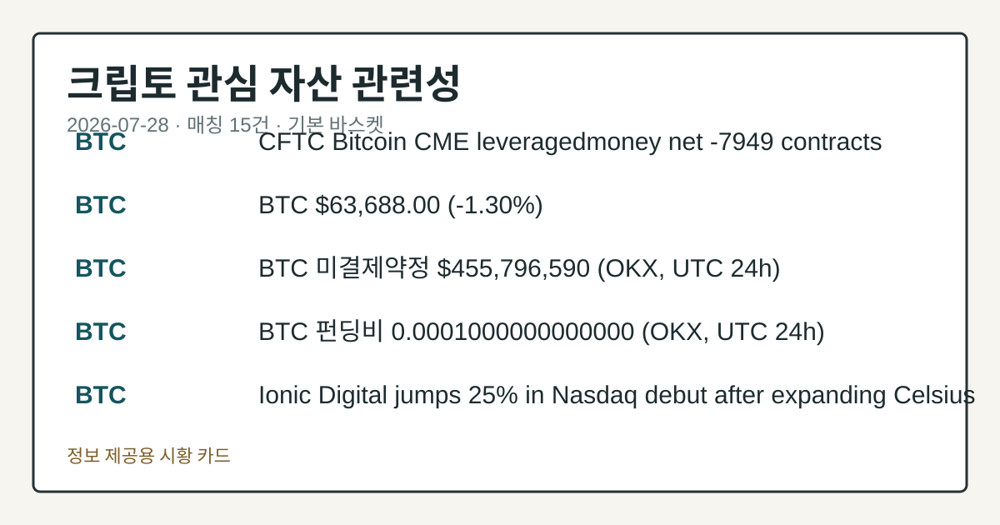

# 2026-07-28 크립토 시황
> 정보 제공용 자동 시황이며 가상자산 매매 권유가 아닙니다. 가상자산은 가격 변동성이 매우 큽니다.
# 2026-07-28 크립토 시황
**기준 시각**: 2026-07-28 UTC · 수집창 2026-07-28T00:00Z ~ 2026-07-29T00:00Z (종료 미포함)
| 종목 | 스냅샷(UTC 24h) | 구간 변동 | 비고 |
|------|------|------|------|
| BTC-USD | 63,620.01 | -0.16% | +8.64% from 52w low · -28.30% YTD |
| ETH-USD | 1,905.41 | +0.78% | +21.77% from 52w low · -36.49% YTD |
**세그먼트**: [국내 증시](../../../domestic-equity/2026/07/2026-07-28.md) | [미국 증시](../../../us-equity/2026/07/2026-07-28.md) | [크립토](2026-07-28.md)
<!-- investo:block visual:crypto.visual.curated-context-image -->

*이미지: 큐레이션 시황 이미지 · 출처: 외부 라이선스 이미지 · 생성: investo 0.1.0 · 2026-07-28 UTC*
<!-- /investo:block visual:crypto.visual.curated-context-image -->
> **내 관심 자산 영향**: 15건 확인 (기본 바스켓) — BTC: 직접 관련 · [cftc-cot-positioning] CFTC Bitcoin CME leveraged_money net -7949 contracts; BTC: 직접 관련 · [coingecko-price] BTC **$63,688.00** (**-1.30%**); BTC: 직접 관련 · [okx-derivatives] BTC 미결제약정 **$455,796,590** (OKX, UTC 24h); BTC: 직접 관련 · [okx-derivatives] BTC 펀딩비 0.0001000000000000 (OKX, UTC 24h); BTC: 직접 관련 · [theblock-crypto] Ionic Digital jumps 25% in Nasdaq debut after expanding Celsius bitcoin mining assets into AI infrastructure 외
> **용어 가이드**: 이번 시황에서 처음 등장한 용어 — 스테이킹(예치보상)
> **오늘의 결론**: 2026년 7월 28일 UTC 24h 스냅샷 기준, BTC는 **-1.30%** 하락한 **$63,688.00**을 기록했고 ETH 본문 참고.
> **핵심 동인**: BTC, UTC 24h **-1.30%** 조정 — 하락 흐름 연장 BTC는 CoinGecko 기준 UTC 24h 동안 **-1.30%** 하락해 본문 참고.
> **주의할 점**: 확인 소스: CoinGecko · BTC(비트코인)가 24h 고가 **$64,030.00**을 상회하면 반등 시도로 관찰, 24h 저가 본문 참고.
## 한눈에 보기
**BTC**가 UTC 24h 기준 **-1.30%** 하락한 **$63,688.00**을 기록했고, **ETH -1.20%**, **SOL -2.60%**로 주요 자산이 동반 조정을 받았다.
Morgan Stanley가 업계 최저 수수료를 내건 ETH·SOL 현물 ETF(상장지수펀드)를 스테이킹 보상과 함께 신규 출시했다.
BTC·ETH CME(시카고상업거래소) 레버리지드머니 순포지션이 각각 **-38.7%**, **-29.8%**(of OI)로 순매도 우위를 유지 중이다 — 본문 §③ 참조.
## ⓪ 오늘의 매크로
**FOMC 일정** — 2026-07-29 — FOMC Meeting
**미 국채 수익률** — UST curve 2026-07-28: 10Y 4.61%, 2Y10Y +0.35pp
## ⓪-A 크립토 지표 (UTC 24h 스냅샷)
| 지표 | 값 |
|------|------|
| 공포·탐욕 | 29 (Fear) |
| BTC 도미넌스 | 수집 안 됨 |
| 전체 시총 | 수집 안 됨 |
| BTC 펀딩비 | 0.0001000000000000 (okx) |
| BTC 미결제약정 | $455.8M (okx) |
| DeFi TVL | $75.9B |
| 스테이블코인 공급 | $308.3B |
| 24h 청산 / 거래소 순유출입 | 무료 검증 소스 미확정 |
## ⓪-B 채널 기준선
| 기준선 | 값 |
|------|------|
| 비트코인 | 63,620.01 (-0.16%) |
| 이더리움 | 1,905.41 (+0.78%) |
| BTC 도미넌스 | 아직 미제공 |
| 공포·탐욕 | 29 |
| 펀딩/OI/청산 | 펀딩 0.0001000000000000 · OI 수집됨 |
| CFTC 코인 포지셔닝 | Bitcoin CME 순포지션 -7949계약 (-38.72% OI), 2026-07-21 기준/2026-07-24 공개 · Ether CME 순포지션 -7053계약 (-29.80% OI), 2026-07-21 기준/2026-07-24 공개 · 주간 지연 |
> **크로스마켓 연결 고리**: 금리 이벤트가 할인율/달러 경로의 공통 변수로 남아 있습니다.
> **오늘의 큰 그림:** 이 세그먼트의 공통 신호는 제한적입니다. 본문 수급·지표 항목을 먼저 확인하세요.
## ① 요약

<!-- investo:block visual:crypto.visual.data-confidence -->

*이미지: 데이터 신뢰도 · 출처: investo 자체 생성 · 생성: investo 0.1.0 · 2026-07-28 UTC*
<!-- /investo:block visual:crypto.visual.data-confidence -->

<!-- investo:block visual:crypto.visual.market-snapshot -->

*이미지: 시장 스냅샷 · 출처: investo 자체 생성 · 생성: investo 0.1.0 · 2026-07-28 UTC*
<!-- /investo:block visual:crypto.visual.market-snapshot -->

2026년 7월 28일 UTC 24h 스냅샷 기준, BTC는 **-1.30%** 하락한 **$63,688.00**을 기록했고 ETH **-1.20%**, SOL **-2.60%**로 주요 자산이 동반 조정을 받았다. 공포·탐욕 지수는 **29**(Fear)로 위험회피 심리가 이어졌고, CFTC 자료로도 BTC·ETH CME 선물 모두 레버리지드머니 순매도 우위가 유지되며 하락 압력을 뒷받침했다. 직전 거래일(2026-07-27, **-2.61%** 하락)과 비교하면 낙폭은 줄었지만 하락 흐름 자체는 이어지는 모습으로, 새로운 반전 신호는 확인되지 않는다. [하락 관찰]

## ② 전일 핵심 이슈

### BTC, UTC 24h **-1.30%** 조정 — 하락 흐름 연장

BTC는 [CoinGecko](https://www.coingecko.com/en/coins/bitcoin) 기준 UTC 24h 동안 **-1.30%** 하락해 **$63,688.00**을 기록했다(24h 거래대금 **$24,752,859,942**, 시가총액 **$1,277,902,603,208**, 24h 고가 **$64,030.00**, 저가 **$62,785.00**). 어제 **-2.61%** 하락 이후 오늘도 낙폭은 줄었으나 방향은 바뀌지 않아, 큰 변화 없이 어제 하락 흐름이 연장되는 모습이다.

> **그래서 의미는?** 낙폭은 줄었지만 방향 전환 신호는 아직 확인되지 않는다는 뜻입니다.

### Morgan Stanley, ETH·SOL 현물 ETF 신규 출시

[TheBlock](https://www.theblock.co/post/409898/morgan-stanley-debuts-ethereum-solana-etfs-markets-lowest-fee-staking-rewards) 보도에 따르면 Morgan Stanley는 업계 최저 수수료를 내건 ETH(이더리움)·SOL(솔라나) 기반 현물 ETF(상장지수펀드)를 스테이킹 보상 옵션과 함께 출시했다. 최초의 현물 비트코인 ETF 거래 개시로부터 약 2년 반 만의 확장이다.

### 크립토 해킹 피해, 2026년 상반기 사상 최고치

[TheBlock](https://www.theblock.co/post/409944/crypto-hacks-hit-record-high-in-h1-2026-as-losses-top-1-billion-blockaid-says) 보도(Blockaid 집계)에 따르면 2026년 상반기 크립토 해킹 피해액이 **$1B**를 넘어 사상 최고치를 기록했다. Ethereum과 Solana 프로젝트가 각각 **$332M**, **$326M**로 가장 큰 피해를 입었다.

## ③ 섹터/수급 동향

### CFTC COT(트레이더 포지션 보고서): BTC·ETH CME 순매도 우위 지속

[CFTC](https://www.cftc.gov/MarketReports/CommitmentsofTraders/index.htm) 자료 기준 BTC CME(시카고상업거래소) 레버리지드머니는 롱 4,042계약, 숏 11,991계약으로 순포지션 -7,949계약(OI(미결제약정) 대비 **-38.7%**)을 기록했다. ETH CME도 롱 2,223계약, 숏 9,276계약으로 순포지션 -7,053계약(OI 대비 **-29.8%**)을 나타냈다. 두 자산 모두 주간 CFTC 리포트 기준이며 실시간 자금 흐름은 아니다. 같은 구간 [OKX](https://www.okx.com/trade-swap/btc-usd-swap) 기준 BTC 미결제약정은 **$455,796,590**, 펀딩비는 0.0001000000000000이다.

> **그래서 의미는?** 선물시장 순매도 우위 지속은 기관 자금의 위험회피 심리를 보여주는 신호로 관찰됩니다.

### Ethereum L2(레이어2) TVL(총예치자산), 2년 만에 최저

[TheBlock](https://www.theblock.co/post/409811/ethereum-l2-ecosystem-loses-momentum-as-tvl-drops-to-two-year-low) 보도에 따르면 Ethereum L2 생태계 TVL이 약 **$5B** 수준까지 내려와 2023년 이후 최저치로 되돌아갔다.

### Robinhood Chain, 예치는 늘었지만 거래량·이용자는 감소

[TheBlock](https://www.theblock.co/post/409813/robinhood-chain-deposits-climb-volume-users-fade-memecoin-fueled-launch) 보도에 따르면 Robinhood Chain의 일평균 활성 계정 수는 약 275,000개로, 전주 대비 **7%** 감소했다.

## ④ 지표·이벤트

### 매크로·파생 지표 스냅샷

[Alternative.me](https://alternative.me/crypto/fear-and-greed-index/) 공포·탐욕 지수는 **29**(Fear)다. [DefiLlama](https://defillama.com/) 기준 DeFi(탈중앙화 금융) TVL은 **$75.9B**로 Ethereum이 41.5B로 선두, Tron·BSC·Solana가 각 4.8B, Base가 4.6B로 뒤를 이었다. 스테이블코인 공급은 **$308.3B**로 USDT가 183.9B로 선두, USDC 72.5B, USDS 6.6B, DAI 4.8B, USD1 4.1B 순이다. [미 재무부](https://home.treasury.gov/resource-center/data-chart-center/interest-rates) UST(미국채) curve 기준 10Y 금리는 **4.61%**, 2Y10Y(2년물-10년물 금리차)는 **+0.35pp**를 기록했다. BTC 도미넌스, 전체 시가총액, 24h 정리 및 거래소 순유출입은 수집되지 않아 데이터 미수집으로 남는다.

> **그래서 의미는?** 국채 금리와 파생·심리 지표를 함께 보면 자금의 위험선호도를 가늠할 수 있습니다.

### 러시아·미네소타 규제 동향

[TheBlock](https://www.theblock.co/post/409877/russias-central-bank-drafts-first-rules-for-organized-crypto-trading) 보도에 따르면 러시아 중앙은행은 조직화된 거래, 자기자본 요건, 디지털 예탁기관 설립을 규정하는 첫 크립토 거래 규칙 초안을 마련했다. 한편 [TheBlock](https://www.theblock.co/post/409861/judge-blocks-minnesota-prediction-market-ban) 보도에 따르면 연방 판사는 미네소타주의 예측시장 금지법 시행을 예비적으로 차단해 Kalshi·Polymarket에 유리한 결정을 내렸다.

## ⑤ 주요 종목
<!-- investo:block chart:crypto.chart.market -->

<!-- u50 lightweight-charts-embed: placeholders consumed by site_docs/assets/investo-chart-init.js -->

<noscript><em>인터랙티브 차트는 JavaScript가 활성화된 환경에서 표시됩니다. 위 정적 카드가 동일한 정보를 담고 있습니다.</em></noscript>

<!-- /investo:block chart:crypto.chart.market -->

<!-- investo:block visual:crypto.visual.price-snapshot -->

*이미지: 가격 스냅샷 · 출처: investo 자체 생성 · 생성: investo 0.1.0 · 2026-07-28 UTC*
<!-- /investo:block visual:crypto.visual.price-snapshot -->

### 관전 분류: 대형 자산 가격

- ETH(이더리움) [CoinGecko](https://www.coingecko.com/en/coins/ethereum): **-1.20%**, **$1,908.71**(24h 고가 **$1,925.65**, 저가 **$1,860.94**, 시가총액 **$230,343,345,375**)
- SOL [CoinGecko](https://www.coingecko.com/en/coins/solana): **-2.60%**, **$73.32**(24h 고가 **$74.47**, 저가 **$72.43**, 시가총액 **$42,747,983,703**)

> **그래서 의미는?** ETH·SOL 가격 조정 속에서 채굴·인프라 기업 동향을 함께 보면 자금 흐름을 가늠할 수 있습니다.

### 관전 분류: 기관·인프라 동향

- [Galaxy Digital](https://www.theblock.co/post/409911/galaxy-digital-buys-500-acres-in-mcgregor-for-second-texas-ai-data-center-campus)은 텍사스 맥그레거에 두 번째 AI 데이터센터 부지로 500에이커를 매입했으며, 지역 세수에 최소 **$130M**을 기여할 것으로 언급됐다.
- [Ionic Digital](https://www.theblock.co/post/409945/ionic-digital-jumps-22-nasdaq-debut-celsius-bitcoin-mining-assets-ai-infrastructure)은 Celsius 비트코인 채굴 자산을 AI 인프라로 확장하며 나스닥 데뷔 첫날 **25%** 상승했다.
- [Core Scientific](https://www.theblock.co/post/409887/core-scientific-ties-ai-pivot-amd-multi-gigawatt-infrastructure-deal)은 AMD와 2027년부터 500MW(최대 2.5GW까지 확장 가능) 규모의 美 AI 데이터센터 인프라 계약을 체결했다.
- [Fortitude](https://www.theblock.co/post/409899/barry-silbert-zcash-miner-fortitude-nebraska-facility-online-cut-zec-mining-costs)는 네브래스카 12메가와트 채굴 시설을 가동해 ZEC 채굴 원가를 개당 약 **$70**에서 약 **$40**으로 낮출 것으로 예상한다고 밝혔다.
- [Zcash](https://www.theblock.co/post/409934/zcash-ironwood-upgrade-launching-new-shielded-pool-after-orchard-vulnerability)는 Orchard 취약점 발견 이후 새 shielded pool을 여는 Ironwood 업그레이드를 활성화했다.

## ⑥ 오늘의 관전 포인트

<!-- investo:block visual:crypto.visual.watchlist-relevance -->

*이미지: 관심 자산 관련성 · 출처: investo 자체 생성 · 생성: investo 0.1.0 · 2026-07-28 UTC*
<!-- /investo:block visual:crypto.visual.watchlist-relevance -->

#### 관찰 신호: BTC

- 출처: CoinGecko
- 현재: 탐욕 지수 **29**(Fear) 레벨 변화 점검.
- 확인 조건: 상방 BTC가 24h 고가 **$64,030.00**을 상회하면 반등 시도로 관찰; 하방 24h 저가 **$62,785.00**을 이탈하면 추가 하락 압력으로 해석한다
- 신뢰도: 높음
- 관심 영향: 공포

#### 관찰 신호: ETH

- 출처: CoinGecko
- 현재: CoinGecko · ETH가 24h 고가 **$1,925.65**를 상회하면 대형 알트코인 반등 신호로 관찰, 24h 저가 **$1,860.94**를 이탈하면 하락 압력 지속으로 해석한다. 관심 영향: SOL 등 다른 대형 알트코인과의 동조화 정도 비교.
- 확인 조건: 상방 ETH가 24h 고가 **$1,925.65**를 상회하면 대형 알트코인 반등 신호로 관찰; 하방 24h 저가 **$1,860.94**를 이탈하면 하락 압력 지속으로 해석한다
- 신뢰도: 높음
- 관심 영향: SOL 등 다른 대형 알트코인과의 동조화 정도 비교.

> **데이터 상태**: 부분

수집/품질 진단

> **데이터 상태**: 부분 — 수집 28건 / 소스 7개 / 누락: 없음 · 부분 — 일부 카테고리 미수집, 본문 일부 결론 보강 필요
> **소스 카운트**: 수집 대상 13 / 성공 8 / 수집 상세는 진단 섹션에서 확인할 수 있습니다. / 수집 상세는 진단 섹션에서 확인할 수 있습니다. / 수집 상세는 진단 섹션에서 확인할 수 있습니다.
> **소스 등급 분포**: S=2 / A=2 / B=4
> **상세 사유**: 일부 소스 수집 실패, 일부 소스 0건 반환
> **소스별 상태**: binance-crypto-market 실패 (접근 제한), coingecko-global-market 실패 , congress-gov-bill-actions 실패 (설정 미완료(미수집)), senate-banking-policy 0건, house-financial-services-policy 0건, 정상 8개

## ⑦ 면책조항
본 시황은 일반 정보 제공을 목적으로 자동 생성된 자료이며,
특정 가상자산에 대한 매매 권유나 투자 자문이 아닙니다.
가상자산은 가상자산이용자보호법(2024-07-19 시행) §10·§19의 적용 대상으로,
24시간 거래되는 비제도권 자산이며 가격 변동성이 매우 크고 원금 전액 손실이 가능합니다.
투자 결정과 그 결과에 대한 책임은 전적으로 본인에게 있으며,
본 시황의 내용에 따라 발생한 손실에 대해 작성자는 일체의 책임을 지지 않습니다.