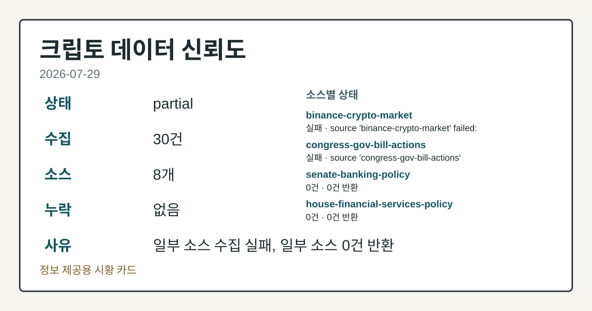
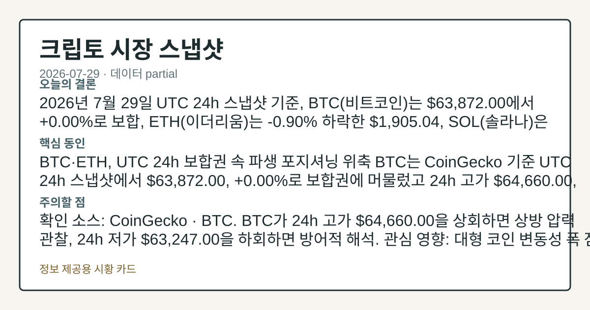
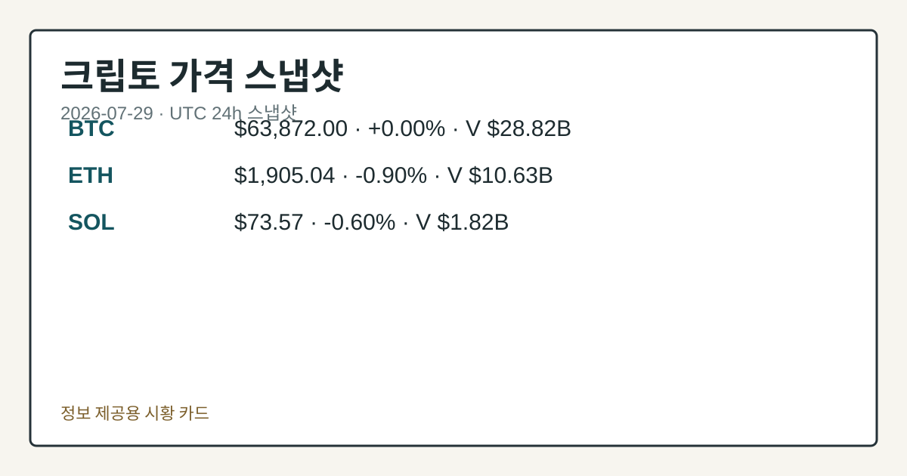
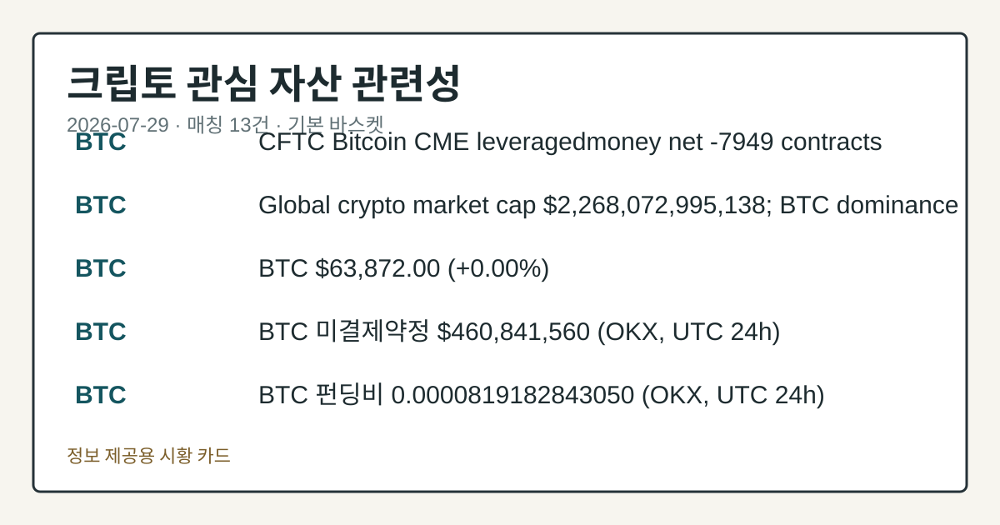

# 2026-07-29 크립토 시황
> 정보 제공용 자동 시황이며 가상자산 매매 권유가 아닙니다. 가상자산은 가격 변동성이 매우 큽니다.
# 2026-07-29 크립토 시황
**기준 시각**: 2026-07-29 UTC · 수집창 2026-07-29T00:00Z ~ 2026-07-30T00:00Z (종료 미포함)
| 종목 | 스냅샷(UTC 24h) | 구간 변동 | 비고 |
|------|------|------|------|
| BTC-USD | 63,848.51 | -0.04% | +9.03% from 52w low · -28.04% YTD |
| ETH-USD | 1,902.36 | -0.92% | +21.57% from 52w low · -36.60% YTD |
**세그먼트**: [국내 증시](../../../domestic-equity/2026/07/2026-07-29.md) | [미국 증시](../../../us-equity/2026/07/2026-07-29.md) | [크립토](2026-07-29.md)
<!-- investo:block visual:crypto.visual.curated-context-image -->

*이미지: 큐레이션 시황 이미지 · 출처: 외부 라이선스 이미지 · 생성: investo 0.1.0 · 2026-07-29 UTC*
<!-- /investo:block visual:crypto.visual.curated-context-image -->
> **내 관심 자산 영향**: 13건 확인 (기본 바스켓) — BTC: 직접 관련 · [cftc-cot-positioning] CFTC Bitcoin CME leveraged_money net -7949 contracts; BTC: 직접 관련 · [coingecko-global-market] Global crypto market cap **$2,268,072,995,138**; BTC dominance **56.49%**; BTC: 직접 관련 · [coingecko-price] BTC **$63,872.00** (**+0.00%**); BTC: 직접 관련 · [okx-derivatives] BTC 미결제약정 **$460,841,560** (OKX, UTC 24h); BTC: 직접 관련 · [okx-derivatives] BTC 펀딩비 0.0000819182843050 (OKX, UTC 24h) 외
> **용어 가이드**: 이번 시황에서 처음 등장한 용어 — 거래대금(거래총액)
> **오늘의 결론**: 2026년 7월 29일 UTC 24h 스냅샷 기준, BTC(비트코인)는 **$63,872.00**에서 **+0.00%**로 보합, ETH(이더리움) 본문 참고.
> **핵심 동인**: BTC·ETH, UTC 24h 보합권 속 파생 포지셔닝 위축 BTC는 CoinGecko 기준 UTC 24h 스냅샷에서 **$63,872.00** 본문 참고.
> **주의할 점**: 확인 소스: CoinGecko · BTC. BTC가 24h 고가 **$64,660.00**을 상회하면 상방 압력 관찰, 24h 저가 본문 참고.
## 한눈에 보기
가상자산 전체 시가총액이 UTC 24h 기준 **-0.17%** 하락한 가운데, BTC는 **+0.00%**로 보합, ETH **-0.90%** 본문 참고.
**BTC** CME(시카고상업거래소) 레버리지드머니(레버리지 활용 펀드) 포지션이 순매도 본문 참고.
**4.67%** 10Y 금리와 공포·탐욕지수 29(Fear)가 이번 주 변동성의 핵심 변수 — 본문 §④ 참조.
## ⓪ 오늘의 매크로
**FOMC 일정** — 2026-07-29 — FOMC Meeting
**미 국채 수익률** — UST curve 2026-07-29: 10Y 4.67%, 2Y10Y +0.45pp
## ⓪-A 크립토 지표 (UTC 24h 스냅샷)
| 지표 | 값 |
|------|------|
| 공포·탐욕 | 29 (Fear) |
| BTC 도미넌스 | 56.49% |
| 전체 시총 | $2.27T (-0.17% 24h) |
| BTC 펀딩비 | 0.0000819182843050 (okx) |
| BTC 미결제약정 | $460.8M (okx) |
| DeFi TVL | $75.2B |
| 스테이블코인 공급 | $307.7B |
| 24h 청산 / 거래소 순유출입 | 무료 검증 소스 미확정 |
## ⓪-B 채널 기준선
| 기준선 | 값 |
|------|------|
| 비트코인 | 63,848.51 (-0.04%) |
| 이더리움 | 1,902.36 (-0.92%) |
| BTC 도미넌스 | 56.49% |
| 공포·탐욕 | 29 |
| 펀딩/OI/청산 | 펀딩 0.0000819182843050 · OI 수집됨 |
| CFTC 코인 포지셔닝 | Bitcoin CME 순포지션 -7949계약 (-38.72% OI), 2026-07-21 기준/2026-07-24 공개 · Ether CME 순포지션 -7053계약 (-29.80% OI), 2026-07-21 기준/2026-07-24 공개 · 주간 지연 |
> **크로스마켓 연결 고리**: 금리 이벤트가 할인율/달러 경로의 공통 변수로 남아 있습니다.
> **오늘의 큰 그림:** 이 세그먼트의 공통 신호는 제한적입니다. 본문 수급·지표 항목을 먼저 확인하세요.
## ① 요약

<!-- investo:block visual:crypto.visual.data-confidence -->

*이미지: 데이터 신뢰도 · 출처: investo 자체 생성 · 생성: investo 0.1.0 · 2026-07-29 UTC*
<!-- /investo:block visual:crypto.visual.data-confidence -->

<!-- investo:block visual:crypto.visual.market-snapshot -->

*이미지: 시장 스냅샷 · 출처: investo 자체 생성 · 생성: investo 0.1.0 · 2026-07-29 UTC*
<!-- /investo:block visual:crypto.visual.market-snapshot -->

2026년 7월 29일 UTC 24h 스냅샷 기준, BTC는 **$63,872.00**에서 **+0.00%**로 보합, ETH는 **-0.90%** 하락한 **$1,905.04**, SOL은 **-0.60%** 밀린 **$73.57**을 기록했다. 가상자산 전체 시가총액은 [**$2,268,072,995,138**](https://www.coingecko.com/en/global-charts)로 24h **-0.17%** 줄었고 BTC 도미넌스는 **56.49%**를 유지했다. 공포·탐욕지수는 29로 Fear 구간에 머물렀고, [CFTC(미국 상품선물거래위원회)](https://www.cftc.gov/MarketReports/CommitmentsofTraders/index.htm) CME 포지셔닝에서는 BTC 레버리지드머니(레버리지 활용 펀드)가 순매도 -7,949계약(미결제약정의 **-38.7%**)으로 기울며 파생시장 심리 위축이 함께 확인됐다. [혼재]

## ② 전일 핵심 이슈

### BTC·ETH, UTC 24h 보합권 속 파생 포지셔닝 위축

BTC는 [CoinGecko](https://www.coingecko.com/en/coins/bitcoin) 기준 UTC 24h 스냅샷에서 **$63,872.00**, **+0.00%**로 보합권에 머물렀고 24h 고가 **$64,660.00**, 저가 **$63,247.00** 범위에서 움직였다. 같은 구간 ETH는 **-0.90%** 밀린 **$1,905.04**를 기록했다. CFTC 코미트먼트오브트레이더스 보고서에서는 BTC CME 레버리지드머니 순포지션이 -7,949계약, ETH CME는 -7,053계약(**-29.8%**)으로 양쪽 모두 순매도 우위를 나타냈다.

> **그래서 의미는?** 파생시장 큰손 포지션이 순매도 쪽으로 기울어 있어 단기 변동성 확대 가능성을 점검할 필요가 있습니다.

### 연준, 금리 동결 속 매파 발언 확대 — 크립토는 보합

[The Block](https://www.theblock.co/post/410092/fed-holds-rates-steady-three-officials-push-hike-crypto-market-stays-flat) 보도에 따르면 연준(Fed)은 중동발 에너지 충격이 인플레이션을 2% 목표 위로 유지시키고 있다고 언급하며 기준금리 레인지를 동결했고, 위원 3명은 인상을 주장한 것으로 전해졌다. 같은 보도는 이 국면에서 크립토 시장이 보합권에 머물렀다고 전했다. 이 소식은 미국 정책금리 이벤트로, 크립토 세그먼트에는 파생시장 순매도 포지셔닝과 맞물려 위험자산 전반의 변동성 경계 요인으로 해석된다.

## ③ 섹터/수급 동향

### 스테이블코인 경쟁 구도 — Visa "승자 가리지 않는다"

[The Block](https://www.theblock.co/post/410064/visa-ceo-downplays-open-usd-challenger-tether-usdc-our-role-is-not-pick-winners) 보도에 따르면 Visa CEO는 Open USD를 Tether·USDC의 경쟁자로 규정하는 것을 피하며 "우리 역할은 승자를 고르는 것이 아니다"라고 말했고, Visa는 "멀티코인·멀티체인" 기조를 유지하겠다고 밝혔다. 같은 날 [Tether의 GENIUS(미국 스테이블코인 법)-호환 스테이블코인 USAT](https://www.theblock.co/post/410048/tethers-genius-compliant-usat-stablecoin-launches-on-celo-marking-first-expansion-beyond-ethereum)가 Celo 체인에 출시되며 이더리움 밖으로 첫 확장을 알렸다.

> **그래서 의미는?** 스테이블코인 발행사들이 서로 다른 체인·전략으로 경쟁 구도를 넓히고 있어 자금 흐름 다변화 여부를 점검할 필요가 있습니다.

### 솔라나 생태계와 거래대금 흐름

[Pump.fun](https://www.theblock.co/post/409815/pump-fun-token-graduation-rate-jumps-boost-changes-launch-incentives)의 토큰 졸업률(그래주에이션 레이트)은 BOOST 인센티브 변경 이후 상승한 것으로 나타났다. 정책 측면에서는 [Solana Policy Institute](https://www.theblock.co/post/410041/the-moment-to-act-is-now-solana-policy-institute-urges-senate-to-move-on-crypto-bill-as-time-dwindles)가 상원에 크립토 법안 처리를 서둘러 달라고 촉구했다. 한편 [K33](https://www.theblock.co/post/410017/sleepy-july-k33-says-bitcoin-spot-volume-on-track-for-weakest-month-since-late-2023)는 BTC 현물 거래량이 2023년 말 이후 가장 약한 7월로 향하고 있다고 전했다.

## ④ 지표·이벤트

### 크립토 지표 스냅샷 — 공포·탐욕 29, BTC 도미넌스 **56.49%**

[Alternative.me](https://alternative.me/crypto/fear-and-greed-index/) 공포·탐욕지수는 29로 Fear 구간을 유지했다. [CoinGecko](https://www.coingecko.com/en/global-charts) 기준 가상자산 전체 시가총액은 **$2,268,072,995,138**, BTC 도미넌스는 **56.49%**였다. [DeFiLlama](https://defillama.com/)에 따르면 DeFi(탈중앙화 금융) TVL(예치자산총액)은 **$75.2B**로 이더리움이 **$41.0B**로 선두를 유지했고, Tron·BSC·Solana가 각 **$4.8B**, Base가 **$4.6B**로 뒤를 이었다. 같은 소스에서 스테이블코인 공급은 **$307.7B**, USDT가 **$183.9B**로 최대 비중을 차지했고 USDC **$72.3B**, USDS **$6.5B**, DAI **$4.8B**, USD1 **$4.0B** 순이었다.

> **그래서 의미는?** 자금이 어느 체인·스테이블코인으로 몰리는지가 유동성 지도를 보여주는 지표라 흐름 변화를 점검할 필요가 있습니다.

### 파생시장·금리 환경

[OKX](https://www.okx.com/trade-swap/btc-usd-swap) 기준 BTC 미결제약정(오픈인터레스트)은 **$460,841,560**, 펀딩비는 0.0000819182843050(UTC 24h)으로 집계됐다. 금리 환경에서는 [美 재무부](https://home.treasury.gov/resource-center/data-chart-center/interest-rates) 국채 커브가 10Y **4.67%**, 2Y **4.22%**, 3M **3.83%**, 30Y **5.20%**로 2Y10Y 스프레드(장단기 금리차)는 **+0.45pp**, 3M10Y 스프레드는 **+0.84pp**를 기록했다. 24h 정리 규모와 거래소 순유출입은 무료 검증 소스 미확정으로 데이터 미수집 상태다.

## ⑤ 주요 종목
<!-- investo:block chart:crypto.chart.market -->

<!-- u50 lightweight-charts-embed: placeholders consumed by site_docs/assets/investo-chart-init.js -->

<noscript><em>인터랙티브 차트는 JavaScript가 활성화된 환경에서 표시됩니다. 위 정적 카드가 동일한 정보를 담고 있습니다.</em></noscript>

<!-- /investo:block chart:crypto.chart.market -->

<!-- investo:block visual:crypto.visual.price-snapshot -->

*이미지: 가격 스냅샷 · 출처: investo 자체 생성 · 생성: investo 0.1.0 · 2026-07-29 UTC*
<!-- /investo:block visual:crypto.visual.price-snapshot -->

### 가격 스냅샷 (UTC 24h)

- **BTC**(비트코인) **$63,872.00**, **+0.00%** — 24h 거래대금 **$28,815,366,630**, 고가 **$64,660.00** · 저가 **$63,247.00** ([CoinGecko](https://www.coingecko.com/en/coins/bitcoin))
- **ETH**(이더리움) **$1,905.04**, **-0.90%** — 24h 거래대금 **$10,632,830,899**, 고가 **$1,926.22** · 저가 **$1,875.40** ([CoinGecko](https://www.coingecko.com/en/coins/ethereum))
- **SOL**(솔라나) **$73.57**, **-0.60%** — 24h 거래대금 **$1,817,534,840**, 고가 **$74.42** · 저가 **$72.36** ([CoinGecko](https://www.coingecko.com/en/coins/solana))

> **그래서 의미는?** BTC는 보합, ETH·SOL은 소폭 하락해 대형 코인 간 온도차를 점검할 필요가 있습니다.

### 실적 발표

[Robinhood](https://www.theblock.co/post/410102/robinhoods-prediction-markets-top-crypto-and-equities-revenue-in-q2)는 2분기 예측시장(prediction markets) 매출이 **$156** million으로 크립토 거래 매출 **$100** million을 웃돌았다고 밝혔다. [SoFi](https://www.theblock.co/post/410053/sofi-crypto-transaction-revenue-grows-to-134-million-second-quarter)의 크립토 거래 매출은 전년 대비 **10%** 늘어난 **$134** million을 기록했으며, 이는 SoFi 분기 조정순매출 **$1.2** billion 중 일부다.

### 확인 항목

[Bernstein](https://www.theblock.co/post/410029/bernstein-cuts-circle-price-target-to-140-says-open-usd-threat-will-fade)은 Circle 관련 밸류에이션 전망치를 **$190**에서 **$140**로 하향 조정했고 투자등급은 유지했다고 밝혔으며, USDC 공급이 사상 최고치 부근을 유지해 Open USD 위협이 잦아들 것으로 본다는 관측을 전했다. [Ark Invest](https://www.theblock.co/post/410002/ark-invest-buys-spacex-trims-block-bullish-robinhood)는 SpaceX 지분을 **$12** million 매수하면서 Block·Bullish·Robinhood 보유분을 각각 **$2.3** million, **$1.6** million, **$4** million 줄였다고 전해졌다.

## ⑥ 오늘의 관전 포인트

<!-- investo:block visual:crypto.visual.watchlist-relevance -->

*이미지: 관심 자산 관련성 · 출처: investo 자체 생성 · 생성: investo 0.1.0 · 2026-07-29 UTC*
<!-- /investo:block visual:crypto.visual.watchlist-relevance -->

#### 관찰 신호: BTC. BTC

- 출처: CoinGecko
- 현재: BTC
- 확인 조건: 상방 BTC가 24h 고가 **$64,660.00**을 상회하면 상방 압력 관찰; 하방 24h 저가 **$63,247.00**을 하회하면 방어적 해석
- 신뢰도: 높음
- 관심 영향: 대형 코인 변동성 폭 점검.

#### 관찰 신호: ETH. ETH

- 출처: CoinGecko
- 현재: ETH
- 확인 조건: 상방 ETH가 24h 고가 **$1,926.22**를 상회하면 반등 압력 관찰; 하방 24h 저가 **$1,875.40**을 하회하면 약세 흐름 연장 관찰
- 신뢰도: 높음
- 관심 영향: 대형 알트코인 수급 비교.

#### 관찰 신호: SOL. SOL이 24h 고

- 출처: CoinGecko
- 현재: SOL
- 확인 조건: 상방 SOL이 24h 고가 **$74.42**를 상회하면 반등 흐름 관찰; 하방 24h 저가 **$72.36**을 하회하면 조정 압력 관찰
- 신뢰도: 높음
- 관심 영향: 솔라나 생태계 자금 흐름 점검.

> **데이터 상태**: 부분

수집/품질 진단

> **데이터 상태**: 부분 — 수집 30건 / 소스 8개 / 누락: 없음 · 부분 — 일부 카테고리 미수집, 본문 일부 결론 보강 필요
> **소스 카운트**: 수집 대상 13 / 성공 9 / 수집 상세는 진단 섹션에서 확인할 수 있습니다. / 수집 상세는 진단 섹션에서 확인할 수 있습니다. / 수집 상세는 진단 섹션에서 확인할 수 있습니다.
> **소스 등급 분포**: S=2 / A=2 / B=5
> **상세 사유**: 일부 소스 수집 실패, 일부 소스 0건 반환
> **소스별 상태**: binance-crypto-market 실패 (접근 제한), congress-gov-bill-actions 실패 (설정 미완료(미수집)), senate-banking-policy 0건, house-financial-services-policy 0건, 정상 9개

## ⑦ 면책조항
본 시황은 일반 정보 제공을 목적으로 자동 생성된 자료이며,
특정 가상자산에 대한 매매 권유나 투자 자문이 아닙니다.
가상자산은 가상자산이용자보호법(2024-07-19 시행) §10·§19의 적용 대상으로,
24시간 거래되는 비제도권 자산이며 가격 변동성이 매우 크고 원금 전액 손실이 가능합니다.
투자 결정과 그 결과에 대한 책임은 전적으로 본인에게 있으며,
본 시황의 내용에 따라 발생한 손실에 대해 작성자는 일체의 책임을 지지 않습니다.