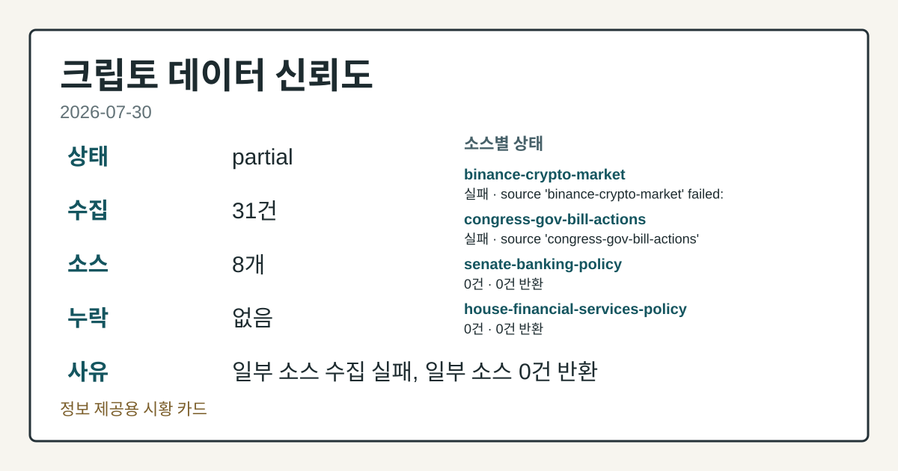
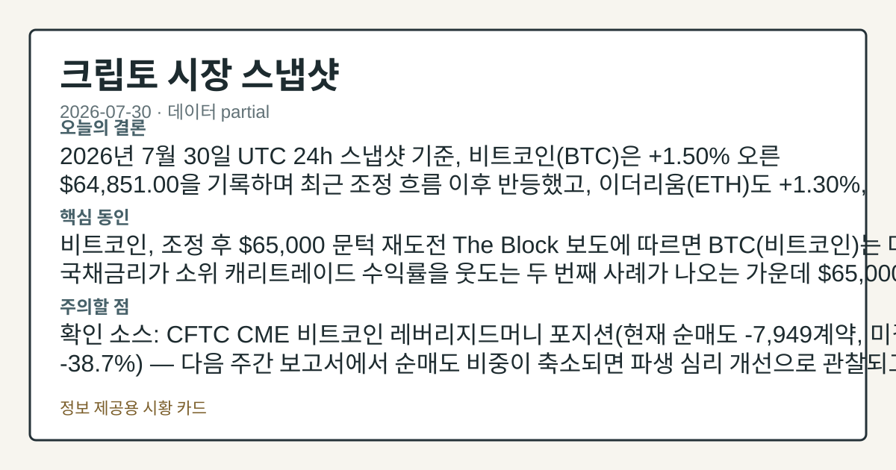
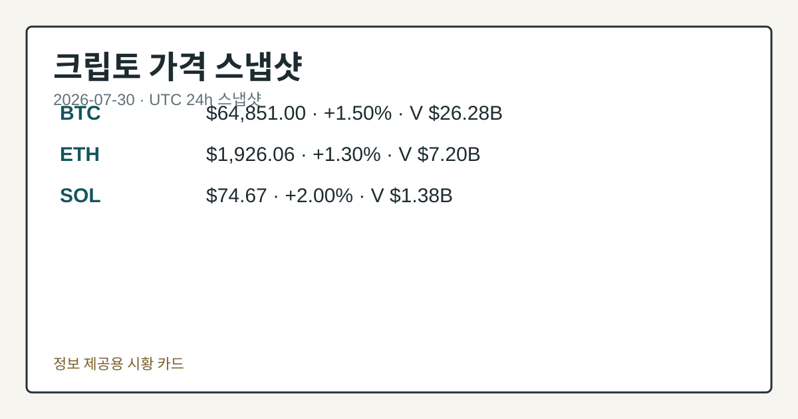
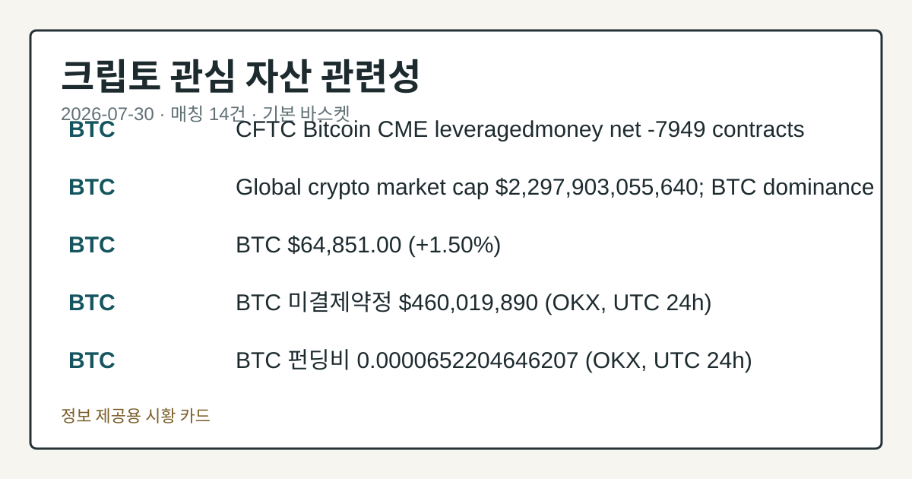

# 2026-07-30 크립토 시황
> 정보 제공용 자동 시황이며 가상자산 매매 권유가 아닙니다. 가상자산은 가격 변동성이 매우 큽니다.
# 2026-07-30 크립토 시황
**기준 시각**: 2026-07-30 UTC · 수집창 2026-07-30T00:00Z ~ 2026-07-31T00:00Z (종료 미포함)
| 종목 | 스냅샷(UTC 24h) | 구간 변동 | 비고 |
|------|------|------|------|
| BTC-USD | 64,867.56 | +1.50% | +10.77% from 52w low · -26.89% YTD |
| ETH-USD | 1,926.54 | +0.94% | +23.12% from 52w low · -35.79% YTD |
**세그먼트**: [국내 증시](../../../domestic-equity/2026/07/2026-07-30.md) | [미국 증시](../../../us-equity/2026/07/2026-07-30.md) | [크립토](2026-07-30.md)
<!-- investo:block visual:crypto.visual.curated-context-image -->

*이미지: 큐레이션 시황 이미지 · 출처: 외부 라이선스 이미지 · 생성: investo 0.1.0 · 2026-07-30 UTC*
<!-- /investo:block visual:crypto.visual.curated-context-image -->
> **내 관심 자산 영향**: 14건 확인 (기본 바스켓) — BTC: 직접 관련 · [cftc-cot-positioning] CFTC Bitcoin CME leveraged_money net -7949 contracts; BTC: 직접 관련 · [coingecko-global-market] Global crypto market cap **$2,297,903,055,640**; BTC dominance **56.58%**; BTC: 직접 관련 · [coingecko-price] BTC **$64,851.00** (**+1.50%**); BTC: 직접 관련 · [okx-derivatives] BTC 미결제약정 **$460,019,890** (OKX, UTC 24h); BTC: 직접 관련 · [okx-derivatives] BTC 펀딩비 0.0000652204646207 (OKX, UTC 24h) 외
> **오늘의 결론**: 2026년 7월 30일 UTC 24h 스냅샷 기준, 비트코인(BTC)은 **+1.50%** 오른 **$64,851.00**을 기록하며 최근 조정 본문 참고.
> **핵심 동인**: 비트코인, 조정 후 **$65,000** 문턱 재도전 The Block 보도에 따르면 BTC(비트코인)는 미국 국채금리가 소위 캐리트레이드 수익률을 본문 참고.
> **주의할 점**: 확인 소스: CFTC CME 비트코인 레버리지드머니 포지션(현재 순매도 -7,949계약, 미결제약정 대비 **-38.7%**) — 다음 주간 본문 참고.
## 한눈에 보기
가상자산 전체 시가총액이 UTC 24h 기준 **+1.25%** 늘어난 **$2.30T**, BTC(비트코인)는 **+1.50%** 오른 본문 참고.
CME(시카고상업거래소) BTC·ETH 레버리지드머니 포지션은 각각 순매도 **-7,949**계약, **-7,053**계약으로 파생시장은 여전히 방어적이다.
미국채 10년물 금리 **4.68%**가 '기다리면 이득'인 캐리트레이드 구도를 흔들고 있어 본문 §④ 참조.
## ⓪ 오늘의 매크로
**FOMC 일정** — 2026-08-19 — FOMC Minutes
**미 국채 수익률** — UST curve 2026-07-30: 10Y 4.68%, 2Y10Y +0.45pp
## ⓪-A 크립토 지표 (UTC 24h 스냅샷)
| 지표 | 값 |
|------|------|
| 공포·탐욕 | 28 (Fear) |
| BTC 도미넌스 | 56.58% |
| 전체 시총 | $2.30T (+1.25% 24h) |
| BTC 펀딩비 | 0.0000652204646207 (okx) |
| BTC 미결제약정 | $460.0M (okx) |
| DeFi TVL | $75.6B |
| 스테이블코인 공급 | $306.8B |
| 24h 청산 / 거래소 순유출입 | 무료 검증 소스 미확정 |
## ⓪-B 채널 기준선
| 기준선 | 값 |
|------|------|
| 비트코인 | 64,867.56 (+1.50%) |
| 이더리움 | 1,926.54 (+0.94%) |
| BTC 도미넌스 | 56.58% |
| 공포·탐욕 | 28 |
| 펀딩/OI/청산 | 펀딩 0.0000652204646207 · OI 수집됨 |
| CFTC 코인 포지셔닝 | Bitcoin CME 순포지션 -7949계약 (-38.72% OI), 2026-07-21 기준/2026-07-24 공개 · Ether CME 순포지션 -7053계약 (-29.80% OI), 2026-07-21 기준/2026-07-24 공개 · 주간 지연 |
> **크로스마켓 연결 고리**: 금리 이벤트가 할인율/달러 경로의 공통 변수로 남아 있습니다.
> **오늘의 큰 그림:** 이 세그먼트의 공통 신호는 제한적입니다. 본문 수급·지표 항목을 먼저 확인하세요.
## ① 요약

<!-- investo:block visual:crypto.visual.data-confidence -->

*이미지: 데이터 신뢰도 · 출처: investo 자체 생성 · 생성: investo 0.1.0 · 2026-07-30 UTC*
<!-- /investo:block visual:crypto.visual.data-confidence -->

<!-- investo:block visual:crypto.visual.market-snapshot -->

*이미지: 시장 스냅샷 · 출처: investo 자체 생성 · 생성: investo 0.1.0 · 2026-07-30 UTC*
<!-- /investo:block visual:crypto.visual.market-snapshot -->

2026년 7월 30일 UTC 24h 스냅샷 기준, 비트코인은 **+1.50%** 오른 **$64,851.00**을 기록하며 최근 조정 흐름 이후 반등했고, 이더리움도 **+1.30%**, 솔라나도 **+2.00%** 상승했다. 전체 가상자산 시가총액은 **+1.25%** 늘어난 **$2.30T**, BTC 도미넌스(비트코인 시장 지배력)는 **56.58%**를 나타냈다. 다만 CME(시카고상업거래소) 파생시장에서는 BTC·ETH 레버리지드머니 포지션이 여전히 순매도 우위이고 크립토 공포·탐욕지수도 28(Fear)에 머물러, 가격은 반등했지만 포지셔닝·심리 지표는 아직 방어적인 모습이다. [혼재]

## ② 전일 핵심 이슈

### 비트코인, 조정 후 **$65,000** 문턱 재도전

[The Block](https://www.theblock.co/post/410163/paid-to-wait-bitcoin-presses-toward-65000-as-treasuries-out-yield-carry-trade-for-only-second-time-on-record) 보도에 따르면 BTC(비트코인)는 미국 국채금리가 소위 캐리트레이드 수익률을 웃도는 두 번째 사례가 나오는 가운데 **$65,000** 근접권으로 상승했고, 완화된 경제지표가 9월 연준 금리 인상 우려를 낮추는 배경도 함께 거론됐다. 현물 거래량은 다년 최저권 부근으로 전해졌다.

> **그래서 의미는?** 가격은 오르지만 실제 거래 활력은 아직 약하다는 뜻입니다.

### 클래리티법 통과 지연 — JPMorgan 진단

[The Block](https://www.theblock.co/post/410185/jpmorgan-crypto-bill-clarity-act-market-outlook) 보도에 따르면 JPMorgan 분석팀은 CLARITY Act(가상자산 시장구조법)의 연내 상원 통과 가능성이 낮아진 점이 크립토 시장 전망에 부담이며, 법안 일부는 기관 투자자의 시장 접근 유인을 오히려 낮출 수 있다고 진단했다. 이는 통과 여부를 단정하는 진단이 아니라 해당 시점 기준 시장 심리에 대한 분석사 견해로 전해졌다.

## ③ 섹터/수급 동향

### CME 파생 포지셔닝, BTC·ETH 모두 순매도 우위

[CFTC](https://www.cftc.gov/MarketReports/CommitmentsofTraders/index.htm)(미국 상품선물거래위원회) 주간 보고서에 따르면 CME 비트코인 레버리지드머니(레버리지 활용 포지션) 순포지션은 롱 4,042·숏 11,991로 순매도 **-7,949**계약(미결제약정 대비 **-38.7%**)이며, 이더리움도 롱 2,223·숏 9,276으로 순매도 **-7,053**계약으로 집계됐다. 두 자산 모두 파생시장에서는 방어적 포지셔닝이 이어지고 있다.

> **그래서 의미는?** 큰손 파생 포지션이 여전히 하락 쪽에 무게를 두고 있다는 뜻입니다.

### Aave, 자산군 정리 제안

[The Block](https://www.theblock.co/post/410127/aave-proposes-reserve-deprecations-affecting-98-million-in-supplied-assets) 보도에 따르면 DeFi(탈중앙화 금융) 프로토콜 Aave는 75개 준비금과 6개 배포를 폐지하는 제안을 냈으며, 이는 공급 자산 **$98.1M**과 부채 **$15.6M**에 영향을 준다.

## ④ 지표·이벤트

### 시가총액과 도미넌스

[CoinGecko](https://www.coingecko.com/en/global-charts) 기준 전체 가상자산 시가총액은 **$2,297,903,055,640**(약 **$2.30T**)이며, BTC 도미넌스는 **56.58%**로 집계됐다.

> **그래서 의미는?** 자금이 비트코인에 상대적으로 더 쏠려 있다는 뜻입니다.

### 국채금리와 투자심리

[미국 재무부](https://home.treasury.gov/resource-center/data-chart-center/interest-rates) 데이터에 따르면 10년물 국채금리는 **4.68%**(3개월물 **3.82%**, 2년물 **4.23%**, 30년물 **5.21%**), 2Y10Y 스프레드(2년물-10년물 금리차)는 **+0.45%p**를 나타냈다. [Alternative.me](https://alternative.me/crypto/fear-and-greed-index/) 크립토 공포·탐욕지수(Fear & Greed Index)는 **28**로 Fear 구간에 머물렀다.

### 온체인·파생 지표

[DefiLlama](https://defillama.com/) 기준 DeFi TVL(락업예치자산총액)은 **$75.6B**로 Ethereum(41.5B)이 최상위였으며, 스테이블코인 공급은 **$306.8B**로 USDT(183.3B)가 최대 비중을 차지했다. OKX 기준 BTC 미결제약정은 **$460.0M**, BTC 펀딩비는 0.0000652204646207로 UTC 24h 스냅샷에 집계됐다. 24h 정리·거래소 순유출입은 데이터 미수집이다.

## ⑤ 주요 종목
<!-- investo:block chart:crypto.chart.market -->

<!-- u50 lightweight-charts-embed: placeholders consumed by site_docs/assets/investo-chart-init.js -->

<noscript><em>인터랙티브 차트는 JavaScript가 활성화된 환경에서 표시됩니다. 위 정적 카드가 동일한 정보를 담고 있습니다.</em></noscript>

<!-- /investo:block chart:crypto.chart.market -->

<!-- investo:block visual:crypto.visual.price-snapshot -->

*이미지: 가격 스냅샷 · 출처: investo 자체 생성 · 생성: investo 0.1.0 · 2026-07-30 UTC*
<!-- /investo:block visual:crypto.visual.price-snapshot -->

### 가격 스냅샷

[CoinGecko](https://www.coingecko.com/en/coins/bitcoin) 기준 BTC(비트코인)는 **+1.50%** 오른 **$64,851.00**(24h 거래대금 **$26,280,995,056**, 구간 고가 **$65,056.00**·저가 **$63,548.00**)을 기록했다. ETH(이더리움)는 **+1.30%** 오른 **$1,926.06**, SOL(솔라나)은 **+2.00%** 오른 **$74.67**로 함께 상승했다.

> **그래서 의미는?** BTC·ETH·SOL 대형 자산이 동반 상승했다는 뜻입니다.

### 실적·재무 확인

[The Block](https://www.theblock.co/post/410208/coinbase-shares-slip-after-q2-results-despite-prediction-markets-doubling-and-record-trading-market-share) 보도에 따르면 Coinbase 주가는 2분기 실적 발표 후 하락했으며, 순매출의 88%가 비트코인 현물 거래 외 부문에서 나온다고 밝혔다. [The Block](https://www.theblock.co/post/410212/strategy-posts-8-2-billion-loss-as-bitcoin-holdings-increase-11-during-q2) 보도에 따르면 Strategy는 2분기 **$8.2B** 손실을 기록했지만 비트코인 보유량은 11% 증가했다고 밝혔다.

### 채굴·인프라 관전

[The Block](https://www.theblock.co/post/410173/iren-core-scientific-bitcoin-mining-stocks-surge-aschenbrenner-funds-portfolio-liquidation) 보도에 따르면 IREN, Core Scientific 등 채굴주는 Aschenbrenner 펀드가 **$1B** 규모 AI 인프라 포트폴리오를 정리했다는 소식에 함께 올랐다. [The Block](https://www.theblock.co/post/410148/hyperscale-data-sells-100-bitcoin-to-fund-michigan-ai-data-center) 보도에 따르면 Hyperscale Data는 비트코인 100개를 매각해 미시간 AI 데이터센터 건설 자금을 마련했다. [The Block](https://www.theblock.co/post/410140/bernstein-says-core-scientifics-amd-partnership-could-generate-14b-over-15-years) 보도에 따르면 Bernstein은 Core Scientific의 AMD 파트너십 가치를 15년간 **$14B**로 평가했다.

## ⑥ 오늘의 관전 포인트

<!-- investo:block visual:crypto.visual.watchlist-relevance -->

*이미지: 관심 자산 관련성 · 출처: investo 자체 생성 · 생성: investo 0.1.0 · 2026-07-30 UTC*
<!-- /investo:block visual:crypto.visual.watchlist-relevance -->

> **관전 포인트**: 오늘은 공개 근거가 충분한 관전 신호만 본문에 남겼습니다.

> **데이터 상태**: 부분

수집/품질 진단

> **데이터 상태**: 부분 — 수집 31건 / 소스 8개 / 누락: 없음 · 부분 — 일부 카테고리 미수집, 본문 일부 결론 보강 필요
> **소스 카운트**: 수집 대상 13 / 성공 9 / 수집 상세는 진단 섹션에서 확인할 수 있습니다. / 수집 상세는 진단 섹션에서 확인할 수 있습니다. / 수집 상세는 진단 섹션에서 확인할 수 있습니다.
> **소스 등급 분포**: S=2 / A=2 / B=5
> **상세 사유**: 일부 소스 수집 실패, 일부 소스 0건 반환
> **소스별 상태**: binance-crypto-market 실패 (접근 제한), congress-gov-bill-actions 실패 (설정 미완료(미수집)), senate-banking-policy 0건, house-financial-services-policy 0건, 정상 9개

## ⑦ 면책조항
본 시황은 일반 정보 제공을 목적으로 자동 생성된 자료이며,
특정 가상자산에 대한 매매 권유나 투자 자문이 아닙니다.
가상자산은 가상자산이용자보호법(2024-07-19 시행) §10·§19의 적용 대상으로,
24시간 거래되는 비제도권 자산이며 가격 변동성이 매우 크고 원금 전액 손실이 가능합니다.
투자 결정과 그 결과에 대한 책임은 전적으로 본인에게 있으며,
본 시황의 내용에 따라 발생한 손실에 대해 작성자는 일체의 책임을 지지 않습니다.