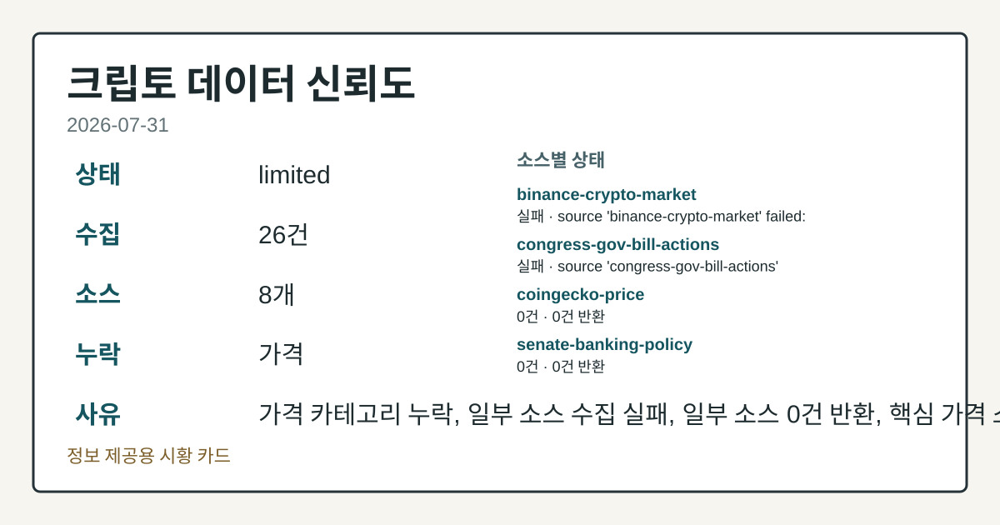
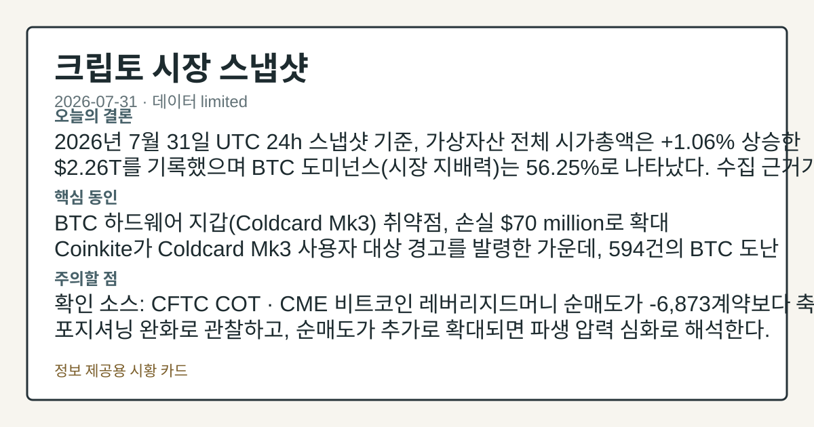
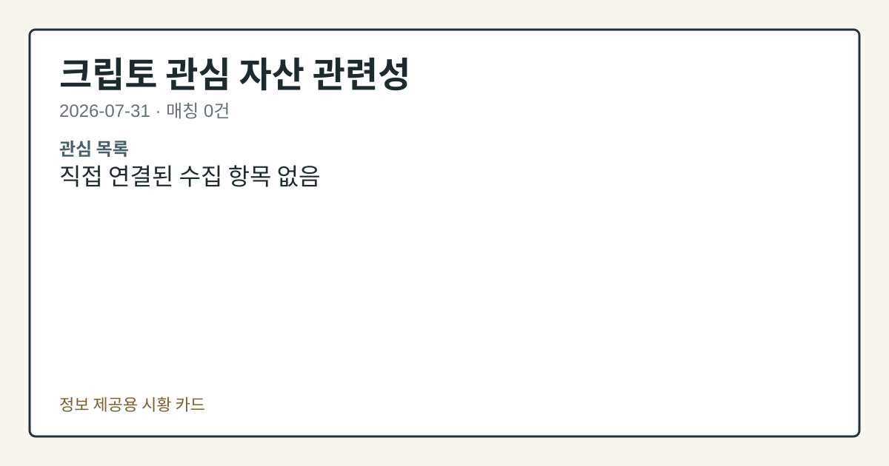

# 2026-07-31 크립토 시황
> 정보 제공용 자동 시황이며 가상자산 매매 권유가 아닙니다. 가상자산은 가격 변동성이 매우 큽니다.
# 2026-07-31 크립토 시황
**기준 시각**: 2026-07-31 UTC · 수집창 2026-07-31T00:00Z ~ 2026-08-01T00:00Z (종료 미포함)
| 종목 | 스냅샷(UTC 24h) | 구간 변동 | 비고 |
|------|------|------|------|
| BTC-USD | 63,355.54 | +0.94% | +8.19% from 52w low · -28.60% YTD |
| ETH-USD | 1,880.10 | +1.99% | +20.15% from 52w low · -37.34% YTD |
**세그먼트**: [국내 증시](../../../domestic-equity/2026/07/2026-07-31.md) | [미국 증시](../../../us-equity/2026/07/2026-07-31.md) | [크립토](2026-07-31.md)
<!-- investo:block visual:crypto.visual.curated-context-image -->

*이미지: 큐레이션 시황 이미지 · 출처: 외부 라이선스 이미지 · 생성: investo 0.1.0 · 2026-08-02 UTC*
<!-- /investo:block visual:crypto.visual.curated-context-image -->
> **내 관심 자산 영향**: 데이터 수집 부족으로 매칭 판단 보류 — 추가 수집 후 재평가됩니다.
> **오늘의 결론**: 2026년 7월 31일 UTC 24h 스냅샷 기준, 가상자산 전체 시가총액은 **+1.06%** 상승한 **$2.26T**를 기록했으며 BTC 본문 참고.
> **핵심 동인**: BTC 하드웨어 지갑(Coldcard Mk3) 취약점, 손실 **$70** million로 확대 Coinkite가 Coldcard Mk3 사용자 본문 참고.
> **주의할 점**: 확인 소스: CFTC COT · CME 비트코인 레버리지드머니 순매도가 -6,873계약보다 축소되면 포지셔닝 완화로 관찰하고, 순매도가 추가로 본문 참고.
## 한눈에 보기
가상자산 전체 시가총액이 UTC 24h 기준 **+1.06%** 상승해 **$2.26T** 구간을 유지했고, BTC 도미넌스는 **56.25%**를 나타냈다.
Coldcard Mk3 하드웨어 지갑 취약점발 손실이 Galaxy Research 집계로 **$70** million까지 불어났다.
CME 비트코인 레버리지드머니가 순매도 **-6,873**계약(미결제약정 대비 **-34.3%**)을 기록해 파생 포지셔닝 위축이 나타났다 — 본문 §③ 참조.
## ⓪ 오늘의 매크로
**국제 유가** — CFTC WTI crude oil managed_money net +92943 contracts
**미 국채 수익률** — UST curve 2026-07-31: 10Y 4.75%, 2Y10Y +0.47pp
## ⓪-A 크립토 지표 (UTC 24h 스냅샷)
| 지표 | 값 |
|------|------|
| 공포·탐욕 | 27 (Fear) |
| BTC 도미넌스 | 56.25% |
| 전체 시총 | $2.26T (+1.06% 24h) |
| BTC 펀딩비 | 0.0000625023257314 (okx) |
| BTC 미결제약정 | $462.3M (okx) |
| DeFi TVL | $74.6B |
| 스테이블코인 공급 | $306.7B |
| 24h 청산 / 거래소 순유출입 | 무료 검증 소스 미확정 |
## ⓪-B 채널 기준선
| 기준선 | 값 |
|------|------|
| 비트코인 | 63,355.54 (+0.94%) |
| 이더리움 | 1,880.10 (+1.99%) |
| BTC 도미넌스 | 56.25% |
| 공포·탐욕 | 27 |
| 펀딩/OI/청산 | 펀딩 0.0000625023257314 · OI 수집됨 |
| CFTC 코인 포지셔닝 | Bitcoin CME 순포지션 -6873계약 (-34.33% OI), 2026-07-28 기준/2026-07-31 공개 · Ether CME 순포지션 -5396계약 (-22.62% OI), 2026-07-28 기준/2026-07-31 공개 · 주간 지연 |
> **크로스마켓 연결 고리**: 유가/지정학 이슈가 여러 자산군의 변동성 연결 고리로 관찰됩니다. / 금리 이벤트가 할인율/달러 경로의 공통 변수로 남아 있습니다.
> **오늘의 큰 그림:** 이 세그먼트의 공통 신호는 제한적입니다. 본문 수급·지표 항목을 먼저 확인하세요.
## ① 요약

<!-- investo:block visual:crypto.visual.data-confidence -->

*이미지: 데이터 신뢰도 · 출처: investo 자체 생성 · 생성: investo 0.1.0 · 2026-08-02 UTC*
<!-- /investo:block visual:crypto.visual.data-confidence -->

<!-- investo:block visual:crypto.visual.market-snapshot -->

*이미지: 시장 스냅샷 · 출처: investo 자체 생성 · 생성: investo 0.1.0 · 2026-08-02 UTC*
<!-- /investo:block visual:crypto.visual.market-snapshot -->

2026년 7월 31일 UTC 24h 스냅샷 기준, 가상자산 전체 시가총액은 **+1.06%** 상승한 **$2.26T**를 기록했으며 BTC 도미넌스는 **56.25%**로 나타났다. 공포·탐욕(Fear & Greed) 지수는 27로 여전히 'Fear(공포)' 구간에 머물렀고, CFTC(미국 상품선물거래위원회) 최신 COT(투자자별 포지션) 보고서에서는 CME(시카고상업거래소) 비트코인 레버리지드머니(레버리지 활용 자금)가 순매도 -6,873계약(미결제약정 대비 **-34.3%**), 이더리움도 순매도 -5,396계약(**-22.6%**)으로 파생 포지셔닝이 위축된 모습을 보였다. 여기에 [Coldcard Mk3 지갑 취약점발 손실이 Galaxy Research 집계로 **$70** million까지 불어나며](https://www.theblock.co/post/410332/bitcoin-losses-linked-coldcard-vulnerability-70-million-galaxy-research) 보안 이슈가 부각됐다. 어제(7/30) 시총 반등 흐름이 이어지듯 오늘도 시총은 완만한 상승을 나타냈지만, 파생 포지셔닝과 투자심리 지표는 위축 쪽을 가리켜 방향이 엇갈렸다. [혼재]

## ② 전일 핵심 이슈

### BTC 하드웨어 지갑 취약점, 손실 **$70** million로 확대

Coinkite가 Coldcard Mk3 사용자 대상 경고를 발령한 가운데, 594건의 BTC 도난 신고가 접수됐다는 소식이 전해졌다. [Coinkite는 Mk3 사용자에게 강력한 고유 BIP-39(니모닉 시드 표준) 패스프레이즈를 기기에서 생성하고 결과 지갑으로 자금을 이전할 것을 권고](https://www.theblock.co/post/410235/coinkite-coldcard-mk3-warning)했다. Galaxy Research는 [이번 취약점과 연계된 손실이 1,200개에 가까운 주소에서 1,000 BTC 이상, 약 **$70** million 규모로 늘었다고 집계](https://www.theblock.co/post/410332/bitcoin-losses-linked-coldcard-vulnerability-70-million-galaxy-research)했다.

> **그래서 의미는?** 하드웨어 지갑 보안 결함은 자산 보관 신뢰도에 직접 영향을 줄 수 있어 확인이 필요합니다.

### 트럼프 크립토 자산 관련 정치적 스크루티니 확대

Senate Democrats가 [트럼프 대통령의 크립토 포트폴리오에 대한 스크루티니가 커지는 가운데 반부패국(anti-corruption bureau) 신설을 제안](https://www.theblock.co/post/410260/senate-democrat-anti-corruption-bureau)했다. 최근 재무 공개 자료에 따르면 트럼프는 크립토 관련 소득으로 수억 달러를 벌어들인 것으로 나타났다.

## ③ 섹터/수급 동향

### CME 파생 포지셔닝, BTC·ETH 모두 레버리지드머니 순매도

CFTC 최신 COT 보고서에 따르면, [CME 비트코인 레버리지드머니는 롱 3,295계약·숏 10,168계약으로 순매도 -6,873계약을 기록](https://www.cftc.gov/MarketReports/CommitmentsofTraders/index.htm)했다. 이더리움 역시 [롱 1,828계약·숏 7,224계약으로 순매도 -5,396계약](https://www.cftc.gov/MarketReports/CommitmentsofTraders/index.htm)을 나타내며 위클리 리포트 기준 파생 포지셔닝이 위축된 모습을 보였다.

> **그래서 의미는?** 대형 트레이더의 선물 포지션이 순매도 쪽으로 기운 점은 단기 수급 압력을 점검할 신호로 볼 수 있습니다.

### DeFi(탈중앙화 금융) TVL(총예치자산) **$74.6B**, 이더리움 선두 유지

[DeFiLlama 집계 기준 DeFi TVL은 **$74.6B**로](https://defillama.com/) 이더리움(Ethereum) **$41.0B**을 선두로 BSC **$4.9B**, Tron **$4.9B**, Solana **$4.8B**, Base **$4.6B** 순으로 나타났다. Sygnum의 Thomas Brunner는 [이더리움의 43일 스테이킹 대기열이 순수한 신규 수요 신호라기보다 메커니즘적 요인을 반영한다고](https://www.theblock.co/post/410285/ethereum-43-day-staking-queue-isnt-clean-demand-signal-sygnum) 평가했다.

## ④ 지표·이벤트

### 크립토 지표 스냅샷 — 시총 **$2.26T**, 공포·탐욕 27

[CoinGecko 집계 기준 가상자산 전체 시가총액은 **$2,260,245,229,769**(BTC 도미넌스 **56.25%**)](https://www.coingecko.com/en/global-charts)이며, [공포·탐욕 지수는 27로 Fear 구간](https://alternative.me/crypto/fear-and-greed-index/)에 위치했다. [스테이블코인 공급은 **$306.7B**로 USDT **$183.2B**가 최대 비중](https://defillama.com/)을 차지했고, USDC **$72.0B**, USDS **$6.6B**, DAI **$4.8B**, USD1 **$4.0B** 순으로 나타났다. [OKX 기준 BTC 미결제약정은 **$462,282,470**](https://www.okx.com/trade-swap/btc-usd-swap), [BTC 펀딩비는 0.0000625023257314](https://www.okx.com/trade-swap/btc-usd-swap)로 집계됐다. 24h 정리 및 거래소 순유출입 지표는 데이터 미수집 상태다.

> **그래서 의미는?** 시총·공포지수·펀딩비를 함께 보면 자금 흐름과 투자심리의 방향을 가늠할 수 있습니다.

## ⑤ 주요 종목
<!-- investo:block chart:crypto.chart.market -->

<!-- u50 lightweight-charts-embed: placeholders consumed by site_docs/assets/investo-chart-init.js -->

<noscript><em>인터랙티브 차트는 JavaScript가 활성화된 환경에서 표시됩니다. 위 정적 카드가 동일한 정보를 담고 있습니다.</em></noscript>

<!-- /investo:block chart:crypto.chart.market -->

### 실적 발표

Coinbase는 [2분기 실적이 예상을 밑돌며 월가 목표주가가 하향 조정](https://www.theblock.co/post/410316/coinbase-q2-miss-sparks-split-wall-street-analysts-debate-growth-beyond-trading)됐고, 애널리스트들은 크립토 트레이딩 외 성장성을 두고 의견이 엇갈렸다. Tether(테더)는 [2분기 순영업이익이 **$1.5** billion으로, 전년 동기 **$4.9** billion 순이익에서 줄며 초과 준비금이 **$4** billion 이상 감소](https://www.theblock.co/post/410305/tethers-excess-reserves-fall-by-more-than-4-billion-amid-weaker-q2-financial-results)했다고 밝혔다. Strategy(舊 MicroStrategy)는 [**$8.2** billion 규모 2분기 손실과 STRC(스트래티지 우선주)-to-par 전환 이후에도 TD Cowen과 Benchmark가 매수 의견을 유지](https://www.theblock.co/post/410297/strategy-cash-buildup-saylor-shifts-from-100-bitcoin-approach)했으며, Saylor는 '100% 비트코인' 접근에서 현금 비축으로 방향을 일부 전환한 것으로 전해졌다.

> **그래서 의미는?** Coinbase(코인베이스)·Tether·Strategy 실적은 크립토 기업 펀더멘털의 온도차를 보여줘 확인이 필요합니다.

### 규제/라이선스

Circle은 [OCC(통화감독청) 신탁 인가에 이어 NYDFS(뉴욕주 금융서비스국)로부터 Circle Internet Trust Company에 대한 제한적 신탁 라이선스를 획득](https://www.theblock.co/post/410275/circle-secures-nydfs-trust-charter-adding-state-layer-to-federal-usdc-oversight)하며 USDC 감독 체계에 주 단위 레이어를 추가했다.

### 체크리스트

Uniswap은 [Morpho와 손잡고 유휴 자산에 수익을 낼 수 있는 'Earn' 상품을 출시](https://www.theblock.co/post/410286/uniswap-morpho-earn-yield-gauntlet-vaults)했다. TD Cowen은 [2026년 이더리움 전망 하향과 함께 Sharplink 목표주가를 **$13**로 낮췄](https://www.theblock.co/post/410273/td-cowen-cuts-sharplink-price-target-to-13-on-lower-2026-ether-outlook)다. Bernstein은 [토큰화와 예측시장 확장을 근거로 Robinhood에 대해 78% 상승 여력을 제시](https://www.theblock.co/post/410259/bernstein-sees-78-upside-for-robinhood-as-tokenization-prediction-markets-expand-its-crypto-business)하며 **$160** 목표주가를 유지했다.

## ⑥ 오늘의 관전 포인트

<!-- investo:block visual:crypto.visual.watchlist-relevance -->

*이미지: 관심 자산 관련성 · 출처: investo 자체 생성 · 생성: investo 0.1.0 · 2026-08-02 UTC*
<!-- /investo:block visual:crypto.visual.watchlist-relevance -->

#### 관찰 신호: DeFi TVL

- 출처: DeFiLlama
- 현재: DeFiLlama · DeFi TVL이 **$74.6B**을 상회해 늘어나면 자금 유입 확대로 관찰하고, TVL이 감소 전환하면 자금 이탈로 해석한다. 관심 영향: 스테이블코인 공급 **$306.7B** 변화와 자금 흐름을 비교한다.
- 확인 조건: 상방 DeFi TVL이 **$74.6B**을 상회해 늘어나면 자금 유입 확대로 관찰하고; 하방 TVL이 감소 전환하면 자금 이탈로 해석한다
- 신뢰도: 높음
- 관심 영향: 스테이블코인 공급 **$306.7B** 변화와 자금 흐름을 비교한다.

> **데이터 상태**: 제한

수집/품질 진단

> **데이터 상태**: 제한 — 수집 26건 / 소스 8개 / 누락: 가격 · 제한 — 핵심 가격 소스 0건/실패/stale, 본문 결론 신뢰도 낮음
> **소스 카운트**: 수집 대상 13 / 성공 8 / 수집 상세는 진단 섹션에서 확인할 수 있습니다. / 수집 상세는 진단 섹션에서 확인할 수 있습니다. / 수집 상세는 진단 섹션에서 확인할 수 있습니다.
> **소스 등급 분포**: S=2 / A=2 / B=4
> **상세 사유**: 가격 카테고리 누락, 일부 소스 수집 실패, 일부 소스 0건 반환, 핵심 가격 소스 0건
> **소스별 상태**: binance-crypto-market 실패 (접근 제한), congress-gov-bill-actions 실패 (설정 미완료(미수집)), coingecko-price 0건, senate-banking-policy 0건, house-financial-services-policy 0건, 정상 8개

## ⑦ 면책조항
본 시황은 일반 정보 제공을 목적으로 자동 생성된 자료이며,
특정 가상자산에 대한 매매 권유나 투자 자문이 아닙니다.
가상자산은 가상자산이용자보호법(2024-07-19 시행) §10·§19의 적용 대상으로,
24시간 거래되는 비제도권 자산이며 가격 변동성이 매우 크고 원금 전액 손실이 가능합니다.
투자 결정과 그 결과에 대한 책임은 전적으로 본인에게 있으며,
본 시황의 내용에 따라 발생한 손실에 대해 작성자는 일체의 책임을 지지 않습니다.